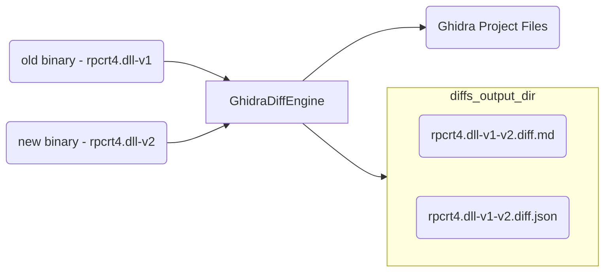

# ghidra-diff-engine

> An "engine" is a self-contained, but externally-controllable, piece of code that encapsulates powerful logic designed to perform a specific type of work.

## High Level



[GhidraDiffEngine](ghidra_diff_engine.py) is a self-contained binary diffing base class designed to leverage the power of Ghidra and its [FlatProgramAPI](https://ghidra.re/ghidra_docs/api/ghidra/program/flatapi/FlatProgramAPI.html) (via [pyhidra]()).


The base class implements first 3 steps of the Ghidra [headless workflow](https://github.com/clearbluejar/ghidra-python-vscode-devcontainer-skeleton#steps):
>1. **Create Ghidra Project** - Directory and collection of Ghidra project files and data
>2. **Import Binary to project** - Import one or more binaries to the project for analysis
>3. **Analyze Binary** - Ghidra will perform default binary analysis on each binary
>4. **Run Ghidra Python script**

The base class provides the abstract method [diff_bins](ghidra_diff_engine.py) to meet the 4th step of the normal workflow. Within the diff_bins method is where the actual "diffing" takes place. 

## Overall Design Goals

- Find added functions
- Find deleted functions
- Find modified functions
- Generate JSON capturing Diff Results
- Generate Markdown Diff

## Implementation 

The basic idea is create new diffing engines from the base class. 

```python
class NewDiffTool(GhidraDiffEngine):

    def __init__(self,verbose=False) -> None:
        super().__init__(verbose)

    def diff_bins(
            self,            
            old: Union[str, pathlib.Path],
            new: Union[str, pathlib.Path]
    ) -> dict:
        """My amazing differ"""

        # find added, deleted, and modified functions
        # <code goes here>
```


## Implementations

1. [GhidraSimpleDiff](simple_diff.py) - A "simple" Ghidra Diffing Engine Implementation. "Simple" as in it relies mostly on known symbols to find the differences between functions. 


## Ghidra Simple Diff


### Usage

```console
usage: simple_diff.py [-h] [-p PROJECT_LOCATION] [-n PROJECT_NAME] [-s SYMBOLS_PATH] [-o OUTPUT_PATH]
                      old new [new ...]

A simple Ghidra binary diffing tool

positional arguments:
  old                   Path to older version of binary "/somewhere/bin.old"
  new                   Path to new version of binary '/somewhere/bin.new'. For multiple binaries add
                        oldest to newest

options:
  -h, --help            show this help message and exit

Ghidra options:
  -p PROJECT_LOCATION, --project-location PROJECT_LOCATION
                        Ghidra Project Path
  -n PROJECT_NAME, --project-name PROJECT_NAME
                        Ghidra Project Name
  -s SYMBOLS_PATH, --symbols-path SYMBOLS_PATH
                        Ghidra local symbol store directory
  -o OUTPUT_PATH, --output-path OUTPUT_PATH
```

## Quick Start Environment Setup

Follow directions from that repo template [Quick Start](https://github.com/clearbluejar/ghidra-python-vscode-devcontainer-skeleton#quick-start-setup---dev-container--best-option)


