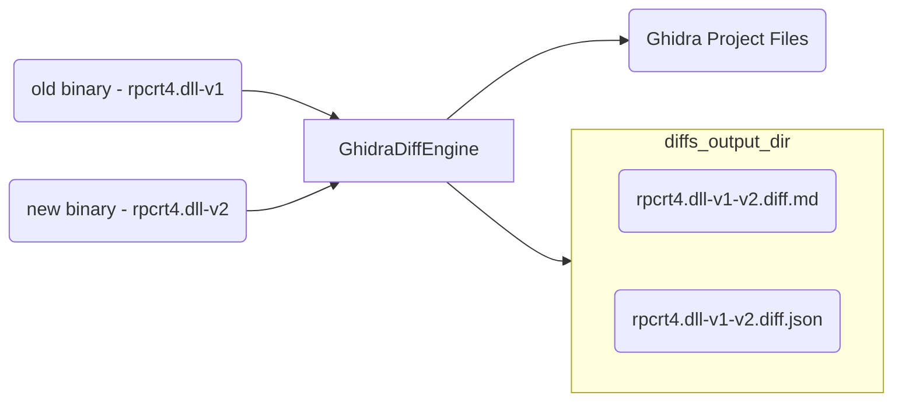

# Ghidriff - A Binary Diffing Engine Powered by Ghidra


`ghidriff` is a [Ghidra](https://ghidra-sre.org/) enabled binary diffing engine. It leverages the power of Ghidra's SRE [FlatProgramAPI](https://ghidra.re/ghidra_docs/api/ghidra/program/flatapi/FlatProgramAPI.html) to find the *added*, *deleted*, and *modified* functions of two arbitrary binaries. 

It's primary use case is for patch diffing. It is written in Python 3 using `pyhidra` and as the interface to Ghidra.

## High Level



## Features

- Highlights important changes in the TOC
- Fast - Can diff the full Windows kernel in less than a minute.
- Beautiful Markdown Output
  - [Visual Diff] Results
  - Easily hosted in a gist
  - Callgraphs support
- Supports both unified and side by side diff results (unified is default)

The heavy lifting of the binary analysis is done by Ghidra.  This library is just the glue that puts it all together. 

## About

> An "engine" is a self-contained, but externally-controllable, piece of code that encapsulates powerful logic designed to perform a specific type of work.

`ghidriff` is provides a core base class, [GhidraDiffEngine](ghidriff/ghidra_diff_engine.py), that can be extended to create your own binary diffing [implementations](#implementations).

The base class implements first 3 steps of the Ghidra [headless workflow](https://github.com/clearbluejar/ghidra-python-vscode-devcontainer-skeleton#steps):
>1. **Create Ghidra Project** - Directory and collection of Ghidra project files and data
>2. **Import Binary to project** - Import one or more binaries to the project for analysis
>3. **Analyze Binary** - Ghidra will perform default binary analysis on each binary

The base class provides the abstract method [find_matches](ghidriff/ghidra_diff_engine.py) where the actual "diffing" takes place.

## Implementation 

The basic idea is create new diffing tools by implementing the `find_matches` method from the base class. 

```python
class NewDiffTool(GhidraDiffEngine):

    def __init__(self,verbose=False) -> None:
        super().__init__(verbose)

    @abstractmethod
    def find_matches(
            self,            
            old: Union[str, pathlib.Path],
            new: Union[str, pathlib.Path]
    ) -> dict:
        """My amazing differ"""

        # find added, deleted, and modified functions
        # <code goes here>

        return [unmatched, matched]
```

## Implementations

There are currently 3 differs, which display the evolution of diffing for the project.

1. [SimpleDiff](ghidriff/simple_diff.py) - A simple diff finding implementation. "Simple" as in it relies mostly on known symbols to find the differences between functions.
2. [StructualGraphDiff](ghidriff/structural_graph_diff.py) - A slightly more advanced differ, begining to perform some more advanced hashing (such as Halvar's Structural Graph Comparison)
3. [VersionTrackingDiff](ghidriff/version_tracking_diff.py) - The latest differ, with several [correlators](ghidriff/correlators.py) (an algorithm used to score specific associations based on code, program flow, or any observable aspect of comparison) for function matching. **This one is fast.**

Each implementation leverags the base class, and implements `find_changes`. Let's take a look at the `VersionTrackingDiff`

### Ghidra Version Tracking Differ


#### Usage

```bash
usage: ghidriff [-h] [--engine {SimpleDiff,StructualGraphDiff,VersionTrackingDiff}] [-o OUTPUT_PATH] [-p PROJECT_LOCATION] [-n PROJECT_NAME] [-s SYMBOLS_PATH] [--threaded | --no-threaded]
                [--force-analysis] [--force-diff] [--log-level {CRITICAL,FATAL,ERROR,WARN,WARNING,INFO,DEBUG,NOTSET}] [--file-log-level {CRITICAL,FATAL,ERROR,WARN,WARNING,INFO,DEBUG,NOTSET}]
                [--log-path LOG_PATH] [--max-ram-percent MAX_RAM_PERCENT] [--print-flags] [--jvm-args [JVM_ARGS]] [--sxs] [--max-section-funcs MAX_SECTION_FUNCS]
                old new [new ...]

ghidriff - A Command Line Ghidra Binary Diffing Engine

positional arguments:
  old                   Path to old version of binary '/somewhere/bin.old'
  new                   Path to new version of binary '/somewhere/bin.new'. (For multiple new binaries add oldest to newest)

options:
  -h, --help            show this help message and exit
  --engine {SimpleDiff,StructualGraphDiff,VersionTrackingDiff}
                        The diff implementation to use. (default: VersionTrackingDiff)
  -o OUTPUT_PATH, --output-path OUTPUT_PATH
                        Output path for resulting diffs (default: .ghidriffs)

Ghidra Project Options:
  -p PROJECT_LOCATION, --project-location PROJECT_LOCATION
                        Ghidra Project Path (default: .ghidra_projects)
  -n PROJECT_NAME, --project-name PROJECT_NAME
                        Ghidra Project Name (default: diff_project)
  -s SYMBOLS_PATH, --symbols-path SYMBOLS_PATH
                        Ghidra local symbol store directory (default: .symbols)

Engine Options:
  --threaded, --no-threaded
                        Use threading during import, analysis, and diffing. Recommended (default: True)
  --force-analysis      Force a new binary analysis each run (slow) (default: False)
  --force-diff          Force binary diff (ignore arch/symbols mismatch) (default: False)
  --log-level {CRITICAL,FATAL,ERROR,WARN,WARNING,INFO,DEBUG,NOTSET}
                        Set console log level (default: INFO)
  --file-log-level {CRITICAL,FATAL,ERROR,WARN,WARNING,INFO,DEBUG,NOTSET}
                        Set log file level (default: INFO)
  --log-path LOG_PATH   Set ghidriff log path. (default: ghidriff.log)

JVM Options:
  --max-ram-percent MAX_RAM_PERCENT
                        Set JVM Max Ram % of host RAM (default: 60.0)
  --print-flags         Print JVM flags at start (default: False)
  --jvm-args [JVM_ARGS]
                        JVM args to add at start (default: None)

Markdown Options:
  --sxs                 Include side by side code diff (default: False)
  --max-section-funcs MAX_SECTION_FUNCS
                        Max number of functions to display per section. (default: 200)
```

## Quick Start Environment Setup

Follow directions from that repo template [Quick Start](https://github.com/clearbluejar/ghidra-python-vscode-devcontainer-skeleton#quick-start-setup---dev-container--best-option)


## Overall Design Goals

- Fast 
- Find added functions
- Find deleted functions
- Find modified functions
- Generate JSON capturing Diff Results
- Generate Markdown Diff
