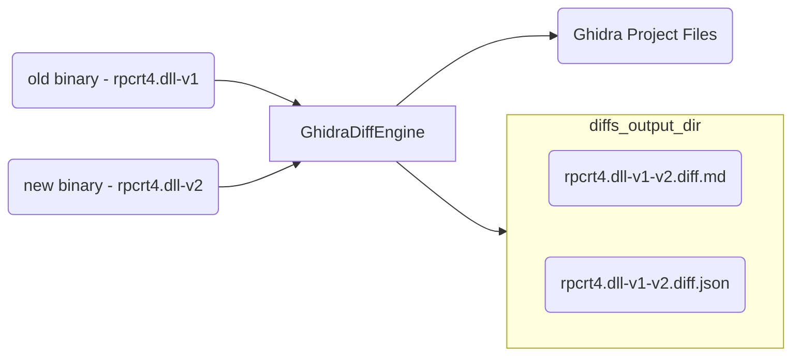

# Ghidriff - Ghidra Diffing Engine

`ghidriff` is a Python package providing a binary diffing engine. It is a tool that leverages the power of Ghidra's [FlatProgramAPI](https://ghidra.re/ghidra_docs/api/ghidra/program/flatapi/FlatProgramAPI.html) to find the *added*, *deleted*, and *modified* functions of two arbitrary binaries. It's primary use case if for patch diffing.

## High Level



## Features

- Highlights important changes in the TOC
- Fast - Can diff the full Windows kernel in less than a minute.
- Beautiful Markdown Output
  - [Visual Diff] Results
  - Easily hosted in a gist
  - Callgraphs support
- Supports both unified and side by side diff results (unified is default)

The heavy lifting of the binary analysis is done by Ghidra.  This library is just the glue that puts it all together. 

## About

> An "engine" is a self-contained, but externally-controllable, piece of code that encapsulates powerful logic designed to perform a specific type of work.

`ghidriff` is composed of a core [GhidraDiffEngine](ghidra_diff_engine.py), a self-contained base class that can be extended to create your own binary diffing [implementations](#implementations).

The base class implements first 3 steps of the Ghidra [headless workflow](https://github.com/clearbluejar/ghidra-python-vscode-devcontainer-skeleton#steps):
>1. **Create Ghidra Project** - Directory and collection of Ghidra project files and data
>2. **Import Binary to project** - Import one or more binaries to the project for analysis
>3. **Analyze Binary** - Ghidra will perform default binary analysis on each binary

The base class provides the abstract method [find_matches](ghidra_diff_engine.py) where the actual "diffing" takes place. 

## Implementation 

The basic idea is create new diffing tools from the base class. 

```python
class NewDiffTool(GhidraDiffEngine):

    def __init__(self,verbose=False) -> None:
        super().__init__(verbose)

    def find_matches(
            self,            
            old: Union[str, pathlib.Path],
            new: Union[str, pathlib.Path]
    ) -> dict:
        """My amazing differ"""

        # find added, deleted, and modified functions
        # <code goes here>
```

## Implementations

There are currently 3 differs, which display the evolution of diffing for the project. 

1. [GhidraSimpleDiff](simple_diff.py) - A simple diff finding implementation. "Simple" as in it relies mostly on known symbols to find the differences between functions.
2. [GhidraStructualGraphDiff](ghidra_diff_engine/structural_graph_diff.py) - A slight more advanced differ, begining to perform some more advanced hashing (such as )
3. [VersionTrackingDiff]

### Ghidra Version Tracking Differ


#### Usage

```bash
python -m ghidriff.version_tracking_diff -h
usage: version_tracking_diff.py [-h] [-o OUTPUT_PATH] [-p PROJECT_LOCATION] [-n PROJECT_NAME] [-s SYMBOLS_PATH] [--sxs | --no-sxs] old new [new ...]

Ghidra Version Tracking Style Binary Diffing Tool

positional arguments:
  old                   Path to older version of binary "/somewhere/bin.old"
  new                   Path to new version of binary '/somewhere/bin.new'. For multiple binaries add oldest to newest

options:
  -h, --help            show this help message and exit
  -o OUTPUT_PATH, --output-path OUTPUT_PATH
                        Output path for resulting diff

Ghidra options:
  -p PROJECT_LOCATION, --project-location PROJECT_LOCATION
                        Ghidra Project Path
  -n PROJECT_NAME, --project-name PROJECT_NAME
                        Ghidra Project Name
  -s SYMBOLS_PATH, --symbols-path SYMBOLS_PATH
                        Ghidra local symbol store directory

Diff Markdown Options:
  --sxs, --no-sxs       Diff Markdown includes side by side diff (default: False)
```

## Quick Start Environment Setup

Follow directions from that repo template [Quick Start](https://github.com/clearbluejar/ghidra-python-vscode-devcontainer-skeleton#quick-start-setup---dev-container--best-option)


## Overall Design Goals

- Fast 
- Find added functions
- Find deleted functions
- Find modified functions
- Generate JSON capturing Diff Results
- Generate Markdown Diff