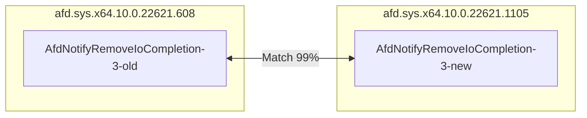
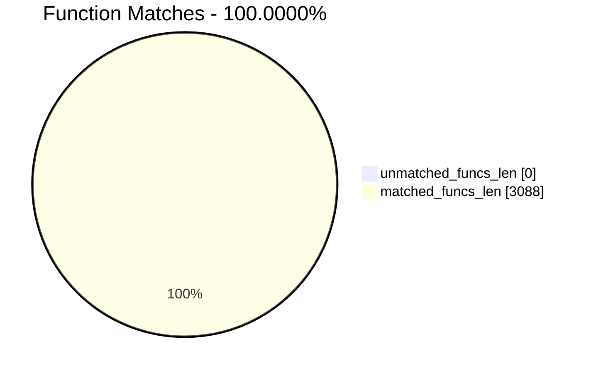
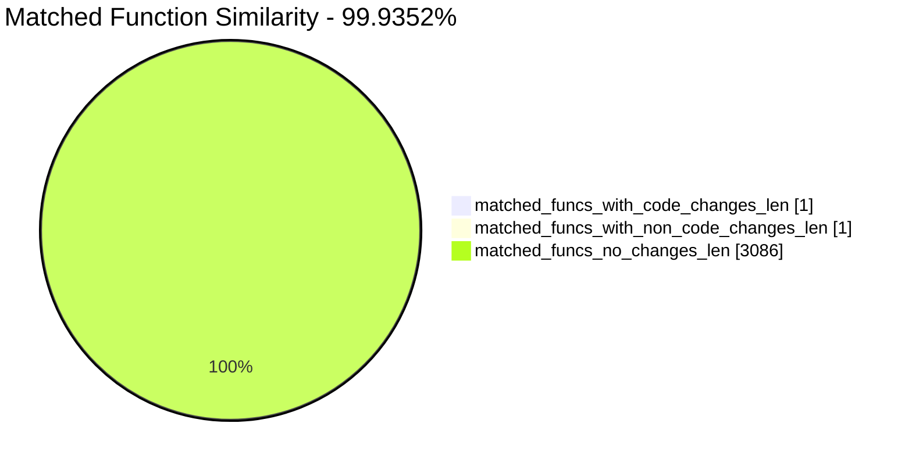
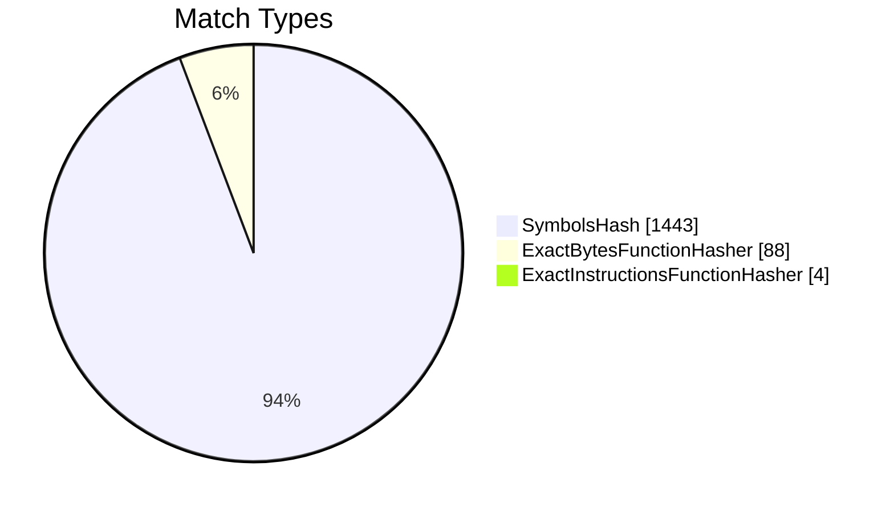
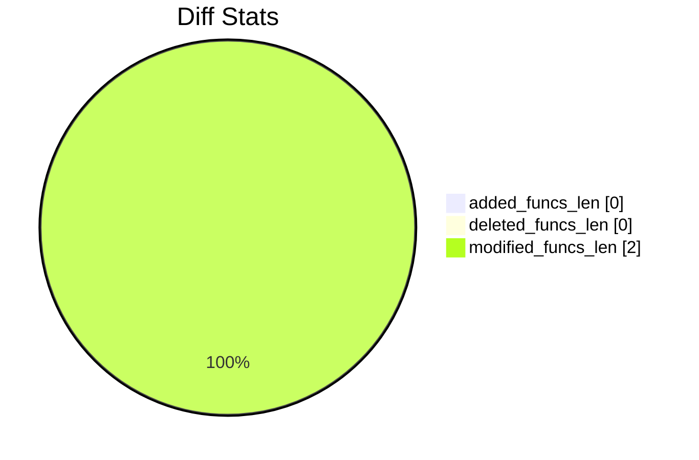

# afd.sys.x64.10.0.22621.608-afd.sys.x64.10.0.22621.1105 Diff

## TOC

- [afd.sys.x64.10.0.22621.608-afd.sys.x64.10.0.22621.1105 Diff](#afdsysx6410022621608-afdsysx64100226211105-diff)
  - [TOC](#toc)
- [Visual Chart Diff](#visual-chart-diff)
- [Metadata](#metadata)
  - [Ghidra Diff Engine](#ghidra-diff-engine)
    - [Command Line](#command-line)
      - [Captured Command Line](#captured-command-line)
      - [Verbose Args](#verbose-args)
      - [Download Original PEs](#download-original-pes)
  - [Binary Metadata Diff](#binary-metadata-diff)
  - [Program Options](#program-options)
  - [Diff Stats](#diff-stats)
  - [Strings](#strings)
- [Deleted](#deleted)
- [Added](#added)
- [Modified](#modified)
  - [AfdNotifyRemoveIoCompletion](#afdnotifyremoveiocompletion)
    - [Match Info](#match-info)
    - [Function Meta Diff](#function-meta-diff)
    - [AfdNotifyRemoveIoCompletion Diff](#afdnotifyremoveiocompletion-diff)
- [Modified (No Code Changes)](#modified-no-code-changes)
  - [NTOSKRNL.EXE::ProbeForWrite](#ntoskrnlexeprobeforwrite)
    - [Match Info](#match-info-1)
    - [Function Meta Diff](#function-meta-diff-1)

# Visual Chart Diff










# Metadata

## Ghidra Diff Engine

### Command Line

#### Captured Command Line


```
ghidriff --project-location ghidra_projects --project-name ghidriff --symbols-path symbols --threaded --log-level INFO --file-log-level INFO --log-path ghidriff.log --max-ram-percent 60.0 --max-section-funcs 200 afd.sys.x64.10.0.22621.608 afd.sys.x64.10.0.22621.1105
```


#### Verbose Args


<details>

```
--old ['afd.sys.x64.10.0.22621.608'] --new [['afd.sys.x64.10.0.22621.1105']] --engine VersionTrackingDiff --output-path ghidriffs --summary False --project-location ghidra_projects --project-name ghidriff --symbols-path symbols --threaded True --force-analysis False --force-diff False --no-symbols False --log-level INFO --file-log-level INFO --log-path ghidriff.log --va False --max-ram-percent 60.0 --print-flags False --jvm-args None --side-by-side False --max-section-funcs 200 --md-title None
```


</details>

#### Download Original PEs


```
wget https://msdl.microsoft.com/download/symbols/afd.sys/0C5C6994A8000/afd.sys -O afd.sys.x64.10.0.22621.1028
wget https://msdl.microsoft.com/download/symbols/afd.sys/DE5438E9A8000/afd.sys -O afd.sys.x64.10.0.23414.1000
```


## Binary Metadata Diff


```diff
--- afd.sys.x64.10.0.22621.608 Meta
+++ afd.sys.x64.10.0.22621.1105 Meta
@@ -1,44 +1,44 @@
-Program Name: afd.sys.x64.10.0.22621.608
+Program Name: afd.sys.x64.10.0.22621.1105
 Language ID: x86:LE:64:default (2.14)
 Compiler ID: windows
 Processor: x86
 Endian: Little
 Address Size: 64
 Minimum Address: 1c0000000
 Maximum Address: ff0000184f
 # of Bytes: 694352
 # of Memory Blocks: 17
-# of Instructions: 104930
+# of Instructions: 104935
 # of Defined Data: 4195
 # of Functions: 1544
 # of Symbols: 13624
 # of Data Types: 395
 # of Data Type Categories: 24
 Analyzed: true
 Compiler: visualstudio:unknown
 Created With Ghidra Version: 10.4
-Date Created: Fri Dec 08 20:00:54 UTC 2023
+Date Created: Fri Dec 08 20:00:55 UTC 2023
 Executable Format: Portable Executable (PE)
-Executable Location: /workspaces/ghidriff/afd.sys.x64.10.0.22621.608
-Executable MD5: 7f124ea7dcde7d564c319b58ba211960
-Executable SHA256: c57893dd8621eb79db5c6ff6ef7f5796919041e4c3a7bbafcb05560a29385fb8
-FSRL: file:///workspaces/ghidriff/afd.sys.x64.10.0.22621.608?MD5=7f124ea7dcde7d564c319b58ba211960
+Executable Location: /workspaces/ghidriff/afd.sys.x64.10.0.22621.1105
+Executable MD5: 3d4559f355ba704dd2dfb38abbc92c8c
+Executable SHA256: 0cf15707afbc74e2dbc0c507941f33b64a4cc0f6c3a631889a2d8d5bdbe27bf0
+FSRL: file:///workspaces/ghidriff/afd.sys.x64.10.0.22621.1105?MD5=3d4559f355ba704dd2dfb38abbc92c8c
 PDB Age: 1
 PDB File: afd.pdb
-PDB GUID: 8b67df69-c5d3-be18-663e-daf70a48aeb5
+PDB GUID: 161b515b-93cc-1bce-0824-c171485e4a69
 PDB Loaded: true
 PDB Version: RSDS
 PE Property[CompanyName]: Microsoft Corporation
 PE Property[FileDescription]: Ancillary Function Driver for WinSock
-PE Property[FileVersion]: 10.0.22621.1028 (WinBuild.160101.0800)
+PE Property[FileVersion]: 10.0.23414.1000 (WinBuild.160101.0800)
 PE Property[InternalName]: afd.sys
 PE Property[LegalCopyright]: © Microsoft Corporation. All rights reserved.
 PE Property[OriginalFilename]: afd.sys
 PE Property[ProductName]: Microsoft® Windows® Operating System
-PE Property[ProductVersion]: 10.0.22621.1028
+PE Property[ProductVersion]: 10.0.23414.1000
 PE Property[Translation]: 4b00409
 Preferred Root Namespace Category: 
 RTTI Found: false
 Relocatable: true
 SectionAlignment: 4096
 Should Ask To Analyze: false

```


## Program Options


<details>
<summary>Ghidra afd.sys.x64.10.0.22621.608 Decompiler Options</summary>


|  Decompiler Option   |   Value    |
| :------------------: | :--------: |
| Prototype Evaluation | __fastcall |

</details>


<details>
<summary>Ghidra afd.sys.x64.10.0.22621.608 Specification extensions Options</summary>


| Specification extensions Option | Value |
| :-----------------------------: | :---: |
|          FormatVersion          |   0   |
|         VersionCounter          |   0   |

</details>


<details>
<summary>Ghidra afd.sys.x64.10.0.22621.608 Analyzers Options</summary>


|                                Analyzers Option                                 |      Value      |
| :-----------------------------------------------------------------------------: | :-------------: |
|                                  ASCII Strings                                  |      true       |
|            ASCII Strings.Create Strings Containing Existing Strings             |      true       |
|               ASCII Strings.Create Strings Containing References                |      true       |
|                        ASCII Strings.Force Model Reload                         |      false      |
|                       ASCII Strings.Minimum String Length                       |      LEN_5      |
|                            ASCII Strings.Model File                             | StringModel.sng |
|                ASCII Strings.Require Null Termination for String                |      true       |
|              ASCII Strings.Search Only in Accessible Memory Blocks              |      true       |
|                      ASCII Strings.String Start Alignment                       |     ALIGN_1     |
|                       ASCII Strings.String end alignment                        |        4        |
|                          Aggressive Instruction Finder                          |      false      |
|             Aggressive Instruction Finder.Create Analysis Bookmarks             |      true       |
|                               Apply Data Archives                               |      true       |
|                       Apply Data Archives.Archive Chooser                       |  [Auto-Detect]  |
|                  Apply Data Archives.Create Analysis Bookmarks                  |      true       |
|                 Apply Data Archives.GDT User File Archive Path                  |      None       |
|                  Apply Data Archives.User Project Archive Path                  |      None       |
|                               Call Convention ID                                |      true       |
|              Call Convention ID.Analysis Decompiler Timeout (sec)               |       60        |
|                              Call-Fixup Installer                               |      true       |
|                              Condense Filler Bytes                              |      false      |
|                       Condense Filler Bytes.Filler Value                        |      Auto       |
|            Condense Filler Bytes.Minimum number of sequential bytes             |        1        |
|                              Create Address Tables                              |      true       |
|                  Create Address Tables.Allow Offcut References                  |      false      |
|                     Create Address Tables.Auto Label Table                      |      false      |
|                 Create Address Tables.Create Analysis Bookmarks                 |      true       |
|                 Create Address Tables.Maxmimum Pointer Distance                 |    16777215     |
|                  Create Address Tables.Minimum Pointer Address                  |      4132       |
|                    Create Address Tables.Minimum Table Size                     |        2        |
|                     Create Address Tables.Pointer Alignment                     |        1        |
|                  Create Address Tables.Relocation Table Guide                   |      true       |
|                      Create Address Tables.Table Alignment                      |        4        |
|                                 Data Reference                                  |      true       |
|                     Data Reference.Address Table Alignment                      |        1        |
|                    Data Reference.Address Table Minimum Size                    |        2        |
|                       Data Reference.Align End of Strings                       |      false      |
|                     Data Reference.Ascii String References                      |      true       |
|                      Data Reference.Create Address Tables                       |      true       |
|                      Data Reference.Minimum String Length                       |        5        |
|                      Data Reference.References to Pointers                      |      true       |
|                      Data Reference.Relocation Table Guide                      |      true       |
|                       Data Reference.Respect Execute Flag                       |      true       |
|                      Data Reference.Subroutine References                       |      true       |
|                     Data Reference.Switch Table References                      |      false      |
|                    Data Reference.Unicode String References                     |      true       |
|                             Decompiler Parameter ID                             |      true       |
|                  Decompiler Parameter ID.Analysis Clear Level                   |    ANALYSIS     |
|            Decompiler Parameter ID.Analysis Decompiler Timeout (sec)            |       60        |
|                    Decompiler Parameter ID.Commit Data Types                    |      true       |
|                Decompiler Parameter ID.Commit Void Return Values                |      false      |
|                  Decompiler Parameter ID.Prototype Evaluation                   |   __fastcall    |
|                           Decompiler Switch Analysis                            |      true       |
|          Decompiler Switch Analysis.Analysis Decompiler Timeout (sec)           |       60        |
|                               Demangler Microsoft                               |      true       |
|             Demangler Microsoft.Apply Function Calling Conventions              |      true       |
|                  Demangler Microsoft.Apply Function Signatures                  |      true       |
|                            Disassemble Entry Points                             |      true       |
|                  Disassemble Entry Points.Respect Execute Flag                  |      true       |
|                                 Embedded Media                                  |      true       |
|                    Embedded Media.Create Analysis Bookmarks                     |      true       |
|                            External Entry References                            |      true       |
|                                   Function ID                                   |      true       |
|                       Function ID.Always Apply FID Labels                       |      false      |
|                      Function ID.Create Analysis Bookmarks                      |      true       |
|                     Function ID.Instruction Count Threshold                     |      14.6       |
|                      Function ID.Multiple Match Threshold                       |      30.0       |
|                              Function Start Search                              |      true       |
|                    Function Start Search.Bookmark Functions                     |      false      |
|                    Function Start Search.Search Data Blocks                     |      false      |
|                      Non-Returning Functions - Discovered                       |      true       |
|         Non-Returning Functions - Discovered.Create Analysis Bookmarks          |      true       |
|       Non-Returning Functions - Discovered.Function Non-return Threshold        |        3        |
|             Non-Returning Functions - Discovered.Repair Flow Damage             |      true       |
|                         Non-Returning Functions - Known                         |      true       |
|            Non-Returning Functions - Known.Create Analysis Bookmarks            |      true       |
|                                    PDB MSDIA                                    |      false      |
|                     PDB MSDIA.Search remote symbol servers                      |      false      |
|                                  PDB Universal                                  |      true       |
|                   PDB Universal.Search remote symbol servers                    |      false      |
|                                    Reference                                    |      true       |
|                        Reference.Address Table Alignment                        |        1        |
|                      Reference.Address Table Minimum Size                       |        2        |
|                         Reference.Align End of Strings                          |      false      |
|                        Reference.Ascii String References                        |      true       |
|                         Reference.Create Address Tables                         |      true       |
|                         Reference.Minimum String Length                         |        5        |
|                        Reference.References to Pointers                         |      true       |
|                        Reference.Relocation Table Guide                         |      true       |
|                         Reference.Respect Execute Flag                          |      true       |
|                         Reference.Subroutine References                         |      true       |
|                        Reference.Switch Table References                        |      false      |
|                       Reference.Unicode String References                       |      true       |
|                            Scalar Operand References                            |      true       |
|                Scalar Operand References.Relocation Table Guide                 |      true       |
|                               Shared Return Calls                               |      true       |
|                   Shared Return Calls.Allow Conditional Jumps                   |      false      |
|              Shared Return Calls.Assume Contiguous Functions Only               |      true       |
|                                      Stack                                      |      true       |
|                          Stack.Create Local Variables                           |      true       |
|                          Stack.Create Param Variables                           |      true       |
|                        Stack.useNewFunctionStackAnalysis                        |      true       |
|                              Subroutine References                              |      true       |
|                    Subroutine References.Create Thunks Early                    |      true       |
|                      Variadic Function Signature Override                       |      false      |
|         Variadic Function Signature Override.Create Analysis Bookmarks          |      false      |
|                        Windows x86 PE Exception Handling                        |      true       |
|                          Windows x86 PE RTTI Analyzer                           |      true       |
|               Windows x86 Thread Environment Block (TEB) Analyzer               |      true       |
| Windows x86 Thread Environment Block (TEB) Analyzer.Starting Address of the TEB |                 |
|     Windows x86 Thread Environment Block (TEB) Analyzer.Windows OS Version      |    Windows 7    |
|                   WindowsPE x86 Propagate External Parameters                   |      false      |
|                            WindowsResourceReference                             |      true       |
|               WindowsResourceReference.Create Analysis Bookmarks                |      true       |
|                         x86 Constant Reference Analyzer                         |      true       |
|            x86 Constant Reference Analyzer.Create Data from pointer             |      false      |
|   x86 Constant Reference Analyzer.Function parameter/return Pointer analysis    |      true       |
|                   x86 Constant Reference Analyzer.Max Threads                   |        2        |
|             x86 Constant Reference Analyzer.Min absolute reference              |        4        |
|         x86 Constant Reference Analyzer.Require pointer param data type         |      false      |
|            x86 Constant Reference Analyzer.Speculative reference max            |       512       |
|            x86 Constant Reference Analyzer.Speculative reference min            |      1024       |
|          x86 Constant Reference Analyzer.Stored Value Pointer analysis          |      true       |
|     x86 Constant Reference Analyzer.Trust values read from writable memory      |      true       |

</details>


<details>
<summary>Ghidra afd.sys.x64.10.0.22621.1105 Decompiler Options</summary>


|  Decompiler Option   |   Value    |
| :------------------: | :--------: |
| Prototype Evaluation | __fastcall |

</details>


<details>
<summary>Ghidra afd.sys.x64.10.0.22621.1105 Specification extensions Options</summary>


| Specification extensions Option | Value |
| :-----------------------------: | :---: |
|          FormatVersion          |   0   |
|         VersionCounter          |   0   |

</details>


<details>
<summary>Ghidra afd.sys.x64.10.0.22621.1105 Analyzers Options</summary>


|                                Analyzers Option                                 |      Value      |
| :-----------------------------------------------------------------------------: | :-------------: |
|                                  ASCII Strings                                  |      true       |
|            ASCII Strings.Create Strings Containing Existing Strings             |      true       |
|               ASCII Strings.Create Strings Containing References                |      true       |
|                        ASCII Strings.Force Model Reload                         |      false      |
|                       ASCII Strings.Minimum String Length                       |      LEN_5      |
|                            ASCII Strings.Model File                             | StringModel.sng |
|                ASCII Strings.Require Null Termination for String                |      true       |
|              ASCII Strings.Search Only in Accessible Memory Blocks              |      true       |
|                      ASCII Strings.String Start Alignment                       |     ALIGN_1     |
|                       ASCII Strings.String end alignment                        |        4        |
|                          Aggressive Instruction Finder                          |      false      |
|             Aggressive Instruction Finder.Create Analysis Bookmarks             |      true       |
|                               Apply Data Archives                               |      true       |
|                       Apply Data Archives.Archive Chooser                       |  [Auto-Detect]  |
|                  Apply Data Archives.Create Analysis Bookmarks                  |      true       |
|                 Apply Data Archives.GDT User File Archive Path                  |      None       |
|                  Apply Data Archives.User Project Archive Path                  |      None       |
|                               Call Convention ID                                |      true       |
|              Call Convention ID.Analysis Decompiler Timeout (sec)               |       60        |
|                              Call-Fixup Installer                               |      true       |
|                              Condense Filler Bytes                              |      false      |
|                       Condense Filler Bytes.Filler Value                        |      Auto       |
|            Condense Filler Bytes.Minimum number of sequential bytes             |        1        |
|                              Create Address Tables                              |      true       |
|                  Create Address Tables.Allow Offcut References                  |      false      |
|                     Create Address Tables.Auto Label Table                      |      false      |
|                 Create Address Tables.Create Analysis Bookmarks                 |      true       |
|                 Create Address Tables.Maxmimum Pointer Distance                 |    16777215     |
|                  Create Address Tables.Minimum Pointer Address                  |      4132       |
|                    Create Address Tables.Minimum Table Size                     |        2        |
|                     Create Address Tables.Pointer Alignment                     |        1        |
|                  Create Address Tables.Relocation Table Guide                   |      true       |
|                      Create Address Tables.Table Alignment                      |        4        |
|                                 Data Reference                                  |      true       |
|                     Data Reference.Address Table Alignment                      |        1        |
|                    Data Reference.Address Table Minimum Size                    |        2        |
|                       Data Reference.Align End of Strings                       |      false      |
|                     Data Reference.Ascii String References                      |      true       |
|                      Data Reference.Create Address Tables                       |      true       |
|                      Data Reference.Minimum String Length                       |        5        |
|                      Data Reference.References to Pointers                      |      true       |
|                      Data Reference.Relocation Table Guide                      |      true       |
|                       Data Reference.Respect Execute Flag                       |      true       |
|                      Data Reference.Subroutine References                       |      true       |
|                     Data Reference.Switch Table References                      |      false      |
|                    Data Reference.Unicode String References                     |      true       |
|                             Decompiler Parameter ID                             |      true       |
|                  Decompiler Parameter ID.Analysis Clear Level                   |    ANALYSIS     |
|            Decompiler Parameter ID.Analysis Decompiler Timeout (sec)            |       60        |
|                    Decompiler Parameter ID.Commit Data Types                    |      true       |
|                Decompiler Parameter ID.Commit Void Return Values                |      false      |
|                  Decompiler Parameter ID.Prototype Evaluation                   |   __fastcall    |
|                           Decompiler Switch Analysis                            |      true       |
|          Decompiler Switch Analysis.Analysis Decompiler Timeout (sec)           |       60        |
|                               Demangler Microsoft                               |      true       |
|             Demangler Microsoft.Apply Function Calling Conventions              |      true       |
|                  Demangler Microsoft.Apply Function Signatures                  |      true       |
|                            Disassemble Entry Points                             |      true       |
|                  Disassemble Entry Points.Respect Execute Flag                  |      true       |
|                                 Embedded Media                                  |      true       |
|                    Embedded Media.Create Analysis Bookmarks                     |      true       |
|                            External Entry References                            |      true       |
|                                   Function ID                                   |      true       |
|                       Function ID.Always Apply FID Labels                       |      false      |
|                      Function ID.Create Analysis Bookmarks                      |      true       |
|                     Function ID.Instruction Count Threshold                     |      14.6       |
|                      Function ID.Multiple Match Threshold                       |      30.0       |
|                              Function Start Search                              |      true       |
|                    Function Start Search.Bookmark Functions                     |      false      |
|                    Function Start Search.Search Data Blocks                     |      false      |
|                      Non-Returning Functions - Discovered                       |      true       |
|         Non-Returning Functions - Discovered.Create Analysis Bookmarks          |      true       |
|       Non-Returning Functions - Discovered.Function Non-return Threshold        |        3        |
|             Non-Returning Functions - Discovered.Repair Flow Damage             |      true       |
|                         Non-Returning Functions - Known                         |      true       |
|            Non-Returning Functions - Known.Create Analysis Bookmarks            |      true       |
|                                    PDB MSDIA                                    |      false      |
|                     PDB MSDIA.Search remote symbol servers                      |      false      |
|                                  PDB Universal                                  |      true       |
|                   PDB Universal.Search remote symbol servers                    |      false      |
|                                    Reference                                    |      true       |
|                        Reference.Address Table Alignment                        |        1        |
|                      Reference.Address Table Minimum Size                       |        2        |
|                         Reference.Align End of Strings                          |      false      |
|                        Reference.Ascii String References                        |      true       |
|                         Reference.Create Address Tables                         |      true       |
|                         Reference.Minimum String Length                         |        5        |
|                        Reference.References to Pointers                         |      true       |
|                        Reference.Relocation Table Guide                         |      true       |
|                         Reference.Respect Execute Flag                          |      true       |
|                         Reference.Subroutine References                         |      true       |
|                        Reference.Switch Table References                        |      false      |
|                       Reference.Unicode String References                       |      true       |
|                            Scalar Operand References                            |      true       |
|                Scalar Operand References.Relocation Table Guide                 |      true       |
|                               Shared Return Calls                               |      true       |
|                   Shared Return Calls.Allow Conditional Jumps                   |      false      |
|              Shared Return Calls.Assume Contiguous Functions Only               |      true       |
|                                      Stack                                      |      true       |
|                          Stack.Create Local Variables                           |      true       |
|                          Stack.Create Param Variables                           |      true       |
|                        Stack.useNewFunctionStackAnalysis                        |      true       |
|                              Subroutine References                              |      true       |
|                    Subroutine References.Create Thunks Early                    |      true       |
|                      Variadic Function Signature Override                       |      false      |
|         Variadic Function Signature Override.Create Analysis Bookmarks          |      false      |
|                        Windows x86 PE Exception Handling                        |      true       |
|                          Windows x86 PE RTTI Analyzer                           |      true       |
|               Windows x86 Thread Environment Block (TEB) Analyzer               |      true       |
| Windows x86 Thread Environment Block (TEB) Analyzer.Starting Address of the TEB |                 |
|     Windows x86 Thread Environment Block (TEB) Analyzer.Windows OS Version      |    Windows 7    |
|                   WindowsPE x86 Propagate External Parameters                   |      false      |
|                            WindowsResourceReference                             |      true       |
|               WindowsResourceReference.Create Analysis Bookmarks                |      true       |
|                         x86 Constant Reference Analyzer                         |      true       |
|            x86 Constant Reference Analyzer.Create Data from pointer             |      false      |
|   x86 Constant Reference Analyzer.Function parameter/return Pointer analysis    |      true       |
|                   x86 Constant Reference Analyzer.Max Threads                   |        2        |
|             x86 Constant Reference Analyzer.Min absolute reference              |        4        |
|         x86 Constant Reference Analyzer.Require pointer param data type         |      false      |
|            x86 Constant Reference Analyzer.Speculative reference max            |       512       |
|            x86 Constant Reference Analyzer.Speculative reference min            |      1024       |
|          x86 Constant Reference Analyzer.Stored Value Pointer analysis          |      true       |
|     x86 Constant Reference Analyzer.Trust values read from writable memory      |      true       |

</details>

## Diff Stats


|                  Stat                   |                                                Value                                                 |
| :-------------------------------------: | :--------------------------------------------------------------------------------------------------: |
|             added_funcs_len             |                                                  0                                                   |
|            deleted_funcs_len            |                                                  0                                                   |
|           modified_funcs_len            |                                                  2                                                   |
|            added_symbols_len            |                                                  0                                                   |
|           deleted_symbols_len           |                                                  0                                                   |
|                diff_time                |                                          1.8986468315124512                                          |
|           deleted_strings_len           |                                                  0                                                   |
|            added_strings_len            |                                                  0                                                   |
|               match_types               | Counter({'SymbolsHash': 1443, 'ExactBytesFunctionHasher': 88, 'ExactInstructionsFunctionHasher': 4}) |
|            items_to_process             |                                                  2                                                   |
|               diff_types                |                           Counter({'refcount': 1, 'code': 1, 'length': 1})                           |
|           unmatched_funcs_len           |                                                  0                                                   |
|             total_funcs_len             |                                                 3088                                                 |
|            matched_funcs_len            |                                                 3088                                                 |
|   matched_funcs_with_code_changes_len   |                                                  1                                                   |
| matched_funcs_with_non_code_changes_len |                                                  1                                                   |
|      matched_funcs_no_changes_len       |                                                 3086                                                 |
|      match_func_similarity_percent      |                                               99.9352%                                               |
|       func_match_overall_percent        |                                              100.0000%                                               |








```mermaid
pie showData
    title Symbols
"added_symbols_len" : 0
"deleted_symbols_len" : 0
```

## Strings


*No string differences found*

# Deleted

# Added

# Modified


*Modified functions contain code changes*
## AfdNotifyRemoveIoCompletion

### Match Info


|     Key     | afd.sys.x64.10.0.22621.608 - afd.sys.x64.10.0.22621.1105 |
| :---------: | :------------------------------------------------------: |
|  diff_type  |                       code,length                        |
|    ratio    |                           0.98                           |
|   i_ratio   |                           0.93                           |
|   m_ratio   |                           0.99                           |
|   b_ratio   |                           0.99                           |
| match_types |                       SymbolsHash                        |

### Function Meta Diff


|    Key     |                                                                                          afd.sys.x64.10.0.22621.608                                                                                          |                                                                                         afd.sys.x64.10.0.22621.1105                                                                                          |
| :--------: | :----------------------------------------------------------------------------------------------------------------------------------------------------------------------------------------------------------: | :----------------------------------------------------------------------------------------------------------------------------------------------------------------------------------------------------------: |
|    name    |                                                                                         AfdNotifyRemoveIoCompletion                                                                                          |                                                                                         AfdNotifyRemoveIoCompletion                                                                                          |
|  fullname  |                                                                                         AfdNotifyRemoveIoCompletion                                                                                          |                                                                                         AfdNotifyRemoveIoCompletion                                                                                          |
|  refcount  |                                                                                                      2                                                                                                       |                                                                                                      2                                                                                                       |
|  `length`  |                                                                                                     693                                                                                                      |                                                                                                     717                                                                                                      |
|   called   | NTOSKRNL.EXE::ExAllocatePool2<br>NTOSKRNL.EXE::ExFreePoolWithTag<br>NTOSKRNL.EXE::IoIs32bitProcess<br>NTOSKRNL.EXE::IoRemoveIoCompletion<br>NTOSKRNL.EXE::ProbeForWrite<br>__security_check_cookie<br>memset | NTOSKRNL.EXE::ExAllocatePool2<br>NTOSKRNL.EXE::ExFreePoolWithTag<br>NTOSKRNL.EXE::IoIs32bitProcess<br>NTOSKRNL.EXE::IoRemoveIoCompletion<br>NTOSKRNL.EXE::ProbeForWrite<br>__security_check_cookie<br>memset |
|  calling   |                                                                                                AfdNotifySock                                                                                                 |                                                                                                AfdNotifySock                                                                                                 |
| paramcount |                                                                                                      3                                                                                                       |                                                                                                      3                                                                                                       |
|  address   |                                                                                                  1c006f92c                                                                                                   |                                                                                                  1c006f92c                                                                                                   |
|    sig     |                                                     undefined __fastcall AfdNotifyRemoveIoCompletion(char param_1, undefined8 param_2, longlong param_3)                                                     |                                                     undefined __fastcall AfdNotifyRemoveIoCompletion(char param_1, undefined8 param_2, longlong param_3)                                                     |
|  sym_type  |                                                                                                   Function                                                                                                   |                                                                                                   Function                                                                                                   |
| sym_source |                                                                                                   IMPORTED                                                                                                   |                                                                                                   IMPORTED                                                                                                   |
|  external  |                                                                                                    False                                                                                                     |                                                                                                    False                                                                                                     |

### AfdNotifyRemoveIoCompletion Diff


```diff
--- AfdNotifyRemoveIoCompletion
+++ AfdNotifyRemoveIoCompletion
@@ -1,144 +1,145 @@
 
 void AfdNotifyRemoveIoCompletion(char param_1,undefined8 param_2,longlong param_3)
 
 {
   undefined auVar1 [16];
   char cVar2;
   int iVar3;
   undefined8 uVar4;
   undefined *puVar5;
   undefined *puVar6;
   undefined4 *puVar7;
   undefined4 *puVar8;
   longlong *plVar9;
   uint uVar10;
   undefined8 uVar11;
   ulonglong uVar12;
   undefined8 uVar13;
   undefined auStack_348 [32];
   uint *local_328;
   char local_320;
   longlong *local_318;
   undefined local_310;
   char local_308;
   char local_307;
   uint local_304;
   undefined *local_300;
   undefined *local_2f8;
   longlong local_2f0;
   longlong local_2e8;
   undefined8 local_2e0;
   undefined local_2c8 [128];
   undefined local_248 [512];
   ulonglong local_48;
   
   local_48 = __security_cookie ^ (ulonglong)auStack_348;
   local_2e8 = 0;
   local_308 = param_1;
   local_2f0 = param_3;
   local_2e0 = param_2;
   memset(local_2c8,0,0x80);
   puVar6 = (undefined *)0x0;
   local_2f8 = (undefined *)0x0;
   puVar5 = (undefined *)0x0;
   local_304 = 0;
   uVar10 = *(uint *)(param_3 + 0x28);
   uVar12 = CONCAT44(0,uVar10);
   if (uVar10 == 0) goto LAB_0;
   auVar1._8_8_ = 0;
   auVar1._0_8_ = uVar12;
   uVar4 = SUB168(ZEXT416(0x20) * auVar1,0);
   if (SUB168(ZEXT416(0x20) * auVar1,8) == 0) {
     iVar3 = 0;
   }
   else {
     uVar4 = 0xffffffffffffffff;
     iVar3 = -0x3fffff6b;
   }
   if (iVar3 < 0) goto LAB_0;
   cVar2 = IoIs32bitProcess(0);
   if (cVar2 == '\0') {
     uVar11 = 8;
     uVar13 = uVar4;
   }
   else {
     auVar1 = ZEXT816(0x10) * ZEXT416(*(uint *)(param_3 + 0x28));
     uVar13 = 0xffffffffffffffff;
     if (auVar1._8_8_ == 0) {
       uVar13 = auVar1._0_8_;
     }
     uVar11 = 4;
   }
   local_307 = cVar2;
   if (local_308 != '\0') {
     ProbeForWrite(*(undefined8 *)(param_3 + 0x10),uVar13,uVar11);
   }
   if (cVar2 == '\0') {
     puVar5 = *(undefined **)(param_3 + 0x10);
   }
   else if (uVar10 < 0x11) {
     puVar5 = local_248;
   }
   else {
     puVar5 = (undefined *)ExAllocatePool2(0x102,uVar4,0x4e646641);
     if (puVar5 == (undefined *)0x0) {
       puVar5 = local_248;
       uVar12 = 0x10;
     }
   }
   if (*(uint *)(param_3 + 0x24) == 0xffffffff) {
     plVar9 = (longlong *)0x0;
   }
   else {
     local_2e8 = (ulonglong)*(uint *)(param_3 + 0x24) * -10000;
     plVar9 = &local_2e8;
   }
   local_300 = puVar5;
   if ((uint)uVar12 < 0x11) {
 LAB_1:
     puVar6 = local_2c8;
   }
   else {
     puVar6 = (undefined *)ExAllocatePool2(0x42,uVar12 << 3,0x4e646641);
     if (puVar6 == (undefined *)0x0) {
       uVar12 = 0x10;
       goto LAB_1;
     }
   }
   cVar2 = local_308;
   local_310 = 0;
   local_320 = local_308;
   local_328 = &local_304;
   local_318 = plVar9;
   local_2f8 = puVar6;
   iVar3 = IoRemoveIoCompletion(local_2e0,puVar5,puVar6,uVar12);
   if (iVar3 == 0) {
     if (local_307 != '\0') {
       for (uVar10 = 0; uVar10 < local_304; uVar10 = uVar10 + 1) {
         puVar8 = (undefined4 *)(puVar5 + (ulonglong)uVar10 * 0x20);
         puVar7 = (undefined4 *)((ulonglong)uVar10 * 0x10 + *(longlong *)(param_3 + 0x10));
         *puVar7 = *puVar8;
         puVar7[1] = puVar8[2];
         puVar7[3] = puVar8[6];
         puVar7[2] = puVar8[4];
       }
     }
     if (cVar2 == '\0') {
       **(uint **)(param_3 + 0x18) = local_304;
     }
     else {
+      ProbeForWrite(*(undefined8 *)(param_3 + 0x18),4,4);
       **(uint **)(param_3 + 0x18) = local_304;
     }
   }
 LAB_0:
   if (((puVar5 != (undefined *)0x0) && (puVar5 != local_248)) &&
      (puVar5 != *(undefined **)(param_3 + 0x10))) {
     ExFreePoolWithTag(puVar5,0x4e646641);
   }
   if ((puVar6 != (undefined *)0x0) && (puVar6 != local_2c8)) {
     ExFreePoolWithTag(puVar6,0x4e646641);
   }
   __security_check_cookie(local_48 ^ (ulonglong)auStack_348);
   return;
 }
 

```


# Modified (No Code Changes)


*Slightly modified functions have no code changes, rather differnces in:*
- refcount
- length
- called
- calling
- name
- fullname

## NTOSKRNL.EXE::ProbeForWrite

### Match Info


|     Key     | afd.sys.x64.10.0.22621.608 - afd.sys.x64.10.0.22621.1105 |
| :---------: | :------------------------------------------------------: |
|  diff_type  |                         refcount                         |
|    ratio    |                           1.0                            |
|   i_ratio   |                           1.0                            |
|   m_ratio   |                           1.0                            |
|   b_ratio   |                           1.0                            |
| match_types |                SymbolsHash,ExternalsName                 |

### Function Meta Diff


|    Key     |                                                                                                                                                                                     afd.sys.x64.10.0.22621.608                                                                                                                                                                                     |                                                                                                                                                                                    afd.sys.x64.10.0.22621.1105                                                                                                                                                                                     |
| :--------: | :------------------------------------------------------------------------------------------------------------------------------------------------------------------------------------------------------------------------------------------------------------------------------------------------------------------------------------------------------------------------------------------------: | :------------------------------------------------------------------------------------------------------------------------------------------------------------------------------------------------------------------------------------------------------------------------------------------------------------------------------------------------------------------------------------------------: |
|    name    |                                                                                                                                                                                           ProbeForWrite                                                                                                                                                                                            |                                                                                                                                                                                           ProbeForWrite                                                                                                                                                                                            |
|  fullname  |                                                                                                                                                                                    NTOSKRNL.EXE::ProbeForWrite                                                                                                                                                                                     |                                                                                                                                                                                    NTOSKRNL.EXE::ProbeForWrite                                                                                                                                                                                     |
| `refcount` |                                                                                                                                                                                                 16                                                                                                                                                                                                 |                                                                                                                                                                                                 17                                                                                                                                                                                                 |
|   length   |                                                                                                                                                                                                 0                                                                                                                                                                                                  |                                                                                                                                                                                                 0                                                                                                                                                                                                  |
|   called   |                                                                                                                                                                                                                                                                                                                                                                                                    |                                                                                                                                                                                                                                                                                                                                                                                                    |
|  calling   | <details><summary>Expand for full list:<br>AfdAddressListQuery<br>AfdCopyMdlChainToBufferArray<br>AfdFastConnectionReceive<br>AfdFastDatagramReceive<br>AfdGetConnectData<br>AfdGetContext<br>AfdGetRemoteAddress<br>AfdGetUnacceptedConnectData<br>AfdNotifyRemoveIoCompletion<br>AfdRioCreateCq<br>AfdRioRegisterBuffer</summary>AfdRoutingInterfaceQuery<br>AfdSanFastCompleteRequest</details> | <details><summary>Expand for full list:<br>AfdAddressListQuery<br>AfdCopyMdlChainToBufferArray<br>AfdFastConnectionReceive<br>AfdFastDatagramReceive<br>AfdGetConnectData<br>AfdGetContext<br>AfdGetRemoteAddress<br>AfdGetUnacceptedConnectData<br>AfdNotifyRemoveIoCompletion<br>AfdRioCreateCq<br>AfdRioRegisterBuffer</summary>AfdRoutingInterfaceQuery<br>AfdSanFastCompleteRequest</details> |
| paramcount |                                                                                                                                                                                                 0                                                                                                                                                                                                  |                                                                                                                                                                                                 0                                                                                                                                                                                                  |
|  address   |                                                                                                                                                                                         EXTERNAL:00000041                                                                                                                                                                                          |                                                                                                                                                                                         EXTERNAL:00000041                                                                                                                                                                                          |
|    sig     |                                                                                                                                                                                   undefined ProbeForWrite(void)                                                                                                                                                                                    |                                                                                                                                                                                   undefined ProbeForWrite(void)                                                                                                                                                                                    |
|  sym_type  |                                                                                                                                                                                              Function                                                                                                                                                                                              |                                                                                                                                                                                              Function                                                                                                                                                                                              |
| sym_source |                                                                                                                                                                                              IMPORTED                                                                                                                                                                                              |                                                                                                                                                                                              IMPORTED                                                                                                                                                                                              |
|  external  |                                                                                                                                                                                                True                                                                                                                                                                                                |                                                                                                                                                                                                True                                                                                                                                                                                                |


<sub>Generated with `ghidriff` version: 0.5.1 on 2023-12-08T20:01:16</sub>