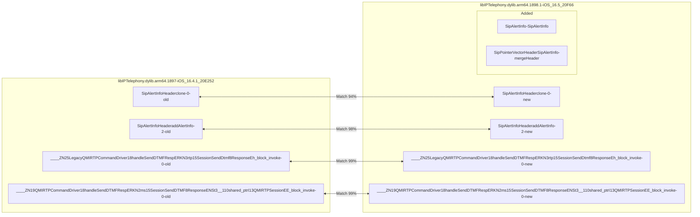
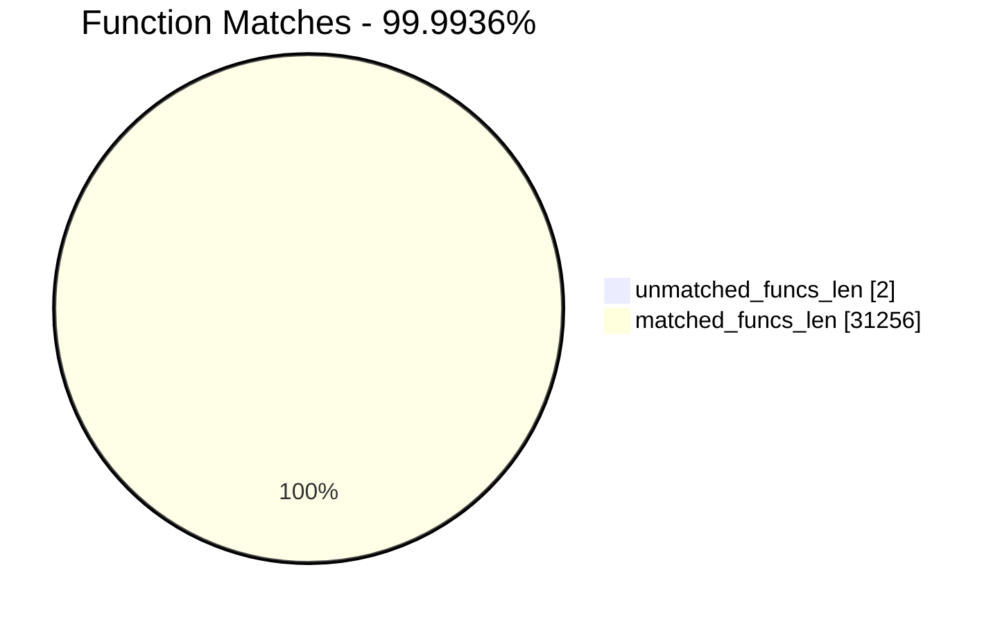
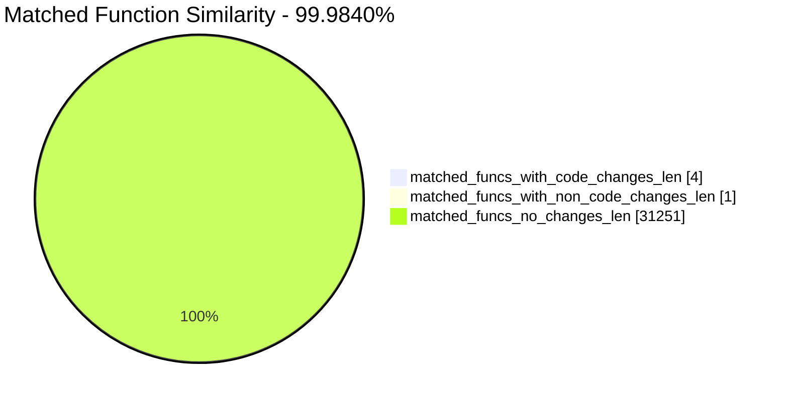
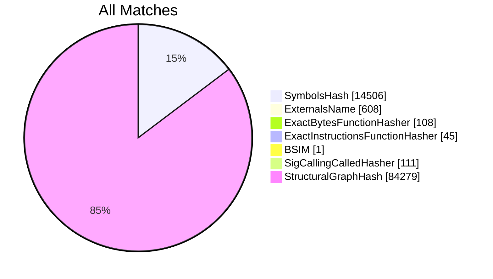
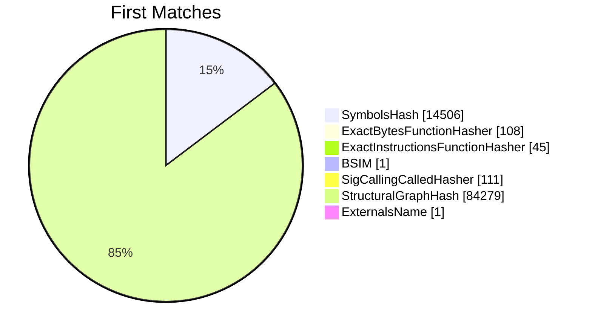
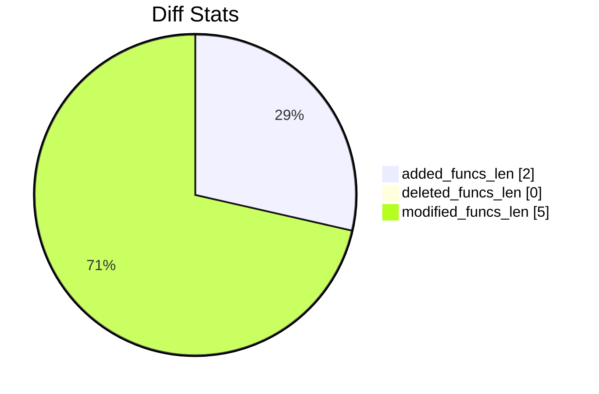
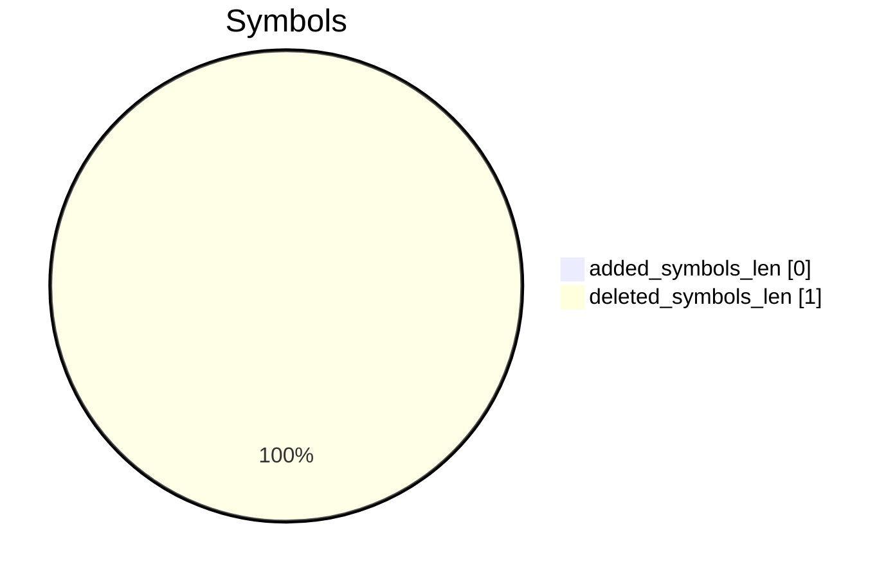
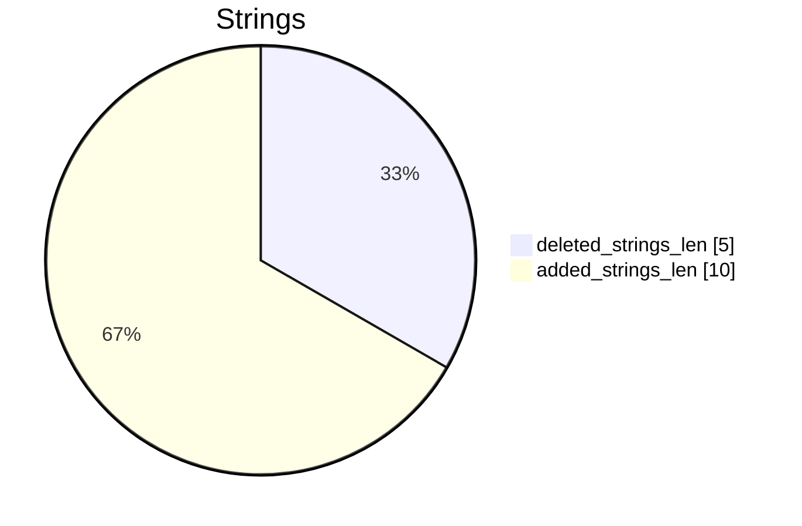

# libIPTelephony.dylib.arm64.1897-iOS_16.4.1_20E252-libIPTelephony.dylib.arm64.1898.1-iOS_16.5_20F66 Diff

# TOC

- [libIPTelephony.dylib.arm64.1897-iOS\_16.4.1\_20E252-libIPTelephony.dylib.arm64.1898.1-iOS\_16.5\_20F66 Diff](#libiptelephonydylibarm641897-ios_1641_20e252-libiptelephonydylibarm6418981-ios_165_20f66-diff)
- [TOC](#toc)
- [Visual Chart Diff](#visual-chart-diff)
- [Metadata](#metadata)
  - [Ghidra Diff Engine](#ghidra-diff-engine)
    - [Command Line](#command-line)
      - [Captured Command Line](#captured-command-line)
      - [Verbose Args](#verbose-args)
  - [Binary Metadata Diff](#binary-metadata-diff)
  - [Program Options](#program-options)
  - [Diff Stats](#diff-stats)
  - [Strings](#strings)
    - [Strings Diff](#strings-diff)
    - [String References](#string-references)
      - [Old](#old)
      - [New](#new)
- [Deleted](#deleted)
- [Added](#added)
  - [SipAlertInfo::SipAlertInfo](#sipalertinfosipalertinfo)
    - [Function Meta](#function-meta)
  - [SipPointerVectorHeader::mergeHeader](#sippointervectorheadermergeheader)
    - [Function Meta](#function-meta-1)
- [Modified](#modified)
  - [SipAlertInfoHeader::clone](#sipalertinfoheaderclone)
    - [Match Info](#match-info)
    - [Function Meta Diff](#function-meta-diff)
    - [SipAlertInfoHeader::clone Called Diff](#sipalertinfoheaderclone-called-diff)
    - [SipAlertInfoHeader::clone Diff](#sipalertinfoheaderclone-diff)
  - [SipAlertInfoHeader::addAlertInfo](#sipalertinfoheaderaddalertinfo)
    - [Match Info](#match-info-1)
    - [Function Meta Diff](#function-meta-diff-1)
    - [SipAlertInfoHeader::addAlertInfo Diff](#sipalertinfoheaderaddalertinfo-diff)
  - [\_\_\_\_ZN25LegacyQMIRTPCommandDriver18handleSendDTMFRespERKN3rtp15SessionSendDtmf8ResponseEh\_block\_invoke](#____zn25legacyqmirtpcommanddriver18handlesenddtmfresperkn3rtp15sessionsenddtmf8responseeh_block_invoke)
    - [Match Info](#match-info-2)
    - [Function Meta Diff](#function-meta-diff-2)
    - [\_\_\_\_ZN25LegacyQMIRTPCommandDriver18handleSendDTMFRespERKN3rtp15SessionSendDtmf8ResponseEh\_block\_invoke Diff](#____zn25legacyqmirtpcommanddriver18handlesenddtmfresperkn3rtp15sessionsenddtmf8responseeh_block_invoke-diff)
  - [\_\_\_\_ZN19QMIRTPCommandDriver18handleSendDTMFRespERKN2ms15SessionSendDTMF8ResponseENSt3\_\_110shared\_ptrI13QMIRTPSessionEE\_block\_invoke](#____zn19qmirtpcommanddriver18handlesenddtmfresperkn2ms15sessionsenddtmf8responseenst3__110shared_ptri13qmirtpsessionee_block_invoke)
    - [Match Info](#match-info-3)
    - [Function Meta Diff](#function-meta-diff-3)
    - [\_\_\_\_ZN19QMIRTPCommandDriver18handleSendDTMFRespERKN2ms15SessionSendDTMF8ResponseENSt3\_\_110shared\_ptrI13QMIRTPSessionEE\_block\_invoke Diff](#____zn19qmirtpcommanddriver18handlesenddtmfresperkn2ms15sessionsenddtmf8responseenst3__110shared_ptri13qmirtpsessionee_block_invoke-diff)
- [Modified (No Code Changes)](#modified-no-code-changes)

# Visual Chart Diff










# Metadata

## Ghidra Diff Engine

### Command Line

#### Captured Command Line


```
ghidriff --project-location ghidra_projects --project-name ghidriff --symbols-path symbols --threaded --log-level INFO --file-log-level INFO --log-path ghidriff.log --min-func-len 10 --bsim --max-ram-percent 60.0 --max-section-funcs 200 libIPTelephony.dylib.arm64.1897-iOS_16.4.1_20E252 libIPTelephony.dylib.arm64.1898.1-iOS_16.5_20F66
```


#### Verbose Args


<details>

```
--old ['bins/libIPTelephony.dylib.arm64.1897-iOS_16.4.1_20E252'] --new [['bins/libIPTelephony.dylib.arm64.1898.1-iOS_16.5_20F66']] --engine VersionTrackingDiff --output-path ghidriffs --summary False --project-location ghidra_projects --project-name ghidriff --symbols-path symbols --threaded True --force-analysis False --force-diff False --no-symbols False --log-level INFO --file-log-level INFO --log-path ghidriff.log --va False --min-func-len 10 --use-calling-counts False --bsim True --bsim-full False --max-ram-percent 60.0 --print-flags False --jvm-args None --side-by-side False --max-section-funcs 200 --md-title None
```


</details>

## Binary Metadata Diff


```diff
--- libIPTelephony.dylib.arm64.1897-iOS_16.4.1_20E252 Meta
+++ libIPTelephony.dylib.arm64.1898.1-iOS_16.5_20F66 Meta
@@ -1,65 +1,65 @@
-Program Name: libIPTelephony.dylib.arm64.1897-iOS_16.4.1_20E252
+Program Name: libIPTelephony.dylib.arm64.1898.1-iOS_16.5_20F66
 Language ID: AARCH64:LE:64:AppleSilicon (1.5)
 Compiler ID: default
 Processor: AARCH64
 Endian: Little
 Address Size: 64
-Minimum Address: 1bb232000
-Maximum Address: 21faf0517
-# of Bytes: 6904784
+Minimum Address: 1bb4e6000
+Maximum Address: 21ffe0517
+# of Bytes: 6904960
 # of Memory Blocks: 45
-# of Instructions: 914161
-# of Defined Data: 81545
-# of Functions: 15627
-# of Symbols: 115008
-# of Data Types: 2738
+# of Instructions: 914244
+# of Defined Data: 81564
+# of Functions: 15631
+# of Symbols: 115036
+# of Data Types: 2739
 # of Data Type Categories: 225
 Analyzed: true
 Created With Ghidra Version: 11.0.1
-Date Created: Wed Jan 31 03:45:41 UTC 2024
+Date Created: Wed Jan 31 03:45:43 UTC 2024
 Executable Format: Mac OS X Mach-O
-Executable Location: /workspaces/ghidriff/bins/libIPTelephony.dylib.arm64.1897-iOS_16.4.1_20E252
-Executable MD5: dfccc552ad2477958f9f99b53b41b8ad
-Executable SHA256: 226328e7e760774c4600535f6a945ea066882653038dd88db0bae61432e85a31
-FSRL: file:///workspaces/ghidriff/bins/libIPTelephony.dylib.arm64.1897-iOS_16.4.1_20E252?MD5=dfccc552ad2477958f9f99b53b41b8ad
+Executable Location: /workspaces/ghidriff/bins/libIPTelephony.dylib.arm64.1898.1-iOS_16.5_20F66
+Executable MD5: 6c4dbfdf9f8af384f4d6e4f99a6d8908
+Executable SHA256: 75e4feaaba708c17ebdf2b135cc1894ba848608e13b4b0f8147ffeb51128a075
+FSRL: file:///workspaces/ghidriff/bins/libIPTelephony.dylib.arm64.1898.1-iOS_16.5_20F66?MD5=6c4dbfdf9f8af384f4d6e4f99a6d8908
 Mach-O File Type: DYLIB
 Mach-O File Type Description: Dynamically Bound Shared Library
 Mach-O Flag 0: NOUNDEFS
 Mach-O Flag 1: DYLDLINK
 Mach-O Flag 2: TWOLEVEL
 Mach-O Flag 3: WEAK_DEFINES
 Mach-O Flag 4: BINDS_TO_WEAK
 Mach-O Flag 5: NO_REEXPORTED_DYLIBS
 Mach-O Flag 6: APP_EXTENSION_SAFE
 Preferred Root Namespace Category: 
 Relocatable: true
 Required Library [    0]: /System/Library/PrivateFrameworks/IPTelephony.framework/Support/libIPTelephony.dylib
 Required Library [    1]: /System/Library/PrivateFrameworks/CoreAnalytics.framework/CoreAnalytics
 Required Library [    2]: /System/Library/PrivateFrameworks/MediaExperience.framework/MediaExperience
 Required Library [    3]: /System/Library/Frameworks/NetworkExtension.framework/NetworkExtension
 Required Library [    4]: /System/Library/PrivateFrameworks/AVConference.framework/AVConference
 Required Library [    5]: /usr/lib/libICEClient.dylib
 Required Library [    6]: /usr/lib/libARI.dylib
 Required Library [    7]: /System/Library/PrivateFrameworks/MobileWiFi.framework/MobileWiFi
 Required Library [    8]: /System/Library/PrivateFrameworks/PersistentConnection.framework/PersistentConnection
 Required Library [    9]: /System/Library/Frameworks/CoreLocation.framework/CoreLocation
 Required Library [   10]: /System/Library/Frameworks/Foundation.framework/Foundation
 Required Library [   11]: /System/Library/Frameworks/CoreFoundation.framework/CoreFoundation
 Required Library [   12]: /usr/lib/libMobileGestalt.dylib
 Required Library [   13]: /usr/lib/libTelephonyUtilDynamic.dylib
 Required Library [   14]: /System/Library/PrivateFrameworks/AppSupport.framework/AppSupport
 Required Library [   15]: /usr/lib/libQMIParserDynamic.dylib
 Required Library [   16]: /System/Library/Frameworks/IOKit.framework/Versions/A/IOKit
 Required Library [   17]: /usr/lib/libSystem.B.dylib
 Required Library [   18]: /System/Library/Frameworks/SystemConfiguration.framework/SystemConfiguration
 Required Library [   19]: /usr/lib/libxml2.2.dylib
 Required Library [   20]: /System/Library/Frameworks/Security.framework/Security
 Required Library [   21]: /System/Library/Frameworks/CFNetwork.framework/CFNetwork
 Required Library [   22]: /usr/lib/libATCommandStudioDynamic.dylib
 Required Library [   23]: /System/Library/PrivateFrameworks/WirelessDiagnostics.framework/WirelessDiagnostics
 Required Library [   24]: /usr/lib/libprotobuf.dylib
 Required Library [   25]: /usr/lib/libobjc.A.dylib
 Required Library [   26]: /usr/lib/libc++.1.dylib
 Required Library [   27]: /System/Library/Frameworks/Network.framework/Network
 Required Library [   28]: /usr/lib/libprotobuf-lite.dylib
 Should Ask To Analyze: false

```


## Program Options


<details>
<summary>Ghidra libIPTelephony.dylib.arm64.1897-iOS_16.4.1_20E252 Decompiler Options</summary>


|Decompiler Option|Value|
| :---: | :---: |
|Prototype Evaluation|__cdecl|

</details>


<details>
<summary>Ghidra libIPTelephony.dylib.arm64.1897-iOS_16.4.1_20E252 Specification extensions Options</summary>


|Specification extensions Option|Value|
| :---: | :---: |
|FormatVersion|0|
|VersionCounter|0|

</details>


<details>
<summary>Ghidra libIPTelephony.dylib.arm64.1897-iOS_16.4.1_20E252 Analyzers Options</summary>


|Analyzers Option|Value|
| :---: | :---: |
|AARCH64 ELF PLT Thunks|true|
|ASCII Strings|true|
|ASCII Strings.Create Strings Containing Existing Strings|true|
|ASCII Strings.Create Strings Containing References|true|
|ASCII Strings.Force Model Reload|false|
|ASCII Strings.Minimum String Length|LEN_5|
|ASCII Strings.Model File|StringModel.sng|
|ASCII Strings.Require Null Termination for String|true|
|ASCII Strings.Search Only in Accessible Memory Blocks|true|
|ASCII Strings.String Start Alignment|ALIGN_1|
|ASCII Strings.String end alignment|4|
|Aggressive Instruction Finder|false|
|Aggressive Instruction Finder.Create Analysis Bookmarks|true|
|Apply Data Archives|true|
|Apply Data Archives.Archive Chooser|[Auto-Detect]|
|Apply Data Archives.Create Analysis Bookmarks|true|
|Apply Data Archives.GDT User File Archive Path|None|
|Apply Data Archives.User Project Archive Path|None|
|Basic Constant Reference Analyzer|true|
|Basic Constant Reference Analyzer.Create Data from pointer|false|
|Basic Constant Reference Analyzer.Function parameter/return Pointer analysis|true|
|Basic Constant Reference Analyzer.Max Threads|2|
|Basic Constant Reference Analyzer.Min absolute reference|4|
|Basic Constant Reference Analyzer.Require pointer param data type|false|
|Basic Constant Reference Analyzer.Speculative reference max|512|
|Basic Constant Reference Analyzer.Speculative reference min|1024|
|Basic Constant Reference Analyzer.Stored Value Pointer analysis|true|
|Basic Constant Reference Analyzer.Trust values read from writable memory|true|
|CFStrings|true|
|Call Convention ID|true|
|Call Convention ID.Analysis Decompiler Timeout (sec)|60|
|Call-Fixup Installer|true|
|Condense Filler Bytes|false|
|Condense Filler Bytes.Filler Value|Auto|
|Condense Filler Bytes.Minimum number of sequential bytes|1|
|Create Address Tables|true|
|Create Address Tables.Allow Offcut References|false|
|Create Address Tables.Auto Label Table|false|
|Create Address Tables.Create Analysis Bookmarks|true|
|Create Address Tables.Maxmimum Pointer Distance|16777215|
|Create Address Tables.Minimum Pointer Address|4132|
|Create Address Tables.Minimum Table Size|2|
|Create Address Tables.Pointer Alignment|1|
|Create Address Tables.Relocation Table Guide|true|
|Create Address Tables.Table Alignment|4|
|DWARF Line Number|false|
|Data Reference|true|
|Data Reference.Address Table Alignment|1|
|Data Reference.Address Table Minimum Size|2|
|Data Reference.Align End of Strings|false|
|Data Reference.Ascii String References|true|
|Data Reference.Create Address Tables|false|
|Data Reference.Minimum String Length|5|
|Data Reference.References to Pointers|true|
|Data Reference.Relocation Table Guide|true|
|Data Reference.Respect Execute Flag|true|
|Data Reference.Subroutine References|true|
|Data Reference.Switch Table References|false|
|Data Reference.Unicode String References|true|
|Decompiler Parameter ID|false|
|Decompiler Parameter ID.Analysis Clear Level|ANALYSIS|
|Decompiler Parameter ID.Analysis Decompiler Timeout (sec)|60|
|Decompiler Parameter ID.Commit Data Types|true|
|Decompiler Parameter ID.Commit Void Return Values|false|
|Decompiler Parameter ID.Prototype Evaluation|__cdecl|
|Decompiler Switch Analysis|true|
|Decompiler Switch Analysis.Analysis Decompiler Timeout (sec)|60|
|Demangler GNU|true|
|Demangler GNU.Apply Function Calling Conventions|true|
|Demangler GNU.Apply Function Signatures|true|
|Demangler GNU.Demangle Only Known Mangled Symbols|false|
|Demangler GNU.Demangler Format|AUTO|
|Demangler GNU.Use Deprecated Demangler|false|
|Disassemble Entry Points|true|
|Disassemble Entry Points.Respect Execute Flag|true|
|Embedded Media|true|
|Embedded Media.Create Analysis Bookmarks|true|
|External Entry References|true|
|External Symbol Resolver|true|
|Function Start Search|true|
|Function Start Search After Code|true|
|Function Start Search After Code.Bookmark Functions|false|
|Function Start Search After Code.Search Data Blocks|false|
|Function Start Search After Data|true|
|Function Start Search After Data.Bookmark Functions|false|
|Function Start Search After Data.Search Data Blocks|false|
|Function Start Search.Bookmark Functions|false|
|Function Start Search.Search Data Blocks|false|
|Mach-O Function Starts|true|
|Mach-O Function Starts.Bookmark failed functions|false|
|Mach-O Function Starts.Bookmark new functions|false|
|Mach-O Function Starts.Bookmark skipped functions|false|
|Mach-O Function Starts.Use PseudoDisassembler|true|
|Non-Returning Functions - Discovered|true|
|Non-Returning Functions - Discovered.Create Analysis Bookmarks|true|
|Non-Returning Functions - Discovered.Function Non-return Threshold|3|
|Non-Returning Functions - Discovered.Repair Flow Damage|true|
|Non-Returning Functions - Known|true|
|Non-Returning Functions - Known.Create Analysis Bookmarks|true|
|Objective-C 2 Class|true|
|Objective-C 2 Decompiler Message|true|
|Objective-C 2 Message|false|
|Reference|true|
|Reference.Address Table Alignment|1|
|Reference.Address Table Minimum Size|2|
|Reference.Align End of Strings|false|
|Reference.Ascii String References|true|
|Reference.Create Address Tables|false|
|Reference.Minimum String Length|5|
|Reference.References to Pointers|true|
|Reference.Relocation Table Guide|true|
|Reference.Respect Execute Flag|true|
|Reference.Subroutine References|true|
|Reference.Switch Table References|false|
|Reference.Unicode String References|true|
|Scalar Operand References|false|
|Scalar Operand References.Relocation Table Guide|true|
|Shared Return Calls|true|
|Shared Return Calls.Allow Conditional Jumps|false|
|Shared Return Calls.Assume Contiguous Functions Only|false|
|Stack|true|
|Stack.Create Local Variables|true|
|Stack.Create Param Variables|true|
|Stack.useNewFunctionStackAnalysis|true|
|Subroutine References|true|
|Subroutine References.Create Thunks Early|true|
|Variadic Function Signature Override|false|
|Variadic Function Signature Override.Create Analysis Bookmarks|false|

</details>


<details>
<summary>Ghidra libIPTelephony.dylib.arm64.1898.1-iOS_16.5_20F66 Decompiler Options</summary>


|Decompiler Option|Value|
| :---: | :---: |
|Prototype Evaluation|__cdecl|

</details>


<details>
<summary>Ghidra libIPTelephony.dylib.arm64.1898.1-iOS_16.5_20F66 Specification extensions Options</summary>


|Specification extensions Option|Value|
| :---: | :---: |
|FormatVersion|0|
|VersionCounter|0|

</details>


<details>
<summary>Ghidra libIPTelephony.dylib.arm64.1898.1-iOS_16.5_20F66 Analyzers Options</summary>


|Analyzers Option|Value|
| :---: | :---: |
|AARCH64 ELF PLT Thunks|true|
|ASCII Strings|true|
|ASCII Strings.Create Strings Containing Existing Strings|true|
|ASCII Strings.Create Strings Containing References|true|
|ASCII Strings.Force Model Reload|false|
|ASCII Strings.Minimum String Length|LEN_5|
|ASCII Strings.Model File|StringModel.sng|
|ASCII Strings.Require Null Termination for String|true|
|ASCII Strings.Search Only in Accessible Memory Blocks|true|
|ASCII Strings.String Start Alignment|ALIGN_1|
|ASCII Strings.String end alignment|4|
|Aggressive Instruction Finder|false|
|Aggressive Instruction Finder.Create Analysis Bookmarks|true|
|Apply Data Archives|true|
|Apply Data Archives.Archive Chooser|[Auto-Detect]|
|Apply Data Archives.Create Analysis Bookmarks|true|
|Apply Data Archives.GDT User File Archive Path|None|
|Apply Data Archives.User Project Archive Path|None|
|Basic Constant Reference Analyzer|true|
|Basic Constant Reference Analyzer.Create Data from pointer|false|
|Basic Constant Reference Analyzer.Function parameter/return Pointer analysis|true|
|Basic Constant Reference Analyzer.Max Threads|2|
|Basic Constant Reference Analyzer.Min absolute reference|4|
|Basic Constant Reference Analyzer.Require pointer param data type|false|
|Basic Constant Reference Analyzer.Speculative reference max|512|
|Basic Constant Reference Analyzer.Speculative reference min|1024|
|Basic Constant Reference Analyzer.Stored Value Pointer analysis|true|
|Basic Constant Reference Analyzer.Trust values read from writable memory|true|
|CFStrings|true|
|Call Convention ID|true|
|Call Convention ID.Analysis Decompiler Timeout (sec)|60|
|Call-Fixup Installer|true|
|Condense Filler Bytes|false|
|Condense Filler Bytes.Filler Value|Auto|
|Condense Filler Bytes.Minimum number of sequential bytes|1|
|Create Address Tables|true|
|Create Address Tables.Allow Offcut References|false|
|Create Address Tables.Auto Label Table|false|
|Create Address Tables.Create Analysis Bookmarks|true|
|Create Address Tables.Maxmimum Pointer Distance|16777215|
|Create Address Tables.Minimum Pointer Address|4132|
|Create Address Tables.Minimum Table Size|2|
|Create Address Tables.Pointer Alignment|1|
|Create Address Tables.Relocation Table Guide|true|
|Create Address Tables.Table Alignment|4|
|DWARF Line Number|false|
|Data Reference|true|
|Data Reference.Address Table Alignment|1|
|Data Reference.Address Table Minimum Size|2|
|Data Reference.Align End of Strings|false|
|Data Reference.Ascii String References|true|
|Data Reference.Create Address Tables|false|
|Data Reference.Minimum String Length|5|
|Data Reference.References to Pointers|true|
|Data Reference.Relocation Table Guide|true|
|Data Reference.Respect Execute Flag|true|
|Data Reference.Subroutine References|true|
|Data Reference.Switch Table References|false|
|Data Reference.Unicode String References|true|
|Decompiler Parameter ID|false|
|Decompiler Parameter ID.Analysis Clear Level|ANALYSIS|
|Decompiler Parameter ID.Analysis Decompiler Timeout (sec)|60|
|Decompiler Parameter ID.Commit Data Types|true|
|Decompiler Parameter ID.Commit Void Return Values|false|
|Decompiler Parameter ID.Prototype Evaluation|__cdecl|
|Decompiler Switch Analysis|true|
|Decompiler Switch Analysis.Analysis Decompiler Timeout (sec)|60|
|Demangler GNU|true|
|Demangler GNU.Apply Function Calling Conventions|true|
|Demangler GNU.Apply Function Signatures|true|
|Demangler GNU.Demangle Only Known Mangled Symbols|false|
|Demangler GNU.Demangler Format|AUTO|
|Demangler GNU.Use Deprecated Demangler|false|
|Disassemble Entry Points|true|
|Disassemble Entry Points.Respect Execute Flag|true|
|Embedded Media|true|
|Embedded Media.Create Analysis Bookmarks|true|
|External Entry References|true|
|External Symbol Resolver|true|
|Function Start Search|true|
|Function Start Search After Code|true|
|Function Start Search After Code.Bookmark Functions|false|
|Function Start Search After Code.Search Data Blocks|false|
|Function Start Search After Data|true|
|Function Start Search After Data.Bookmark Functions|false|
|Function Start Search After Data.Search Data Blocks|false|
|Function Start Search.Bookmark Functions|false|
|Function Start Search.Search Data Blocks|false|
|Mach-O Function Starts|true|
|Mach-O Function Starts.Bookmark failed functions|false|
|Mach-O Function Starts.Bookmark new functions|false|
|Mach-O Function Starts.Bookmark skipped functions|false|
|Mach-O Function Starts.Use PseudoDisassembler|true|
|Non-Returning Functions - Discovered|true|
|Non-Returning Functions - Discovered.Create Analysis Bookmarks|true|
|Non-Returning Functions - Discovered.Function Non-return Threshold|3|
|Non-Returning Functions - Discovered.Repair Flow Damage|true|
|Non-Returning Functions - Known|true|
|Non-Returning Functions - Known.Create Analysis Bookmarks|true|
|Objective-C 2 Class|true|
|Objective-C 2 Decompiler Message|true|
|Objective-C 2 Message|false|
|Reference|true|
|Reference.Address Table Alignment|1|
|Reference.Address Table Minimum Size|2|
|Reference.Align End of Strings|false|
|Reference.Ascii String References|true|
|Reference.Create Address Tables|false|
|Reference.Minimum String Length|5|
|Reference.References to Pointers|true|
|Reference.Relocation Table Guide|true|
|Reference.Respect Execute Flag|true|
|Reference.Subroutine References|true|
|Reference.Switch Table References|false|
|Reference.Unicode String References|true|
|Scalar Operand References|false|
|Scalar Operand References.Relocation Table Guide|true|
|Shared Return Calls|true|
|Shared Return Calls.Allow Conditional Jumps|false|
|Shared Return Calls.Assume Contiguous Functions Only|false|
|Stack|true|
|Stack.Create Local Variables|true|
|Stack.Create Param Variables|true|
|Stack.useNewFunctionStackAnalysis|true|
|Subroutine References|true|
|Subroutine References.Create Thunks Early|true|
|Variadic Function Signature Override|false|
|Variadic Function Signature Override.Create Analysis Bookmarks|false|

</details>

## Diff Stats


|Stat|Value|
| :---: | :---: |
|added_funcs_len|2|
|deleted_funcs_len|0|
|modified_funcs_len|5|
|added_symbols_len|0|
|deleted_symbols_len|1|
|diff_time|35.27271842956543|
|deleted_strings_len|5|
|added_strings_len|10|
|match_types|Counter({'StructuralGraphHash': 84279, 'SymbolsHash': 14506, 'ExternalsName': 608, 'SigCallingCalledHasher': 111, 'ExactBytesFunctionHasher': 108, 'ExactInstructionsFunctionHasher': 45, 'BSIM': 1})|
|items_to_process|8|
|diff_types|Counter({'address': 5, 'code': 4, 'length': 4, 'called': 1, 'refcount': 1, 'calling': 1})|
|unmatched_funcs_len|2|
|total_funcs_len|31258|
|matched_funcs_len|31256|
|matched_funcs_with_code_changes_len|4|
|matched_funcs_with_non_code_changes_len|1|
|matched_funcs_no_changes_len|31251|
|match_func_similarity_percent|99.9840%|
|func_match_overall_percent|99.9936%|
|first_matches|Counter({'StructuralGraphHash': 84279, 'SymbolsHash': 14506, 'SigCallingCalledHasher': 111, 'ExactBytesFunctionHasher': 108, 'ExactInstructionsFunctionHasher': 45, 'BSIM': 1, 'ExternalsName': 1})|













## Strings




### Strings Diff


```diff
--- deleted strings
+++ added strings
@@ -1,5 +1,10 @@
-s_CONFIGURE_RTCP_REPORTS
-s_TEXT_SESSION_START
-s___ZN18SipAlertInfoHeaderD2Ev
-s___ZNK18SipAlertInfoHeader12itemT
-s___ZNK18SipAlertInfoHeader14itemF
+s_AUDIO_SESSION_STOP
+s_SESSION_STOP
+s___ZN12SipAlertInfoC2ERKS
+s___ZN22SipPointerVectorHeaderI12S
+s___ZNK22SipPointerVectorHeaderI12
+s___ZTI22SipPointerVectorHeaderI12
+s___ZTS22SipPointerVectorHeaderI12
+s___ZTV22SipPointerVectorHeaderI12
+s_kIMSCallAudioSourceId
+s_kRegLastAccessNetworkTimestamp

```


### String References

#### Old


|String|Ref Count|Ref Func|
| :---: | :---: | :---: |
|s___ZN18SipAlertInfoHeaderD2Ev_21fa67739|1||
|s___ZNK18SipAlertInfoHeader14itemF_21fa67790|1||
|s_TEXT_SESSION_START_1bb66d9e5|1|toTimerIdString|
|s___ZNK18SipAlertInfoHeader12itemT_21fa67a47|1||
|s_CONFIGURE_RTCP_REPORTS_1bb65a91f|1|toTimerIdString|

#### New


|String|Ref Count|Ref Func|
| :---: | :---: | :---: |
|s___ZTV22SipPointerVectorHeaderI12_21ffb68a9|1||
|s_kRegLastAccessNetworkTimestamp_1bb91a7aa|1||
|s___ZTI22SipPointerVectorHeaderI12_21ffa62a0|1||
|s___ZN22SipPointerVectorHeaderI12S_21ff57d93|1||
|s_AUDIO_SESSION_STOP_1bb9219e8|1|toTimerIdString|
|s___ZN12SipAlertInfoC2ERKS__21ff577a6|1||
|s_SESSION_STOP_1bb90e902|1|toTimerIdString|
|s___ZTS22SipPointerVectorHeaderI12_21ff78026|1||
|s___ZNK22SipPointerVectorHeaderI12_21ff57a8c|1||
|s_kIMSCallAudioSourceId_1bb91c979|1||

# Deleted

# Added

## SipAlertInfo::SipAlertInfo

### Function Meta


|Key|libIPTelephony.dylib.arm64.1898.1-iOS_16.5_20F66|
| :---: | :---: |
|name|SipAlertInfo|
|fullname|SipAlertInfo::SipAlertInfo|
|refcount|3|
|length|144|
|called|std::__1::map<std::__1::basic_string<char,std::__1::char_traits<char>,std::__1::allocator<char>>,std::__1::basic_string<char,std::__1::char_traits<char>,std::__1::allocator<char>>,std::__1::less<std::__1::basic_string<char,std::__1::char_traits<char>,std::__1::allocator<char>>>,std::__1::allocator<std::__1::pair<std::__1::basic_string<char,std::__1::char_traits<char>,std::__1::allocator<char>>const,std::__1::basic_string<char,std::__1::char_traits<char>,std::__1::allocator<char>>>>>::map[abi:v15006]<std::__1::__map_const_iterator<std::__1::__tree_const_iterator<std::__1::__value_type<std::__1::basic_string<char,std::__1::char_traits<char>,std::__1::allocator<char>>,std::__1::basic_string<char,std::__1::char_traits<char>,std::__1::allocator<char>>>,std::__1::__tree_node<std::__1::__value_type<std::__1::basic_string<char,std::__1::char_traits<char>,std::__1::allocator<char>>,std::__1::basic_string<char,std::__1::char_traits<char>,std::__1::allocator<char>>>,void*>*,long>>>|
|calling|SipAlertInfoHeader::clone<br>SipPointerVectorHeader<SipAlertInfo>::mergeHeader|
|paramcount|2|
|address|1bb841ec8|
|sig|undefined __thiscall SipAlertInfo(SipAlertInfo * this, SipAlertInfo * param_1)|
|sym_type|Function|
|sym_source|ANALYSIS|
|external|False|


```diff
--- SipAlertInfo::SipAlertInfo
+++ SipAlertInfo::SipAlertInfo
@@ -0,0 +1,23 @@
+
+/* SipAlertInfo::SipAlertInfo(SipAlertInfo const&) */
+
+SipAlertInfo * __thiscall SipAlertInfo::SipAlertInfo(SipAlertInfo *this,SipAlertInfo *param_1)
+
+{
+  *(undefined8 *)this = 0;
+  *(undefined8 *)(this + 8) = 0;
+  *(undefined8 *)(this + 0x10) = 0;
+  *(undefined **)(this + 0x18) = &DAT_1e1def4a8;
+  std::__1::
+  map<std::__1::basic_string<char,std::__1::char_traits<char>,std::__1::allocator<char>>,std::__1::basic_string<char,std::__1::char_traits<char>,std::__1::allocator<char>>,std::__1::less<std::__1::basic_string<char,std::__1::char_traits<char>,std::__1::allocator<char>>>,std::__1::allocator<std::__1::pair<std::__1::basic_string<char,std::__1::char_traits<char>,std::__1::allocator<char>>const,std::__1::basic_string<char,std::__1::char_traits<char>,std::__1::allocator<char>>>>>
+  ::
+  map_abi_v15006_<std::__1::__map_const_iterator<std::__1::__tree_const_iterator<std::__1::__value_type<std::__1::basic_string<char,std::__1::char_traits<char>,std::__1::allocator<char>>,std::__1::basic_string<char,std::__1::char_traits<char>,std::__1::allocator<char>>>,std::__1::__tree_node<std::__1::__value_type<std::__1::basic_string<char,std::__1::char_traits<char>,std::__1::allocator<char>>,std::__1::basic_string<char,std::__1::char_traits<char>,std::__1::allocator<char>>>,void*>*,long>>>
+            ((map<std::__1::basic_string<char,std::__1::char_traits<char>,std::__1::allocator<char>>,std::__1::basic_string<char,std::__1::char_traits<char>,std::__1::allocator<char>>,std::__1::less<std::__1::basic_string<char,std::__1::char_traits<char>,std::__1::allocator<char>>>,std::__1::allocator<std::__1::pair<std::__1::basic_string<char,std::__1::char_traits<char>,std::__1::allocator<char>>const,std::__1::basic_string<char,std::__1::char_traits<char>,std::__1::allocator<char>>>>>
+              *)(this + 0x20),(__map_const_iterator)*(undefined8 *)(param_1 + 0x20),
+             (less *)(param_1 + 0x28));
+  this[0x39] = (SipAlertInfo)0x1;
+  this[0x38] = param_1[0x38];
+  func_0x0001bbbfcc70(this,param_1);
+  return this;
+}
+

```


## SipPointerVectorHeader<SipAlertInfo>::mergeHeader

### Function Meta


|Key|libIPTelephony.dylib.arm64.1898.1-iOS_16.5_20F66|
| :---: | :---: |
|name|mergeHeader|
|fullname|SipPointerVectorHeader<SipAlertInfo>::mergeHeader|
|refcount|1|
|length|212|
|called|<EXTERNAL>::operator.new<br>SipAlertInfo::SipAlertInfo<br>SipVectorHeader<SipAlertInfo*>::addItem|
|calling||
|paramcount|2|
|address|1bb842540|
|sig|undefined __thiscall mergeHeader(SipPointerVectorHeader<SipAlertInfo> * this, SipHeader * param_1)|
|sym_type|Function|
|sym_source|ANALYSIS|
|external|False|


```diff
--- SipPointerVectorHeader<SipAlertInfo>::mergeHeader
+++ SipPointerVectorHeader<SipAlertInfo>::mergeHeader
@@ -0,0 +1,28 @@
+
+/* WARNING: Removing unreachable block (ram,0x0001bb842580) */
+/* SipPointerVectorHeader<SipAlertInfo>::mergeHeader(SipHeader const&) */
+
+bool __thiscall
+SipPointerVectorHeader<SipAlertInfo>::mergeHeader
+          (SipPointerVectorHeader<SipAlertInfo> *this,SipHeader *param_1)
+
+{
+  long lVar1;
+  SipAlertInfo *this_00;
+  ulong uVar2;
+  SipAlertInfo *local_38;
+  
+  lVar1 = func_0x0001bbbfd0e0(param_1,&SipHeader::typeinfo,&typeinfo,0);
+  if ((lVar1 != 0) && (*(long *)(lVar1 + 0x48) != *(long *)(lVar1 + 0x40))) {
+    uVar2 = 0;
+    do {
+      this_00 = (SipAlertInfo *)operator_new(0x40);
+      SipAlertInfo::SipAlertInfo(this_00,*(SipAlertInfo **)(*(long *)(lVar1 + 0x40) + uVar2 * 8));
+      local_38 = this_00;
+      SipVectorHeader<SipAlertInfo*>::addItem((SipVectorHeader<SipAlertInfo*> *)this,&local_38);
+      uVar2 = uVar2 + 1;
+    } while (uVar2 < (ulong)(*(long *)(lVar1 + 0x48) - *(long *)(lVar1 + 0x40) >> 3));
+  }
+  return lVar1 != 0;
+}
+

```


# Modified


*Modified functions contain code changes*
## SipAlertInfoHeader::clone

### Match Info


|Key|libIPTelephony.dylib.arm64.1897-iOS_16.4.1_20E252 - libIPTelephony.dylib.arm64.1898.1-iOS_16.5_20F66|
| :---: | :---: |
|diff_type|code,length,address,called|
|ratio|0.42|
|i_ratio|0.51|
|m_ratio|0.89|
|b_ratio|0.94|
|match_types|SymbolsHash|

### Function Meta Diff


|Key|libIPTelephony.dylib.arm64.1897-iOS_16.4.1_20E252|libIPTelephony.dylib.arm64.1898.1-iOS_16.5_20F66|
| :---: | :---: | :---: |
|name|clone|clone|
|fullname|SipAlertInfoHeader::clone|SipAlertInfoHeader::clone|
|refcount|1|1|
|`length`|592|532|
|`called`|<EXTERNAL>::operator.delete<br><EXTERNAL>::operator.new<br>SipHeader::SipHeader<br>_memmove<br>std::__1::__allocate_at_least[abi:v15006]<std::__1::allocator<SipAlertInfo*>><br>std::__1::map<std::__1::basic_string<char,std::__1::char_traits<char>,std::__1::allocator<char>>,std::__1::basic_string<char,std::__1::char_traits<char>,std::__1::allocator<char>>,std::__1::less<std::__1::basic_string<char,std::__1::char_traits<char>,std::__1::allocator<char>>>,std::__1::allocator<std::__1::pair<std::__1::basic_string<char,std::__1::char_traits<char>,std::__1::allocator<char>>const,std::__1::basic_string<char,std::__1::char_traits<char>,std::__1::allocator<char>>>>>::map[abi:v15006]<std::__1::__map_const_iterator<std::__1::__tree_const_iterator<std::__1::__value_type<std::__1::basic_string<char,std::__1::char_traits<char>,std::__1::allocator<char>>,std::__1::basic_string<char,std::__1::char_traits<char>,std::__1::allocator<char>>>,std::__1::__tree_node<std::__1::__value_type<std::__1::basic_string<char,std::__1::char_traits<char>,std::__1::allocator<char>>,std::__1::basic_string<char,std::__1::char_traits<char>,std::__1::allocator<char>>>,void*>*,long>>><br>std::__1::vector<SipAlertInfo*,std::__1::allocator<SipAlertInfo*>>::__throw_length_error[abi:v15006]|<EXTERNAL>::operator.delete<br><EXTERNAL>::operator.new<br>SipAlertInfo::SipAlertInfo<br>SipHeader::SipHeader<br>_memmove<br>std::__1::__allocate_at_least[abi:v15006]<std::__1::allocator<SipAlertInfo*>><br>std::__1::vector<SipAlertInfo*,std::__1::allocator<SipAlertInfo*>>::__throw_length_error[abi:v15006]|
|calling|||
|paramcount|0|0|
|`address`|1bb58e440|1bb842110|
|sig|undefined clone(void)|undefined clone(void)|
|sym_type|Function|Function|
|sym_source|ANALYSIS|ANALYSIS|
|external|False|False|

### SipAlertInfoHeader::clone Called Diff


```diff
--- SipAlertInfoHeader::clone called
+++ SipAlertInfoHeader::clone called
@@ -2,0 +3 @@
+SipAlertInfo::SipAlertInfo
@@ -6 +6,0 @@
-std::__1::map<std::__1::basic_string<char,std::__1::char_traits<char>,std::__1::allocator<char>>,std::__1::basic_string<char,std::__1::char_traits<char>,std::__1::allocator<char>>,std::__1::less<std::__1::basic_string<char,std::__1::char_traits<char>,std::__1::allocator<char>>>,std::__1::allocator<std::__1::pair<std::__1::basic_string<char,std::__1::char_traits<char>,std::__1::allocator<char>>const,std::__1::basic_string<char,std::__1::char_traits<char>,std::__1::allocator<char>>>>>::map[abi:v15006]<std::__1::__map_const_iterator<std::__1::__tree_const_iterator<std::__1::__value_type<std::__1::basic_string<char,std::__1::char_traits<char>,std::__1::allocator<char>>,std::__1::basic_string<char,std::__1::char_traits<char>,std::__1::allocator<char>>>,std::__1::__tree_node<std::__1::__value_type<std::__1::basic_string<char,std::__1::char_traits<char>,std::__1::allocator<char>>,std::__1::basic_string<char,std::__1::char_traits<char>,std::__1::allocator<char>>>,void*>*,long>>>
```


### SipAlertInfoHeader::clone Diff


```diff
--- SipAlertInfoHeader::clone
+++ SipAlertInfoHeader::clone
@@ -1,135 +1,124 @@
 
 /* WARNING: Unknown calling convention -- yet parameter storage is locked */
 /* SipAlertInfoHeader::clone() const */
 
 undefined8 * SipAlertInfoHeader::clone(void)
 
 {
   code *UNRECOVERED_JUMPTABLE;
   __allocation_result _Var1;
   SipHeader *in_x0;
   undefined8 *this;
-  undefined8 *puVar2;
-  void *pvVar3;
+  SipAlertInfo *this_00;
+  void *pvVar2;
+  undefined8 *puVar3;
   ulong uVar4;
   size_t sVar5;
   ulong uVar6;
   undefined8 *puVar7;
+  SipAlertInfo **ppSVar9;
+  undefined8 *puVar10;
+  long lVar11;
+  ulong uVar12;
+  void *pvVar13;
+  SipAlertInfo *pSVar14;
+  long lVar15;
+  SipAlertInfo **ppSVar16;
+  SipAlertInfo **ppSVar17;
   undefined8 *puVar8;
-  undefined8 *puVar9;
-  ulong uVar10;
-  void *pvVar11;
-  long lVar12;
-  long lVar13;
-  long *plVar14;
-  long *plVar15;
   
   this = (undefined8 *)operator_new(0x58);
   SipHeader::SipHeader((SipHeader *)this,in_x0);
   this[8] = 0;
   *this = &DAT_0;
   this[9] = 0;
   this[10] = 0;
-  puVar2 = (undefined8 *)(*(long *)(in_x0 + 0x48) - *(long *)(in_x0 + 0x40));
-  if (puVar2 != (undefined8 *)0x0) {
-    if ((long)puVar2 < 0) {
+  puVar3 = (undefined8 *)(*(long *)(in_x0 + 0x48) - *(long *)(in_x0 + 0x40));
+  if (puVar3 != (undefined8 *)0x0) {
+    if ((long)puVar3 < 0) {
       std::__1::vector<SipAlertInfo*,std::__1::allocator<SipAlertInfo*>>::
       __throw_length_error_abi_v15006_();
 LAB_1:
                     /* WARNING: Treating indirect jump as call */
-      UNRECOVERED_JUMPTABLE = (code *)SoftwareBreakpoint(1,0x1bb58e690);
-      puVar2 = (undefined8 *)(*UNRECOVERED_JUMPTABLE)();
-      return puVar2;
+      UNRECOVERED_JUMPTABLE = (code *)SoftwareBreakpoint(1,0x1bb842324);
+      puVar3 = (undefined8 *)(*UNRECOVERED_JUMPTABLE)();
+      return puVar3;
     }
-    uVar4 = (ulong)puVar2 >> 3;
+    uVar4 = (ulong)puVar3 >> 3;
     _Var1 = std::__1::__allocate_at_least_abi_v15006_<std::__1::allocator<SipAlertInfo*>>
                       ((allocator *)(this + 10),uVar4);
-    puVar2 = (undefined8 *)(ulong)_Var1;
-    this[8] = puVar2;
-    this[9] = puVar2;
-    this[10] = puVar2 + uVar4;
-    puVar9 = *(undefined8 **)(in_x0 + 0x48);
-    puVar8 = *(undefined8 **)(in_x0 + 0x40);
-    if (*(undefined8 **)(in_x0 + 0x40) != puVar9) {
+    puVar3 = (undefined8 *)(ulong)_Var1;
+    this[8] = puVar3;
+    this[9] = puVar3;
+    this[10] = puVar3 + uVar4;
+    puVar10 = *(undefined8 **)(in_x0 + 0x48);
+    puVar7 = *(undefined8 **)(in_x0 + 0x40);
+    if (*(undefined8 **)(in_x0 + 0x40) != puVar10) {
       do {
-        puVar7 = puVar8 + 1;
-        *puVar2 = *puVar8;
-        puVar2 = puVar2 + 1;
-        puVar8 = puVar7;
-      } while (puVar7 != puVar9);
-      plVar14 = *(long **)(in_x0 + 0x40);
-      plVar15 = *(long **)(in_x0 + 0x48);
+        puVar8 = puVar7 + 1;
+        *puVar3 = *puVar7;
+        puVar3 = puVar3 + 1;
+        puVar7 = puVar8;
+      } while (puVar8 != puVar10);
+      ppSVar16 = *(SipAlertInfo ***)(in_x0 + 0x40);
+      ppSVar17 = *(SipAlertInfo ***)(in_x0 + 0x48);
       *this = &DAT_2;
       this[9] = this[8];
-      do {
-        if (plVar14 == plVar15) {
-          return this;
-        }
-        lVar12 = *plVar14;
-        puVar2 = (undefined8 *)operator_new(0x40);
-        *puVar2 = 0;
-        puVar2[1] = 0;
-        puVar2[2] = 0;
-        puVar2[3] = &DAT_3;
-        std::__1::
-        map<std::__1::basic_string<char,std::__1::char_traits<char>,std::__1::allocator<char>>,std::__1::basic_string<char,std::__1::char_traits<char>,std::__1::allocator<char>>,std::__1::less<std::__1::basic_string<char,std::__1::char_traits<char>,std::__1::allocator<char>>>,std::__1::allocator<std::__1::pair<std::__1::basic_string<char,std::__1::char_traits<char>,std::__1::allocator<char>>const,std::__1::basic_string<char,std::__1::char_traits<char>,std::__1::allocator<char>>>>>
-        ::
-        map_abi_v15006_<std::__1::__map_const_iterator<std::__1::__tree_const_iterator<std::__1::__value_type<std::__1::basic_string<char,std::__1::char_traits<char>,std::__1::allocator<char>>,std::__1::basic_string<char,std::__1::char_traits<char>,std::__1::allocator<char>>>,std::__1::__tree_node<std::__1::__value_type<std::__1::basic_string<char,std::__1::char_traits<char>,std::__1::allocator<char>>,std::__1::basic_string<char,std::__1::char_traits<char>,std::__1::allocator<char>>>,void*>*,long>>>
-                  ((map<std::__1::basic_string<char,std::__1::char_traits<char>,std::__1::allocator<char>>,std::__1::basic_string<char,std::__1::char_traits<char>,std::__1::allocator<char>>,std::__1::less<std::__1::basic_string<char,std::__1::char_traits<char>,std::__1::allocator<char>>>,std::__1::allocator<std::__1::pair<std::__1::basic_string<char,std::__1::char_traits<char>,std::__1::allocator<char>>const,std::__1::basic_string<char,std::__1::char_traits<char>,std::__1::allocator<char>>>>>
-                    *)(puVar2 + 4),(__map_const_iterator)*(undefined8 *)(lVar12 + 0x20),
-                   (less *)(lVar12 + 0x28));
-        *(undefined *)((long)puVar2 + 0x39) = 1;
-        *(undefined *)(puVar2 + 7) = *(undefined *)(lVar12 + 0x38);
-        func_0x0001bbb30180(puVar2,lVar12);
-        puVar8 = (undefined8 *)this[9];
-        if (puVar8 < (undefined8 *)this[10]) {
-          *puVar8 = puVar2;
-          this[9] = puVar8 + 1;
+      for (; ppSVar16 != ppSVar17; ppSVar16 = ppSVar16 + 1) {
+        pSVar14 = *ppSVar16;
+        this_00 = (SipAlertInfo *)operator_new(0x40);
+        SipAlertInfo::SipAlertInfo(this_00,pSVar14);
+        ppSVar9 = (SipAlertInfo **)this[9];
+        if (ppSVar9 < (SipAlertInfo **)this[10]) {
+          *ppSVar9 = this_00;
+          this[9] = ppSVar9 + 1;
         }
         else {
-          lVar12 = this[8];
-          lVar13 = (long)puVar8 - lVar12 >> 3;
-          uVar4 = lVar13 + 1;
+          lVar11 = this[8];
+          lVar15 = (long)ppSVar9 - lVar11 >> 3;
+          uVar4 = lVar15 + 1;
           if (uVar4 >> 0x3d != 0) {
             std::__1::vector<SipAlertInfo*,std::__1::allocator<SipAlertInfo*>>::
             __throw_length_error_abi_v15006_();
             goto LAB_1;
           }
-          uVar6 = (long)(undefined8 *)this[10] - lVar12;
-          uVar10 = (long)uVar6 >> 2;
-          if (uVar10 <= uVar4) {
-            uVar10 = uVar4;
+          uVar6 = (long)(SipAlertInfo **)this[10] - lVar11;
+          uVar12 = (long)uVar6 >> 2;
+          if (uVar12 <= uVar4) {
+            uVar12 = uVar4;
           }
           if (0x7ffffffffffffff7 < uVar6) {
-            uVar10 = 0x1fffffffffffffff;
+            uVar12 = 0x1fffffffffffffff;
           }
-          if (uVar10 == 0) {
+          if (uVar12 == 0) {
             uVar4 = 0;
           }
           else {
             _Var1 = std::__1::__allocate_at_least_abi_v15006_<std::__1::allocator<SipAlertInfo*>>
-                              ((allocator *)(this + 10),uVar10);
+                              ((allocator *)(this + 10),uVar12);
             uVar4 = (ulong)_Var1;
           }
-          puVar8 = (undefined8 *)(uVar4 + lVar13 * 8);
-          *puVar8 = puVar2;
+          ppSVar9 = (SipAlertInfo **)(uVar4 + lVar15 * 8);
+          *ppSVar9 = this_00;
           sVar5 = this[9] - (long)(void *)this[8];
-          pvVar11 = (void *)((long)puVar8 - sVar5);
-          _memmove(pvVar11,(void *)this[8],sVar5);
-          pvVar3 = (void *)this[8];
-          this[8] = pvVar11;
-          this[9] = puVar8 + 1;
-          this[10] = uVar4 + uVar10 * 8;
-          if (pvVar3 != (void *)0x0) {
-            operator_delete(pvVar3);
+          pvVar13 = (void *)((long)ppSVar9 - sVar5);
+          _memmove(pvVar13,(void *)this[8],sVar5);
+          pvVar2 = (void *)this[8];
+          this[8] = pvVar13;
+          this[9] = ppSVar9 + 1;
+          this[10] = uVar4 + uVar12 * 8;
+          if (pvVar2 != (void *)0x0) {
+            operator_delete(pvVar2);
           }
         }
-        plVar14 = plVar14 + 1;
-      } while( true );
+      }
+      goto LAB_3;
     }
   }
   *this = &DAT_2;
-  this[9] = puVar2;
+  this[9] = puVar3;
+LAB_3:
+  *this = &DAT_4;
   return this;
 }
 

```


## SipAlertInfoHeader::addAlertInfo

### Match Info


|Key|libIPTelephony.dylib.arm64.1897-iOS_16.4.1_20E252 - libIPTelephony.dylib.arm64.1898.1-iOS_16.5_20F66|
| :---: | :---: |
|diff_type|code,length,address|
|ratio|0.91|
|i_ratio|0.84|
|m_ratio|0.98|
|b_ratio|0.98|
|match_types|SymbolsHash|

### Function Meta Diff


|Key|libIPTelephony.dylib.arm64.1897-iOS_16.4.1_20E252|libIPTelephony.dylib.arm64.1898.1-iOS_16.5_20F66|
| :---: | :---: | :---: |
|name|addAlertInfo|addAlertInfo|
|fullname|SipAlertInfoHeader::addAlertInfo|SipAlertInfoHeader::addAlertInfo|
|refcount|2|2|
|`length`|92|88|
|called|<EXTERNAL>::operator.new<br>SipAlertInfo::SipAlertInfo<br>SipVectorHeader<SipAlertInfo*>::addItem|<EXTERNAL>::operator.new<br>SipAlertInfo::SipAlertInfo<br>SipVectorHeader<SipAlertInfo*>::addItem|
|calling|SipSession::sendRingingNotification|SipSession::sendRingingNotification|
|paramcount|2|2|
|`address`|1bb58e2e4|1bb841f8c|
|sig|undefined __thiscall addAlertInfo(SipAlertInfoHeader * this, basic_string * param_1)|undefined __thiscall addAlertInfo(SipAlertInfoHeader * this, basic_string * param_1)|
|sym_type|Function|Function|
|sym_source|ANALYSIS|ANALYSIS|
|external|False|False|

### SipAlertInfoHeader::addAlertInfo Diff


```diff
--- SipAlertInfoHeader::addAlertInfo
+++ SipAlertInfoHeader::addAlertInfo
@@ -1,18 +1,17 @@
 
 /* SipAlertInfoHeader::addAlertInfo(std::__1::basic_string<char, std::__1::char_traits<char>,
    std::__1::allocator<char> > const&) */
 
-SipAlertInfo * __thiscall
-SipAlertInfoHeader::addAlertInfo(SipAlertInfoHeader *this,basic_string *param_1)
+void __thiscall SipAlertInfoHeader::addAlertInfo(SipAlertInfoHeader *this,basic_string *param_1)
 
 {
   SipAlertInfo *this_00;
   SipAlertInfo *local_38;
   
   this_00 = (SipAlertInfo *)operator_new(0x40);
   SipAlertInfo::SipAlertInfo(this_00,param_1);
   local_38 = this_00;
   SipVectorHeader<SipAlertInfo*>::addItem((SipVectorHeader<SipAlertInfo*> *)this,&local_38);
-  return local_38;
+  return;
 }
 

```


## ____ZN25LegacyQMIRTPCommandDriver18handleSendDTMFRespERKN3rtp15SessionSendDtmf8ResponseEh_block_invoke

### Match Info


|Key|libIPTelephony.dylib.arm64.1897-iOS_16.4.1_20E252 - libIPTelephony.dylib.arm64.1898.1-iOS_16.5_20F66|
| :---: | :---: |
|diff_type|code,length,address|
|ratio|0.56|
|i_ratio|0.63|
|m_ratio|0.99|
|b_ratio|0.99|
|match_types|SymbolsHash|

### Function Meta Diff


|Key|libIPTelephony.dylib.arm64.1897-iOS_16.4.1_20E252|libIPTelephony.dylib.arm64.1898.1-iOS_16.5_20F66|
| :---: | :---: | :---: |
|name|____ZN25LegacyQMIRTPCommandDriver18handleSendDTMFRespERKN3rtp15SessionSendDtmf8ResponseEh_block_invoke|____ZN25LegacyQMIRTPCommandDriver18handleSendDTMFRespERKN3rtp15SessionSendDtmf8ResponseEh_block_invoke|
|fullname|____ZN25LegacyQMIRTPCommandDriver18handleSendDTMFRespERKN3rtp15SessionSendDtmf8ResponseEh_block_invoke|____ZN25LegacyQMIRTPCommandDriver18handleSendDTMFRespERKN3rtp15SessionSendDtmf8ResponseEh_block_invoke|
|refcount|2|2|
|`length`|1072|1088|
|called|<details><summary>Expand for full list:<br><EXTERNAL>::operator.delete<br>LegacyQMIRTPCommandDriver::processDTMFDigitQueue<br>LegacyQMIRTPStackController::qmiSession<br>__ZNSt3__112basic_stringIcNS_11char_traitsIcEENS_9allocatorIcEEEC2B6v15006IDnEEPKc<br>____ZN25LegacyQMIRTPCommandDriver18handleSendDTMFRespERKN3rtp15SessionSendDtmf8ResponseEh_block_invoke_2<br>_dispatch_after<br>_dispatch_time<br>ims::debug<br>ims::error<br>std::__1::__list_imp<unsigned_char,std::__1::allocator<unsigned_char>>::clear<br>std::__1::__put_character_sequence<char,std::__1::char_traits<char>></summary>std::__1::__shared_weak_count::__release_shared[abi:v15006]<br>std::__1::endl<char,std::__1::char_traits<char>></details>|<details><summary>Expand for full list:<br><EXTERNAL>::operator.delete<br>LegacyQMIRTPCommandDriver::processDTMFDigitQueue<br>LegacyQMIRTPStackController::qmiSession<br>__ZNSt3__112basic_stringIcNS_11char_traitsIcEENS_9allocatorIcEEEC2B6v15006IDnEEPKc<br>____ZN25LegacyQMIRTPCommandDriver18handleSendDTMFRespERKN3rtp15SessionSendDtmf8ResponseEh_block_invoke_2<br>_dispatch_after<br>_dispatch_time<br>ims::debug<br>ims::error<br>std::__1::__list_imp<unsigned_char,std::__1::allocator<unsigned_char>>::clear<br>std::__1::__put_character_sequence<char,std::__1::char_traits<char>></summary>std::__1::__shared_weak_count::__release_shared[abi:v15006]<br>std::__1::endl<char,std::__1::char_traits<char>></details>|
|calling|____ZN25LegacyQMIRTPCommandDriver11sendDTMFReqEhcht_block_invoke_5|____ZN25LegacyQMIRTPCommandDriver11sendDTMFReqEhcht_block_invoke_5|
|paramcount|0|0|
|`address`|1bb5cb4dc|1bb87f47c|
|sig|undefined ____ZN25LegacyQMIRTPCommandDriver18handleSendDTMFRespERKN3rtp15SessionSendDtmf8ResponseEh_block_invoke(void)|undefined ____ZN25LegacyQMIRTPCommandDriver18handleSendDTMFRespERKN3rtp15SessionSendDtmf8ResponseEh_block_invoke(void)|
|sym_type|Function|Function|
|sym_source|IMPORTED|IMPORTED|
|external|False|False|

### ____ZN25LegacyQMIRTPCommandDriver18handleSendDTMFRespERKN3rtp15SessionSendDtmf8ResponseEh_block_invoke Diff


```diff
--- ____ZN25LegacyQMIRTPCommandDriver18handleSendDTMFRespERKN3rtp15SessionSendDtmf8ResponseEh_block_invoke
+++ ____ZN25LegacyQMIRTPCommandDriver18handleSendDTMFRespERKN3rtp15SessionSendDtmf8ResponseEh_block_invoke
@@ -1,154 +1,157 @@
 
 /* WARNING: Globals starting with '_' overlap smaller symbols at the same address */
 
 void ____ZN25LegacyQMIRTPCommandDriver18handleSendDTMFRespERKN3rtp15SessionSendDtmf8ResponseEh_block_invoke
                (long param_1)
 
 {
-  long *plVar1;
-  long lVar2;
-  dispatch_time_t dVar3;
-  undefined8 uVar4;
-  uint uVar5;
+  byte bVar1;
+  long *plVar2;
+  long lVar3;
+  dispatch_time_t dVar4;
+  undefined8 uVar5;
   long lVar6;
+  int iVar7;
   LegacyQMIRTPCommandDriver *this;
-  uint uVar7;
-  undefined8 uVar8;
+  uint uVar8;
+  undefined8 uVar9;
   undefined8 local_a0;
   undefined8 local_98;
   code *local_90;
   undefined *puStack_88;
   undefined8 local_80;
   long local_78;
   undefined local_70;
   long local_68;
   long local_60;
   void *local_58 [2];
   char local_41;
   
   this = *(LegacyQMIRTPCommandDriver **)(param_1 + 0x20);
   if (*(char *)(param_1 + 0x40) == '\0') {
     __ZNSt3__112basic_stringIcNS_11char_traitsIcEENS_9allocatorIcEEEC2B6v15006IDnEEPKc
               (local_58,"rtp.qmidriver");
-    plVar1 = (long *)ims::debug((basic_string *)local_58);
+    plVar2 = (long *)ims::debug((basic_string *)local_58);
     std::__1::__put_character_sequence<char,std::__1::char_traits<char>>
-              ((basic_ostream *)plVar1[1],"rtp::SendDTMF: Success",0x16);
-    *(undefined *)((long)plVar1 + 0x11) = 0;
-    (**(code **)(*plVar1 + 0x40))(plVar1,std::__1::endl<char,std::__1::char_traits<char>>);
-    *(undefined *)((long)plVar1 + 0x11) = 0;
+              ((basic_ostream *)plVar2[1],"rtp::SendDTMF: Success",0x16);
+    *(undefined *)((long)plVar2 + 0x11) = 0;
+    (**(code **)(*plVar2 + 0x40))(plVar2,std::__1::endl<char,std::__1::char_traits<char>>);
+    *(undefined *)((long)plVar2 + 0x11) = 0;
     if (local_41 < '\0') {
       operator_delete(local_58[0]);
     }
-    if ((*(long *)(this + 0x68) != 0) && (lVar2 = func_0x0001bbb303c0(), lVar2 != 0)) {
+    if ((*(long *)(this + 0x68) != 0) && (lVar3 = func_0x0001bbbfceb0(), lVar3 != 0)) {
       if (*(long *)(this + 0x60) != 0) {
         local_68 = 0;
         local_60 = 0;
         LegacyQMIRTPStackController::qmiSession((uchar)*(long *)(this + 0x60));
         if ((local_68 != 0) && (this[0x50] == (LegacyQMIRTPCommandDriver)0x0)) {
           this[0x50] = (LegacyQMIRTPCommandDriver)0x1;
-          lVar2 = func_0x0001bbb303f0();
+          lVar3 = func_0x0001bbbfcee0();
           lVar6 = *(long *)(this + 0x88);
           __ZNSt3__112basic_stringIcNS_11char_traitsIcEENS_9allocatorIcEEEC2B6v15006IDnEEPKc
                     (local_58,"rtp.qmidriver");
-          plVar1 = (long *)ims::debug((basic_string *)local_58);
+          plVar2 = (long *)ims::debug((basic_string *)local_58);
           std::__1::__put_character_sequence<char,std::__1::char_traits<char>>
-                    ((basic_ostream *)plVar1[1],
+                    ((basic_ostream *)plVar2[1],
                      "QMIRTPCommandDriver::handleSendDTMFResp DispatchInFlight DTMF digit queue size: "
                      ,0x50);
-          *(undefined *)((long)plVar1 + 0x11) = 0;
-          func_0x0001bbb302f0(plVar1[1],*(undefined8 *)(this + 0x48));
-          *(undefined *)((long)plVar1 + 0x11) = 0;
+          *(undefined *)((long)plVar2 + 0x11) = 0;
+          func_0x0001bbbfcde0(plVar2[1],*(undefined8 *)(this + 0x48));
+          *(undefined *)((long)plVar2 + 0x11) = 0;
           std::__1::__put_character_sequence<char,std::__1::char_traits<char>>
-                    ((basic_ostream *)plVar1[1]," elapsed (ms): ",0xf);
-          lVar6 = lVar2 / 1000 - lVar6;
-          *(undefined *)((long)plVar1 + 0x11) = 0;
-          func_0x0001bbb30320(plVar1[1],lVar6);
-          *(undefined *)((long)plVar1 + 0x11) = 0;
-          (**(code **)(*plVar1 + 0x40))(plVar1,std::__1::endl<char,std::__1::char_traits<char>>);
-          *(undefined *)((long)plVar1 + 0x11) = 0;
+                    ((basic_ostream *)plVar2[1]," elapsed (ms): ",0xf);
+          lVar6 = lVar3 / 1000 - lVar6;
+          *(undefined *)((long)plVar2 + 0x11) = 0;
+          func_0x0001bbbfce10(plVar2[1],lVar6);
+          *(undefined *)((long)plVar2 + 0x11) = 0;
+          (**(code **)(*plVar2 + 0x40))(plVar2,std::__1::endl<char,std::__1::char_traits<char>>);
+          *(undefined *)((long)plVar2 + 0x11) = 0;
           if (local_41 < '\0') {
             operator_delete(local_58[0]);
           }
-          uVar5 = *(uint *)(local_68 + 0x1c4);
-          uVar7 = (uint)lVar6;
-          if (uVar5 < uVar7) {
+          bVar1 = *(byte *)(local_68 + 0x1c1);
+          iVar7 = *(int *)(local_68 + 0x1c4);
+          uVar8 = (uint)lVar6;
+          if (iVar7 + (uint)bVar1 < uVar8) {
             LegacyQMIRTPCommandDriver::processDTMFDigitQueue(this,*(uchar *)(param_1 + 0x41));
           }
           else {
-            uVar8 = *(undefined8 *)(this + 0x60);
-            lVar2 = *(long *)(this + 0x68);
-            if (lVar2 != 0) {
-              *(long *)(lVar2 + 0x10) = *(long *)(lVar2 + 0x10) + 1;
-              uVar5 = *(uint *)(local_68 + 0x1c4);
+            uVar9 = *(undefined8 *)(this + 0x60);
+            lVar3 = *(long *)(this + 0x68);
+            if (lVar3 != 0) {
+              *(long *)(lVar3 + 0x10) = *(long *)(lVar3 + 0x10) + 1;
+              bVar1 = *(byte *)(local_68 + 0x1c1);
+              iVar7 = *(int *)(local_68 + 0x1c4);
             }
-            dVar3 = _dispatch_time(0,(ulong)(uVar5 - uVar7) * 1000000);
-            uVar4 = *(undefined8 *)(this + 0x58);
+            dVar4 = _dispatch_time(0,(ulong)((bVar1 - uVar8) + iVar7) * 1000000);
+            uVar5 = *(undefined8 *)(this + 0x58);
             local_a0 = _DAT_0;
             local_98 = 0x46000000;
             local_90 = 
             ____ZN25LegacyQMIRTPCommandDriver18handleSendDTMFRespERKN3rtp15SessionSendDtmf8ResponseEh_block_invoke_2
             ;
             puStack_88 = &___block_descriptor_tmp_170;
-            if (lVar2 != 0) {
-              *(long *)(lVar2 + 0x10) = *(long *)(lVar2 + 0x10) + 1;
+            if (lVar3 != 0) {
+              *(long *)(lVar3 + 0x10) = *(long *)(lVar3 + 0x10) + 1;
             }
             local_70 = *(undefined *)(param_1 + 0x41);
-            local_80 = uVar8;
-            local_78 = lVar2;
-            _dispatch_after(dVar3,uVar4,&local_a0);
+            local_80 = uVar9;
+            local_78 = lVar3;
+            _dispatch_after(dVar4,uVar5,&local_a0);
             if (local_78 != 0) {
-              func_0x0001bbb303b0();
+              func_0x0001bbbfcea0();
             }
-            if (lVar2 != 0) {
-              func_0x0001bbb303b0(lVar2);
+            if (lVar3 != 0) {
+              func_0x0001bbbfcea0(lVar3);
             }
           }
         }
         if (local_60 != 0) {
           std::__1::__shared_weak_count::__release_shared_abi_v15006_();
         }
       }
       std::__1::__shared_weak_count::__release_shared_abi_v15006_();
     }
   }
   else {
     __ZNSt3__112basic_stringIcNS_11char_traitsIcEENS_9allocatorIcEEEC2B6v15006IDnEEPKc
               (local_58,"rtp.qmidriver");
-    plVar1 = (long *)ims::error((basic_string *)local_58);
+    plVar2 = (long *)ims::error((basic_string *)local_58);
     std::__1::__put_character_sequence<char,std::__1::char_traits<char>>
-              ((basic_ostream *)plVar1[1],"rtp::SendDTMF: Error  ",0x16);
-    *(undefined *)((long)plVar1 + 0x11) = 0;
-    (**(code **)(*plVar1 + 0x20))(plVar1,param_1 + 0x28);
+              ((basic_ostream *)plVar2[1],"rtp::SendDTMF: Error  ",0x16);
+    *(undefined *)((long)plVar2 + 0x11) = 0;
+    (**(code **)(*plVar2 + 0x20))(plVar2,param_1 + 0x28);
     std::__1::__put_character_sequence<char,std::__1::char_traits<char>>
-              ((basic_ostream *)plVar1[1]," QMI Session ID: ",0x11);
-    *(undefined *)((long)plVar1 + 0x11) = 0;
-    func_0x0001bbb302c0(plVar1[1],*(undefined *)(param_1 + 0x41));
-    *(undefined *)((long)plVar1 + 0x11) = 0;
-    (**(code **)(*plVar1 + 0x40))(plVar1,std::__1::endl<char,std::__1::char_traits<char>>);
-    *(undefined *)((long)plVar1 + 0x11) = 0;
+              ((basic_ostream *)plVar2[1]," QMI Session ID: ",0x11);
+    *(undefined *)((long)plVar2 + 0x11) = 0;
+    func_0x0001bbbfcdb0(plVar2[1],*(undefined *)(param_1 + 0x41));
+    *(undefined *)((long)plVar2 + 0x11) = 0;
+    (**(code **)(*plVar2 + 0x40))(plVar2,std::__1::endl<char,std::__1::char_traits<char>>);
+    *(undefined *)((long)plVar2 + 0x11) = 0;
     if (local_41 < '\0') {
       operator_delete(local_58[0]);
     }
-    if ((*(long *)(this + 0x68) != 0) && (lVar2 = func_0x0001bbb303c0(), lVar2 != 0)) {
-      lVar2 = *(long *)(this + 0x60);
-      if (lVar2 != 0) {
-        lVar6 = *(long *)(lVar2 + 0x30);
-        lVar2 = *(long *)(lVar2 + 0x38);
-        if (lVar2 != 0) {
-          *(long *)(lVar2 + 8) = *(long *)(lVar2 + 8) + 1;
+    if ((*(long *)(this + 0x68) != 0) && (lVar3 = func_0x0001bbbfceb0(), lVar3 != 0)) {
+      lVar3 = *(long *)(this + 0x60);
+      if (lVar3 != 0) {
+        lVar6 = *(long *)(lVar3 + 0x30);
+        lVar3 = *(long *)(lVar3 + 0x38);
+        if (lVar3 != 0) {
+          *(long *)(lVar3 + 8) = *(long *)(lVar3 + 8) + 1;
         }
-        plVar1 = *(long **)(lVar6 + 0xe8);
-        if (plVar1 != (long *)0x0) {
-          (**(code **)(*plVar1 + 0x108))(plVar1,0xe);
+        plVar2 = *(long **)(lVar6 + 0xe8);
+        if (plVar2 != (long *)0x0) {
+          (**(code **)(*plVar2 + 0x108))(plVar2,0xe);
         }
-        if (lVar2 != 0) {
+        if (lVar3 != 0) {
           std::__1::__shared_weak_count::__release_shared_abi_v15006_();
         }
       }
       std::__1::__shared_weak_count::__release_shared_abi_v15006_();
     }
     std::__1::__list_imp<unsigned_char,std::__1::allocator<unsigned_char>>::clear();
   }
   return;
 }
 

```


## ____ZN19QMIRTPCommandDriver18handleSendDTMFRespERKN2ms15SessionSendDTMF8ResponseENSt3__110shared_ptrI13QMIRTPSessionEE_block_invoke

### Match Info


|Key|libIPTelephony.dylib.arm64.1897-iOS_16.4.1_20E252 - libIPTelephony.dylib.arm64.1898.1-iOS_16.5_20F66|
| :---: | :---: |
|diff_type|code,length,address|
|ratio|0.6|
|i_ratio|0.66|
|m_ratio|0.98|
|b_ratio|0.99|
|match_types|SymbolsHash|

### Function Meta Diff


|Key|libIPTelephony.dylib.arm64.1897-iOS_16.4.1_20E252|libIPTelephony.dylib.arm64.1898.1-iOS_16.5_20F66|
| :---: | :---: | :---: |
|name|____ZN19QMIRTPCommandDriver18handleSendDTMFRespERKN2ms15SessionSendDTMF8ResponseENSt3__110shared_ptrI13QMIRTPSessionEE_block_invoke|____ZN19QMIRTPCommandDriver18handleSendDTMFRespERKN2ms15SessionSendDTMF8ResponseENSt3__110shared_ptrI13QMIRTPSessionEE_block_invoke|
|fullname|____ZN19QMIRTPCommandDriver18handleSendDTMFRespERKN2ms15SessionSendDTMF8ResponseENSt3__110shared_ptrI13QMIRTPSessionEE_block_invoke|____ZN19QMIRTPCommandDriver18handleSendDTMFRespERKN2ms15SessionSendDTMF8ResponseENSt3__110shared_ptrI13QMIRTPSessionEE_block_invoke|
|refcount|2|2|
|`length`|796|812|
|called|<details><summary>Expand for full list:<br><EXTERNAL>::operator.delete<br>QMIRTPCommandDriver::processDTMFDigitQueue<br>__ZNSt3__112basic_stringIcNS_11char_traitsIcEENS_9allocatorIcEEEC2B6v15006IDnEEPKc<br>____ZN19QMIRTPCommandDriver18handleSendDTMFRespERKN2ms15SessionSendDTMF8ResponseENSt3__110shared_ptrI13QMIRTPSessionEE_block_invoke_2<br>_dispatch_after<br>_dispatch_time<br>ims::debug<br>std::__1::__list_imp<unsigned_char,std::__1::allocator<unsigned_char>>::clear<br>std::__1::__put_character_sequence<char,std::__1::char_traits<char>><br>std::__1::__shared_weak_count::__release_shared[abi:v15006]<br>std::__1::endl<char,std::__1::char_traits<char>></summary></details>|<details><summary>Expand for full list:<br><EXTERNAL>::operator.delete<br>QMIRTPCommandDriver::processDTMFDigitQueue<br>__ZNSt3__112basic_stringIcNS_11char_traitsIcEENS_9allocatorIcEEEC2B6v15006IDnEEPKc<br>____ZN19QMIRTPCommandDriver18handleSendDTMFRespERKN2ms15SessionSendDTMF8ResponseENSt3__110shared_ptrI13QMIRTPSessionEE_block_invoke_2<br>_dispatch_after<br>_dispatch_time<br>ims::debug<br>std::__1::__list_imp<unsigned_char,std::__1::allocator<unsigned_char>>::clear<br>std::__1::__put_character_sequence<char,std::__1::char_traits<char>><br>std::__1::__shared_weak_count::__release_shared[abi:v15006]<br>std::__1::endl<char,std::__1::char_traits<char>></summary></details>|
|calling|____ZNO3qmi12ClientRouter9SendProxy8callbackIZN19QMIRTPCommandDriver11sendDTMFReqENSt3__110shared_ptrI13QMIRTPSessionEEchtE4$_23EEOS1_OT__block_invoke|____ZNO3qmi12ClientRouter9SendProxy8callbackIZN19QMIRTPCommandDriver11sendDTMFReqENSt3__110shared_ptrI13QMIRTPSessionEEchtE4$_23EEOS1_OT__block_invoke|
|paramcount|0|0|
|`address`|1bb40f6d0|1bb6c3514|
|sig|undefined ____ZN19QMIRTPCommandDriver18handleSendDTMFRespERKN2ms15SessionSendDTMF8ResponseENSt3__110shared_ptrI13QMIRTPSessionEE_block_invoke(void)|undefined ____ZN19QMIRTPCommandDriver18handleSendDTMFRespERKN2ms15SessionSendDTMF8ResponseENSt3__110shared_ptrI13QMIRTPSessionEE_block_invoke(void)|
|sym_type|Function|Function|
|sym_source|IMPORTED|IMPORTED|
|external|False|False|

### ____ZN19QMIRTPCommandDriver18handleSendDTMFRespERKN2ms15SessionSendDTMF8ResponseENSt3__110shared_ptrI13QMIRTPSessionEE_block_invoke Diff


```diff
--- ____ZN19QMIRTPCommandDriver18handleSendDTMFRespERKN2ms15SessionSendDTMF8ResponseENSt3__110shared_ptrI13QMIRTPSessionEE_block_invoke
+++ ____ZN19QMIRTPCommandDriver18handleSendDTMFRespERKN2ms15SessionSendDTMF8ResponseENSt3__110shared_ptrI13QMIRTPSessionEE_block_invoke
@@ -1,142 +1,145 @@
 
-/* WARNING: Removing unreachable block (ram,0x0001bb40f8c8) */
+/* WARNING: Removing unreachable block (ram,0x0001bb6c370c) */
 /* WARNING: Globals starting with '_' overlap smaller symbols at the same address */
 
 void ____ZN19QMIRTPCommandDriver18handleSendDTMFRespERKN2ms15SessionSendDTMF8ResponseENSt3__110shared_ptrI13QMIRTPSessionEE_block_invoke
                (long param_1)
 
 {
+  byte bVar1;
   code *UNRECOVERED_JUMPTABLE;
-  long lVar1;
-  long *plVar2;
-  dispatch_time_t dVar3;
-  undefined8 uVar4;
-  uint uVar5;
+  long lVar2;
+  long *plVar3;
+  dispatch_time_t dVar4;
+  undefined8 uVar5;
   long lVar6;
+  int iVar7;
   QMIRTPCommandDriver *this;
-  uint uVar7;
-  undefined8 uVar8;
+  uint uVar8;
+  undefined8 uVar9;
   ulong unaff_x30;
   undefined8 local_a8;
   undefined8 local_a0;
   code *local_98;
   undefined *puStack_90;
   undefined8 local_88;
   long local_80;
   undefined8 local_78;
   long local_70;
   long local_68;
   long lStack_60;
   basic_string local_58 [24];
   
   this = *(QMIRTPCommandDriver **)(param_1 + 0x20);
   if (*(int *)(param_1 + 0x38) == 0) {
-    if ((*(long *)(this + 0x78) != 0) && (lVar1 = func_0x0001bbb303c0(), lVar1 != 0)) {
+    if ((*(long *)(this + 0x78) != 0) && (lVar2 = func_0x0001bbbfceb0(), lVar2 != 0)) {
       if ((*(long *)(this + 0x70) != 0) && (this[0x48] == (QMIRTPCommandDriver)0x0)) {
         this[0x48] = (QMIRTPCommandDriver)0x1;
-        lVar1 = func_0x0001bbb303f0();
+        lVar2 = func_0x0001bbbfcee0();
         lVar6 = *(long *)(this + 0x80);
         __ZNSt3__112basic_stringIcNS_11char_traitsIcEENS_9allocatorIcEEEC2B6v15006IDnEEPKc
                   (local_58,"rtp.qmidriver");
-        plVar2 = (long *)ims::debug(local_58);
+        plVar3 = (long *)ims::debug(local_58);
         std::__1::__put_character_sequence<char,std::__1::char_traits<char>>
-                  ((basic_ostream *)plVar2[1],
+                  ((basic_ostream *)plVar3[1],
                    "QMIRTPCommandDriver::handleSendDTMFResp DispatchInFlight DTMF digit queue size: "
                    ,0x50);
-        *(undefined *)((long)plVar2 + 0x11) = 0;
-        func_0x0001bbb302f0(plVar2[1],*(undefined8 *)(this + 0x40));
-        *(undefined *)((long)plVar2 + 0x11) = 0;
+        *(undefined *)((long)plVar3 + 0x11) = 0;
+        func_0x0001bbbfcde0(plVar3[1],*(undefined8 *)(this + 0x40));
+        *(undefined *)((long)plVar3 + 0x11) = 0;
         std::__1::__put_character_sequence<char,std::__1::char_traits<char>>
-                  ((basic_ostream *)plVar2[1]," elapsed (ms): ",0xf);
-        lVar6 = lVar1 / 1000 - lVar6;
-        *(undefined *)((long)plVar2 + 0x11) = 0;
-        func_0x0001bbb30320(plVar2[1],lVar6);
-        *(undefined *)((long)plVar2 + 0x11) = 0;
-        (**(code **)(*plVar2 + 0x40))(plVar2,std::__1::endl<char,std::__1::char_traits<char>>);
-        *(undefined *)((long)plVar2 + 0x11) = 0;
-        lVar1 = *(long *)(param_1 + 0x28);
-        uVar5 = *(uint *)(lVar1 + 0x1c4);
-        uVar7 = (uint)lVar6;
-        if (uVar5 < uVar7) {
+                  ((basic_ostream *)plVar3[1]," elapsed (ms): ",0xf);
+        lVar6 = lVar2 / 1000 - lVar6;
+        *(undefined *)((long)plVar3 + 0x11) = 0;
+        func_0x0001bbbfce10(plVar3[1],lVar6);
+        *(undefined *)((long)plVar3 + 0x11) = 0;
+        (**(code **)(*plVar3 + 0x40))(plVar3,std::__1::endl<char,std::__1::char_traits<char>>);
+        *(undefined *)((long)plVar3 + 0x11) = 0;
+        lVar2 = *(long *)(param_1 + 0x28);
+        bVar1 = *(byte *)(lVar2 + 0x1c1);
+        iVar7 = *(int *)(lVar2 + 0x1c4);
+        uVar8 = (uint)lVar6;
+        if (iVar7 + (uint)bVar1 < uVar8) {
           lVar6 = *(long *)(param_1 + 0x30);
           if (lVar6 != 0) {
             *(long *)(lVar6 + 8) = *(long *)(lVar6 + 8) + 1;
           }
-          local_68 = lVar1;
+          local_68 = lVar2;
           lStack_60 = lVar6;
           QMIRTPCommandDriver::processDTMFDigitQueue(this,(shared_ptr)&local_68);
           if (lVar6 != 0) {
             std::__1::__shared_weak_count::__release_shared_abi_v15006_();
           }
         }
         else {
-          uVar8 = *(undefined8 *)(this + 0x70);
-          lVar1 = *(long *)(this + 0x78);
-          if (lVar1 != 0) {
-            *(long *)(lVar1 + 0x10) = *(long *)(lVar1 + 0x10) + 1;
-            uVar5 = *(uint *)(*(long *)(param_1 + 0x28) + 0x1c4);
+          uVar9 = *(undefined8 *)(this + 0x70);
+          lVar2 = *(long *)(this + 0x78);
+          if (lVar2 != 0) {
+            *(long *)(lVar2 + 0x10) = *(long *)(lVar2 + 0x10) + 1;
+            bVar1 = *(byte *)(*(long *)(param_1 + 0x28) + 0x1c1);
+            iVar7 = *(int *)(*(long *)(param_1 + 0x28) + 0x1c4);
           }
-          dVar3 = _dispatch_time(0,(ulong)(uVar5 - uVar7) * 1000000);
-          uVar4 = *(undefined8 *)(this + 0x50);
+          dVar4 = _dispatch_time(0,(ulong)((bVar1 - uVar8) + iVar7) * 1000000);
+          uVar5 = *(undefined8 *)(this + 0x50);
           local_a8 = _DAT_0;
           local_a0 = 0x46000000;
           local_98 = 
           ____ZN19QMIRTPCommandDriver18handleSendDTMFRespERKN2ms15SessionSendDTMF8ResponseENSt3__110shared_ptrI13QMIRTPSessionEE_block_invoke_2
           ;
           puStack_90 = &___block_descriptor_tmp_203;
-          if (lVar1 != 0) {
-            *(long *)(lVar1 + 0x10) = *(long *)(lVar1 + 0x10) + 1;
+          if (lVar2 != 0) {
+            *(long *)(lVar2 + 0x10) = *(long *)(lVar2 + 0x10) + 1;
           }
           local_78 = *(undefined8 *)(param_1 + 0x28);
           local_70 = *(long *)(param_1 + 0x30);
           lVar6 = local_70;
           if (local_70 != 0) {
             lVar6 = *(long *)(local_70 + 8);
             *(long *)(local_70 + 8) = lVar6 + 1;
           }
-          local_88 = uVar8;
-          local_80 = lVar1;
-          _dispatch_after(lVar6,dVar3,uVar4,&local_a8);
+          local_88 = uVar9;
+          local_80 = lVar2;
+          _dispatch_after(lVar6,dVar4,uVar5,&local_a8);
           if (local_70 != 0) {
             std::__1::__shared_weak_count::__release_shared_abi_v15006_();
           }
           if (local_80 != 0) {
-            func_0x0001bbb303b0();
+            func_0x0001bbbfcea0();
           }
-          if (lVar1 != 0) {
-            func_0x0001bbb303b0(lVar1);
+          if (lVar2 != 0) {
+            func_0x0001bbbfcea0(lVar2);
           }
         }
       }
       std::__1::__shared_weak_count::__release_shared_abi_v15006_();
     }
     return;
   }
-  if ((*(long *)(this + 0x78) != 0) && (lVar1 = func_0x0001bbb303c0(), lVar1 != 0)) {
-    lVar1 = *(long *)(this + 0x70);
-    if (lVar1 != 0) {
-      lVar6 = *(long *)(lVar1 + 0x30);
-      lVar1 = *(long *)(lVar1 + 0x38);
-      if (lVar1 != 0) {
-        *(long *)(lVar1 + 8) = *(long *)(lVar1 + 8) + 1;
+  if ((*(long *)(this + 0x78) != 0) && (lVar2 = func_0x0001bbbfceb0(), lVar2 != 0)) {
+    lVar2 = *(long *)(this + 0x70);
+    if (lVar2 != 0) {
+      lVar6 = *(long *)(lVar2 + 0x30);
+      lVar2 = *(long *)(lVar2 + 0x38);
+      if (lVar2 != 0) {
+        *(long *)(lVar2 + 8) = *(long *)(lVar2 + 8) + 1;
       }
-      plVar2 = *(long **)(lVar6 + 0xe8);
-      if (plVar2 != (long *)0x0) {
-        (**(code **)(*plVar2 + 0x108))(plVar2,0xe);
+      plVar3 = *(long **)(lVar6 + 0xe8);
+      if (plVar3 != (long *)0x0) {
+        (**(code **)(*plVar3 + 0x108))(plVar3,0xe);
       }
-      if (lVar1 != 0) {
+      if (lVar2 != 0) {
         std::__1::__shared_weak_count::__release_shared_abi_v15006_();
       }
     }
     std::__1::__shared_weak_count::__release_shared_abi_v15006_();
   }
   if (((unaff_x30 ^ unaff_x30 << 1) >> 0x3e & 1) == 0) {
     std::__1::__list_imp<unsigned_char,std::__1::allocator<unsigned_char>>::clear();
     return;
   }
                     /* WARNING: Treating indirect jump as call */
-  UNRECOVERED_JUMPTABLE = (code *)SoftwareBreakpoint(0xc471,0x1bb40f7a0);
+  UNRECOVERED_JUMPTABLE = (code *)SoftwareBreakpoint(0xc471,0x1bb6c35e4);
   (*UNRECOVERED_JUMPTABLE)(this + 0x30);
   return;
 }
 

```


# Modified (No Code Changes)


*Slightly modified functions have no code changes, rather differnces in:*
- refcount
- length
- called
- calling
- name
- fullname


<sub>Generated with `ghidriff` version: 0.6.1 on 2024-01-31T03:50:45</sub>