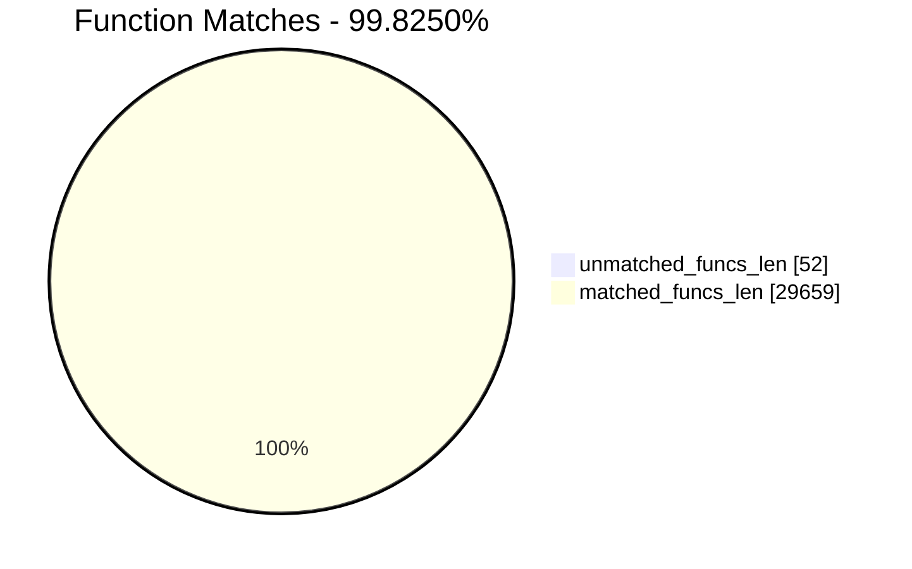
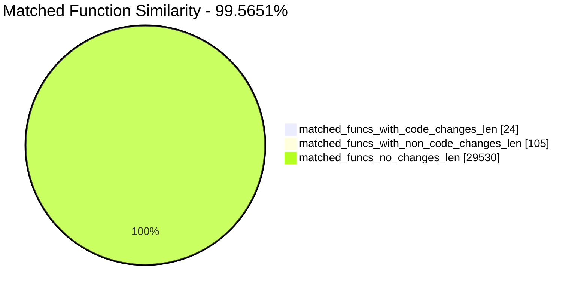
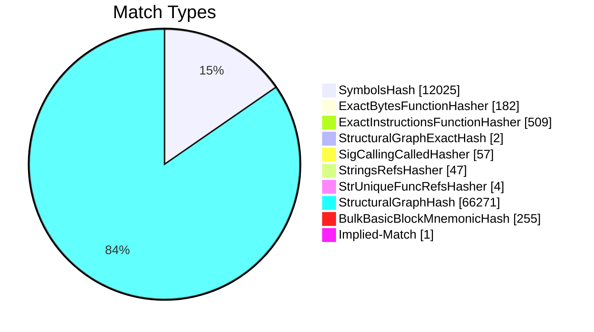
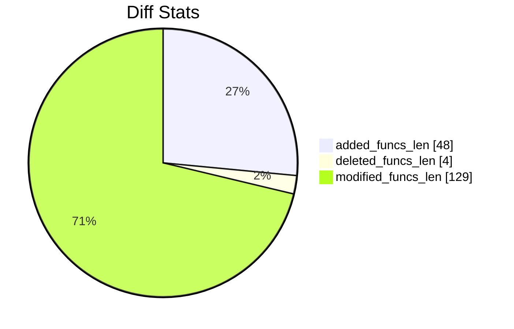
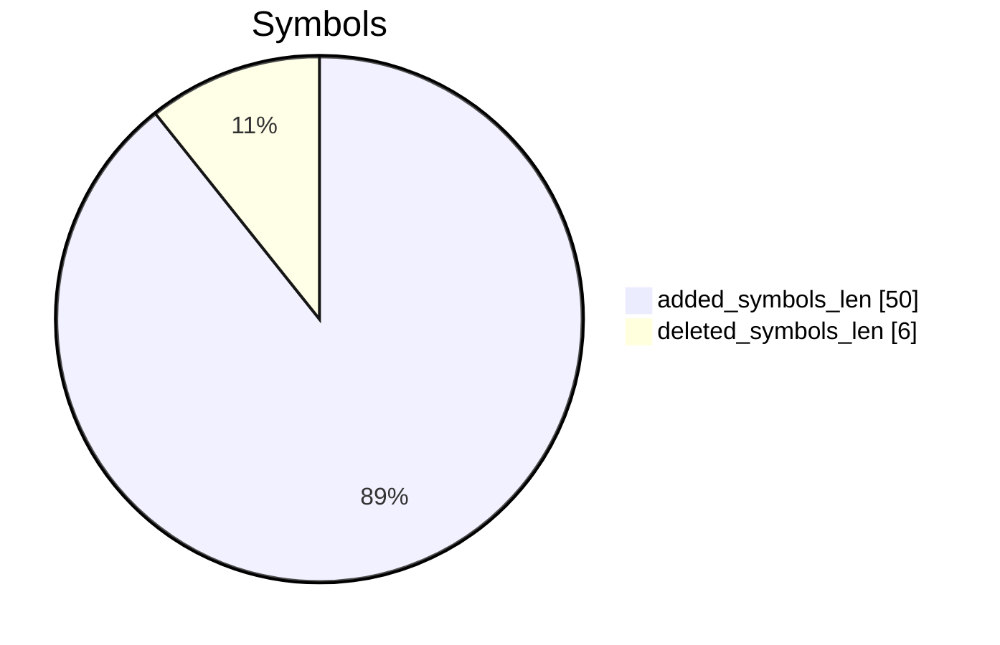
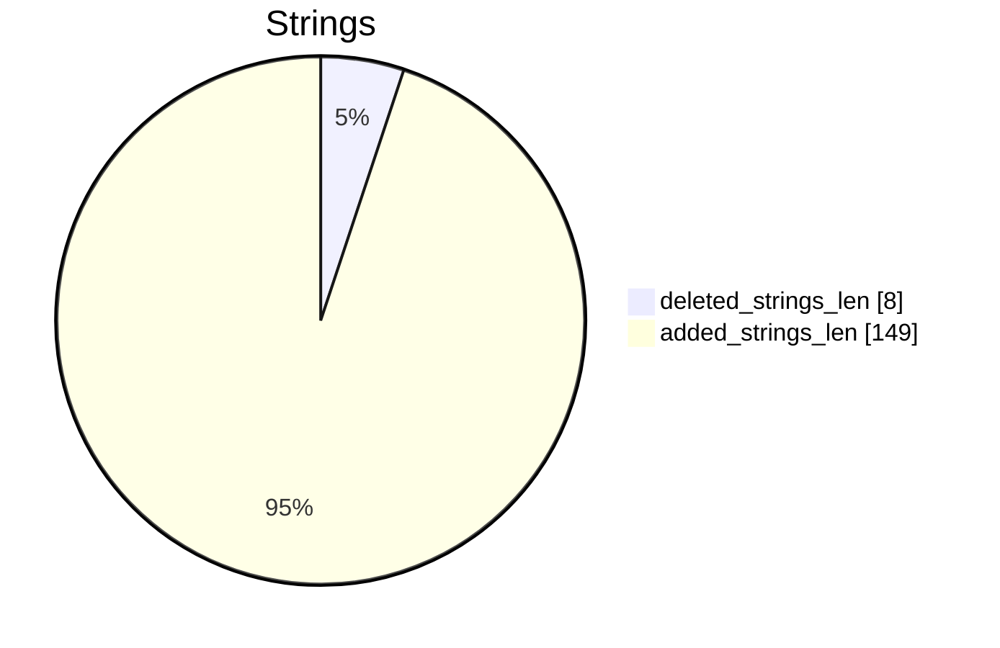

# cf23A-cf23B Diff

# TOC

- [cf23A-cf23B Diff](#cf23a-cf23b-diff)
- [TOC](#toc)
- [Visual Chart Diff](#visual-chart-diff)
- [Metadata](#metadata)
  - [Ghidra Diff Engine](#ghidra-diff-engine)
    - [Command Line](#command-line)
      - [Captured Command Line](#captured-command-line)
      - [Verbose Args](#verbose-args)
  - [Binary Metadata Diff](#binary-metadata-diff)
  - [Program Options](#program-options)
  - [Diff Stats](#diff-stats)
  - [Strings](#strings)
    - [Strings Diff](#strings-diff)
- [Deleted](#deleted)
  - [+\[CNContactMetadataPersistentStoreManager\_sharedPersistentContainer\]](#cncontactmetadatapersistentstoremanager_sharedpersistentcontainer)
    - [Function Meta](#function-meta)
  - [\_\_\_68+\[CNContactMetadataPersistentStoreManager\_sharedPersistentContainer\]\_block\_invoke](#___68cncontactmetadatapersistentstoremanager_sharedpersistentcontainer_block_invoke)
    - [Function Meta](#function-meta-1)
  - [-\[CNContactMetadataPersistentStoreManager\_setupIfNeeded:\]](#-cncontactmetadatapersistentstoremanager_setupifneeded)
    - [Function Meta](#function-meta-2)
  - [-\[CNContactMetadataPersistentStoreManager\_setupIfNeeded:\].cold.1](#-cncontactmetadatapersistentstoremanager_setupifneededcold1)
    - [Function Meta](#function-meta-3)
- [Added](#added)
  - [-\[CNSharedProfileStateOracle\_currentNicknameHasValidVisualIdentityData\]](#-cnsharedprofilestateoracle_currentnicknamehasvalidvisualidentitydata)
    - [Function Meta](#function-meta-4)
  - [-\[CNSharedProfileStateOracle\_pendingNicknameHasValidVisualIdentityData\]](#-cnsharedprofilestateoracle_pendingnicknamehasvalidvisualidentitydata)
    - [Function Meta](#function-meta-5)
  - [-\[CNSharedProfileStateOracle\_nicknameHasValidVisualIdentityData:\]](#-cnsharedprofilestateoracle_nicknamehasvalidvisualidentitydata)
    - [Function Meta](#function-meta-6)
  - [-\[CNAggregateContactStore\_getBackgroundColorOnImageData:bitmapFormat:error:\]](#-cnaggregatecontactstore_getbackgroundcoloronimagedatabitmapformaterror)
    - [Function Meta](#function-meta-7)
  - [-\[CNXPCDataMapper\_getBackgroundColorOnImageData:bitmapFormat:error:\]](#-cnxpcdatamapper_getbackgroundcoloronimagedatabitmapformaterror)
    - [Function Meta](#function-meta-8)
  - [+\[CNVisualSimilarity\_fingerprintForImageRequestHandler:\]](#cnvisualsimilarity_fingerprintforimagerequesthandler)
    - [Function Meta](#function-meta-9)
  - [\_\_\_50+\[CNUnifiedContacts\_wallpaperValuePropertiesByKey\]\_block\_invoke](#___50cnunifiedcontacts_wallpapervaluepropertiesbykey_block_invoke)
    - [Function Meta](#function-meta-10)
  - [+\[CNUnifiedContacts\_wallpaperValuePropertyKeys\]](#cnunifiedcontacts_wallpapervaluepropertykeys)
    - [Function Meta](#function-meta-11)
  - [\_\_\_47+\[CNUnifiedContacts\_wallpaperValuePropertyKeys\]\_block\_invoke](#___47cnunifiedcontacts_wallpapervaluepropertykeys_block_invoke)
    - [Function Meta](#function-meta-12)
  - [+\[CNUnifiedContacts\_sortedContacts:withPreferredContact:\]](#cnunifiedcontacts_sortedcontactswithpreferredcontact)
    - [Function Meta](#function-meta-13)
  - [+\[CNUnifiedContacts\_unifyWallpaperOfContacts:intoContact:availableKeyDescriptor:\]](#cnunifiedcontacts_unifywallpaperofcontactsintocontactavailablekeydescriptor)
    - [Function Meta](#function-meta-14)
  - [-\[CNContactImageStore\_countForFetchRequest:error:\]](#-cncontactimagestore_countforfetchrequesterror)
    - [Function Meta](#function-meta-15)
  - [\_\_\_50-\[CNContactImageStore\_countForFetchRequest:error:\]\_block\_invoke](#___50-cncontactimagestore_countforfetchrequesterror_block_invoke)
    - [Function Meta](#function-meta-16)
  - [-\[CNImageUtilsBitmapFormat\_initWithCoder:\]](#-cnimageutilsbitmapformat_initwithcoder)
    - [Function Meta](#function-meta-17)
  - [-\[CNImageUtilsBitmapFormat\_encodeWithCoder:\]](#-cnimageutilsbitmapformat_encodewithcoder)
    - [Function Meta](#function-meta-18)
  - [-\[CNImageUtilsBitmapFormat\_isEqual:\]](#-cnimageutilsbitmapformat_isequal)
    - [Function Meta](#function-meta-19)
  - [-\[CNImageUtilsBitmapFormat\_isEqualToFormat:\]](#-cnimageutilsbitmapformat_isequaltoformat)
    - [Function Meta](#function-meta-20)
  - [+\[CNImageUtilsBitmapFormat\_bitmapFormatWithBitmapImage:\]](#cnimageutilsbitmapformat_bitmapformatwithbitmapimage)
    - [Function Meta](#function-meta-21)
  - [-\[CNImageUtilsBitmapFormat\_initWithBitmapContext:\]](#-cnimageutilsbitmapformat_initwithbitmapcontext)
    - [Function Meta](#function-meta-22)
  - [-\[CNImageUtilsBitmapFormat\_colorSpace\]](#-cnimageutilsbitmapformat_colorspace)
    - [Function Meta](#function-meta-23)
  - [-\[CNWithWallpaperMetadataContactPredicate\_description\]](#-cnwithwallpapermetadatacontactpredicate_description)
    - [Function Meta](#function-meta-24)
  - [-\[CNWithWallpaperMetadataContactPredicate\_shortDebugDescription\]](#-cnwithwallpapermetadatacontactpredicate_shortdebugdescription)
    - [Function Meta](#function-meta-25)
  - [-\[CNWithWallpaperMetadataContactPredicate\_isEqual:\]](#-cnwithwallpapermetadatacontactpredicate_isequal)
    - [Function Meta](#function-meta-26)
  - [-\[CNWithWallpaperMetadataContactPredicate\_initWithCoder:\]](#-cnwithwallpapermetadatacontactpredicate_initwithcoder)
    - [Function Meta](#function-meta-27)
  - [-\[CNWithWallpaperMetadataContactPredicate\_encodeWithCoder:\]](#-cnwithwallpapermetadatacontactpredicate_encodewithcoder)
    - [Function Meta](#function-meta-28)
  - [-\[CNDataMapperContactStore\_getBackgroundColorOnImageData:bitmapFormat:error:\]](#-cndatamappercontactstore_getbackgroundcoloronimagedatabitmapformaterror)
    - [Function Meta](#function-meta-29)
  - [\_\_\_77-\[CNDataMapperContactStore\_getBackgroundColorOnImageData:bitmapFormat:error:\]\_block\_invoke](#___77-cndatamappercontactstore_getbackgroundcoloronimagedatabitmapformaterror_block_invoke)
    - [Function Meta](#function-meta-30)
  - [+\[CNContactMetadataPersistentStoreManager\_sharedPersistentContainerForModel:storeLocation:\]](#cncontactmetadatapersistentstoremanager_sharedpersistentcontainerformodelstorelocation)
    - [Function Meta](#function-meta-31)
  - [+\[CNContactMetadataPersistentStoreManager\_storeFileURLForLocation:\]](#cncontactmetadatapersistentstoremanager_storefileurlforlocation)
    - [Function Meta](#function-meta-32)
  - [\_\_\_65-\[CNContactMetadataPersistentStoreManager\_initWithStoreLocation:\]\_block\_invoke](#___65-cncontactmetadatapersistentstoremanager_initwithstorelocation_block_invoke)
    - [Function Meta](#function-meta-33)
  - [-\[CNContactMetadataPersistentStoreManager\_setupIfNeeded\]](#-cncontactmetadatapersistentstoremanager_setupifneeded-1)
    - [Function Meta](#function-meta-34)
  - [\_\_\_56-\[CNContactMetadataPersistentStoreManager\_setupIfNeeded\]\_block\_invoke](#___56-cncontactmetadatapersistentstoremanager_setupifneeded_block_invoke)
    - [Function Meta](#function-meta-35)
  - [+\[CNContactMetadataPersistentStoreManager\_performLightweightMigrationIfNeededError:\]](#cncontactmetadatapersistentstoremanager_performlightweightmigrationifneedederror)
    - [Function Meta](#function-meta-36)
  - [-\[CNContactMetadataPersistentStoreManager\_setLoadPersistentStoresError:\]](#-cncontactmetadatapersistentstoremanager_setloadpersistentstoreserror)
    - [Function Meta](#function-meta-37)
  - [\_OUTLINED\_FUNCTION\_1](#_outlined_function_1)
    - [Function Meta](#function-meta-38)
  - [+\[CNContactStoreContactsFetchResultSharedAvatarDecorator\_allNicknamesForContact:\]](#cncontactstorecontactsfetchresultsharedavatardecorator_allnicknamesforcontact)
    - [Function Meta](#function-meta-39)
  - [-\[CNWallpaper\_initWithPosterArchiveData:contentIsSensitive:\]](#-cnwallpaper_initwithposterarchivedatacontentissensitive)
    - [Function Meta](#function-meta-40)
  - [-\[\_CNContactsLogger\_gettingBackgroundColor:\]](#-_cncontactslogger_gettingbackgroundcolor)
    - [Function Meta](#function-meta-41)
  - [\_\_\_44-\[\_CNContactsLogger\_gettingBackgroundColor:\]\_block\_invoke](#___44-_cncontactslogger_gettingbackgroundcolor_block_invoke)
    - [Function Meta](#function-meta-42)
  - [\_\_\_44-\[\_CNContactsLogger\_gettingBackgroundColor:\]\_block\_invoke\_2](#___44-_cncontactslogger_gettingbackgroundcolor_block_invoke_2)
    - [Function Meta](#function-meta-43)
  - [-\[CNCoreDataMapperX\_userMightHaveUnconfiguredPersistenceStack\]](#-cncoredatamapperx_usermighthaveunconfiguredpersistencestack)
    - [Function Meta](#function-meta-44)
  - [\_CNImageUtilsCreateMmappedBitmapContext](#_cnimageutilscreatemmappedbitmapcontext)
    - [Function Meta](#function-meta-45)
  - [-\[CNDataMapperContactStore\_\_requestDataMapperAccessType:error:\].cold.1](#-cndatamappercontactstore__requestdatamapperaccesstypeerrorcold1)
    - [Function Meta](#function-meta-46)
  - [-\[CNContactMetadataPersistentStoreManager\_setupIfNeeded\].cold.1](#-cncontactmetadatapersistentstoremanager_setupifneededcold1-1)
    - [Function Meta](#function-meta-47)
  - [\_\_\_56-\[CNContactMetadataPersistentStoreManager\_setupIfNeeded\]\_block\_invoke.cold.1](#___56-cncontactmetadatapersistentstoremanager_setupifneeded_block_invokecold1)
    - [Function Meta](#function-meta-48)
  - [+\[CNContactMetadataPersistentStoreManager\_performLightweightMigrationIfNeededError:\].cold.1](#cncontactmetadatapersistentstoremanager_performlightweightmigrationifneedederrorcold1)
    - [Function Meta](#function-meta-49)
  - [+\[CNContactMetadataPersistentStoreManager\_performLightweightMigrationIfNeededError:\].cold.2](#cncontactmetadatapersistentstoremanager_performlightweightmigrationifneedederrorcold2)
    - [Function Meta](#function-meta-50)
  - [\_CNImageUtilsCreateMmappedBitmapContext.cold.1](#_cnimageutilscreatemmappedbitmapcontextcold1)
    - [Function Meta](#function-meta-51)
- [Modified](#modified)
  - [-\[CNContactMetadataPersistentStoreManager\_initWithStoreLocation:\]](#-cncontactmetadatapersistentstoremanager_initwithstorelocation)
    - [Match Info](#match-info)
    - [Function Meta Diff](#function-meta-diff)
    - [-\[CNContactMetadataPersistentStoreManager\_initWithStoreLocation:\] Called Diff](#-cncontactmetadatapersistentstoremanager_initwithstorelocation-called-diff)
    - [-\[CNContactMetadataPersistentStoreManager\_initWithStoreLocation:\] Diff](#-cncontactmetadatapersistentstoremanager_initwithstorelocation-diff)
  - [+\[CNUnifiedContacts\_unifyImageOfContacts:intoContact:availableKeyDescriptor:\]](#cnunifiedcontacts_unifyimageofcontactsintocontactavailablekeydescriptor)
    - [Match Info](#match-info-1)
    - [Function Meta Diff](#function-meta-diff-1)
    - [+\[CNUnifiedContacts\_unifyImageOfContacts:intoContact:availableKeyDescriptor:\] Called Diff](#cnunifiedcontacts_unifyimageofcontactsintocontactavailablekeydescriptor-called-diff)
    - [+\[CNUnifiedContacts\_unifyImageOfContacts:intoContact:availableKeyDescriptor:\] Diff](#cnunifiedcontacts_unifyimageofcontactsintocontactavailablekeydescriptor-diff)
  - [+\[CNSharedProfileStateOracle\_effectiveStateForContact:\]](#cnsharedprofilestateoracle_effectivestateforcontact)
    - [Match Info](#match-info-2)
    - [Function Meta Diff](#function-meta-diff-2)
    - [+\[CNSharedProfileStateOracle\_effectiveStateForContact:\] Diff](#cnsharedprofilestateoracle_effectivestateforcontact-diff)
  - [-\[CNWallpaper\_encodeWithCoder:\]](#-cnwallpaper_encodewithcoder)
    - [Match Info](#match-info-3)
    - [Function Meta Diff](#function-meta-diff-3)
    - [-\[CNWallpaper\_encodeWithCoder:\] Called Diff](#-cnwallpaper_encodewithcoder-called-diff)
    - [-\[CNWallpaper\_encodeWithCoder:\] Diff](#-cnwallpaper_encodewithcoder-diff)
  - [-\[CNWallpaper\_copyWithZone:\]](#-cnwallpaper_copywithzone)
    - [Match Info](#match-info-4)
    - [Function Meta Diff](#function-meta-diff-4)
    - [-\[CNWallpaper\_copyWithZone:\] Called Diff](#-cnwallpaper_copywithzone-called-diff)
    - [-\[CNWallpaper\_copyWithZone:\] Diff](#-cnwallpaper_copywithzone-diff)
  - [-\[CNContactMetadataPersistentStoreManager\_performWorkWithManagedObjectContext:error:\]](#-cncontactmetadatapersistentstoremanager_performworkwithmanagedobjectcontexterror)
    - [Match Info](#match-info-5)
    - [Function Meta Diff](#function-meta-diff-5)
    - [-\[CNContactMetadataPersistentStoreManager\_performWorkWithManagedObjectContext:error:\] Called Diff](#-cncontactmetadatapersistentstoremanager_performworkwithmanagedobjectcontexterror-called-diff)
    - [-\[CNContactMetadataPersistentStoreManager\_performWorkWithManagedObjectContext:error:\] Diff](#-cncontactmetadatapersistentstoremanager_performworkwithmanagedobjectcontexterror-diff)
  - [-\[CNDataMapperContactStore\_\_requestDataMapperAccessType:error:\]](#-cndatamappercontactstore__requestdatamapperaccesstypeerror)
    - [Match Info](#match-info-6)
    - [Function Meta Diff](#function-meta-diff-6)
    - [-\[CNDataMapperContactStore\_\_requestDataMapperAccessType:error:\] Called Diff](#-cndatamappercontactstore__requestdatamapperaccesstypeerror-called-diff)
    - [-\[CNDataMapperContactStore\_\_requestDataMapperAccessType:error:\] Diff](#-cndatamappercontactstore__requestdatamapperaccesstypeerror-diff)
  - [-\[CNContactMetadataPersistentStoreManager\_createStoreDirectoryIfNeeded:\].cold.1](#-cncontactmetadatapersistentstoremanager_createstoredirectoryifneededcold1)
    - [Match Info](#match-info-7)
    - [Function Meta Diff](#function-meta-diff-7)
    - [-\[CNContactMetadataPersistentStoreManager\_createStoreDirectoryIfNeeded:\].cold.1 Called Diff](#-cncontactmetadatapersistentstoremanager_createstoredirectoryifneededcold1-called-diff)
    - [-\[CNContactMetadataPersistentStoreManager\_createStoreDirectoryIfNeeded:\].cold.1 Diff](#-cncontactmetadatapersistentstoremanager_createstoredirectoryifneededcold1-diff)
  - [-\[CNSharedProfile\_initWithNickname:\]](#-cnsharedprofile_initwithnickname)
    - [Match Info](#match-info-8)
    - [Function Meta Diff](#function-meta-diff-8)
    - [-\[CNSharedProfile\_initWithNickname:\] Called Diff](#-cnsharedprofile_initwithnickname-called-diff)
    - [-\[CNSharedProfile\_initWithNickname:\] Diff](#-cnsharedprofile_initwithnickname-diff)
  - [\_\_\_83+\[CNContactStoreContactsFetchResultSharedAvatarDecorator\_descriptorForRequiredKeys\]\_block\_invoke](#___83cncontactstorecontactsfetchresultsharedavatardecorator_descriptorforrequiredkeys_block_invoke)
    - [Match Info](#match-info-9)
    - [Function Meta Diff](#function-meta-diff-9)
    - [\_\_\_83+\[CNContactStoreContactsFetchResultSharedAvatarDecorator\_descriptorForRequiredKeys\]\_block\_invoke Diff](#___83cncontactstorecontactsfetchresultsharedavatardecorator_descriptorforrequiredkeys_block_invoke-diff)
  - [-\[CNWallpaper\_initWithCoder:\]](#-cnwallpaper_initwithcoder)
    - [Match Info](#match-info-10)
    - [Function Meta Diff](#function-meta-diff-10)
    - [-\[CNWallpaper\_initWithCoder:\] Called Diff](#-cnwallpaper_initwithcoder-called-diff)
    - [-\[CNWallpaper\_initWithCoder:\] Diff](#-cnwallpaper_initwithcoder-diff)
  - [-\[CNSharedProfileStateOracle\_updateContactAndNicknamesForActionType:error:\]](#-cnsharedprofilestateoracle_updatecontactandnicknamesforactiontypeerror)
    - [Match Info](#match-info-11)
    - [Function Meta Diff](#function-meta-diff-11)
    - [-\[CNSharedProfileStateOracle\_updateContactAndNicknamesForActionType:error:\] Called Diff](#-cnsharedprofilestateoracle_updatecontactandnicknamesforactiontypeerror-called-diff)
    - [-\[CNSharedProfileStateOracle\_updateContactAndNicknamesForActionType:error:\] Diff](#-cnsharedprofilestateoracle_updatecontactandnicknamesforactiontypeerror-diff)
  - [+\[CNUnifiedContacts\_\_unifyContactsSortedByPreference:includingMainStoreContacts:\]](#cnunifiedcontacts__unifycontactssortedbypreferenceincludingmainstorecontacts)
    - [Match Info](#match-info-12)
    - [Function Meta Diff](#function-meta-diff-12)
    - [+\[CNUnifiedContacts\_\_unifyContactsSortedByPreference:includingMainStoreContacts:\] Called Diff](#cnunifiedcontacts__unifycontactssortedbypreferenceincludingmainstorecontacts-called-diff)
    - [+\[CNUnifiedContacts\_\_unifyContactsSortedByPreference:includingMainStoreContacts:\] Diff](#cnunifiedcontacts__unifycontactssortedbypreferenceincludingmainstorecontacts-diff)
  - [-\[CNSharedProfileStateOracle\_targetProfileForActionType:\]](#-cnsharedprofilestateoracle_targetprofileforactiontype)
    - [Match Info](#match-info-13)
    - [Function Meta Diff](#function-meta-diff-13)
    - [-\[CNSharedProfileStateOracle\_targetProfileForActionType:\] Called Diff](#-cnsharedprofilestateoracle_targetprofileforactiontype-called-diff)
    - [-\[CNSharedProfileStateOracle\_targetProfileForActionType:\] Diff](#-cnsharedprofilestateoracle_targetprofileforactiontype-diff)
  - [-\[CNAPITriageLogger\_willExecuteFetchRequest:\]](#-cnapitriagelogger_willexecutefetchrequest)
    - [Match Info](#match-info-14)
    - [Function Meta Diff](#function-meta-diff-14)
    - [-\[CNAPITriageLogger\_willExecuteFetchRequest:\] Called Diff](#-cnapitriagelogger_willexecutefetchrequest-called-diff)
    - [-\[CNAPITriageLogger\_willExecuteFetchRequest:\] Diff](#-cnapitriagelogger_willexecutefetchrequest-diff)
  - [-\[CNNicknameProvider\_sharedWallpaperForNickname:\]](#-cnnicknameprovider_sharedwallpaperfornickname)
    - [Match Info](#match-info-15)
    - [Function Meta Diff](#function-meta-diff-15)
    - [-\[CNNicknameProvider\_sharedWallpaperForNickname:\] Called Diff](#-cnnicknameprovider_sharedwallpaperfornickname-called-diff)
    - [-\[CNNicknameProvider\_sharedWallpaperForNickname:\] Diff](#-cnnicknameprovider_sharedwallpaperfornickname-diff)
  - [-\[CNWallpaper\_wallpaperIncludingIMWallpaperMetadata:\]](#-cnwallpaper_wallpaperincludingimwallpapermetadata)
    - [Match Info](#match-info-16)
    - [Function Meta Diff](#function-meta-diff-16)
    - [-\[CNWallpaper\_wallpaperIncludingIMWallpaperMetadata:\] Called Diff](#-cnwallpaper_wallpaperincludingimwallpapermetadata-called-diff)
    - [-\[CNWallpaper\_wallpaperIncludingIMWallpaperMetadata:\] Diff](#-cnwallpaper_wallpaperincludingimwallpapermetadata-diff)
  - [-\[CNContactMetadataPersistentStoreManager\_.cxx\_destruct\]](#-cncontactmetadatapersistentstoremanager_cxx_destruct)
    - [Match Info](#match-info-17)
    - [Function Meta Diff](#function-meta-diff-17)
    - [-\[CNContactMetadataPersistentStoreManager\_.cxx\_destruct\] Diff](#-cncontactmetadatapersistentstoremanager_cxx_destruct-diff)
  - [+\[CNXPCDataMapper\_serviceProtocolInterface\]](#cnxpcdatamapper_serviceprotocolinterface)
    - [Match Info](#match-info-18)
    - [Function Meta Diff](#function-meta-diff-18)
    - [+\[CNXPCDataMapper\_serviceProtocolInterface\] Diff](#cnxpcdatamapper_serviceprotocolinterface-diff)
  - [+\[CNVisualSimilarity\_fingerprintForData:\]](#cnvisualsimilarity_fingerprintfordata)
    - [Match Info](#match-info-19)
    - [Function Meta Diff](#function-meta-diff-19)
    - [+\[CNVisualSimilarity\_fingerprintForData:\] Called Diff](#cnvisualsimilarity_fingerprintfordata-called-diff)
    - [+\[CNVisualSimilarity\_fingerprintForData:\] Diff](#cnvisualsimilarity_fingerprintfordata-diff)
  - [-\[CNContactStoreContactsFetchResultSharedAvatarDecorator\_nicknameForContact:\]](#-cncontactstorecontactsfetchresultsharedavatardecorator_nicknameforcontact)
    - [Match Info](#match-info-20)
    - [Function Meta Diff](#function-meta-diff-20)
    - [-\[CNContactStoreContactsFetchResultSharedAvatarDecorator\_nicknameForContact:\] Called Diff](#-cncontactstorecontactsfetchresultsharedavatardecorator_nicknameforcontact-called-diff)
    - [-\[CNContactStoreContactsFetchResultSharedAvatarDecorator\_nicknameForContact:\] Diff](#-cncontactstorecontactsfetchresultsharedavatardecorator_nicknameforcontact-diff)
  - [-\[CNWallpaper\_initWithPosterArchiveData:metadata:\]](#-cnwallpaper_initwithposterarchivedatametadata)
    - [Match Info](#match-info-21)
    - [Function Meta Diff](#function-meta-diff-21)
    - [-\[CNWallpaper\_initWithPosterArchiveData:metadata:\] Called Diff](#-cnwallpaper_initwithposterarchivedatametadata-called-diff)
    - [-\[CNWallpaper\_initWithPosterArchiveData:metadata:\] Diff](#-cnwallpaper_initwithposterarchivedatametadata-diff)
  - [-\[CNWallpaper\_initWithPosterArchiveData:fontDescription:fontColorDescription:backgroundColorDescription:extensionBundleID:vertical:visualFingerprintData:\]](#-cnwallpaper_initwithposterarchivedatafontdescriptionfontcolordescriptionbackgroundcolordescriptionextensionbundleidverticalvisualfingerprintdata)
    - [Match Info](#match-info-22)
    - [Function Meta Diff](#function-meta-diff-22)
    - [-\[CNWallpaper\_initWithPosterArchiveData:fontDescription:fontColorDescription:backgroundColorDescription:extensionBundleID:vertical:visualFingerprintData:\] Called Diff](#-cnwallpaper_initwithposterarchivedatafontdescriptionfontcolordescriptionbackgroundcolordescriptionextensionbundleidverticalvisualfingerprintdata-called-diff)
    - [-\[CNWallpaper\_initWithPosterArchiveData:fontDescription:fontColorDescription:backgroundColorDescription:extensionBundleID:vertical:visualFingerprintData:\] Diff](#-cnwallpaper_initwithposterarchivedatafontdescriptionfontcolordescriptionbackgroundcolordescriptionextensionbundleidverticalvisualfingerprintdata-diff)
  - [-\[CNContactStoreContactsFetchResultSharedAvatarDecorator\_doesKeysToFetchContainRequiredImageKeys\]](#-cncontactstorecontactsfetchresultsharedavatardecorator_doeskeystofetchcontainrequiredimagekeys)
    - [Match Info](#match-info-23)
    - [Function Meta Diff](#function-meta-diff-23)
    - [-\[CNContactStoreContactsFetchResultSharedAvatarDecorator\_doesKeysToFetchContainRequiredImageKeys\] Diff](#-cncontactstorecontactsfetchresultsharedavatardecorator_doeskeystofetchcontainrequiredimagekeys-diff)

# Visual Chart Diff







# Metadata

## Ghidra Diff Engine

### Command Line

#### Captured Command Line


```
ghidriff --project-location ghidra_projects --project-name ghidriff --symbols-path symbols --threaded --log-level INFO --file-log-level INFO --log-path ghidriff.log --max-ram-percent 60.0 --max-section-funcs 200 cf23A cf23B
```


#### Verbose Args


<details>

```
--old ['cf23A'] --new [['cf23B']] --engine VersionTrackingDiff --output-path ghidriffs --summary False --project-location ghidra_projects --project-name ghidriff --symbols-path symbols --threaded True --force-analysis False --force-diff False --no-symbols False --log-level INFO --file-log-level INFO --log-path ghidriff.log --va False --max-ram-percent 60.0 --print-flags False --jvm-args None --side-by-side False --max-section-funcs 200 --md-title None
```


</details>

## Binary Metadata Diff


```diff
--- cf23A Meta
+++ cf23B Meta
@@ -1,72 +1,73 @@
-Program Name: cf23A
+Program Name: cf23B
 Language ID: AARCH64:LE:64:AppleSilicon (1.5)
 Compiler ID: default
 Processor: AARCH64
 Endian: Little
 Address Size: 64
-Minimum Address: 194b75000
-Maximum Address: 237d72687
-# of Bytes: 3691416
-# of Memory Blocks: 60
-# of Instructions: 394831
-# of Defined Data: 72743
-# of Functions: 14778
-# of Symbols: 54815
+Minimum Address: 194bd8000
+Maximum Address: 23838175f
+# of Bytes: 3722664
+# of Memory Blocks: 61
+# of Instructions: 397595
+# of Defined Data: 73400
+# of Functions: 14933
+# of Symbols: 55289
 # of Data Types: 70
 # of Data Type Categories: 4
 Analyzed: true
 Created With Ghidra Version: 10.4
-Date Created: Thu Dec 14 19:52:19 UTC 2023
+Date Created: Thu Dec 14 19:47:23 UTC 2023
 Executable Format: Mac OS X Mach-O
-Executable Location: /workspaces/ghidriff/cf23A
-Executable MD5: 6c1b02bb08259cc7afbf8b5393db72e9
-Executable SHA256: ab761593b42352b79eae212cdf21446476bf4700bcbb6b5e27b2d2af6a115e60
-FSRL: file:///workspaces/ghidriff/cf23A?MD5=6c1b02bb08259cc7afbf8b5393db72e9
+Executable Location: /workspaces/ghidriff/cf23B
+Executable MD5: 9a93974231221369ed8d8083dc495efa
+Executable SHA256: 6389ecafb961c70edaab91ff1d06f5dab5665f22dbda33122a5d3715ebbf7e01
+FSRL: file:///workspaces/ghidriff/cf23B?MD5=9a93974231221369ed8d8083dc495efa
 Mach-O File Type: DYLIB
 Mach-O File Type Description: Dynamically Bound Shared Library
 Mach-O Flag 0: NOUNDEFS
 Mach-O Flag 1: DYLDLINK
 Mach-O Flag 2: TWOLEVEL
 Mach-O Flag 3: BINDS_TO_WEAK
 Mach-O Flag 4: NO_REEXPORTED_DYLIBS
 Mach-O Flag 5: APP_EXTENSION_SAFE
 Mach-O Flag 6: NLIST_OUTOFSYNC_WITH_DYLDINFO
 Preferred Root Namespace Category: 
 Relocatable: true
 Required Library [    0]: /System/Library/Frameworks/Contacts.framework/Versions/A/Contacts
 Required Library [    1]: /System/Library/PrivateFrameworks/ContactsPersistence.framework/Versions/A/ContactsPersistence
 Required Library [    2]: /System/Library/PrivateFrameworks/AddressBookCore.framework/Versions/A/AddressBookCore
 Required Library [    3]: /System/Library/Frameworks/CoreServices.framework/Versions/A/CoreServices
 Required Library [    4]: /System/Library/PrivateFrameworks/AppleLDAP.framework/Versions/A/AppleLDAP
 Required Library [    5]: /System/Library/Frameworks/ClassKit.framework/Versions/A/ClassKit
 Required Library [    6]: /System/Library/Frameworks/Vision.framework/Versions/A/Vision
-Required Library [    7]: /System/Library/PrivateFrameworks/CoreSuggestions.framework/Versions/A/CoreSuggestions
-Required Library [    8]: /System/Library/PrivateFrameworks/CoreAnalytics.framework/Versions/A/CoreAnalytics
-Required Library [    9]: /System/Library/PrivateFrameworks/RunningBoardServices.framework/Versions/A/RunningBoardServices
-Required Library [   10]: /System/Library/Frameworks/Accounts.framework/Versions/A/Accounts
-Required Library [   11]: /System/Library/PrivateFrameworks/ContactsFoundation.framework/Versions/A/ContactsFoundation
-Required Library [   12]: /System/Library/Frameworks/CoreData.framework/Versions/A/CoreData
-Required Library [   13]: /System/Library/Frameworks/CoreGraphics.framework/Versions/A/CoreGraphics
-Required Library [   14]: /System/Library/Frameworks/Foundation.framework/Versions/C/Foundation
-Required Library [   15]: /System/Library/Frameworks/ImageIO.framework/Versions/A/ImageIO
-Required Library [   16]: /System/Library/PrivateFrameworks/PhoneNumbers.framework/Versions/A/PhoneNumbers
-Required Library [   17]: /System/Library/PrivateFrameworks/TCC.framework/Versions/A/TCC
-Required Library [   18]: /System/Library/PrivateFrameworks/vCard.framework/Versions/A/vCard
-Required Library [   19]: /usr/lib/libobjc.A.dylib
-Required Library [   20]: /usr/lib/libSystem.B.dylib
-Required Library [   21]: /System/Library/Frameworks/CoreFoundation.framework/Versions/A/CoreFoundation
-Required Library [   22]: /System/Library/Frameworks/CryptoKit.framework/Versions/A/CryptoKit
-Required Library [   23]: /System/Library/Frameworks/ExtensionFoundation.framework/Versions/A/ExtensionFoundation
-Required Library [   24]: /System/Library/PrivateFrameworks/SoftLinking.framework/Versions/A/SoftLinking
-Required Library [   25]: /usr/lib/swift/libswiftCore.dylib
-Required Library [   26]: /usr/lib/swift/libswiftCoreFoundation.dylib
-Required Library [   27]: /usr/lib/swift/libswiftDarwin.dylib
-Required Library [   28]: /usr/lib/swift/libswiftDispatch.dylib
-Required Library [   29]: /usr/lib/swift/libswiftIOKit.dylib
-Required Library [   30]: /usr/lib/swift/libswiftMetal.dylib
-Required Library [   31]: /usr/lib/swift/libswiftOSLog.dylib
-Required Library [   32]: /usr/lib/swift/libswiftObjectiveC.dylib
-Required Library [   33]: /usr/lib/swift/libswiftXPC.dylib
-Required Library [   34]: /usr/lib/swift/libswift_Concurrency.dylib
-Required Library [   35]: /usr/lib/swift/libswiftos.dylib
+Required Library [    7]: /System/Library/PrivateFrameworks/login.framework/Versions/A/login
+Required Library [    8]: /System/Library/PrivateFrameworks/CoreSuggestions.framework/Versions/A/CoreSuggestions
+Required Library [    9]: /System/Library/PrivateFrameworks/CoreAnalytics.framework/Versions/A/CoreAnalytics
+Required Library [   10]: /System/Library/PrivateFrameworks/RunningBoardServices.framework/Versions/A/RunningBoardServices
+Required Library [   11]: /System/Library/Frameworks/Accounts.framework/Versions/A/Accounts
+Required Library [   12]: /System/Library/PrivateFrameworks/ContactsFoundation.framework/Versions/A/ContactsFoundation
+Required Library [   13]: /System/Library/Frameworks/CoreData.framework/Versions/A/CoreData
+Required Library [   14]: /System/Library/Frameworks/CoreGraphics.framework/Versions/A/CoreGraphics
+Required Library [   15]: /System/Library/Frameworks/Foundation.framework/Versions/C/Foundation
+Required Library [   16]: /System/Library/Frameworks/ImageIO.framework/Versions/A/ImageIO
+Required Library [   17]: /System/Library/PrivateFrameworks/PhoneNumbers.framework/Versions/A/PhoneNumbers
+Required Library [   18]: /System/Library/PrivateFrameworks/TCC.framework/Versions/A/TCC
+Required Library [   19]: /System/Library/PrivateFrameworks/vCard.framework/Versions/A/vCard
+Required Library [   20]: /usr/lib/libobjc.A.dylib
+Required Library [   21]: /usr/lib/libSystem.B.dylib
+Required Library [   22]: /System/Library/Frameworks/CoreFoundation.framework/Versions/A/CoreFoundation
+Required Library [   23]: /System/Library/Frameworks/CryptoKit.framework/Versions/A/CryptoKit
+Required Library [   24]: /System/Library/Frameworks/ExtensionFoundation.framework/Versions/A/ExtensionFoundation
+Required Library [   25]: /System/Library/PrivateFrameworks/SoftLinking.framework/Versions/A/SoftLinking
+Required Library [   26]: /usr/lib/swift/libswiftCore.dylib
+Required Library [   27]: /usr/lib/swift/libswiftCoreFoundation.dylib
+Required Library [   28]: /usr/lib/swift/libswiftDarwin.dylib
+Required Library [   29]: /usr/lib/swift/libswiftDispatch.dylib
+Required Library [   30]: /usr/lib/swift/libswiftIOKit.dylib
+Required Library [   31]: /usr/lib/swift/libswiftMetal.dylib
+Required Library [   32]: /usr/lib/swift/libswiftOSLog.dylib
+Required Library [   33]: /usr/lib/swift/libswiftObjectiveC.dylib
+Required Library [   34]: /usr/lib/swift/libswiftXPC.dylib
+Required Library [   35]: /usr/lib/swift/libswift_Concurrency.dylib
+Required Library [   36]: /usr/lib/swift/libswiftos.dylib
 Should Ask To Analyze: false

```


## Program Options


<details>
<summary>Ghidra cf23A Decompiler Options</summary>


|  Decompiler Option   |  Value  |
| :------------------: | :-----: |
| Prototype Evaluation | __cdecl |

</details>


<details>
<summary>Ghidra cf23A Specification extensions Options</summary>


| Specification extensions Option | Value |
| :-----------------------------: | :---: |
|          FormatVersion          |   0   |
|         VersionCounter          |   0   |

</details>


<details>
<summary>Ghidra cf23B Decompiler Options</summary>


|  Decompiler Option   |  Value  |
| :------------------: | :-----: |
| Prototype Evaluation | __cdecl |

</details>


<details>
<summary>Ghidra cf23B Specification extensions Options</summary>


| Specification extensions Option | Value |
| :-----------------------------: | :---: |
|          FormatVersion          |   0   |
|         VersionCounter          |   0   |

</details>


<details>
<summary>Ghidra cf23B Analyzers Options</summary>


|                               Analyzers Option                               |      Value      |
| :--------------------------------------------------------------------------: | :-------------: |
|                            AARCH64 ELF PLT Thunks                            |      true       |
|                                ASCII Strings                                 |      true       |
|           ASCII Strings.Create Strings Containing Existing Strings           |      true       |
|              ASCII Strings.Create Strings Containing References              |      true       |
|                       ASCII Strings.Force Model Reload                       |      false      |
|                     ASCII Strings.Minimum String Length                      |      LEN_5      |
|                           ASCII Strings.Model File                           | StringModel.sng |
|              ASCII Strings.Require Null Termination for String               |      true       |
|            ASCII Strings.Search Only in Accessible Memory Blocks             |      true       |
|                     ASCII Strings.String Start Alignment                     |     ALIGN_1     |
|                      ASCII Strings.String end alignment                      |        4        |
|                        Aggressive Instruction Finder                         |      false      |
|           Aggressive Instruction Finder.Create Analysis Bookmarks            |      true       |
|                             Apply Data Archives                              |      true       |
|                     Apply Data Archives.Archive Chooser                      |  [Auto-Detect]  |
|                Apply Data Archives.Create Analysis Bookmarks                 |      true       |
|                Apply Data Archives.GDT User File Archive Path                |      None       |
|                Apply Data Archives.User Project Archive Path                 |      None       |
|                      Basic Constant Reference Analyzer                       |      true       |
|          Basic Constant Reference Analyzer.Create Data from pointer          |      false      |
| Basic Constant Reference Analyzer.Function parameter/return Pointer analysis |      true       |
|                Basic Constant Reference Analyzer.Max Threads                 |        2        |
|           Basic Constant Reference Analyzer.Min absolute reference           |        4        |
|      Basic Constant Reference Analyzer.Require pointer param data type       |      false      |
|         Basic Constant Reference Analyzer.Speculative reference max          |       512       |
|         Basic Constant Reference Analyzer.Speculative reference min          |      1024       |
|       Basic Constant Reference Analyzer.Stored Value Pointer analysis        |      true       |
|   Basic Constant Reference Analyzer.Trust values read from writable memory   |      true       |
|                                  CFStrings                                   |      true       |
|                              Call Convention ID                              |      true       |
|             Call Convention ID.Analysis Decompiler Timeout (sec)             |       60        |
|                             Call-Fixup Installer                             |      true       |
|                            Condense Filler Bytes                             |      false      |
|                      Condense Filler Bytes.Filler Value                      |      Auto       |
|           Condense Filler Bytes.Minimum number of sequential bytes           |        1        |
|                            Create Address Tables                             |      true       |
|                Create Address Tables.Allow Offcut References                 |      false      |
|                    Create Address Tables.Auto Label Table                    |      false      |
|               Create Address Tables.Create Analysis Bookmarks                |      true       |
|               Create Address Tables.Maxmimum Pointer Distance                |    16777215     |
|                Create Address Tables.Minimum Pointer Address                 |      4132       |
|                   Create Address Tables.Minimum Table Size                   |        2        |
|                   Create Address Tables.Pointer Alignment                    |        1        |
|                 Create Address Tables.Relocation Table Guide                 |      true       |
|                    Create Address Tables.Table Alignment                     |        4        |
|                              DWARF Line Number                               |      false      |
|                                Data Reference                                |      true       |
|                    Data Reference.Address Table Alignment                    |        1        |
|                  Data Reference.Address Table Minimum Size                   |        2        |
|                     Data Reference.Align End of Strings                      |      false      |
|                    Data Reference.Ascii String References                    |      true       |
|                     Data Reference.Create Address Tables                     |      false      |
|                     Data Reference.Minimum String Length                     |        5        |
|                    Data Reference.References to Pointers                     |      true       |
|                    Data Reference.Relocation Table Guide                     |      true       |
|                     Data Reference.Respect Execute Flag                      |      true       |
|                     Data Reference.Subroutine References                     |      true       |
|                    Data Reference.Switch Table References                    |      false      |
|                   Data Reference.Unicode String References                   |      true       |
|                           Decompiler Parameter ID                            |      false      |
|                 Decompiler Parameter ID.Analysis Clear Level                 |    ANALYSIS     |
|          Decompiler Parameter ID.Analysis Decompiler Timeout (sec)           |       60        |
|                  Decompiler Parameter ID.Commit Data Types                   |      true       |
|              Decompiler Parameter ID.Commit Void Return Values               |      false      |
|                 Decompiler Parameter ID.Prototype Evaluation                 |     __cdecl     |
|                          Decompiler Switch Analysis                          |      true       |
|         Decompiler Switch Analysis.Analysis Decompiler Timeout (sec)         |       60        |
|                                Demangler GNU                                 |      true       |
|               Demangler GNU.Apply Function Calling Conventions               |      true       |
|                   Demangler GNU.Apply Function Signatures                    |      true       |
|              Demangler GNU.Demangle Only Known Mangled Symbols               |      false      |
|                        Demangler GNU.Demangler Format                        |      AUTO       |
|                    Demangler GNU.Use Deprecated Demangler                    |      false      |
|                           Disassemble Entry Points                           |      true       |
|                Disassemble Entry Points.Respect Execute Flag                 |      true       |
|                                Embedded Media                                |      true       |
|                   Embedded Media.Create Analysis Bookmarks                   |      true       |
|                          External Entry References                           |      true       |
|                           External Symbol Resolver                           |      true       |
|                            Function Start Search                             |      true       |
|                       Function Start Search After Code                       |      true       |
|             Function Start Search After Code.Bookmark Functions              |      false      |
|             Function Start Search After Code.Search Data Blocks              |      false      |
|                       Function Start Search After Data                       |      true       |
|             Function Start Search After Data.Bookmark Functions              |      false      |
|             Function Start Search After Data.Search Data Blocks              |      false      |
|                   Function Start Search.Bookmark Functions                   |      false      |
|                   Function Start Search.Search Data Blocks                   |      false      |
|                            Mach-O Function Starts                            |      true       |
|               Mach-O Function Starts.Bookmark failed functions               |      false      |
|                Mach-O Function Starts.Bookmark new functions                 |      false      |
|              Mach-O Function Starts.Bookmark skipped functions               |      false      |
|                Mach-O Function Starts.Use PseudoDisassembler                 |      true       |
|                     Non-Returning Functions - Discovered                     |      true       |
|        Non-Returning Functions - Discovered.Create Analysis Bookmarks        |      true       |
|      Non-Returning Functions - Discovered.Function Non-return Threshold      |        3        |
|           Non-Returning Functions - Discovered.Repair Flow Damage            |      true       |
|                       Non-Returning Functions - Known                        |      true       |
|          Non-Returning Functions - Known.Create Analysis Bookmarks           |      true       |
|                             Objective-C 2 Class                              |      true       |
|                       Objective-C 2 Decompiler Message                       |      true       |
|                            Objective-C 2 Message                             |      false      |
|                    PDB MSDIA.Search remote symbol servers                    |      true       |
|                  PDB Universal.Search remote symbol servers                  |      true       |
|                                  Reference                                   |      true       |
|                      Reference.Address Table Alignment                       |        1        |
|                     Reference.Address Table Minimum Size                     |        2        |
|                        Reference.Align End of Strings                        |      false      |
|                      Reference.Ascii String References                       |      true       |
|                       Reference.Create Address Tables                        |      false      |
|                       Reference.Minimum String Length                        |        5        |
|                       Reference.References to Pointers                       |      true       |
|                       Reference.Relocation Table Guide                       |      true       |
|                        Reference.Respect Execute Flag                        |      true       |
|                       Reference.Subroutine References                        |      true       |
|                      Reference.Switch Table References                       |      false      |
|                     Reference.Unicode String References                      |      true       |
|                          Scalar Operand References                           |      false      |
|               Scalar Operand References.Relocation Table Guide               |      true       |
|                             Shared Return Calls                              |      true       |
|                 Shared Return Calls.Allow Conditional Jumps                  |      false      |
|             Shared Return Calls.Assume Contiguous Functions Only             |      true       |
|                                    Stack                                     |      true       |
|                         Stack.Create Local Variables                         |      true       |
|                         Stack.Create Param Variables                         |      true       |
|                      Stack.useNewFunctionStackAnalysis                       |      true       |
|                            Subroutine References                             |      true       |
|                  Subroutine References.Create Thunks Early                   |      true       |
|                         Swift Type Metadata Analyzer                         |      true       |
|                     Variadic Function Signature Override                     |      false      |
|        Variadic Function Signature Override.Create Analysis Bookmarks        |      false      |

</details>

## Diff Stats


|                  Stat                   |                                                                                                                                                       Value                                                                                                                                                       |
| :-------------------------------------: | :---------------------------------------------------------------------------------------------------------------------------------------------------------------------------------------------------------------------------------------------------------------------------------------------------------------: |
|             added_funcs_len             |                                                                                                                                                        48                                                                                                                                                         |
|            deleted_funcs_len            |                                                                                                                                                         4                                                                                                                                                         |
|           modified_funcs_len            |                                                                                                                                                        129                                                                                                                                                        |
|            added_symbols_len            |                                                                                                                                                        50                                                                                                                                                         |
|           deleted_symbols_len           |                                                                                                                                                         6                                                                                                                                                         |
|                diff_time                |                                                                                                                                                25.848798751831055                                                                                                                                                 |
|           deleted_strings_len           |                                                                                                                                                         8                                                                                                                                                         |
|            added_strings_len            |                                                                                                                                                        149                                                                                                                                                        |
|               match_types               | Counter({'StructuralGraphHash': 66271, 'SymbolsHash': 12025, 'ExactInstructionsFunctionHasher': 509, 'BulkBasicBlockMnemonicHash': 255, 'ExactBytesFunctionHasher': 182, 'SigCallingCalledHasher': 57, 'StringsRefsHasher': 47, 'StrUniqueFuncRefsHasher': 4, 'StructuralGraphExactHash': 2, 'Implied Match': 1}) |
|            items_to_process             |                                                                                                                                                        237                                                                                                                                                        |
|               diff_types                |                                                                                      Counter({'address': 129, 'refcount': 104, 'calling': 102, 'length': 25, 'code': 24, 'called': 20, 'name': 4, 'fullname': 4, 'sig': 4})                                                                                       |
|           unmatched_funcs_len           |                                                                                                                                                        52                                                                                                                                                         |
|             total_funcs_len             |                                                                                                                                                       29711                                                                                                                                                       |
|            matched_funcs_len            |                                                                                                                                                       29659                                                                                                                                                       |
|   matched_funcs_with_code_changes_len   |                                                                                                                                                        24                                                                                                                                                         |
| matched_funcs_with_non_code_changes_len |                                                                                                                                                        105                                                                                                                                                        |
|      matched_funcs_no_changes_len       |                                                                                                                                                       29530                                                                                                                                                       |
|      match_func_similarity_percent      |                                                                                                                                                     99.5651%                                                                                                                                                      |
|       func_match_overall_percent        |                                                                                                                                                     99.8250%                                                                                                                                                      |










## Strings




### Strings Diff


```diff
--- deleted strings
+++ added strings
@@ -1,8 +1,149 @@
-s_%04llx_Predicate:_%{private}@_194d0d743
-s__objc_msgSend$setupIfNeeded:_237d21793
-s__objc_msgSend$addPersistentStore_237d082af
-s__sharedPersistentContainer.cn_on_237d59825
-s____72+[CNUnifiedContacts_indexOf_237cb5a79
-s_GCC_except_table65_237d024a5
-s_%04llx_Contact:_%@_194d0d7a6
-s_ContactMetadata_store_couldn't_b_194d0c90b
+s_-[CNImageUtilsBitmapFormat_bitsP_2382ca155
+s__CNImageUtilsCreateMmappedBitmap_238371361
+s_+[CNUnifiedContacts_unifyWallpap_2382c2a28
+s__objc_msgSend$setOption:forKey:_23832e67a
+s___OBJC_$_PROP_LIST_CNImageUtilsB_23833f309
+s__vm_page_size_23837f722
+s____51-[CNWithWallpaperMetadataCo_2382d4e4b
+s_%04llx_Predicate:_%{public}@_%{p_194d73a6c
+s__objc_msgSend$unifyWallpaperOfCo_238332069
+s_-[CNImageUtilsBitmapFormat_bytes_2382ca1ab
+s____50+[CNUnifiedContacts_wallpap_2382c2935
+s_Failed_to_load_persistent_stores_194d72b04
+s_bitsPerComponent_==_5_||_bitsPer_194d6c844
+s__objc_msgSend$height_23831fd1e
+s_Did_not_perform_migration,_no_ex_194d72bbb
+s___OBJC_$_CLASS_METHODS_CNWithWal_23830c446
+s__$!<SisterInLawBrothersWife>!$__194d67335
+s_+[CNWithWallpaperMetadataContact_2382d4ec1
+s_+[CNUnifiedContacts_sortedContac_2382c29ee
+s____53+[CNUnifiedContacts_indexOf_23829d6b6
+s___OBJC_CLASS_RO_$_CNImageUtilsBi_238353e1d
+s_+[CNUnifiedContacts_wallpaperVal_2382c297c
+s__objc_msgSend$metadataForPersist_238326c0e
+s__objc_msgSend$loadPersistentStor_238325a71
+s__CGBitmapContextGetBytesPerRow_23837ab41
+s_Did_not_perform_migration,_exist_194d72bfd
+s_GCC_except_table17_238310879
+s__OBJC_CLASS_$_CNWithWallpaperMet_238357b93
+s_-[CNCoreDataMapperX_userMightHav_2382ffdf6
+s_-[CNDataMapperContactStore_getBa_2382d7efb
+s__wallpaperValuePropertyKeys.cn_o_23836608f
+s__objc_msgSend$fingerprintForImag_23831eecf
+s__OBJC_IVAR_$_CNImageUtilsBitmapF_23835cd36
+s___OBJC_METACLASS_RO_$_CNImageUti_238353dee
+s__objc_msgSend$nicknameHasValidVi_238327336
+s_-[CNWallpaper_contentIsSensitive_2382f0410
+s__CGColorSpaceCopyPropertyList_23837abd0
+s_Loaded_container_with_descriptio_194d72b29
+s__objc_msgSend$setupIfNeeded_23832f840
+s__CGBitmapContextGetWidth_23837ab98
+s__objc_msgSend$setContentIsSensit_23832d210
+s_876_194d6b91d
+s__CGImageGetBytesPerRow_23837ad41
+s_-[CNXPCDataMapper_getBackgroundC_2382b3be6
+s___OBJC_$_CLASS_PROP_LIST_CNImage_23833f2a2
+s__objc_msgSend$userMightHaveUncon_238332dcb
+s__objc_msgSend$setColorSpace:_23832cff9
+s___OBJC_METACLASS_RO_$_CNWithWall_238354982
+s__initWithStoreLocation:.cn_once__238367fce
+s__OBJC_CLASS_$_CNImageUtilsBitmap_238376347
+s__CGImageGetBitsPerPixel_23837ad29
+s____76+[CNUnifiedContacts_indexOf_2382c285c
+s__CGColorSpaceRelease_23837ac52
+s___OBJC_$_INSTANCE_METHODS_CNWith_23830c485
+s__objc_msgSend$setBitsPerComponen_23832ccbe
+s_-[CNImageUtilsBitmapFormat_bitma_2382ca1ff
+s_-[CNImageUtilsBitmapFormat_setBi_2382ca226
+s_Did_not_perform_migration,_faile_194d72c51
+s__CGImageGetHeight_23837ad6e
+s__CGBitmapContextCreate_23837aac8
+s_-[CNImageUtilsBitmapFormat_encod_2382c9f7a
+s__wallpaperValuePropertiesByKey.c_238365fe2
+s__objc_msgSend$wallpaperValueProp_238333857
+s__CGBitmapContextGetHeight_23837ab7e
+s__CGImageGetBitmapInfo_23837acf7
+s_GCC_except_table74_2383100cf
+s__getuid_23837e9db
+s__SASSessionStateForUser_23837e2b3
+s_-[CNImageUtilsBitmapFormat_color_2382ca251
+s__objc_msgSend$setBitmapInfo:_23832cca1
+s____block_descriptor_40_e8_32w_e5_23834e217
+s__CGBitmapContextGetBitmapInfo_23837aadf
+s__CGBitmapContextGetBitsPerCompon_23837aafd
+s____56-[CNContactMetadataPersiste_2383053a5
+s_-[CNImageUtilsBitmapFormat_heigh_2382ca0ad
+s__$!<Stepsister>!$__194d683f6
+s__objc_msgSend$getBackgroundColor_23831f5e1
+s__mmap_23837ec13
+s_-[CNImageUtilsBitmapFormat_setHe_2382ca0d0
+s_+[CNImageUtilsBitmapFormat_bitma_2382c9ff9
+s_Did_not_perform_migration,_no_st_194d72b84
+s___OBJC_$_CLASS_METHODS_CNImageUt_23830b569
+s_-[CNImageUtilsBitmapFormat_setWi_2382ca087
+s_-[CNContact_predicateForGroupsWi_194d63a37
+s__OBJC_IVAR_$_CNWallpaper._conten_238361778
+s__objc_msgSend$setHeight:_23832db32
+s__objc_msgSend$colorSpace_238318ca5
+s____44-[_CNContactsLogger_getting_2382f822d
+s__CGImageGetBitsPerComponent_23837ad0d
+s_CNImageUtilities.m_194d6c831
+s____50-[CNContactImageStore_count_2382c99ca
+s____77-[CNDataMapperContactStore_g_2382d7f49
+s_-[CNContactImageStore_countForFe_2382c995c
+s_-[CNImageUtilsBitmapFormat_width_2382ca065
+s__OBJC_METACLASS_$_CNImageUtilsBi_2383793ab
+s_-[CNImageUtilsBitmapFormat_isEqu_2382c9fcc
+s__objc_msgSend$sortedContacts:wit_238330536
+s__objc_msgSend$bitmapInfo_238317d87
+s__objc_msgSend$contentIsSensitive_23831a88d
+s__objc_msgSend$gettingBackgroundC_23831f644
+s_CNImageUtilsCreateMmappedBitmapC_194d6c80a
+s__CGBitmapContextGetBitsPerPixel_23837ab21
+s____block_literal_global.54_23834a0df
+s__removedAccounts_194d6bee4
+s__CGBitmapGetAlignedBytesPerRow_23837abb1
+s__objc_msgSend$width_23833399f
+s_GCC_except_table138_23831059b
+s__objc_msgSend$setBitsPerPixel:_23832cce1
+s_-[CNImageUtilsBitmapFormat_initW_2382ca032
+s__CGColorSpaceCreateDeviceRGB_23837abee
+s_-[CNWithWallpaperMetadataContact_2382d4f3b
+s_ZIP_194d6c416
+s__CGImageGetWidth_23837ad80
+s__CGImageGetColorSpace_23837ad58
+s__objc_msgSend$isConfiguration:co_2383240da
+s__OBJC_CLASS_$_NSPersistentStoreC_23837dd66
+s_com.apple.Maps_194d658c7
+s__objc_msgSend$storeFileURLForLoc_238330aa8
+s_API_request_denied_because_the_u_194d711b2
+s___OBJC_$_INSTANCE_VARIABLES_CNIm_23833f2d4
+s_-[_CNContactsLogger_gettingBackg_2382f81c1
+s_Errors_194d6b03e
+s___OBJC_CLASS_RO_$_CNWithWallpape_2383549c0
+s_Failed_to_setup_store:_%@_194d72aea
+s_-[CNWallpaper_setContentIsSensit_2382f0432
+s__NSPersistentStoreCoordinatorRes_23837ca7e
+s_-[CNImageUtilsBitmapFormat_setBy_2382ca1d3
+s_-[CNImageUtilsBitmapFormat_setCo_2382ca278
+s____65-[CNContactMetadataPersiste_2382e98d8
+s__objc_msgSend$setPersistentStore_23832e754
+s__objc_msgSend$bytesPerRow_238317f67
+s_-[CNAggregateContactStore_getBac_2382a9867
+s__prefixHint_194d6964e
+s__objc_msgSend$setBytesPerRow:_23832cd91
+s_:_194d64841
+s__CGColorSpaceCreateWithPropertyL_23837ac0b
+s__objc_msgSend$setLoadPersistentS_23832e1e5
+s__objc_msgSend$load:_2383259b7
+s_property_194d6a718
+s____47+[CNUnifiedContacts_wallpap_2382c29ac
+s_GettingBackgroundColor_194d73328
+s_%04llx_Contact:_%{public}@_194d73ada
+s__objc_msgSend$isEqualToFormat:_2383243a8
+s__OBJC_METACLASS_$_CNWithWallpape_238357bc9
+s_+[CNImageUtilsBitmapFormat_suppo_2382c9f1e
+s__CGColorSpaceGetNumberOfComponen_23837ac2f
+s__CGBitmapContextGetColorSpace_23837ab60
+s__objc_msgSend$setWidth:_23832f6b5
+s__objc_msgSend$bitsPerComponent_238317da0

```


# Deleted

## +[CNContactMetadataPersistentStoreManager_sharedPersistentContainer]

### Function Meta


|    Key     |                                                                                                                                                               cf23A                                                                                                                                                               |
| :--------: | :-------------------------------------------------------------------------------------------------------------------------------------------------------------------------------------------------------------------------------------------------------------------------------------------------------------------------------: |
|    name    |                                                                                                                               +[CNContactMetadataPersistentStoreManager_sharedPersistentContainer]                                                                                                                                |
|  fullname  |                                                                                                                               +[CNContactMetadataPersistentStoreManager_sharedPersistentContainer]                                                                                                                                |
|  refcount  |                                                                                                                                                                 1                                                                                                                                                                 |
|   length   |                                                                                                                                                                216                                                                                                                                                                |
|   called   | ___68+[CNContactMetadataPersistentStoreManager_sharedPersistentContainer]_block_invoke<br>__auth_stubs::_dispatch_once<br>__auth_stubs::_objc_autoreleaseReturnValue<br>__auth_stubs::_objc_release<br>__auth_stubs::_objc_retain<br>__auth_stubs::_objc_retainAutoreleasedReturnValue<br>_objc_msgSend$currentManagedObjectModel |
|  calling   |                                                                                                                                                                                                                                                                                                                                   |
| paramcount |                                                                                                                                                                 0                                                                                                                                                                 |
|  address   |                                                                                                                                                             194c5dc14                                                                                                                                                             |
|    sig     |                                                                                                                         undefined +[CNContactMetadataPersistentStoreManager_sharedPersistentContainer](#)                                                                                                                         |
|  sym_type  |                                                                                                                                                             Function                                                                                                                                                              |
| sym_source |                                                                                                                                                             IMPORTED                                                                                                                                                              |
|  external  |                                                                                                                                                               False                                                                                                                                                               |


```diff
--- +[CNContactMetadataPersistentStoreManager_sharedPersistentContainer]
+++ +[CNContactMetadataPersistentStoreManager_sharedPersistentContainer]
@@ -1,39 +0,0 @@
-
-void __CNContactMetadataPersistentStoreManager_sharedPersistentContainer_(void)
-
-{
-  long lVar1;
-  code *UNRECOVERED_JUMPTABLE;
-  undefined8 uVar2;
-  undefined8 uVar3;
-  ulong unaff_x30;
-  undefined *local_48;
-  undefined8 local_40;
-  code *local_38;
-  undefined *puStack_30;
-  undefined8 local_28;
-  
-  _objc_msgSend_currentManagedObjectModel();
-  local_28 = __auth_stubs::_objc_retainAutoreleasedReturnValue();
-  lVar1 = _sharedPersistentContainer_cn_once_token_4;
-  local_48 = __got::__NSConcreteStackBlock;
-  local_40 = 0xc2000000;
-  local_38 = ___68__CNContactMetadataPersistentStoreManager_sharedPersistentContainer__block_invoke;
-  puStack_30 = &___block_descriptor_40_e8_32s_e5_v8__0l;
-  uVar2 = __auth_stubs::_objc_retain();
-  if (lVar1 != -1) {
-    __auth_stubs::_dispatch_once(&_sharedPersistentContainer_cn_once_token_4,&local_48);
-  }
-  uVar3 = __auth_stubs::_objc_retain(_sharedPersistentContainer_cn_once_object_4);
-  __auth_stubs::_objc_release(local_28);
-  __auth_stubs::_objc_release(uVar2);
-  if (((unaff_x30 ^ unaff_x30 << 1) >> 0x3e & 1) != 0) {
-                    /* WARNING: Treating indirect jump as call */
-    UNRECOVERED_JUMPTABLE = (code *)SoftwareBreakpoint(0xc471,0x194c5dcd4);
-    (*UNRECOVERED_JUMPTABLE)();
-    return;
-  }
-  __auth_stubs::_objc_autoreleaseReturnValue(uVar3);
-  return;
-}
-

```


## ___68+[CNContactMetadataPersistentStoreManager_sharedPersistentContainer]_block_invoke

### Function Meta


|    Key     |                                                   cf23A                                                    |
| :--------: | :--------------------------------------------------------------------------------------------------------: |
|    name    |           ___68+[CNContactMetadataPersistentStoreManager_sharedPersistentContainer]_block_invoke           |
|  fullname  |           ___68+[CNContactMetadataPersistentStoreManager_sharedPersistentContainer]_block_invoke           |
|  refcount  |                                                     2                                                      |
|   length   |                                                     92                                                     |
|   called   | __auth_stubs::_objc_alloc<br>__auth_stubs::_objc_release<br>_objc_msgSend$initWithName:managedObjectModel: |
|  calling   |                    +[CNContactMetadataPersistentStoreManager_sharedPersistentContainer]                    |
| paramcount |                                                     0                                                      |
|  address   |                                                 194c5dcec                                                  |
|    sig     |   undefined ___68+[CNContactMetadataPersistentStoreManager_sharedPersistentContainer]_block_invoke(void)   |
|  sym_type  |                                                  Function                                                  |
| sym_source |                                                  IMPORTED                                                  |
|  external  |                                                   False                                                    |


```diff
--- ___68+[CNContactMetadataPersistentStoreManager_sharedPersistentContainer]_block_invoke
+++ ___68+[CNContactMetadataPersistentStoreManager_sharedPersistentContainer]_block_invoke
@@ -1,27 +0,0 @@
-
-void ___68__CNContactMetadataPersistentStoreManager_sharedPersistentContainer__block_invoke
-               (long param_1)
-
-{
-  undefined8 uVar1;
-  code *UNRECOVERED_JUMPTABLE;
-  undefined8 uVar2;
-  ulong unaff_x30;
-  undefined auVar3 [16];
-  
-  auVar3 = __auth_stubs::_objc_alloc(DAT_1d7e28ba0);
-  uVar2 = _objc_msgSend_initWithName_managedObjectModel_
-                    (auVar3._0_8_,auVar3._8_8_,&cfstringStruct_1d93e3678,
-                     *(undefined8 *)(param_1 + 0x20));
-  uVar1 = _sharedPersistentContainer_cn_once_object_4;
-  _sharedPersistentContainer_cn_once_object_4 = uVar2;
-  if (((unaff_x30 ^ unaff_x30 << 1) >> 0x3e & 1) != 0) {
-                    /* WARNING: Treating indirect jump as call */
-    UNRECOVERED_JUMPTABLE = (code *)SoftwareBreakpoint(0xc471,0x194c5dd44);
-    (*UNRECOVERED_JUMPTABLE)();
-    return;
-  }
-  __auth_stubs::_objc_release(uVar1);
-  return;
-}
-

```


## -[CNContactMetadataPersistentStoreManager_setupIfNeeded:]

### Function Meta


|    Key     |                                                                                                                                                                                                                                                                                                                                                                                                                 cf23A                                                                                                                                                                                                                                                                                                                                                                                                                  |
| :--------: | :------------------------------------------------------------------------------------------------------------------------------------------------------------------------------------------------------------------------------------------------------------------------------------------------------------------------------------------------------------------------------------------------------------------------------------------------------------------------------------------------------------------------------------------------------------------------------------------------------------------------------------------------------------------------------------------------------------------------------------------------------------------------------------------------------------------------------------: |
|    name    |                                                                                                                                                                                                                                                                                                                                                                                       -[CNContactMetadataPersistentStoreManager_setupIfNeeded:]                                                                                                                                                                                                                                                                                                                                                                                        |
|  fullname  |                                                                                                                                                                                                                                                                                                                                                                                       -[CNContactMetadataPersistentStoreManager_setupIfNeeded:]                                                                                                                                                                                                                                                                                                                                                                                        |
|  refcount  |                                                                                                                                                                                                                                                                                                                                                                                                                   1                                                                                                                                                                                                                                                                                                                                                                                                                    |
|   length   |                                                                                                                                                                                                                                                                                                                                                                                                                  640                                                                                                                                                                                                                                                                                                                                                                                                                   |
|   called   | <details><summary>Expand for full list:<br>-[CNContactMetadataPersistentStoreManager_setupIfNeeded:].cold.1<br>__auth_stubs::___stack_chk_fail<br>__auth_stubs::_objc_opt_class<br>__auth_stubs::_objc_release<br>__auth_stubs::_objc_retain<br>__auth_stubs::_objc_retainAutorelease<br>__auth_stubs::_objc_retainAutoreleasedReturnValue<br>__auth_stubs::_os_log_type_enabled<br>_objc_msgSend$URLByAppendingPathComponent:<br>_objc_msgSend$addPersistentStoreWithType:configuration:URL:options:error:<br>_objc_msgSend$count</summary>_objc_msgSend$createStoreDirectoryIfNeeded:<br>_objc_msgSend$dictionaryWithObjects:forKeys:count:<br>_objc_msgSend$os_log<br>_objc_msgSend$persistentStoreCoordinator<br>_objc_msgSend$persistentStores<br>_objc_msgSend$storeLocation<br>_objc_msgSend$stringByAppendingString:</details> |
|  calling   |                                                                                                                                                                                                                                                                                                                                                                                                                                                                                                                                                                                                                                                                                                                                                                                                                                        |
| paramcount |                                                                                                                                                                                                                                                                                                                                                                                                                   0                                                                                                                                                                                                                                                                                                                                                                                                                    |
|  address   |                                                                                                                                                                                                                                                                                                                                                                                                               194c5e070                                                                                                                                                                                                                                                                                                                                                                                                                |
|    sig     |                                                                                                                                                                                                                                                                                                                                                                                 undefined -[CNContactMetadataPersistentStoreManager_setupIfNeeded:](#)                                                                                                                                                                                                                                                                                                                                                                                 |
|  sym_type  |                                                                                                                                                                                                                                                                                                                                                                                                                Function                                                                                                                                                                                                                                                                                                                                                                                                                |
| sym_source |                                                                                                                                                                                                                                                                                                                                                                                                                IMPORTED                                                                                                                                                                                                                                                                                                                                                                                                                |
|  external  |                                                                                                                                                                                                                                                                                                                                                                                                                 False                                                                                                                                                                                                                                                                                                                                                                                                                  |


```diff
--- -[CNContactMetadataPersistentStoreManager_setupIfNeeded:]
+++ -[CNContactMetadataPersistentStoreManager_setupIfNeeded:]
@@ -1,106 +0,0 @@
-
-ulong __CNContactMetadataPersistentStoreManager_setupIfNeeded__
-                (undefined8 param_1,undefined8 param_2,undefined8 *param_3)
-
-{
-  uint uVar1;
-  int iVar2;
-  undefined8 uVar3;
-  undefined8 uVar4;
-  long lVar5;
-  undefined8 uVar6;
-  undefined8 uVar7;
-  undefined8 uVar8;
-  undefined8 extraout_x1;
-  undefined8 extraout_x1_00;
-  ulong uVar9;
-  undefined auVar10 [16];
-  undefined8 local_98;
-  undefined8 local_90;
-  undefined8 local_88;
-  undefined8 uStack_80;
-  undefined *local_78;
-  undefined *puStack_70;
-  long local_68;
-  
-  local_68 = *(long *)__got::___stack_chk_guard;
-  _objc_msgSend_persistentStoreCoordinator();
-  uVar3 = __auth_stubs::_objc_retainAutoreleasedReturnValue();
-  _objc_msgSend_persistentStores();
-  uVar4 = __auth_stubs::_objc_retainAutoreleasedReturnValue();
-  lVar5 = _objc_msgSend_count();
-  __auth_stubs::_objc_release(uVar4);
-  __auth_stubs::_objc_release(uVar3);
-  if (lVar5 == 0) {
-    local_90 = 0;
-    uVar1 = _objc_msgSend_createStoreDirectoryIfNeeded_(param_1,extraout_x1,&local_90);
-    auVar10 = __auth_stubs::_objc_retain(local_90);
-    uVar4 = auVar10._8_8_;
-    uVar3 = auVar10._0_8_;
-    if ((param_3 != (undefined8 *)0x0) && ((uVar1 & 1) == 0)) {
-      auVar10 = __auth_stubs::_objc_retainAutorelease(uVar3);
-      uVar4 = auVar10._8_8_;
-      *param_3 = auVar10._0_8_;
-    }
-    if (uVar1 == 0) {
-      uVar9 = 0;
-    }
-    else {
-      _objc_msgSend_stringByAppendingString_
-                (&cfstringStruct_1d93e3678,uVar4,&cfstringStruct_1d93e36b8);
-      uVar4 = __auth_stubs::_objc_retainAutoreleasedReturnValue();
-      _objc_msgSend_storeLocation(param_1);
-      auVar10 = __auth_stubs::_objc_retainAutoreleasedReturnValue();
-      _objc_msgSend_URLByAppendingPathComponent_(auVar10._0_8_,auVar10._8_8_,uVar4);
-      uVar6 = __auth_stubs::_objc_retainAutoreleasedReturnValue();
-      __auth_stubs::_objc_release(auVar10._0_8_);
-      local_88 = *(undefined8 *)__got::_NSMigratePersistentStoresAutomaticallyOption;
-      uStack_80 = *(undefined8 *)__got::_NSInferMappingModelAutomaticallyOption;
-      local_78 = __got::___kCFBooleanTrue;
-      puStack_70 = __got::___kCFBooleanTrue;
-      _objc_msgSend_dictionaryWithObjects_forKeys_count_
-                (DAT_1d7e28060,extraout_x1_00,&local_78,&local_88,2);
-      uVar7 = __auth_stubs::_objc_retainAutoreleasedReturnValue();
-      _objc_msgSend_persistentStoreCoordinator(param_1);
-      auVar10 = __auth_stubs::_objc_retainAutoreleasedReturnValue();
-      local_98 = uVar3;
-      _objc_msgSend_addPersistentStoreWithType_configuration_URL_options_error_
-                (auVar10._0_8_,auVar10._8_8_,*(undefined8 *)__got::_NSSQLiteStoreType,0,uVar6,uVar7,
-                 &local_98);
-      lVar5 = __auth_stubs::_objc_retainAutoreleasedReturnValue();
-      uVar8 = __auth_stubs::_objc_retain(local_98);
-      __auth_stubs::_objc_release(uVar3);
-      __auth_stubs::_objc_release(auVar10._0_8_);
-      if (lVar5 == 0) {
-        __auth_stubs::_objc_opt_class(param_1);
-        _objc_msgSend_os_log();
-        uVar3 = __auth_stubs::_objc_retainAutoreleasedReturnValue();
-        iVar2 = __auth_stubs::_os_log_type_enabled(uVar3,0x10);
-        if (iVar2 != 0) {
-          __CNContactMetadataPersistentStoreManager_setupIfNeeded___cold_1(uVar8,uVar3);
-        }
-        __auth_stubs::_objc_release(uVar3);
-        if (param_3 != (undefined8 *)0x0) {
-          uVar3 = __auth_stubs::_objc_retainAutorelease(uVar8);
-          *param_3 = uVar3;
-        }
-      }
-      uVar9 = (ulong)(lVar5 != 0);
-      __auth_stubs::_objc_release(lVar5);
-      __auth_stubs::_objc_release(uVar7);
-      __auth_stubs::_objc_release(uVar6);
-      __auth_stubs::_objc_release(uVar4);
-      uVar3 = uVar8;
-    }
-    __auth_stubs::_objc_release(uVar3);
-  }
-  else {
-    uVar9 = 1;
-  }
-  if (*(long *)__got::___stack_chk_guard == local_68) {
-    return uVar9;
-  }
-  uVar9 = __auth_stubs::___stack_chk_fail();
-  return uVar9;
-}
-

```


## -[CNContactMetadataPersistentStoreManager_setupIfNeeded:].cold.1

### Function Meta


|    Key     |                                      cf23A                                       |
| :--------: | :------------------------------------------------------------------------------: |
|    name    |         -[CNContactMetadataPersistentStoreManager_setupIfNeeded:].cold.1         |
|  fullname  |         -[CNContactMetadataPersistentStoreManager_setupIfNeeded:].cold.1         |
|  refcount  |                                        2                                         |
|   length   |                                        92                                        |
|   called   | _OUTLINED_FUNCTION_0<br>_OUTLINED_FUNCTION_1<br>__auth_stubs::___stack_chk_fail  |
|  calling   |            -[CNContactMetadataPersistentStoreManager_setupIfNeeded:]             |
| paramcount |                                        0                                         |
|  address   |                                    194ce37a4                                     |
|    sig     | undefined -[CNContactMetadataPersistentStoreManager_setupIfNeeded:].cold.1(void) |
|  sym_type  |                                     Function                                     |
| sym_source |                                     IMPORTED                                     |
|  external  |                                      False                                       |


```diff
--- -[CNContactMetadataPersistentStoreManager_setupIfNeeded:].cold.1
+++ -[CNContactMetadataPersistentStoreManager_setupIfNeeded:].cold.1
@@ -1,19 +0,0 @@
-
-void __CNContactMetadataPersistentStoreManager_setupIfNeeded___cold_1
-               (undefined8 param_1,undefined8 param_2,undefined8 param_3)
-
-{
-  undefined8 extraout_x1;
-  long local_18;
-  
-  _OUTLINED_FUNCTION_1();
-  _OUTLINED_FUNCTION_0
-            (&mach_header_194b75000,extraout_x1,param_3,
-             "ContactMetadata store couldn\'t be added to the coordinator: %@");
-  if (*(long *)__got::___stack_chk_guard == local_18) {
-    return;
-  }
-  __auth_stubs::___stack_chk_fail();
-  return;
-}
-

```


# Added

## -[CNSharedProfileStateOracle_currentNicknameHasValidVisualIdentityData]

### Function Meta


|    Key     |                                                                                 cf23B                                                                                  |
| :--------: | :--------------------------------------------------------------------------------------------------------------------------------------------------------------------: |
|    name    |                                                -[CNSharedProfileStateOracle_currentNicknameHasValidVisualIdentityData]                                                 |
|  fullname  |                                                -[CNSharedProfileStateOracle_currentNicknameHasValidVisualIdentityData]                                                 |
|  refcount  |                                                                                   1                                                                                    |
|   length   |                                                                                   76                                                                                   |
|   called   | __auth_stubs::_objc_release<br>__auth_stubs::_objc_retainAutoreleasedReturnValue<br>_objc_msgSend$currentNickname<br>_objc_msgSend$nicknameHasValidVisualIdentityData: |
|  calling   |                                                                                                                                                                        |
| paramcount |                                                                                   0                                                                                    |
|  address   |                                                                               194c1647c                                                                                |
|    sig     |                                          undefined -[CNSharedProfileStateOracle_currentNicknameHasValidVisualIdentityData](#)                                          |
|  sym_type  |                                                                                Function                                                                                |
| sym_source |                                                                                IMPORTED                                                                                |
|  external  |                                                                                 False                                                                                  |


```diff
--- -[CNSharedProfileStateOracle_currentNicknameHasValidVisualIdentityData]
+++ -[CNSharedProfileStateOracle_currentNicknameHasValidVisualIdentityData]
@@ -0,0 +1,15 @@
+
+undefined8
+__CNSharedProfileStateOracle_currentNicknameHasValidVisualIdentityData_(undefined8 param_1)
+
+{
+  undefined8 uVar1;
+  undefined auVar2 [16];
+  
+  _objc_msgSend_currentNickname();
+  auVar2 = __auth_stubs::_objc_retainAutoreleasedReturnValue();
+  uVar1 = _objc_msgSend_nicknameHasValidVisualIdentityData_(param_1,auVar2._8_8_,auVar2._0_8_);
+  __auth_stubs::_objc_release(auVar2._0_8_);
+  return uVar1;
+}
+

```


## -[CNSharedProfileStateOracle_pendingNicknameHasValidVisualIdentityData]

### Function Meta


|    Key     |                                                                                 cf23B                                                                                  |
| :--------: | :--------------------------------------------------------------------------------------------------------------------------------------------------------------------: |
|    name    |                                                -[CNSharedProfileStateOracle_pendingNicknameHasValidVisualIdentityData]                                                 |
|  fullname  |                                                -[CNSharedProfileStateOracle_pendingNicknameHasValidVisualIdentityData]                                                 |
|  refcount  |                                                                                   1                                                                                    |
|   length   |                                                                                   76                                                                                   |
|   called   | __auth_stubs::_objc_release<br>__auth_stubs::_objc_retainAutoreleasedReturnValue<br>_objc_msgSend$nicknameHasValidVisualIdentityData:<br>_objc_msgSend$pendingNickname |
|  calling   |                                                                                                                                                                        |
| paramcount |                                                                                   0                                                                                    |
|  address   |                                                                               194c164c8                                                                                |
|    sig     |                                          undefined -[CNSharedProfileStateOracle_pendingNicknameHasValidVisualIdentityData](#)                                          |
|  sym_type  |                                                                                Function                                                                                |
| sym_source |                                                                                IMPORTED                                                                                |
|  external  |                                                                                 False                                                                                  |


```diff
--- -[CNSharedProfileStateOracle_pendingNicknameHasValidVisualIdentityData]
+++ -[CNSharedProfileStateOracle_pendingNicknameHasValidVisualIdentityData]
@@ -0,0 +1,15 @@
+
+undefined8
+__CNSharedProfileStateOracle_pendingNicknameHasValidVisualIdentityData_(undefined8 param_1)
+
+{
+  undefined8 uVar1;
+  undefined auVar2 [16];
+  
+  _objc_msgSend_pendingNickname();
+  auVar2 = __auth_stubs::_objc_retainAutoreleasedReturnValue();
+  uVar1 = _objc_msgSend_nicknameHasValidVisualIdentityData_(param_1,auVar2._8_8_,auVar2._0_8_);
+  __auth_stubs::_objc_release(auVar2._0_8_);
+  return uVar1;
+}
+

```


## -[CNSharedProfileStateOracle_nicknameHasValidVisualIdentityData:]

### Function Meta


|    Key     |                                                                                                            cf23B                                                                                                            |
| :--------: | :-------------------------------------------------------------------------------------------------------------------------------------------------------------------------------------------------------------------------: |
|    name    |                                                                              -[CNSharedProfileStateOracle_nicknameHasValidVisualIdentityData:]                                                                              |
|  fullname  |                                                                              -[CNSharedProfileStateOracle_nicknameHasValidVisualIdentityData:]                                                                              |
|  refcount  |                                                                                                              1                                                                                                              |
|   length   |                                                                                                             316                                                                                                             |
|   called   | __auth_stubs::_objc_release<br>__auth_stubs::_objc_retain<br>__auth_stubs::_objc_retainAutoreleasedReturnValue<br>_objc_msgSend$avatar<br>_objc_msgSend$imageData<br>_objc_msgSend$wallpaper<br>_objc_msgSend$wallpaperData |
|  calling   |                                                                                                                                                                                                                             |
| paramcount |                                                                                                              0                                                                                                              |
|  address   |                                                                                                          194c16514                                                                                                          |
|    sig     |                                                                       undefined -[CNSharedProfileStateOracle_nicknameHasValidVisualIdentityData:](#)                                                                        |
|  sym_type  |                                                                                                          Function                                                                                                           |
| sym_source |                                                                                                          IMPORTED                                                                                                           |
|  external  |                                                                                                            False                                                                                                            |


```diff
--- -[CNSharedProfileStateOracle_nicknameHasValidVisualIdentityData:]
+++ -[CNSharedProfileStateOracle_nicknameHasValidVisualIdentityData:]
@@ -0,0 +1,54 @@
+
+undefined8
+__CNSharedProfileStateOracle_nicknameHasValidVisualIdentityData__
+          (undefined8 param_1,undefined8 param_2,undefined8 param_3)
+
+{
+  undefined *puVar1;
+  long lVar2;
+  long lVar3;
+  undefined8 uVar4;
+  undefined8 uVar5;
+  ulong uVar6;
+  
+  lVar2 = __auth_stubs::_objc_retain(param_3);
+  if (lVar2 == 0) {
+LAB_194c16624:
+    uVar4 = 0;
+  }
+  else {
+    _objc_msgSend_avatar(lVar2);
+    lVar3 = __auth_stubs::_objc_retainAutoreleasedReturnValue();
+    __auth_stubs::_objc_release();
+    puVar1 = __got::_CNIsDataEmpty;
+    if (lVar3 != 0) {
+      lVar3 = *(long *)__got::_CNIsDataEmpty;
+      _objc_msgSend_avatar(lVar2);
+      uVar4 = __auth_stubs::_objc_retainAutoreleasedReturnValue();
+      _objc_msgSend_imageData();
+      uVar5 = __auth_stubs::_objc_retainAutoreleasedReturnValue();
+      uVar6 = (**(code **)(lVar3 + 0x10))(lVar3,uVar5);
+      __auth_stubs::_objc_release(uVar5);
+      __auth_stubs::_objc_release(uVar4);
+      if ((uVar6 & 1) != 0) goto LAB_194c16624;
+    }
+    _objc_msgSend_wallpaper(lVar2);
+    lVar3 = __auth_stubs::_objc_retainAutoreleasedReturnValue();
+    __auth_stubs::_objc_release();
+    if (lVar3 != 0) {
+      lVar3 = *(long *)puVar1;
+      _objc_msgSend_wallpaper(lVar2);
+      uVar4 = __auth_stubs::_objc_retainAutoreleasedReturnValue();
+      _objc_msgSend_wallpaperData();
+      uVar5 = __auth_stubs::_objc_retainAutoreleasedReturnValue();
+      uVar6 = (**(code **)(lVar3 + 0x10))(lVar3,uVar5);
+      __auth_stubs::_objc_release(uVar5);
+      __auth_stubs::_objc_release(uVar4);
+      if ((uVar6 & 1) != 0) goto LAB_194c16624;
+    }
+    uVar4 = 1;
+  }
+  __auth_stubs::_objc_release(lVar2);
+  return uVar4;
+}
+

```


## -[CNAggregateContactStore_getBackgroundColorOnImageData:bitmapFormat:error:]

### Function Meta


|    Key     |                                                                                                                                                                                                       cf23B                                                                                                                                                                                                        |
| :--------: | :----------------------------------------------------------------------------------------------------------------------------------------------------------------------------------------------------------------------------------------------------------------------------------------------------------------------------------------------------------------------------------------------------------------: |
|    name    |                                                                                                                                                                    -[CNAggregateContactStore_getBackgroundColorOnImageData:bitmapFormat:error:]                                                                                                                                                                    |
|  fullname  |                                                                                                                                                                    -[CNAggregateContactStore_getBackgroundColorOnImageData:bitmapFormat:error:]                                                                                                                                                                    |
|  refcount  |                                                                                                                                                                                                         1                                                                                                                                                                                                          |
|   length   |                                                                                                                                                                                                        460                                                                                                                                                                                                         |
|   called   | __auth_stubs::___stack_chk_fail<br>__auth_stubs::_objc_autoreleaseReturnValue<br>__auth_stubs::_objc_enumerationMutation<br>__auth_stubs::_objc_release<br>__auth_stubs::_objc_retain<br>__auth_stubs::_objc_retainAutorelease<br>__auth_stubs::_objc_retainAutoreleasedReturnValue<br>_objc_msgSend$countByEnumeratingWithState:objects:count:<br>_objc_msgSend$getBackgroundColorOnImageData:bitmapFormat:error: |
|  calling   |                                                                                                                                                                                                                                                                                                                                                                                                                    |
| paramcount |                                                                                                                                                                                                         0                                                                                                                                                                                                          |
|  address   |                                                                                                                                                                                                     194c21314                                                                                                                                                                                                      |
|    sig     |                                                                                                                                                             undefined -[CNAggregateContactStore_getBackgroundColorOnImageData:bitmapFormat:error:](#)                                                                                                                                                              |
|  sym_type  |                                                                                                                                                                                                      Function                                                                                                                                                                                                      |
| sym_source |                                                                                                                                                                                                      IMPORTED                                                                                                                                                                                                      |
|  external  |                                                                                                                                                                                                       False                                                                                                                                                                                                        |


```diff
--- -[CNAggregateContactStore_getBackgroundColorOnImageData:bitmapFormat:error:]
+++ -[CNAggregateContactStore_getBackgroundColorOnImageData:bitmapFormat:error:]
@@ -0,0 +1,105 @@
+
+void __CNAggregateContactStore_getBackgroundColorOnImageData_bitmapFormat_error__
+               (long param_1,undefined8 param_2,undefined8 param_3,undefined8 param_4,
+               undefined8 *param_5)
+
+{
+  code *UNRECOVERED_JUMPTABLE;
+  undefined8 uVar1;
+  undefined8 uVar2;
+  long lVar3;
+  undefined8 uVar4;
+  undefined8 uVar5;
+  undefined8 extraout_x1;
+  undefined8 extraout_x1_00;
+  undefined8 uVar6;
+  undefined8 uVar7;
+  long lVar8;
+  long lVar9;
+  ulong unaff_x30;
+  undefined auVar10 [16];
+  undefined8 local_138;
+  undefined8 local_130;
+  long lStack_128;
+  long *local_120;
+  undefined8 uStack_118;
+  undefined8 local_110;
+  undefined8 uStack_108;
+  undefined8 uStack_100;
+  undefined8 uStack_f8;
+  undefined auStack_f0 [128];
+  long local_70;
+  
+  local_70 = *(long *)__got::___stack_chk_guard;
+  uVar1 = __auth_stubs::_objc_retain(param_3);
+  uVar2 = __auth_stubs::_objc_retain(param_4);
+  lStack_128 = 0;
+  local_130 = 0;
+  uStack_118 = 0;
+  local_120 = (long *)0x0;
+  uStack_108 = 0;
+  local_110 = 0;
+  uStack_f8 = 0;
+  uStack_100 = 0;
+  auVar10 = __auth_stubs::_objc_retain
+                      (*(undefined8 *)
+                        (param_1 + _OBJC_IVAR___CNAggregateContactStore__contactStores));
+  uVar4 = auVar10._0_8_;
+  auVar10 = _objc_msgSend_countByEnumeratingWithState_objects_count_
+                      (uVar4,auVar10._8_8_,&local_130,auStack_f0,0x10);
+  if (auVar10._0_8_ == 0) {
+    uVar6 = 0;
+  }
+  else {
+    uVar6 = 0;
+    lVar8 = *local_120;
+    do {
+      uVar5 = auVar10._8_8_;
+      lVar9 = 0;
+      uVar7 = uVar6;
+      do {
+        if (*local_120 != lVar8) {
+          __auth_stubs::_objc_enumerationMutation(uVar4);
+          uVar5 = extraout_x1;
+        }
+        local_138 = uVar7;
+        _objc_msgSend_getBackgroundColorOnImageData_bitmapFormat_error_
+                  (*(undefined8 *)(lStack_128 + lVar9 * 8),uVar5,uVar1,uVar2,&local_138);
+        lVar3 = __auth_stubs::_objc_retainAutoreleasedReturnValue();
+        uVar6 = __auth_stubs::_objc_retain(local_138);
+        __auth_stubs::_objc_release(uVar7);
+        if (lVar3 != 0) goto LAB_194c21448;
+        lVar9 = lVar9 + 1;
+        uVar7 = uVar6;
+        uVar5 = extraout_x1_00;
+      } while (auVar10._0_8_ != lVar9);
+      auVar10 = _objc_msgSend_countByEnumeratingWithState_objects_count_
+                          (uVar4,extraout_x1_00,&local_130,auStack_f0,0x10);
+    } while (auVar10._0_8_ != 0);
+  }
+  lVar3 = 0;
+LAB_194c21448:
+  __auth_stubs::_objc_release(uVar4);
+  lVar8 = __auth_stubs::_objc_retain(lVar3);
+  if ((param_5 != (undefined8 *)0x0) && (lVar8 == 0)) {
+    uVar4 = __auth_stubs::_objc_retainAutorelease(uVar6);
+    *param_5 = uVar4;
+  }
+  __auth_stubs::_objc_release(uVar6);
+  __auth_stubs::_objc_release(lVar8);
+  __auth_stubs::_objc_release(uVar2);
+  __auth_stubs::_objc_release(uVar1);
+  if (*(long *)__got::___stack_chk_guard != local_70) {
+    __auth_stubs::___stack_chk_fail();
+    return;
+  }
+  if (((unaff_x30 ^ unaff_x30 << 1) >> 0x3e & 1) == 0) {
+    __auth_stubs::_objc_autoreleaseReturnValue(lVar8);
+    return;
+  }
+                    /* WARNING: Treating indirect jump as call */
+  UNRECOVERED_JUMPTABLE = (code *)SoftwareBreakpoint(0xc471,0x194c214d8);
+  (*UNRECOVERED_JUMPTABLE)();
+  return;
+}
+

```


## -[CNXPCDataMapper_getBackgroundColorOnImageData:bitmapFormat:error:]

### Function Meta


|    Key     |                                                                                                                                               cf23B                                                                                                                                                |
| :--------: | :------------------------------------------------------------------------------------------------------------------------------------------------------------------------------------------------------------------------------------------------------------------------------------------------: |
|    name    |                                                                                                                -[CNXPCDataMapper_getBackgroundColorOnImageData:bitmapFormat:error:]                                                                                                                |
|  fullname  |                                                                                                                -[CNXPCDataMapper_getBackgroundColorOnImageData:bitmapFormat:error:]                                                                                                                |
|  refcount  |                                                                                                                                                 1                                                                                                                                                  |
|   length   |                                                                                                                                                208                                                                                                                                                 |
|   called   | -[CNXPCDataMapper_remoteResultForSelector:parameters:error:]<br>__auth_stubs::_objc_autoreleaseReturnValue<br>__auth_stubs::_objc_release<br>__auth_stubs::_objc_retain<br>__auth_stubs::_objc_retainAutoreleasedReturnValue<br>_objc_msgSend$addPointer:<br>_objc_msgSend$weakObjectsPointerArray |
|  calling   |                                                                                                                                                                                                                                                                                                    |
| paramcount |                                                                                                                                                 0                                                                                                                                                  |
|  address   |                                                                                                                                             194c3cd78                                                                                                                                              |
|    sig     |                                                                                                         undefined -[CNXPCDataMapper_getBackgroundColorOnImageData:bitmapFormat:error:](#)                                                                                                          |
|  sym_type  |                                                                                                                                              Function                                                                                                                                              |
| sym_source |                                                                                                                                              IMPORTED                                                                                                                                              |
|  external  |                                                                                                                                               False                                                                                                                                                |


```diff
--- -[CNXPCDataMapper_getBackgroundColorOnImageData:bitmapFormat:error:]
+++ -[CNXPCDataMapper_getBackgroundColorOnImageData:bitmapFormat:error:]
@@ -0,0 +1,37 @@
+
+void __CNXPCDataMapper_getBackgroundColorOnImageData_bitmapFormat_error__
+               (undefined8 param_1,undefined8 param_2,undefined8 param_3,undefined8 param_4,
+               undefined8 param_5)
+
+{
+  code *UNRECOVERED_JUMPTABLE;
+  undefined8 uVar1;
+  undefined8 uVar2;
+  undefined8 uVar3;
+  undefined8 extraout_x1;
+  ulong unaff_x30;
+  undefined auVar4 [16];
+  
+  uVar3 = DAT_1d6ce7080;
+  uVar1 = __auth_stubs::_objc_retain(param_4);
+  uVar2 = __auth_stubs::_objc_retain(param_3);
+  _objc_msgSend_weakObjectsPointerArray(uVar3);
+  auVar4 = __auth_stubs::_objc_retainAutoreleasedReturnValue();
+  uVar3 = auVar4._0_8_;
+  _objc_msgSend_addPointer_(uVar3,auVar4._8_8_,uVar2);
+  __auth_stubs::_objc_release(uVar2);
+  _objc_msgSend_addPointer_(uVar3,extraout_x1,uVar1);
+  __auth_stubs::_objc_release(uVar1);
+  __CNXPCDataMapper_remoteResultForSelector_parameters_error__(param_1,0x1cf799fc7,uVar3,param_5);
+  uVar1 = __auth_stubs::_objc_retainAutoreleasedReturnValue();
+  __auth_stubs::_objc_release(uVar3);
+  if (((unaff_x30 ^ unaff_x30 << 1) >> 0x3e & 1) != 0) {
+                    /* WARNING: Treating indirect jump as call */
+    UNRECOVERED_JUMPTABLE = (code *)SoftwareBreakpoint(0xc471,0x194c3ce44);
+    (*UNRECOVERED_JUMPTABLE)();
+    return;
+  }
+  __auth_stubs::_objc_autoreleaseReturnValue(uVar1);
+  return;
+}
+

```


## +[CNVisualSimilarity_fingerprintForImageRequestHandler:]

### Function Meta


|    Key     |                                                                                                                                                                                                                                                                                                                                                                                                                cf23B                                                                                                                                                                                                                                                                                                                                                                                                                |
| :--------: | :---------------------------------------------------------------------------------------------------------------------------------------------------------------------------------------------------------------------------------------------------------------------------------------------------------------------------------------------------------------------------------------------------------------------------------------------------------------------------------------------------------------------------------------------------------------------------------------------------------------------------------------------------------------------------------------------------------------------------------------------------------------------------------------------------------------------------------: |
|    name    |                                                                                                                                                                                                                                                                                                                                                                                      +[CNVisualSimilarity_fingerprintForImageRequestHandler:]                                                                                                                                                                                                                                                                                                                                                                                       |
|  fullname  |                                                                                                                                                                                                                                                                                                                                                                                      +[CNVisualSimilarity_fingerprintForImageRequestHandler:]                                                                                                                                                                                                                                                                                                                                                                                       |
|  refcount  |                                                                                                                                                                                                                                                                                                                                                                                                                  1                                                                                                                                                                                                                                                                                                                                                                                                                  |
|   length   |                                                                                                                                                                                                                                                                                                                                                                                                                 492                                                                                                                                                                                                                                                                                                                                                                                                                 |
|   called   | <details><summary>Expand for full list:<br>+[CNVisualSimilarity_fingerprintForImageRequestHandler:].cold.1<br>__auth_stubs::___stack_chk_fail<br>__auth_stubs::_objc_alloc<br>__auth_stubs::_objc_alloc_init<br>__auth_stubs::_objc_autoreleasePoolPop<br>__auth_stubs::_objc_autoreleasePoolPush<br>__auth_stubs::_objc_autoreleaseReturnValue<br>__auth_stubs::_objc_opt_class<br>__auth_stubs::_objc_release<br>__auth_stubs::_objc_retain<br>__auth_stubs::_objc_retainAutoreleasedReturnValue</summary>__auth_stubs::_os_log_type_enabled<br>_objc_msgSend$arrayWithObjects:count:<br>_objc_msgSend$fingerprintHashes<br>_objc_msgSend$firstObject<br>_objc_msgSend$initWithVNFingerprintHashes:<br>_objc_msgSend$log<br>_objc_msgSend$performRequests:error:<br>_objc_msgSend$results<br>_objc_msgSend$setRevision:</details> |
|  calling   |                                                                                                                                                                                                                                                                                                                                                                                                                                                                                                                                                                                                                                                                                                                                                                                                                                     |
| paramcount |                                                                                                                                                                                                                                                                                                                                                                                                                  0                                                                                                                                                                                                                                                                                                                                                                                                                  |
|  address   |                                                                                                                                                                                                                                                                                                                                                                                                              194c4fa58                                                                                                                                                                                                                                                                                                                                                                                                              |
|    sig     |                                                                                                                                                                                                                                                                                                                                                                                undefined +[CNVisualSimilarity_fingerprintForImageRequestHandler:](#)                                                                                                                                                                                                                                                                                                                                                                                |
|  sym_type  |                                                                                                                                                                                                                                                                                                                                                                                                              Function                                                                                                                                                                                                                                                                                                                                                                                                               |
| sym_source |                                                                                                                                                                                                                                                                                                                                                                                                              IMPORTED                                                                                                                                                                                                                                                                                                                                                                                                               |
|  external  |                                                                                                                                                                                                                                                                                                                                                                                                                False                                                                                                                                                                                                                                                                                                                                                                                                                |


```diff
--- +[CNVisualSimilarity_fingerprintForImageRequestHandler:]
+++ +[CNVisualSimilarity_fingerprintForImageRequestHandler:]
@@ -0,0 +1,80 @@
+
+void __CNVisualSimilarity_fingerprintForImageRequestHandler__
+               (undefined8 param_1,undefined8 param_2,undefined8 param_3)
+
+{
+  code *UNRECOVERED_JUMPTABLE;
+  int iVar1;
+  undefined8 uVar2;
+  undefined8 uVar3;
+  ulong uVar4;
+  undefined8 uVar5;
+  undefined8 uVar6;
+  undefined8 uVar7;
+  undefined8 uVar8;
+  ulong unaff_x30;
+  undefined auVar9 [16];
+  undefined auVar10 [16];
+  undefined8 local_68;
+  undefined8 local_60;
+  long local_58;
+  
+  local_58 = *(long *)__got::___stack_chk_guard;
+  uVar2 = __auth_stubs::_objc_retain(param_3);
+  auVar9 = __auth_stubs::_objc_alloc_init(DAT_1d6ce71d8);
+  uVar3 = auVar9._0_8_;
+  _objc_msgSend_setRevision_(uVar3,auVar9._8_8_,1);
+  auVar9 = __auth_stubs::_objc_autoreleasePoolPush();
+  local_60 = uVar3;
+  _objc_msgSend_arrayWithObjects_count_(DAT_1d6ce6b98,auVar9._8_8_,&local_60,1);
+  auVar10 = __auth_stubs::_objc_retainAutoreleasedReturnValue();
+  local_68 = 0;
+  uVar4 = _objc_msgSend_performRequests_error_(uVar2,auVar10._8_8_,auVar10._0_8_,&local_68);
+  uVar5 = __auth_stubs::_objc_retain(local_68);
+  __auth_stubs::_objc_release(auVar10._0_8_);
+  if ((uVar4 & 1) == 0) {
+    __auth_stubs::_objc_opt_class(param_1);
+    _objc_msgSend_log();
+    uVar6 = __auth_stubs::_objc_retainAutoreleasedReturnValue();
+    iVar1 = __auth_stubs::_os_log_type_enabled(uVar6,0x10);
+    if (iVar1 != 0) {
+      __CNVisualSimilarity_fingerprintForImageRequestHandler___cold_1(uVar5,uVar6);
+    }
+    __auth_stubs::_objc_release(uVar6);
+  }
+  __auth_stubs::_objc_autoreleasePoolPop(auVar9._0_8_);
+  _objc_msgSend_results(uVar3);
+  uVar6 = __auth_stubs::_objc_retainAutoreleasedReturnValue();
+  _objc_msgSend_firstObject();
+  uVar7 = __auth_stubs::_objc_retainAutoreleasedReturnValue();
+  __auth_stubs::_objc_release(uVar6);
+  _objc_msgSend_fingerprintHashes(uVar7);
+  uVar6 = __auth_stubs::_objc_retainAutoreleasedReturnValue();
+  uVar4 = (**(code **)(*(long *)__got::_CNIsArrayEmpty + 0x10))
+                    (*(long *)__got::_CNIsArrayEmpty,uVar6);
+  if ((uVar4 & 1) == 0) {
+    auVar9 = __auth_stubs::_objc_alloc(DAT_1d6ce7140);
+    uVar8 = _objc_msgSend_initWithVNFingerprintHashes_(auVar9._0_8_,auVar9._8_8_,uVar6);
+  }
+  else {
+    uVar8 = 0;
+  }
+  __auth_stubs::_objc_release(uVar6);
+  __auth_stubs::_objc_release(uVar7);
+  __auth_stubs::_objc_release(uVar5);
+  __auth_stubs::_objc_release(uVar3);
+  __auth_stubs::_objc_release(uVar2);
+  if (*(long *)__got::___stack_chk_guard == local_58) {
+    if (((unaff_x30 ^ unaff_x30 << 1) >> 0x3e & 1) != 0) {
+                    /* WARNING: Treating indirect jump as call */
+      UNRECOVERED_JUMPTABLE = (code *)SoftwareBreakpoint(0xc471,0x194c4fc2c);
+      (*UNRECOVERED_JUMPTABLE)();
+      return;
+    }
+    __auth_stubs::_objc_autoreleaseReturnValue(uVar8);
+    return;
+  }
+  __auth_stubs::___stack_chk_fail();
+  return;
+}
+

```


## ___50+[CNUnifiedContacts_wallpaperValuePropertiesByKey]_block_invoke

### Function Meta


|    Key     |                                                                                                                         cf23B                                                                                                                          |
| :--------: | :----------------------------------------------------------------------------------------------------------------------------------------------------------------------------------------------------------------------------------------------------: |
|    name    |                                                                                          ___50+[CNUnifiedContacts_wallpaperValuePropertiesByKey]_block_invoke                                                                                          |
|  fullname  |                                                                                          ___50+[CNUnifiedContacts_wallpaperValuePropertiesByKey]_block_invoke                                                                                          |
|  refcount  |                                                                                                                           1                                                                                                                            |
|   length   |                                                                                                                          220                                                                                                                           |
|   called   | __auth_stubs::___stack_chk_fail<br>__auth_stubs::_objc_release<br>__auth_stubs::_objc_retainAutoreleasedReturnValue<br>_objc_msgSend$_cn_indexBy:<br>_objc_msgSend$arrayWithObjects:count:<br>_objc_msgSend$copy<br>_objc_msgSend$wallpaperDescription |
|  calling   |                                                                                                                                                                                                                                                        |
| paramcount |                                                                                                                           0                                                                                                                            |
|  address   |                                                                                                                       194c56e0c                                                                                                                        |
|    sig     |                                                                                  undefined ___50+[CNUnifiedContacts_wallpaperValuePropertiesByKey]_block_invoke(void)                                                                                  |
|  sym_type  |                                                                                                                        Function                                                                                                                        |
| sym_source |                                                                                                                        IMPORTED                                                                                                                        |
|  external  |                                                                                                                         False                                                                                                                          |


```diff
--- ___50+[CNUnifiedContacts_wallpaperValuePropertiesByKey]_block_invoke
+++ ___50+[CNUnifiedContacts_wallpaperValuePropertiesByKey]_block_invoke
@@ -0,0 +1,34 @@
+
+void ___50__CNUnifiedContacts_wallpaperValuePropertiesByKey__block_invoke(void)
+
+{
+  undefined8 uVar1;
+  undefined8 uVar2;
+  undefined8 uVar3;
+  undefined auVar4 [16];
+  undefined auVar5 [16];
+  undefined8 local_40;
+  long local_38;
+  
+  local_38 = *(long *)__got::___stack_chk_guard;
+  _objc_msgSend_wallpaperDescription(DAT_1d6ce6e18);
+  auVar4 = __auth_stubs::_objc_retainAutoreleasedReturnValue();
+  local_40 = auVar4._0_8_;
+  _objc_msgSend_arrayWithObjects_count_(DAT_1d6ce6b98,auVar4._8_8_,&local_40,1);
+  auVar5 = __auth_stubs::_objc_retainAutoreleasedReturnValue();
+  _objc_msgSend__cn_indexBy_(auVar5._0_8_,auVar5._8_8_,&___block_literal_global_50);
+  uVar2 = __auth_stubs::_objc_retainAutoreleasedReturnValue();
+  uVar3 = _objc_msgSend_copy();
+  uVar1 = _wallpaperValuePropertiesByKey_cn_once_object_2;
+  _wallpaperValuePropertiesByKey_cn_once_object_2 = uVar3;
+  __auth_stubs::_objc_release(uVar1);
+  __auth_stubs::_objc_release(uVar2);
+  __auth_stubs::_objc_release(auVar5._0_8_);
+  __auth_stubs::_objc_release(auVar4._0_8_);
+  if (*(long *)__got::___stack_chk_guard == local_38) {
+    return;
+  }
+  __auth_stubs::___stack_chk_fail();
+  return;
+}
+

```


## +[CNUnifiedContacts_wallpaperValuePropertyKeys]

### Function Meta


|    Key     |                                                                         cf23B                                                                         |
| :--------: | :---------------------------------------------------------------------------------------------------------------------------------------------------: |
|    name    |                                                    +[CNUnifiedContacts_wallpaperValuePropertyKeys]                                                    |
|  fullname  |                                                    +[CNUnifiedContacts_wallpaperValuePropertyKeys]                                                    |
|  refcount  |                                                                           1                                                                           |
|   length   |                                                                          160                                                                          |
|   called   | ___47+[CNUnifiedContacts_wallpaperValuePropertyKeys]_block_invoke<br>__auth_stubs::_dispatch_once<br>__auth_stubs::_objc_retainAutoreleaseReturnValue |
|  calling   |                                                                                                                                                       |
| paramcount |                                                                           0                                                                           |
|  address   |                                                                       194c56ef0                                                                       |
|    sig     |                                             undefined +[CNUnifiedContacts_wallpaperValuePropertyKeys](#)                                              |
|  sym_type  |                                                                       Function                                                                        |
| sym_source |                                                                       IMPORTED                                                                        |
|  external  |                                                                         False                                                                         |


```diff
--- +[CNUnifiedContacts_wallpaperValuePropertyKeys]
+++ +[CNUnifiedContacts_wallpaperValuePropertyKeys]
@@ -0,0 +1,30 @@
+
+void __CNUnifiedContacts_wallpaperValuePropertyKeys_(undefined8 param_1)
+
+{
+  code *UNRECOVERED_JUMPTABLE;
+  ulong unaff_x30;
+  undefined *local_38;
+  undefined8 local_30;
+  code *local_28;
+  undefined *puStack_20;
+  undefined8 local_18;
+  
+  local_38 = __got::__NSConcreteStackBlock;
+  local_30 = 0xc0000000;
+  local_28 = ___47__CNUnifiedContacts_wallpaperValuePropertyKeys__block_invoke;
+  puStack_20 = &___block_descriptor_40_e5_v8__0l;
+  local_18 = param_1;
+  if (_wallpaperValuePropertyKeys_cn_once_token_4 != -1) {
+    __auth_stubs::_dispatch_once(&_wallpaperValuePropertyKeys_cn_once_token_4,&local_38);
+  }
+  if (((unaff_x30 ^ unaff_x30 << 1) >> 0x3e & 1) != 0) {
+                    /* WARNING: Treating indirect jump as call */
+    UNRECOVERED_JUMPTABLE = (code *)SoftwareBreakpoint(0xc471,0x194c56f78);
+    (*UNRECOVERED_JUMPTABLE)();
+    return;
+  }
+  __auth_stubs::_objc_retainAutoreleaseReturnValue(_wallpaperValuePropertyKeys_cn_once_object_4);
+  return;
+}
+

```


## ___47+[CNUnifiedContacts_wallpaperValuePropertyKeys]_block_invoke

### Function Meta


|    Key     |                                                                                            cf23B                                                                                             |
| :--------: | :------------------------------------------------------------------------------------------------------------------------------------------------------------------------------------------: |
|    name    |                                                              ___47+[CNUnifiedContacts_wallpaperValuePropertyKeys]_block_invoke                                                               |
|  fullname  |                                                              ___47+[CNUnifiedContacts_wallpaperValuePropertyKeys]_block_invoke                                                               |
|  refcount  |                                                                                              2                                                                                               |
|   length   |                                                                                             148                                                                                              |
|   called   | __auth_stubs::_objc_release<br>__auth_stubs::_objc_retainAutoreleasedReturnValue<br>_objc_msgSend$allKeys<br>_objc_msgSend$keyVectorWithKeys:<br>_objc_msgSend$wallpaperValuePropertiesByKey |
|  calling   |                                                                       +[CNUnifiedContacts_wallpaperValuePropertyKeys]                                                                        |
| paramcount |                                                                                              0                                                                                               |
|  address   |                                                                                          194c56f90                                                                                           |
|    sig     |                                                      undefined ___47+[CNUnifiedContacts_wallpaperValuePropertyKeys]_block_invoke(void)                                                       |
|  sym_type  |                                                                                           Function                                                                                           |
| sym_source |                                                                                           IMPORTED                                                                                           |
|  external  |                                                                                            False                                                                                             |


```diff
--- ___47+[CNUnifiedContacts_wallpaperValuePropertyKeys]_block_invoke
+++ ___47+[CNUnifiedContacts_wallpaperValuePropertyKeys]_block_invoke
@@ -0,0 +1,32 @@
+
+void ___47__CNUnifiedContacts_wallpaperValuePropertyKeys__block_invoke(long param_1)
+
+{
+  undefined8 uVar1;
+  code *UNRECOVERED_JUMPTABLE;
+  undefined8 uVar2;
+  undefined8 uVar3;
+  ulong unaff_x30;
+  undefined auVar4 [16];
+  
+  uVar1 = DAT_1d6ce6c98;
+  _objc_msgSend_wallpaperValuePropertiesByKey(*(undefined8 *)(param_1 + 0x20));
+  uVar2 = __auth_stubs::_objc_retainAutoreleasedReturnValue();
+  _objc_msgSend_allKeys();
+  auVar4 = __auth_stubs::_objc_retainAutoreleasedReturnValue();
+  _objc_msgSend_keyVectorWithKeys_(uVar1,auVar4._8_8_,auVar4._0_8_);
+  uVar3 = __auth_stubs::_objc_retainAutoreleasedReturnValue();
+  uVar1 = _wallpaperValuePropertyKeys_cn_once_object_4;
+  _wallpaperValuePropertyKeys_cn_once_object_4 = uVar3;
+  __auth_stubs::_objc_release(uVar1);
+  __auth_stubs::_objc_release(auVar4._0_8_);
+  if (((unaff_x30 ^ unaff_x30 << 1) >> 0x3e & 1) != 0) {
+                    /* WARNING: Treating indirect jump as call */
+    UNRECOVERED_JUMPTABLE = (code *)SoftwareBreakpoint(0xc471,0x194c57020);
+    (*UNRECOVERED_JUMPTABLE)();
+    return;
+  }
+  __auth_stubs::_objc_release(uVar2);
+  return;
+}
+

```


## +[CNUnifiedContacts_sortedContacts:withPreferredContact:]

### Function Meta


|    Key     |                                                                                                              cf23B                                                                                                               |
| :--------: | :------------------------------------------------------------------------------------------------------------------------------------------------------------------------------------------------------------------------------: |
|    name    |                                                                                    +[CNUnifiedContacts_sortedContacts:withPreferredContact:]                                                                                     |
|  fullname  |                                                                                    +[CNUnifiedContacts_sortedContacts:withPreferredContact:]                                                                                     |
|  refcount  |                                                                                                                1                                                                                                                 |
|   length   |                                                                                                               128                                                                                                                |
|   called   | __auth_stubs::_objc_autoreleaseReturnValue<br>__auth_stubs::_objc_release<br>__auth_stubs::_objc_retain<br>_objc_msgSend$copy<br>_objc_msgSend$insertObject:atIndex:<br>_objc_msgSend$mutableCopy<br>_objc_msgSend$removeObject: |
|  calling   |                                                                                                                                                                                                                                  |
| paramcount |                                                                                                                0                                                                                                                 |
|  address   |                                                                                                            194c57024                                                                                                             |
|    sig     |                                                                              undefined +[CNUnifiedContacts_sortedContacts:withPreferredContact:](#)                                                                              |
|  sym_type  |                                                                                                             Function                                                                                                             |
| sym_source |                                                                                                             IMPORTED                                                                                                             |
|  external  |                                                                                                              False                                                                                                               |


```diff
--- +[CNUnifiedContacts_sortedContacts:withPreferredContact:]
+++ +[CNUnifiedContacts_sortedContacts:withPreferredContact:]
@@ -0,0 +1,30 @@
+
+void __CNUnifiedContacts_sortedContacts_withPreferredContact__
+               (undefined8 param_1,undefined8 param_2,undefined8 param_3,undefined8 param_4)
+
+{
+  code *UNRECOVERED_JUMPTABLE;
+  undefined8 uVar1;
+  undefined8 uVar2;
+  undefined8 extraout_x1;
+  ulong unaff_x30;
+  undefined auVar3 [16];
+  
+  uVar1 = __auth_stubs::_objc_retain(param_4);
+  auVar3 = _objc_msgSend_mutableCopy(param_3);
+  uVar2 = auVar3._0_8_;
+  _objc_msgSend_removeObject_(uVar2,auVar3._8_8_,uVar1);
+  _objc_msgSend_insertObject_atIndex_(uVar2,extraout_x1,uVar1,0);
+  __auth_stubs::_objc_release(uVar1);
+  uVar1 = _objc_msgSend_copy(uVar2);
+  __auth_stubs::_objc_release(uVar2);
+  if (((unaff_x30 ^ unaff_x30 << 1) >> 0x3e & 1) != 0) {
+                    /* WARNING: Treating indirect jump as call */
+    UNRECOVERED_JUMPTABLE = (code *)SoftwareBreakpoint(0xc471,0x194c570a0);
+    (*UNRECOVERED_JUMPTABLE)();
+    return;
+  }
+  __auth_stubs::_objc_autoreleaseReturnValue(uVar1);
+  return;
+}
+

```


## +[CNUnifiedContacts_unifyWallpaperOfContacts:intoContact:availableKeyDescriptor:]

### Function Meta


|    Key     |                                                                                                                                                                                                                                                                                                               cf23B                                                                                                                                                                                                                                                                                                                |
| :--------: | :--------------------------------------------------------------------------------------------------------------------------------------------------------------------------------------------------------------------------------------------------------------------------------------------------------------------------------------------------------------------------------------------------------------------------------------------------------------------------------------------------------------------------------------------------------------------------------------------------------------------------------: |
|    name    |                                                                                                                                                                                                                                                                         +[CNUnifiedContacts_unifyWallpaperOfContacts:intoContact:availableKeyDescriptor:]                                                                                                                                                                                                                                                                          |
|  fullname  |                                                                                                                                                                                                                                                                         +[CNUnifiedContacts_unifyWallpaperOfContacts:intoContact:availableKeyDescriptor:]                                                                                                                                                                                                                                                                          |
|  refcount  |                                                                                                                                                                                                                                                                                                                 1                                                                                                                                                                                                                                                                                                                  |
|   length   |                                                                                                                                                                                                                                                                                                                372                                                                                                                                                                                                                                                                                                                 |
|   called   | <details><summary>Expand for full list:<br>__auth_stubs::_objc_release<br>__auth_stubs::_objc_retain<br>__auth_stubs::_objc_retainAutoreleasedReturnValue<br>_objc_msgSend$indexOfPreferredContactForWallpaper:prefersSharedImage:<br>_objc_msgSend$intersectsKeyVector:<br>_objc_msgSend$objectAtIndexedSubscript:<br>_objc_msgSend$sharedPhotoDisplayPreference<br>_objc_msgSend$sortedContacts:withPreferredContact:<br>_objc_msgSend$unifySingleValuesProperties:ofContacts:intoContact:availableKeyDescriptor:<br>_objc_msgSend$wallpaperValuePropertiesByKey<br>_objc_msgSend$wallpaperValuePropertyKeys</summary></details> |
|  calling   |                                                                                                                                                                                                                                                                                                                                                                                                                                                                                                                                                                                                                                    |
| paramcount |                                                                                                                                                                                                                                                                                                                 0                                                                                                                                                                                                                                                                                                                  |
|  address   |                                                                                                                                                                                                                                                                                                             194c570a4                                                                                                                                                                                                                                                                                                              |
|    sig     |                                                                                                                                                                                                                                                                   undefined +[CNUnifiedContacts_unifyWallpaperOfContacts:intoContact:availableKeyDescriptor:](#)                                                                                                                                                                                                                                                                   |
|  sym_type  |                                                                                                                                                                                                                                                                                                              Function                                                                                                                                                                                                                                                                                                              |
| sym_source |                                                                                                                                                                                                                                                                                                              IMPORTED                                                                                                                                                                                                                                                                                                              |
|  external  |                                                                                                                                                                                                                                                                                                               False                                                                                                                                                                                                                                                                                                                |


```diff
--- +[CNUnifiedContacts_unifyWallpaperOfContacts:intoContact:availableKeyDescriptor:]
+++ +[CNUnifiedContacts_unifyWallpaperOfContacts:intoContact:availableKeyDescriptor:]
@@ -0,0 +1,63 @@
+
+void __CNUnifiedContacts_unifyWallpaperOfContacts_intoContact_availableKeyDescriptor__
+               (undefined8 param_1,undefined8 param_2,undefined8 param_3,undefined8 param_4,
+               undefined8 param_5)
+
+{
+  code *UNRECOVERED_JUMPTABLE;
+  bool bVar1;
+  int iVar2;
+  undefined8 uVar3;
+  undefined8 uVar4;
+  undefined8 uVar5;
+  undefined8 uVar6;
+  ulong unaff_x30;
+  undefined auVar7 [16];
+  undefined auVar8 [16];
+  
+  uVar3 = __auth_stubs::_objc_retain(param_3);
+  uVar4 = __auth_stubs::_objc_retain(param_4);
+  uVar5 = __auth_stubs::_objc_retain(param_5);
+  _objc_msgSend_wallpaperValuePropertyKeys(param_1);
+  auVar7 = __auth_stubs::_objc_retainAutoreleasedReturnValue();
+  iVar2 = _objc_msgSend_intersectsKeyVector_(uVar5,auVar7._8_8_,auVar7._0_8_);
+  __auth_stubs::_objc_release(auVar7._0_8_);
+  if (iVar2 != 0) {
+    auVar7 = _objc_msgSend_sharedPhotoDisplayPreference(uVar4);
+    uVar6 = auVar7._8_8_;
+    if ((auVar7._0_8_ == 1) ||
+       (auVar7 = _objc_msgSend_sharedPhotoDisplayPreference(uVar4), uVar6 = auVar7._8_8_,
+       auVar7._0_8_ == 3)) {
+      bVar1 = true;
+    }
+    else {
+      auVar7 = _objc_msgSend_sharedPhotoDisplayPreference(uVar4);
+      uVar6 = auVar7._8_8_;
+      bVar1 = auVar7._0_8_ == 0;
+    }
+    auVar7 = _objc_msgSend_indexOfPreferredContactForWallpaper_prefersSharedImage_
+                       (param_1,uVar6,uVar3,bVar1);
+    _objc_msgSend_objectAtIndexedSubscript_(uVar3,auVar7._8_8_,auVar7._0_8_);
+    auVar7 = __auth_stubs::_objc_retainAutoreleasedReturnValue();
+    _objc_msgSend_sortedContacts_withPreferredContact_(param_1,auVar7._8_8_,uVar3,auVar7._0_8_);
+    uVar6 = __auth_stubs::_objc_retainAutoreleasedReturnValue();
+    _objc_msgSend_wallpaperValuePropertiesByKey(param_1);
+    auVar8 = __auth_stubs::_objc_retainAutoreleasedReturnValue();
+    _objc_msgSend_unifySingleValuesProperties_ofContacts_intoContact_availableKeyDescriptor_
+              (param_1,auVar8._8_8_,auVar8._0_8_,uVar6,uVar4,uVar5);
+    __auth_stubs::_objc_release(auVar8._0_8_);
+    __auth_stubs::_objc_release(uVar6);
+    __auth_stubs::_objc_release(auVar7._0_8_);
+  }
+  __auth_stubs::_objc_release(uVar5);
+  __auth_stubs::_objc_release(uVar4);
+  if (((unaff_x30 ^ unaff_x30 << 1) >> 0x3e & 1) != 0) {
+                    /* WARNING: Treating indirect jump as call */
+    UNRECOVERED_JUMPTABLE = (code *)SoftwareBreakpoint(0xc471,0x194c57214);
+    (*UNRECOVERED_JUMPTABLE)();
+    return;
+  }
+  __auth_stubs::_objc_release(uVar3);
+  return;
+}
+

```


## -[CNContactImageStore_countForFetchRequest:error:]

### Function Meta


|    Key     |                                                                                                                                                                                                                                                                                 cf23B                                                                                                                                                                                                                                                                                  |
| :--------: | :--------------------------------------------------------------------------------------------------------------------------------------------------------------------------------------------------------------------------------------------------------------------------------------------------------------------------------------------------------------------------------------------------------------------------------------------------------------------------------------------------------------------------------------------------------------------: |
|    name    |                                                                                                                                                                                                                                                           -[CNContactImageStore_countForFetchRequest:error:]                                                                                                                                                                                                                                                           |
|  fullname  |                                                                                                                                                                                                                                                           -[CNContactImageStore_countForFetchRequest:error:]                                                                                                                                                                                                                                                           |
|  refcount  |                                                                                                                                                                                                                                                                                   1                                                                                                                                                                                                                                                                                    |
|   length   |                                                                                                                                                                                                                                                                                  468                                                                                                                                                                                                                                                                                   |
|   called   | <details><summary>Expand for full list:<br>___50-[CNContactImageStore_countForFetchRequest:error:]_block_invoke<br>___Block_byref_object_copy_<br>___Block_byref_object_dispose_<br>__auth_stubs::__Block_object_dispose<br>__auth_stubs::_objc_release<br>__auth_stubs::_objc_retain<br>__auth_stubs::_objc_retainAutorelease<br>__auth_stubs::_objc_retainAutoreleasedReturnValue<br>__auth_stubs::_objc_storeStrong<br>_objc_msgSend$performWorkWithManagedObjectContext:error:<br>_objc_msgSend$storeManager</summary>_objc_msgSend$unsignedIntegerValue</details> |
|  calling   |                                                                                                                                                                                                                                                                                                                                                                                                                                                                                                                                                                        |
| paramcount |                                                                                                                                                                                                                                                                                   0                                                                                                                                                                                                                                                                                    |
|  address   |                                                                                                                                                                                                                                                                               194c69288                                                                                                                                                                                                                                                                                |
|    sig     |                                                                                                                                                                                                                                                    undefined -[CNContactImageStore_countForFetchRequest:error:](#)                                                                                                                                                                                                                                                     |
|  sym_type  |                                                                                                                                                                                                                                                                                Function                                                                                                                                                                                                                                                                                |
| sym_source |                                                                                                                                                                                                                                                                                IMPORTED                                                                                                                                                                                                                                                                                |
|  external  |                                                                                                                                                                                                                                                                                 False                                                                                                                                                                                                                                                                                  |


```diff
--- -[CNContactImageStore_countForFetchRequest:error:]
+++ -[CNContactImageStore_countForFetchRequest:error:]
@@ -0,0 +1,77 @@
+
+undefined8
+__CNContactImageStore_countForFetchRequest_error__
+          (undefined8 param_1,undefined8 param_2,undefined8 param_3,undefined8 *param_4)
+
+{
+  undefined8 uVar1;
+  undefined8 uVar2;
+  long lVar3;
+  undefined8 *puVar4;
+  undefined auVar5 [16];
+  undefined8 local_e0;
+  undefined *local_d8;
+  undefined8 local_d0;
+  code *local_c8;
+  undefined *puStack_c0;
+  undefined8 local_b8;
+  undefined8 *puStack_b0;
+  undefined8 *local_a8;
+  undefined8 local_a0;
+  undefined8 *local_98;
+  undefined8 local_90;
+  code *local_88;
+  code *local_80;
+  undefined8 local_78;
+  undefined8 local_70;
+  undefined8 *local_68;
+  undefined8 local_60;
+  code *local_58;
+  code *local_50;
+  undefined8 local_48;
+  
+  uVar1 = __auth_stubs::_objc_retain(param_3);
+  local_70 = 0;
+  local_60 = 0x3032000000;
+  local_58 = ___Block_byref_object_copy_;
+  local_50 = ___Block_byref_object_dispose_;
+  local_48 = 0;
+  local_a0 = 0;
+  local_90 = 0x3032000000;
+  local_88 = ___Block_byref_object_copy_;
+  local_80 = ___Block_byref_object_dispose_;
+  local_78 = 0;
+  local_98 = &local_a0;
+  local_68 = &local_70;
+  _objc_msgSend_storeManager(param_1);
+  uVar2 = __auth_stubs::_objc_retainAutoreleasedReturnValue();
+  local_d8 = __got::__NSConcreteStackBlock;
+  local_d0 = 0xc2000000;
+  local_c8 = ___50__CNContactImageStore_countForFetchRequest_error___block_invoke;
+  puStack_c0 = &___block_descriptor_56_e8_32s40r48r_e32_v16__0__NSManagedObjectContext_8l;
+  auVar5 = __auth_stubs::_objc_retain(uVar1);
+  puVar4 = local_98 + 5;
+  local_e0 = *puVar4;
+  local_b8 = auVar5._0_8_;
+  puStack_b0 = &local_a0;
+  local_a8 = &local_70;
+  _objc_msgSend_performWorkWithManagedObjectContext_error_(uVar2,auVar5._8_8_,&local_d8,&local_e0);
+  __auth_stubs::_objc_storeStrong(puVar4,local_e0);
+  __auth_stubs::_objc_release(uVar2);
+  uVar1 = local_98[5];
+  lVar3 = __auth_stubs::_objc_retain(local_68[5]);
+  if ((param_4 != (undefined8 *)0x0) && (lVar3 == 0)) {
+    uVar1 = __auth_stubs::_objc_retainAutorelease(uVar1);
+    *param_4 = uVar1;
+  }
+  __auth_stubs::_objc_release(lVar3);
+  uVar1 = _objc_msgSend_unsignedIntegerValue(local_68[5]);
+  __auth_stubs::_objc_release(local_b8);
+  __auth_stubs::__Block_object_dispose(&local_a0,8);
+  __auth_stubs::_objc_release(local_78);
+  __auth_stubs::__Block_object_dispose(&local_70,8);
+  __auth_stubs::_objc_release(local_48);
+  __auth_stubs::_objc_release(auVar5._0_8_);
+  return uVar1;
+}
+

```


## ___50-[CNContactImageStore_countForFetchRequest:error:]_block_invoke

### Function Meta


|    Key     |                                                                                                                                       cf23B                                                                                                                                        |
| :--------: | :--------------------------------------------------------------------------------------------------------------------------------------------------------------------------------------------------------------------------------------------------------------------------------: |
|    name    |                                                                                                        ___50-[CNContactImageStore_countForFetchRequest:error:]_block_invoke                                                                                                        |
|  fullname  |                                                                                                        ___50-[CNContactImageStore_countForFetchRequest:error:]_block_invoke                                                                                                        |
|  refcount  |                                                                                                                                         2                                                                                                                                          |
|   length   |                                                                                                                                        204                                                                                                                                         |
|   called   | __auth_stubs::_objc_release<br>__auth_stubs::_objc_retain<br>__auth_stubs::_objc_retainAutoreleasedReturnValue<br>__auth_stubs::_objc_storeStrong<br>_objc_msgSend$countForFetchRequest:error:<br>_objc_msgSend$numberWithUnsignedInteger:<br>_objc_msgSend$persistentStoreRequest |
|  calling   |                                                                                                                 -[CNContactImageStore_countForFetchRequest:error:]                                                                                                                 |
| paramcount |                                                                                                                                         0                                                                                                                                          |
|  address   |                                                                                                                                     194c69498                                                                                                                                      |
|    sig     |                                                                                                undefined ___50-[CNContactImageStore_countForFetchRequest:error:]_block_invoke(void)                                                                                                |
|  sym_type  |                                                                                                                                      Function                                                                                                                                      |
| sym_source |                                                                                                                                      IMPORTED                                                                                                                                      |
|  external  |                                                                                                                                       False                                                                                                                                        |


```diff
--- ___50-[CNContactImageStore_countForFetchRequest:error:]_block_invoke
+++ ___50-[CNContactImageStore_countForFetchRequest:error:]_block_invoke
@@ -0,0 +1,32 @@
+
+void ___50__CNContactImageStore_countForFetchRequest_error___block_invoke
+               (long param_1,undefined8 param_2)
+
+{
+  undefined8 uVar1;
+  undefined8 extraout_x1;
+  long lVar2;
+  undefined8 uVar3;
+  undefined8 *puVar4;
+  undefined auVar5 [16];
+  undefined8 local_48;
+  
+  uVar3 = *(undefined8 *)(param_1 + 0x20);
+  uVar1 = __auth_stubs::_objc_retain(param_2);
+  _objc_msgSend_persistentStoreRequest(uVar3);
+  auVar5 = __auth_stubs::_objc_retainAutoreleasedReturnValue();
+  puVar4 = (undefined8 *)(*(long *)(*(long *)(param_1 + 0x28) + 8) + 0x28);
+  local_48 = *puVar4;
+  uVar3 = _objc_msgSend_countForFetchRequest_error_(uVar1,auVar5._8_8_,auVar5._0_8_,&local_48);
+  __auth_stubs::_objc_release(uVar1);
+  __auth_stubs::_objc_storeStrong(puVar4,local_48);
+  __auth_stubs::_objc_release(auVar5._0_8_);
+  _objc_msgSend_numberWithUnsignedInteger_(DAT_1d6ce6c58,extraout_x1,uVar3);
+  uVar1 = __auth_stubs::_objc_retainAutoreleasedReturnValue();
+  lVar2 = *(long *)(*(long *)(param_1 + 0x30) + 8);
+  uVar3 = *(undefined8 *)(lVar2 + 0x28);
+  *(undefined8 *)(lVar2 + 0x28) = uVar1;
+  __auth_stubs::_objc_release(uVar3);
+  return;
+}
+

```


## -[CNImageUtilsBitmapFormat_initWithCoder:]

### Function Meta


|    Key     |                                                                                                                                                                             cf23B                                                                                                                                                                             |
| :--------: | :-----------------------------------------------------------------------------------------------------------------------------------------------------------------------------------------------------------------------------------------------------------------------------------------------------------------------------------------------------------: |
|    name    |                                                                                                                                                          -[CNImageUtilsBitmapFormat_initWithCoder:]                                                                                                                                                           |
|  fullname  |                                                                                                                                                          -[CNImageUtilsBitmapFormat_initWithCoder:]                                                                                                                                                           |
|  refcount  |                                                                                                                                                                               1                                                                                                                                                                               |
|   length   |                                                                                                                                                                              412                                                                                                                                                                              |
|   called   | __auth_stubs::_CGColorSpaceCreateWithPropertyList<br>__auth_stubs::_objc_msgSendSuper2<br>__auth_stubs::_objc_opt_class<br>__auth_stubs::_objc_release<br>__auth_stubs::_objc_retain<br>__auth_stubs::_objc_retainAutoreleasedReturnValue<br>_objc_msgSend$decodeInt32ForKey:<br>_objc_msgSend$decodeObjectOfClasses:forKey:<br>_objc_msgSend$setWithObjects: |
|  calling   |                                                                                                                                                                                                                                                                                                                                                               |
| paramcount |                                                                                                                                                                               0                                                                                                                                                                               |
|  address   |                                                                                                                                                                           194c6aaa0                                                                                                                                                                           |
|    sig     |                                                                                                                                                    undefined -[CNImageUtilsBitmapFormat_initWithCoder:](#)                                                                                                                                                    |
|  sym_type  |                                                                                                                                                                           Function                                                                                                                                                                            |
| sym_source |                                                                                                                                                                           IMPORTED                                                                                                                                                                            |
|  external  |                                                                                                                                                                             False                                                                                                                                                                             |


```diff
--- -[CNImageUtilsBitmapFormat_initWithCoder:]
+++ -[CNImageUtilsBitmapFormat_initWithCoder:]
@@ -0,0 +1,58 @@
+
+long __CNImageUtilsBitmapFormat_initWithCoder__
+               (undefined8 param_1,undefined8 param_2,undefined8 param_3)
+
+{
+  int iVar1;
+  undefined4 uVar2;
+  undefined8 uVar3;
+  long lVar4;
+  undefined8 uVar5;
+  undefined8 uVar6;
+  undefined8 extraout_x1;
+  undefined8 extraout_x1_00;
+  undefined8 extraout_x1_01;
+  undefined8 extraout_x1_02;
+  undefined8 extraout_x1_03;
+  undefined8 extraout_x1_04;
+  undefined auVar7 [16];
+  undefined8 local_50;
+  undefined8 uStack_48;
+  
+  uVar3 = __auth_stubs::_objc_retain(param_3);
+  uStack_48 = DAT_1d6ce7f70;
+  local_50 = param_1;
+  auVar7 = __auth_stubs::_objc_msgSendSuper2(&local_50,0x1cf0daf33);
+  lVar4 = auVar7._0_8_;
+  if (lVar4 != 0) {
+    iVar1 = _objc_msgSend_decodeInt32ForKey_(uVar3,auVar7._8_8_,&cfstringStruct_1d8163200);
+    *(long *)(lVar4 + 0x10) = (long)iVar1;
+    iVar1 = _objc_msgSend_decodeInt32ForKey_(uVar3,extraout_x1,&cfstringStruct_1d8163220);
+    *(long *)(lVar4 + 0x18) = (long)iVar1;
+    iVar1 = _objc_msgSend_decodeInt32ForKey_(uVar3,extraout_x1_00,&cfstringStruct_1d8163240);
+    *(long *)(lVar4 + 0x20) = (long)iVar1;
+    iVar1 = _objc_msgSend_decodeInt32ForKey_(uVar3,extraout_x1_01,&cfstringStruct_1d8163260);
+    *(long *)(lVar4 + 0x28) = (long)iVar1;
+    iVar1 = _objc_msgSend_decodeInt32ForKey_(uVar3,extraout_x1_02,&cfstringStruct_1d8163280);
+    *(long *)(lVar4 + 0x30) = (long)iVar1;
+    uVar2 = _objc_msgSend_decodeInt32ForKey_(uVar3,extraout_x1_03,&cfstringStruct_1d81632a0);
+    *(undefined4 *)(lVar4 + 8) = uVar2;
+    uVar6 = DAT_1d6ce6e78;
+    uVar5 = __auth_stubs::_objc_opt_class(DAT_1d6ce6c80);
+    __auth_stubs::_objc_opt_class(DAT_1d6ce6ba8);
+    __auth_stubs::_objc_opt_class(DAT_1d6ce6d70);
+    __auth_stubs::_objc_opt_class(DAT_1d6ce6c58);
+    _objc_msgSend_setWithObjects_(uVar6,extraout_x1_04,uVar5);
+    auVar7 = __auth_stubs::_objc_retainAutoreleasedReturnValue();
+    _objc_msgSend_decodeObjectOfClasses_forKey_
+              (uVar3,auVar7._8_8_,auVar7._0_8_,&cfstringStruct_1d81632c0);
+    uVar6 = __auth_stubs::_objc_retainAutoreleasedReturnValue();
+    uVar5 = __auth_stubs::_CGColorSpaceCreateWithPropertyList();
+    *(undefined8 *)(lVar4 + 0x38) = uVar5;
+    __auth_stubs::_objc_release(uVar6);
+    __auth_stubs::_objc_release(auVar7._0_8_);
+  }
+  __auth_stubs::_objc_release(uVar3);
+  return lVar4;
+}
+

```


## -[CNImageUtilsBitmapFormat_encodeWithCoder:]

### Function Meta


|    Key     |                                                                                        cf23B                                                                                        |
| :--------: | :---------------------------------------------------------------------------------------------------------------------------------------------------------------------------------: |
|    name    |                                                                    -[CNImageUtilsBitmapFormat_encodeWithCoder:]                                                                     |
|  fullname  |                                                                    -[CNImageUtilsBitmapFormat_encodeWithCoder:]                                                                     |
|  refcount  |                                                                                          1                                                                                          |
|   length   |                                                                                         232                                                                                         |
|   called   | __auth_stubs::_CGColorSpaceCopyPropertyList<br>__auth_stubs::_objc_release<br>__auth_stubs::_objc_retain<br>_objc_msgSend$encodeInt32:forKey:<br>_objc_msgSend$encodeObject:forKey: |
|  calling   |                                                                                                                                                                                     |
| paramcount |                                                                                          0                                                                                          |
|  address   |                                                                                      194c6ac3c                                                                                      |
|    sig     |                                                              undefined -[CNImageUtilsBitmapFormat_encodeWithCoder:](#)                                                              |
|  sym_type  |                                                                                      Function                                                                                       |
| sym_source |                                                                                      IMPORTED                                                                                       |
|  external  |                                                                                        False                                                                                        |


```diff
--- -[CNImageUtilsBitmapFormat_encodeWithCoder:]
+++ -[CNImageUtilsBitmapFormat_encodeWithCoder:]
@@ -0,0 +1,43 @@
+
+void __CNImageUtilsBitmapFormat_encodeWithCoder__
+               (long param_1,undefined8 param_2,undefined8 param_3)
+
+{
+  undefined4 uVar1;
+  code *UNRECOVERED_JUMPTABLE;
+  undefined8 uVar2;
+  undefined8 extraout_x1;
+  undefined8 extraout_x1_00;
+  undefined8 extraout_x1_01;
+  undefined8 extraout_x1_02;
+  undefined8 extraout_x1_03;
+  ulong unaff_x30;
+  undefined auVar3 [16];
+  
+  uVar1 = *(undefined4 *)(param_1 + 0x10);
+  auVar3 = __auth_stubs::_objc_retain(param_3);
+  uVar2 = auVar3._0_8_;
+  _objc_msgSend_encodeInt32_forKey_(uVar2,auVar3._8_8_,uVar1,&cfstringStruct_1d8163200);
+  _objc_msgSend_encodeInt32_forKey_
+            (uVar2,extraout_x1,*(undefined4 *)(param_1 + 0x18),&cfstringStruct_1d8163220);
+  _objc_msgSend_encodeInt32_forKey_
+            (uVar2,extraout_x1_00,*(undefined4 *)(param_1 + 0x20),&cfstringStruct_1d8163240);
+  _objc_msgSend_encodeInt32_forKey_
+            (uVar2,extraout_x1_01,*(undefined4 *)(param_1 + 0x28),&cfstringStruct_1d8163260);
+  _objc_msgSend_encodeInt32_forKey_
+            (uVar2,extraout_x1_02,*(undefined4 *)(param_1 + 0x30),&cfstringStruct_1d8163280);
+  _objc_msgSend_encodeInt32_forKey_
+            (uVar2,extraout_x1_03,*(undefined4 *)(param_1 + 8),&cfstringStruct_1d81632a0);
+  auVar3 = __auth_stubs::_CGColorSpaceCopyPropertyList(*(undefined8 *)(param_1 + 0x38));
+  _objc_msgSend_encodeObject_forKey_(uVar2,auVar3._8_8_,auVar3._0_8_,&cfstringStruct_1d81632c0);
+  __auth_stubs::_objc_release(uVar2);
+  if (((unaff_x30 ^ unaff_x30 << 1) >> 0x3e & 1) != 0) {
+                    /* WARNING: Treating indirect jump as call */
+    UNRECOVERED_JUMPTABLE = (code *)SoftwareBreakpoint(0xc471,0x194c6ad20);
+    (*UNRECOVERED_JUMPTABLE)();
+    return;
+  }
+  __auth_stubs::_objc_release(auVar3._0_8_);
+  return;
+}
+

```


## -[CNImageUtilsBitmapFormat_isEqual:]

### Function Meta


|    Key     |                                                                                 cf23B                                                                                 |
| :--------: | :-------------------------------------------------------------------------------------------------------------------------------------------------------------------: |
|    name    |                                                                 -[CNImageUtilsBitmapFormat_isEqual:]                                                                  |
|  fullname  |                                                                 -[CNImageUtilsBitmapFormat_isEqual:]                                                                  |
|  refcount  |                                                                                   1                                                                                   |
|   length   |                                                                                  108                                                                                  |
|   called   | __auth_stubs::_objc_opt_class<br>__auth_stubs::_objc_opt_isKindOfClass<br>__auth_stubs::_objc_release<br>__auth_stubs::_objc_retain<br>_objc_msgSend$isEqualToFormat: |
|  calling   |                                                                                                                                                                       |
| paramcount |                                                                                   0                                                                                   |
|  address   |                                                                               194c6ad24                                                                               |
|    sig     |                                                           undefined -[CNImageUtilsBitmapFormat_isEqual:](#)                                                           |
|  sym_type  |                                                                               Function                                                                                |
| sym_source |                                                                               IMPORTED                                                                                |
|  external  |                                                                                 False                                                                                 |


```diff
--- -[CNImageUtilsBitmapFormat_isEqual:]
+++ -[CNImageUtilsBitmapFormat_isEqual:]
@@ -0,0 +1,22 @@
+
+undefined8
+__CNImageUtilsBitmapFormat_isEqual__(undefined8 param_1,undefined8 param_2,undefined8 param_3)
+
+{
+  undefined8 uVar1;
+  undefined8 uVar2;
+  undefined auVar3 [16];
+  
+  uVar1 = __auth_stubs::_objc_retain(param_3);
+  uVar2 = __auth_stubs::_objc_opt_class(DAT_1d6ce7078);
+  auVar3 = __auth_stubs::_objc_opt_isKindOfClass(uVar1,uVar2);
+  if ((auVar3 & (undefined  [16])0x1) == (undefined  [16])0x0) {
+    uVar2 = 0;
+  }
+  else {
+    uVar2 = _objc_msgSend_isEqualToFormat_(param_1,auVar3._8_8_,uVar1);
+  }
+  __auth_stubs::_objc_release(uVar1);
+  return uVar2;
+}
+

```


## -[CNImageUtilsBitmapFormat_isEqualToFormat:]

### Function Meta


|    Key     |                                                                                                                           cf23B                                                                                                                           |
| :--------: | :-------------------------------------------------------------------------------------------------------------------------------------------------------------------------------------------------------------------------------------------------------: |
|    name    |                                                                                                       -[CNImageUtilsBitmapFormat_isEqualToFormat:]                                                                                                        |
|  fullname  |                                                                                                       -[CNImageUtilsBitmapFormat_isEqualToFormat:]                                                                                                        |
|  refcount  |                                                                                                                             1                                                                                                                             |
|   length   |                                                                                                                            216                                                                                                                            |
|   called   | __auth_stubs::_CFEqual<br>__auth_stubs::_objc_release<br>__auth_stubs::_objc_retain<br>_objc_msgSend$bitmapInfo<br>_objc_msgSend$bitsPerComponent<br>_objc_msgSend$bytesPerRow<br>_objc_msgSend$colorSpace<br>_objc_msgSend$height<br>_objc_msgSend$width |
|  calling   |                                                                                                                                                                                                                                                           |
| paramcount |                                                                                                                             0                                                                                                                             |
|  address   |                                                                                                                         194c6ad90                                                                                                                         |
|    sig     |                                                                                                 undefined -[CNImageUtilsBitmapFormat_isEqualToFormat:](#)                                                                                                 |
|  sym_type  |                                                                                                                         Function                                                                                                                          |
| sym_source |                                                                                                                         IMPORTED                                                                                                                          |
|  external  |                                                                                                                           False                                                                                                                           |


```diff
--- -[CNImageUtilsBitmapFormat_isEqualToFormat:]
+++ -[CNImageUtilsBitmapFormat_isEqualToFormat:]
@@ -0,0 +1,39 @@
+
+bool __CNImageUtilsBitmapFormat_isEqualToFormat__
+               (long param_1,undefined8 param_2,undefined8 param_3)
+
+{
+  bool bVar1;
+  int iVar2;
+  int iVar3;
+  undefined8 uVar4;
+  long lVar5;
+  long lVar6;
+  
+  uVar4 = __auth_stubs::_objc_retain(param_3);
+  lVar6 = *(long *)(param_1 + 0x10);
+  lVar5 = _objc_msgSend_width();
+  if ((((lVar6 == lVar5) &&
+       (lVar6 = *(long *)(param_1 + 0x18), lVar5 = _objc_msgSend_height(uVar4), lVar6 == lVar5)) &&
+      (lVar6 = *(long *)(param_1 + 0x20), lVar5 = _objc_msgSend_bitsPerComponent(uVar4),
+      lVar6 == lVar5)) &&
+     ((lVar6 = *(long *)(param_1 + 0x30), lVar5 = _objc_msgSend_bytesPerRow(uVar4), lVar6 == lVar5
+      && (iVar3 = *(int *)(param_1 + 8), iVar2 = _objc_msgSend_bitmapInfo(uVar4), iVar3 == iVar2))))
+  {
+    lVar6 = *(long *)(param_1 + 0x38);
+    lVar5 = _objc_msgSend_colorSpace(uVar4);
+    if (lVar6 == 0) {
+      bVar1 = lVar5 == 0;
+    }
+    else {
+      iVar3 = __auth_stubs::_CFEqual(lVar6);
+      bVar1 = iVar3 != 0;
+    }
+  }
+  else {
+    bVar1 = false;
+  }
+  __auth_stubs::_objc_release(uVar4);
+  return bVar1;
+}
+

```


## +[CNImageUtilsBitmapFormat_bitmapFormatWithBitmapImage:]

### Function Meta


|    Key     |                                                                                                                                                                                                                                                                                                                          cf23B                                                                                                                                                                                                                                                                                                                           |
| :--------: | :------------------------------------------------------------------------------------------------------------------------------------------------------------------------------------------------------------------------------------------------------------------------------------------------------------------------------------------------------------------------------------------------------------------------------------------------------------------------------------------------------------------------------------------------------------------------------------------------------------------------------------------------------: |
|    name    |                                                                                                                                                                                                                                                                                                 +[CNImageUtilsBitmapFormat_bitmapFormatWithBitmapImage:]                                                                                                                                                                                                                                                                                                 |
|  fullname  |                                                                                                                                                                                                                                                                                                 +[CNImageUtilsBitmapFormat_bitmapFormatWithBitmapImage:]                                                                                                                                                                                                                                                                                                 |
|  refcount  |                                                                                                                                                                                                                                                                                                                            1                                                                                                                                                                                                                                                                                                                             |
|   length   |                                                                                                                                                                                                                                                                                                                           212                                                                                                                                                                                                                                                                                                                            |
|   called   | <details><summary>Expand for full list:<br>__auth_stubs::_CGImageGetBitmapInfo<br>__auth_stubs::_CGImageGetBitsPerComponent<br>__auth_stubs::_CGImageGetBitsPerPixel<br>__auth_stubs::_CGImageGetBytesPerRow<br>__auth_stubs::_CGImageGetColorSpace<br>__auth_stubs::_CGImageGetHeight<br>__auth_stubs::_CGImageGetWidth<br>__auth_stubs::_objc_alloc_init<br>__auth_stubs::_objc_autoreleaseReturnValue<br>_objc_msgSend$setBitmapInfo:<br>_objc_msgSend$setBitsPerComponent:</summary>_objc_msgSend$setBitsPerPixel:<br>_objc_msgSend$setBytesPerRow:<br>_objc_msgSend$setColorSpace:<br>_objc_msgSend$setHeight:<br>_objc_msgSend$setWidth:</details> |
|  calling   |                                                                                                                                                                                                                                                                                                                                                                                                                                                                                                                                                                                                                                                          |
| paramcount |                                                                                                                                                                                                                                                                                                                            0                                                                                                                                                                                                                                                                                                                             |
|  address   |                                                                                                                                                                                                                                                                                                                        194c6ae68                                                                                                                                                                                                                                                                                                                         |
|    sig     |                                                                                                                                                                                                                                                                                          undefined +[CNImageUtilsBitmapFormat_bitmapFormatWithBitmapImage:](#)                                                                                                                                                                                                                                                                                           |
|  sym_type  |                                                                                                                                                                                                                                                                                                                         Function                                                                                                                                                                                                                                                                                                                         |
| sym_source |                                                                                                                                                                                                                                                                                                                         IMPORTED                                                                                                                                                                                                                                                                                                                         |
|  external  |                                                                                                                                                                                                                                                                                                                          False                                                                                                                                                                                                                                                                                                                           |


```diff
--- +[CNImageUtilsBitmapFormat_bitmapFormatWithBitmapImage:]
+++ +[CNImageUtilsBitmapFormat_bitmapFormatWithBitmapImage:]
@@ -0,0 +1,37 @@
+
+void __CNImageUtilsBitmapFormat_bitmapFormatWithBitmapImage__
+               (undefined8 param_1,undefined8 param_2,long param_3)
+
+{
+  code *UNRECOVERED_JUMPTABLE;
+  undefined8 uVar1;
+  ulong unaff_x30;
+  undefined auVar2 [16];
+  
+  uVar1 = __auth_stubs::_objc_alloc_init(DAT_1d6ce7078);
+  if (param_3 != 0) {
+    auVar2 = __auth_stubs::_CGImageGetWidth(param_3);
+    _objc_msgSend_setWidth_(uVar1,auVar2._8_8_,auVar2._0_8_);
+    auVar2 = __auth_stubs::_CGImageGetHeight(param_3);
+    _objc_msgSend_setHeight_(uVar1,auVar2._8_8_,auVar2._0_8_);
+    auVar2 = __auth_stubs::_CGImageGetBitsPerComponent(param_3);
+    _objc_msgSend_setBitsPerComponent_(uVar1,auVar2._8_8_,auVar2._0_8_);
+    auVar2 = __auth_stubs::_CGImageGetBytesPerRow(param_3);
+    _objc_msgSend_setBytesPerRow_(uVar1,auVar2._8_8_,auVar2._0_8_);
+    auVar2 = __auth_stubs::_CGImageGetBitsPerPixel(param_3);
+    _objc_msgSend_setBitsPerPixel_(uVar1,auVar2._8_8_,auVar2._0_8_);
+    auVar2 = __auth_stubs::_CGImageGetBitmapInfo(param_3);
+    _objc_msgSend_setBitmapInfo_(uVar1,auVar2._8_8_,auVar2._0_8_);
+    auVar2 = __auth_stubs::_CGImageGetColorSpace(param_3);
+    _objc_msgSend_setColorSpace_(uVar1,auVar2._8_8_,auVar2._0_8_);
+  }
+  if (((unaff_x30 ^ unaff_x30 << 1) >> 0x3e & 1) != 0) {
+                    /* WARNING: Treating indirect jump as call */
+    UNRECOVERED_JUMPTABLE = (code *)SoftwareBreakpoint(0xc471,0x194c6af38);
+    (*UNRECOVERED_JUMPTABLE)();
+    return;
+  }
+  __auth_stubs::_objc_autoreleaseReturnValue(uVar1);
+  return;
+}
+

```


## -[CNImageUtilsBitmapFormat_initWithBitmapContext:]

### Function Meta


|    Key     |                                                                                                                                                                                   cf23B                                                                                                                                                                                    |
| :--------: | :------------------------------------------------------------------------------------------------------------------------------------------------------------------------------------------------------------------------------------------------------------------------------------------------------------------------------------------------------------------------: |
|    name    |                                                                                                                                                             -[CNImageUtilsBitmapFormat_initWithBitmapContext:]                                                                                                                                                             |
|  fullname  |                                                                                                                                                             -[CNImageUtilsBitmapFormat_initWithBitmapContext:]                                                                                                                                                             |
|  refcount  |                                                                                                                                                                                     1                                                                                                                                                                                      |
|   length   |                                                                                                                                                                                    164                                                                                                                                                                                     |
|   called   | __auth_stubs::_CGBitmapContextGetBitmapInfo<br>__auth_stubs::_CGBitmapContextGetBitsPerComponent<br>__auth_stubs::_CGBitmapContextGetBitsPerPixel<br>__auth_stubs::_CGBitmapContextGetBytesPerRow<br>__auth_stubs::_CGBitmapContextGetColorSpace<br>__auth_stubs::_CGBitmapContextGetHeight<br>__auth_stubs::_CGBitmapContextGetWidth<br>__auth_stubs::_objc_msgSendSuper2 |
|  calling   |                                                                                                                                                                                                                                                                                                                                                                            |
| paramcount |                                                                                                                                                                                     0                                                                                                                                                                                      |
|  address   |                                                                                                                                                                                 194c6af3c                                                                                                                                                                                  |
|    sig     |                                                                                                                                                      undefined -[CNImageUtilsBitmapFormat_initWithBitmapContext:](#)                                                                                                                                                       |
|  sym_type  |                                                                                                                                                                                  Function                                                                                                                                                                                  |
| sym_source |                                                                                                                                                                                  IMPORTED                                                                                                                                                                                  |
|  external  |                                                                                                                                                                                   False                                                                                                                                                                                    |


```diff
--- -[CNImageUtilsBitmapFormat_initWithBitmapContext:]
+++ -[CNImageUtilsBitmapFormat_initWithBitmapContext:]
@@ -0,0 +1,33 @@
+
+long __CNImageUtilsBitmapFormat_initWithBitmapContext__
+               (undefined8 param_1,undefined8 param_2,undefined8 param_3)
+
+{
+  undefined4 uVar1;
+  long lVar2;
+  undefined8 uVar3;
+  undefined8 local_30;
+  undefined8 uStack_28;
+  
+  uStack_28 = DAT_1d6ce7f70;
+  local_30 = param_1;
+  lVar2 = __auth_stubs::_objc_msgSendSuper2(&local_30,0x1cf0daf33);
+  if (lVar2 != 0) {
+    uVar3 = __auth_stubs::_CGBitmapContextGetWidth(param_3);
+    *(undefined8 *)(lVar2 + 0x10) = uVar3;
+    uVar3 = __auth_stubs::_CGBitmapContextGetHeight(param_3);
+    *(undefined8 *)(lVar2 + 0x18) = uVar3;
+    uVar3 = __auth_stubs::_CGBitmapContextGetBitsPerComponent(param_3);
+    *(undefined8 *)(lVar2 + 0x20) = uVar3;
+    uVar3 = __auth_stubs::_CGBitmapContextGetBytesPerRow(param_3);
+    *(undefined8 *)(lVar2 + 0x30) = uVar3;
+    uVar3 = __auth_stubs::_CGBitmapContextGetBitsPerPixel(param_3);
+    *(undefined8 *)(lVar2 + 0x28) = uVar3;
+    uVar1 = __auth_stubs::_CGBitmapContextGetBitmapInfo(param_3);
+    *(undefined4 *)(lVar2 + 8) = uVar1;
+    uVar3 = __auth_stubs::_CGBitmapContextGetColorSpace(param_3);
+    *(undefined8 *)(lVar2 + 0x38) = uVar3;
+  }
+  return lVar2;
+}
+

```


## -[CNImageUtilsBitmapFormat_colorSpace]

### Function Meta


|    Key     |                        cf23B                        |
| :--------: | :-------------------------------------------------: |
|    name    |       -[CNImageUtilsBitmapFormat_colorSpace]        |
|  fullname  |       -[CNImageUtilsBitmapFormat_colorSpace]        |
|  refcount  |                          1                          |
|   length   |                         12                          |
|   called   |           __auth_stubs::_objc_getProperty           |
|  calling   |                                                     |
| paramcount |                          0                          |
|  address   |                      194c6b040                      |
|    sig     | undefined -[CNImageUtilsBitmapFormat_colorSpace](#) |
|  sym_type  |                      Function                       |
| sym_source |                      IMPORTED                       |
|  external  |                        False                        |


```diff
--- -[CNImageUtilsBitmapFormat_colorSpace]
+++ -[CNImageUtilsBitmapFormat_colorSpace]
@@ -0,0 +1,8 @@
+
+void __CNImageUtilsBitmapFormat_colorSpace_(undefined8 param_1,undefined8 param_2)
+
+{
+  __auth_stubs::_objc_getProperty(param_1,param_2,0x38,1);
+  return;
+}
+

```


## -[CNWithWallpaperMetadataContactPredicate_description]

### Function Meta


|    Key     |                                                                                                                                               cf23B                                                                                                                                                |
| :--------: | :------------------------------------------------------------------------------------------------------------------------------------------------------------------------------------------------------------------------------------------------------------------------------------------------: |
|    name    |                                                                                                                       -[CNWithWallpaperMetadataContactPredicate_description]                                                                                                                       |
|  fullname  |                                                                                                                       -[CNWithWallpaperMetadataContactPredicate_description]                                                                                                                       |
|  refcount  |                                                                                                                                                 1                                                                                                                                                  |
|   length   |                                                                                                                                                132                                                                                                                                                 |
|   called   | __auth_stubs::_objc_autoreleaseReturnValue<br>__auth_stubs::_objc_release<br>__auth_stubs::_objc_retainAutoreleasedReturnValue<br>__auth_stubs::_objc_unsafeClaimAutoreleasedReturnValue<br>_objc_msgSend$appendName:object:<br>_objc_msgSend$build<br>_objc_msgSend$descriptionBuilderWithObject: |
|  calling   |                                                                                                                                                                                                                                                                                                    |
| paramcount |                                                                                                                                                 0                                                                                                                                                  |
|  address   |                                                                                                                                             194c88874                                                                                                                                              |
|    sig     |                                                                                                                undefined -[CNWithWallpaperMetadataContactPredicate_description](#)                                                                                                                 |
|  sym_type  |                                                                                                                                              Function                                                                                                                                              |
| sym_source |                                                                                                                                              IMPORTED                                                                                                                                              |
|  external  |                                                                                                                                               False                                                                                                                                                |


```diff
--- -[CNWithWallpaperMetadataContactPredicate_description]
+++ -[CNWithWallpaperMetadataContactPredicate_description]
@@ -0,0 +1,29 @@
+
+void __CNWithWallpaperMetadataContactPredicate_description_(undefined8 param_1,undefined8 param_2)
+
+{
+  code *UNRECOVERED_JUMPTABLE;
+  undefined8 uVar1;
+  undefined8 uVar2;
+  ulong unaff_x30;
+  undefined auVar3 [16];
+  
+  _objc_msgSend_descriptionBuilderWithObject_(DAT_1d6ce6c60,param_2,param_1);
+  auVar3 = __auth_stubs::_objc_retainAutoreleasedReturnValue();
+  uVar1 = auVar3._0_8_;
+  _objc_msgSend_appendName_object_
+            (uVar1,auVar3._8_8_,&cfstringStruct_1d8160ec0,&cfstringStruct_1d8166280);
+  __auth_stubs::_objc_unsafeClaimAutoreleasedReturnValue();
+  _objc_msgSend_build(uVar1);
+  uVar2 = __auth_stubs::_objc_retainAutoreleasedReturnValue();
+  __auth_stubs::_objc_release(uVar1);
+  if (((unaff_x30 ^ unaff_x30 << 1) >> 0x3e & 1) != 0) {
+                    /* WARNING: Treating indirect jump as call */
+    UNRECOVERED_JUMPTABLE = (code *)SoftwareBreakpoint(0xc471,0x194c888f4);
+    (*UNRECOVERED_JUMPTABLE)();
+    return;
+  }
+  __auth_stubs::_objc_autoreleaseReturnValue(uVar2);
+  return;
+}
+

```


## -[CNWithWallpaperMetadataContactPredicate_shortDebugDescription]

### Function Meta


|    Key     |                                     cf23B                                     |
| :--------: | :---------------------------------------------------------------------------: |
|    name    |       -[CNWithWallpaperMetadataContactPredicate_shortDebugDescription]        |
|  fullname  |       -[CNWithWallpaperMetadataContactPredicate_shortDebugDescription]        |
|  refcount  |                                       1                                       |
|   length   |                                      12                                       |
|   called   |                                                                               |
|  calling   |                                                                               |
| paramcount |                                       0                                       |
|  address   |                                   194c888f8                                   |
|    sig     | undefined -[CNWithWallpaperMetadataContactPredicate_shortDebugDescription](#) |
|  sym_type  |                                   Function                                    |
| sym_source |                                   IMPORTED                                    |
|  external  |                                     False                                     |


```diff
--- -[CNWithWallpaperMetadataContactPredicate_shortDebugDescription]
+++ -[CNWithWallpaperMetadataContactPredicate_shortDebugDescription]
@@ -0,0 +1,7 @@
+
+cfstringStruct * __CNWithWallpaperMetadataContactPredicate_shortDebugDescription_(void)
+
+{
+  return &cfstringStruct_1d81662a0;
+}
+

```


## -[CNWithWallpaperMetadataContactPredicate_isEqual:]

### Function Meta


|    Key     |                              cf23B                               |
| :--------: | :--------------------------------------------------------------: |
|    name    |       -[CNWithWallpaperMetadataContactPredicate_isEqual:]        |
|  fullname  |       -[CNWithWallpaperMetadataContactPredicate_isEqual:]        |
|  refcount  |                                1                                 |
|   length   |                                60                                |
|   called   |         _objc_msgSend$isObject:equalToOther:withBlocks:          |
|  calling   |                                                                  |
| paramcount |                                0                                 |
|  address   |                            194c88904                             |
|    sig     | undefined -[CNWithWallpaperMetadataContactPredicate_isEqual:](#) |
|  sym_type  |                             Function                             |
| sym_source |                             IMPORTED                             |
|  external  |                              False                               |


```diff
--- -[CNWithWallpaperMetadataContactPredicate_isEqual:]
+++ -[CNWithWallpaperMetadataContactPredicate_isEqual:]
@@ -0,0 +1,10 @@
+
+void __CNWithWallpaperMetadataContactPredicate_isEqual__
+               (undefined8 param_1,undefined8 param_2,undefined8 param_3)
+
+{
+  _objc_msgSend_isObject_equalToOther_withBlocks_
+            (DAT_1d6ce6d68,param_2,param_1,param_3,&___block_literal_global);
+  return;
+}
+

```


## -[CNWithWallpaperMetadataContactPredicate_initWithCoder:]

### Function Meta


|    Key     |                                             cf23B                                              |
| :--------: | :--------------------------------------------------------------------------------------------: |
|    name    |                   -[CNWithWallpaperMetadataContactPredicate_initWithCoder:]                    |
|  fullname  |                   -[CNWithWallpaperMetadataContactPredicate_initWithCoder:]                    |
|  refcount  |                                               1                                                |
|   length   |                                               92                                               |
|   called   | __auth_stubs::_objc_msgSendSuper2<br>__auth_stubs::_objc_release<br>__auth_stubs::_objc_retain |
|  calling   |                                                                                                |
| paramcount |                                               0                                                |
|  address   |                                           194c88980                                            |
|    sig     |             undefined -[CNWithWallpaperMetadataContactPredicate_initWithCoder:](#)             |
|  sym_type  |                                            Function                                            |
| sym_source |                                            IMPORTED                                            |
|  external  |                                             False                                              |


```diff
--- -[CNWithWallpaperMetadataContactPredicate_initWithCoder:]
+++ -[CNWithWallpaperMetadataContactPredicate_initWithCoder:]
@@ -0,0 +1,18 @@
+
+long __CNWithWallpaperMetadataContactPredicate_initWithCoder__(undefined8 param_1)
+
+{
+  long lVar1;
+  undefined8 local_30;
+  undefined8 uStack_28;
+  
+  uStack_28 = DAT_1d6ce8080;
+  local_30 = param_1;
+  lVar1 = __auth_stubs::_objc_msgSendSuper2(&local_30,0x1cf0e074c);
+  if (lVar1 != 0) {
+    __auth_stubs::_objc_retain(lVar1);
+  }
+  __auth_stubs::_objc_release(lVar1);
+  return lVar1;
+}
+

```


## -[CNWithWallpaperMetadataContactPredicate_encodeWithCoder:]

### Function Meta


|    Key     |                                  cf23B                                   |
| :--------: | :----------------------------------------------------------------------: |
|    name    |       -[CNWithWallpaperMetadataContactPredicate_encodeWithCoder:]        |
|  fullname  |       -[CNWithWallpaperMetadataContactPredicate_encodeWithCoder:]        |
|  refcount  |                                    1                                     |
|   length   |                                    56                                    |
|   called   |                    __auth_stubs::_objc_msgSendSuper2                     |
|  calling   |                                                                          |
| paramcount |                                    0                                     |
|  address   |                                194c889dc                                 |
|    sig     | undefined -[CNWithWallpaperMetadataContactPredicate_encodeWithCoder:](#) |
|  sym_type  |                                 Function                                 |
| sym_source |                                 IMPORTED                                 |
|  external  |                                  False                                   |


```diff
--- -[CNWithWallpaperMetadataContactPredicate_encodeWithCoder:]
+++ -[CNWithWallpaperMetadataContactPredicate_encodeWithCoder:]
@@ -0,0 +1,13 @@
+
+void __CNWithWallpaperMetadataContactPredicate_encodeWithCoder__(undefined8 param_1)
+
+{
+  undefined8 local_20;
+  undefined8 uStack_18;
+  
+  uStack_18 = DAT_1d6ce8080;
+  local_20 = param_1;
+  __auth_stubs::_objc_msgSendSuper2(&local_20,0x1cf0df900);
+  return;
+}
+

```


## -[CNDataMapperContactStore_getBackgroundColorOnImageData:bitmapFormat:error:]

### Function Meta


|    Key     |                                                                                                                                                                                                                                                                                                                        cf23B                                                                                                                                                                                                                                                                                                                        |
| :--------: | :-------------------------------------------------------------------------------------------------------------------------------------------------------------------------------------------------------------------------------------------------------------------------------------------------------------------------------------------------------------------------------------------------------------------------------------------------------------------------------------------------------------------------------------------------------------------------------------------------------------------------------------------------: |
|    name    |                                                                                                                                                                                                                                                                                    -[CNDataMapperContactStore_getBackgroundColorOnImageData:bitmapFormat:error:]                                                                                                                                                                                                                                                                                    |
|  fullname  |                                                                                                                                                                                                                                                                                    -[CNDataMapperContactStore_getBackgroundColorOnImageData:bitmapFormat:error:]                                                                                                                                                                                                                                                                                    |
|  refcount  |                                                                                                                                                                                                                                                                                                                          1                                                                                                                                                                                                                                                                                                                          |
|   length   |                                                                                                                                                                                                                                                                                                                         596                                                                                                                                                                                                                                                                                                                         |
|   called   | <details><summary>Expand for full list:<br>___77-[CNDataMapperContactStore_getBackgroundColorOnImageData:bitmapFormat:error:]_block_invoke<br>___Block_byref_object_copy_<br>___Block_byref_object_dispose_<br>__auth_stubs::__Block_object_dispose<br>__auth_stubs::_objc_autoreleaseReturnValue<br>__auth_stubs::_objc_opt_respondsToSelector<br>__auth_stubs::_objc_release<br>__auth_stubs::_objc_retain<br>__auth_stubs::_objc_retainAutorelease<br>__auth_stubs::_objc_retainAutoreleasedReturnValue<br>_objc_msgSend$errorWithCode:</summary>_objc_msgSend$gettingBackgroundColor:<br>_objc_msgSend$logger<br>_objc_msgSend$mapper</details> |
|  calling   |                                                                                                                                                                                                                                                                                                                                                                                                                                                                                                                                                                                                                                                     |
| paramcount |                                                                                                                                                                                                                                                                                                                          0                                                                                                                                                                                                                                                                                                                          |
|  address   |                                                                                                                                                                                                                                                                                                                      194c93bc8                                                                                                                                                                                                                                                                                                                      |
|    sig     |                                                                                                                                                                                                                                                                             undefined -[CNDataMapperContactStore_getBackgroundColorOnImageData:bitmapFormat:error:](#)                                                                                                                                                                                                                                                                              |
|  sym_type  |                                                                                                                                                                                                                                                                                                                      Function                                                                                                                                                                                                                                                                                                                       |
| sym_source |                                                                                                                                                                                                                                                                                                                      IMPORTED                                                                                                                                                                                                                                                                                                                       |
|  external  |                                                                                                                                                                                                                                                                                                                        False                                                                                                                                                                                                                                                                                                                        |


```diff
--- -[CNDataMapperContactStore_getBackgroundColorOnImageData:bitmapFormat:error:]
+++ -[CNDataMapperContactStore_getBackgroundColorOnImageData:bitmapFormat:error:]
@@ -0,0 +1,107 @@
+
+void __CNDataMapperContactStore_getBackgroundColorOnImageData_bitmapFormat_error__
+               (undefined8 param_1,undefined8 param_2,undefined8 param_3,undefined8 param_4,
+               undefined8 *param_5)
+
+{
+  code *UNRECOVERED_JUMPTABLE;
+  undefined8 uVar1;
+  undefined8 uVar2;
+  undefined8 uVar3;
+  ulong uVar4;
+  long lVar5;
+  undefined8 uVar6;
+  undefined8 extraout_x1;
+  ulong unaff_x30;
+  undefined auVar7 [16];
+  undefined *local_f8;
+  undefined8 local_f0;
+  code *local_e8;
+  undefined *puStack_e0;
+  undefined8 local_d8;
+  undefined8 local_d0;
+  undefined8 local_c8;
+  undefined8 *local_c0;
+  undefined8 *local_b8;
+  undefined8 local_b0;
+  undefined8 *local_a8;
+  undefined8 local_a0;
+  code *local_98;
+  code *local_90;
+  undefined8 local_88;
+  undefined8 local_80;
+  undefined8 *local_78;
+  undefined8 local_70;
+  code *local_68;
+  code *local_60;
+  undefined8 local_58;
+  
+  uVar1 = __auth_stubs::_objc_retain(param_3);
+  uVar2 = __auth_stubs::_objc_retain(param_4);
+  _objc_msgSend_mapper(param_1);
+  uVar3 = __auth_stubs::_objc_retainAutoreleasedReturnValue();
+  uVar4 = __auth_stubs::_objc_opt_respondsToSelector(uVar3,param_2);
+  __auth_stubs::_objc_release(uVar3);
+  if ((uVar4 & 1) == 0) {
+    _objc_msgSend_errorWithCode_(DAT_1d6ce6ca8,extraout_x1,0x3ed);
+    uVar3 = __auth_stubs::_objc_retainAutoreleasedReturnValue();
+    if (param_5 != (undefined8 *)0x0) {
+      uVar6 = __auth_stubs::_objc_retainAutorelease(uVar3);
+      *param_5 = uVar6;
+    }
+    __auth_stubs::_objc_release(uVar3);
+    lVar5 = 0;
+  }
+  else {
+    local_80 = 0;
+    local_70 = 0x3032000000;
+    local_68 = ___Block_byref_object_copy_;
+    local_60 = ___Block_byref_object_dispose_;
+    local_58 = 0;
+    local_b0 = 0;
+    local_a0 = 0x3032000000;
+    local_98 = ___Block_byref_object_copy_;
+    local_90 = ___Block_byref_object_dispose_;
+    local_88 = 0;
+    local_a8 = &local_b0;
+    local_78 = &local_80;
+    _objc_msgSend_logger(param_1);
+    uVar3 = __auth_stubs::_objc_retainAutoreleasedReturnValue();
+    local_f8 = __got::__NSConcreteStackBlock;
+    local_f0 = 0xc2000000;
+    local_e8 = 
+    ___77__CNDataMapperContactStore_getBackgroundColorOnImageData_bitmapFormat_error___block_invoke;
+    puStack_e0 = &___block_descriptor_72_e8_32s40s48s56r64r_e14_v16__0__<v__>8l;
+    local_d8 = param_1;
+    local_c0 = &local_80;
+    local_d0 = __auth_stubs::_objc_retain(uVar1);
+    auVar7 = __auth_stubs::_objc_retain(uVar2);
+    local_c8 = auVar7._0_8_;
+    local_b8 = &local_b0;
+    _objc_msgSend_gettingBackgroundColor_(uVar3,auVar7._8_8_,&local_f8);
+    __auth_stubs::_objc_release(uVar3);
+    uVar3 = local_a8[5];
+    lVar5 = __auth_stubs::_objc_retain(local_78[5]);
+    if ((param_5 != (undefined8 *)0x0) && (lVar5 == 0)) {
+      uVar3 = __auth_stubs::_objc_retainAutorelease(uVar3);
+      *param_5 = uVar3;
+    }
+    __auth_stubs::_objc_release(local_c8);
+    __auth_stubs::_objc_release(local_d0);
+    __auth_stubs::__Block_object_dispose(&local_b0,8);
+    __auth_stubs::_objc_release(local_88);
+    __auth_stubs::__Block_object_dispose(&local_80,8);
+    __auth_stubs::_objc_release(local_58);
+  }
+  __auth_stubs::_objc_release(uVar2);
+  __auth_stubs::_objc_release(uVar1);
+  if (((unaff_x30 ^ unaff_x30 << 1) >> 0x3e & 1) != 0) {
+                    /* WARNING: Treating indirect jump as call */
+    UNRECOVERED_JUMPTABLE = (code *)SoftwareBreakpoint(0xc471,0x194c93e18);
+    (*UNRECOVERED_JUMPTABLE)();
+    return;
+  }
+  __auth_stubs::_objc_autoreleaseReturnValue(lVar5);
+  return;
+}
+

```


## ___77-[CNDataMapperContactStore_getBackgroundColorOnImageData:bitmapFormat:error:]_block_invoke

### Function Meta


|    Key     |                                                                                                     cf23B                                                                                                      |
| :--------: | :------------------------------------------------------------------------------------------------------------------------------------------------------------------------------------------------------------: |
|    name    |                                                        ___77-[CNDataMapperContactStore_getBackgroundColorOnImageData:bitmapFormat:error:]_block_invoke                                                         |
|  fullname  |                                                        ___77-[CNDataMapperContactStore_getBackgroundColorOnImageData:bitmapFormat:error:]_block_invoke                                                         |
|  refcount  |                                                                                                       2                                                                                                        |
|   length   |                                                                                                      148                                                                                                       |
|   called   | __auth_stubs::_objc_release<br>__auth_stubs::_objc_retainAutoreleasedReturnValue<br>__auth_stubs::_objc_storeStrong<br>_objc_msgSend$getBackgroundColorOnImageData:bitmapFormat:error:<br>_objc_msgSend$mapper |
|  calling   |                                                                 -[CNDataMapperContactStore_getBackgroundColorOnImageData:bitmapFormat:error:]                                                                  |
| paramcount |                                                                                                       0                                                                                                        |
|  address   |                                                                                                   194c93e40                                                                                                    |
|    sig     |                                                undefined ___77-[CNDataMapperContactStore_getBackgroundColorOnImageData:bitmapFormat:error:]_block_invoke(void)                                                 |
|  sym_type  |                                                                                                    Function                                                                                                    |
| sym_source |                                                                                                    IMPORTED                                                                                                    |
|  external  |                                                                                                     False                                                                                                      |


```diff
--- ___77-[CNDataMapperContactStore_getBackgroundColorOnImageData:bitmapFormat:error:]_block_invoke
+++ ___77-[CNDataMapperContactStore_getBackgroundColorOnImageData:bitmapFormat:error:]_block_invoke
@@ -0,0 +1,29 @@
+
+void ___77__CNDataMapperContactStore_getBackgroundColorOnImageData_bitmapFormat_error___block_invoke
+               (long param_1)
+
+{
+  undefined8 uVar1;
+  undefined8 uVar2;
+  long lVar3;
+  undefined8 *puVar4;
+  undefined auVar5 [16];
+  undefined8 local_38;
+  
+  _objc_msgSend_mapper(*(undefined8 *)(param_1 + 0x20));
+  auVar5 = __auth_stubs::_objc_retainAutoreleasedReturnValue();
+  puVar4 = (undefined8 *)(*(long *)(*(long *)(param_1 + 0x40) + 8) + 0x28);
+  local_38 = *puVar4;
+  _objc_msgSend_getBackgroundColorOnImageData_bitmapFormat_error_
+            (auVar5._0_8_,auVar5._8_8_,*(undefined8 *)(param_1 + 0x28),
+             *(undefined8 *)(param_1 + 0x30),&local_38);
+  uVar1 = __auth_stubs::_objc_retainAutoreleasedReturnValue();
+  __auth_stubs::_objc_storeStrong(puVar4,local_38);
+  lVar3 = *(long *)(*(long *)(param_1 + 0x38) + 8);
+  uVar2 = *(undefined8 *)(lVar3 + 0x28);
+  *(undefined8 *)(lVar3 + 0x28) = uVar1;
+  __auth_stubs::_objc_release(uVar2);
+  __auth_stubs::_objc_release(auVar5._0_8_);
+  return;
+}
+

```


## +[CNContactMetadataPersistentStoreManager_sharedPersistentContainerForModel:storeLocation:]

### Function Meta


|    Key     |                                                                                                                                                                                                                                                                                                                 cf23B                                                                                                                                                                                                                                                                                                                  |
| :--------: | :------------------------------------------------------------------------------------------------------------------------------------------------------------------------------------------------------------------------------------------------------------------------------------------------------------------------------------------------------------------------------------------------------------------------------------------------------------------------------------------------------------------------------------------------------------------------------------------------------------------------------------: |
|    name    |                                                                                                                                                                                                                                                                      +[CNContactMetadataPersistentStoreManager_sharedPersistentContainerForModel:storeLocation:]                                                                                                                                                                                                                                                                       |
|  fullname  |                                                                                                                                                                                                                                                                      +[CNContactMetadataPersistentStoreManager_sharedPersistentContainerForModel:storeLocation:]                                                                                                                                                                                                                                                                       |
|  refcount  |                                                                                                                                                                                                                                                                                                                   1                                                                                                                                                                                                                                                                                                                    |
|   length   |                                                                                                                                                                                                                                                                                                                  496                                                                                                                                                                                                                                                                                                                   |
|   called   | <details><summary>Expand for full list:<br>__auth_stubs::___stack_chk_fail<br>__auth_stubs::_objc_alloc<br>__auth_stubs::_objc_autoreleaseReturnValue<br>__auth_stubs::_objc_opt_class<br>__auth_stubs::_objc_release<br>__auth_stubs::_objc_retain<br>__auth_stubs::_objc_retainAutoreleasedReturnValue<br>_objc_msgSend$arrayWithObjects:count:<br>_objc_msgSend$bundleForClass:<br>_objc_msgSend$initWithName:managedObjectModel:<br>_objc_msgSend$persistentStoreDescriptionWithURL:</summary>_objc_msgSend$setOption:forKey:<br>_objc_msgSend$setPersistentStoreDescriptions:<br>_objc_msgSend$storeFileURLForLocation:</details> |
|  calling   |                                                                                                                                                                                                                                                                                                                                                                                                                                                                                                                                                                                                                                        |
| paramcount |                                                                                                                                                                                                                                                                                                                   0                                                                                                                                                                                                                                                                                                                    |
|  address   |                                                                                                                                                                                                                                                                                                               194cc2c08                                                                                                                                                                                                                                                                                                                |
|    sig     |                                                                                                                                                                                                                                                                undefined +[CNContactMetadataPersistentStoreManager_sharedPersistentContainerForModel:storeLocation:](#)                                                                                                                                                                                                                                                                |
|  sym_type  |                                                                                                                                                                                                                                                                                                                Function                                                                                                                                                                                                                                                                                                                |
| sym_source |                                                                                                                                                                                                                                                                                                                IMPORTED                                                                                                                                                                                                                                                                                                                |
|  external  |                                                                                                                                                                                                                                                                                                                 False                                                                                                                                                                                                                                                                                                                  |


```diff
--- +[CNContactMetadataPersistentStoreManager_sharedPersistentContainerForModel:storeLocation:]
+++ +[CNContactMetadataPersistentStoreManager_sharedPersistentContainerForModel:storeLocation:]
@@ -0,0 +1,76 @@
+
+void __CNContactMetadataPersistentStoreManager_sharedPersistentContainerForModel_storeLocation__
+               (undefined8 param_1,undefined8 param_2,undefined8 param_3,undefined8 param_4)
+
+{
+  undefined8 uVar1;
+  undefined *puVar2;
+  code *UNRECOVERED_JUMPTABLE;
+  undefined8 uVar3;
+  undefined8 uVar4;
+  undefined8 uVar5;
+  undefined8 extraout_x1;
+  undefined8 extraout_x1_00;
+  undefined8 extraout_x1_01;
+  undefined8 extraout_x1_02;
+  ulong unaff_x30;
+  undefined auVar6 [16];
+  undefined auVar7 [16];
+  undefined8 local_58;
+  undefined8 local_50;
+  long local_48;
+  
+  uVar1 = DAT_1d6ce77d0;
+  local_48 = *(long *)__got::___stack_chk_guard;
+  uVar3 = __auth_stubs::_objc_retain(param_4);
+  uVar4 = __auth_stubs::_objc_retain(param_3);
+  auVar6 = __auth_stubs::_objc_alloc(uVar1);
+  uVar5 = _objc_msgSend_initWithName_managedObjectModel_
+                    (auVar6._0_8_,auVar6._8_8_,&cfstringStruct_1d8167c20,uVar4);
+  __auth_stubs::_objc_release(uVar4);
+  auVar6 = __auth_stubs::_objc_opt_class(param_1);
+  _objc_msgSend_storeFileURLForLocation_(auVar6._0_8_,auVar6._8_8_,uVar3);
+  uVar4 = __auth_stubs::_objc_retainAutoreleasedReturnValue();
+  __auth_stubs::_objc_release(uVar3);
+  _objc_msgSend_persistentStoreDescriptionWithURL_(DAT_1d6ce77d8,extraout_x1,uVar4);
+  uVar3 = __auth_stubs::_objc_retainAutoreleasedReturnValue();
+  uVar1 = DAT_1d6ce6e60;
+  auVar6 = __auth_stubs::_objc_opt_class(param_1);
+  _objc_msgSend_bundleForClass_(uVar1,auVar6._8_8_,auVar6._0_8_);
+  auVar6 = __auth_stubs::_objc_retainAutoreleasedReturnValue();
+  local_50 = auVar6._0_8_;
+  _objc_msgSend_arrayWithObjects_count_(DAT_1d6ce6b98,auVar6._8_8_,&local_50,1);
+  auVar7 = __auth_stubs::_objc_retainAutoreleasedReturnValue();
+  _objc_msgSend_setOption_forKey_
+            (uVar3,auVar7._8_8_,auVar7._0_8_,
+             *(undefined8 *)__got::_NSPersistentStoreCoordinatorResourceBundlesForMigration);
+  __auth_stubs::_objc_release(auVar7._0_8_);
+  __auth_stubs::_objc_release(auVar6._0_8_);
+  puVar2 = __got::___kCFBooleanTrue;
+  _objc_msgSend_setOption_forKey_
+            (uVar3,extraout_x1_00,__got::___kCFBooleanTrue,
+             *(undefined8 *)__got::_NSInferMappingModelAutomaticallyOption);
+  _objc_msgSend_setOption_forKey_
+            (uVar3,extraout_x1_01,puVar2,
+             *(undefined8 *)__got::_NSMigratePersistentStoresAutomaticallyOption);
+  local_58 = uVar3;
+  _objc_msgSend_arrayWithObjects_count_(DAT_1d6ce6b98,extraout_x1_02,&local_58,1);
+  auVar6 = __auth_stubs::_objc_retainAutoreleasedReturnValue();
+  _objc_msgSend_setPersistentStoreDescriptions_(uVar5,auVar6._8_8_,auVar6._0_8_);
+  __auth_stubs::_objc_release(auVar6._0_8_);
+  __auth_stubs::_objc_release(uVar3);
+  __auth_stubs::_objc_release(uVar4);
+  if (*(long *)__got::___stack_chk_guard != local_48) {
+    __auth_stubs::___stack_chk_fail();
+    return;
+  }
+  if (((unaff_x30 ^ unaff_x30 << 1) >> 0x3e & 1) != 0) {
+                    /* WARNING: Treating indirect jump as call */
+    UNRECOVERED_JUMPTABLE = (code *)SoftwareBreakpoint(0xc471,0x194cc2df0);
+    (*UNRECOVERED_JUMPTABLE)();
+    return;
+  }
+  __auth_stubs::_objc_autoreleaseReturnValue(uVar5);
+  return;
+}
+

```


## +[CNContactMetadataPersistentStoreManager_storeFileURLForLocation:]

### Function Meta


|    Key     |                                                                                                                        cf23B                                                                                                                         |
| :--------: | :--------------------------------------------------------------------------------------------------------------------------------------------------------------------------------------------------------------------------------------------------: |
|    name    |                                                                                         +[CNContactMetadataPersistentStoreManager_storeFileURLForLocation:]                                                                                          |
|  fullname  |                                                                                         +[CNContactMetadataPersistentStoreManager_storeFileURLForLocation:]                                                                                          |
|  refcount  |                                                                                                                          1                                                                                                                           |
|   length   |                                                                                                                         140                                                                                                                          |
|   called   | __auth_stubs::_objc_autoreleaseReturnValue<br>__auth_stubs::_objc_release<br>__auth_stubs::_objc_retain<br>__auth_stubs::_objc_retainAutoreleasedReturnValue<br>_objc_msgSend$URLByAppendingPathComponent:<br>_objc_msgSend$stringByAppendingString: |
|  calling   |                                                                                                                                                                                                                                                      |
| paramcount |                                                                                                                          0                                                                                                                           |
|  address   |                                                                                                                      194cc2df8                                                                                                                       |
|    sig     |                                                                                   undefined +[CNContactMetadataPersistentStoreManager_storeFileURLForLocation:](#)                                                                                   |
|  sym_type  |                                                                                                                       Function                                                                                                                       |
| sym_source |                                                                                                                       IMPORTED                                                                                                                       |
|  external  |                                                                                                                        False                                                                                                                         |


```diff
--- +[CNContactMetadataPersistentStoreManager_storeFileURLForLocation:]
+++ +[CNContactMetadataPersistentStoreManager_storeFileURLForLocation:]
@@ -0,0 +1,29 @@
+
+void __CNContactMetadataPersistentStoreManager_storeFileURLForLocation__
+               (undefined8 param_1,undefined8 param_2,undefined8 param_3)
+
+{
+  code *UNRECOVERED_JUMPTABLE;
+  undefined8 uVar1;
+  ulong unaff_x30;
+  undefined auVar2 [16];
+  undefined auVar3 [16];
+  
+  auVar2 = __auth_stubs::_objc_retain(param_3);
+  _objc_msgSend_stringByAppendingString_
+            (&cfstringStruct_1d8167c20,auVar2._8_8_,&cfstringStruct_1d8167c60);
+  auVar3 = __auth_stubs::_objc_retainAutoreleasedReturnValue();
+  _objc_msgSend_URLByAppendingPathComponent_(auVar2._0_8_,auVar3._8_8_,auVar3._0_8_);
+  uVar1 = __auth_stubs::_objc_retainAutoreleasedReturnValue();
+  __auth_stubs::_objc_release(auVar2._0_8_);
+  __auth_stubs::_objc_release(auVar3._0_8_);
+  if (((unaff_x30 ^ unaff_x30 << 1) >> 0x3e & 1) != 0) {
+                    /* WARNING: Treating indirect jump as call */
+    UNRECOVERED_JUMPTABLE = (code *)SoftwareBreakpoint(0xc471,0x194cc2e80);
+    (*UNRECOVERED_JUMPTABLE)();
+    return;
+  }
+  __auth_stubs::_objc_autoreleaseReturnValue(uVar1);
+  return;
+}
+

```


## ___65-[CNContactMetadataPersistentStoreManager_initWithStoreLocation:]_block_invoke

### Function Meta


|    Key     |                                                                                                             cf23B                                                                                                              |
| :--------: | :----------------------------------------------------------------------------------------------------------------------------------------------------------------------------------------------------------------------------: |
|    name    |                                                                      ___65-[CNContactMetadataPersistentStoreManager_initWithStoreLocation:]_block_invoke                                                                       |
|  fullname  |                                                                      ___65-[CNContactMetadataPersistentStoreManager_initWithStoreLocation:]_block_invoke                                                                       |
|  refcount  |                                                                                                               2                                                                                                                |
|   length   |                                                                                                              140                                                                                                               |
|   called   | __auth_stubs::_objc_opt_class<br>__auth_stubs::_objc_release<br>__auth_stubs::_objc_retainAutoreleasedReturnValue<br>_objc_msgSend$currentManagedObjectModel<br>_objc_msgSend$sharedPersistentContainerForModel:storeLocation: |
|  calling   |                                                                               -[CNContactMetadataPersistentStoreManager_initWithStoreLocation:]                                                                                |
| paramcount |                                                                                                               0                                                                                                                |
|  address   |                                                                                                           194cc30b8                                                                                                            |
|    sig     |                                                              undefined ___65-[CNContactMetadataPersistentStoreManager_initWithStoreLocation:]_block_invoke(void)                                                               |
|  sym_type  |                                                                                                            Function                                                                                                            |
| sym_source |                                                                                                            IMPORTED                                                                                                            |
|  external  |                                                                                                             False                                                                                                              |


```diff
--- ___65-[CNContactMetadataPersistentStoreManager_initWithStoreLocation:]_block_invoke
+++ ___65-[CNContactMetadataPersistentStoreManager_initWithStoreLocation:]_block_invoke
@@ -0,0 +1,31 @@
+
+void ___65__CNContactMetadataPersistentStoreManager_initWithStoreLocation___block_invoke
+               (long param_1)
+
+{
+  code *UNRECOVERED_JUMPTABLE;
+  undefined8 uVar1;
+  undefined8 uVar2;
+  ulong unaff_x30;
+  undefined auVar3 [16];
+  
+  uVar1 = __auth_stubs::_objc_opt_class(*(undefined8 *)(param_1 + 0x20));
+  __auth_stubs::_objc_opt_class(*(undefined8 *)(param_1 + 0x20));
+  _objc_msgSend_currentManagedObjectModel();
+  auVar3 = __auth_stubs::_objc_retainAutoreleasedReturnValue();
+  _objc_msgSend_sharedPersistentContainerForModel_storeLocation_
+            (uVar1,auVar3._8_8_,auVar3._0_8_,*(undefined8 *)(param_1 + 0x28));
+  uVar2 = __auth_stubs::_objc_retainAutoreleasedReturnValue();
+  uVar1 = _initWithStoreLocation__cn_once_object_4;
+  _initWithStoreLocation__cn_once_object_4 = uVar2;
+  __auth_stubs::_objc_release(uVar1);
+  if (((unaff_x30 ^ unaff_x30 << 1) >> 0x3e & 1) != 0) {
+                    /* WARNING: Treating indirect jump as call */
+    UNRECOVERED_JUMPTABLE = (code *)SoftwareBreakpoint(0xc471,0x194cc3140);
+    (*UNRECOVERED_JUMPTABLE)();
+    return;
+  }
+  __auth_stubs::_objc_release(auVar3._0_8_);
+  return;
+}
+

```


## -[CNContactMetadataPersistentStoreManager_setupIfNeeded]

### Function Meta


|    Key     |                                                                                                                                                                                                                                                                                                                                                                                  cf23B                                                                                                                                                                                                                                                                                                                                                                                  |
| :--------: | :---------------------------------------------------------------------------------------------------------------------------------------------------------------------------------------------------------------------------------------------------------------------------------------------------------------------------------------------------------------------------------------------------------------------------------------------------------------------------------------------------------------------------------------------------------------------------------------------------------------------------------------------------------------------------------------------------------------------------------------------------------------------: |
|    name    |                                                                                                                                                                                                                                                                                                                                                        -[CNContactMetadataPersistentStoreManager_setupIfNeeded]                                                                                                                                                                                                                                                                                                                                                         |
|  fullname  |                                                                                                                                                                                                                                                                                                                                                        -[CNContactMetadataPersistentStoreManager_setupIfNeeded]                                                                                                                                                                                                                                                                                                                                                         |
|  refcount  |                                                                                                                                                                                                                                                                                                                                                                                    1                                                                                                                                                                                                                                                                                                                                                                                    |
|   length   |                                                                                                                                                                                                                                                                                                                                                                                   368                                                                                                                                                                                                                                                                                                                                                                                   |
|   called   | <details><summary>Expand for full list:<br>-[CNContactMetadataPersistentStoreManager_setupIfNeeded].cold.1<br>___56-[CNContactMetadataPersistentStoreManager_setupIfNeeded]_block_invoke<br>__auth_stubs::_objc_copyWeak<br>__auth_stubs::_objc_destroyWeak<br>__auth_stubs::_objc_initWeak<br>__auth_stubs::_objc_opt_class<br>__auth_stubs::_objc_release<br>__auth_stubs::_objc_retain<br>__auth_stubs::_objc_retainAutoreleasedReturnValue<br>__auth_stubs::_os_log_type_enabled<br>_objc_msgSend$container</summary>_objc_msgSend$count<br>_objc_msgSend$createStoreDirectoryIfNeeded:<br>_objc_msgSend$loadPersistentStoresWithCompletionHandler:<br>_objc_msgSend$os_log<br>_objc_msgSend$persistentStoreCoordinator<br>_objc_msgSend$persistentStores</details> |
|  calling   |                                                                                                                                                                                                                                                                                                                                                                                                                                                                                                                                                                                                                                                                                                                                                                         |
| paramcount |                                                                                                                                                                                                                                                                                                                                                                                    0                                                                                                                                                                                                                                                                                                                                                                                    |
|  address   |                                                                                                                                                                                                                                                                                                                                                                                194cc32fc                                                                                                                                                                                                                                                                                                                                                                                |
|    sig     |                                                                                                                                                                                                                                                                                                                                                  undefined -[CNContactMetadataPersistentStoreManager_setupIfNeeded](#)                                                                                                                                                                                                                                                                                                                                                  |
|  sym_type  |                                                                                                                                                                                                                                                                                                                                                                                Function                                                                                                                                                                                                                                                                                                                                                                                 |
| sym_source |                                                                                                                                                                                                                                                                                                                                                                                IMPORTED                                                                                                                                                                                                                                                                                                                                                                                 |
|  external  |                                                                                                                                                                                                                                                                                                                                                                                  False                                                                                                                                                                                                                                                                                                                                                                                  |


```diff
--- -[CNContactMetadataPersistentStoreManager_setupIfNeeded]
+++ -[CNContactMetadataPersistentStoreManager_setupIfNeeded]
@@ -0,0 +1,61 @@
+
+void __CNContactMetadataPersistentStoreManager_setupIfNeeded_(undefined8 param_1)
+
+{
+  int iVar1;
+  undefined8 uVar2;
+  undefined8 uVar3;
+  long lVar4;
+  ulong uVar5;
+  undefined8 extraout_x1;
+  undefined8 extraout_x1_00;
+  undefined *local_68;
+  undefined8 local_60;
+  code *local_58;
+  undefined *puStack_50;
+  undefined auStack_48 [8];
+  undefined auStack_40 [8];
+  undefined8 local_38;
+  
+  _objc_msgSend_persistentStoreCoordinator();
+  uVar2 = __auth_stubs::_objc_retainAutoreleasedReturnValue();
+  _objc_msgSend_persistentStores();
+  uVar3 = __auth_stubs::_objc_retainAutoreleasedReturnValue();
+  lVar4 = _objc_msgSend_count();
+  __auth_stubs::_objc_release(uVar3);
+  __auth_stubs::_objc_release(uVar2);
+  if (lVar4 == 0) {
+    local_38 = 0;
+    uVar5 = _objc_msgSend_createStoreDirectoryIfNeeded_(param_1,extraout_x1,&local_38);
+    uVar2 = __auth_stubs::_objc_retain(local_38);
+    if ((uVar5 & 1) == 0) {
+      __auth_stubs::_objc_opt_class(param_1);
+      _objc_msgSend_os_log();
+      uVar3 = __auth_stubs::_objc_retainAutoreleasedReturnValue();
+      iVar1 = __auth_stubs::_os_log_type_enabled(uVar3,0x10);
+      if (iVar1 != 0) {
+        __CNContactMetadataPersistentStoreManager_setupIfNeeded__cold_1(uVar2,uVar3);
+      }
+      __auth_stubs::_objc_release(uVar3);
+    }
+    else {
+      __auth_stubs::_objc_initWeak(auStack_40,param_1);
+      _objc_msgSend_container(param_1);
+      uVar3 = __auth_stubs::_objc_retainAutoreleasedReturnValue();
+      local_68 = __got::__NSConcreteStackBlock;
+      local_60 = 0xc2000000;
+      local_58 = ___56__CNContactMetadataPersistentStoreManager_setupIfNeeded__block_invoke;
+      puStack_50 = &
+                   ___block_descriptor_40_e8_32w_e50_v24__0__NSPersistentStoreDescription_8__NSError_16l
+      ;
+      __auth_stubs::_objc_copyWeak(auStack_48,auStack_40);
+      _objc_msgSend_loadPersistentStoresWithCompletionHandler_(uVar3,extraout_x1_00,&local_68);
+      __auth_stubs::_objc_release(uVar3);
+      __auth_stubs::_objc_destroyWeak(auStack_48);
+      __auth_stubs::_objc_destroyWeak(auStack_40);
+    }
+    __auth_stubs::_objc_release(uVar2);
+  }
+  return;
+}
+

```


## ___56-[CNContactMetadataPersistentStoreManager_setupIfNeeded]_block_invoke

### Function Meta


|    Key     |                                                                                                                                                                                                                                                           cf23B                                                                                                                                                                                                                                                            |
| :--------: | :------------------------------------------------------------------------------------------------------------------------------------------------------------------------------------------------------------------------------------------------------------------------------------------------------------------------------------------------------------------------------------------------------------------------------------------------------------------------------------------------------------------------: |
|    name    |                                                                                                                                                                                                                         ___56-[CNContactMetadataPersistentStoreManager_setupIfNeeded]_block_invoke                                                                                                                                                                                                                         |
|  fullname  |                                                                                                                                                                                                                         ___56-[CNContactMetadataPersistentStoreManager_setupIfNeeded]_block_invoke                                                                                                                                                                                                                         |
|  refcount  |                                                                                                                                                                                                                                                             2                                                                                                                                                                                                                                                              |
|   length   |                                                                                                                                                                                                                                                            312                                                                                                                                                                                                                                                             |
|   called   | <details><summary>Expand for full list:<br>___56-[CNContactMetadataPersistentStoreManager_setupIfNeeded]_block_invoke.cold.1<br>__auth_stubs::___stack_chk_fail<br>__auth_stubs::__os_log_impl<br>__auth_stubs::_objc_loadWeakRetained<br>__auth_stubs::_objc_opt_class<br>__auth_stubs::_objc_release<br>__auth_stubs::_objc_retain<br>__auth_stubs::_objc_retainAutoreleasedReturnValue<br>__auth_stubs::_os_log_type_enabled<br>_objc_msgSend$os_log<br>_objc_msgSend$setLoadPersistentStoresError:</summary></details> |
|  calling   |                                                                                                                                                                                                                                  -[CNContactMetadataPersistentStoreManager_setupIfNeeded]                                                                                                                                                                                                                                  |
| paramcount |                                                                                                                                                                                                                                                             0                                                                                                                                                                                                                                                              |
|  address   |                                                                                                                                                                                                                                                         194cc3490                                                                                                                                                                                                                                                          |
|    sig     |                                                                                                                                                                                                                 undefined ___56-[CNContactMetadataPersistentStoreManager_setupIfNeeded]_block_invoke(void)                                                                                                                                                                                                                 |
|  sym_type  |                                                                                                                                                                                                                                                          Function                                                                                                                                                                                                                                                          |
| sym_source |                                                                                                                                                                                                                                                          IMPORTED                                                                                                                                                                                                                                                          |
|  external  |                                                                                                                                                                                                                                                           False                                                                                                                                                                                                                                                            |


```diff
--- ___56-[CNContactMetadataPersistentStoreManager_setupIfNeeded]_block_invoke
+++ ___56-[CNContactMetadataPersistentStoreManager_setupIfNeeded]_block_invoke
@@ -0,0 +1,55 @@
+
+void ___56__CNContactMetadataPersistentStoreManager_setupIfNeeded__block_invoke
+               (long param_1,undefined8 param_2,undefined8 param_3)
+
+{
+  int iVar1;
+  undefined8 uVar2;
+  long lVar3;
+  undefined8 uVar4;
+  undefined8 uVar5;
+  undefined auVar6 [16];
+  undefined4 local_50;
+  undefined8 local_4c;
+  long local_38;
+  
+  local_38 = *(long *)__got::___stack_chk_guard;
+  uVar2 = __auth_stubs::_objc_retain(param_2);
+  lVar3 = __auth_stubs::_objc_retain(param_3);
+  auVar6 = __auth_stubs::_objc_loadWeakRetained(param_1 + 0x20);
+  uVar4 = auVar6._0_8_;
+  if (lVar3 == 0) {
+    __auth_stubs::_objc_opt_class();
+    _objc_msgSend_os_log();
+    uVar5 = __auth_stubs::_objc_retainAutoreleasedReturnValue();
+    iVar1 = __auth_stubs::_os_log_type_enabled(uVar5,1);
+    if (iVar1 != 0) {
+      local_50 = 0x8400102;
+      local_4c = uVar2;
+      __auth_stubs::__os_log_impl
+                (&mach_header_194bd8000,uVar5,1,"Loaded container with description: %@",&local_50,
+                 0xc);
+    }
+  }
+  else {
+    _objc_msgSend_setLoadPersistentStoresError_(uVar4,auVar6._8_8_,lVar3);
+    __auth_stubs::_objc_opt_class(uVar4);
+    _objc_msgSend_os_log();
+    uVar5 = __auth_stubs::_objc_retainAutoreleasedReturnValue();
+    iVar1 = __auth_stubs::_os_log_type_enabled(uVar5,0x10);
+    if (iVar1 != 0) {
+      ___56__CNContactMetadataPersistentStoreManager_setupIfNeeded__block_invoke_cold_1(lVar3,uVar5)
+      ;
+    }
+  }
+  __auth_stubs::_objc_release(uVar5);
+  __auth_stubs::_objc_release(uVar4);
+  __auth_stubs::_objc_release(lVar3);
+  __auth_stubs::_objc_release(uVar2);
+  if (*(long *)__got::___stack_chk_guard == local_38) {
+    return;
+  }
+  __auth_stubs::___stack_chk_fail();
+  return;
+}
+

```


## +[CNContactMetadataPersistentStoreManager_performLightweightMigrationIfNeededError:]

### Function Meta


|    Key     |                                                                                                                                                                                                                                                                                                                                                                                                                                                 cf23B                                                                                                                                                                                                                                                                                                                                                                                                                                                 |
| :--------: | :---------------------------------------------------------------------------------------------------------------------------------------------------------------------------------------------------------------------------------------------------------------------------------------------------------------------------------------------------------------------------------------------------------------------------------------------------------------------------------------------------------------------------------------------------------------------------------------------------------------------------------------------------------------------------------------------------------------------------------------------------------------------------------------------------------------------------------------------------------------------------------------------------: |
|    name    |                                                                                                                                                                                                                                                                                                                                                                                                         +[CNContactMetadataPersistentStoreManager_performLightweightMigrationIfNeededError:]                                                                                                                                                                                                                                                                                                                                                                                                          |
|  fullname  |                                                                                                                                                                                                                                                                                                                                                                                                         +[CNContactMetadataPersistentStoreManager_performLightweightMigrationIfNeededError:]                                                                                                                                                                                                                                                                                                                                                                                                          |
|  refcount  |                                                                                                                                                                                                                                                                                                                                                                                                                                                   1                                                                                                                                                                                                                                                                                                                                                                                                                                                   |
|   length   |                                                                                                                                                                                                                                                                                                                                                                                                                                                  708                                                                                                                                                                                                                                                                                                                                                                                                                                                  |
|   called   | <details><summary>Expand for full list:<br>+[CNContactMetadataPersistentStoreManager_performLightweightMigrationIfNeededError:].cold.1<br>+[CNContactMetadataPersistentStoreManager_performLightweightMigrationIfNeededError:].cold.2<br>__auth_stubs::__os_log_impl<br>__auth_stubs::_objc_opt_class<br>__auth_stubs::_objc_release<br>__auth_stubs::_objc_retain<br>__auth_stubs::_objc_retainAutorelease<br>__auth_stubs::_objc_retainAutoreleasedReturnValue<br>__auth_stubs::_os_log_type_enabled<br>_objc_msgSend$currentManagedObjectModel<br>_objc_msgSend$defaultStoreLocation</summary>_objc_msgSend$isConfiguration:compatibleWithStoreMetadata:<br>_objc_msgSend$load:<br>_objc_msgSend$metadataForPersistentStoreOfType:URL:options:error:<br>_objc_msgSend$os_log<br>_objc_msgSend$sharedPersistentContainerForModel:storeLocation:<br>_objc_msgSend$storeFileURLForLocation:</details> |
|  calling   |                                                                                                                                                                                                                                                                                                                                                                                                                                                                                                                                                                                                                                                                                                                                                                                                                                                                                                       |
| paramcount |                                                                                                                                                                                                                                                                                                                                                                                                                                                   0                                                                                                                                                                                                                                                                                                                                                                                                                                                   |
|  address   |                                                                                                                                                                                                                                                                                                                                                                                                                                               194cc3804                                                                                                                                                                                                                                                                                                                                                                                                                                               |
|    sig     |                                                                                                                                                                                                                                                                                                                                                                                                   undefined +[CNContactMetadataPersistentStoreManager_performLightweightMigrationIfNeededError:](#)                                                                                                                                                                                                                                                                                                                                                                                                   |
|  sym_type  |                                                                                                                                                                                                                                                                                                                                                                                                                                               Function                                                                                                                                                                                                                                                                                                                                                                                                                                                |
| sym_source |                                                                                                                                                                                                                                                                                                                                                                                                                                               IMPORTED                                                                                                                                                                                                                                                                                                                                                                                                                                                |
|  external  |                                                                                                                                                                                                                                                                                                                                                                                                                                                 False                                                                                                                                                                                                                                                                                                                                                                                                                                                 |


```diff
--- +[CNContactMetadataPersistentStoreManager_performLightweightMigrationIfNeededError:]
+++ +[CNContactMetadataPersistentStoreManager_performLightweightMigrationIfNeededError:]
@@ -0,0 +1,119 @@
+
+ulong __CNContactMetadataPersistentStoreManager_performLightweightMigrationIfNeededError__
+                (undefined8 param_1,undefined8 param_2,undefined8 *param_3)
+
+{
+  int iVar1;
+  undefined8 uVar2;
+  undefined8 uVar3;
+  undefined8 uVar4;
+  undefined8 uVar5;
+  long lVar6;
+  undefined8 uVar7;
+  undefined8 extraout_x1;
+  char *pcVar8;
+  ulong uVar9;
+  undefined auVar10 [16];
+  undefined auVar11 [16];
+  undefined8 local_78;
+  undefined2 local_70 [4];
+  undefined8 local_68;
+  
+  __auth_stubs::_objc_opt_class();
+  _objc_msgSend_defaultStoreLocation();
+  uVar2 = __auth_stubs::_objc_retainAutoreleasedReturnValue();
+  auVar10 = __auth_stubs::_objc_opt_class(param_1);
+  _objc_msgSend_storeFileURLForLocation_(auVar10._0_8_,auVar10._8_8_,uVar2);
+  auVar10 = __auth_stubs::_objc_retainAutoreleasedReturnValue();
+  local_68 = 0;
+  _objc_msgSend_metadataForPersistentStoreOfType_URL_options_error_
+            (DAT_1d6ce77e0,auVar10._8_8_,*(undefined8 *)__got::_NSSQLiteStoreType,auVar10._0_8_,0,
+             &local_68);
+  uVar3 = __auth_stubs::_objc_retainAutoreleasedReturnValue();
+  uVar4 = __auth_stubs::_objc_retain(local_68);
+  iVar1 = (**(code **)(*(long *)__got::_CNIsDictionaryEmpty + 0x10))
+                    (*(long *)__got::_CNIsDictionaryEmpty,uVar3);
+  __auth_stubs::_objc_opt_class(param_1);
+  if (iVar1 != 0) {
+    _objc_msgSend_os_log();
+    uVar5 = __auth_stubs::_objc_retainAutoreleasedReturnValue();
+    iVar1 = __auth_stubs::_os_log_type_enabled(uVar5,0x10);
+    if (iVar1 != 0) {
+      __CNContactMetadataPersistentStoreManager_performLightweightMigrationIfNeededError___cold_1
+                (uVar4,uVar5);
+    }
+    __auth_stubs::_objc_release(uVar5);
+    if (param_3 == (undefined8 *)0x0) {
+      uVar9 = 0;
+    }
+    else {
+      uVar4 = __auth_stubs::_objc_retainAutorelease(uVar4);
+      uVar9 = 0;
+      *param_3 = uVar4;
+    }
+    goto LAB_194cc39dc;
+  }
+  _objc_msgSend_currentManagedObjectModel();
+  auVar11 = __auth_stubs::_objc_retainAutoreleasedReturnValue();
+  lVar6 = auVar11._0_8_;
+  if (lVar6 == 0) {
+    __auth_stubs::_objc_opt_class(param_1);
+    _objc_msgSend_os_log();
+    uVar5 = __auth_stubs::_objc_retainAutoreleasedReturnValue();
+    iVar1 = __auth_stubs::_os_log_type_enabled(uVar5,0);
+    if (iVar1 != 0) {
+      pcVar8 = "Did not perform migration, no existing managed object model found";
+LAB_194cc39b4:
+      local_70[0] = 0;
+      __auth_stubs::__os_log_impl(&mach_header_194bd8000,uVar5,0,pcVar8,local_70,2);
+    }
+LAB_194cc39c8:
+    uVar9 = 0;
+  }
+  else {
+    iVar1 = _objc_msgSend_isConfiguration_compatibleWithStoreMetadata_(lVar6,auVar11._8_8_,0,uVar3);
+    auVar11 = __auth_stubs::_objc_opt_class(param_1);
+    if (iVar1 != 0) {
+      _objc_msgSend_os_log();
+      uVar5 = __auth_stubs::_objc_retainAutoreleasedReturnValue();
+      iVar1 = __auth_stubs::_os_log_type_enabled(uVar5,0);
+      if (iVar1 != 0) {
+        pcVar8 = 
+        "Did not perform migration, existing model is already compatible with store metadata";
+        goto LAB_194cc39b4;
+      }
+      goto LAB_194cc39c8;
+    }
+    _objc_msgSend_sharedPersistentContainerForModel_storeLocation_
+              (auVar11._0_8_,auVar11._8_8_,lVar6,uVar2);
+    uVar5 = __auth_stubs::_objc_retainAutoreleasedReturnValue();
+    __auth_stubs::_objc_release(uVar4);
+    local_78 = 0;
+    uVar9 = _objc_msgSend_load_(uVar5,extraout_x1,&local_78);
+    uVar4 = __auth_stubs::_objc_retain(local_78);
+    if ((uVar9 & 1) == 0) {
+      __auth_stubs::_objc_opt_class(param_1);
+      _objc_msgSend_os_log();
+      uVar7 = __auth_stubs::_objc_retainAutoreleasedReturnValue();
+      iVar1 = __auth_stubs::_os_log_type_enabled(uVar7,0x10);
+      if (iVar1 != 0) {
+        __CNContactMetadataPersistentStoreManager_performLightweightMigrationIfNeededError___cold_2
+                  (uVar4,uVar7);
+      }
+      __auth_stubs::_objc_release(uVar7);
+      if (param_3 != (undefined8 *)0x0) {
+        uVar4 = __auth_stubs::_objc_retainAutorelease(uVar4);
+        *param_3 = uVar4;
+      }
+    }
+  }
+  __auth_stubs::_objc_release(uVar5);
+  __auth_stubs::_objc_release(lVar6);
+LAB_194cc39dc:
+  __auth_stubs::_objc_release(uVar3);
+  __auth_stubs::_objc_release(uVar4);
+  __auth_stubs::_objc_release(auVar10._0_8_);
+  __auth_stubs::_objc_release(uVar2);
+  return uVar9;
+}
+

```


## -[CNContactMetadataPersistentStoreManager_setLoadPersistentStoresError:]

### Function Meta


|    Key     |                                         cf23B                                         |
| :--------: | :-----------------------------------------------------------------------------------: |
|    name    |       -[CNContactMetadataPersistentStoreManager_setLoadPersistentStoresError:]        |
|  fullname  |       -[CNContactMetadataPersistentStoreManager_setLoadPersistentStoresError:]        |
|  refcount  |                                           1                                           |
|   length   |                                          12                                           |
|   called   |                            __auth_stubs::_objc_storeStrong                            |
|  calling   |                                                                                       |
| paramcount |                                           0                                           |
|  address   |                                       194cc3ae0                                       |
|    sig     | undefined -[CNContactMetadataPersistentStoreManager_setLoadPersistentStoresError:](#) |
|  sym_type  |                                       Function                                        |
| sym_source |                                       IMPORTED                                        |
|  external  |                                         False                                         |


```diff
--- -[CNContactMetadataPersistentStoreManager_setLoadPersistentStoresError:]
+++ -[CNContactMetadataPersistentStoreManager_setLoadPersistentStoresError:]
@@ -0,0 +1,9 @@
+
+void __CNContactMetadataPersistentStoreManager_setLoadPersistentStoresError__
+               (long param_1,undefined8 param_2,undefined8 param_3)
+
+{
+  __auth_stubs::_objc_storeStrong(param_1 + 0x18,param_3);
+  return;
+}
+

```


## _OUTLINED_FUNCTION_1

### Function Meta


|    Key     |                                                                                                                                                                       cf23B                                                                                                                                                                        |
| :--------: | :------------------------------------------------------------------------------------------------------------------------------------------------------------------------------------------------------------------------------------------------------------------------------------------------------------------------------------------------: |
|    name    |                                                                                                                                                                _OUTLINED_FUNCTION_1                                                                                                                                                                |
|  fullname  |                                                                                                                                                                _OUTLINED_FUNCTION_1                                                                                                                                                                |
|  refcount  |                                                                                                                                                                         5                                                                                                                                                                          |
|   length   |                                                                                                                                                                         32                                                                                                                                                                         |
|   called   |                                                                                                                                                         __auth_stubs::__os_log_error_impl                                                                                                                                                          |
|  calling   | +[CNContactMetadataPersistentStoreManager_performLightweightMigrationIfNeededError:].cold.1<br>+[CNContactMetadataPersistentStoreManager_performLightweightMigrationIfNeededError:].cold.2<br>-[CNContactMetadataPersistentStoreManager_setupIfNeeded].cold.1<br>___56-[CNContactMetadataPersistentStoreManager_setupIfNeeded]_block_invoke.cold.1 |
| paramcount |                                                                                                                                                                         0                                                                                                                                                                          |
|  address   |                                                                                                                                                                     194cc3b54                                                                                                                                                                      |
|    sig     |                                                                                                                                                        undefined _OUTLINED_FUNCTION_1(void)                                                                                                                                                        |
|  sym_type  |                                                                                                                                                                      Function                                                                                                                                                                      |
| sym_source |                                                                                                                                                                      IMPORTED                                                                                                                                                                      |
|  external  |                                                                                                                                                                       False                                                                                                                                                                        |


```diff
--- _OUTLINED_FUNCTION_1
+++ _OUTLINED_FUNCTION_1
@@ -0,0 +1,17 @@
+
+void _OUTLINED_FUNCTION_1(void)
+
+{
+  code *UNRECOVERED_JUMPTABLE;
+  ulong unaff_x30;
+  
+  if (((unaff_x30 ^ unaff_x30 << 1) >> 0x3e & 1) != 0) {
+                    /* WARNING: Treating indirect jump as call */
+    UNRECOVERED_JUMPTABLE = (code *)SoftwareBreakpoint(0xc471,0x194cc3b70);
+    (*UNRECOVERED_JUMPTABLE)();
+    return;
+  }
+  __auth_stubs::__os_log_error_impl();
+  return;
+}
+

```


## +[CNContactStoreContactsFetchResultSharedAvatarDecorator_allNicknamesForContact:]

### Function Meta


|    Key     |                                                                                                                                                                                           cf23B                                                                                                                                                                                           |
| :--------: | :---------------------------------------------------------------------------------------------------------------------------------------------------------------------------------------------------------------------------------------------------------------------------------------------------------------------------------------------------------------------------------------: |
|    name    |                                                                                                                                                     +[CNContactStoreContactsFetchResultSharedAvatarDecorator_allNicknamesForContact:]                                                                                                                                                     |
|  fullname  |                                                                                                                                                     +[CNContactStoreContactsFetchResultSharedAvatarDecorator_allNicknamesForContact:]                                                                                                                                                     |
|  refcount  |                                                                                                                                                                                             1                                                                                                                                                                                             |
|   length   |                                                                                                                                                                                            232                                                                                                                                                                                            |
|   called   | __auth_stubs::_objc_autoreleaseReturnValue<br>__auth_stubs::_objc_opt_class<br>__auth_stubs::_objc_opt_isKindOfClass<br>__auth_stubs::_objc_release<br>__auth_stubs::_objc_retain<br>__auth_stubs::_objc_retainAutoreleasedReturnValue<br>_objc_msgSend$allNicknamesForContact:<br>_objc_msgSend$currentEnvironment<br>_objc_msgSend$imNicknameProvider<br>_objc_msgSend$nicknameProvider |
|  calling   |                                                                                                                                                                                                                                                                                                                                                                                           |
| paramcount |                                                                                                                                                                                             0                                                                                                                                                                                             |
|  address   |                                                                                                                                                                                         194cd1c80                                                                                                                                                                                         |
|    sig     |                                                                                                                                              undefined +[CNContactStoreContactsFetchResultSharedAvatarDecorator_allNicknamesForContact:](#)                                                                                                                                               |
|  sym_type  |                                                                                                                                                                                         Function                                                                                                                                                                                          |
| sym_source |                                                                                                                                                                                         IMPORTED                                                                                                                                                                                          |
|  external  |                                                                                                                                                                                           False                                                                                                                                                                                           |


```diff
--- +[CNContactStoreContactsFetchResultSharedAvatarDecorator_allNicknamesForContact:]
+++ +[CNContactStoreContactsFetchResultSharedAvatarDecorator_allNicknamesForContact:]
@@ -0,0 +1,46 @@
+
+void __CNContactStoreContactsFetchResultSharedAvatarDecorator_allNicknamesForContact__
+               (undefined8 param_1,undefined8 param_2,undefined8 param_3)
+
+{
+  code *UNRECOVERED_JUMPTABLE;
+  undefined8 uVar1;
+  undefined8 uVar2;
+  undefined8 uVar3;
+  undefined8 uVar4;
+  ulong uVar5;
+  ulong unaff_x30;
+  undefined auVar6 [16];
+  
+  uVar2 = DAT_1d6ce6bb0;
+  uVar1 = __auth_stubs::_objc_retain(param_3);
+  uVar2 = __auth_stubs::_objc_opt_class(uVar2);
+  _objc_msgSend_currentEnvironment(DAT_1d6ce6bb8);
+  uVar3 = __auth_stubs::_objc_retainAutoreleasedReturnValue();
+  _objc_msgSend_nicknameProvider();
+  uVar4 = __auth_stubs::_objc_retainAutoreleasedReturnValue();
+  uVar5 = __auth_stubs::_objc_opt_isKindOfClass(uVar4,uVar2);
+  uVar2 = uVar4;
+  if ((uVar5 & 1) == 0) {
+    uVar2 = 0;
+  }
+  uVar2 = __auth_stubs::_objc_retain(uVar2);
+  __auth_stubs::_objc_release(uVar4);
+  __auth_stubs::_objc_release(uVar3);
+  _objc_msgSend_imNicknameProvider(uVar2);
+  auVar6 = __auth_stubs::_objc_retainAutoreleasedReturnValue();
+  _objc_msgSend_allNicknamesForContact_(auVar6._0_8_,auVar6._8_8_,uVar1);
+  uVar3 = __auth_stubs::_objc_retainAutoreleasedReturnValue();
+  __auth_stubs::_objc_release(uVar1);
+  __auth_stubs::_objc_release(auVar6._0_8_);
+  __auth_stubs::_objc_release(uVar2);
+  if (((unaff_x30 ^ unaff_x30 << 1) >> 0x3e & 1) != 0) {
+                    /* WARNING: Treating indirect jump as call */
+    UNRECOVERED_JUMPTABLE = (code *)SoftwareBreakpoint(0xc471,0x194cd1d64);
+    (*UNRECOVERED_JUMPTABLE)();
+    return;
+  }
+  __auth_stubs::_objc_autoreleaseReturnValue(uVar3);
+  return;
+}
+

```


## -[CNWallpaper_initWithPosterArchiveData:contentIsSensitive:]

### Function Meta


|    Key     |                                                               cf23B                                                               |
| :--------: | :-------------------------------------------------------------------------------------------------------------------------------: |
|    name    |                                   -[CNWallpaper_initWithPosterArchiveData:contentIsSensitive:]                                    |
|  fullname  |                                   -[CNWallpaper_initWithPosterArchiveData:contentIsSensitive:]                                    |
|  refcount  |                                                                 1                                                                 |
|   length   |                                                                148                                                                |
|   called   | __auth_stubs::_objc_msgSendSuper2<br>__auth_stubs::_objc_release<br>__auth_stubs::_objc_retain<br>__auth_stubs::_objc_storeStrong |
|  calling   |                                                                                                                                   |
| paramcount |                                                                 0                                                                 |
|  address   |                                                             194cd405c                                                             |
|    sig     |                             undefined -[CNWallpaper_initWithPosterArchiveData:contentIsSensitive:](#)                             |
|  sym_type  |                                                             Function                                                              |
| sym_source |                                                             IMPORTED                                                              |
|  external  |                                                               False                                                               |


```diff
--- -[CNWallpaper_initWithPosterArchiveData:contentIsSensitive:]
+++ -[CNWallpaper_initWithPosterArchiveData:contentIsSensitive:]
@@ -0,0 +1,24 @@
+
+long __CNWallpaper_initWithPosterArchiveData_contentIsSensitive__
+               (undefined8 param_1,undefined8 param_2,undefined8 param_3,undefined param_4)
+
+{
+  undefined8 uVar1;
+  long lVar2;
+  undefined8 local_40;
+  undefined8 uStack_38;
+  
+  uVar1 = __auth_stubs::_objc_retain(param_3);
+  uStack_38 = DAT_1d6ce82c8;
+  local_40 = param_1;
+  lVar2 = __auth_stubs::_objc_msgSendSuper2(&local_40,0x1cf0daf33);
+  if (lVar2 != 0) {
+    __auth_stubs::_objc_storeStrong(lVar2 + 0x18,param_3);
+    *(undefined *)(lVar2 + 8) = param_4;
+    __auth_stubs::_objc_retain(lVar2);
+  }
+  __auth_stubs::_objc_release(uVar1);
+  __auth_stubs::_objc_release(lVar2);
+  return lVar2;
+}
+

```


## -[_CNContactsLogger_gettingBackgroundColor:]

### Function Meta


|    Key     |                                                                                                                                                    cf23B                                                                                                                                                     |
| :--------: | :----------------------------------------------------------------------------------------------------------------------------------------------------------------------------------------------------------------------------------------------------------------------------------------------------------: |
|    name    |                                                                                                                                 -[_CNContactsLogger_gettingBackgroundColor:]                                                                                                                                 |
|  fullname  |                                                                                                                                 -[_CNContactsLogger_gettingBackgroundColor:]                                                                                                                                 |
|  refcount  |                                                                                                                                                      1                                                                                                                                                       |
|   length   |                                                                                                                                                     328                                                                                                                                                      |
|   called   | ___44-[_CNContactsLogger_gettingBackgroundColor:]_block_invoke<br>___44-[_CNContactsLogger_gettingBackgroundColor:]_block_invoke_2<br>__auth_stubs::__os_activity_create<br>__auth_stubs::_objc_release<br>__auth_stubs::_objc_retain<br>__auth_stubs::_objc_retainBlock<br>__auth_stubs::_os_activity_apply |
|  calling   |                                                                                                                                                                                                                                                                                                              |
| paramcount |                                                                                                                                                      0                                                                                                                                                       |
|  address   |                                                                                                                                                  194ce5de0                                                                                                                                                   |
|    sig     |                                                                                                                          undefined -[_CNContactsLogger_gettingBackgroundColor:](#)                                                                                                                           |
|  sym_type  |                                                                                                                                                   Function                                                                                                                                                   |
| sym_source |                                                                                                                                                   IMPORTED                                                                                                                                                   |
|  external  |                                                                                                                                                    False                                                                                                                                                     |


```diff
--- -[_CNContactsLogger_gettingBackgroundColor:]
+++ -[_CNContactsLogger_gettingBackgroundColor:]
@@ -0,0 +1,47 @@
+
+void ___CNContactsLogger_gettingBackgroundColor__
+               (undefined8 param_1,undefined8 param_2,undefined8 param_3)
+
+{
+  undefined8 uVar1;
+  undefined8 uVar2;
+  undefined8 uVar3;
+  undefined *local_98;
+  undefined8 local_90;
+  code *local_88;
+  undefined *puStack_80;
+  undefined8 local_78;
+  undefined8 local_70;
+  undefined *local_68;
+  undefined8 local_60;
+  code *local_58;
+  undefined *puStack_50;
+  undefined8 local_48;
+  
+  uVar1 = __auth_stubs::_objc_retain(param_3);
+  local_48 = __auth_stubs::__os_activity_create
+                       (&mach_header_194bd8000,"GettingBackgroundColor",__got::__os_activity_current
+                        ,0);
+  local_68 = __got::__NSConcreteStackBlock;
+  local_60 = 0xc2000000;
+  local_58 = ___44___CNContactsLogger_gettingBackgroundColor___block_invoke;
+  puStack_50 = &___block_descriptor_40_e8_32s_e5_v8__0l;
+  uVar2 = __auth_stubs::_objc_retain();
+  local_70 = __auth_stubs::_objc_retainBlock(&local_68);
+  local_98 = __got::__NSConcreteStackBlock;
+  local_90 = 0xc2000000;
+  local_88 = ___44___CNContactsLogger_gettingBackgroundColor___block_invoke_2;
+  puStack_80 = &___block_descriptor_48_e8_32bs40bs_e5_v8__0l;
+  local_78 = uVar1;
+  uVar3 = __auth_stubs::_objc_retain();
+  uVar1 = __auth_stubs::_objc_retain(uVar1);
+  __auth_stubs::_os_activity_apply(uVar2,&local_98);
+  __auth_stubs::_objc_release(local_70);
+  __auth_stubs::_objc_release(local_78);
+  __auth_stubs::_objc_release(uVar3);
+  __auth_stubs::_objc_release(local_48);
+  __auth_stubs::_objc_release(uVar1);
+  __auth_stubs::_objc_release(uVar2);
+  return;
+}
+

```


## ___44-[_CNContactsLogger_gettingBackgroundColor:]_block_invoke

### Function Meta


|    Key     |                                      cf23B                                       |
| :--------: | :------------------------------------------------------------------------------: |
|    name    |          ___44-[_CNContactsLogger_gettingBackgroundColor:]_block_invoke          |
|  fullname  |          ___44-[_CNContactsLogger_gettingBackgroundColor:]_block_invoke          |
|  refcount  |                                        2                                         |
|   length   |                                        52                                        |
|   called   | __auth_stubs::_os_activity_scope_enter<br>__auth_stubs::_os_activity_scope_leave |
|  calling   |                   -[_CNContactsLogger_gettingBackgroundColor:]                   |
| paramcount |                                        0                                         |
|  address   |                                    194ce5f28                                     |
|    sig     |  undefined ___44-[_CNContactsLogger_gettingBackgroundColor:]_block_invoke(void)  |
|  sym_type  |                                     Function                                     |
| sym_source |                                     IMPORTED                                     |
|  external  |                                      False                                       |


```diff
--- ___44-[_CNContactsLogger_gettingBackgroundColor:]_block_invoke
+++ ___44-[_CNContactsLogger_gettingBackgroundColor:]_block_invoke
@@ -0,0 +1,14 @@
+
+void ___44___CNContactsLogger_gettingBackgroundColor___block_invoke(long param_1)
+
+{
+  undefined8 local_20;
+  undefined8 uStack_18;
+  
+  local_20 = 0;
+  uStack_18 = 0;
+  __auth_stubs::_os_activity_scope_enter(*(undefined8 *)(param_1 + 0x20),&local_20);
+  __auth_stubs::_os_activity_scope_leave(&local_20);
+  return;
+}
+

```


## ___44-[_CNContactsLogger_gettingBackgroundColor:]_block_invoke_2

### Function Meta


|    Key     |                                       cf23B                                       |
| :--------: | :-------------------------------------------------------------------------------: |
|    name    |         ___44-[_CNContactsLogger_gettingBackgroundColor:]_block_invoke_2          |
|  fullname  |         ___44-[_CNContactsLogger_gettingBackgroundColor:]_block_invoke_2          |
|  refcount  |                                         2                                         |
|   length   |                                        76                                         |
|   called   | __auth_stubs::_objc_autoreleasePoolPop<br>__auth_stubs::_objc_autoreleasePoolPush |
|  calling   |                   -[_CNContactsLogger_gettingBackgroundColor:]                    |
| paramcount |                                         0                                         |
|  address   |                                     194ce5f5c                                     |
|    sig     | undefined ___44-[_CNContactsLogger_gettingBackgroundColor:]_block_invoke_2(void)  |
|  sym_type  |                                     Function                                      |
| sym_source |                                     IMPORTED                                      |
|  external  |                                       False                                       |


```diff
--- ___44-[_CNContactsLogger_gettingBackgroundColor:]_block_invoke_2
+++ ___44-[_CNContactsLogger_gettingBackgroundColor:]_block_invoke_2
@@ -0,0 +1,21 @@
+
+void ___44___CNContactsLogger_gettingBackgroundColor___block_invoke_2(long param_1)
+
+{
+  code *UNRECOVERED_JUMPTABLE;
+  undefined8 uVar1;
+  ulong unaff_x30;
+  
+  uVar1 = __auth_stubs::_objc_autoreleasePoolPush();
+  (**(code **)(*(long *)(param_1 + 0x20) + 0x10))
+            (*(long *)(param_1 + 0x20),*(undefined8 *)(param_1 + 0x28));
+  if (((unaff_x30 ^ unaff_x30 << 1) >> 0x3e & 1) != 0) {
+                    /* WARNING: Treating indirect jump as call */
+    UNRECOVERED_JUMPTABLE = (code *)SoftwareBreakpoint(0xc471,0x194ce5fa4);
+    (*UNRECOVERED_JUMPTABLE)();
+    return;
+  }
+  __auth_stubs::_objc_autoreleasePoolPop(uVar1);
+  return;
+}
+

```


## -[CNCoreDataMapperX_userMightHaveUnconfiguredPersistenceStack]

### Function Meta


|    Key     |                                                                                                                        cf23B                                                                                                                         |
| :--------: | :--------------------------------------------------------------------------------------------------------------------------------------------------------------------------------------------------------------------------------------------------: |
|    name    |                                                                                            -[CNCoreDataMapperX_userMightHaveUnconfiguredPersistenceStack]                                                                                            |
|  fullname  |                                                                                            -[CNCoreDataMapperX_userMightHaveUnconfiguredPersistenceStack]                                                                                            |
|  refcount  |                                                                                                                          1                                                                                                                           |
|   length   |                                                                                                                         176                                                                                                                          |
|   called   | __auth_stubs::_objc_release<br>__auth_stubs::_objc_retainAutoreleasedReturnValue<br>_objc_msgSend$accountsMatchingPredicate:error:<br>_objc_msgSend$count<br>_objc_msgSend$firstObject<br>_objc_msgSend$identifier<br>_objc_msgSend$isEqualToString: |
|  calling   |                                                                                                                                                                                                                                                      |
| paramcount |                                                                                                                          0                                                                                                                           |
|  address   |                                                                                                                      194cfdb74                                                                                                                       |
|    sig     |                                                                                     undefined -[CNCoreDataMapperX_userMightHaveUnconfiguredPersistenceStack](#)                                                                                      |
|  sym_type  |                                                                                                                       Function                                                                                                                       |
| sym_source |                                                                                                                       IMPORTED                                                                                                                       |
|  external  |                                                                                                                        False                                                                                                                         |


```diff
--- -[CNCoreDataMapperX_userMightHaveUnconfiguredPersistenceStack]
+++ -[CNCoreDataMapperX_userMightHaveUnconfiguredPersistenceStack]
@@ -0,0 +1,35 @@
+
+undefined8
+__CNCoreDataMapperX_userMightHaveUnconfiguredPersistenceStack_
+          (undefined8 param_1,undefined8 param_2)
+
+{
+  undefined8 uVar1;
+  long lVar2;
+  undefined8 uVar3;
+  undefined8 uVar4;
+  undefined auVar5 [16];
+  
+  _objc_msgSend_accountsMatchingPredicate_error_(param_1,param_2,0,0);
+  uVar1 = __auth_stubs::_objc_retainAutoreleasedReturnValue();
+  lVar2 = _objc_msgSend_count();
+  if (lVar2 == 0) {
+    uVar4 = 1;
+  }
+  else if (lVar2 == 1) {
+    _objc_msgSend_firstObject(uVar1);
+    uVar3 = __auth_stubs::_objc_retainAutoreleasedReturnValue();
+    _objc_msgSend_identifier();
+    auVar5 = __auth_stubs::_objc_retainAutoreleasedReturnValue();
+    uVar4 = _objc_msgSend_isEqualToString_
+                      (auVar5._0_8_,auVar5._8_8_,*(undefined8 *)__got::_CNLocalAccountIdentifier);
+    __auth_stubs::_objc_release(auVar5._0_8_);
+    __auth_stubs::_objc_release(uVar3);
+  }
+  else {
+    uVar4 = 0;
+  }
+  __auth_stubs::_objc_release(uVar1);
+  return uVar4;
+}
+

```


## _CNImageUtilsCreateMmappedBitmapContext

### Function Meta


|    Key     |                                                                                                                                                 cf23B                                                                                                                                                 |
| :--------: | :---------------------------------------------------------------------------------------------------------------------------------------------------------------------------------------------------------------------------------------------------------------------------------------------------: |
|    name    |                                                                                                                                _CNImageUtilsCreateMmappedBitmapContext                                                                                                                                |
|  fullname  |                                                                                                                                _CNImageUtilsCreateMmappedBitmapContext                                                                                                                                |
|  refcount  |                                                                                                                                                   2                                                                                                                                                   |
|   length   |                                                                                                                                                  228                                                                                                                                                  |
|   called   | _CNImageUtilsCreateMmappedBitmapContext.cold.1<br>__auth_stubs::_CGBitmapContextCreate<br>__auth_stubs::_CGBitmapGetAlignedBytesPerRow<br>__auth_stubs::_CGColorSpaceCreateDeviceRGB<br>__auth_stubs::_CGColorSpaceGetNumberOfComponents<br>__auth_stubs::_CGColorSpaceRelease<br>__auth_stubs::_mmap |
|  calling   |                                                                                                                                                                                                                                                                                                       |
| paramcount |                                                                                                                                                   0                                                                                                                                                   |
|  address   |                                                                                                                                               194d018c0                                                                                                                                               |
|    sig     |                                                                                                                        undefined _CNImageUtilsCreateMmappedBitmapContext(void)                                                                                                                        |
|  sym_type  |                                                                                                                                               Function                                                                                                                                                |
| sym_source |                                                                                                                                               IMPORTED                                                                                                                                                |
|  external  |                                                                                                                                                 False                                                                                                                                                 |


```diff
--- _CNImageUtilsCreateMmappedBitmapContext
+++ _CNImageUtilsCreateMmappedBitmapContext
@@ -0,0 +1,253 @@
+
+/* WARNING: Removing unreachable block (ram,0x000194d01ec0) */
+
+undefined8
+_CNImageUtilsCreateMmappedBitmapContext
+          (double param_1,double param_2,double param_3,double param_4,int param_5)
+
+{
+  int iVar1;
+  undefined8 uVar2;
+  long lVar3;
+  undefined8 uVar4;
+  long lVar5;
+  undefined8 uVar6;
+  long lVar7;
+  ulong uVar8;
+  undefined8 uVar9;
+  undefined8 *extraout_x1;
+  undefined8 extraout_x1_00;
+  undefined8 extraout_x1_01;
+  undefined4 uVar10;
+  double dVar11;
+  double dVar12;
+  undefined auVar13 [16];
+  undefined4 uStack_110;
+  undefined8 uStack_10c;
+  undefined2 uStack_104;
+  double dStack_102;
+  undefined2 uStack_fa;
+  double dStack_f8;
+  undefined2 uStack_f0;
+  double dStack_ee;
+  undefined2 uStack_e6;
+  double dStack_e4;
+  undefined2 uStack_dc;
+  double dStack_da;
+  long lStack_c8;
+  
+  if ((param_5 == 5) || (param_5 == 8)) {
+    uVar2 = __auth_stubs::_CGColorSpaceCreateDeviceRGB();
+    iVar1 = __auth_stubs::_CGColorSpaceGetNumberOfComponents();
+    lVar3 = __auth_stubs::_CGBitmapGetAlignedBytesPerRow
+                      ((ulong)((long)(param_5 + param_5 * iVar1) * (long)(int)param_1) >> 3);
+    uVar4 = __auth_stubs::_mmap(0,(*(long *)__got::_vm_page_size + lVar3 * (int)param_2) - 1U &
+                                  -*(long *)__got::_vm_page_size,3,0x1001,0xffffffff,0);
+    uVar10 = 0x1006;
+    if (param_5 != 5) {
+      uVar10 = 0x2006;
+    }
+    uVar4 = __auth_stubs::_CGBitmapContextCreate
+                      (uVar4,(long)param_1,(long)param_2,param_5,lVar3,uVar2,uVar10);
+    __auth_stubs::_CGColorSpaceRelease(uVar2);
+    return uVar4;
+  }
+  uVar2 = _CNImageUtilsCreateMmappedBitmapContext_cold_1();
+  lStack_c8 = *(long *)__got::___stack_chk_guard;
+  lVar3 = __auth_stubs::_objc_retain();
+  if (lVar3 != 0) {
+    lVar5 = __auth_stubs::_CGImageSourceCreateWithData(lVar3,0);
+    if (lVar5 == 0) {
+      __auth_stubs::_CGRectIsEmpty(uVar2,param_2,param_3,param_4);
+      _objc_msgSend_defaultProvider(DAT_1d6ce6f20);
+      uVar2 = __auth_stubs::_objc_retainAutoreleasedReturnValue();
+      _objc_msgSend_imageUtilitiesLogger();
+      uVar4 = __auth_stubs::_objc_retainAutoreleasedReturnValue();
+      _objc_msgSend_log();
+      uVar6 = __auth_stubs::_objc_retainAutoreleasedReturnValue();
+      __auth_stubs::_objc_release(uVar4);
+      __auth_stubs::_objc_release(uVar2);
+      iVar1 = __auth_stubs::_os_log_type_enabled(uVar6,0x10);
+      if (iVar1 != 0) {
+        _CNImageUtilsCroppedImageDataFromFullSizeImageData_cold_1(uVar6);
+      }
+    }
+    else {
+      auVar13 = __auth_stubs::_CGImageSourceCopyPropertiesAtIndex(lVar5,0,0);
+      uVar4 = auVar13._0_8_;
+      _objc_msgSend_objectForKeyedSubscript_
+                (uVar4,auVar13._8_8_,*(undefined8 *)__got::_kCGImagePropertyPixelWidth);
+      uVar6 = __auth_stubs::_objc_retainAutoreleasedReturnValue();
+      dVar11 = (double)_objc_msgSend_doubleValue();
+      __auth_stubs::_objc_release(uVar6);
+      _objc_msgSend_objectForKeyedSubscript_
+                (uVar4,extraout_x1_00,*(undefined8 *)__got::_kCGImagePropertyPixelHeight);
+      uVar6 = __auth_stubs::_objc_retainAutoreleasedReturnValue();
+      dVar12 = (double)_objc_msgSend_doubleValue();
+      __auth_stubs::_objc_release(uVar6);
+      __auth_stubs::_objc_release(uVar4);
+      iVar1 = __auth_stubs::_CGRectIsEmpty(uVar2,param_2,param_3,param_4);
+      if ((iVar1 != 0) && (ABS(dVar11 - dVar12) <= 1.0)) {
+        __auth_stubs::_CFRelease(lVar5);
+        uVar2 = __auth_stubs::_objc_retain(lVar3);
+        goto LAB_194d01e6c;
+      }
+      lVar7 = __auth_stubs::_CGImageSourceCreateImageAtIndex(lVar5,0,0);
+      __auth_stubs::_CFRelease(lVar5);
+      if (lVar7 == 0) {
+        _objc_msgSend_defaultProvider(DAT_1d6ce6f20);
+        uVar2 = __auth_stubs::_objc_retainAutoreleasedReturnValue();
+        _objc_msgSend_imageUtilitiesLogger();
+        uVar4 = __auth_stubs::_objc_retainAutoreleasedReturnValue();
+        _objc_msgSend_log();
+        uVar6 = __auth_stubs::_objc_retainAutoreleasedReturnValue();
+        __auth_stubs::_objc_release(uVar4);
+        __auth_stubs::_objc_release(uVar2);
+        iVar1 = __auth_stubs::_os_log_type_enabled(uVar6,0x10);
+        if (iVar1 != 0) {
+          _CNImageUtilsCroppedImageDataFromFullSizeImageData_cold_2(uVar6);
+        }
+      }
+      else {
+        iVar1 = __auth_stubs::_CGRectIsEmpty(uVar2,param_2,param_3,param_4);
+        if (iVar1 != 0) {
+          param_2 = 0.0;
+          param_3 = dVar11;
+          param_4 = dVar12;
+          uVar2 = _objc_msgSend_centeredSquareCropRectInRect_(0,DAT_1d6ce7c50);
+        }
+        uVar8 = _objc_msgSend_cropRect_fitsWithinSize_
+                          (uVar2,param_2,param_3,param_4,dVar11,dVar12,DAT_1d6ce7c50);
+        if ((uVar8 & 1) == 0) {
+          _objc_msgSend_defaultProvider(DAT_1d6ce6f20);
+          uVar4 = __auth_stubs::_objc_retainAutoreleasedReturnValue();
+          _objc_msgSend_imageUtilitiesLogger();
+          uVar6 = __auth_stubs::_objc_retainAutoreleasedReturnValue();
+          _objc_msgSend_log();
+          uVar9 = __auth_stubs::_objc_retainAutoreleasedReturnValue();
+          __auth_stubs::_objc_release(uVar6);
+          __auth_stubs::_objc_release(uVar4);
+          iVar1 = __auth_stubs::_os_log_type_enabled(uVar9,0x10);
+          if (iVar1 != 0) {
+            uStack_110 = 0x8000600;
+            uStack_104 = 0x800;
+            uStack_fa = 0x800;
+            uStack_f0 = 0x800;
+            uStack_e6 = 0x800;
+            uStack_dc = 0x800;
+            uStack_10c = uVar2;
+            dStack_102 = param_2;
+            dStack_f8 = param_3;
+            dStack_ee = param_4;
+            dStack_e4 = dVar11;
+            dStack_da = dVar12;
+            __auth_stubs::__os_log_error_impl
+                      (&mach_header_194bd8000,uVar9,0x10,
+                       "[LikenessResolver] Attempting to crop image with cropRect (%.2f, %.2f, %.2f, %.2f) extending beyond image of size (%.2f x %.2f). Displaying with a centered square cropRect instead."
+                       ,&uStack_110,0x3e);
+          }
+          __auth_stubs::_objc_release(uVar9);
+          param_2 = 0.0;
+          param_3 = dVar11;
+          param_4 = dVar12;
+          uVar2 = _objc_msgSend_centeredSquareCropRectInRect_(0,DAT_1d6ce7c50);
+        }
+        _objc_msgSend_defaultProvider(DAT_1d6ce6f20);
+        uVar4 = __auth_stubs::_objc_retainAutoreleasedReturnValue();
+        _objc_msgSend_imageUtilitiesLogger();
+        uVar6 = __auth_stubs::_objc_retainAutoreleasedReturnValue();
+        _objc_msgSend_log();
+        uVar9 = __auth_stubs::_objc_retainAutoreleasedReturnValue();
+        __auth_stubs::_objc_release(uVar6);
+        __auth_stubs::_objc_release(uVar4);
+        iVar1 = __auth_stubs::_os_log_type_enabled(uVar9,2);
+        if (iVar1 != 0) {
+          uStack_110 = 0x8000600;
+          uStack_104 = 0x800;
+          uStack_fa = 0x800;
+          uStack_f0 = 0x800;
+          uStack_e6 = 0x800;
+          uStack_dc = 0x800;
+          uStack_10c = uVar2;
+          dStack_102 = param_2;
+          dStack_f8 = param_3;
+          dStack_ee = param_4;
+          dStack_e4 = dVar11;
+          dStack_da = dVar12;
+          __auth_stubs::__os_log_debug_impl
+                    (&mach_header_194bd8000,uVar9,2,
+                     "[LikenessResolver] Taking rect (%f, %f, %f, %f) within image of size %.2f x %.2f"
+                     ,&uStack_110,0x3e);
+        }
+        __auth_stubs::_objc_release(uVar9);
+        lVar5 = __auth_stubs::_CGImageCreateWithImageInRect(uVar2,param_2,param_3,param_4,lVar7);
+        __auth_stubs::_CGImageRelease(lVar7);
+        if (lVar5 != 0) {
+          uVar2 = __auth_stubs::_objc_opt_new(DAT_1d6ce7a58);
+          lVar7 = __auth_stubs::_CGImageDestinationCreateWithData
+                            (uVar2,&cfstringStruct_1d8166de0,1,0);
+          if (lVar7 != 0) {
+            _objc_msgSend_dictionary(DAT_1d6ce6cd8);
+            auVar13 = __auth_stubs::_objc_retainAutoreleasedReturnValue();
+            uVar4 = auVar13._0_8_;
+            _objc_msgSend_setObject_forKeyedSubscript_
+                      (uVar4,auVar13._8_8_,&DAT_1d8175f98,
+                       *(undefined8 *)__got::_kCGImageDestinationLossyCompressionQuality);
+            __auth_stubs::_CGImageDestinationAddImage(lVar7,lVar5,uVar4);
+            __auth_stubs::_CGImageDestinationFinalize(lVar7);
+            __auth_stubs::_CFRelease(lVar7);
+            __auth_stubs::_objc_release(uVar4);
+          }
+          __auth_stubs::_CGImageRelease(lVar5);
+          goto LAB_194d01e6c;
+        }
+        _objc_msgSend_defaultProvider(DAT_1d6ce6f20);
+        uVar4 = __auth_stubs::_objc_retainAutoreleasedReturnValue();
+        _objc_msgSend_imageUtilitiesLogger();
+        uVar9 = __auth_stubs::_objc_retainAutoreleasedReturnValue();
+        _objc_msgSend_log();
+        uVar6 = __auth_stubs::_objc_retainAutoreleasedReturnValue();
+        __auth_stubs::_objc_release(uVar9);
+        __auth_stubs::_objc_release(uVar4);
+        iVar1 = __auth_stubs::_os_log_type_enabled(uVar6,0x10);
+        if (iVar1 != 0) {
+          uStack_110 = 0x8000600;
+          uStack_104 = 0x800;
+          uStack_fa = 0x800;
+          uStack_f0 = 0x800;
+          uStack_e6 = 0x800;
+          uStack_dc = 0x800;
+          uStack_10c = uVar2;
+          dStack_102 = param_2;
+          dStack_f8 = param_3;
+          dStack_ee = param_4;
+          dStack_e4 = dVar11;
+          dStack_da = dVar12;
+          __auth_stubs::__os_log_error_impl
+                    (&mach_header_194bd8000,uVar6,0x10,
+                     "[LikenessResolver] can\'t create CROPPED image! With cropRect (%.2f, %.2f, %.2f, %.2f) and image of size %.2f x %.2f)"
+                     ,&uStack_110,0x3e);
+        }
+      }
+    }
+    __auth_stubs::_objc_release(uVar6);
+    _objc_msgSend_errorWithDomain_code_userInfo_
+              (DAT_1d6ce6e38,extraout_x1_01,0x80001d8167320,0x12e,0);
+    uVar2 = __auth_stubs::_objc_retainAutoreleasedReturnValue();
+    if (extraout_x1 != (undefined8 *)0x0) {
+      uVar4 = __auth_stubs::_objc_retainAutorelease(uVar2);
+      *extraout_x1 = uVar4;
+    }
+    __auth_stubs::_objc_release(uVar2);
+  }
+  uVar2 = 0;
+LAB_194d01e6c:
+  __auth_stubs::_objc_release(lVar3);
+  if (*(long *)__got::___stack_chk_guard == lStack_c8) {
+    uVar2 = __auth_stubs::_objc_autoreleaseReturnValue(uVar2);
+    return uVar2;
+  }
+  uVar2 = __auth_stubs::___stack_chk_fail();
+  return uVar2;
+}
+

```


## -[CNDataMapperContactStore__requestDataMapperAccessType:error:].cold.1

### Function Meta


|    Key     |                                         cf23B                                          |
| :--------: | :------------------------------------------------------------------------------------: |
|    name    |         -[CNDataMapperContactStore__requestDataMapperAccessType:error:].cold.1         |
|  fullname  |         -[CNDataMapperContactStore__requestDataMapperAccessType:error:].cold.1         |
|  refcount  |                                           2                                            |
|   length   |                                           68                                           |
|   called   |                           __auth_stubs::__os_log_error_impl                            |
|  calling   |            -[CNDataMapperContactStore__requestDataMapperAccessType:error:]             |
| paramcount |                                           0                                            |
|  address   |                                       194d476c4                                        |
|    sig     | undefined -[CNDataMapperContactStore__requestDataMapperAccessType:error:].cold.1(void) |
|  sym_type  |                                        Function                                        |
| sym_source |                                        IMPORTED                                        |
|  external  |                                         False                                          |


```diff
--- -[CNDataMapperContactStore__requestDataMapperAccessType:error:].cold.1
+++ -[CNDataMapperContactStore__requestDataMapperAccessType:error:].cold.1
@@ -0,0 +1,14 @@
+
+void __CNDataMapperContactStore__requestDataMapperAccessType_error___cold_1(undefined8 param_1)
+
+{
+  undefined2 local_20 [8];
+  
+  local_20[0] = 0;
+  __auth_stubs::__os_log_error_impl
+            (&mach_header_194bd8000,param_1,0x10,
+             "API request denied because the user is not logged in yet; in the future this will be a hard error"
+             ,local_20,2);
+  return;
+}
+

```


## -[CNContactMetadataPersistentStoreManager_setupIfNeeded].cold.1

### Function Meta


|    Key     |                                                                                              cf23B                                                                                               |
| :--------: | :----------------------------------------------------------------------------------------------------------------------------------------------------------------------------------------------: |
|    name    |                                                                 -[CNContactMetadataPersistentStoreManager_setupIfNeeded].cold.1                                                                  |
|  fullname  |                                                                 -[CNContactMetadataPersistentStoreManager_setupIfNeeded].cold.1                                                                  |
|  refcount  |                                                                                                2                                                                                                 |
|   length   |                                                                                               128                                                                                                |
|   called   | _OUTLINED_FUNCTION_0<br>_OUTLINED_FUNCTION_1<br>__auth_stubs::___stack_chk_fail<br>__auth_stubs::_objc_release<br>__auth_stubs::_objc_retainAutoreleasedReturnValue<br>_objc_msgSend$description |
|  calling   |                                                                     -[CNContactMetadataPersistentStoreManager_setupIfNeeded]                                                                     |
| paramcount |                                                                                                0                                                                                                 |
|  address   |                                                                                            194d4924c                                                                                             |
|    sig     |                                                         undefined -[CNContactMetadataPersistentStoreManager_setupIfNeeded].cold.1(void)                                                          |
|  sym_type  |                                                                                             Function                                                                                             |
| sym_source |                                                                                             IMPORTED                                                                                             |
|  external  |                                                                                              False                                                                                               |


```diff
--- -[CNContactMetadataPersistentStoreManager_setupIfNeeded].cold.1
+++ -[CNContactMetadataPersistentStoreManager_setupIfNeeded].cold.1
@@ -0,0 +1,21 @@
+
+void __CNContactMetadataPersistentStoreManager_setupIfNeeded__cold_1
+               (undefined8 param_1,undefined8 param_2,undefined8 param_3)
+
+{
+  undefined8 extraout_x1;
+  long lVar1;
+  
+  lVar1 = *(long *)__got::___stack_chk_guard;
+  _objc_msgSend_description();
+  __auth_stubs::_objc_retainAutoreleasedReturnValue();
+  _OUTLINED_FUNCTION_0();
+  _OUTLINED_FUNCTION_1(&mach_header_194bd8000,extraout_x1,param_3,"Failed to setup store: %@");
+  __auth_stubs::_objc_release();
+  if (*(long *)__got::___stack_chk_guard == lVar1) {
+    return;
+  }
+  __auth_stubs::___stack_chk_fail();
+  return;
+}
+

```


## ___56-[CNContactMetadataPersistentStoreManager_setupIfNeeded]_block_invoke.cold.1

### Function Meta


|    Key     |                                                                                              cf23B                                                                                               |
| :--------: | :----------------------------------------------------------------------------------------------------------------------------------------------------------------------------------------------: |
|    name    |                                                        ___56-[CNContactMetadataPersistentStoreManager_setupIfNeeded]_block_invoke.cold.1                                                         |
|  fullname  |                                                        ___56-[CNContactMetadataPersistentStoreManager_setupIfNeeded]_block_invoke.cold.1                                                         |
|  refcount  |                                                                                                2                                                                                                 |
|   length   |                                                                                               128                                                                                                |
|   called   | _OUTLINED_FUNCTION_0<br>_OUTLINED_FUNCTION_1<br>__auth_stubs::___stack_chk_fail<br>__auth_stubs::_objc_release<br>__auth_stubs::_objc_retainAutoreleasedReturnValue<br>_objc_msgSend$description |
|  calling   |                                                            ___56-[CNContactMetadataPersistentStoreManager_setupIfNeeded]_block_invoke                                                            |
| paramcount |                                                                                                0                                                                                                 |
|  address   |                                                                                            194d492cc                                                                                             |
|    sig     |                                                undefined ___56-[CNContactMetadataPersistentStoreManager_setupIfNeeded]_block_invoke.cold.1(void)                                                 |
|  sym_type  |                                                                                             Function                                                                                             |
| sym_source |                                                                                             IMPORTED                                                                                             |
|  external  |                                                                                              False                                                                                               |


```diff
--- ___56-[CNContactMetadataPersistentStoreManager_setupIfNeeded]_block_invoke.cold.1
+++ ___56-[CNContactMetadataPersistentStoreManager_setupIfNeeded]_block_invoke.cold.1
@@ -0,0 +1,22 @@
+
+void ___56__CNContactMetadataPersistentStoreManager_setupIfNeeded__block_invoke_cold_1
+               (undefined8 param_1,undefined8 param_2,undefined8 param_3)
+
+{
+  undefined8 extraout_x1;
+  long lVar1;
+  
+  lVar1 = *(long *)__got::___stack_chk_guard;
+  _objc_msgSend_description();
+  __auth_stubs::_objc_retainAutoreleasedReturnValue();
+  _OUTLINED_FUNCTION_0();
+  _OUTLINED_FUNCTION_1
+            (&mach_header_194bd8000,extraout_x1,param_3,"Failed to load persistent stores: %@");
+  __auth_stubs::_objc_release();
+  if (*(long *)__got::___stack_chk_guard == lVar1) {
+    return;
+  }
+  __auth_stubs::___stack_chk_fail();
+  return;
+}
+

```


## +[CNContactMetadataPersistentStoreManager_performLightweightMigrationIfNeededError:].cold.1

### Function Meta


|    Key     |                                                                                              cf23B                                                                                               |
| :--------: | :----------------------------------------------------------------------------------------------------------------------------------------------------------------------------------------------: |
|    name    |                                                   +[CNContactMetadataPersistentStoreManager_performLightweightMigrationIfNeededError:].cold.1                                                    |
|  fullname  |                                                   +[CNContactMetadataPersistentStoreManager_performLightweightMigrationIfNeededError:].cold.1                                                    |
|  refcount  |                                                                                                2                                                                                                 |
|   length   |                                                                                               128                                                                                                |
|   called   | _OUTLINED_FUNCTION_0<br>_OUTLINED_FUNCTION_1<br>__auth_stubs::___stack_chk_fail<br>__auth_stubs::_objc_release<br>__auth_stubs::_objc_retainAutoreleasedReturnValue<br>_objc_msgSend$description |
|  calling   |                                                       +[CNContactMetadataPersistentStoreManager_performLightweightMigrationIfNeededError:]                                                       |
| paramcount |                                                                                                0                                                                                                 |
|  address   |                                                                                            194d493b8                                                                                             |
|    sig     |                                           undefined +[CNContactMetadataPersistentStoreManager_performLightweightMigrationIfNeededError:].cold.1(void)                                            |
|  sym_type  |                                                                                             Function                                                                                             |
| sym_source |                                                                                             IMPORTED                                                                                             |
|  external  |                                                                                              False                                                                                               |


```diff
--- +[CNContactMetadataPersistentStoreManager_performLightweightMigrationIfNeededError:].cold.1
+++ +[CNContactMetadataPersistentStoreManager_performLightweightMigrationIfNeededError:].cold.1
@@ -0,0 +1,23 @@
+
+void __CNContactMetadataPersistentStoreManager_performLightweightMigrationIfNeededError___cold_1
+               (undefined8 param_1,undefined8 param_2,undefined8 param_3)
+
+{
+  undefined8 extraout_x1;
+  long lVar1;
+  
+  lVar1 = *(long *)__got::___stack_chk_guard;
+  _objc_msgSend_description();
+  __auth_stubs::_objc_retainAutoreleasedReturnValue();
+  _OUTLINED_FUNCTION_0();
+  _OUTLINED_FUNCTION_1
+            (&mach_header_194bd8000,extraout_x1,param_3,
+             "Did not perform migration, no store metadata found, %@");
+  __auth_stubs::_objc_release();
+  if (*(long *)__got::___stack_chk_guard == lVar1) {
+    return;
+  }
+  __auth_stubs::___stack_chk_fail();
+  return;
+}
+

```


## +[CNContactMetadataPersistentStoreManager_performLightweightMigrationIfNeededError:].cold.2

### Function Meta


|    Key     |                                                                                              cf23B                                                                                               |
| :--------: | :----------------------------------------------------------------------------------------------------------------------------------------------------------------------------------------------: |
|    name    |                                                   +[CNContactMetadataPersistentStoreManager_performLightweightMigrationIfNeededError:].cold.2                                                    |
|  fullname  |                                                   +[CNContactMetadataPersistentStoreManager_performLightweightMigrationIfNeededError:].cold.2                                                    |
|  refcount  |                                                                                                2                                                                                                 |
|   length   |                                                                                               128                                                                                                |
|   called   | _OUTLINED_FUNCTION_0<br>_OUTLINED_FUNCTION_1<br>__auth_stubs::___stack_chk_fail<br>__auth_stubs::_objc_release<br>__auth_stubs::_objc_retainAutoreleasedReturnValue<br>_objc_msgSend$description |
|  calling   |                                                       +[CNContactMetadataPersistentStoreManager_performLightweightMigrationIfNeededError:]                                                       |
| paramcount |                                                                                                0                                                                                                 |
|  address   |                                                                                            194d49438                                                                                             |
|    sig     |                                           undefined +[CNContactMetadataPersistentStoreManager_performLightweightMigrationIfNeededError:].cold.2(void)                                            |
|  sym_type  |                                                                                             Function                                                                                             |
| sym_source |                                                                                             IMPORTED                                                                                             |
|  external  |                                                                                              False                                                                                               |


```diff
--- +[CNContactMetadataPersistentStoreManager_performLightweightMigrationIfNeededError:].cold.2
+++ +[CNContactMetadataPersistentStoreManager_performLightweightMigrationIfNeededError:].cold.2
@@ -0,0 +1,23 @@
+
+void __CNContactMetadataPersistentStoreManager_performLightweightMigrationIfNeededError___cold_2
+               (undefined8 param_1,undefined8 param_2,undefined8 param_3)
+
+{
+  undefined8 extraout_x1;
+  long lVar1;
+  
+  lVar1 = *(long *)__got::___stack_chk_guard;
+  _objc_msgSend_description();
+  __auth_stubs::_objc_retainAutoreleasedReturnValue();
+  _OUTLINED_FUNCTION_0();
+  _OUTLINED_FUNCTION_1
+            (&mach_header_194bd8000,extraout_x1,param_3,
+             "Did not perform migration, failed to load persistent stores: %@");
+  __auth_stubs::_objc_release();
+  if (*(long *)__got::___stack_chk_guard == lVar1) {
+    return;
+  }
+  __auth_stubs::___stack_chk_fail();
+  return;
+}
+

```


## _CNImageUtilsCreateMmappedBitmapContext.cold.1

### Function Meta


|    Key     |                             cf23B                              |
| :--------: | :------------------------------------------------------------: |
|    name    |         _CNImageUtilsCreateMmappedBitmapContext.cold.1         |
|  fullname  |         _CNImageUtilsCreateMmappedBitmapContext.cold.1         |
|  refcount  |                               2                                |
|   length   |                               44                               |
|   called   |                  __auth_stubs::___assert_rtn                   |
|  calling   |            _CNImageUtilsCreateMmappedBitmapContext             |
| paramcount |                               0                                |
|  address   |                           194d4b67c                            |
|    sig     | undefined _CNImageUtilsCreateMmappedBitmapContext.cold.1(void) |
|  sym_type  |                            Function                            |
| sym_source |                            IMPORTED                            |
|  external  |                             False                              |


```diff
--- _CNImageUtilsCreateMmappedBitmapContext.cold.1
+++ _CNImageUtilsCreateMmappedBitmapContext.cold.1
@@ -0,0 +1,10 @@
+
+void _CNImageUtilsCreateMmappedBitmapContext_cold_1(void)
+
+{
+  __auth_stubs::___assert_rtn
+            ("CNImageUtilsCreateMmappedBitmapContext","CNImageUtilities.m",0x159,
+             "bitsPerComponent == 5 || bitsPerComponent == 8");
+  return;
+}
+

```


# Modified


*Modified functions contain code changes*
## -[CNContactMetadataPersistentStoreManager_initWithStoreLocation:]

### Match Info


|     Key     |       cf23A - cf23B        |
| :---------: | :------------------------: |
|  diff_type  | code,length,address,called |
|    ratio    |            0.47            |
|   i_ratio   |            0.19            |
|   m_ratio   |            0.67            |
|   b_ratio   |            0.7             |
| match_types |        SymbolsHash         |

### Function Meta Diff


|    Key     |                                                                                                                               cf23A                                                                                                                                |                                                                                                                                          cf23B                                                                                                                                          |
| :--------: | :----------------------------------------------------------------------------------------------------------------------------------------------------------------------------------------------------------------------------------------------------------------: | :-------------------------------------------------------------------------------------------------------------------------------------------------------------------------------------------------------------------------------------------------------------------------------------: |
|    name    |                                                                                                 -[CNContactMetadataPersistentStoreManager_initWithStoreLocation:]                                                                                                  |                                                                                                            -[CNContactMetadataPersistentStoreManager_initWithStoreLocation:]                                                                                                            |
|  fullname  |                                                                                                 -[CNContactMetadataPersistentStoreManager_initWithStoreLocation:]                                                                                                  |                                                                                                            -[CNContactMetadataPersistentStoreManager_initWithStoreLocation:]                                                                                                            |
|  refcount  |                                                                                                                                 1                                                                                                                                  |                                                                                                                                            1                                                                                                                                            |
|  `length`  |                                                                                                                                176                                                                                                                                 |                                                                                                                                           324                                                                                                                                           |
|  `called`  | __auth_stubs::_objc_msgSendSuper2<br>__auth_stubs::_objc_opt_class<br>__auth_stubs::_objc_release<br>__auth_stubs::_objc_retain<br>__auth_stubs::_objc_retainAutoreleasedReturnValue<br>__auth_stubs::_objc_storeStrong<br>_objc_msgSend$sharedPersistentContainer | ___65-[CNContactMetadataPersistentStoreManager_initWithStoreLocation:]_block_invoke<br>__auth_stubs::_dispatch_once<br>__auth_stubs::_objc_msgSendSuper2<br>__auth_stubs::_objc_release<br>__auth_stubs::_objc_retain<br>__auth_stubs::_objc_storeStrong<br>_objc_msgSend$setupIfNeeded |
|  calling   |                                                                                                                                                                                                                                                                    |                                                                                                                                                                                                                                                                                         |
| paramcount |                                                                                                                                 0                                                                                                                                  |                                                                                                                                            0                                                                                                                                            |
| `address`  |                                                                                                                             194c5de38                                                                                                                              |                                                                                                                                        194cc2f74                                                                                                                                        |
|    sig     |                                                                                           undefined -[CNContactMetadataPersistentStoreManager_initWithStoreLocation:](#)                                                                                           |                                                                                                     undefined -[CNContactMetadataPersistentStoreManager_initWithStoreLocation:](#)                                                                                                      |
|  sym_type  |                                                                                                                              Function                                                                                                                              |                                                                                                                                        Function                                                                                                                                         |
| sym_source |                                                                                                                              IMPORTED                                                                                                                              |                                                                                                                                        IMPORTED                                                                                                                                         |
|  external  |                                                                                                                               False                                                                                                                                |                                                                                                                                          False                                                                                                                                          |

### -[CNContactMetadataPersistentStoreManager_initWithStoreLocation:] Called Diff


```diff
--- -[CNContactMetadataPersistentStoreManager_initWithStoreLocation:] called
+++ -[CNContactMetadataPersistentStoreManager_initWithStoreLocation:] called
@@ -0,0 +1,2 @@
+___65-[CNContactMetadataPersistentStoreManager_initWithStoreLocation:]_block_invoke
+__auth_stubs::_dispatch_once
@@ -2 +3,0 @@
-__auth_stubs::_objc_opt_class
@@ -5 +5,0 @@
-__auth_stubs::_objc_retainAutoreleasedReturnValue
@@ -7 +7 @@
-_objc_msgSend$sharedPersistentContainer
+_objc_msgSend$setupIfNeeded
```


### -[CNContactMetadataPersistentStoreManager_initWithStoreLocation:] Diff


```diff
--- -[CNContactMetadataPersistentStoreManager_initWithStoreLocation:]
+++ -[CNContactMetadataPersistentStoreManager_initWithStoreLocation:]
@@ -1,31 +1,49 @@
 
 long __CNContactMetadataPersistentStoreManager_initWithStoreLocation__
                (undefined8 param_1,undefined8 param_2,undefined8 param_3)
 
 {
   undefined8 uVar1;
   long lVar2;
-  undefined8 uVar3;
+  long lVar3;
   undefined8 uVar4;
+  undefined8 uVar5;
+  undefined *local_70;
+  undefined8 local_68;
+  code *local_60;
+  undefined *puStack_58;
+  long local_50;
+  undefined8 local_48;
   undefined8 local_40;
   undefined8 uStack_38;
   
   uVar1 = __auth_stubs::_objc_retain(param_3);
   uStack_38 = DAT_0;
   local_40 = param_1;
-  lVar2 = __auth_stubs::_objc_msgSendSuper2(&local_40,0x1d021ccc3);
+  lVar2 = __auth_stubs::_objc_msgSendSuper2(&local_40,0x1cf0daf33);
   if (lVar2 != 0) {
     __auth_stubs::_objc_storeStrong(lVar2 + 8,param_3);
-    __auth_stubs::_objc_opt_class(lVar2);
-    _objc_msgSend_sharedPersistentContainer();
-    uVar3 = __auth_stubs::_objc_retainAutoreleasedReturnValue();
-    uVar4 = *(undefined8 *)(lVar2 + 0x10);
-    *(undefined8 *)(lVar2 + 0x10) = uVar3;
-    __auth_stubs::_objc_release(uVar4);
-    __auth_stubs::_objc_retain(lVar2);
+    local_70 = __got::__NSConcreteStackBlock;
+    local_68 = 0xc2000000;
+    local_60 = ___65__CNContactMetadataPersistentStoreManager_initWithStoreLocation___block_invoke;
+    puStack_58 = &___block_descriptor_48_e8_32s40s_e5_v8__0l;
+    lVar3 = __auth_stubs::_objc_retain(lVar2);
+    local_50 = lVar3;
+    local_48 = __auth_stubs::_objc_retain(uVar1);
+    if (_initWithStoreLocation__cn_once_token_4 != -1) {
+      __auth_stubs::_dispatch_once(&_initWithStoreLocation__cn_once_token_4,&local_70);
+    }
+    uVar4 = __auth_stubs::_objc_retain(_initWithStoreLocation__cn_once_object_4);
+    __auth_stubs::_objc_release(local_48);
+    __auth_stubs::_objc_release(local_50);
+    uVar5 = *(undefined8 *)(lVar3 + 0x10);
+    *(undefined8 *)(lVar3 + 0x10) = uVar4;
+    __auth_stubs::_objc_release(uVar5);
+    _objc_msgSend_setupIfNeeded(lVar3);
+    __auth_stubs::_objc_retain(lVar3);
   }
   __auth_stubs::_objc_release(uVar1);
   __auth_stubs::_objc_release(lVar2);
   return lVar2;
 }
 

```


## +[CNUnifiedContacts_unifyImageOfContacts:intoContact:availableKeyDescriptor:]

### Match Info


|     Key     |       cf23A - cf23B        |
| :---------: | :------------------------: |
|  diff_type  | code,length,address,called |
|    ratio    |            0.72            |
|   i_ratio   |            0.63            |
|   m_ratio   |            0.95            |
|   b_ratio   |            0.96            |
| match_types |        SymbolsHash         |

### Function Meta Diff


|    Key     |                                                                                                                                                                                                                                                                                                                              cf23A                                                                                                                                                                                                                                                                                                                              |                                                                                                                                                                                                                                         cf23B                                                                                                                                                                                                                                          |
| :--------: | :-------------------------------------------------------------------------------------------------------------------------------------------------------------------------------------------------------------------------------------------------------------------------------------------------------------------------------------------------------------------------------------------------------------------------------------------------------------------------------------------------------------------------------------------------------------------------------------------------------------------------------------------------------------: | :------------------------------------------------------------------------------------------------------------------------------------------------------------------------------------------------------------------------------------------------------------------------------------------------------------------------------------------------------------------------------------------------------------------------------------------------------------------------------------: |
|    name    |                                                                                                                                                                                                                                                                                          +[CNUnifiedContacts_unifyImageOfContacts:intoContact:availableKeyDescriptor:]                                                                                                                                                                                                                                                                                          |                                                                                                                                                                                                     +[CNUnifiedContacts_unifyImageOfContacts:intoContact:availableKeyDescriptor:]                                                                                                                                                                                                      |
|  fullname  |                                                                                                                                                                                                                                                                                          +[CNUnifiedContacts_unifyImageOfContacts:intoContact:availableKeyDescriptor:]                                                                                                                                                                                                                                                                                          |                                                                                                                                                                                                     +[CNUnifiedContacts_unifyImageOfContacts:intoContact:availableKeyDescriptor:]                                                                                                                                                                                                      |
|  refcount  |                                                                                                                                                                                                                                                                                                                                1                                                                                                                                                                                                                                                                                                                                |                                                                                                                                                                                                                                           1                                                                                                                                                                                                                                            |
|  `length`  |                                                                                                                                                                                                                                                                                                                               340                                                                                                                                                                                                                                                                                                                               |                                                                                                                                                                                                                                          316                                                                                                                                                                                                                                           |
|  `called`  | <details><summary>Expand for full list:<br>__auth_stubs::_objc_release<br>__auth_stubs::_objc_retain<br>__auth_stubs::_objc_retainAutoreleasedReturnValue<br>_objc_msgSend$imageValuePropertiesByKey<br>_objc_msgSend$imageValuePropertyKeys<br>_objc_msgSend$indexOfPreferredContactForImage:prefersSharedImage:<br>_objc_msgSend$insertObject:atIndex:<br>_objc_msgSend$intersectsKeyVector:<br>_objc_msgSend$mutableCopy<br>_objc_msgSend$objectAtIndexedSubscript:<br>_objc_msgSend$removeObject:</summary>_objc_msgSend$sharedPhotoDisplayPreference<br>_objc_msgSend$unifySingleValuesProperties:ofContacts:intoContact:availableKeyDescriptor:</details> | __auth_stubs::_objc_release<br>__auth_stubs::_objc_retain<br>__auth_stubs::_objc_retainAutoreleasedReturnValue<br>_objc_msgSend$imageValuePropertiesByKey<br>_objc_msgSend$imageValuePropertyKeys<br>_objc_msgSend$indexOfPreferredContactForImage:<br>_objc_msgSend$intersectsKeyVector:<br>_objc_msgSend$objectAtIndexedSubscript:<br>_objc_msgSend$sortedContacts:withPreferredContact:<br>_objc_msgSend$unifySingleValuesProperties:ofContacts:intoContact:availableKeyDescriptor: |
|  calling   |                                                                                                                                                                                                                                                                                                                                                                                                                                                                                                                                                                                                                                                                 |                                                                                                                                                                                                                                                                                                                                                                                                                                                                                        |
| paramcount |                                                                                                                                                                                                                                                                                                                                0                                                                                                                                                                                                                                                                                                                                |                                                                                                                                                                                                                                           0                                                                                                                                                                                                                                            |
| `address`  |                                                                                                                                                                                                                                                                                                                            194b995b4                                                                                                                                                                                                                                                                                                                            |                                                                                                                                                                                                                                       194bfcb94                                                                                                                                                                                                                                        |
|    sig     |                                                                                                                                                                                                                                                                                   undefined +[CNUnifiedContacts_unifyImageOfContacts:intoContact:availableKeyDescriptor:](#)                                                                                                                                                                                                                                                                                    |                                                                                                                                                                                               undefined +[CNUnifiedContacts_unifyImageOfContacts:intoContact:availableKeyDescriptor:](#)                                                                                                                                                                                               |
|  sym_type  |                                                                                                                                                                                                                                                                                                                            Function                                                                                                                                                                                                                                                                                                                             |                                                                                                                                                                                                                                        Function                                                                                                                                                                                                                                        |
| sym_source |                                                                                                                                                                                                                                                                                                                            IMPORTED                                                                                                                                                                                                                                                                                                                             |                                                                                                                                                                                                                                        IMPORTED                                                                                                                                                                                                                                        |
|  external  |                                                                                                                                                                                                                                                                                                                              False                                                                                                                                                                                                                                                                                                                              |                                                                                                                                                                                                                                         False                                                                                                                                                                                                                                          |

### +[CNUnifiedContacts_unifyImageOfContacts:intoContact:availableKeyDescriptor:] Called Diff


```diff
--- +[CNUnifiedContacts_unifyImageOfContacts:intoContact:availableKeyDescriptor:] called
+++ +[CNUnifiedContacts_unifyImageOfContacts:intoContact:availableKeyDescriptor:] called
@@ -6,2 +6 @@
-_objc_msgSend$indexOfPreferredContactForImage:prefersSharedImage:
-_objc_msgSend$insertObject:atIndex:
+_objc_msgSend$indexOfPreferredContactForImage:
@@ -9 +7,0 @@
-_objc_msgSend$mutableCopy
@@ -11,2 +9 @@
-_objc_msgSend$removeObject:
-_objc_msgSend$sharedPhotoDisplayPreference
+_objc_msgSend$sortedContacts:withPreferredContact:
```


### +[CNUnifiedContacts_unifyImageOfContacts:intoContact:availableKeyDescriptor:] Diff


```diff
--- +[CNUnifiedContacts_unifyImageOfContacts:intoContact:availableKeyDescriptor:]
+++ +[CNUnifiedContacts_unifyImageOfContacts:intoContact:availableKeyDescriptor:]
@@ -1,54 +1,50 @@
 
 void __CNUnifiedContacts_unifyImageOfContacts_intoContact_availableKeyDescriptor__
                (undefined8 param_1,undefined8 param_2,undefined8 param_3,undefined8 param_4,
                undefined8 param_5)
 
 {
   code *UNRECOVERED_JUMPTABLE;
   int iVar1;
   undefined8 uVar2;
   undefined8 uVar3;
   undefined8 uVar4;
   undefined8 uVar5;
-  undefined8 uVar6;
   undefined8 extraout_x1;
   ulong unaff_x30;
+  undefined auVar6 [16];
   undefined auVar7 [16];
   
   uVar2 = __auth_stubs::_objc_retain(param_3);
   uVar3 = __auth_stubs::_objc_retain(param_4);
   uVar4 = __auth_stubs::_objc_retain(param_5);
   _objc_msgSend_imageValuePropertyKeys(param_1);
-  auVar7 = __auth_stubs::_objc_retainAutoreleasedReturnValue();
-  iVar1 = _objc_msgSend_intersectsKeyVector_(uVar4,auVar7._8_8_,auVar7._0_8_);
-  __auth_stubs::_objc_release(auVar7._0_8_);
+  auVar6 = __auth_stubs::_objc_retainAutoreleasedReturnValue();
+  iVar1 = _objc_msgSend_intersectsKeyVector_(uVar4,auVar6._8_8_,auVar6._0_8_);
+  __auth_stubs::_objc_release(auVar6._0_8_);
   if (iVar1 != 0) {
-    auVar7 = _objc_msgSend_sharedPhotoDisplayPreference(uVar3);
-    auVar7 = _objc_msgSend_indexOfPreferredContactForImage_prefersSharedImage_
-                       (param_1,auVar7._8_8_,uVar2,auVar7._0_8_ == 1);
-    _objc_msgSend_objectAtIndexedSubscript_(uVar2,auVar7._8_8_,auVar7._0_8_);
+    auVar6 = _objc_msgSend_indexOfPreferredContactForImage_(param_1,extraout_x1,uVar2);
+    _objc_msgSend_objectAtIndexedSubscript_(uVar2,auVar6._8_8_,auVar6._0_8_);
+    auVar6 = __auth_stubs::_objc_retainAutoreleasedReturnValue();
+    _objc_msgSend_sortedContacts_withPreferredContact_(param_1,auVar6._8_8_,uVar2,auVar6._0_8_);
     uVar5 = __auth_stubs::_objc_retainAutoreleasedReturnValue();
-    auVar7 = _objc_msgSend_mutableCopy(uVar2);
-    uVar6 = auVar7._0_8_;
-    _objc_msgSend_removeObject_(uVar6,auVar7._8_8_,uVar5);
-    _objc_msgSend_insertObject_atIndex_(uVar6,extraout_x1,uVar5,0);
     _objc_msgSend_imageValuePropertiesByKey(param_1);
     auVar7 = __auth_stubs::_objc_retainAutoreleasedReturnValue();
     _objc_msgSend_unifySingleValuesProperties_ofContacts_intoContact_availableKeyDescriptor_
-              (param_1,auVar7._8_8_,auVar7._0_8_,uVar6,uVar3,uVar4);
+              (param_1,auVar7._8_8_,auVar7._0_8_,uVar5,uVar3,uVar4);
     __auth_stubs::_objc_release(auVar7._0_8_);
-    __auth_stubs::_objc_release(uVar6);
     __auth_stubs::_objc_release(uVar5);
+    __auth_stubs::_objc_release(auVar6._0_8_);
   }
   __auth_stubs::_objc_release(uVar4);
   __auth_stubs::_objc_release(uVar3);
   if (((unaff_x30 ^ unaff_x30 << 1) >> 0x3e & 1) != 0) {
                     /* WARNING: Treating indirect jump as call */
-    UNRECOVERED_JUMPTABLE = (code *)SoftwareBreakpoint(0xc471,0x194b99704);
+    UNRECOVERED_JUMPTABLE = (code *)SoftwareBreakpoint(0xc471,0x194bfcccc);
     (*UNRECOVERED_JUMPTABLE)();
     return;
   }
   __auth_stubs::_objc_release(uVar2);
   return;
 }
 

```


## +[CNSharedProfileStateOracle_effectiveStateForContact:]

### Match Info


|     Key     |    cf23A - cf23B    |
| :---------: | :-----------------: |
|  diff_type  | code,length,address |
|    ratio    |        0.48         |
|   i_ratio   |         0.5         |
|   m_ratio   |        0.86         |
|   b_ratio   |        0.99         |
| match_types |     SymbolsHash     |

### Function Meta Diff


|    Key     |                                                                                                                                                                                           cf23A                                                                                                                                                                                            |                                                                                                                                                                                           cf23B                                                                                                                                                                                            |
| :--------: | :----------------------------------------------------------------------------------------------------------------------------------------------------------------------------------------------------------------------------------------------------------------------------------------------------------------------------------------------------------------------------------------: | :----------------------------------------------------------------------------------------------------------------------------------------------------------------------------------------------------------------------------------------------------------------------------------------------------------------------------------------------------------------------------------------: |
|    name    |                                                                                                                                                                  +[CNSharedProfileStateOracle_effectiveStateForContact:]                                                                                                                                                                   |                                                                                                                                                                  +[CNSharedProfileStateOracle_effectiveStateForContact:]                                                                                                                                                                   |
|  fullname  |                                                                                                                                                                  +[CNSharedProfileStateOracle_effectiveStateForContact:]                                                                                                                                                                   |                                                                                                                                                                  +[CNSharedProfileStateOracle_effectiveStateForContact:]                                                                                                                                                                   |
|  refcount  |                                                                                                                                                                                             1                                                                                                                                                                                              |                                                                                                                                                                                             1                                                                                                                                                                                              |
|  `length`  |                                                                                                                                                                                            268                                                                                                                                                                                             |                                                                                                                                                                                            272                                                                                                                                                                                             |
|   called   | __auth_stubs::_objc_opt_class<br>__auth_stubs::_objc_release<br>__auth_stubs::_objc_retain<br>_objc_msgSend$imageDataAvailable<br>_objc_msgSend$isFeatureEnabled<br>_objc_msgSend$isKeyAvailable:<br>_objc_msgSend$isTinker<br>_objc_msgSend$sharedPhotoDisplayPreference<br>_objc_msgSend$shouldAutoUpdateUndeterminedWithPhoto<br>_objc_msgSend$shouldAutoUpdateUndeterminedWithoutPhoto | __auth_stubs::_objc_opt_class<br>__auth_stubs::_objc_release<br>__auth_stubs::_objc_retain<br>_objc_msgSend$imageDataAvailable<br>_objc_msgSend$isFeatureEnabled<br>_objc_msgSend$isKeyAvailable:<br>_objc_msgSend$isTinker<br>_objc_msgSend$sharedPhotoDisplayPreference<br>_objc_msgSend$shouldAutoUpdateUndeterminedWithPhoto<br>_objc_msgSend$shouldAutoUpdateUndeterminedWithoutPhoto |
|  calling   |                                                                                                                                                                                                                                                                                                                                                                                            |                                                                                                                                                                                                                                                                                                                                                                                            |
| paramcount |                                                                                                                                                                                             0                                                                                                                                                                                              |                                                                                                                                                                                             0                                                                                                                                                                                              |
| `address`  |                                                                                                                                                                                         194bafa44                                                                                                                                                                                          |                                                                                                                                                                                         194c13098                                                                                                                                                                                          |
|    sig     |                                                                                                                                                            undefined +[CNSharedProfileStateOracle_effectiveStateForContact:](#)                                                                                                                                                            |                                                                                                                                                            undefined +[CNSharedProfileStateOracle_effectiveStateForContact:](#)                                                                                                                                                            |
|  sym_type  |                                                                                                                                                                                          Function                                                                                                                                                                                          |                                                                                                                                                                                          Function                                                                                                                                                                                          |
| sym_source |                                                                                                                                                                                          IMPORTED                                                                                                                                                                                          |                                                                                                                                                                                          IMPORTED                                                                                                                                                                                          |
|  external  |                                                                                                                                                                                           False                                                                                                                                                                                            |                                                                                                                                                                                           False                                                                                                                                                                                            |

### +[CNSharedProfileStateOracle_effectiveStateForContact:] Diff


```diff
--- +[CNSharedProfileStateOracle_effectiveStateForContact:]
+++ +[CNSharedProfileStateOracle_effectiveStateForContact:]
@@ -1,57 +1,59 @@
 
 ulong __CNSharedProfileStateOracle_effectiveStateForContact__
                 (undefined8 param_1,undefined8 param_2,undefined8 param_3)
 
 {
   int iVar1;
   long lVar2;
-  undefined8 extraout_x1;
   ulong uVar3;
   undefined auVar4 [16];
   
   lVar2 = __auth_stubs::_objc_retain(param_3);
   __auth_stubs::_objc_opt_class(param_1);
   iVar1 = _objc_msgSend_isFeatureEnabled();
   if (iVar1 == 0) {
 LAB_0:
     uVar3 = 2;
   }
   else {
     if (lVar2 != 0) {
       __auth_stubs::_objc_opt_class(param_1);
       auVar4 = _objc_msgSend_isTinker();
       if ((auVar4 & (undefined  [16])0x1) != (undefined  [16])0x0) goto LAB_0;
-      iVar1 = _objc_msgSend_isKeyAvailable_(lVar2,auVar4._8_8_,0x80001d93df678);
-      if (((iVar1 != 0) &&
-          (iVar1 = _objc_msgSend_isKeyAvailable_(lVar2,extraout_x1,0x80001d93df738), iVar1 != 0)) &&
-         (uVar3 = _objc_msgSend_sharedPhotoDisplayPreference(lVar2), uVar3 < 4)) {
-        switch(uVar3) {
-        default:
-          iVar1 = _objc_msgSend_imageDataAvailable(lVar2);
-          __auth_stubs::_objc_opt_class(param_1);
-          if (iVar1 == 0) {
-            iVar1 = _objc_msgSend_shouldAutoUpdateUndeterminedWithoutPhoto();
+      iVar1 = _objc_msgSend_isKeyAvailable_(lVar2,auVar4._8_8_,0x80001d8163ca0);
+      if (iVar1 != 0) {
+        auVar4 = _objc_msgSend_sharedPhotoDisplayPreference(lVar2);
+        uVar3 = auVar4._0_8_;
+        if (uVar3 < 4) {
+          switch(uVar3) {
+          default:
+            iVar1 = _objc_msgSend_isKeyAvailable_(lVar2,auVar4._8_8_,0x80001d8163be0);
+            if ((iVar1 == 0) || (iVar1 = _objc_msgSend_imageDataAvailable(lVar2), iVar1 == 0)) {
+              __auth_stubs::_objc_opt_class(param_1);
+              iVar1 = _objc_msgSend_shouldAutoUpdateUndeterminedWithoutPhoto();
+            }
+            else {
+              __auth_stubs::_objc_opt_class(param_1);
+              iVar1 = _objc_msgSend_shouldAutoUpdateUndeterminedWithPhoto();
+            }
+            uVar3 = 2;
+            if (iVar1 != 0) {
+              uVar3 = 3;
+            }
+            break;
+          case 1:
+          case 2:
+          case 3:
+            break;
           }
-          else {
-            iVar1 = _objc_msgSend_shouldAutoUpdateUndeterminedWithPhoto();
-          }
-          uVar3 = 2;
-          if (iVar1 != 0) {
-            uVar3 = 3;
-          }
-          break;
-        case 1:
-        case 2:
-        case 3:
-          break;
+          goto switchD_194c13134_caseD_1;
         }
-        goto switchD_194bafaf8_caseD_1;
       }
     }
     uVar3 = 0;
   }
-switchD_194bafaf8_caseD_1:
+switchD_194c13134_caseD_1:
   __auth_stubs::_objc_release(lVar2);
   return uVar3;
 }
 

```


## -[CNWallpaper_encodeWithCoder:]

### Match Info


|     Key     |       cf23A - cf23B        |
| :---------: | :------------------------: |
|  diff_type  | code,length,address,called |
|    ratio    |            0.79            |
|   i_ratio   |            0.49            |
|   m_ratio   |            0.92            |
|   b_ratio   |            0.92            |
| match_types |        SymbolsHash         |

### Function Meta Diff


|    Key     |                                                               cf23A                                                                |                                                                                 cf23B                                                                                  |
| :--------: | :--------------------------------------------------------------------------------------------------------------------------------: | :--------------------------------------------------------------------------------------------------------------------------------------------------------------------: |
|    name    |                                                  -[CNWallpaper_encodeWithCoder:]                                                   |                                                                    -[CNWallpaper_encodeWithCoder:]                                                                     |
|  fullname  |                                                  -[CNWallpaper_encodeWithCoder:]                                                   |                                                                    -[CNWallpaper_encodeWithCoder:]                                                                     |
|  refcount  |                                                                 1                                                                  |                                                                                   1                                                                                    |
|  `length`  |                                                                120                                                                 |                                                                                  140                                                                                   |
|  `called`  | __auth_stubs::_objc_release<br>__auth_stubs::_objc_retain<br>_objc_msgSend$encodeInt:forKey:<br>_objc_msgSend$encodeObject:forKey: | __auth_stubs::_objc_release<br>__auth_stubs::_objc_retain<br>_objc_msgSend$encodeBool:forKey:<br>_objc_msgSend$encodeInt:forKey:<br>_objc_msgSend$encodeObject:forKey: |
|  calling   |                                                                                                                                    |                                                                                                                                                                        |
| paramcount |                                                                 0                                                                  |                                                                                   0                                                                                    |
| `address`  |                                                             194c6f1f4                                                              |                                                                               194cd4864                                                                                |
|    sig     |                                            undefined -[CNWallpaper_encodeWithCoder:](#)                                            |                                                              undefined -[CNWallpaper_encodeWithCoder:](#)                                                              |
|  sym_type  |                                                              Function                                                              |                                                                                Function                                                                                |
| sym_source |                                                              IMPORTED                                                              |                                                                                IMPORTED                                                                                |
|  external  |                                                               False                                                                |                                                                                 False                                                                                  |

### -[CNWallpaper_encodeWithCoder:] Called Diff


```diff
--- -[CNWallpaper_encodeWithCoder:] called
+++ -[CNWallpaper_encodeWithCoder:] called
@@ -2,0 +3 @@
+_objc_msgSend$encodeBool:forKey:
```


### -[CNWallpaper_encodeWithCoder:] Diff


```diff
--- -[CNWallpaper_encodeWithCoder:]
+++ -[CNWallpaper_encodeWithCoder:]
@@ -1,28 +1,31 @@
 
 void __CNWallpaper_encodeWithCoder__(long param_1,undefined8 param_2,undefined8 param_3)
 
 {
   code *UNRECOVERED_JUMPTABLE;
   undefined8 uVar1;
   undefined8 extraout_x1;
   undefined8 extraout_x1_00;
+  undefined8 extraout_x1_01;
   ulong unaff_x30;
   undefined auVar2 [16];
   
   auVar2 = __auth_stubs::_objc_retain(param_3);
   uVar1 = auVar2._0_8_;
-  _objc_msgSend_encodeInt_forKey_(uVar1,auVar2._8_8_,4,&cfstringStruct_1d93dc458);
+  _objc_msgSend_encodeInt_forKey_(uVar1,auVar2._8_8_,4,&cfstringStruct_1d81608e0);
   _objc_msgSend_encodeObject_forKey_
-            (uVar1,extraout_x1,*(undefined8 *)(param_1 + 0x10),&cfstringStruct_1d93e46f8);
+            (uVar1,extraout_x1,*(undefined8 *)(param_1 + 0x18),&cfstringStruct_1d8168ca0);
   _objc_msgSend_encodeObject_forKey_
-            (uVar1,extraout_x1_00,*(undefined8 *)(param_1 + 0x20),&cfstringStruct_1d93e4718);
+            (uVar1,extraout_x1_00,*(undefined8 *)(param_1 + 0x28),&cfstringStruct_1d8168cc0);
+  _objc_msgSend_encodeBool_forKey_
+            (uVar1,extraout_x1_01,*(undefined *)(param_1 + 8),&cfstringStruct_1d8168ce0);
   if (((unaff_x30 ^ unaff_x30 << 1) >> 0x3e & 1) != 0) {
                     /* WARNING: Treating indirect jump as call */
-    UNRECOVERED_JUMPTABLE = (code *)SoftwareBreakpoint(0xc471,0x194c6f268);
+    UNRECOVERED_JUMPTABLE = (code *)SoftwareBreakpoint(0xc471,0x194cd48ec);
     (*UNRECOVERED_JUMPTABLE)();
     return;
   }
   __auth_stubs::_objc_release(uVar1);
   return;
 }
 

```


## -[CNWallpaper_copyWithZone:]

### Match Info


|     Key     |       cf23A - cf23B        |
| :---------: | :------------------------: |
|  diff_type  | code,length,address,called |
|    ratio    |            0.9             |
|   i_ratio   |            0.63            |
|   m_ratio   |            0.95            |
|   b_ratio   |            0.95            |
| match_types |        SymbolsHash         |

### Function Meta Diff


|    Key     |                                                                                                                                                                   cf23A                                                                                                                                                                    |                                                                                                                                                                                                                                         cf23B                                                                                                                                                                                                                                         |
| :--------: | :----------------------------------------------------------------------------------------------------------------------------------------------------------------------------------------------------------------------------------------------------------------------------------------------------------------------------------------: | :-----------------------------------------------------------------------------------------------------------------------------------------------------------------------------------------------------------------------------------------------------------------------------------------------------------------------------------------------------------------------------------------------------------------------------------------------------------------------------------: |
|    name    |                                                                                                                                                        -[CNWallpaper_copyWithZone:]                                                                                                                                                        |                                                                                                                                                                                                                             -[CNWallpaper_copyWithZone:]                                                                                                                                                                                                                              |
|  fullname  |                                                                                                                                                        -[CNWallpaper_copyWithZone:]                                                                                                                                                        |                                                                                                                                                                                                                             -[CNWallpaper_copyWithZone:]                                                                                                                                                                                                                              |
|  refcount  |                                                                                                                                                                     1                                                                                                                                                                      |                                                                                                                                                                                                                                           1                                                                                                                                                                                                                                           |
|  `length`  |                                                                                                                                                                    180                                                                                                                                                                     |                                                                                                                                                                                                                                          200                                                                                                                                                                                                                                          |
|  `called`  | __auth_stubs::_objc_alloc_init<br>__auth_stubs::_objc_release<br>__auth_stubs::_objc_retainAutoreleasedReturnValue<br>_objc_msgSend$generatedWatchImageData<br>_objc_msgSend$metadata<br>_objc_msgSend$posterArchiveData<br>_objc_msgSend$setGeneratedWatchImageData:<br>_objc_msgSend$setMetadata:<br>_objc_msgSend$setPosterArchiveData: | <details><summary>Expand for full list:<br>__auth_stubs::_objc_alloc_init<br>__auth_stubs::_objc_release<br>__auth_stubs::_objc_retainAutoreleasedReturnValue<br>_objc_msgSend$contentIsSensitive<br>_objc_msgSend$generatedWatchImageData<br>_objc_msgSend$metadata<br>_objc_msgSend$posterArchiveData<br>_objc_msgSend$setContentIsSensitive:<br>_objc_msgSend$setGeneratedWatchImageData:<br>_objc_msgSend$setMetadata:<br>_objc_msgSend$setPosterArchiveData:</summary></details> |
|  calling   |                                                                                                                                                                                                                                                                                                                                            |                                                                                                                                                                                                                                                                                                                                                                                                                                                                                       |
| paramcount |                                                                                                                                                                     0                                                                                                                                                                      |                                                                                                                                                                                                                                           0                                                                                                                                                                                                                                           |
| `address`  |                                                                                                                                                                 194c6f26c                                                                                                                                                                  |                                                                                                                                                                                                                                       194cd48f0                                                                                                                                                                                                                                       |
|    sig     |                                                                                                                                                 undefined -[CNWallpaper_copyWithZone:](#)                                                                                                                                                  |                                                                                                                                                                                                                       undefined -[CNWallpaper_copyWithZone:](#)                                                                                                                                                                                                                       |
|  sym_type  |                                                                                                                                                                  Function                                                                                                                                                                  |                                                                                                                                                                                                                                       Function                                                                                                                                                                                                                                        |
| sym_source |                                                                                                                                                                  IMPORTED                                                                                                                                                                  |                                                                                                                                                                                                                                       IMPORTED                                                                                                                                                                                                                                        |
|  external  |                                                                                                                                                                   False                                                                                                                                                                    |                                                                                                                                                                                                                                         False                                                                                                                                                                                                                                         |

### -[CNWallpaper_copyWithZone:] Called Diff


```diff
--- -[CNWallpaper_copyWithZone:] called
+++ -[CNWallpaper_copyWithZone:] called
@@ -3,0 +4 @@
+_objc_msgSend$contentIsSensitive
@@ -6,0 +8 @@
+_objc_msgSend$setContentIsSensitive:
```


### -[CNWallpaper_copyWithZone:] Diff


```diff
--- -[CNWallpaper_copyWithZone:]
+++ -[CNWallpaper_copyWithZone:]
@@ -1,23 +1,25 @@
 
 undefined8 __CNWallpaper_copyWithZone__(undefined8 param_1)
 
 {
   undefined8 uVar1;
   undefined auVar2 [16];
   
   uVar1 = __auth_stubs::_objc_alloc_init(DAT_0);
   _objc_msgSend_posterArchiveData(param_1);
   auVar2 = __auth_stubs::_objc_retainAutoreleasedReturnValue();
   _objc_msgSend_setPosterArchiveData_(uVar1,auVar2._8_8_,auVar2._0_8_);
   __auth_stubs::_objc_release(auVar2._0_8_);
   _objc_msgSend_metadata(param_1);
   auVar2 = __auth_stubs::_objc_retainAutoreleasedReturnValue();
   _objc_msgSend_setMetadata_(uVar1,auVar2._8_8_,auVar2._0_8_);
   __auth_stubs::_objc_release(auVar2._0_8_);
+  auVar2 = _objc_msgSend_contentIsSensitive(param_1);
+  _objc_msgSend_setContentIsSensitive_(uVar1,auVar2._8_8_,auVar2._0_8_);
   _objc_msgSend_generatedWatchImageData(param_1);
   auVar2 = __auth_stubs::_objc_retainAutoreleasedReturnValue();
   _objc_msgSend_setGeneratedWatchImageData_(uVar1,auVar2._8_8_,auVar2._0_8_);
   __auth_stubs::_objc_release(auVar2._0_8_);
   return uVar1;
 }
 

```


## -[CNContactMetadataPersistentStoreManager_performWorkWithManagedObjectContext:error:]

### Match Info


|     Key     |       cf23A - cf23B        |
| :---------: | :------------------------: |
|  diff_type  | code,length,address,called |
|    ratio    |            0.41            |
|   i_ratio   |            0.19            |
|   m_ratio   |            0.77            |
|   b_ratio   |            0.85            |
| match_types |        SymbolsHash         |

### Function Meta Diff


|    Key     |                                                                                                                                                                                        cf23A                                                                                                                                                                                         |                                                                                                                                                                                                                                                                                cf23B                                                                                                                                                                                                                                                                                |
| :--------: | :----------------------------------------------------------------------------------------------------------------------------------------------------------------------------------------------------------------------------------------------------------------------------------------------------------------------------------------------------------------------------------: | :-----------------------------------------------------------------------------------------------------------------------------------------------------------------------------------------------------------------------------------------------------------------------------------------------------------------------------------------------------------------------------------------------------------------------------------------------------------------------------------------------------------------------------------------------------------------: |
|    name    |                                                                                                                                                -[CNContactMetadataPersistentStoreManager_performWorkWithManagedObjectContext:error:]                                                                                                                                                 |                                                                                                                                                                                                                                        -[CNContactMetadataPersistentStoreManager_performWorkWithManagedObjectContext:error:]                                                                                                                                                                                                                                        |
|  fullname  |                                                                                                                                                -[CNContactMetadataPersistentStoreManager_performWorkWithManagedObjectContext:error:]                                                                                                                                                 |                                                                                                                                                                                                                                        -[CNContactMetadataPersistentStoreManager_performWorkWithManagedObjectContext:error:]                                                                                                                                                                                                                                        |
|  refcount  |                                                                                                                                                                                          1                                                                                                                                                                                           |                                                                                                                                                                                                                                                                                  1                                                                                                                                                                                                                                                                                  |
|  `length`  |                                                                                                                                                                                         292                                                                                                                                                                                          |                                                                                                                                                                                                                                                                                 340                                                                                                                                                                                                                                                                                 |
|  `called`  | ___85-[CNContactMetadataPersistentStoreManager_performWorkWithManagedObjectContext:error:]_block_invoke<br>__auth_stubs::_objc_release<br>__auth_stubs::_objc_retain<br>__auth_stubs::_objc_retainAutorelease<br>__auth_stubs::_objc_retainAutoreleasedReturnValue<br>_objc_msgSend$createManagedObjectContext<br>_objc_msgSend$performBlockAndWait:<br>_objc_msgSend$setupIfNeeded: | <details><summary>Expand for full list:<br>___85-[CNContactMetadataPersistentStoreManager_performWorkWithManagedObjectContext:error:]_block_invoke<br>__auth_stubs::_objc_release<br>__auth_stubs::_objc_retain<br>__auth_stubs::_objc_retainAutorelease<br>__auth_stubs::_objc_retainAutoreleasedReturnValue<br>_objc_msgSend$count<br>_objc_msgSend$createManagedObjectContext<br>_objc_msgSend$loadPersistentStoresError<br>_objc_msgSend$performBlockAndWait:<br>_objc_msgSend$persistentStoreCoordinator<br>_objc_msgSend$persistentStores</summary></details> |
|  calling   |                                                                                                                                                                                                                                                                                                                                                                                      |                                                                                                                                                                                                                                                                                                                                                                                                                                                                                                                                                                     |
| paramcount |                                                                                                                                                                                          0                                                                                                                                                                                           |                                                                                                                                                                                                                                                                                  0                                                                                                                                                                                                                                                                                  |
| `address`  |                                                                                                                                                                                      194c5dee8                                                                                                                                                                                       |                                                                                                                                                                                                                                                                              194cc3144                                                                                                                                                                                                                                                                              |
|    sig     |                                                                                                                                          undefined -[CNContactMetadataPersistentStoreManager_performWorkWithManagedObjectContext:error:](#)                                                                                                                                          |                                                                                                                                                                                                                                 undefined -[CNContactMetadataPersistentStoreManager_performWorkWithManagedObjectContext:error:](#)                                                                                                                                                                                                                                  |
|  sym_type  |                                                                                                                                                                                       Function                                                                                                                                                                                       |                                                                                                                                                                                                                                                                              Function                                                                                                                                                                                                                                                                               |
| sym_source |                                                                                                                                                                                       IMPORTED                                                                                                                                                                                       |                                                                                                                                                                                                                                                                              IMPORTED                                                                                                                                                                                                                                                                               |
|  external  |                                                                                                                                                                                        False                                                                                                                                                                                         |                                                                                                                                                                                                                                                                                False                                                                                                                                                                                                                                                                                |

### -[CNContactMetadataPersistentStoreManager_performWorkWithManagedObjectContext:error:] Called Diff


```diff
--- -[CNContactMetadataPersistentStoreManager_performWorkWithManagedObjectContext:error:] called
+++ -[CNContactMetadataPersistentStoreManager_performWorkWithManagedObjectContext:error:] called
@@ -5,0 +6 @@
+_objc_msgSend$count
@@ -6,0 +8 @@
+_objc_msgSend$loadPersistentStoresError
@@ -8 +10,2 @@
-_objc_msgSend$setupIfNeeded:
+_objc_msgSend$persistentStoreCoordinator
+_objc_msgSend$persistentStores
```


### -[CNContactMetadataPersistentStoreManager_performWorkWithManagedObjectContext:error:] Diff


```diff
--- -[CNContactMetadataPersistentStoreManager_performWorkWithManagedObjectContext:error:]
+++ -[CNContactMetadataPersistentStoreManager_performWorkWithManagedObjectContext:error:]
@@ -1,50 +1,55 @@
 
-ulong __CNContactMetadataPersistentStoreManager_performWorkWithManagedObjectContext_error__
-                (undefined8 param_1,undefined8 param_2,undefined8 param_3,undefined8 *param_4)
+bool __CNContactMetadataPersistentStoreManager_performWorkWithManagedObjectContext_error__
+               (undefined8 param_1,undefined8 param_2,undefined8 param_3,undefined8 *param_4)
 
 {
-  ulong uVar1;
+  undefined8 uVar1;
   undefined8 uVar2;
   undefined8 uVar3;
-  undefined auVar4 [16];
+  long lVar4;
   undefined auVar5 [16];
-  undefined *local_78;
-  undefined8 local_70;
-  code *local_68;
-  undefined *puStack_60;
-  undefined8 local_58;
+  undefined *local_70;
+  undefined8 local_68;
+  code *local_60;
+  undefined *puStack_58;
   undefined8 local_50;
   undefined8 local_48;
   
-  auVar4 = __auth_stubs::_objc_retain(param_3);
-  local_48 = 0;
-  uVar1 = _objc_msgSend_setupIfNeeded_(param_1,auVar4._8_8_,&local_48);
-  uVar2 = __auth_stubs::_objc_retain(local_48);
-  if ((uVar1 & 1) == 0) {
+  uVar1 = __auth_stubs::_objc_retain(param_3);
+  _objc_msgSend_persistentStoreCoordinator(param_1);
+  uVar2 = __auth_stubs::_objc_retainAutoreleasedReturnValue();
+  _objc_msgSend_persistentStores();
+  uVar3 = __auth_stubs::_objc_retainAutoreleasedReturnValue();
+  lVar4 = _objc_msgSend_count();
+  __auth_stubs::_objc_release(uVar3);
+  __auth_stubs::_objc_release(uVar2);
+  if (lVar4 == 0) {
+    _objc_msgSend_loadPersistentStoresError(param_1);
+    uVar2 = __auth_stubs::_objc_retainAutoreleasedReturnValue();
     if (param_4 != (undefined8 *)0x0) {
       uVar3 = __auth_stubs::_objc_retainAutorelease(uVar2);
       *param_4 = uVar3;
     }
   }
   else {
-    _objc_msgSend_createManagedObjectContext(param_1);
-    uVar3 = __auth_stubs::_objc_retainAutoreleasedReturnValue();
-    local_78 = __got::__NSConcreteStackBlock;
-    local_70 = 0xc2000000;
-    local_68 = 
+    _objc_msgSend_createManagedObjectContext();
+    uVar2 = __auth_stubs::_objc_retainAutoreleasedReturnValue();
+    local_70 = __got::__NSConcreteStackBlock;
+    local_68 = 0xc2000000;
+    local_60 = 
     ___85__CNContactMetadataPersistentStoreManager_performWorkWithManagedObjectContext_error___block_invoke
     ;
-    puStack_60 = &___block_descriptor_48_e8_32s40bs_e5_v8__0l;
-    local_50 = __auth_stubs::_objc_retain(auVar4._0_8_);
-    local_58 = uVar3;
-    auVar5 = __auth_stubs::_objc_retain(uVar3);
-    _objc_msgSend_performBlockAndWait_(auVar5._0_8_,auVar5._8_8_,&local_78);
-    __auth_stubs::_objc_release(local_58);
+    puStack_58 = &___block_descriptor_48_e8_32s40bs_e5_v8__0l;
+    local_48 = __auth_stubs::_objc_retain(uVar1);
+    local_50 = uVar2;
+    auVar5 = __auth_stubs::_objc_retain(uVar2);
+    uVar2 = auVar5._0_8_;
+    _objc_msgSend_performBlockAndWait_(uVar2,auVar5._8_8_,&local_70);
     __auth_stubs::_objc_release(local_50);
-    __auth_stubs::_objc_release(auVar5._0_8_);
+    __auth_stubs::_objc_release(local_48);
   }
   __auth_stubs::_objc_release(uVar2);
-  __auth_stubs::_objc_release(auVar4._0_8_);
-  return uVar1;
+  __auth_stubs::_objc_release(uVar1);
+  return lVar4 != 0;
 }
 

```


## -[CNDataMapperContactStore__requestDataMapperAccessType:error:]

### Match Info


|     Key     |       cf23A - cf23B        |
| :---------: | :------------------------: |
|  diff_type  | code,length,address,called |
|    ratio    |            0.4             |
|   i_ratio   |            0.41            |
|   m_ratio   |            0.71            |
|   b_ratio   |            0.71            |
| match_types |        SymbolsHash         |

### Function Meta Diff


|    Key     |                                                                                                                                                                                                cf23A                                                                                                                                                                                                |                                                                                                                                                                                                                                                                                                                                                                                           cf23B                                                                                                                                                                                                                                                                                                                                                                                           |
| :--------: | :-------------------------------------------------------------------------------------------------------------------------------------------------------------------------------------------------------------------------------------------------------------------------------------------------------------------------------------------------------------------------------------------------: | :---------------------------------------------------------------------------------------------------------------------------------------------------------------------------------------------------------------------------------------------------------------------------------------------------------------------------------------------------------------------------------------------------------------------------------------------------------------------------------------------------------------------------------------------------------------------------------------------------------------------------------------------------------------------------------------------------------------------------------------------------------------------------------------: |
|    name    |                                                                                                                                                                   -[CNDataMapperContactStore__requestDataMapperAccessType:error:]                                                                                                                                                                   |                                                                                                                                                                                                                                                                                                                                                              -[CNDataMapperContactStore__requestDataMapperAccessType:error:]                                                                                                                                                                                                                                                                                                                                                              |
|  fullname  |                                                                                                                                                                   -[CNDataMapperContactStore__requestDataMapperAccessType:error:]                                                                                                                                                                   |                                                                                                                                                                                                                                                                                                                                                              -[CNDataMapperContactStore__requestDataMapperAccessType:error:]                                                                                                                                                                                                                                                                                                                                                              |
|  refcount  |                                                                                                                                                                                                  1                                                                                                                                                                                                  |                                                                                                                                                                                                                                                                                                                                                                                             1                                                                                                                                                                                                                                                                                                                                                                                             |
|  `length`  |                                                                                                                                                                                                 196                                                                                                                                                                                                 |                                                                                                                                                                                                                                                                                                                                                                                            356                                                                                                                                                                                                                                                                                                                                                                                            |
|  `called`  | __auth_stubs::_objc_release<br>__auth_stubs::_objc_retain<br>__auth_stubs::_objc_retainAutorelease<br>__auth_stubs::_objc_retainAutoreleasedReturnValue<br>_objc_msgSend$_logContactsAccessWasDeniedForAccessType:error:<br>_objc_msgSend$_logContactsAccessWasGrantedForAccessType:<br>_objc_msgSend$isContactsProvider<br>_objc_msgSend$mapper<br>_objc_msgSend$requestAccessForEntityType:error: | <details><summary>Expand for full list:<br>-[CNDataMapperContactStore__requestDataMapperAccessType:error:].cold.1<br>__auth_stubs::_SASSessionStateForUser<br>__auth_stubs::_getuid<br>__auth_stubs::_objc_opt_respondsToSelector<br>__auth_stubs::_objc_release<br>__auth_stubs::_objc_retain<br>__auth_stubs::_objc_retainAutorelease<br>__auth_stubs::_objc_retainAutoreleasedReturnValue<br>__auth_stubs::_os_log_create<br>__auth_stubs::_os_log_type_enabled<br>_objc_msgSend$_logContactsAccessWasDeniedForAccessType:error:</summary>_objc_msgSend$_logContactsAccessWasGrantedForAccessType:<br>_objc_msgSend$isContactsProvider<br>_objc_msgSend$mapper<br>_objc_msgSend$requestAccessForEntityType:error:<br>_objc_msgSend$userMightHaveUnconfiguredPersistenceStack</details> |
|  calling   |                                                                                                                                                                                                                                                                                                                                                                                                     |                                                                                                                                                                                                                                                                                                                                                                                                                                                                                                                                                                                                                                                                                                                                                                                           |
| paramcount |                                                                                                                                                                                                  0                                                                                                                                                                                                  |                                                                                                                                                                                                                                                                                                                                                                                             0                                                                                                                                                                                                                                                                                                                                                                                             |
| `address`  |                                                                                                                                                                                              194c2f18c                                                                                                                                                                                              |                                                                                                                                                                                                                                                                                                                                                                                         194c94088                                                                                                                                                                                                                                                                                                                                                                                         |
|    sig     |                                                                                                                                                            undefined -[CNDataMapperContactStore__requestDataMapperAccessType:error:](#)                                                                                                                                                             |                                                                                                                                                                                                                                                                                                                                                       undefined -[CNDataMapperContactStore__requestDataMapperAccessType:error:](#)                                                                                                                                                                                                                                                                                                                                                        |
|  sym_type  |                                                                                                                                                                                              Function                                                                                                                                                                                               |                                                                                                                                                                                                                                                                                                                                                                                         Function                                                                                                                                                                                                                                                                                                                                                                                          |
| sym_source |                                                                                                                                                                                              IMPORTED                                                                                                                                                                                               |                                                                                                                                                                                                                                                                                                                                                                                         IMPORTED                                                                                                                                                                                                                                                                                                                                                                                          |
|  external  |                                                                                                                                                                                                False                                                                                                                                                                                                |                                                                                                                                                                                                                                                                                                                                                                                           False                                                                                                                                                                                                                                                                                                                                                                                           |

### -[CNDataMapperContactStore__requestDataMapperAccessType:error:] Called Diff


```diff
--- -[CNDataMapperContactStore__requestDataMapperAccessType:error:] called
+++ -[CNDataMapperContactStore__requestDataMapperAccessType:error:] called
@@ -0,0 +1,4 @@
+-[CNDataMapperContactStore__requestDataMapperAccessType:error:].cold.1
+__auth_stubs::_SASSessionStateForUser
+__auth_stubs::_getuid
+__auth_stubs::_objc_opt_respondsToSelector
@@ -4,0 +9,2 @@
+__auth_stubs::_os_log_create
+__auth_stubs::_os_log_type_enabled
@@ -9,0 +16 @@
+_objc_msgSend$userMightHaveUnconfiguredPersistenceStack
```


### -[CNDataMapperContactStore__requestDataMapperAccessType:error:] Diff


```diff
--- -[CNDataMapperContactStore__requestDataMapperAccessType:error:]
+++ -[CNDataMapperContactStore__requestDataMapperAccessType:error:]
@@ -1,41 +1,65 @@
 
 undefined8
 __CNDataMapperContactStore__requestDataMapperAccessType_error__
           (undefined8 param_1,undefined8 param_2,undefined8 param_3,undefined8 *param_4)
 
 {
-  ulong uVar1;
-  undefined8 uVar2;
+  uint uVar1;
+  int iVar2;
   undefined8 uVar3;
+  ulong uVar4;
+  undefined8 uVar5;
+  undefined8 uVar6;
   undefined8 extraout_x1;
-  undefined8 uVar4;
-  undefined auVar5 [16];
+  undefined auVar7 [16];
   undefined8 local_48;
   
-  uVar1 = _objc_msgSend_isContactsProvider();
-  if ((uVar1 & 1) == 0) {
+  __auth_stubs::_getuid();
+  uVar1 = __auth_stubs::_SASSessionStateForUser();
+  if (uVar1 < 2) {
     _objc_msgSend_mapper(param_1);
-    auVar5 = __auth_stubs::_objc_retainAutoreleasedReturnValue();
+    uVar3 = __auth_stubs::_objc_retainAutoreleasedReturnValue();
+    uVar4 = __auth_stubs::_objc_opt_respondsToSelector(uVar3,0x1cf7a518f);
+    if ((uVar4 & 1) != 0) {
+      _objc_msgSend_mapper(param_1);
+      uVar5 = __auth_stubs::_objc_retainAutoreleasedReturnValue();
+      iVar2 = _objc_msgSend_userMightHaveUnconfiguredPersistenceStack();
+      __auth_stubs::_objc_release(uVar5);
+      __auth_stubs::_objc_release(uVar3);
+      if (iVar2 == 0) goto LAB_0;
+      uVar3 = __auth_stubs::_os_log_create("com.apple.contacts","api-triage");
+      iVar2 = __auth_stubs::_os_log_type_enabled(uVar3,0x10);
+      if (iVar2 != 0) {
+        __CNDataMapperContactStore__requestDataMapperAccessType_error___cold_1(uVar3);
+      }
+    }
+    __auth_stubs::_objc_release(uVar3);
+  }
+LAB_0:
+  uVar4 = _objc_msgSend_isContactsProvider(param_1);
+  if ((uVar4 & 1) == 0) {
+    _objc_msgSend_mapper(param_1);
+    auVar7 = __auth_stubs::_objc_retainAutoreleasedReturnValue();
     local_48 = 0;
-    uVar4 = _objc_msgSend_requestAccessForEntityType_error_(auVar5._0_8_,auVar5._8_8_,0,&local_48);
-    uVar2 = __auth_stubs::_objc_retain(local_48);
-    __auth_stubs::_objc_release(auVar5._0_8_);
-    if ((int)uVar4 == 0) {
+    uVar3 = _objc_msgSend_requestAccessForEntityType_error_(auVar7._0_8_,auVar7._8_8_,0,&local_48);
+    uVar5 = __auth_stubs::_objc_retain(local_48);
+    __auth_stubs::_objc_release(auVar7._0_8_);
+    if ((int)uVar3 == 0) {
       _objc_msgSend__logContactsAccessWasDeniedForAccessType_error_
-                (param_1,extraout_x1,param_3,uVar2);
+                (param_1,extraout_x1,param_3,uVar5);
       if (param_4 != (undefined8 *)0x0) {
-        uVar3 = __auth_stubs::_objc_retainAutorelease(uVar2);
-        *param_4 = uVar3;
+        uVar6 = __auth_stubs::_objc_retainAutorelease(uVar5);
+        *param_4 = uVar6;
       }
     }
     else {
       _objc_msgSend__logContactsAccessWasGrantedForAccessType_();
     }
-    __auth_stubs::_objc_release(uVar2);
+    __auth_stubs::_objc_release(uVar5);
   }
   else {
-    uVar4 = 1;
+    uVar3 = 1;
   }
-  return uVar4;
+  return uVar3;
 }
 

```


## -[CNContactMetadataPersistentStoreManager_createStoreDirectoryIfNeeded:].cold.1

### Match Info


|     Key     |       cf23A - cf23B        |
| :---------: | :------------------------: |
|  diff_type  | code,length,address,called |
|    ratio    |            0.61            |
|   i_ratio   |            0.48            |
|   m_ratio   |            0.92            |
|   b_ratio   |            0.92            |
| match_types |        SymbolsHash         |

### Function Meta Diff


|    Key     |                                              cf23A                                              |                                              cf23B                                              |
| :--------: | :---------------------------------------------------------------------------------------------: | :---------------------------------------------------------------------------------------------: |
|    name    |         -[CNContactMetadataPersistentStoreManager_createStoreDirectoryIfNeeded:].cold.1         |         -[CNContactMetadataPersistentStoreManager_createStoreDirectoryIfNeeded:].cold.1         |
|  fullname  |         -[CNContactMetadataPersistentStoreManager_createStoreDirectoryIfNeeded:].cold.1         |         -[CNContactMetadataPersistentStoreManager_createStoreDirectoryIfNeeded:].cold.1         |
|  refcount  |                                                2                                                |                                                2                                                |
|  `length`  |                                               92                                                |                                               108                                               |
|  `called`  |         _OUTLINED_FUNCTION_0<br>_OUTLINED_FUNCTION_1<br>__auth_stubs::___stack_chk_fail         |  _OUTLINED_FUNCTION_2<br>__auth_stubs::___stack_chk_fail<br>__auth_stubs::__os_log_error_impl   |
|  calling   |            -[CNContactMetadataPersistentStoreManager_createStoreDirectoryIfNeeded:]             |            -[CNContactMetadataPersistentStoreManager_createStoreDirectoryIfNeeded:]             |
| paramcount |                                                0                                                |                                                0                                                |
| `address`  |                                            194ce3800                                            |                                            194d4934c                                            |
|    sig     | undefined -[CNContactMetadataPersistentStoreManager_createStoreDirectoryIfNeeded:].cold.1(void) | undefined -[CNContactMetadataPersistentStoreManager_createStoreDirectoryIfNeeded:].cold.1(void) |
|  sym_type  |                                            Function                                             |                                            Function                                             |
| sym_source |                                            IMPORTED                                             |                                            IMPORTED                                             |
|  external  |                                              False                                              |                                              False                                              |

### -[CNContactMetadataPersistentStoreManager_createStoreDirectoryIfNeeded:].cold.1 Called Diff


```diff
--- -[CNContactMetadataPersistentStoreManager_createStoreDirectoryIfNeeded:].cold.1 called
+++ -[CNContactMetadataPersistentStoreManager_createStoreDirectoryIfNeeded:].cold.1 called
@@ -1,2 +1 @@
-_OUTLINED_FUNCTION_0
-_OUTLINED_FUNCTION_1
+_OUTLINED_FUNCTION_2
@@ -3,0 +3 @@
+__auth_stubs::__os_log_error_impl
```


### -[CNContactMetadataPersistentStoreManager_createStoreDirectoryIfNeeded:].cold.1 Diff


```diff
--- -[CNContactMetadataPersistentStoreManager_createStoreDirectoryIfNeeded:].cold.1
+++ -[CNContactMetadataPersistentStoreManager_createStoreDirectoryIfNeeded:].cold.1
@@ -1,19 +1,21 @@
 
-void __CNContactMetadataPersistentStoreManager_createStoreDirectoryIfNeeded___cold_1
-               (undefined8 param_1,undefined8 param_2,undefined8 param_3)
+void __CNContactMetadataPersistentStoreManager_createStoreDirectoryIfNeeded___cold_1(void)
 
 {
-  undefined8 extraout_x1;
+  undefined auVar1 [16];
+  undefined auStack_30 [4];
+  undefined8 local_2c;
   long local_18;
   
-  _OUTLINED_FUNCTION_1();
-  _OUTLINED_FUNCTION_0
-            (&mach_header_194b75000,extraout_x1,param_3,
-             "Failed to create ContactMetadata store location - %@");
+  auVar1 = _OUTLINED_FUNCTION_2();
+  local_2c = auVar1._0_8_;
+  __auth_stubs::__os_log_error_impl
+            (&mach_header_194bd8000,auVar1._8_8_,0x10,
+             "Failed to create ContactMetadata store location - %@",auStack_30,0xc);
   if (*(long *)__got::___stack_chk_guard == local_18) {
     return;
   }
   __auth_stubs::___stack_chk_fail();
   return;
 }
 

```


## -[CNSharedProfile_initWithNickname:]

### Match Info


|     Key     |       cf23A - cf23B        |
| :---------: | :------------------------: |
|  diff_type  | code,length,address,called |
|    ratio    |            0.64            |
|   i_ratio   |            0.49            |
|   m_ratio   |            0.96            |
|   b_ratio   |            0.96            |
| match_types |        SymbolsHash         |

### Function Meta Diff


|    Key     |                                                                                                                                                                                                                                                            cf23A                                                                                                                                                                                                                                                            |                                                                                                                                                                                                                                                                                       cf23B                                                                                                                                                                                                                                                                                        |
| :--------: | :-------------------------------------------------------------------------------------------------------------------------------------------------------------------------------------------------------------------------------------------------------------------------------------------------------------------------------------------------------------------------------------------------------------------------------------------------------------------------------------------------------------------------: | :--------------------------------------------------------------------------------------------------------------------------------------------------------------------------------------------------------------------------------------------------------------------------------------------------------------------------------------------------------------------------------------------------------------------------------------------------------------------------------------------------------------------------------------------------------------------------------: |
|    name    |                                                                                                                                                                                                                                            -[CNSharedProfile_initWithNickname:]                                                                                                                                                                                                                                             |                                                                                                                                                                                                                                                                        -[CNSharedProfile_initWithNickname:]                                                                                                                                                                                                                                                                        |
|  fullname  |                                                                                                                                                                                                                                            -[CNSharedProfile_initWithNickname:]                                                                                                                                                                                                                                             |                                                                                                                                                                                                                                                                        -[CNSharedProfile_initWithNickname:]                                                                                                                                                                                                                                                                        |
|  refcount  |                                                                                                                                                                                                                                                              1                                                                                                                                                                                                                                                              |                                                                                                                                                                                                                                                                                         1                                                                                                                                                                                                                                                                                          |
|  `length`  |                                                                                                                                                                                                                                                             528                                                                                                                                                                                                                                                             |                                                                                                                                                                                                                                                                                        572                                                                                                                                                                                                                                                                                         |
|  `called`  | <details><summary>Expand for full list:<br>__auth_stubs::_objc_alloc<br>__auth_stubs::_objc_msgSendSuper2<br>__auth_stubs::_objc_release<br>__auth_stubs::_objc_retain<br>__auth_stubs::_objc_retainAutoreleasedReturnValue<br>_objc_msgSend$avatar<br>_objc_msgSend$imageData<br>_objc_msgSend$initWithPosterArchiveData:<br>_objc_msgSend$lowResWallpaperData<br>_objc_msgSend$metadata<br>_objc_msgSend$wallpaper</summary>_objc_msgSend$wallpaperData<br>_objc_msgSend$wallpaperIncludingIMWallpaperMetadata:</details> | <details><summary>Expand for full list:<br>__auth_stubs::_objc_alloc<br>__auth_stubs::_objc_msgSendSuper2<br>__auth_stubs::_objc_release<br>__auth_stubs::_objc_retain<br>__auth_stubs::_objc_retainAutoreleasedReturnValue<br>_objc_msgSend$avatar<br>_objc_msgSend$contentIsSensitive<br>_objc_msgSend$imageData<br>_objc_msgSend$initWithPosterArchiveData:contentIsSensitive:<br>_objc_msgSend$lowResWallpaperData<br>_objc_msgSend$metadata</summary>_objc_msgSend$wallpaper<br>_objc_msgSend$wallpaperData<br>_objc_msgSend$wallpaperIncludingIMWallpaperMetadata:</details> |
|  calling   |                                                                                                                                                                                                                                                                                                                                                                                                                                                                                                                             |                                                                                                                                                                                                                                                                                                                                                                                                                                                                                                                                                                                    |
| paramcount |                                                                                                                                                                                                                                                              0                                                                                                                                                                                                                                                              |                                                                                                                                                                                                                                                                                         0                                                                                                                                                                                                                                                                                          |
| `address`  |                                                                                                                                                                                                                                                          194c3f6f0                                                                                                                                                                                                                                                          |                                                                                                                                                                                                                                                                                     194ca468c                                                                                                                                                                                                                                                                                      |
|    sig     |                                                                                                                                                                                                                                      undefined -[CNSharedProfile_initWithNickname:](#)                                                                                                                                                                                                                                      |                                                                                                                                                                                                                                                                 undefined -[CNSharedProfile_initWithNickname:](#)                                                                                                                                                                                                                                                                  |
|  sym_type  |                                                                                                                                                                                                                                                          Function                                                                                                                                                                                                                                                           |                                                                                                                                                                                                                                                                                      Function                                                                                                                                                                                                                                                                                      |
| sym_source |                                                                                                                                                                                                                                                          IMPORTED                                                                                                                                                                                                                                                           |                                                                                                                                                                                                                                                                                      IMPORTED                                                                                                                                                                                                                                                                                      |
|  external  |                                                                                                                                                                                                                                                            False                                                                                                                                                                                                                                                            |                                                                                                                                                                                                                                                                                       False                                                                                                                                                                                                                                                                                        |

### -[CNSharedProfile_initWithNickname:] Called Diff


```diff
--- -[CNSharedProfile_initWithNickname:] called
+++ -[CNSharedProfile_initWithNickname:] called
@@ -6,0 +7 @@
+_objc_msgSend$contentIsSensitive
@@ -8 +9 @@
-_objc_msgSend$initWithPosterArchiveData:
+_objc_msgSend$initWithPosterArchiveData:contentIsSensitive:
```


### -[CNSharedProfile_initWithNickname:] Diff


```diff
--- -[CNSharedProfile_initWithNickname:]
+++ -[CNSharedProfile_initWithNickname:]
@@ -1,84 +1,90 @@
 
 long __CNSharedProfile_initWithNickname__(undefined8 param_1,undefined8 param_2,undefined8 param_3)
 
 {
   undefined8 uVar1;
   long lVar2;
   undefined8 uVar3;
   undefined8 uVar4;
-  long lVar5;
+  undefined8 uVar5;
+  undefined8 uVar6;
+  long lVar7;
   undefined8 extraout_x1;
-  undefined8 uVar6;
-  undefined8 uVar7;
-  undefined auVar8 [16];
-  undefined8 local_50;
-  undefined8 uStack_48;
+  undefined8 uVar8;
+  undefined auVar9 [16];
+  undefined8 local_60;
+  undefined8 uStack_58;
   
   uVar1 = __auth_stubs::_objc_retain(param_3);
-  uStack_48 = DAT_0;
-  local_50 = param_1;
-  lVar2 = __auth_stubs::_objc_msgSendSuper2(&local_50,0x1d021ccc3);
+  uStack_58 = DAT_0;
+  local_60 = param_1;
+  lVar2 = __auth_stubs::_objc_msgSendSuper2(&local_60,0x1cf0daf33);
   if (lVar2 != 0) {
     _objc_msgSend_avatar(uVar1);
     uVar3 = __auth_stubs::_objc_retainAutoreleasedReturnValue();
     _objc_msgSend_imageData();
     uVar4 = __auth_stubs::_objc_retainAutoreleasedReturnValue();
-    uVar6 = *(undefined8 *)(lVar2 + 8);
+    uVar8 = *(undefined8 *)(lVar2 + 8);
     *(undefined8 *)(lVar2 + 8) = uVar4;
-    __auth_stubs::_objc_release(uVar6);
+    __auth_stubs::_objc_release(uVar8);
     __auth_stubs::_objc_release(uVar3);
     _objc_msgSend_avatar(uVar1);
     uVar3 = __auth_stubs::_objc_retainAutoreleasedReturnValue();
     _objc_msgSend_imageData();
     uVar4 = __auth_stubs::_objc_retainAutoreleasedReturnValue();
-    uVar6 = *(undefined8 *)(lVar2 + 0x10);
+    uVar8 = *(undefined8 *)(lVar2 + 0x10);
     *(undefined8 *)(lVar2 + 0x10) = uVar4;
-    __auth_stubs::_objc_release(uVar6);
+    __auth_stubs::_objc_release(uVar8);
     __auth_stubs::_objc_release(uVar3);
     uVar3 = *(undefined8 *)__got::_CGRectZero;
-    uVar6 = *(undefined8 *)(__got::_CGRectZero + 0x18);
+    uVar8 = *(undefined8 *)(__got::_CGRectZero + 0x18);
     uVar4 = *(undefined8 *)(__got::_CGRectZero + 0x10);
     *(undefined8 *)(lVar2 + 0x38) = *(undefined8 *)(__got::_CGRectZero + 8);
     *(undefined8 *)(lVar2 + 0x30) = uVar3;
-    *(undefined8 *)(lVar2 + 0x48) = uVar6;
+    *(undefined8 *)(lVar2 + 0x48) = uVar8;
     *(undefined8 *)(lVar2 + 0x40) = uVar4;
     uVar3 = __auth_stubs::_objc_alloc(DAT_1);
     _objc_msgSend_wallpaper(uVar1);
     uVar4 = __auth_stubs::_objc_retainAutoreleasedReturnValue();
     _objc_msgSend_wallpaperData();
-    auVar8 = __auth_stubs::_objc_retainAutoreleasedReturnValue();
-    uVar6 = _objc_msgSend_initWithPosterArchiveData_(uVar3,auVar8._8_8_,auVar8._0_8_);
-    __auth_stubs::_objc_release(auVar8._0_8_);
+    uVar8 = __auth_stubs::_objc_retainAutoreleasedReturnValue();
+    _objc_msgSend_wallpaper(uVar1);
+    uVar5 = __auth_stubs::_objc_retainAutoreleasedReturnValue();
+    auVar9 = _objc_msgSend_contentIsSensitive();
+    uVar6 = _objc_msgSend_initWithPosterArchiveData_contentIsSensitive_
+                      (uVar3,auVar9._8_8_,uVar8,auVar9._0_8_);
+    __auth_stubs::_objc_release(uVar5);
+    __auth_stubs::_objc_release(uVar8);
     __auth_stubs::_objc_release(uVar4);
     _objc_msgSend_wallpaper(uVar1);
     uVar3 = __auth_stubs::_objc_retainAutoreleasedReturnValue();
     _objc_msgSend_metadata();
-    lVar5 = __auth_stubs::_objc_retainAutoreleasedReturnValue();
+    lVar7 = __auth_stubs::_objc_retainAutoreleasedReturnValue();
     __auth_stubs::_objc_release(uVar3);
     uVar3 = uVar6;
-    if (lVar5 != 0) {
-      _objc_msgSend_wallpaperIncludingIMWallpaperMetadata_(uVar6,extraout_x1,lVar5);
+    if (lVar7 != 0) {
+      _objc_msgSend_wallpaperIncludingIMWallpaperMetadata_(uVar6,extraout_x1,lVar7);
       uVar3 = __auth_stubs::_objc_retainAutoreleasedReturnValue();
       __auth_stubs::_objc_release(uVar6);
     }
     uVar4 = *(undefined8 *)(lVar2 + 0x20);
     *(undefined8 *)(lVar2 + 0x20) = uVar3;
     uVar3 = __auth_stubs::_objc_retain(uVar3);
     __auth_stubs::_objc_release(uVar4);
     _objc_msgSend_wallpaper(uVar1);
     uVar4 = __auth_stubs::_objc_retainAutoreleasedReturnValue();
     _objc_msgSend_lowResWallpaperData();
-    uVar6 = __auth_stubs::_objc_retainAutoreleasedReturnValue();
-    uVar7 = *(undefined8 *)(lVar2 + 0x28);
-    *(undefined8 *)(lVar2 + 0x28) = uVar6;
-    __auth_stubs::_objc_release(uVar7);
+    uVar8 = __auth_stubs::_objc_retainAutoreleasedReturnValue();
+    uVar5 = *(undefined8 *)(lVar2 + 0x28);
+    *(undefined8 *)(lVar2 + 0x28) = uVar8;
+    __auth_stubs::_objc_release(uVar5);
     __auth_stubs::_objc_release(uVar3);
     __auth_stubs::_objc_release(uVar4);
     __auth_stubs::_objc_retain(lVar2);
-    __auth_stubs::_objc_release(lVar5);
+    __auth_stubs::_objc_release(lVar7);
   }
   __auth_stubs::_objc_release(uVar1);
   __auth_stubs::_objc_release(lVar2);
   return lVar2;
 }
 

```


## ___83+[CNContactStoreContactsFetchResultSharedAvatarDecorator_descriptorForRequiredKeys]_block_invoke

### Match Info


|     Key     |    cf23A - cf23B    |
| :---------: | :-----------------: |
|  diff_type  | code,length,address |
|    ratio    |        0.78         |
|   i_ratio   |        0.32         |
|   m_ratio   |        0.92         |
|   b_ratio   |        0.94         |
| match_types |     SymbolsHash     |

### Function Meta Diff


|    Key     |                                                                                                                             cf23A                                                                                                                              |                                                                                                                             cf23B                                                                                                                              |
| :--------: | :------------------------------------------------------------------------------------------------------------------------------------------------------------------------------------------------------------------------------------------------------------: | :------------------------------------------------------------------------------------------------------------------------------------------------------------------------------------------------------------------------------------------------------------: |
|    name    |                                                                             ___83+[CNContactStoreContactsFetchResultSharedAvatarDecorator_descriptorForRequiredKeys]_block_invoke                                                                              |                                                                             ___83+[CNContactStoreContactsFetchResultSharedAvatarDecorator_descriptorForRequiredKeys]_block_invoke                                                                              |
|  fullname  |                                                                             ___83+[CNContactStoreContactsFetchResultSharedAvatarDecorator_descriptorForRequiredKeys]_block_invoke                                                                              |                                                                             ___83+[CNContactStoreContactsFetchResultSharedAvatarDecorator_descriptorForRequiredKeys]_block_invoke                                                                              |
|  refcount  |                                                                                                                               1                                                                                                                                |                                                                                                                               1                                                                                                                                |
|  `length`  |                                                                                                                              304                                                                                                                               |                                                                                                                              276                                                                                                                               |
|   called   | __auth_stubs::___stack_chk_fail<br>__auth_stubs::_objc_release<br>__auth_stubs::_objc_retainAutoreleasedReturnValue<br>_objc_msgSend$arrayWithObjects:count:<br>_objc_msgSend$descriptorWithKeyDescriptors:description:<br>_objc_msgSend$stringWithUTF8String: | __auth_stubs::___stack_chk_fail<br>__auth_stubs::_objc_release<br>__auth_stubs::_objc_retainAutoreleasedReturnValue<br>_objc_msgSend$arrayWithObjects:count:<br>_objc_msgSend$descriptorWithKeyDescriptors:description:<br>_objc_msgSend$stringWithUTF8String: |
|  calling   |                                                                                                                                                                                                                                                                |                                                                                                                                                                                                                                                                |
| paramcount |                                                                                                                               0                                                                                                                                |                                                                                                                               0                                                                                                                                |
| `address`  |                                                                                                                           194c6bc0c                                                                                                                            |                                                                                                                           194cd11e0                                                                                                                            |
|    sig     |                                                                     undefined ___83+[CNContactStoreContactsFetchResultSharedAvatarDecorator_descriptorForRequiredKeys]_block_invoke(void)                                                                      |                                                                     undefined ___83+[CNContactStoreContactsFetchResultSharedAvatarDecorator_descriptorForRequiredKeys]_block_invoke(void)                                                                      |
|  sym_type  |                                                                                                                            Function                                                                                                                            |                                                                                                                            Function                                                                                                                            |
| sym_source |                                                                                                                            IMPORTED                                                                                                                            |                                                                                                                            IMPORTED                                                                                                                            |
|  external  |                                                                                                                             False                                                                                                                              |                                                                                                                             False                                                                                                                              |

### ___83+[CNContactStoreContactsFetchResultSharedAvatarDecorator_descriptorForRequiredKeys]_block_invoke Diff


```diff
--- ___83+[CNContactStoreContactsFetchResultSharedAvatarDecorator_descriptorForRequiredKeys]_block_invoke
+++ ___83+[CNContactStoreContactsFetchResultSharedAvatarDecorator_descriptorForRequiredKeys]_block_invoke
@@ -1,47 +1,43 @@
 
 void ___83__CNContactStoreContactsFetchResultSharedAvatarDecorator_descriptorForRequiredKeys__block_invoke
                (undefined8 param_1,undefined8 param_2)
 
 {
   undefined8 uVar1;
   undefined8 uVar2;
   undefined auVar3 [16];
   undefined auVar4 [16];
-  undefined8 local_68;
-  undefined8 uStack_60;
   undefined8 local_58;
   undefined8 uStack_50;
   undefined8 local_48;
   undefined8 uStack_40;
   long local_38;
   
   uVar1 = DAT_0;
   local_38 = *(long *)__got::___stack_chk_guard;
-  local_68 = 0x80001d93ddad8;
-  uStack_60 = 0x80001d93df618;
-  local_58 = 0x80001d93df738;
-  uStack_50 = 0x80001d93dfa98;
-  local_48 = 0x80001d93df878;
-  uStack_40 = 0x80001d93de5f8;
-  _objc_msgSend_arrayWithObjects_count_(DAT_1,param_2,&local_68,6);
+  local_58 = 0x80001d8163ca0;
+  uStack_50 = 0x80001d8164000;
+  local_48 = 0x80001d8163de0;
+  uStack_40 = 0x80001d8162a80;
+  _objc_msgSend_arrayWithObjects_count_(DAT_1,param_2,&local_58,4);
   auVar3 = __auth_stubs::_objc_retainAutoreleasedReturnValue();
   _objc_msgSend_stringWithUTF8String_
             (DAT_2,auVar3._8_8_,
              "+[CNContactStoreContactsFetchResultSharedAvatarDecorator descriptorForRequiredKeys]_block_invoke"
             );
   auVar4 = __auth_stubs::_objc_retainAutoreleasedReturnValue();
   _objc_msgSend_descriptorWithKeyDescriptors_description_
             (uVar1,auVar4._8_8_,auVar3._0_8_,auVar4._0_8_);
   uVar2 = __auth_stubs::_objc_retainAutoreleasedReturnValue();
   uVar1 = _descriptorForRequiredKeys_cn_once_object_1;
   _descriptorForRequiredKeys_cn_once_object_1 = uVar2;
   __auth_stubs::_objc_release(uVar1);
   __auth_stubs::_objc_release(auVar4._0_8_);
   __auth_stubs::_objc_release(auVar3._0_8_);
   if (*(long *)__got::___stack_chk_guard == local_38) {
     return;
   }
   __auth_stubs::___stack_chk_fail();
   return;
 }
 

```


## -[CNWallpaper_initWithCoder:]

### Match Info


|     Key     |       cf23A - cf23B        |
| :---------: | :------------------------: |
|  diff_type  | code,length,address,called |
|    ratio    |            0.33            |
|   i_ratio   |            0.47            |
|   m_ratio   |            0.97            |
|   b_ratio   |            0.97            |
| match_types |        SymbolsHash         |

### Function Meta Diff


|    Key     |                                                                                                                                                                          cf23A                                                                                                                                                                          |                                                                                                                                                                                                                           cf23B                                                                                                                                                                                                                           |
| :--------: | :-----------------------------------------------------------------------------------------------------------------------------------------------------------------------------------------------------------------------------------------------------------------------------------------------------------------------------------------------------: | :-------------------------------------------------------------------------------------------------------------------------------------------------------------------------------------------------------------------------------------------------------------------------------------------------------------------------------------------------------------------------------------------------------------------------------------------------------: |
|    name    |                                                                                                                                                              -[CNWallpaper_initWithCoder:]                                                                                                                                                              |                                                                                                                                                                                                               -[CNWallpaper_initWithCoder:]                                                                                                                                                                                                               |
|  fullname  |                                                                                                                                                              -[CNWallpaper_initWithCoder:]                                                                                                                                                              |                                                                                                                                                                                                               -[CNWallpaper_initWithCoder:]                                                                                                                                                                                                               |
|  refcount  |                                                                                                                                                                            1                                                                                                                                                                            |                                                                                                                                                                                                                             1                                                                                                                                                                                                                             |
|  `length`  |                                                                                                                                                                           320                                                                                                                                                                           |                                                                                                                                                                                                                            340                                                                                                                                                                                                                            |
|  `called`  | -[CNWallpaper_initWithCoder:].cold.1<br>__auth_stubs::_objc_opt_class<br>__auth_stubs::_objc_release<br>__auth_stubs::_objc_retain<br>__auth_stubs::_objc_retainAutoreleasedReturnValue<br>__auth_stubs::_os_log_type_enabled<br>_objc_msgSend$copy<br>_objc_msgSend$decodeIntForKey:<br>_objc_msgSend$decodeObjectOfClass:forKey:<br>_objc_msgSend$log | <details><summary>Expand for full list:<br>-[CNWallpaper_initWithCoder:].cold.1<br>__auth_stubs::_objc_opt_class<br>__auth_stubs::_objc_release<br>__auth_stubs::_objc_retain<br>__auth_stubs::_objc_retainAutoreleasedReturnValue<br>__auth_stubs::_os_log_type_enabled<br>_objc_msgSend$copy<br>_objc_msgSend$decodeBoolForKey:<br>_objc_msgSend$decodeIntForKey:<br>_objc_msgSend$decodeObjectOfClass:forKey:<br>_objc_msgSend$log</summary></details> |
|  calling   |                                                                                                                                                                                                                                                                                                                                                         |                                                                                                                                                                                                                                                                                                                                                                                                                                                           |
| paramcount |                                                                                                                                                                            0                                                                                                                                                                            |                                                                                                                                                                                                                             0                                                                                                                                                                                                                             |
| `address`  |                                                                                                                                                                        194c6f0b4                                                                                                                                                                        |                                                                                                                                                                                                                         194cd4710                                                                                                                                                                                                                         |
|    sig     |                                                                                                                                                       undefined -[CNWallpaper_initWithCoder:](#)                                                                                                                                                        |                                                                                                                                                                                                        undefined -[CNWallpaper_initWithCoder:](#)                                                                                                                                                                                                         |
|  sym_type  |                                                                                                                                                                        Function                                                                                                                                                                         |                                                                                                                                                                                                                         Function                                                                                                                                                                                                                          |
| sym_source |                                                                                                                                                                        IMPORTED                                                                                                                                                                         |                                                                                                                                                                                                                         IMPORTED                                                                                                                                                                                                                          |
|  external  |                                                                                                                                                                          False                                                                                                                                                                          |                                                                                                                                                                                                                           False                                                                                                                                                                                                                           |

### -[CNWallpaper_initWithCoder:] Called Diff


```diff
--- -[CNWallpaper_initWithCoder:] called
+++ -[CNWallpaper_initWithCoder:] called
@@ -7,0 +8 @@
+_objc_msgSend$decodeBoolForKey:
```


### -[CNWallpaper_initWithCoder:] Diff


```diff
--- -[CNWallpaper_initWithCoder:]
+++ -[CNWallpaper_initWithCoder:]
@@ -1,52 +1,56 @@
 
 undefined8 __CNWallpaper_initWithCoder__(long param_1,undefined8 param_2,undefined8 param_3)
 
 {
-  int iVar1;
+  undefined uVar1;
   int iVar2;
-  undefined8 uVar3;
+  int iVar3;
   undefined8 uVar4;
   undefined8 uVar5;
   undefined8 uVar6;
-  undefined auVar7 [16];
+  undefined8 extraout_x1;
+  undefined8 uVar7;
+  undefined auVar8 [16];
   
-  auVar7 = __auth_stubs::_objc_retain(param_3);
-  uVar3 = auVar7._0_8_;
-  iVar1 = _objc_msgSend_decodeIntForKey_(uVar3,auVar7._8_8_,&cfstringStruct_1d93dc458);
-  if (iVar1 < 5) {
-    auVar7 = __auth_stubs::_objc_opt_class(DAT_0);
+  auVar8 = __auth_stubs::_objc_retain(param_3);
+  uVar4 = auVar8._0_8_;
+  iVar2 = _objc_msgSend_decodeIntForKey_(uVar4,auVar8._8_8_,&cfstringStruct_1d81608e0);
+  if (iVar2 < 5) {
+    auVar8 = __auth_stubs::_objc_opt_class(DAT_0);
     _objc_msgSend_decodeObjectOfClass_forKey_
-              (uVar3,auVar7._8_8_,auVar7._0_8_,&cfstringStruct_1d93e46f8);
-    uVar4 = __auth_stubs::_objc_retainAutoreleasedReturnValue();
-    uVar5 = _objc_msgSend_copy();
-    uVar6 = *(undefined8 *)(param_1 + 0x10);
-    *(undefined8 *)(param_1 + 0x10) = uVar5;
-    __auth_stubs::_objc_release(uVar6);
-    __auth_stubs::_objc_release(uVar4);
-    auVar7 = __auth_stubs::_objc_opt_class(DAT_1);
+              (uVar4,auVar8._8_8_,auVar8._0_8_,&cfstringStruct_1d8168ca0);
+    uVar5 = __auth_stubs::_objc_retainAutoreleasedReturnValue();
+    uVar6 = _objc_msgSend_copy();
+    uVar7 = *(undefined8 *)(param_1 + 0x18);
+    *(undefined8 *)(param_1 + 0x18) = uVar6;
+    __auth_stubs::_objc_release(uVar7);
+    __auth_stubs::_objc_release(uVar5);
+    auVar8 = __auth_stubs::_objc_opt_class(DAT_1);
     _objc_msgSend_decodeObjectOfClass_forKey_
-              (uVar3,auVar7._8_8_,auVar7._0_8_,&cfstringStruct_1d93e4718);
-    uVar4 = __auth_stubs::_objc_retainAutoreleasedReturnValue();
-    uVar5 = _objc_msgSend_copy();
-    uVar6 = *(undefined8 *)(param_1 + 0x20);
-    *(undefined8 *)(param_1 + 0x20) = uVar5;
-    __auth_stubs::_objc_release(uVar6);
-    __auth_stubs::_objc_release(uVar4);
-    uVar4 = __auth_stubs::_objc_retain(param_1);
+              (uVar4,auVar8._8_8_,auVar8._0_8_,&cfstringStruct_1d8168cc0);
+    uVar5 = __auth_stubs::_objc_retainAutoreleasedReturnValue();
+    uVar6 = _objc_msgSend_copy();
+    uVar7 = *(undefined8 *)(param_1 + 0x28);
+    *(undefined8 *)(param_1 + 0x28) = uVar6;
+    __auth_stubs::_objc_release(uVar7);
+    __auth_stubs::_objc_release(uVar5);
+    uVar1 = _objc_msgSend_decodeBoolForKey_(uVar4,extraout_x1,&cfstringStruct_1d8168ce0);
+    *(undefined *)(param_1 + 8) = uVar1;
+    uVar5 = __auth_stubs::_objc_retain(param_1);
   }
   else {
     __auth_stubs::_objc_opt_class(param_1);
     _objc_msgSend_log();
-    uVar4 = __auth_stubs::_objc_retainAutoreleasedReturnValue();
-    iVar2 = __auth_stubs::_os_log_type_enabled(uVar4,0x10);
-    if (iVar2 != 0) {
-      __CNWallpaper_initWithCoder___cold_1((long)iVar1,uVar4);
+    uVar5 = __auth_stubs::_objc_retainAutoreleasedReturnValue();
+    iVar3 = __auth_stubs::_os_log_type_enabled(uVar5,0x10);
+    if (iVar3 != 0) {
+      __CNWallpaper_initWithCoder___cold_1((long)iVar2,uVar5);
     }
-    __auth_stubs::_objc_release(uVar4);
-    uVar4 = 0;
+    __auth_stubs::_objc_release(uVar5);
+    uVar5 = 0;
   }
-  __auth_stubs::_objc_release(uVar3);
+  __auth_stubs::_objc_release(uVar4);
   __auth_stubs::_objc_release(param_1);
-  return uVar4;
+  return uVar5;
 }
 

```


## -[CNSharedProfileStateOracle_updateContactAndNicknamesForActionType:error:]

### Match Info


|     Key     |       cf23A - cf23B        |
| :---------: | :------------------------: |
|  diff_type  | code,length,address,called |
|    ratio    |            0.81            |
|   i_ratio   |            0.34            |
|   m_ratio   |            0.98            |
|   b_ratio   |            0.98            |
| match_types |        SymbolsHash         |

### Function Meta Diff


|    Key     |                                                                                                                                                                                                                                                                                                                                                                                                                                                       cf23A                                                                                                                                                                                                                                                                                                                                                                                                                                                        |                                                                                                                                                                                                                                                                                                                                                                                                                                                                              cf23B                                                                                                                                                                                                                                                                                                                                                                                                                                                                               |
| :--------: | :----------------------------------------------------------------------------------------------------------------------------------------------------------------------------------------------------------------------------------------------------------------------------------------------------------------------------------------------------------------------------------------------------------------------------------------------------------------------------------------------------------------------------------------------------------------------------------------------------------------------------------------------------------------------------------------------------------------------------------------------------------------------------------------------------------------------------------------------------------------------------------------------------------------: | :--------------------------------------------------------------------------------------------------------------------------------------------------------------------------------------------------------------------------------------------------------------------------------------------------------------------------------------------------------------------------------------------------------------------------------------------------------------------------------------------------------------------------------------------------------------------------------------------------------------------------------------------------------------------------------------------------------------------------------------------------------------------------------------------------------------------------------------------------------------------------------------------------------------------------------------------------------------: |
|    name    |                                                                                                                                                                                                                                                                                                                                                                                                                    -[CNSharedProfileStateOracle_updateContactAndNicknamesForActionType:error:]                                                                                                                                                                                                                                                                                                                                                                                                                     |                                                                                                                                                                                                                                                                                                                                                                                                                                           -[CNSharedProfileStateOracle_updateContactAndNicknamesForActionType:error:]                                                                                                                                                                                                                                                                                                                                                                                                                                            |
|  fullname  |                                                                                                                                                                                                                                                                                                                                                                                                                    -[CNSharedProfileStateOracle_updateContactAndNicknamesForActionType:error:]                                                                                                                                                                                                                                                                                                                                                                                                                     |                                                                                                                                                                                                                                                                                                                                                                                                                                           -[CNSharedProfileStateOracle_updateContactAndNicknamesForActionType:error:]                                                                                                                                                                                                                                                                                                                                                                                                                                            |
|  refcount  |                                                                                                                                                                                                                                                                                                                                                                                                                                                         1                                                                                                                                                                                                                                                                                                                                                                                                                                                          |                                                                                                                                                                                                                                                                                                                                                                                                                                                                                1                                                                                                                                                                                                                                                                                                                                                                                                                                                                                 |
|  `length`  |                                                                                                                                                                                                                                                                                                                                                                                                                                                        864                                                                                                                                                                                                                                                                                                                                                                                                                                                         |                                                                                                                                                                                                                                                                                                                                                                                                                                                                               904                                                                                                                                                                                                                                                                                                                                                                                                                                                                                |
|  `called`  | <details><summary>Expand for full list:<br>__auth_stubs::___stack_chk_fail<br>__auth_stubs::__os_log_impl<br>__auth_stubs::_objc_autoreleaseReturnValue<br>__auth_stubs::_objc_opt_class<br>__auth_stubs::_objc_opt_respondsToSelector<br>__auth_stubs::_objc_release<br>__auth_stubs::_objc_retainAutoreleasedReturnValue<br>__auth_stubs::_os_log_type_enabled<br>_objc_msgSend$archivedNickname<br>_objc_msgSend$bannerActionTapped:IMNicknameBannerAction:<br>_objc_msgSend$contact</summary>_objc_msgSend$effectiveStateForContact<br>_objc_msgSend$handle<br>_objc_msgSend$hasBeenPersisted<br>_objc_msgSend$isFeatureEnabled<br>_objc_msgSend$log<br>_objc_msgSend$nicknameProvider<br>_objc_msgSend$pendingNickname<br>_objc_msgSend$saveCurrentAvatarPosterPairToRecents<br>_objc_msgSend$updateContactForActionType:error:<br>_objc_msgSend$updateOracleContactAndNicknamesWithUpdatedContact:</details> | <details><summary>Expand for full list:<br>__auth_stubs::___stack_chk_fail<br>__auth_stubs::__os_log_impl<br>__auth_stubs::_objc_autoreleaseReturnValue<br>__auth_stubs::_objc_opt_class<br>__auth_stubs::_objc_opt_respondsToSelector<br>__auth_stubs::_objc_release<br>__auth_stubs::_objc_retainAutoreleasedReturnValue<br>__auth_stubs::_os_log_type_enabled<br>_objc_msgSend$archivedNickname<br>_objc_msgSend$bannerActionTapped:IMNicknameBannerAction:<br>_objc_msgSend$contact</summary>_objc_msgSend$effectiveStateForContact<br>_objc_msgSend$handle<br>_objc_msgSend$hasBeenPersisted<br>_objc_msgSend$isFeatureEnabled<br>_objc_msgSend$log<br>_objc_msgSend$nicknameProvider<br>_objc_msgSend$pendingNickname<br>_objc_msgSend$saveCurrentAvatarPosterPairToRecents<br>_objc_msgSend$sharedPhotoDisplayPreference<br>_objc_msgSend$updateContactForActionType:error:<br>_objc_msgSend$updateOracleContactAndNicknamesWithUpdatedContact:</details> |
|  calling   |                                                                                                                                                                                                                                                                                                                                                                                                                                                                                                                                                                                                                                                                                                                                                                                                                                                                                                                    |                                                                                                                                                                                                                                                                                                                                                                                                                                                                                                                                                                                                                                                                                                                                                                                                                                                                                                                                                                  |
| paramcount |                                                                                                                                                                                                                                                                                                                                                                                                                                                         0                                                                                                                                                                                                                                                                                                                                                                                                                                                          |                                                                                                                                                                                                                                                                                                                                                                                                                                                                                0                                                                                                                                                                                                                                                                                                                                                                                                                                                                                 |
| `address`  |                                                                                                                                                                                                                                                                                                                                                                                                                                                     194bb1480                                                                                                                                                                                                                                                                                                                                                                                                                                                      |                                                                                                                                                                                                                                                                                                                                                                                                                                                                            194c14bc0                                                                                                                                                                                                                                                                                                                                                                                                                                                                             |
|    sig     |                                                                                                                                                                                                                                                                                                                                                                                                              undefined -[CNSharedProfileStateOracle_updateContactAndNicknamesForActionType:error:](#)                                                                                                                                                                                                                                                                                                                                                                                                              |                                                                                                                                                                                                                                                                                                                                                                                                                                     undefined -[CNSharedProfileStateOracle_updateContactAndNicknamesForActionType:error:](#)                                                                                                                                                                                                                                                                                                                                                                                                                                     |
|  sym_type  |                                                                                                                                                                                                                                                                                                                                                                                                                                                      Function                                                                                                                                                                                                                                                                                                                                                                                                                                                      |                                                                                                                                                                                                                                                                                                                                                                                                                                                                             Function                                                                                                                                                                                                                                                                                                                                                                                                                                                                             |
| sym_source |                                                                                                                                                                                                                                                                                                                                                                                                                                                      IMPORTED                                                                                                                                                                                                                                                                                                                                                                                                                                                      |                                                                                                                                                                                                                                                                                                                                                                                                                                                                             IMPORTED                                                                                                                                                                                                                                                                                                                                                                                                                                                                             |
|  external  |                                                                                                                                                                                                                                                                                                                                                                                                                                                       False                                                                                                                                                                                                                                                                                                                                                                                                                                                        |                                                                                                                                                                                                                                                                                                                                                                                                                                                                              False                                                                                                                                                                                                                                                                                                                                                                                                                                                                               |

### -[CNSharedProfileStateOracle_updateContactAndNicknamesForActionType:error:] Called Diff


```diff
--- -[CNSharedProfileStateOracle_updateContactAndNicknamesForActionType:error:] called
+++ -[CNSharedProfileStateOracle_updateContactAndNicknamesForActionType:error:] called
@@ -19,0 +20 @@
+_objc_msgSend$sharedPhotoDisplayPreference
```


### -[CNSharedProfileStateOracle_updateContactAndNicknamesForActionType:error:] Diff


```diff
--- -[CNSharedProfileStateOracle_updateContactAndNicknamesForActionType:error:]
+++ -[CNSharedProfileStateOracle_updateContactAndNicknamesForActionType:error:]
@@ -1,138 +1,143 @@
 
 void __CNSharedProfileStateOracle_updateContactAndNicknamesForActionType_error__
                (undefined8 param_1,undefined8 param_2,long param_3,undefined8 param_4)
 
 {
   code *UNRECOVERED_JUMPTABLE;
   int iVar1;
   long lVar2;
   undefined8 uVar3;
   ulong uVar4;
   long lVar5;
   undefined8 uVar6;
+  long lVar7;
   undefined8 extraout_x1;
   undefined8 extraout_x1_00;
   undefined8 extraout_x1_01;
   undefined8 extraout_x1_02;
-  undefined8 uVar7;
+  undefined8 uVar8;
   ulong unaff_x30;
-  undefined auVar8 [16];
+  undefined auVar9 [16];
   undefined4 local_60;
   long local_5c;
   long local_48;
   
   local_48 = *(long *)__got::___stack_chk_guard;
   __auth_stubs::_objc_opt_class();
   iVar1 = _objc_msgSend_isFeatureEnabled();
   _objc_msgSend_contact(param_1);
   lVar2 = __auth_stubs::_objc_retainAutoreleasedReturnValue();
   if ((iVar1 == 0) || (__auth_stubs::_objc_release(lVar2), lVar2 == 0)) goto LAB_0;
   _objc_msgSend_contact(param_1);
   uVar3 = __auth_stubs::_objc_retainAutoreleasedReturnValue();
   uVar4 = _objc_msgSend_hasBeenPersisted();
   __auth_stubs::_objc_release(uVar3);
   __auth_stubs::_objc_opt_class(param_1);
   _objc_msgSend_log();
   uVar3 = __auth_stubs::_objc_retainAutoreleasedReturnValue();
   iVar1 = __auth_stubs::_os_log_type_enabled(uVar3,0);
   if ((uVar4 & 1) == 0) {
     if (iVar1 != 0) {
       local_60 = 0x8000100;
       local_5c = param_3;
       __auth_stubs::__os_log_impl
-                (&mach_header_194b75000,uVar3,0,
+                (&mach_header_194bd8000,uVar3,0,
                  "Cannot update an unsaved contact for actionType %lu",&local_60,0xc);
     }
     __auth_stubs::_objc_release(uVar3);
     _objc_msgSend_contact(param_1);
     lVar2 = __auth_stubs::_objc_retainAutoreleasedReturnValue();
     goto LAB_0;
   }
   if (iVar1 != 0) {
     local_60 = 0x8000100;
     local_5c = param_3;
     __auth_stubs::__os_log_impl
-              (&mach_header_194b75000,uVar3,0,
+              (&mach_header_194bd8000,uVar3,0,
                "Attempting to update contact and nicknames for actionType: %lu",&local_60,0xc);
   }
   __auth_stubs::_objc_release(uVar3);
   _objc_msgSend_updateContactForActionType_error_(param_1,extraout_x1,param_3,param_4);
-  auVar8 = __auth_stubs::_objc_retainAutoreleasedReturnValue();
-  uVar3 = auVar8._8_8_;
-  lVar2 = auVar8._0_8_;
+  auVar9 = __auth_stubs::_objc_retainAutoreleasedReturnValue();
+  uVar3 = auVar9._8_8_;
+  lVar2 = auVar9._0_8_;
   if (param_3 == 3) {
-    lVar5 = _objc_msgSend_effectiveStateForContact(param_1);
-    if (lVar5 == 2) {
+    _objc_msgSend_contact(param_1);
+    uVar3 = __auth_stubs::_objc_retainAutoreleasedReturnValue();
+    lVar5 = _objc_msgSend_sharedPhotoDisplayPreference();
+    __auth_stubs::_objc_release(uVar3);
+    lVar7 = _objc_msgSend_effectiveStateForContact(param_1);
+    if ((lVar5 == 0) || (lVar7 == 2)) {
       _objc_msgSend_saveCurrentAvatarPosterPairToRecents(param_1);
     }
     _objc_msgSend_nicknameProvider(param_1);
     uVar3 = __auth_stubs::_objc_retainAutoreleasedReturnValue();
-    uVar4 = __auth_stubs::_objc_opt_respondsToSelector(uVar3,0x1d08d4c20);
+    uVar4 = __auth_stubs::_objc_opt_respondsToSelector(uVar3,0x1cf795412);
     __auth_stubs::_objc_release(uVar3);
     uVar3 = extraout_x1_01;
     if ((uVar4 & 1) != 0) {
       _objc_msgSend_nicknameProvider(param_1);
       uVar3 = __auth_stubs::_objc_retainAutoreleasedReturnValue();
       _objc_msgSend_pendingNickname(param_1);
       uVar6 = __auth_stubs::_objc_retainAutoreleasedReturnValue();
       _objc_msgSend_handle();
-      auVar8 = __auth_stubs::_objc_retainAutoreleasedReturnValue();
-      uVar7 = 1;
+      auVar9 = __auth_stubs::_objc_retainAutoreleasedReturnValue();
+      uVar8 = 1;
 LAB_1:
       _objc_msgSend_bannerActionTapped_IMNicknameBannerAction_
-                (uVar3,auVar8._8_8_,auVar8._0_8_,uVar7);
-      __auth_stubs::_objc_release(auVar8._0_8_);
+                (uVar3,auVar9._8_8_,auVar9._0_8_,uVar8);
+      __auth_stubs::_objc_release(auVar9._0_8_);
       __auth_stubs::_objc_release(uVar6);
       __auth_stubs::_objc_release(uVar3);
       uVar3 = extraout_x1_02;
     }
   }
   else if (param_3 == 1) {
     lVar5 = _objc_msgSend_effectiveStateForContact(param_1);
     if (lVar5 == 2) {
       _objc_msgSend_saveCurrentAvatarPosterPairToRecents(param_1);
     }
     _objc_msgSend_nicknameProvider(param_1);
     uVar3 = __auth_stubs::_objc_retainAutoreleasedReturnValue();
-    uVar4 = __auth_stubs::_objc_opt_respondsToSelector(uVar3,0x1d08d4c20);
+    uVar4 = __auth_stubs::_objc_opt_respondsToSelector(uVar3,0x1cf795412);
     __auth_stubs::_objc_release(uVar3);
     uVar3 = extraout_x1_00;
     if ((uVar4 & 1) != 0) {
       _objc_msgSend_nicknameProvider(param_1);
       uVar3 = __auth_stubs::_objc_retainAutoreleasedReturnValue();
       _objc_msgSend_archivedNickname(param_1);
       uVar6 = __auth_stubs::_objc_retainAutoreleasedReturnValue();
       _objc_msgSend_handle();
-      auVar8 = __auth_stubs::_objc_retainAutoreleasedReturnValue();
-      uVar7 = 2;
+      auVar9 = __auth_stubs::_objc_retainAutoreleasedReturnValue();
+      uVar8 = 2;
       goto LAB_1;
     }
   }
   _objc_msgSend_updateOracleContactAndNicknamesWithUpdatedContact_(param_1,uVar3,lVar2);
   __auth_stubs::_objc_opt_class(param_1);
   _objc_msgSend_log();
   uVar3 = __auth_stubs::_objc_retainAutoreleasedReturnValue();
   iVar1 = __auth_stubs::_os_log_type_enabled(uVar3,0);
   if (iVar1 != 0) {
     local_60 = 0x8000100;
     local_5c = param_3;
     __auth_stubs::__os_log_impl
-              (&mach_header_194b75000,uVar3,0,"Updated contact and nicknames for actionType: %lu",
+              (&mach_header_194bd8000,uVar3,0,"Updated contact and nicknames for actionType: %lu",
                &local_60,0xc);
   }
   __auth_stubs::_objc_release(uVar3);
 LAB_0:
   if (*(long *)__got::___stack_chk_guard != local_48) {
     __auth_stubs::___stack_chk_fail();
     return;
   }
   if (((unaff_x30 ^ unaff_x30 << 1) >> 0x3e & 1) != 0) {
                     /* WARNING: Treating indirect jump as call */
-    UNRECOVERED_JUMPTABLE = (code *)SoftwareBreakpoint(0xc471,0x194bb17d8);
+    UNRECOVERED_JUMPTABLE = (code *)SoftwareBreakpoint(0xc471,0x194c14f40);
     (*UNRECOVERED_JUMPTABLE)();
     return;
   }
   __auth_stubs::_objc_autoreleaseReturnValue(lVar2);
   return;
 }
 

```


## +[CNUnifiedContacts__unifyContactsSortedByPreference:includingMainStoreContacts:]

### Match Info


|     Key     |       cf23A - cf23B        |
| :---------: | :------------------------: |
|  diff_type  | code,length,address,called |
|    ratio    |            0.84            |
|   i_ratio   |            0.65            |
|   m_ratio   |            0.98            |
|   b_ratio   |            0.98            |
| match_types |        SymbolsHash         |

### Function Meta Diff


|    Key     |                                                                                                                                                                                                                                                                                                                                                                                                                                                              cf23A                                                                                                                                                                                                                                                                                                                                                                                                                                                               |                                                                                                                                                                                                                                                                                                                                                                                                                                                                                                     cf23B                                                                                                                                                                                                                                                                                                                                                                                                                                                                                                      |
| :--------: | :------------------------------------------------------------------------------------------------------------------------------------------------------------------------------------------------------------------------------------------------------------------------------------------------------------------------------------------------------------------------------------------------------------------------------------------------------------------------------------------------------------------------------------------------------------------------------------------------------------------------------------------------------------------------------------------------------------------------------------------------------------------------------------------------------------------------------------------------------------------------------------------------------------------------------: | :------------------------------------------------------------------------------------------------------------------------------------------------------------------------------------------------------------------------------------------------------------------------------------------------------------------------------------------------------------------------------------------------------------------------------------------------------------------------------------------------------------------------------------------------------------------------------------------------------------------------------------------------------------------------------------------------------------------------------------------------------------------------------------------------------------------------------------------------------------------------------------------------------------------------------------------------------------------------------------------------------------: |
|    name    |                                                                                                                                                                                                                                                                                                                                                                                                                        +[CNUnifiedContacts__unifyContactsSortedByPreference:includingMainStoreContacts:]                                                                                                                                                                                                                                                                                                                                                                                                                         |                                                                                                                                                                                                                                                                                                                                                                                                                                                               +[CNUnifiedContacts__unifyContactsSortedByPreference:includingMainStoreContacts:]                                                                                                                                                                                                                                                                                                                                                                                                                                                                |
|  fullname  |                                                                                                                                                                                                                                                                                                                                                                                                                        +[CNUnifiedContacts__unifyContactsSortedByPreference:includingMainStoreContacts:]                                                                                                                                                                                                                                                                                                                                                                                                                         |                                                                                                                                                                                                                                                                                                                                                                                                                                                               +[CNUnifiedContacts__unifyContactsSortedByPreference:includingMainStoreContacts:]                                                                                                                                                                                                                                                                                                                                                                                                                                                                |
|  refcount  |                                                                                                                                                                                                                                                                                                                                                                                                                                                                2                                                                                                                                                                                                                                                                                                                                                                                                                                                                 |                                                                                                                                                                                                                                                                                                                                                                                                                                                                                                       2                                                                                                                                                                                                                                                                                                                                                                                                                                                                                                        |
|  `length`  |                                                                                                                                                                                                                                                                                                                                                                                                                                                               424                                                                                                                                                                                                                                                                                                                                                                                                                                                                |                                                                                                                                                                                                                                                                                                                                                                                                                                                                                                      444                                                                                                                                                                                                                                                                                                                                                                                                                                                                                                       |
|  `called`  | <details><summary>Expand for full list:<br>+[CNUnifiedContacts_unifyMultiValuesOfContacts:intoContact:availableKeyDescriptor:]<br>__auth_stubs::_objc_alloc<br>__auth_stubs::_objc_autoreleaseReturnValue<br>__auth_stubs::_objc_opt_self<br>__auth_stubs::_objc_release<br>__auth_stubs::_objc_retain<br>__auth_stubs::_objc_retainAutoreleasedReturnValue<br>_objc_msgSend$count<br>_objc_msgSend$firstObject<br>_objc_msgSend$identifier<br>_objc_msgSend$initWithIdentifier:availableKeyDescriptor:</summary>_objc_msgSend$linkIdentifier<br>_objc_msgSend$setLinkedContacts:<br>_objc_msgSend$unifyAvailableKeysOfContacts:<br>_objc_msgSend$unifyImageOfContacts:intoContact:availableKeyDescriptor:<br>_objc_msgSend$unifyNamesOfContacts:withPreferredContact:intoContact:availableKeyDescriptor:<br>_objc_msgSend$unifyNonNameSingleValuesOfContacts:withPreferredContact:intoContact:availableKeyDescriptor:</details> | <details><summary>Expand for full list:<br>+[CNUnifiedContacts_unifyMultiValuesOfContacts:intoContact:availableKeyDescriptor:]<br>__auth_stubs::_objc_alloc<br>__auth_stubs::_objc_autoreleaseReturnValue<br>__auth_stubs::_objc_opt_self<br>__auth_stubs::_objc_release<br>__auth_stubs::_objc_retain<br>__auth_stubs::_objc_retainAutoreleasedReturnValue<br>_objc_msgSend$count<br>_objc_msgSend$firstObject<br>_objc_msgSend$identifier<br>_objc_msgSend$initWithIdentifier:availableKeyDescriptor:</summary>_objc_msgSend$linkIdentifier<br>_objc_msgSend$setLinkedContacts:<br>_objc_msgSend$unifyAvailableKeysOfContacts:<br>_objc_msgSend$unifyImageOfContacts:intoContact:availableKeyDescriptor:<br>_objc_msgSend$unifyNamesOfContacts:withPreferredContact:intoContact:availableKeyDescriptor:<br>_objc_msgSend$unifyNonNameSingleValuesOfContacts:withPreferredContact:intoContact:availableKeyDescriptor:<br>_objc_msgSend$unifyWallpaperOfContacts:intoContact:availableKeyDescriptor:</details> |
|  calling   |                                                                                                                                                                                                                                                                                                                                                                                                                                +[CN(UnifiedContacts)__unifyContacts:includingMainStoreContacts:]                                                                                                                                                                                                                                                                                                                                                                                                                                 |                                                                                                                                                                                                                                                                                                                                                                                                                                                                       +[CN(UnifiedContacts)__unifyContacts:includingMainStoreContacts:]                                                                                                                                                                                                                                                                                                                                                                                                                                                                        |
| paramcount |                                                                                                                                                                                                                                                                                                                                                                                                                                                                0                                                                                                                                                                                                                                                                                                                                                                                                                                                                 |                                                                                                                                                                                                                                                                                                                                                                                                                                                                                                       0                                                                                                                                                                                                                                                                                                                                                                                                                                                                                                        |
| `address`  |                                                                                                                                                                                                                                                                                                                                                                                                                                                            194b97fdc                                                                                                                                                                                                                                                                                                                                                                                                                                                             |                                                                                                                                                                                                                                                                                                                                                                                                                                                                                                   194bfb5a8                                                                                                                                                                                                                                                                                                                                                                                                                                                                                                    |
|    sig     |                                                                                                                                                                                                                                                                                                                                                                                                                  undefined +[CNUnifiedContacts__unifyContactsSortedByPreference:includingMainStoreContacts:](#)                                                                                                                                                                                                                                                                                                                                                                                                                  |                                                                                                                                                                                                                                                                                                                                                                                                                                                         undefined +[CNUnifiedContacts__unifyContactsSortedByPreference:includingMainStoreContacts:](#)                                                                                                                                                                                                                                                                                                                                                                                                                                                         |
|  sym_type  |                                                                                                                                                                                                                                                                                                                                                                                                                                                             Function                                                                                                                                                                                                                                                                                                                                                                                                                                                             |                                                                                                                                                                                                                                                                                                                                                                                                                                                                                                    Function                                                                                                                                                                                                                                                                                                                                                                                                                                                                                                    |
| sym_source |                                                                                                                                                                                                                                                                                                                                                                                                                                                             IMPORTED                                                                                                                                                                                                                                                                                                                                                                                                                                                             |                                                                                                                                                                                                                                                                                                                                                                                                                                                                                                    IMPORTED                                                                                                                                                                                                                                                                                                                                                                                                                                                                                                    |
|  external  |                                                                                                                                                                                                                                                                                                                                                                                                                                                              False                                                                                                                                                                                                                                                                                                                                                                                                                                                               |                                                                                                                                                                                                                                                                                                                                                                                                                                                                                                     False                                                                                                                                                                                                                                                                                                                                                                                                                                                                                                      |

### +[CNUnifiedContacts__unifyContactsSortedByPreference:includingMainStoreContacts:] Called Diff


```diff
--- +[CNUnifiedContacts__unifyContactsSortedByPreference:includingMainStoreContacts:] called
+++ +[CNUnifiedContacts__unifyContactsSortedByPreference:includingMainStoreContacts:] called
@@ -17,0 +18 @@
+_objc_msgSend$unifyWallpaperOfContacts:intoContact:availableKeyDescriptor:
```


### +[CNUnifiedContacts__unifyContactsSortedByPreference:includingMainStoreContacts:] Diff


```diff
--- +[CNUnifiedContacts__unifyContactsSortedByPreference:includingMainStoreContacts:]
+++ +[CNUnifiedContacts__unifyContactsSortedByPreference:includingMainStoreContacts:]
@@ -1,76 +1,79 @@
 
 void __CNUnifiedContacts__unifyContactsSortedByPreference_includingMainStoreContacts__
                (undefined8 param_1,undefined8 param_2,int param_3)
 
 {
   code *UNRECOVERED_JUMPTABLE;
   undefined8 uVar1;
   undefined8 uVar2;
   ulong uVar3;
   long lVar4;
   undefined8 uVar5;
   undefined8 uVar6;
   undefined8 extraout_x1;
   undefined8 extraout_x1_00;
   undefined8 extraout_x1_01;
+  undefined8 extraout_x1_02;
   undefined8 uVar7;
   ulong unaff_x30;
   undefined auVar8 [16];
   
   uVar1 = __auth_stubs::_objc_retain(param_2);
   uVar2 = __auth_stubs::_objc_opt_self(param_1);
   uVar3 = (**(code **)(*(long *)__got::_CNIsArrayEmpty + 0x10))
                     (*(long *)__got::_CNIsArrayEmpty,uVar1);
   if ((uVar3 & 1) != 0) {
     uVar7 = 0;
     goto LAB_0;
   }
   lVar4 = _objc_msgSend_count(uVar1);
   _objc_msgSend_firstObject(uVar1);
   auVar8 = __auth_stubs::_objc_retainAutoreleasedReturnValue();
   uVar5 = auVar8._0_8_;
   uVar7 = uVar5;
   if (lVar4 == 1) goto LAB_0;
   _objc_msgSend_unifyAvailableKeysOfContacts_(uVar2,auVar8._8_8_,uVar1);
   uVar6 = __auth_stubs::_objc_retainAutoreleasedReturnValue();
   if (param_3 == 0) {
 LAB_1:
     _objc_msgSend_identifier(uVar5);
     lVar4 = __auth_stubs::_objc_retainAutoreleasedReturnValue();
     if (lVar4 != 0) goto LAB_2;
     uVar7 = 0;
   }
   else {
     _objc_msgSend_linkIdentifier(uVar5);
     lVar4 = __auth_stubs::_objc_retainAutoreleasedReturnValue();
     if (lVar4 == 0) goto LAB_1;
 LAB_2:
     auVar8 = __auth_stubs::_objc_alloc(DAT_3);
     auVar8 = _objc_msgSend_initWithIdentifier_availableKeyDescriptor_
                        (auVar8._0_8_,auVar8._8_8_,lVar4,uVar6);
     uVar7 = auVar8._0_8_;
     _objc_msgSend_unifyNamesOfContacts_withPreferredContact_intoContact_availableKeyDescriptor_
               (uVar2,auVar8._8_8_,uVar1,uVar5,uVar7,uVar6);
     _objc_msgSend_unifyNonNameSingleValuesOfContacts_withPreferredContact_intoContact_availableKeyDescriptor_
               (uVar2,extraout_x1,uVar1,uVar5,uVar7,uVar6);
     _objc_msgSend_unifyImageOfContacts_intoContact_availableKeyDescriptor_
               (uVar2,extraout_x1_00,uVar1,uVar7,uVar6);
+    _objc_msgSend_unifyWallpaperOfContacts_intoContact_availableKeyDescriptor_
+              (uVar2,extraout_x1_01,uVar1,uVar7,uVar6);
     __CNUnifiedContacts_unifyMultiValuesOfContacts_intoContact_availableKeyDescriptor__
               (uVar2,uVar1,uVar7,uVar6);
-    _objc_msgSend_setLinkedContacts_(uVar7,extraout_x1_01,uVar1);
+    _objc_msgSend_setLinkedContacts_(uVar7,extraout_x1_02,uVar1);
     __auth_stubs::_objc_release(lVar4);
   }
   __auth_stubs::_objc_release(uVar6);
   __auth_stubs::_objc_release(uVar5);
 LAB_0:
   __auth_stubs::_objc_release(uVar1);
   if (((unaff_x30 ^ unaff_x30 << 1) >> 0x3e & 1) != 0) {
                     /* WARNING: Treating indirect jump as call */
-    UNRECOVERED_JUMPTABLE = (code *)SoftwareBreakpoint(0xc471,0x194b98180);
+    UNRECOVERED_JUMPTABLE = (code *)SoftwareBreakpoint(0xc471,0x194bfb760);
     (*UNRECOVERED_JUMPTABLE)();
     return;
   }
   __auth_stubs::_objc_autoreleaseReturnValue(uVar7);
   return;
 }
 

```


## -[CNSharedProfileStateOracle_targetProfileForActionType:]

### Match Info


|     Key     |       cf23A - cf23B        |
| :---------: | :------------------------: |
|  diff_type  | code,length,address,called |
|    ratio    |            0.36            |
|   i_ratio   |            0.19            |
|   m_ratio   |            0.58            |
|   b_ratio   |            0.86            |
| match_types |        SymbolsHash         |

### Function Meta Diff


|    Key     |                                                                                                                                                                                                                                                                                                                                                                                                                                                                               cf23A                                                                                                                                                                                                                                                                                                                                                                                                                                                                               |                                                                                                                                                                                                                                                                                                                                                                                                                                                                                                                         cf23B                                                                                                                                                                                                                                                                                                                                                                                                                                                                                                                          |
| :--------: | :---------------------------------------------------------------------------------------------------------------------------------------------------------------------------------------------------------------------------------------------------------------------------------------------------------------------------------------------------------------------------------------------------------------------------------------------------------------------------------------------------------------------------------------------------------------------------------------------------------------------------------------------------------------------------------------------------------------------------------------------------------------------------------------------------------------------------------------------------------------------------------------------------------------------------------------------------------------: | :----------------------------------------------------------------------------------------------------------------------------------------------------------------------------------------------------------------------------------------------------------------------------------------------------------------------------------------------------------------------------------------------------------------------------------------------------------------------------------------------------------------------------------------------------------------------------------------------------------------------------------------------------------------------------------------------------------------------------------------------------------------------------------------------------------------------------------------------------------------------------------------------------------------------------------------------------------------------------------------------------------------------------------------------------: |
|    name    |                                                                                                                                                                                                                                                                                                                                                                                                                                                     -[CNSharedProfileStateOracle_targetProfileForActionType:]                                                                                                                                                                                                                                                                                                                                                                                                                                                     |                                                                                                                                                                                                                                                                                                                                                                                                                                                                                               -[CNSharedProfileStateOracle_targetProfileForActionType:]                                                                                                                                                                                                                                                                                                                                                                                                                                                                                                |
|  fullname  |                                                                                                                                                                                                                                                                                                                                                                                                                                                     -[CNSharedProfileStateOracle_targetProfileForActionType:]                                                                                                                                                                                                                                                                                                                                                                                                                                                     |                                                                                                                                                                                                                                                                                                                                                                                                                                                                                               -[CNSharedProfileStateOracle_targetProfileForActionType:]                                                                                                                                                                                                                                                                                                                                                                                                                                                                                                |
|  refcount  |                                                                                                                                                                                                                                                                                                                                                                                                                                                                                 1                                                                                                                                                                                                                                                                                                                                                                                                                                                                                 |                                                                                                                                                                                                                                                                                                                                                                                                                                                                                                                           1                                                                                                                                                                                                                                                                                                                                                                                                                                                                                                                            |
|  `length`  |                                                                                                                                                                                                                                                                                                                                                                                                                                                                               1420                                                                                                                                                                                                                                                                                                                                                                                                                                                                                |                                                                                                                                                                                                                                                                                                                                                                                                                                                                                                                          1652                                                                                                                                                                                                                                                                                                                                                                                                                                                                                                                          |
|  `called`  | <details><summary>Expand for full list:<br>-[CNSharedProfileStateOracle_targetProfileForActionType:].cold.1<br>__auth_stubs::___stack_chk_fail<br>__auth_stubs::__os_log_impl<br>__auth_stubs::_objc_alloc<br>__auth_stubs::_objc_autoreleaseReturnValue<br>__auth_stubs::_objc_opt_class<br>__auth_stubs::_objc_release<br>__auth_stubs::_objc_retainAutoreleasedReturnValue<br>__auth_stubs::_os_log_type_enabled<br>_objc_msgSend$archivedNickname<br>_objc_msgSend$contact</summary>_objc_msgSend$contactRequiresUpdateForActionType:<br>_objc_msgSend$currentNickname<br>_objc_msgSend$effectiveStateForContact<br>_objc_msgSend$ignoredForRevert<br>_objc_msgSend$initWithContact:<br>_objc_msgSend$initWithNickname:<br>_objc_msgSend$initWithRecentContactImage:recentPoster:<br>_objc_msgSend$isFeatureEnabled<br>_objc_msgSend$lastRecentContactImage<br>_objc_msgSend$lastRecentPoster<br>_objc_msgSend$log<br>_objc_msgSend$pendingNickname</details> | <details><summary>Expand for full list:<br>-[CNSharedProfileStateOracle_targetProfileForActionType:].cold.1<br>__auth_stubs::___stack_chk_fail<br>__auth_stubs::__os_log_impl<br>__auth_stubs::_objc_alloc<br>__auth_stubs::_objc_autoreleaseReturnValue<br>__auth_stubs::_objc_opt_class<br>__auth_stubs::_objc_release<br>__auth_stubs::_objc_retainAutoreleasedReturnValue<br>__auth_stubs::_os_log_type_enabled<br>_objc_msgSend$archivedNickname<br>_objc_msgSend$contact</summary>_objc_msgSend$contactRequiresUpdateForActionType:<br>_objc_msgSend$currentNickname<br>_objc_msgSend$effectiveStateForContact<br>_objc_msgSend$hasObservedTransition<br>_objc_msgSend$ignoredForRevert<br>_objc_msgSend$initWithContact:<br>_objc_msgSend$initWithNickname:<br>_objc_msgSend$initWithRecentContactImage:recentPoster:<br>_objc_msgSend$isFeatureEnabled<br>_objc_msgSend$lastRecentContactImage<br>_objc_msgSend$lastRecentPoster<br>_objc_msgSend$log<br>_objc_msgSend$pendingNickname<br>_objc_msgSend$sharedPhotoDisplayPreference</details> |
|  calling   |                                                                                                                                                                                                                                                                                                                                                                                                                                                                                                                                                                                                                                                                                                                                                                                                                                                                                                                                                                   |                                                                                                                                                                                                                                                                                                                                                                                                                                                                                                                                                                                                                                                                                                                                                                                                                                                                                                                                                                                                                                                        |
| paramcount |                                                                                                                                                                                                                                                                                                                                                                                                                                                                                 0                                                                                                                                                                                                                                                                                                                                                                                                                                                                                 |                                                                                                                                                                                                                                                                                                                                                                                                                                                                                                                           0                                                                                                                                                                                                                                                                                                                                                                                                                                                                                                                            |
| `address`  |                                                                                                                                                                                                                                                                                                                                                                                                                                                                             194bb05bc                                                                                                                                                                                                                                                                                                                                                                                                                                                                             |                                                                                                                                                                                                                                                                                                                                                                                                                                                                                                                       194c13c14                                                                                                                                                                                                                                                                                                                                                                                                                                                                                                                        |
|    sig     |                                                                                                                                                                                                                                                                                                                                                                                                                                              undefined -[CNSharedProfileStateOracle_targetProfileForActionType:](#)                                                                                                                                                                                                                                                                                                                                                                                                                                               |                                                                                                                                                                                                                                                                                                                                                                                                                                                                                         undefined -[CNSharedProfileStateOracle_targetProfileForActionType:](#)                                                                                                                                                                                                                                                                                                                                                                                                                                                                                         |
|  sym_type  |                                                                                                                                                                                                                                                                                                                                                                                                                                                                             Function                                                                                                                                                                                                                                                                                                                                                                                                                                                                              |                                                                                                                                                                                                                                                                                                                                                                                                                                                                                                                        Function                                                                                                                                                                                                                                                                                                                                                                                                                                                                                                                        |
| sym_source |                                                                                                                                                                                                                                                                                                                                                                                                                                                                             IMPORTED                                                                                                                                                                                                                                                                                                                                                                                                                                                                              |                                                                                                                                                                                                                                                                                                                                                                                                                                                                                                                        IMPORTED                                                                                                                                                                                                                                                                                                                                                                                                                                                                                                                        |
|  external  |                                                                                                                                                                                                                                                                                                                                                                                                                                                                               False                                                                                                                                                                                                                                                                                                                                                                                                                                                                               |                                                                                                                                                                                                                                                                                                                                                                                                                                                                                                                         False                                                                                                                                                                                                                                                                                                                                                                                                                                                                                                                          |

### -[CNSharedProfileStateOracle_targetProfileForActionType:] Called Diff


```diff
--- -[CNSharedProfileStateOracle_targetProfileForActionType:] called
+++ -[CNSharedProfileStateOracle_targetProfileForActionType:] called
@@ -14,0 +15 @@
+_objc_msgSend$hasObservedTransition
@@ -23,0 +25 @@
+_objc_msgSend$sharedPhotoDisplayPreference
```


### -[CNSharedProfileStateOracle_targetProfileForActionType:] Diff


```diff
--- -[CNSharedProfileStateOracle_targetProfileForActionType:]
+++ -[CNSharedProfileStateOracle_targetProfileForActionType:]
@@ -1,226 +1,260 @@
 
 void __CNSharedProfileStateOracle_targetProfileForActionType__
                (undefined8 param_1,undefined8 param_2,long param_3)
 
 {
   code *UNRECOVERED_JUMPTABLE;
-  int iVar1;
-  uint uVar2;
+  bool bVar1;
+  int iVar2;
   uint uVar3;
-  long lVar4;
-  ulong uVar5;
-  undefined8 uVar6;
-  long lVar7;
+  uint uVar4;
+  long lVar5;
+  ulong uVar6;
+  undefined8 uVar7;
   long lVar8;
-  undefined8 uVar9;
+  long lVar9;
+  undefined8 uVar10;
   undefined8 extraout_x1;
-  char *pcVar10;
+  char *pcVar11;
   ulong unaff_x30;
-  undefined auVar11 [16];
+  undefined auVar12 [16];
   undefined4 local_60;
   long local_5c;
   undefined2 local_54;
   long local_52;
   long local_48;
   
   local_48 = *(long *)__got::___stack_chk_guard;
   __auth_stubs::_objc_opt_class();
-  iVar1 = _objc_msgSend_isFeatureEnabled();
-  if (iVar1 == 0) {
-    lVar4 = 0;
+  iVar2 = _objc_msgSend_isFeatureEnabled();
+  if (iVar2 == 0) {
+    lVar5 = 0;
     goto LAB_0;
   }
   _objc_msgSend_contact(param_1);
-  lVar4 = __auth_stubs::_objc_retainAutoreleasedReturnValue();
+  lVar5 = __auth_stubs::_objc_retainAutoreleasedReturnValue();
   __auth_stubs::_objc_release();
-  if (lVar4 == 0) goto LAB_0;
-  uVar5 = _objc_msgSend_contactRequiresUpdateForActionType_(param_1,extraout_x1,param_3);
-  if ((uVar5 & 1) == 0) {
-    uVar6 = __auth_stubs::_objc_alloc(DAT_1);
+  if (lVar5 == 0) goto LAB_0;
+  uVar6 = _objc_msgSend_contactRequiresUpdateForActionType_(param_1,extraout_x1,param_3);
+  if ((uVar6 & 1) == 0) {
+    uVar7 = __auth_stubs::_objc_alloc(DAT_1);
     _objc_msgSend_contact(param_1);
-    auVar11 = __auth_stubs::_objc_retainAutoreleasedReturnValue();
-    uVar9 = auVar11._0_8_;
-    lVar4 = _objc_msgSend_initWithContact_(uVar6,auVar11._8_8_,uVar9);
+    auVar12 = __auth_stubs::_objc_retainAutoreleasedReturnValue();
+    uVar10 = auVar12._0_8_;
+    lVar5 = _objc_msgSend_initWithContact_(uVar7,auVar12._8_8_,uVar10);
   }
   else {
     if (param_3 == 3) {
-      lVar4 = _objc_msgSend_effectiveStateForContact(param_1);
-      if (lVar4 == 2) {
+      lVar5 = _objc_msgSend_effectiveStateForContact(param_1);
+      if (lVar5 == 2) {
         _objc_msgSend_pendingNickname(param_1);
-        lVar4 = __auth_stubs::_objc_retainAutoreleasedReturnValue();
-        __auth_stubs::_objc_release();
-        if (lVar4 == 0) {
+        lVar5 = __auth_stubs::_objc_retainAutoreleasedReturnValue();
+        if (lVar5 == 0) {
+          bVar1 = false;
+        }
+        else {
           _objc_msgSend_currentNickname(param_1);
-          lVar4 = __auth_stubs::_objc_retainAutoreleasedReturnValue();
+          lVar8 = __auth_stubs::_objc_retainAutoreleasedReturnValue();
+          bVar1 = lVar8 == 0;
           __auth_stubs::_objc_release();
-          if (lVar4 == 0) goto LAB_2;
-          uVar6 = __auth_stubs::_objc_alloc(DAT_1);
+        }
+        __auth_stubs::_objc_release(lVar5);
+        _objc_msgSend_pendingNickname(param_1);
+        lVar5 = __auth_stubs::_objc_retainAutoreleasedReturnValue();
+        if (lVar5 == 0) {
+LAB_2:
+          if (!bVar1) {
+LAB_3:
+            _objc_msgSend_currentNickname(param_1);
+            lVar5 = __auth_stubs::_objc_retainAutoreleasedReturnValue();
+            __auth_stubs::_objc_release();
+            if (lVar5 == 0) goto LAB_4;
+            uVar7 = __auth_stubs::_objc_alloc(DAT_1);
+            _objc_msgSend_currentNickname(param_1);
+            auVar12 = __auth_stubs::_objc_retainAutoreleasedReturnValue();
+            lVar5 = _objc_msgSend_initWithNickname_(uVar7,auVar12._8_8_,auVar12._0_8_);
+            __auth_stubs::_objc_release(auVar12._0_8_);
+            __auth_stubs::_objc_opt_class(param_1);
+            _objc_msgSend_log();
+            lVar8 = __auth_stubs::_objc_retainAutoreleasedReturnValue();
+            iVar2 = __auth_stubs::_os_log_type_enabled(lVar8,1);
+            if (iVar2 == 0) goto LAB_5;
+            local_5c = 3;
+            pcVar11 = "targetProfileForActionType %lu, using current nickname";
+            goto LAB_6;
+          }
+        }
+        else {
           _objc_msgSend_currentNickname(param_1);
-          auVar11 = __auth_stubs::_objc_retainAutoreleasedReturnValue();
-          lVar4 = _objc_msgSend_initWithNickname_(uVar6,auVar11._8_8_,auVar11._0_8_);
-          __auth_stubs::_objc_release(auVar11._0_8_);
-          __auth_stubs::_objc_opt_class(param_1);
-          _objc_msgSend_log();
-          lVar7 = __auth_stubs::_objc_retainAutoreleasedReturnValue();
-          iVar1 = __auth_stubs::_os_log_type_enabled(lVar7,1);
-          if (iVar1 != 0) {
-            local_5c = 3;
-            pcVar10 = "targetProfileForActionType %lu, using current nickname";
-            goto LAB_3;
-          }
-        }
-        else {
-          uVar6 = __auth_stubs::_objc_alloc(DAT_1);
+          lVar8 = __auth_stubs::_objc_retainAutoreleasedReturnValue();
+          __auth_stubs::_objc_release();
+          __auth_stubs::_objc_release(lVar5);
+          if ((bool)(bVar1 | lVar8 == 0)) goto LAB_2;
           _objc_msgSend_pendingNickname(param_1);
-          auVar11 = __auth_stubs::_objc_retainAutoreleasedReturnValue();
-          lVar4 = _objc_msgSend_initWithNickname_(uVar6,auVar11._8_8_,auVar11._0_8_);
-          __auth_stubs::_objc_release(auVar11._0_8_);
-          __auth_stubs::_objc_opt_class(param_1);
-          _objc_msgSend_log();
-          lVar7 = __auth_stubs::_objc_retainAutoreleasedReturnValue();
-          iVar1 = __auth_stubs::_os_log_type_enabled(lVar7,1);
-          if (iVar1 != 0) {
-            local_5c = 3;
-            pcVar10 = "targetProfileForActionType %lu, using pending nickname";
-            goto LAB_3;
-          }
-        }
-      }
-      else {
-        uVar6 = __auth_stubs::_objc_alloc(DAT_1);
-        _objc_msgSend_currentNickname(param_1);
-        auVar11 = __auth_stubs::_objc_retainAutoreleasedReturnValue();
-        lVar4 = _objc_msgSend_initWithNickname_(uVar6,auVar11._8_8_,auVar11._0_8_);
-        __auth_stubs::_objc_release(auVar11._0_8_);
+          uVar7 = __auth_stubs::_objc_retainAutoreleasedReturnValue();
+          iVar2 = _objc_msgSend_hasObservedTransition();
+          __auth_stubs::_objc_release(uVar7);
+          if (iVar2 == 0) goto LAB_3;
+        }
+        uVar7 = __auth_stubs::_objc_alloc(DAT_1);
+        _objc_msgSend_pendingNickname(param_1);
+        auVar12 = __auth_stubs::_objc_retainAutoreleasedReturnValue();
+        lVar5 = _objc_msgSend_initWithNickname_(uVar7,auVar12._8_8_,auVar12._0_8_);
+        __auth_stubs::_objc_release(auVar12._0_8_);
         __auth_stubs::_objc_opt_class(param_1);
         _objc_msgSend_log();
-        lVar7 = __auth_stubs::_objc_retainAutoreleasedReturnValue();
-        iVar1 = __auth_stubs::_os_log_type_enabled(lVar7,1);
-        if (iVar1 != 0) {
-          local_5c = 3;
-          pcVar10 = "targetProfileForActionType %lu, using current nickname";
-LAB_3:
-          local_60 = 0x8000100;
-          __auth_stubs::__os_log_impl(&mach_header_194b75000,lVar7,1,pcVar10,&local_60,0xc);
-        }
-      }
-LAB_4:
-      __auth_stubs::_objc_release(lVar7);
+        lVar8 = __auth_stubs::_objc_retainAutoreleasedReturnValue();
+        iVar2 = __auth_stubs::_os_log_type_enabled(lVar8,1);
+        if (iVar2 == 0) goto LAB_5;
+        local_5c = 3;
+        pcVar11 = "targetProfileForActionType %lu, using pending nickname";
+      }
+      else {
+        _objc_msgSend_currentNickname(param_1);
+        lVar5 = __auth_stubs::_objc_retainAutoreleasedReturnValue();
+        __auth_stubs::_objc_release();
+        if (lVar5 == 0) goto LAB_4;
+        uVar7 = __auth_stubs::_objc_alloc(DAT_1);
+        _objc_msgSend_currentNickname(param_1);
+        auVar12 = __auth_stubs::_objc_retainAutoreleasedReturnValue();
+        lVar5 = _objc_msgSend_initWithNickname_(uVar7,auVar12._8_8_,auVar12._0_8_);
+        __auth_stubs::_objc_release(auVar12._0_8_);
+        __auth_stubs::_objc_opt_class(param_1);
+        _objc_msgSend_log();
+        lVar8 = __auth_stubs::_objc_retainAutoreleasedReturnValue();
+        iVar2 = __auth_stubs::_os_log_type_enabled(lVar8,1);
+        if (iVar2 == 0) goto LAB_5;
+        local_5c = 3;
+        pcVar11 = "targetProfileForActionType %lu, using current nickname";
+      }
+LAB_6:
+      local_60 = 0x8000100;
+      __auth_stubs::__os_log_impl(&mach_header_194bd8000,lVar8,1,pcVar11,&local_60,0xc);
+LAB_5:
+      __auth_stubs::_objc_release(lVar8);
     }
     else {
       if (param_3 == 2) {
-        lVar4 = _objc_msgSend_effectiveStateForContact(param_1);
-        if (lVar4 == 2) {
-          uVar6 = __auth_stubs::_objc_alloc(DAT_1);
-          _objc_msgSend_contact(param_1);
-          auVar11 = __auth_stubs::_objc_retainAutoreleasedReturnValue();
-          lVar7 = auVar11._0_8_;
-          lVar4 = _objc_msgSend_initWithContact_(uVar6,auVar11._8_8_,lVar7);
-        }
-        else {
+        lVar5 = _objc_msgSend_effectiveStateForContact(param_1);
+        if (lVar5 == 1) {
+LAB_7:
           _objc_msgSend_lastRecentContactImage(param_1);
-          lVar7 = __auth_stubs::_objc_retainAutoreleasedReturnValue();
+          lVar8 = __auth_stubs::_objc_retainAutoreleasedReturnValue();
           _objc_msgSend_lastRecentPoster(param_1);
-          lVar8 = __auth_stubs::_objc_retainAutoreleasedReturnValue();
-          if (lVar7 == 0) {
-            uVar2 = 0;
-          }
-          else {
-            uVar2 = _objc_msgSend_ignoredForRevert(lVar7);
-            uVar2 = uVar2 ^ 1;
-          }
+          lVar9 = __auth_stubs::_objc_retainAutoreleasedReturnValue();
           if (lVar8 == 0) {
             uVar3 = 0;
           }
           else {
             uVar3 = _objc_msgSend_ignoredForRevert(lVar8);
             uVar3 = uVar3 ^ 1;
           }
-          if (((uVar2 | uVar3) & 1) == 0) {
+          if (lVar9 == 0) {
+            uVar4 = 0;
+          }
+          else {
+            uVar4 = _objc_msgSend_ignoredForRevert(lVar9);
+            uVar4 = uVar4 ^ 1;
+          }
+          if (((uVar3 | uVar4) & 1) == 0) {
             __auth_stubs::_objc_opt_class(param_1);
             _objc_msgSend_log();
-            uVar6 = __auth_stubs::_objc_retainAutoreleasedReturnValue();
-            iVar1 = __auth_stubs::_os_log_type_enabled(uVar6,0x10);
-            if (iVar1 != 0) {
-              __CNSharedProfileStateOracle_targetProfileForActionType___cold_1(param_1,uVar6);
+            uVar7 = __auth_stubs::_objc_retainAutoreleasedReturnValue();
+            iVar2 = __auth_stubs::_os_log_type_enabled(uVar7,0x10);
+            if (iVar2 != 0) {
+              __CNSharedProfileStateOracle_targetProfileForActionType___cold_1(param_1,uVar7);
             }
-            lVar4 = 0;
+            lVar5 = 0;
           }
           else {
-            auVar11 = __auth_stubs::_objc_alloc(DAT_1);
-            lVar4 = _objc_msgSend_initWithRecentContactImage_recentPoster_
-                              (auVar11._0_8_,auVar11._8_8_,lVar7,lVar8);
+            auVar12 = __auth_stubs::_objc_alloc(DAT_1);
+            lVar5 = _objc_msgSend_initWithRecentContactImage_recentPoster_
+                              (auVar12._0_8_,auVar12._8_8_,lVar8,lVar9);
             __auth_stubs::_objc_opt_class(param_1);
             _objc_msgSend_log();
-            uVar6 = __auth_stubs::_objc_retainAutoreleasedReturnValue();
-            iVar1 = __auth_stubs::_os_log_type_enabled(uVar6,1);
-            if (iVar1 != 0) {
+            uVar7 = __auth_stubs::_objc_retainAutoreleasedReturnValue();
+            iVar2 = __auth_stubs::_os_log_type_enabled(uVar7,1);
+            if (iVar2 != 0) {
               local_60 = 0x8000100;
               local_5c = 2;
               __auth_stubs::__os_log_impl
-                        (&mach_header_194b75000,uVar6,1,
+                        (&mach_header_194bd8000,uVar7,1,
                          "targetProfileForActionType %lu, using contact recents",&local_60,0xc);
             }
           }
-          __auth_stubs::_objc_release(uVar6);
-          __auth_stubs::_objc_release(lVar8);
-        }
-        goto LAB_4;
+          __auth_stubs::_objc_release(uVar7);
+          __auth_stubs::_objc_release(lVar9);
+        }
+        else {
+          if (lVar5 == 3) {
+            _objc_msgSend_contact(param_1);
+            uVar7 = __auth_stubs::_objc_retainAutoreleasedReturnValue();
+            lVar5 = _objc_msgSend_sharedPhotoDisplayPreference();
+            __auth_stubs::_objc_release(uVar7);
+            if (lVar5 != 0) goto LAB_7;
+          }
+          uVar7 = __auth_stubs::_objc_alloc(DAT_1);
+          _objc_msgSend_contact(param_1);
+          auVar12 = __auth_stubs::_objc_retainAutoreleasedReturnValue();
+          lVar8 = auVar12._0_8_;
+          lVar5 = _objc_msgSend_initWithContact_(uVar7,auVar12._8_8_,lVar8);
+        }
+        goto LAB_5;
       }
       if (param_3 == 1) {
         _objc_msgSend_archivedNickname(param_1);
-        lVar4 = __auth_stubs::_objc_retainAutoreleasedReturnValue();
+        lVar5 = __auth_stubs::_objc_retainAutoreleasedReturnValue();
         __auth_stubs::_objc_release();
-        if (lVar4 != 0) {
-          uVar6 = __auth_stubs::_objc_alloc(DAT_1);
+        if (lVar5 != 0) {
+          uVar7 = __auth_stubs::_objc_alloc(DAT_1);
           _objc_msgSend_archivedNickname(param_1);
-          auVar11 = __auth_stubs::_objc_retainAutoreleasedReturnValue();
-          lVar4 = _objc_msgSend_initWithNickname_(uVar6,auVar11._8_8_,auVar11._0_8_);
-          __auth_stubs::_objc_release(auVar11._0_8_);
+          auVar12 = __auth_stubs::_objc_retainAutoreleasedReturnValue();
+          lVar5 = _objc_msgSend_initWithNickname_(uVar7,auVar12._8_8_,auVar12._0_8_);
+          __auth_stubs::_objc_release(auVar12._0_8_);
           __auth_stubs::_objc_opt_class(param_1);
           _objc_msgSend_log();
-          lVar7 = __auth_stubs::_objc_retainAutoreleasedReturnValue();
-          iVar1 = __auth_stubs::_os_log_type_enabled(lVar7,1);
-          if (iVar1 != 0) {
+          lVar8 = __auth_stubs::_objc_retainAutoreleasedReturnValue();
+          iVar2 = __auth_stubs::_os_log_type_enabled(lVar8,1);
+          if (iVar2 != 0) {
             local_5c = 1;
-            pcVar10 = "targetProfileForActionType %lu, using archivedNickname";
-            goto LAB_3;
-          }
-          goto LAB_4;
+            pcVar11 = "targetProfileForActionType %lu, using archivedNickname";
+            goto LAB_6;
+          }
+          goto LAB_5;
         }
       }
       else {
-        lVar4 = 0;
+        lVar5 = 0;
       }
     }
-LAB_2:
+LAB_4:
     __auth_stubs::_objc_opt_class(param_1);
     _objc_msgSend_log();
-    uVar9 = __auth_stubs::_objc_retainAutoreleasedReturnValue();
-    iVar1 = __auth_stubs::_os_log_type_enabled(uVar9,0);
-    if (iVar1 != 0) {
+    uVar10 = __auth_stubs::_objc_retainAutoreleasedReturnValue();
+    iVar2 = __auth_stubs::_os_log_type_enabled(uVar10,0);
+    if (iVar2 != 0) {
       local_60 = 0x8400202;
       local_54 = 0x800;
-      local_5c = lVar4;
+      local_5c = lVar5;
       local_52 = param_3;
       __auth_stubs::__os_log_impl
-                (&mach_header_194b75000,uVar9,0,
+                (&mach_header_194bd8000,uVar10,0,
                  "Returning target shared profile %@ for action type %lu",&local_60,0x16);
     }
   }
-  __auth_stubs::_objc_release(uVar9);
+  __auth_stubs::_objc_release(uVar10);
 LAB_0:
   if (*(long *)__got::___stack_chk_guard != local_48) {
     __auth_stubs::___stack_chk_fail();
     return;
   }
   if (((unaff_x30 ^ unaff_x30 << 1) >> 0x3e & 1) != 0) {
                     /* WARNING: Treating indirect jump as call */
-    UNRECOVERED_JUMPTABLE = (code *)SoftwareBreakpoint(0xc471,0x194bb0b30);
+    UNRECOVERED_JUMPTABLE = (code *)SoftwareBreakpoint(0xc471,0x194c14270);
     (*UNRECOVERED_JUMPTABLE)();
     return;
   }
-  __auth_stubs::_objc_autoreleaseReturnValue(lVar4);
+  __auth_stubs::_objc_autoreleaseReturnValue(lVar5);
   return;
 }
 

```


## -[CNAPITriageLogger_willExecuteFetchRequest:]

### Match Info


|     Key     |       cf23A - cf23B        |
| :---------: | :------------------------: |
|  diff_type  | code,length,address,called |
|    ratio    |            0.41            |
|   i_ratio   |            0.53            |
|   m_ratio   |            0.95            |
|   b_ratio   |            0.95            |
| match_types |        SymbolsHash         |

### Function Meta Diff


|    Key     |                                                                                                                                                                                                                                                                                       cf23A                                                                                                                                                                                                                                                                                        |                                                                                                                                                                                                                                                                                                         cf23B                                                                                                                                                                                                                                                                                                          |
| :--------: | :--------------------------------------------------------------------------------------------------------------------------------------------------------------------------------------------------------------------------------------------------------------------------------------------------------------------------------------------------------------------------------------------------------------------------------------------------------------------------------------------------------------------------------------------------------------------------------: | :--------------------------------------------------------------------------------------------------------------------------------------------------------------------------------------------------------------------------------------------------------------------------------------------------------------------------------------------------------------------------------------------------------------------------------------------------------------------------------------------------------------------------------------------------------------------------------------------------------------------: |
|    name    |                                                                                                                                                                                                                                                                   -[CNAPITriageLogger_willExecuteFetchRequest:]                                                                                                                                                                                                                                                                    |                                                                                                                                                                                                                                                                                     -[CNAPITriageLogger_willExecuteFetchRequest:]                                                                                                                                                                                                                                                                                      |
|  fullname  |                                                                                                                                                                                                                                                                   -[CNAPITriageLogger_willExecuteFetchRequest:]                                                                                                                                                                                                                                                                    |                                                                                                                                                                                                                                                                                     -[CNAPITriageLogger_willExecuteFetchRequest:]                                                                                                                                                                                                                                                                                      |
|  refcount  |                                                                                                                                                                                                                                                                                         1                                                                                                                                                                                                                                                                                          |                                                                                                                                                                                                                                                                                                           1                                                                                                                                                                                                                                                                                                            |
|  `length`  |                                                                                                                                                                                                                                                                                        716                                                                                                                                                                                                                                                                                         |                                                                                                                                                                                                                                                                                                          792                                                                                                                                                                                                                                                                                                           |
|  `called`  | <details><summary>Expand for full list:<br>__auth_stubs::___stack_chk_fail<br>__auth_stubs::__os_log_impl<br>__auth_stubs::__os_signpost_emit_with_name_impl<br>__auth_stubs::_objc_opt_class<br>__auth_stubs::_objc_release<br>__auth_stubs::_objc_retain<br>__auth_stubs::_objc_retainAutoreleasedReturnValue<br>__auth_stubs::_os_log_type_enabled<br>__auth_stubs::_os_signpost_enabled<br>_objc_msgSend$cn_triageWithLog:serialNumber:<br>_objc_msgSend$predicate</summary>_objc_msgSend$serialNumber<br>_objc_msgSend$signpostId<br>_objc_msgSend$threadEntryPoint</details> | <details><summary>Expand for full list:<br>__auth_stubs::_NSStringFromClass<br>__auth_stubs::___stack_chk_fail<br>__auth_stubs::__os_log_impl<br>__auth_stubs::__os_signpost_emit_with_name_impl<br>__auth_stubs::_objc_opt_class<br>__auth_stubs::_objc_release<br>__auth_stubs::_objc_retain<br>__auth_stubs::_objc_retainAutoreleasedReturnValue<br>__auth_stubs::_os_log_type_enabled<br>__auth_stubs::_os_signpost_enabled<br>_objc_msgSend$cn_triageWithLog:serialNumber:</summary>_objc_msgSend$predicate<br>_objc_msgSend$serialNumber<br>_objc_msgSend$signpostId<br>_objc_msgSend$threadEntryPoint</details> |
|  calling   |                                                                                                                                                                                                                                                                                                                                                                                                                                                                                                                                                                                    |                                                                                                                                                                                                                                                                                                                                                                                                                                                                                                                                                                                                                        |
| paramcount |                                                                                                                                                                                                                                                                                         0                                                                                                                                                                                                                                                                                          |                                                                                                                                                                                                                                                                                                           0                                                                                                                                                                                                                                                                                                            |
| `address`  |                                                                                                                                                                                                                                                                                     194c85044                                                                                                                                                                                                                                                                                      |                                                                                                                                                                                                                                                                                                       194cea8c8                                                                                                                                                                                                                                                                                                        |
|    sig     |                                                                                                                                                                                                                                                             undefined -[CNAPITriageLogger_willExecuteFetchRequest:](#)                                                                                                                                                                                                                                                             |                                                                                                                                                                                                                                                                               undefined -[CNAPITriageLogger_willExecuteFetchRequest:](#)                                                                                                                                                                                                                                                                               |
|  sym_type  |                                                                                                                                                                                                                                                                                      Function                                                                                                                                                                                                                                                                                      |                                                                                                                                                                                                                                                                                                        Function                                                                                                                                                                                                                                                                                                        |
| sym_source |                                                                                                                                                                                                                                                                                      IMPORTED                                                                                                                                                                                                                                                                                      |                                                                                                                                                                                                                                                                                                        IMPORTED                                                                                                                                                                                                                                                                                                        |
|  external  |                                                                                                                                                                                                                                                                                       False                                                                                                                                                                                                                                                                                        |                                                                                                                                                                                                                                                                                                         False                                                                                                                                                                                                                                                                                                          |

### -[CNAPITriageLogger_willExecuteFetchRequest:] Called Diff


```diff
--- -[CNAPITriageLogger_willExecuteFetchRequest:] called
+++ -[CNAPITriageLogger_willExecuteFetchRequest:] called
@@ -0,0 +1 @@
+__auth_stubs::_NSStringFromClass
```


### -[CNAPITriageLogger_willExecuteFetchRequest:] Diff


```diff
--- -[CNAPITriageLogger_willExecuteFetchRequest:]
+++ -[CNAPITriageLogger_willExecuteFetchRequest:]
@@ -1,97 +1,111 @@
 
 void __CNAPITriageLogger_willExecuteFetchRequest__
                (long param_1,undefined8 param_2,undefined8 param_3)
 
 {
   cfstringStruct *pcVar1;
   int iVar2;
   undefined8 uVar3;
   cfstringStruct *pcVar4;
   undefined8 uVar5;
   undefined8 uVar6;
-  long lVar7;
+  undefined8 uVar7;
   undefined8 uVar8;
-  undefined8 uVar9;
-  undefined auVar10 [16];
-  uint local_60;
-  undefined8 local_5c;
-  undefined2 local_54;
-  undefined8 local_52;
-  long local_48;
+  long lVar9;
+  undefined8 uVar10;
+  undefined8 uVar11;
+  undefined auVar12 [16];
+  uint local_80;
+  undefined8 local_7c;
+  undefined2 local_74;
+  undefined8 local_72;
+  undefined2 local_6a;
+  undefined8 local_68;
+  long local_58;
   
-  local_48 = *(long *)__got::___stack_chk_guard;
+  local_58 = *(long *)__got::___stack_chk_guard;
   uVar3 = __auth_stubs::_objc_retain(param_3);
-  uVar8 = *(undefined8 *)(param_1 + 8);
-  iVar2 = __auth_stubs::_os_log_type_enabled(uVar8,1);
+  uVar10 = *(undefined8 *)(param_1 + 8);
+  iVar2 = __auth_stubs::_os_log_type_enabled(uVar10,1);
   if (iVar2 != 0) {
-    uVar8 = __auth_stubs::_objc_retain(uVar8);
-    local_5c = _objc_msgSend_serialNumber(uVar3);
-    local_60 = 0x8000203;
-    local_54 = 0x841;
-    local_52 = uVar3;
+    uVar10 = __auth_stubs::_objc_retain(uVar10);
+    local_7c = _objc_msgSend_serialNumber(uVar3);
+    local_80 = 0x8000203;
+    local_74 = 0x841;
+    local_72 = uVar3;
     __auth_stubs::__os_log_impl
-              (&mach_header_194b75000,uVar8,1,
-               "%04llx BEGIN: Will execute fetch for request: %{private}@",&local_60,0x16);
-    __auth_stubs::_objc_release(uVar8);
+              (&mach_header_194bd8000,uVar10,1,
+               "%04llx BEGIN: Will execute fetch for request: %{private}@",&local_80,0x16);
+    __auth_stubs::_objc_release(uVar10);
   }
   __auth_stubs::_objc_opt_class(param_1);
   _objc_msgSend_threadEntryPoint();
   pcVar4 = (cfstringStruct *)__auth_stubs::_objc_retainAutoreleasedReturnValue();
-  pcVar1 = &cfstringStruct_1d93e65b8;
+  pcVar1 = &cfstringStruct_1d816ab80;
   if (pcVar4 != (cfstringStruct *)0x0) {
     pcVar1 = pcVar4;
   }
-  uVar8 = __auth_stubs::_objc_retain(pcVar1);
+  uVar10 = __auth_stubs::_objc_retain(pcVar1);
   __auth_stubs::_objc_release(pcVar4);
-  uVar9 = *(undefined8 *)(param_1 + 8);
-  iVar2 = __auth_stubs::_os_log_type_enabled(uVar9,1);
+  uVar11 = *(undefined8 *)(param_1 + 8);
+  iVar2 = __auth_stubs::_os_log_type_enabled(uVar11,1);
   if (iVar2 != 0) {
-    uVar9 = __auth_stubs::_objc_retain(uVar9);
-    local_5c = _objc_msgSend_serialNumber(uVar3);
-    local_60 = 0x8000202;
-    local_54 = 0x842;
-    local_52 = uVar8;
+    uVar11 = __auth_stubs::_objc_retain(uVar11);
+    local_7c = _objc_msgSend_serialNumber(uVar3);
+    local_80 = 0x8000202;
+    local_74 = 0x842;
+    local_72 = uVar10;
     __auth_stubs::__os_log_impl
-              (&mach_header_194b75000,uVar9,1,"%04llx Entry point: %{public}@",&local_60,0x16);
-    __auth_stubs::_objc_release(uVar9);
+              (&mach_header_194bd8000,uVar11,1,"%04llx Entry point: %{public}@",&local_80,0x16);
+    __auth_stubs::_objc_release(uVar11);
   }
-  uVar9 = *(undefined8 *)(param_1 + 8);
-  iVar2 = __auth_stubs::_os_log_type_enabled(uVar9,1);
+  uVar11 = *(undefined8 *)(param_1 + 8);
+  iVar2 = __auth_stubs::_os_log_type_enabled(uVar11,1);
   if (iVar2 != 0) {
-    uVar9 = __auth_stubs::_objc_retain(uVar9);
+    uVar11 = __auth_stubs::_objc_retain(uVar11);
     uVar5 = _objc_msgSend_serialNumber(uVar3);
     _objc_msgSend_predicate(uVar3);
     uVar6 = __auth_stubs::_objc_retainAutoreleasedReturnValue();
-    local_60 = 0x8000203;
-    local_54 = 0x841;
-    local_5c = uVar5;
-    local_52 = uVar6;
+    __auth_stubs::_objc_opt_class();
+    __auth_stubs::_NSStringFromClass();
+    uVar7 = __auth_stubs::_objc_retainAutoreleasedReturnValue();
+    _objc_msgSend_predicate(uVar3);
+    uVar8 = __auth_stubs::_objc_retainAutoreleasedReturnValue();
+    local_80 = 0x8000303;
+    local_74 = 0x842;
+    local_6a = 0x841;
+    local_7c = uVar5;
+    local_72 = uVar7;
+    local_68 = uVar8;
     __auth_stubs::__os_log_impl
-              (&mach_header_194b75000,uVar9,1,"%04llx Predicate: %{private}@",&local_60,0x16);
+              (&mach_header_194bd8000,uVar11,1,"%04llx Predicate: %{public}@ %{private}@",&local_80,
+               0x20);
+    __auth_stubs::_objc_release(uVar8);
     __auth_stubs::_objc_release(uVar6);
-    __auth_stubs::_objc_release(uVar9);
+    __auth_stubs::_objc_release(uVar7);
+    __auth_stubs::_objc_release(uVar11);
   }
   _objc_msgSend_predicate(uVar3);
-  uVar9 = __auth_stubs::_objc_retainAutoreleasedReturnValue();
+  uVar11 = __auth_stubs::_objc_retainAutoreleasedReturnValue();
   uVar5 = *(undefined8 *)(param_1 + 8);
-  auVar10 = _objc_msgSend_serialNumber(uVar3);
-  _objc_msgSend_cn_triageWithLog_serialNumber_(uVar9,auVar10._8_8_,uVar5,auVar10._0_8_);
-  __auth_stubs::_objc_release(uVar9);
-  uVar9 = __auth_stubs::_objc_retain(*(undefined8 *)(param_1 + 8));
-  lVar7 = _objc_msgSend_signpostId(uVar3);
-  if ((lVar7 - 1U < 0xfffffffffffffffe) &&
-     (iVar2 = __auth_stubs::_os_signpost_enabled(uVar9), iVar2 != 0)) {
-    local_60 = local_60 & 0xffff0000;
+  auVar12 = _objc_msgSend_serialNumber(uVar3);
+  _objc_msgSend_cn_triageWithLog_serialNumber_(uVar11,auVar12._8_8_,uVar5,auVar12._0_8_);
+  __auth_stubs::_objc_release(uVar11);
+  uVar11 = __auth_stubs::_objc_retain(*(undefined8 *)(param_1 + 8));
+  lVar9 = _objc_msgSend_signpostId(uVar3);
+  if ((lVar9 - 1U < 0xfffffffffffffffe) &&
+     (iVar2 = __auth_stubs::_os_signpost_enabled(uVar11), iVar2 != 0)) {
+    local_80 = local_80 & 0xffff0000;
     __auth_stubs::__os_signpost_emit_with_name_impl
-              (&mach_header_194b75000,uVar9,1,lVar7,"Fetching Contacts","",&local_60,2);
+              (&mach_header_194bd8000,uVar11,1,lVar9,"Fetching Contacts","",&local_80,2);
   }
-  __auth_stubs::_objc_release(uVar9);
-  __auth_stubs::_objc_release(uVar8);
+  __auth_stubs::_objc_release(uVar11);
+  __auth_stubs::_objc_release(uVar10);
   __auth_stubs::_objc_release(uVar3);
-  if (*(long *)__got::___stack_chk_guard == local_48) {
+  if (*(long *)__got::___stack_chk_guard == local_58) {
     return;
   }
   __auth_stubs::___stack_chk_fail();
   return;
 }
 

```


## -[CNNicknameProvider_sharedWallpaperForNickname:]

### Match Info


|     Key     |       cf23A - cf23B        |
| :---------: | :------------------------: |
|  diff_type  | code,length,address,called |
|    ratio    |            0.77            |
|   i_ratio   |            0.53            |
|   m_ratio   |            0.95            |
|   b_ratio   |            0.95            |
| match_types |        SymbolsHash         |

### Function Meta Diff


|    Key     |                                                                                                                                                                                                                                                                                                             cf23A                                                                                                                                                                                                                                                                                                             |                                                                                                                                                                                                                                                                                                                                        cf23B                                                                                                                                                                                                                                                                                                                                         |
| :--------: | :---------------------------------------------------------------------------------------------------------------------------------------------------------------------------------------------------------------------------------------------------------------------------------------------------------------------------------------------------------------------------------------------------------------------------------------------------------------------------------------------------------------------------------------------------------------------------------------------------------------------------: | :----------------------------------------------------------------------------------------------------------------------------------------------------------------------------------------------------------------------------------------------------------------------------------------------------------------------------------------------------------------------------------------------------------------------------------------------------------------------------------------------------------------------------------------------------------------------------------------------------------------------------------------------------------------------------------: |
|    name    |                                                                                                                                                                                                                                                                                       -[CNNicknameProvider_sharedWallpaperForNickname:]                                                                                                                                                                                                                                                                                       |                                                                                                                                                                                                                                                                                                                  -[CNNicknameProvider_sharedWallpaperForNickname:]                                                                                                                                                                                                                                                                                                                   |
|  fullname  |                                                                                                                                                                                                                                                                                       -[CNNicknameProvider_sharedWallpaperForNickname:]                                                                                                                                                                                                                                                                                       |                                                                                                                                                                                                                                                                                                                  -[CNNicknameProvider_sharedWallpaperForNickname:]                                                                                                                                                                                                                                                                                                                   |
|  refcount  |                                                                                                                                                                                                                                                                                                               1                                                                                                                                                                                                                                                                                                               |                                                                                                                                                                                                                                                                                                                                          1                                                                                                                                                                                                                                                                                                                                           |
|  `length`  |                                                                                                                                                                                                                                                                                                              456                                                                                                                                                                                                                                                                                                              |                                                                                                                                                                                                                                                                                                                                         500                                                                                                                                                                                                                                                                                                                                          |
|  `called`  | <details><summary>Expand for full list:<br>__auth_stubs::_objc_alloc<br>__auth_stubs::_objc_autoreleaseReturnValue<br>__auth_stubs::_objc_release<br>__auth_stubs::_objc_retain<br>__auth_stubs::_objc_retainAutoreleasedReturnValue<br>_objc_msgSend$currentEnvironment<br>_objc_msgSend$dataWithContentsOfURL:<br>_objc_msgSend$fileManager<br>_objc_msgSend$initWithPosterArchiveData:<br>_objc_msgSend$metadata<br>_objc_msgSend$nicknameProvider</summary>_objc_msgSend$value<br>_objc_msgSend$wallpaper<br>_objc_msgSend$wallpaperFileURLForNickname:<br>_objc_msgSend$wallpaperIncludingIMWallpaperMetadata:</details> | <details><summary>Expand for full list:<br>__auth_stubs::_objc_alloc<br>__auth_stubs::_objc_autoreleaseReturnValue<br>__auth_stubs::_objc_release<br>__auth_stubs::_objc_retain<br>__auth_stubs::_objc_retainAutoreleasedReturnValue<br>_objc_msgSend$contentIsSensitive<br>_objc_msgSend$currentEnvironment<br>_objc_msgSend$dataWithContentsOfURL:<br>_objc_msgSend$fileManager<br>_objc_msgSend$initWithPosterArchiveData:contentIsSensitive:<br>_objc_msgSend$metadata</summary>_objc_msgSend$nicknameProvider<br>_objc_msgSend$value<br>_objc_msgSend$wallpaper<br>_objc_msgSend$wallpaperFileURLForNickname:<br>_objc_msgSend$wallpaperIncludingIMWallpaperMetadata:</details> |
|  calling   |                                                                                                                                                                                                                                                                                                                                                                                                                                                                                                                                                                                                                               |                                                                                                                                                                                                                                                                                                                                                                                                                                                                                                                                                                                                                                                                                      |
| paramcount |                                                                                                                                                                                                                                                                                                               0                                                                                                                                                                                                                                                                                                               |                                                                                                                                                                                                                                                                                                                                          0                                                                                                                                                                                                                                                                                                                                           |
| `address`  |                                                                                                                                                                                                                                                                                                           194c5ac90                                                                                                                                                                                                                                                                                                           |                                                                                                                                                                                                                                                                                                                                      194cbfc58                                                                                                                                                                                                                                                                                                                                       |
|    sig     |                                                                                                                                                                                                                                                                                undefined -[CNNicknameProvider_sharedWallpaperForNickname:](#)                                                                                                                                                                                                                                                                                 |                                                                                                                                                                                                                                                                                                            undefined -[CNNicknameProvider_sharedWallpaperForNickname:](#)                                                                                                                                                                                                                                                                                                            |
|  sym_type  |                                                                                                                                                                                                                                                                                                           Function                                                                                                                                                                                                                                                                                                            |                                                                                                                                                                                                                                                                                                                                       Function                                                                                                                                                                                                                                                                                                                                       |
| sym_source |                                                                                                                                                                                                                                                                                                           IMPORTED                                                                                                                                                                                                                                                                                                            |                                                                                                                                                                                                                                                                                                                                       IMPORTED                                                                                                                                                                                                                                                                                                                                       |
|  external  |                                                                                                                                                                                                                                                                                                             False                                                                                                                                                                                                                                                                                                             |                                                                                                                                                                                                                                                                                                                                        False                                                                                                                                                                                                                                                                                                                                         |

### -[CNNicknameProvider_sharedWallpaperForNickname:] Called Diff


```diff
--- -[CNNicknameProvider_sharedWallpaperForNickname:] called
+++ -[CNNicknameProvider_sharedWallpaperForNickname:] called
@@ -5,0 +6 @@
+_objc_msgSend$contentIsSensitive
@@ -9 +10 @@
-_objc_msgSend$initWithPosterArchiveData:
+_objc_msgSend$initWithPosterArchiveData:contentIsSensitive:
```


### -[CNNicknameProvider_sharedWallpaperForNickname:] Diff


```diff
--- -[CNNicknameProvider_sharedWallpaperForNickname:]
+++ -[CNNicknameProvider_sharedWallpaperForNickname:]
@@ -1,74 +1,79 @@
 
 void __CNNicknameProvider_sharedWallpaperForNickname__
                (undefined8 param_1,undefined8 param_2,undefined8 param_3)
 
 {
   code *UNRECOVERED_JUMPTABLE;
   undefined8 uVar1;
   undefined8 uVar2;
   long lVar3;
   undefined8 uVar4;
   undefined8 uVar5;
-  long lVar6;
-  undefined8 uVar7;
+  undefined8 uVar6;
+  long lVar7;
   ulong unaff_x30;
   undefined auVar8 [16];
   
   uVar1 = __auth_stubs::_objc_retain(param_3);
   _objc_msgSend_currentEnvironment(DAT_0);
   uVar2 = __auth_stubs::_objc_retainAutoreleasedReturnValue();
   _objc_msgSend_nicknameProvider();
   auVar8 = __auth_stubs::_objc_retainAutoreleasedReturnValue();
   _objc_msgSend_wallpaperFileURLForNickname_(auVar8._0_8_,auVar8._8_8_,uVar1);
   lVar3 = __auth_stubs::_objc_retainAutoreleasedReturnValue();
   __auth_stubs::_objc_release(auVar8._0_8_);
   __auth_stubs::_objc_release(uVar2);
   if (lVar3 == 0) {
     uVar2 = 0;
   }
   else {
     _objc_msgSend_currentEnvironment(DAT_0);
     uVar2 = __auth_stubs::_objc_retainAutoreleasedReturnValue();
     _objc_msgSend_fileManager();
     auVar8 = __auth_stubs::_objc_retainAutoreleasedReturnValue();
     _objc_msgSend_dataWithContentsOfURL_(auVar8._0_8_,auVar8._8_8_,lVar3);
     uVar4 = __auth_stubs::_objc_retainAutoreleasedReturnValue();
     _objc_msgSend_value();
     uVar5 = __auth_stubs::_objc_retainAutoreleasedReturnValue();
     __auth_stubs::_objc_release(uVar4);
     __auth_stubs::_objc_release(auVar8._0_8_);
     __auth_stubs::_objc_release(uVar2);
-    auVar8 = __auth_stubs::_objc_alloc(DAT_1);
-    uVar4 = _objc_msgSend_initWithPosterArchiveData_(auVar8._0_8_,auVar8._8_8_,uVar5);
+    uVar2 = __auth_stubs::_objc_alloc(DAT_1);
+    _objc_msgSend_wallpaper(uVar1);
+    uVar4 = __auth_stubs::_objc_retainAutoreleasedReturnValue();
+    auVar8 = _objc_msgSend_contentIsSensitive();
+    uVar6 = _objc_msgSend_initWithPosterArchiveData_contentIsSensitive_
+                      (uVar2,auVar8._8_8_,uVar5,auVar8._0_8_);
+    __auth_stubs::_objc_release(uVar4);
     _objc_msgSend_wallpaper(uVar1);
     uVar2 = __auth_stubs::_objc_retainAutoreleasedReturnValue();
     _objc_msgSend_metadata();
-    lVar6 = __auth_stubs::_objc_retainAutoreleasedReturnValue();
+    lVar7 = __auth_stubs::_objc_retainAutoreleasedReturnValue();
     __auth_stubs::_objc_release();
     __auth_stubs::_objc_release(uVar2);
-    uVar2 = uVar4;
-    if (lVar6 != 0) {
+    uVar2 = uVar6;
+    if (lVar7 != 0) {
       _objc_msgSend_wallpaper(uVar1);
-      uVar7 = __auth_stubs::_objc_retainAutoreleasedReturnValue();
+      uVar4 = __auth_stubs::_objc_retainAutoreleasedReturnValue();
       _objc_msgSend_metadata();
       auVar8 = __auth_stubs::_objc_retainAutoreleasedReturnValue();
-      _objc_msgSend_wallpaperIncludingIMWallpaperMetadata_(uVar4,auVar8._8_8_,auVar8._0_8_);
+      _objc_msgSend_wallpaperIncludingIMWallpaperMetadata_(uVar6,auVar8._8_8_,auVar8._0_8_);
       uVar2 = __auth_stubs::_objc_retainAutoreleasedReturnValue();
+      __auth_stubs::_objc_release(uVar6);
+      __auth_stubs::_objc_release(auVar8._0_8_);
       __auth_stubs::_objc_release(uVar4);
-      __auth_stubs::_objc_release(auVar8._0_8_);
-      __auth_stubs::_objc_release(uVar7);
     }
     __auth_stubs::_objc_release(uVar5);
   }
   __auth_stubs::_objc_release(lVar3);
   __auth_stubs::_objc_release(uVar1);
   if (((unaff_x30 ^ unaff_x30 << 1) >> 0x3e & 1) != 0) {
                     /* WARNING: Treating indirect jump as call */
-    UNRECOVERED_JUMPTABLE = (code *)SoftwareBreakpoint(0xc471,0x194c5ae54);
+    UNRECOVERED_JUMPTABLE = (code *)SoftwareBreakpoint(0xc471,0x194cbfe48);
     (*UNRECOVERED_JUMPTABLE)();
     return;
   }
   __auth_stubs::_objc_autoreleaseReturnValue(uVar2);
   return;
 }
 

```


## -[CNWallpaper_wallpaperIncludingIMWallpaperMetadata:]

### Match Info


|     Key     |       cf23A - cf23B        |
| :---------: | :------------------------: |
|  diff_type  | code,length,address,called |
|    ratio    |            0.42            |
|   i_ratio   |            0.25            |
|   m_ratio   |            0.98            |
|   b_ratio   |            0.98            |
| match_types |        SymbolsHash         |

### Function Meta Diff


|    Key     |                                                                                                                                                                                                                                                                                                                                                                                     cf23A                                                                                                                                                                                                                                                                                                                                                                                      |                                                                                                                                                                                                                                                                                                                                                                                                                 cf23B                                                                                                                                                                                                                                                                                                                                                                                                                 |
| :--------: | :----------------------------------------------------------------------------------------------------------------------------------------------------------------------------------------------------------------------------------------------------------------------------------------------------------------------------------------------------------------------------------------------------------------------------------------------------------------------------------------------------------------------------------------------------------------------------------------------------------------------------------------------------------------------------------------------------------------------------------------------------------------------------: | :-----------------------------------------------------------------------------------------------------------------------------------------------------------------------------------------------------------------------------------------------------------------------------------------------------------------------------------------------------------------------------------------------------------------------------------------------------------------------------------------------------------------------------------------------------------------------------------------------------------------------------------------------------------------------------------------------------------------------------------------------------------------------------------------------------------------------------------: |
|    name    |                                                                                                                                                                                                                                                                                                                                                             -[CNWallpaper_wallpaperIncludingIMWallpaperMetadata:]                                                                                                                                                                                                                                                                                                                                                              |                                                                                                                                                                                                                                                                                                                                                                                         -[CNWallpaper_wallpaperIncludingIMWallpaperMetadata:]                                                                                                                                                                                                                                                                                                                                                                                         |
|  fullname  |                                                                                                                                                                                                                                                                                                                                                             -[CNWallpaper_wallpaperIncludingIMWallpaperMetadata:]                                                                                                                                                                                                                                                                                                                                                              |                                                                                                                                                                                                                                                                                                                                                                                         -[CNWallpaper_wallpaperIncludingIMWallpaperMetadata:]                                                                                                                                                                                                                                                                                                                                                                                         |
|  refcount  |                                                                                                                                                                                                                                                                                                                                                                                       1                                                                                                                                                                                                                                                                                                                                                                                        |                                                                                                                                                                                                                                                                                                                                                                                                                   1                                                                                                                                                                                                                                                                                                                                                                                                                   |
|  `length`  |                                                                                                                                                                                                                                                                                                                                                                                      528                                                                                                                                                                                                                                                                                                                                                                                       |                                                                                                                                                                                                                                                                                                                                                                                                                  548                                                                                                                                                                                                                                                                                                                                                                                                                  |
|  `called`  | <details><summary>Expand for full list:<br>__auth_stubs::___stack_chk_fail<br>__auth_stubs::_objc_alloc<br>__auth_stubs::_objc_autoreleaseReturnValue<br>__auth_stubs::_objc_release<br>__auth_stubs::_objc_retain<br>__auth_stubs::_objc_retainAutoreleasedReturnValue<br>_objc_msgSend$backgroundColor<br>_objc_msgSend$dictionaryWithObjects:forKeys:count:<br>_objc_msgSend$fontColor<br>_objc_msgSend$fontName<br>_objc_msgSend$fontSize</summary>_objc_msgSend$fontWeight<br>_objc_msgSend$initWithPosterArchiveData:fontDescription:fontColorDescription:backgroundColorDescription:extensionBundleID:vertical:visualFingerprintData:<br>_objc_msgSend$isVertical<br>_objc_msgSend$numberWithDouble:<br>_objc_msgSend$posterArchiveData<br>_objc_msgSend$type</details> | <details><summary>Expand for full list:<br>__auth_stubs::___stack_chk_fail<br>__auth_stubs::_objc_alloc<br>__auth_stubs::_objc_autoreleaseReturnValue<br>__auth_stubs::_objc_release<br>__auth_stubs::_objc_retain<br>__auth_stubs::_objc_retainAutoreleasedReturnValue<br>_objc_msgSend$backgroundColor<br>_objc_msgSend$contentIsSensitive<br>_objc_msgSend$dictionaryWithObjects:forKeys:count:<br>_objc_msgSend$fontColor<br>_objc_msgSend$fontName</summary>_objc_msgSend$fontSize<br>_objc_msgSend$fontWeight<br>_objc_msgSend$initWithPosterArchiveData:fontDescription:fontColorDescription:backgroundColorDescription:extensionBundleID:vertical:visualFingerprintData:contentIsSensitive:<br>_objc_msgSend$isVertical<br>_objc_msgSend$numberWithDouble:<br>_objc_msgSend$posterArchiveData<br>_objc_msgSend$type</details> |
|  calling   |                                                                                                                                                                                                                                                                                                                                                                                                                                                                                                                                                                                                                                                                                                                                                                                |                                                                                                                                                                                                                                                                                                                                                                                                                                                                                                                                                                                                                                                                                                                                                                                                                                       |
| paramcount |                                                                                                                                                                                                                                                                                                                                                                                       0                                                                                                                                                                                                                                                                                                                                                                                        |                                                                                                                                                                                                                                                                                                                                                                                                                   0                                                                                                                                                                                                                                                                                                                                                                                                                   |
| `address`  |                                                                                                                                                                                                                                                                                                                                                                                   194c6f3c0                                                                                                                                                                                                                                                                                                                                                                                    |                                                                                                                                                                                                                                                                                                                                                                                                               194cd4a58                                                                                                                                                                                                                                                                                                                                                                                                               |
|    sig     |                                                                                                                                                                                                                                                                                                                                                       undefined -[CNWallpaper_wallpaperIncludingIMWallpaperMetadata:](#)                                                                                                                                                                                                                                                                                                                                                       |                                                                                                                                                                                                                                                                                                                                                                                  undefined -[CNWallpaper_wallpaperIncludingIMWallpaperMetadata:](#)                                                                                                                                                                                                                                                                                                                                                                                   |
|  sym_type  |                                                                                                                                                                                                                                                                                                                                                                                    Function                                                                                                                                                                                                                                                                                                                                                                                    |                                                                                                                                                                                                                                                                                                                                                                                                               Function                                                                                                                                                                                                                                                                                                                                                                                                                |
| sym_source |                                                                                                                                                                                                                                                                                                                                                                                    IMPORTED                                                                                                                                                                                                                                                                                                                                                                                    |                                                                                                                                                                                                                                                                                                                                                                                                               IMPORTED                                                                                                                                                                                                                                                                                                                                                                                                                |
|  external  |                                                                                                                                                                                                                                                                                                                                                                                     False                                                                                                                                                                                                                                                                                                                                                                                      |                                                                                                                                                                                                                                                                                                                                                                                                                 False                                                                                                                                                                                                                                                                                                                                                                                                                 |

### -[CNWallpaper_wallpaperIncludingIMWallpaperMetadata:] Called Diff


```diff
--- -[CNWallpaper_wallpaperIncludingIMWallpaperMetadata:] called
+++ -[CNWallpaper_wallpaperIncludingIMWallpaperMetadata:] called
@@ -7,0 +8 @@
+_objc_msgSend$contentIsSensitive
@@ -13 +14 @@
-_objc_msgSend$initWithPosterArchiveData:fontDescription:fontColorDescription:backgroundColorDescription:extensionBundleID:vertical:visualFingerprintData:
+_objc_msgSend$initWithPosterArchiveData:fontDescription:fontColorDescription:backgroundColorDescription:extensionBundleID:vertical:visualFingerprintData:contentIsSensitive:
```


### -[CNWallpaper_wallpaperIncludingIMWallpaperMetadata:] Diff


```diff
--- -[CNWallpaper_wallpaperIncludingIMWallpaperMetadata:]
+++ -[CNWallpaper_wallpaperIncludingIMWallpaperMetadata:]
@@ -1,81 +1,83 @@
 
 void __CNWallpaper_wallpaperIncludingIMWallpaperMetadata__
                (undefined8 param_1,undefined8 param_2,undefined8 param_3)
 
 {
   code *UNRECOVERED_JUMPTABLE;
-  undefined8 uVar1;
+  undefined uVar1;
   undefined8 uVar2;
   undefined8 uVar3;
   undefined8 uVar4;
   undefined8 uVar5;
   undefined8 uVar6;
   undefined8 uVar7;
   undefined8 uVar8;
+  undefined8 uVar9;
   undefined8 extraout_x1;
   ulong unaff_x30;
-  undefined auVar9 [16];
+  undefined auVar10 [16];
+  cfstringStruct *local_98;
+  cfstringStruct *local_90;
   cfstringStruct *local_88;
-  cfstringStruct *local_80;
-  cfstringStruct *local_78;
+  undefined8 local_80;
+  undefined8 local_78;
   undefined8 local_70;
-  undefined8 local_68;
-  undefined8 local_60;
-  long local_58;
+  long local_68;
   
-  local_58 = *(long *)__got::___stack_chk_guard;
-  local_88 = &cfstringStruct_1d93dfe58;
-  uVar1 = __auth_stubs::_objc_retain(param_3);
+  local_68 = *(long *)__got::___stack_chk_guard;
+  local_98 = &cfstringStruct_1d81643c0;
+  uVar2 = __auth_stubs::_objc_retain(param_3);
   _objc_msgSend_fontName();
-  uVar2 = __auth_stubs::_objc_retainAutoreleasedReturnValue();
-  uVar4 = DAT_0;
-  local_80 = &cfstringStruct_1d93e45b8;
-  local_70 = uVar2;
-  _objc_msgSend_fontSize(uVar1);
-  _objc_msgSend_numberWithDouble_(uVar4);
   uVar3 = __auth_stubs::_objc_retainAutoreleasedReturnValue();
-  uVar4 = DAT_0;
-  local_78 = &cfstringStruct_1d93e45d8;
-  local_68 = uVar3;
-  _objc_msgSend_fontWeight(uVar1);
-  _objc_msgSend_numberWithDouble_(uVar4);
-  auVar9 = __auth_stubs::_objc_retainAutoreleasedReturnValue();
-  local_60 = auVar9._0_8_;
+  uVar5 = DAT_0;
+  local_90 = &cfstringStruct_1d8168b60;
+  local_80 = uVar3;
+  _objc_msgSend_fontSize(uVar2);
+  _objc_msgSend_numberWithDouble_(uVar5);
+  uVar4 = __auth_stubs::_objc_retainAutoreleasedReturnValue();
+  uVar5 = DAT_0;
+  local_88 = &cfstringStruct_1d8168b80;
+  local_78 = uVar4;
+  _objc_msgSend_fontWeight(uVar2);
+  _objc_msgSend_numberWithDouble_(uVar5);
+  auVar10 = __auth_stubs::_objc_retainAutoreleasedReturnValue();
+  local_70 = auVar10._0_8_;
   _objc_msgSend_dictionaryWithObjects_forKeys_count_
-            (DAT_1,auVar9._8_8_,&local_70,&local_88,3);
+            (DAT_1,auVar10._8_8_,&local_80,&local_98,3);
+  uVar5 = __auth_stubs::_objc_retainAutoreleasedReturnValue();
+  __auth_stubs::_objc_release(auVar10._0_8_);
+  __auth_stubs::_objc_release(uVar4);
+  __auth_stubs::_objc_release(uVar3);
+  uVar3 = __auth_stubs::_objc_alloc(DAT_2);
+  _objc_msgSend_posterArchiveData(param_1);
   uVar4 = __auth_stubs::_objc_retainAutoreleasedReturnValue();
-  __auth_stubs::_objc_release(auVar9._0_8_);
-  __auth_stubs::_objc_release(uVar3);
+  _objc_msgSend_fontColor(uVar2);
+  uVar6 = __auth_stubs::_objc_retainAutoreleasedReturnValue();
+  _objc_msgSend_backgroundColor(uVar2);
+  uVar7 = __auth_stubs::_objc_retainAutoreleasedReturnValue();
+  _objc_msgSend_type(uVar2);
+  uVar8 = __auth_stubs::_objc_retainAutoreleasedReturnValue();
+  uVar9 = _objc_msgSend_isVertical(uVar2);
   __auth_stubs::_objc_release(uVar2);
-  uVar2 = __auth_stubs::_objc_alloc(DAT_2);
-  _objc_msgSend_posterArchiveData(param_1);
-  uVar3 = __auth_stubs::_objc_retainAutoreleasedReturnValue();
-  _objc_msgSend_fontColor(uVar1);
-  uVar5 = __auth_stubs::_objc_retainAutoreleasedReturnValue();
-  _objc_msgSend_backgroundColor(uVar1);
-  uVar6 = __auth_stubs::_objc_retainAutoreleasedReturnValue();
-  _objc_msgSend_type(uVar1);
-  uVar7 = __auth_stubs::_objc_retainAutoreleasedReturnValue();
-  uVar8 = _objc_msgSend_isVertical(uVar1);
-  __auth_stubs::_objc_release(uVar1);
-  uVar1 = _objc_msgSend_initWithPosterArchiveData_fontDescription_fontColorDescription_backgroundColorDescription_extensionBundleID_vertical_visualFingerprintData_
-                    (uVar2,extraout_x1,uVar3,uVar4,uVar5,uVar6,uVar7,uVar8,0);
+  uVar1 = _objc_msgSend_contentIsSensitive(param_1);
+  uVar2 = _objc_msgSend_initWithPosterArchiveData_fontDescription_fontColorDescription_backgroundColorDescription_extensionBundleID_vertical_visualFingerprintData_contentIsSensitive_
+                    (uVar3,extraout_x1,uVar4,uVar5,uVar6,uVar7,uVar8,uVar9,0,uVar1);
+  __auth_stubs::_objc_release(uVar8);
   __auth_stubs::_objc_release(uVar7);
   __auth_stubs::_objc_release(uVar6);
+  __auth_stubs::_objc_release(uVar4);
   __auth_stubs::_objc_release(uVar5);
-  __auth_stubs::_objc_release(uVar3);
-  __auth_stubs::_objc_release(uVar4);
-  if (*(long *)__got::___stack_chk_guard != local_58) {
+  if (*(long *)__got::___stack_chk_guard != local_68) {
     __auth_stubs::___stack_chk_fail();
     return;
   }
   if (((unaff_x30 ^ unaff_x30 << 1) >> 0x3e & 1) != 0) {
                     /* WARNING: Treating indirect jump as call */
-    UNRECOVERED_JUMPTABLE = (code *)SoftwareBreakpoint(0xc471,0x194c6f5c8);
+    UNRECOVERED_JUMPTABLE = (code *)SoftwareBreakpoint(0xc471,0x194cd4c74);
     (*UNRECOVERED_JUMPTABLE)();
     return;
   }
-  __auth_stubs::_objc_autoreleaseReturnValue(uVar1);
+  __auth_stubs::_objc_autoreleaseReturnValue(uVar2);
   return;
 }
 

```


## -[CNContactMetadataPersistentStoreManager_.cxx_destruct]

### Match Info


|     Key     |    cf23A - cf23B    |
| :---------: | :-----------------: |
|  diff_type  | code,length,address |
|    ratio    |         0.9         |
|   i_ratio   |         0.7         |
|   m_ratio   |        0.92         |
|   b_ratio   |        0.92         |
| match_types |     SymbolsHash     |

### Function Meta Diff


|    Key     |                                 cf23A                                 |                                 cf23B                                 |
| :--------: | :-------------------------------------------------------------------: | :-------------------------------------------------------------------: |
|    name    |       -[CNContactMetadataPersistentStoreManager_.cxx_destruct]        |       -[CNContactMetadataPersistentStoreManager_.cxx_destruct]        |
|  fullname  |       -[CNContactMetadataPersistentStoreManager_.cxx_destruct]        |       -[CNContactMetadataPersistentStoreManager_.cxx_destruct]        |
|  refcount  |                                   1                                   |                                   1                                   |
|  `length`  |                                  68                                   |                                  80                                   |
|   called   |                    __auth_stubs::_objc_storeStrong                    |                    __auth_stubs::_objc_storeStrong                    |
|  calling   |                                                                       |                                                                       |
| paramcount |                                   0                                   |                                   0                                   |
| `address`  |                               194c5e53c                               |                               194cc3aec                               |
|    sig     | undefined -[CNContactMetadataPersistentStoreManager_.cxx_destruct](#) | undefined -[CNContactMetadataPersistentStoreManager_.cxx_destruct](#) |
|  sym_type  |                               Function                                |                               Function                                |
| sym_source |                               IMPORTED                                |                               IMPORTED                                |
|  external  |                                 False                                 |                                 False                                 |

### -[CNContactMetadataPersistentStoreManager_.cxx_destruct] Diff


```diff
--- -[CNContactMetadataPersistentStoreManager_.cxx_destruct]
+++ -[CNContactMetadataPersistentStoreManager_.cxx_destruct]
@@ -1,18 +1,19 @@
 
 void __CNContactMetadataPersistentStoreManager__cxx_destruct_(long param_1)
 
 {
   code *UNRECOVERED_JUMPTABLE;
   ulong unaff_x30;
   
+  __auth_stubs::_objc_storeStrong(param_1 + 0x18,0);
   __auth_stubs::_objc_storeStrong(param_1 + 0x10,0);
   if (((unaff_x30 ^ unaff_x30 << 1) >> 0x3e & 1) != 0) {
                     /* WARNING: Treating indirect jump as call */
-    UNRECOVERED_JUMPTABLE = (code *)SoftwareBreakpoint(0xc471,0x194c5e57c);
+    UNRECOVERED_JUMPTABLE = (code *)SoftwareBreakpoint(0xc471,0x194cc3b38);
     (*UNRECOVERED_JUMPTABLE)();
     return;
   }
   __auth_stubs::_objc_storeStrong(param_1 + 8,0);
   return;
 }
 

```


## +[CNXPCDataMapper_serviceProtocolInterface]

### Match Info


|     Key     |    cf23A - cf23B    |
| :---------: | :-----------------: |
|  diff_type  | code,length,address |
|    ratio    |        0.08         |
|   i_ratio   |        0.18         |
|   m_ratio   |        0.03         |
|   b_ratio   |        0.98         |
| match_types |     SymbolsHash     |

### Function Meta Diff


|    Key     |                                                                                                                                                                                                                                                                            cf23A                                                                                                                                                                                                                                                                            |                                                                                                                                                                                                                                                                            cf23B                                                                                                                                                                                                                                                                            |
| :--------: | :---------------------------------------------------------------------------------------------------------------------------------------------------------------------------------------------------------------------------------------------------------------------------------------------------------------------------------------------------------------------------------------------------------------------------------------------------------------------------------------------------------------------------------------------------------: | :---------------------------------------------------------------------------------------------------------------------------------------------------------------------------------------------------------------------------------------------------------------------------------------------------------------------------------------------------------------------------------------------------------------------------------------------------------------------------------------------------------------------------------------------------------: |
|    name    |                                                                                                                                                                                                                                                         +[CNXPCDataMapper_serviceProtocolInterface]                                                                                                                                                                                                                                                         |                                                                                                                                                                                                                                                         +[CNXPCDataMapper_serviceProtocolInterface]                                                                                                                                                                                                                                                         |
|  fullname  |                                                                                                                                                                                                                                                         +[CNXPCDataMapper_serviceProtocolInterface]                                                                                                                                                                                                                                                         |                                                                                                                                                                                                                                                         +[CNXPCDataMapper_serviceProtocolInterface]                                                                                                                                                                                                                                                         |
|  refcount  |                                                                                                                                                                                                                                                                              1                                                                                                                                                                                                                                                                              |                                                                                                                                                                                                                                                                              1                                                                                                                                                                                                                                                                              |
|  `length`  |                                                                                                                                                                                                                                                                            8112                                                                                                                                                                                                                                                                             |                                                                                                                                                                                                                                                                            8392                                                                                                                                                                                                                                                                             |
|   called   | <details><summary>Expand for full list:<br>+[CNXPCDataMapper_cursorProtocolInterface]<br>__auth_stubs::_objc_autoreleaseReturnValue<br>__auth_stubs::_objc_opt_class<br>__auth_stubs::_objc_release<br>__auth_stubs::_objc_retainAutoreleasedReturnValue<br>_objc_msgSend$interfaceWithProtocol:<br>_objc_msgSend$keyDescriptorClasses<br>_objc_msgSend$setClasses:forSelector:argumentIndex:ofReply:<br>_objc_msgSend$setInterface:forSelector:argumentIndex:ofReply:<br>_objc_msgSend$setWithObject:<br>_objc_msgSend$setWithObjects:</summary></details> | <details><summary>Expand for full list:<br>+[CNXPCDataMapper_cursorProtocolInterface]<br>__auth_stubs::_objc_autoreleaseReturnValue<br>__auth_stubs::_objc_opt_class<br>__auth_stubs::_objc_release<br>__auth_stubs::_objc_retainAutoreleasedReturnValue<br>_objc_msgSend$interfaceWithProtocol:<br>_objc_msgSend$keyDescriptorClasses<br>_objc_msgSend$setClasses:forSelector:argumentIndex:ofReply:<br>_objc_msgSend$setInterface:forSelector:argumentIndex:ofReply:<br>_objc_msgSend$setWithObject:<br>_objc_msgSend$setWithObjects:</summary></details> |
|  calling   |                                                                                                                                                                                                                                                                                                                                                                                                                                                                                                                                                             |                                                                                                                                                                                                                                                                                                                                                                                                                                                                                                                                                             |
| paramcount |                                                                                                                                                                                                                                                                              0                                                                                                                                                                                                                                                                              |                                                                                                                                                                                                                                                                              0                                                                                                                                                                                                                                                                              |
| `address`  |                                                                                                                                                                                                                                                                          194bd4e7c                                                                                                                                                                                                                                                                          |                                                                                                                                                                                                                                                                          194c38984                                                                                                                                                                                                                                                                          |
|    sig     |                                                                                                                                                                                                                                                  undefined +[CNXPCDataMapper_serviceProtocolInterface](#)                                                                                                                                                                                                                                                   |                                                                                                                                                                                                                                                  undefined +[CNXPCDataMapper_serviceProtocolInterface](#)                                                                                                                                                                                                                                                   |
|  sym_type  |                                                                                                                                                                                                                                                                          Function                                                                                                                                                                                                                                                                           |                                                                                                                                                                                                                                                                          Function                                                                                                                                                                                                                                                                           |
| sym_source |                                                                                                                                                                                                                                                                          IMPORTED                                                                                                                                                                                                                                                                           |                                                                                                                                                                                                                                                                          IMPORTED                                                                                                                                                                                                                                                                           |
|  external  |                                                                                                                                                                                                                                                                            False                                                                                                                                                                                                                                                                            |                                                                                                                                                                                                                                                                            False                                                                                                                                                                                                                                                                            |

### +[CNXPCDataMapper_serviceProtocolInterface] Diff


```diff
--- +[CNXPCDataMapper_serviceProtocolInterface]
+++ +[CNXPCDataMapper_serviceProtocolInterface]
@@ -1,803 +1,832 @@
 
 void __CNXPCDataMapper_serviceProtocolInterface_(undefined8 param_1,undefined8 param_2)
 
 {
   undefined8 uVar1;
   code *UNRECOVERED_JUMPTABLE;
   undefined8 uVar2;
   undefined8 uVar3;
   undefined8 uVar4;
   undefined8 uVar5;
-  undefined8 uVar6;
   undefined8 extraout_x1;
   undefined8 extraout_x1_00;
   undefined8 extraout_x1_01;
   undefined8 extraout_x1_02;
   undefined8 extraout_x1_03;
   undefined8 extraout_x1_04;
   undefined8 extraout_x1_05;
   undefined8 extraout_x1_06;
   undefined8 extraout_x1_07;
   undefined8 extraout_x1_08;
   undefined8 extraout_x1_09;
   undefined8 extraout_x1_10;
   undefined8 extraout_x1_11;
   undefined8 extraout_x1_12;
   undefined8 extraout_x1_13;
   undefined8 extraout_x1_14;
   undefined8 extraout_x1_15;
   undefined8 extraout_x1_16;
+  undefined8 extraout_x1_17;
+  undefined8 extraout_x1_18;
+  undefined8 extraout_x1_19;
   undefined8 in_x6;
   undefined8 in_x7;
   ulong unaff_x30;
+  undefined auVar6 [16];
   undefined auVar7 [16];
-  undefined auVar8 [16];
+  undefined8 uVar8;
   undefined8 uVar9;
   undefined8 uVar10;
   undefined8 uVar11;
   undefined8 uVar12;
-  undefined8 uVar13;
   
   _objc_msgSend_interfaceWithProtocol_
             (DAT_0,param_2,__OBJC_PROTOCOL_REFERENCE___CNXPCDataMapperService);
   uVar2 = __auth_stubs::_objc_retainAutoreleasedReturnValue();
   __CNXPCDataMapper_cursorProtocolInterface_(param_1);
   uVar3 = __auth_stubs::_objc_retainAutoreleasedReturnValue();
   uVar1 = DAT_1;
   uVar4 = __auth_stubs::_objc_opt_class(DAT_2);
   uVar5 = __auth_stubs::_objc_opt_class(DAT_3);
-  auVar7 = __auth_stubs::_objc_opt_class(DAT_4);
-  uVar9 = auVar7._0_8_;
-  uVar10 = 0;
+  auVar6 = __auth_stubs::_objc_opt_class(DAT_4);
+  uVar8 = auVar6._0_8_;
+  uVar9 = 0;
+  _objc_msgSend_setWithObjects_(uVar1,auVar6._8_8_,uVar4);
+  auVar6 = __auth_stubs::_objc_retainAutoreleasedReturnValue();
+  _objc_msgSend_setClasses_forSelector_argumentIndex_ofReply_
+            (uVar2,auVar6._8_8_,auVar6._0_8_,0x1cf795e95,0,0,in_x6,in_x7,uVar5,uVar8,uVar9);
+  uVar1 = DAT_5;
+  auVar7 = __auth_stubs::_objc_opt_class(DAT_3);
+  uVar4 = 0;
+  _objc_msgSend_setWithObjects_(uVar1,auVar7._8_8_,auVar7._0_8_);
+  auVar7 = __auth_stubs::_objc_retainAutoreleasedReturnValue();
+  _objc_msgSend_setClasses_forSelector_argumentIndex_ofReply_
+            (uVar2,auVar7._8_8_,auVar7._0_8_,0x1cf79a560,0,1,in_x6,in_x7,uVar4);
+  __auth_stubs::_objc_release(auVar7._0_8_);
+  uVar1 = DAT_5;
+  auVar7 = __auth_stubs::_objc_opt_class(DAT_6);
+  uVar4 = 0;
+  _objc_msgSend_setWithObjects_(uVar1,auVar7._8_8_,auVar7._0_8_);
+  auVar7 = __auth_stubs::_objc_retainAutoreleasedReturnValue();
+  _objc_msgSend_setClasses_forSelector_argumentIndex_ofReply_
+            (uVar2,auVar7._8_8_,auVar7._0_8_,0x1cf79a560,1,1,in_x6,in_x7,uVar4);
+  __auth_stubs::_objc_release(auVar7._0_8_);
+  uVar1 = DAT_5;
+  auVar7 = __auth_stubs::_objc_opt_class(DAT_4);
+  uVar4 = 0;
+  _objc_msgSend_setWithObjects_(uVar1,auVar7._8_8_,auVar7._0_8_);
+  auVar7 = __auth_stubs::_objc_retainAutoreleasedReturnValue();
+  _objc_msgSend_setClasses_forSelector_argumentIndex_ofReply_
+            (uVar2,auVar7._8_8_,auVar7._0_8_,0x1cf7a44b1,0,1,in_x6,in_x7,uVar4);
+  __auth_stubs::_objc_release(auVar7._0_8_);
+  uVar1 = DAT_5;
+  auVar7 = __auth_stubs::_objc_opt_class(DAT_6);
+  uVar4 = 0;
+  _objc_msgSend_setWithObjects_(uVar1,auVar7._8_8_,auVar7._0_8_);
+  auVar7 = __auth_stubs::_objc_retainAutoreleasedReturnValue();
+  _objc_msgSend_setClasses_forSelector_argumentIndex_ofReply_
+            (uVar2,auVar7._8_8_,auVar7._0_8_,0x1cf7a44b1,1,1,in_x6,in_x7,uVar4);
+  __auth_stubs::_objc_release(auVar7._0_8_);
+  uVar1 = DAT_5;
+  auVar7 = __auth_stubs::_objc_opt_class(DAT_7);
+  uVar4 = 0;
+  _objc_msgSend_setWithObjects_(uVar1,auVar7._8_8_,auVar7._0_8_);
+  auVar7 = __auth_stubs::_objc_retainAutoreleasedReturnValue();
+  _objc_msgSend_setClasses_forSelector_argumentIndex_ofReply_
+            (uVar2,auVar7._8_8_,auVar7._0_8_,0x1cf79614e,0,0,in_x6,in_x7,uVar4);
+  __auth_stubs::_objc_release(auVar7._0_8_);
+  uVar1 = DAT_5;
+  auVar7 = __auth_stubs::_objc_opt_class(DAT_4);
+  uVar4 = 0;
+  _objc_msgSend_setWithObjects_(uVar1,auVar7._8_8_,auVar7._0_8_);
+  auVar7 = __auth_stubs::_objc_retainAutoreleasedReturnValue();
+  _objc_msgSend_setClasses_forSelector_argumentIndex_ofReply_
+            (uVar2,auVar7._8_8_,auVar7._0_8_,0x1cf79614e,0,1,in_x6,in_x7,uVar4);
+  __auth_stubs::_objc_release(auVar7._0_8_);
+  uVar1 = DAT_5;
+  uVar4 = __auth_stubs::_objc_opt_class(DAT_6);
+  auVar7 = __auth_stubs::_objc_opt_class(DAT_7);
+  uVar5 = auVar7._0_8_;
+  uVar8 = 0;
   _objc_msgSend_setWithObjects_(uVar1,auVar7._8_8_,uVar4);
   auVar7 = __auth_stubs::_objc_retainAutoreleasedReturnValue();
   _objc_msgSend_setClasses_forSelector_argumentIndex_ofReply_
-            (uVar2,auVar7._8_8_,auVar7._0_8_,0x1d08d5686,0,0,in_x6,in_x7,uVar5,uVar9,uVar10);
-  uVar1 = DAT_5;
-  auVar8 = __auth_stubs::_objc_opt_class(DAT_3);
-  uVar4 = 0;
-  _objc_msgSend_setWithObjects_(uVar1,auVar8._8_8_,auVar8._0_8_);
-  auVar8 = __auth_stubs::_objc_retainAutoreleasedReturnValue();
-  _objc_msgSend_setClasses_forSelector_argumentIndex_ofReply_
-            (uVar2,auVar8._8_8_,auVar8._0_8_,0x1d08d9c76,0,1,in_x6,in_x7,uVar4);
-  __auth_stubs::_objc_release(auVar8._0_8_);
-  uVar1 = DAT_5;
-  auVar8 = __auth_stubs::_objc_opt_class(DAT_6);
-  uVar4 = 0;
-  _objc_msgSend_setWithObjects_(uVar1,auVar8._8_8_,auVar8._0_8_);
-  auVar8 = __auth_stubs::_objc_retainAutoreleasedReturnValue();
-  _objc_msgSend_setClasses_forSelector_argumentIndex_ofReply_
-            (uVar2,auVar8._8_8_,auVar8._0_8_,0x1d08d9c76,1,1,in_x6,in_x7,uVar4);
-  __auth_stubs::_objc_release(auVar8._0_8_);
-  uVar1 = DAT_5;
-  auVar8 = __auth_stubs::_objc_opt_class(DAT_4);
-  uVar4 = 0;
-  _objc_msgSend_setWithObjects_(uVar1,auVar8._8_8_,auVar8._0_8_);
-  auVar8 = __auth_stubs::_objc_retainAutoreleasedReturnValue();
-  _objc_msgSend_setClasses_forSelector_argumentIndex_ofReply_
-            (uVar2,auVar8._8_8_,auVar8._0_8_,0x1d08e3a22,0,1,in_x6,in_x7,uVar4);
-  __auth_stubs::_objc_release(auVar8._0_8_);
-  uVar1 = DAT_5;
-  auVar8 = __auth_stubs::_objc_opt_class(DAT_6);
-  uVar4 = 0;
-  _objc_msgSend_setWithObjects_(uVar1,auVar8._8_8_,auVar8._0_8_);
-  auVar8 = __auth_stubs::_objc_retainAutoreleasedReturnValue();
-  _objc_msgSend_setClasses_forSelector_argumentIndex_ofReply_
-            (uVar2,auVar8._8_8_,auVar8._0_8_,0x1d08e3a22,1,1,in_x6,in_x7,uVar4);
-  __auth_stubs::_objc_release(auVar8._0_8_);
-  uVar1 = DAT_5;
-  auVar8 = __auth_stubs::_objc_opt_class(DAT_7);
-  uVar4 = 0;
-  _objc_msgSend_setWithObjects_(uVar1,auVar8._8_8_,auVar8._0_8_);
-  auVar8 = __auth_stubs::_objc_retainAutoreleasedReturnValue();
-  _objc_msgSend_setClasses_forSelector_argumentIndex_ofReply_
-            (uVar2,auVar8._8_8_,auVar8._0_8_,0x1d08d593f,0,0,in_x6,in_x7,uVar4);
-  __auth_stubs::_objc_release(auVar8._0_8_);
-  uVar1 = DAT_5;
-  auVar8 = __auth_stubs::_objc_opt_class(DAT_4);
-  uVar4 = 0;
-  _objc_msgSend_setWithObjects_(uVar1,auVar8._8_8_,auVar8._0_8_);
-  auVar8 = __auth_stubs::_objc_retainAutoreleasedReturnValue();
-  _objc_msgSend_setClasses_forSelector_argumentIndex_ofReply_
-            (uVar2,auVar8._8_8_,auVar8._0_8_,0x1d08d593f,0,1,in_x6,in_x7,uVar4);
-  __auth_stubs::_objc_release(auVar8._0_8_);
-  uVar1 = DAT_5;
-  uVar4 = __auth_stubs::_objc_opt_class(DAT_6);
-  auVar8 = __auth_stubs::_objc_opt_class(DAT_7);
-  uVar5 = auVar8._0_8_;
-  uVar9 = 0;
-  _objc_msgSend_setWithObjects_(uVar1,auVar8._8_8_,uVar4);
-  auVar8 = __auth_stubs::_objc_retainAutoreleasedReturnValue();
-  _objc_msgSend_setClasses_forSelector_argumentIndex_ofReply_
-            (uVar2,auVar8._8_8_,auVar8._0_8_,0x1d08d593f,1,1,in_x6,in_x7,uVar5,uVar9);
-  __auth_stubs::_objc_release(auVar8._0_8_);
+            (uVar2,auVar7._8_8_,auVar7._0_8_,0x1cf79614e,1,1,in_x6,in_x7,uVar5,uVar8);
+  __auth_stubs::_objc_release(auVar7._0_8_);
   uVar1 = DAT_5;
   uVar4 = __auth_stubs::_objc_opt_class(DAT_8);
   uVar5 = __auth_stubs::_objc_opt_class(DAT_9);
-  uVar9 = __auth_stubs::_objc_opt_class(DAT_3);
-  auVar8 = __auth_stubs::_objc_opt_class(DAT_4);
-  uVar10 = auVar8._0_8_;
+  uVar8 = __auth_stubs::_objc_opt_class(DAT_3);
+  auVar7 = __auth_stubs::_objc_opt_class(DAT_4);
+  uVar9 = auVar7._0_8_;
   uVar11 = 0;
-  _objc_msgSend_setWithObjects_(uVar1,auVar8._8_8_,uVar4);
-  auVar8 = __auth_stubs::_objc_retainAutoreleasedReturnValue();
-  _objc_msgSend_setClasses_forSelector_argumentIndex_ofReply_
-            (uVar2,auVar8._8_8_,auVar8._0_8_,0x1d08e0e24,0,1,in_x6,in_x7,uVar5,uVar9,uVar10,uVar11);
-  __auth_stubs::_objc_release(auVar8._0_8_);
-  uVar1 = DAT_5;
-  auVar8 = __auth_stubs::_objc_opt_class(DAT_6);
+  _objc_msgSend_setWithObjects_(uVar1,auVar7._8_8_,uVar4);
+  auVar7 = __auth_stubs::_objc_retainAutoreleasedReturnValue();
+  _objc_msgSend_setClasses_forSelector_argumentIndex_ofReply_
+            (uVar2,auVar7._8_8_,auVar7._0_8_,0x1cf7a182a,0,1,in_x6,in_x7,uVar5,uVar8,uVar9,uVar11);
+  __auth_stubs::_objc_release(auVar7._0_8_);
+  uVar1 = DAT_5;
+  auVar7 = __auth_stubs::_objc_opt_class(DAT_6);
   uVar4 = 0;
-  _objc_msgSend_setWithObjects_(uVar1,auVar8._8_8_,auVar8._0_8_);
-  auVar8 = __auth_stubs::_objc_retainAutoreleasedReturnValue();
-  _objc_msgSend_setClasses_forSelector_argumentIndex_ofReply_
-            (uVar2,auVar8._8_8_,auVar8._0_8_,0x1d08e0e24,1,1,in_x6,in_x7,uVar4);
-  __auth_stubs::_objc_release(auVar8._0_8_);
-  uVar1 = DAT_5;
-  auVar8 = __auth_stubs::_objc_opt_class(DAT_7);
+  _objc_msgSend_setWithObjects_(uVar1,auVar7._8_8_,auVar7._0_8_);
+  auVar7 = __auth_stubs::_objc_retainAutoreleasedReturnValue();
+  _objc_msgSend_setClasses_forSelector_argumentIndex_ofReply_
+            (uVar2,auVar7._8_8_,auVar7._0_8_,0x1cf7a182a,1,1,in_x6,in_x7,uVar4);
+  __auth_stubs::_objc_release(auVar7._0_8_);
+  uVar1 = DAT_5;
+  auVar7 = __auth_stubs::_objc_opt_class(DAT_7);
   uVar4 = 0;
-  _objc_msgSend_setWithObjects_(uVar1,auVar8._8_8_,auVar8._0_8_);
-  auVar8 = __auth_stubs::_objc_retainAutoreleasedReturnValue();
-  _objc_msgSend_setClasses_forSelector_argumentIndex_ofReply_
-            (uVar2,auVar8._8_8_,auVar8._0_8_,0x1d08d627f,0,0,in_x6,in_x7,uVar4);
-  __auth_stubs::_objc_release(auVar8._0_8_);
+  _objc_msgSend_setWithObjects_(uVar1,auVar7._8_8_,auVar7._0_8_);
+  auVar7 = __auth_stubs::_objc_retainAutoreleasedReturnValue();
+  _objc_msgSend_setClasses_forSelector_argumentIndex_ofReply_
+            (uVar2,auVar7._8_8_,auVar7._0_8_,0x1cf796a8e,0,0,in_x6,in_x7,uVar4);
+  __auth_stubs::_objc_release(auVar7._0_8_);
   uVar1 = DAT_5;
   uVar4 = __auth_stubs::_objc_opt_class(DAT_8);
-  auVar8 = __auth_stubs::_objc_opt_class(DAT_10);
-  uVar5 = auVar8._0_8_;
-  uVar9 = 0;
-  _objc_msgSend_setWithObjects_(uVar1,auVar8._8_8_,uVar4);
-  auVar8 = __auth_stubs::_objc_retainAutoreleasedReturnValue();
-  _objc_msgSend_setClasses_forSelector_argumentIndex_ofReply_
-            (uVar2,auVar8._8_8_,auVar8._0_8_,0x1d08d627f,0,1,in_x6,in_x7,uVar5,uVar9);
-  __auth_stubs::_objc_release(auVar8._0_8_);
+  auVar7 = __auth_stubs::_objc_opt_class(DAT_10);
+  uVar5 = auVar7._0_8_;
+  uVar8 = 0;
+  _objc_msgSend_setWithObjects_(uVar1,auVar7._8_8_,uVar4);
+  auVar7 = __auth_stubs::_objc_retainAutoreleasedReturnValue();
+  _objc_msgSend_setClasses_forSelector_argumentIndex_ofReply_
+            (uVar2,auVar7._8_8_,auVar7._0_8_,0x1cf796a8e,0,1,in_x6,in_x7,uVar5,uVar8);
+  __auth_stubs::_objc_release(auVar7._0_8_);
   uVar1 = DAT_5;
   uVar4 = __auth_stubs::_objc_opt_class(DAT_2);
   __auth_stubs::_objc_opt_class(DAT_11);
   __auth_stubs::_objc_opt_class(DAT_3);
   _objc_msgSend_setWithObjects_(uVar1,extraout_x1,uVar4);
-  auVar8 = __auth_stubs::_objc_retainAutoreleasedReturnValue();
-  _objc_msgSend_setClasses_forSelector_argumentIndex_ofReply_
-            (uVar2,auVar8._8_8_,auVar8._0_8_,0x1d08d627f,1,1);
-  __auth_stubs::_objc_release(auVar8._0_8_);
+  auVar7 = __auth_stubs::_objc_retainAutoreleasedReturnValue();
+  _objc_msgSend_setClasses_forSelector_argumentIndex_ofReply_
+            (uVar2,auVar7._8_8_,auVar7._0_8_,0x1cf796a8e,1,1);
+  __auth_stubs::_objc_release(auVar7._0_8_);
   uVar1 = DAT_5;
   uVar4 = __auth_stubs::_objc_opt_class(DAT_6);
   __auth_stubs::_objc_opt_class(DAT_7);
   _objc_msgSend_setWithObjects_(uVar1,extraout_x1_00,uVar4);
-  auVar8 = __auth_stubs::_objc_retainAutoreleasedReturnValue();
-  _objc_msgSend_setClasses_forSelector_argumentIndex_ofReply_
-            (uVar2,auVar8._8_8_,auVar8._0_8_,0x1d08d627f,2,1);
-  __auth_stubs::_objc_release(auVar8._0_8_);
-  uVar1 = DAT_5;
-  auVar8 = __auth_stubs::_objc_opt_class(DAT_7);
-  _objc_msgSend_setWithObjects_(uVar1,auVar8._8_8_,auVar8._0_8_);
-  auVar8 = __auth_stubs::_objc_retainAutoreleasedReturnValue();
-  _objc_msgSend_setClasses_forSelector_argumentIndex_ofReply_
-            (uVar2,auVar8._8_8_,auVar8._0_8_,0x1d08d7e88,0,0);
-  __auth_stubs::_objc_release(auVar8._0_8_);
-  uVar1 = DAT_5;
-  auVar8 = __auth_stubs::_objc_opt_class(DAT_12);
-  _objc_msgSend_setWithObjects_(uVar1,auVar8._8_8_,auVar8._0_8_);
-  auVar8 = __auth_stubs::_objc_retainAutoreleasedReturnValue();
-  _objc_msgSend_setClasses_forSelector_argumentIndex_ofReply_
-            (uVar2,auVar8._8_8_,auVar8._0_8_,0x1d08d7e88,0,1);
-  __auth_stubs::_objc_release(auVar8._0_8_);
+  auVar7 = __auth_stubs::_objc_retainAutoreleasedReturnValue();
+  _objc_msgSend_setClasses_forSelector_argumentIndex_ofReply_
+            (uVar2,auVar7._8_8_,auVar7._0_8_,0x1cf796a8e,2,1);
+  __auth_stubs::_objc_release(auVar7._0_8_);
+  uVar1 = DAT_5;
+  auVar7 = __auth_stubs::_objc_opt_class(DAT_7);
+  _objc_msgSend_setWithObjects_(uVar1,auVar7._8_8_,auVar7._0_8_);
+  auVar7 = __auth_stubs::_objc_retainAutoreleasedReturnValue();
+  _objc_msgSend_setClasses_forSelector_argumentIndex_ofReply_
+            (uVar2,auVar7._8_8_,auVar7._0_8_,0x1cf7986cf,0,0);
+  __auth_stubs::_objc_release(auVar7._0_8_);
+  uVar1 = DAT_5;
+  auVar7 = __auth_stubs::_objc_opt_class(DAT_12);
+  _objc_msgSend_setWithObjects_(uVar1,auVar7._8_8_,auVar7._0_8_);
+  auVar7 = __auth_stubs::_objc_retainAutoreleasedReturnValue();
+  _objc_msgSend_setClasses_forSelector_argumentIndex_ofReply_
+            (uVar2,auVar7._8_8_,auVar7._0_8_,0x1cf7986cf,0,1);
+  __auth_stubs::_objc_release(auVar7._0_8_);
   uVar1 = DAT_5;
   uVar4 = __auth_stubs::_objc_opt_class(DAT_4);
-  uVar5 = __auth_stubs::_objc_opt_class(DAT_2);
-  uVar9 = __auth_stubs::_objc_opt_class(DAT_5);
-  auVar8 = __auth_stubs::_objc_opt_class(DAT_3);
-  uVar10 = auVar8._0_8_;
-  uVar11 = 0;
-  _objc_msgSend_setWithObjects_(uVar1,auVar8._8_8_,uVar4);
-  auVar8 = __auth_stubs::_objc_retainAutoreleasedReturnValue();
-  _objc_msgSend_setClasses_forSelector_argumentIndex_ofReply_
-            (uVar2,auVar8._8_8_,auVar8._0_8_,0x1d08d7e88,1,1);
-  __auth_stubs::_objc_release(auVar8._0_8_);
+  __auth_stubs::_objc_opt_class(DAT_2);
+  __auth_stubs::_objc_opt_class(DAT_5);
+  __auth_stubs::_objc_opt_class(DAT_3);
+  _objc_msgSend_setWithObjects_(uVar1,extraout_x1_01,uVar4);
+  auVar7 = __auth_stubs::_objc_retainAutoreleasedReturnValue();
+  _objc_msgSend_setClasses_forSelector_argumentIndex_ofReply_
+            (uVar2,auVar7._8_8_,auVar7._0_8_,0x1cf7986cf,1,1);
+  __auth_stubs::_objc_release(auVar7._0_8_);
   _objc_msgSend_setInterface_forSelector_argumentIndex_ofReply_
-            (uVar2,extraout_x1_01,uVar3,0x1d08d7e88,2,1,in_x6,in_x7,uVar5,uVar9,uVar10,uVar11);
+            (uVar2,extraout_x1_02,uVar3,0x1cf7986cf,2,1);
   uVar1 = DAT_5;
   uVar4 = __auth_stubs::_objc_opt_class(DAT_6);
   __auth_stubs::_objc_opt_class(DAT_7);
-  _objc_msgSend_setWithObjects_(uVar1,extraout_x1_02,uVar4);
-  auVar8 = __auth_stubs::_objc_retainAutoreleasedReturnValue();
-  _objc_msgSend_setClasses_forSelector_argumentIndex_ofReply_
-            (uVar2,auVar8._8_8_,auVar8._0_8_,0x1d08d7e88,4,1);
-  __auth_stubs::_objc_release(auVar8._0_8_);
+  _objc_msgSend_setWithObjects_(uVar1,extraout_x1_03,uVar4);
+  auVar7 = __auth_stubs::_objc_retainAutoreleasedReturnValue();
+  _objc_msgSend_setClasses_forSelector_argumentIndex_ofReply_
+            (uVar2,auVar7._8_8_,auVar7._0_8_,0x1cf7986cf,4,1);
+  __auth_stubs::_objc_release(auVar7._0_8_);
   _objc_msgSend_interfaceWithProtocol_
-            (DAT_0,extraout_x1_03,
+            (DAT_0,extraout_x1_04,
              __OBJC_PROTOCOL_REFERENCE___ProgressiveResultsHandlerProtocol);
-  auVar8 = __auth_stubs::_objc_retainAutoreleasedReturnValue();
-  uVar4 = auVar8._0_8_;
+  auVar7 = __auth_stubs::_objc_retainAutoreleasedReturnValue();
+  uVar4 = auVar7._0_8_;
   _objc_msgSend_interfaceWithProtocol_
-            (DAT_0,auVar8._8_8_,
+            (DAT_0,auVar7._8_8_,
              __OBJC_PROTOCOL_REFERENCE___ProgressiveResultsCancellationProtocol);
   uVar5 = __auth_stubs::_objc_retainAutoreleasedReturnValue();
   uVar1 = DAT_5;
-  uVar9 = __auth_stubs::_objc_opt_class(DAT_8);
+  uVar8 = __auth_stubs::_objc_opt_class(DAT_8);
   __auth_stubs::_objc_opt_class(DAT_10);
-  _objc_msgSend_setWithObjects_(uVar1,extraout_x1_04,uVar9);
-  auVar8 = __auth_stubs::_objc_retainAutoreleasedReturnValue();
-  _objc_msgSend_setClasses_forSelector_argumentIndex_ofReply_
-            (uVar4,auVar8._8_8_,auVar8._0_8_,0x1d08dfd15,0,0);
-  __auth_stubs::_objc_release(auVar8._0_8_);
-  uVar1 = DAT_5;
-  uVar9 = __auth_stubs::_objc_opt_class(DAT_2);
+  _objc_msgSend_setWithObjects_(uVar1,extraout_x1_05,uVar8);
+  auVar7 = __auth_stubs::_objc_retainAutoreleasedReturnValue();
+  _objc_msgSend_setClasses_forSelector_argumentIndex_ofReply_
+            (uVar4,auVar7._8_8_,auVar7._0_8_,0x1cf7a071b,0,0);
+  __auth_stubs::_objc_release(auVar7._0_8_);
+  uVar1 = DAT_5;
+  uVar8 = __auth_stubs::_objc_opt_class(DAT_2);
   __auth_stubs::_objc_opt_class(DAT_11);
   __auth_stubs::_objc_opt_class(DAT_3);
-  _objc_msgSend_setWithObjects_(uVar1,extraout_x1_05,uVar9);
-  auVar8 = __auth_stubs::_objc_retainAutoreleasedReturnValue();
-  _objc_msgSend_setClasses_forSelector_argumentIndex_ofReply_
-            (uVar4,auVar8._8_8_,auVar8._0_8_,0x1d08dfd15,1,0);
-  __auth_stubs::_objc_release(auVar8._0_8_);
-  uVar1 = DAT_5;
-  auVar8 = __auth_stubs::_objc_opt_class(DAT_7);
-  _objc_msgSend_setWithObjects_(uVar1,auVar8._8_8_,auVar8._0_8_);
-  auVar8 = __auth_stubs::_objc_retainAutoreleasedReturnValue();
-  _objc_msgSend_setClasses_forSelector_argumentIndex_ofReply_
-            (uVar2,auVar8._8_8_,auVar8._0_8_,0x1d08dfb2c,0,0);
-  __auth_stubs::_objc_release(auVar8._0_8_);
+  _objc_msgSend_setWithObjects_(uVar1,extraout_x1_06,uVar8);
+  auVar7 = __auth_stubs::_objc_retainAutoreleasedReturnValue();
+  _objc_msgSend_setClasses_forSelector_argumentIndex_ofReply_
+            (uVar4,auVar7._8_8_,auVar7._0_8_,0x1cf7a071b,1,0);
+  __auth_stubs::_objc_release(auVar7._0_8_);
+  uVar1 = DAT_5;
+  auVar7 = __auth_stubs::_objc_opt_class(DAT_7);
+  _objc_msgSend_setWithObjects_(uVar1,auVar7._8_8_,auVar7._0_8_);
+  auVar7 = __auth_stubs::_objc_retainAutoreleasedReturnValue();
+  _objc_msgSend_setClasses_forSelector_argumentIndex_ofReply_
+            (uVar2,auVar7._8_8_,auVar7._0_8_,0x1cf7a0532,0,0);
+  __auth_stubs::_objc_release(auVar7._0_8_);
   _objc_msgSend_setInterface_forSelector_argumentIndex_ofReply_
-            (uVar2,extraout_x1_06,uVar4,0x1d08dfb2c,1,0);
+            (uVar2,extraout_x1_07,uVar4,0x1cf7a0532,1,0);
   _objc_msgSend_setInterface_forSelector_argumentIndex_ofReply_
-            (uVar2,extraout_x1_07,uVar5,0x1d08dfb2c,0,1);
-  uVar1 = DAT_5;
-  uVar9 = __auth_stubs::_objc_opt_class(DAT_8);
+            (uVar2,extraout_x1_08,uVar5,0x1cf7a0532,0,1);
+  uVar1 = DAT_5;
+  uVar8 = __auth_stubs::_objc_opt_class(DAT_8);
   __auth_stubs::_objc_opt_class(DAT_3);
-  _objc_msgSend_setWithObjects_(uVar1,extraout_x1_08,uVar9);
-  auVar8 = __auth_stubs::_objc_retainAutoreleasedReturnValue();
-  _objc_msgSend_setClasses_forSelector_argumentIndex_ofReply_
-            (uVar2,auVar8._8_8_,auVar8._0_8_,0x1d08dd797,0,1);
-  __auth_stubs::_objc_release(auVar8._0_8_);
-  uVar1 = DAT_5;
-  auVar8 = __auth_stubs::_objc_opt_class(DAT_6);
-  _objc_msgSend_setWithObjects_(uVar1,auVar8._8_8_,auVar8._0_8_);
-  auVar8 = __auth_stubs::_objc_retainAutoreleasedReturnValue();
-  _objc_msgSend_setClasses_forSelector_argumentIndex_ofReply_
-            (uVar2,auVar8._8_8_,auVar8._0_8_,0x1d08dd797,1,1);
-  __auth_stubs::_objc_release(auVar8._0_8_);
-  uVar1 = DAT_5;
-  auVar8 = __auth_stubs::_objc_opt_class(DAT_13);
-  _objc_msgSend_setWithObjects_(uVar1,auVar8._8_8_,auVar8._0_8_);
-  auVar8 = __auth_stubs::_objc_retainAutoreleasedReturnValue();
-  _objc_msgSend_setClasses_forSelector_argumentIndex_ofReply_
-            (uVar2,auVar8._8_8_,auVar8._0_8_,0x1d08d843e,0,0);
-  __auth_stubs::_objc_release(auVar8._0_8_);
-  uVar1 = DAT_5;
-  auVar8 = __auth_stubs::_objc_opt_class(DAT_14);
-  _objc_msgSend_setWithObjects_(uVar1,auVar8._8_8_,auVar8._0_8_);
-  auVar8 = __auth_stubs::_objc_retainAutoreleasedReturnValue();
-  _objc_msgSend_setClasses_forSelector_argumentIndex_ofReply_
-            (uVar2,auVar8._8_8_,auVar8._0_8_,0x1d08d843e,1,1);
-  __auth_stubs::_objc_release(auVar8._0_8_);
-  uVar1 = DAT_5;
-  uVar9 = __auth_stubs::_objc_opt_class(DAT_6);
-  uVar10 = __auth_stubs::_objc_opt_class(DAT_15);
-  uVar11 = __auth_stubs::_objc_opt_class(DAT_16);
-  uVar6 = __auth_stubs::_objc_opt_class(DAT_10);
-  auVar8 = __auth_stubs::_objc_opt_class(DAT_17);
-  uVar12 = auVar8._0_8_;
-  uVar13 = 0;
-  _objc_msgSend_setWithObjects_(uVar1,auVar8._8_8_,uVar9);
-  auVar8 = __auth_stubs::_objc_retainAutoreleasedReturnValue();
-  _objc_msgSend_setClasses_forSelector_argumentIndex_ofReply_
-            (uVar2,auVar8._8_8_,auVar8._0_8_,0x1d08d843e,2,1,in_x6,in_x7,uVar10,uVar11,uVar6,uVar12,
-             uVar13);
-  __auth_stubs::_objc_release(auVar8._0_8_);
-  uVar1 = DAT_5;
-  auVar8 = __auth_stubs::_objc_opt_class(DAT_18);
-  _objc_msgSend_setWithObjects_(uVar1,auVar8._8_8_,auVar8._0_8_);
-  auVar8 = __auth_stubs::_objc_retainAutoreleasedReturnValue();
-  _objc_msgSend_setClasses_forSelector_argumentIndex_ofReply_
-            (uVar2,auVar8._8_8_,auVar8._0_8_,0x1d08d6804,0,0);
-  __auth_stubs::_objc_release(auVar8._0_8_);
-  uVar1 = DAT_5;
-  uVar9 = __auth_stubs::_objc_opt_class(DAT_8);
+  _objc_msgSend_setWithObjects_(uVar1,extraout_x1_09,uVar8);
+  auVar7 = __auth_stubs::_objc_retainAutoreleasedReturnValue();
+  _objc_msgSend_setClasses_forSelector_argumentIndex_ofReply_
+            (uVar2,auVar7._8_8_,auVar7._0_8_,0x1cf79e125,0,1);
+  __auth_stubs::_objc_release(auVar7._0_8_);
+  uVar1 = DAT_5;
+  auVar7 = __auth_stubs::_objc_opt_class(DAT_6);
+  _objc_msgSend_setWithObjects_(uVar1,auVar7._8_8_,auVar7._0_8_);
+  auVar7 = __auth_stubs::_objc_retainAutoreleasedReturnValue();
+  _objc_msgSend_setClasses_forSelector_argumentIndex_ofReply_
+            (uVar2,auVar7._8_8_,auVar7._0_8_,0x1cf79e125,1,1);
+  __auth_stubs::_objc_release(auVar7._0_8_);
+  uVar1 = DAT_5;
+  auVar7 = __auth_stubs::_objc_opt_class(DAT_13);
+  _objc_msgSend_setWithObjects_(uVar1,auVar7._8_8_,auVar7._0_8_);
+  auVar7 = __auth_stubs::_objc_retainAutoreleasedReturnValue();
+  _objc_msgSend_setClasses_forSelector_argumentIndex_ofReply_
+            (uVar2,auVar7._8_8_,auVar7._0_8_,0x1cf798c85,0,0);
+  __auth_stubs::_objc_release(auVar7._0_8_);
+  uVar1 = DAT_5;
+  auVar7 = __auth_stubs::_objc_opt_class(DAT_14);
+  _objc_msgSend_setWithObjects_(uVar1,auVar7._8_8_,auVar7._0_8_);
+  auVar7 = __auth_stubs::_objc_retainAutoreleasedReturnValue();
+  _objc_msgSend_setClasses_forSelector_argumentIndex_ofReply_
+            (uVar2,auVar7._8_8_,auVar7._0_8_,0x1cf798c85,1,1);
+  __auth_stubs::_objc_release(auVar7._0_8_);
+  uVar1 = DAT_5;
+  uVar8 = __auth_stubs::_objc_opt_class(DAT_6);
+  __auth_stubs::_objc_opt_class(DAT_15);
   __auth_stubs::_objc_opt_class(DAT_16);
-  _objc_msgSend_setWithObjects_(uVar1,extraout_x1_09,uVar9);
-  auVar8 = __auth_stubs::_objc_retainAutoreleasedReturnValue();
-  _objc_msgSend_setClasses_forSelector_argumentIndex_ofReply_
-            (uVar2,auVar8._8_8_,auVar8._0_8_,0x1d08d6804,0,1);
-  __auth_stubs::_objc_release(auVar8._0_8_);
-  uVar1 = DAT_5;
-  auVar8 = __auth_stubs::_objc_opt_class(DAT_6);
-  _objc_msgSend_setWithObjects_(uVar1,auVar8._8_8_,auVar8._0_8_);
-  auVar8 = __auth_stubs::_objc_retainAutoreleasedReturnValue();
-  _objc_msgSend_setClasses_forSelector_argumentIndex_ofReply_
-            (uVar2,auVar8._8_8_,auVar8._0_8_,0x1d08d6804,1,1);
-  __auth_stubs::_objc_release(auVar8._0_8_);
-  uVar1 = DAT_5;
-  auVar8 = __auth_stubs::_objc_opt_class(DAT_18);
-  _objc_msgSend_setWithObjects_(uVar1,auVar8._8_8_,auVar8._0_8_);
-  auVar8 = __auth_stubs::_objc_retainAutoreleasedReturnValue();
-  _objc_msgSend_setClasses_forSelector_argumentIndex_ofReply_
-            (uVar2,auVar8._8_8_,auVar8._0_8_,0x1d08e1097,0,0);
-  __auth_stubs::_objc_release(auVar8._0_8_);
-  uVar1 = DAT_5;
-  uVar9 = __auth_stubs::_objc_opt_class(DAT_8);
-  auVar8 = __auth_stubs::_objc_opt_class(DAT_16);
-  uVar10 = auVar8._0_8_;
-  uVar11 = 0;
-  _objc_msgSend_setWithObjects_(uVar1,auVar8._8_8_,uVar9);
-  auVar8 = __auth_stubs::_objc_retainAutoreleasedReturnValue();
-  _objc_msgSend_setClasses_forSelector_argumentIndex_ofReply_
-            (uVar2,auVar8._8_8_,auVar8._0_8_,0x1d08e1097,0,1,in_x6,in_x7,uVar10,uVar11);
-  __auth_stubs::_objc_release(auVar8._0_8_);
-  uVar1 = DAT_5;
-  auVar8 = __auth_stubs::_objc_opt_class(DAT_6);
-  _objc_msgSend_setWithObjects_(uVar1,auVar8._8_8_,auVar8._0_8_);
-  auVar8 = __auth_stubs::_objc_retainAutoreleasedReturnValue();
-  _objc_msgSend_setClasses_forSelector_argumentIndex_ofReply_
-            (uVar2,auVar8._8_8_,auVar8._0_8_,0x1d08e1097,1,1);
-  __auth_stubs::_objc_release(auVar8._0_8_);
-  uVar1 = DAT_5;
-  auVar8 = __auth_stubs::_objc_opt_class(DAT_3);
-  _objc_msgSend_setWithObjects_(uVar1,auVar8._8_8_,auVar8._0_8_);
-  auVar8 = __auth_stubs::_objc_retainAutoreleasedReturnValue();
-  _objc_msgSend_setClasses_forSelector_argumentIndex_ofReply_
-            (uVar2,auVar8._8_8_,auVar8._0_8_,0x1d08de530,0,0);
-  __auth_stubs::_objc_release(auVar8._0_8_);
-  uVar1 = DAT_5;
-  auVar8 = __auth_stubs::_objc_opt_class(DAT_19);
-  uVar9 = 0;
-  _objc_msgSend_setWithObjects_(uVar1,auVar8._8_8_,auVar8._0_8_);
-  auVar8 = __auth_stubs::_objc_retainAutoreleasedReturnValue();
-  _objc_msgSend_setClasses_forSelector_argumentIndex_ofReply_
-            (uVar2,auVar8._8_8_,auVar8._0_8_,0x1d08de530,0,1,in_x6,in_x7,uVar9);
-  __auth_stubs::_objc_release(auVar8._0_8_);
-  uVar1 = DAT_5;
-  auVar8 = __auth_stubs::_objc_opt_class(DAT_6);
-  _objc_msgSend_setWithObjects_(uVar1,auVar8._8_8_,auVar8._0_8_);
-  auVar8 = __auth_stubs::_objc_retainAutoreleasedReturnValue();
-  _objc_msgSend_setClasses_forSelector_argumentIndex_ofReply_
-            (uVar2,auVar8._8_8_,auVar8._0_8_,0x1d08de530,1,1);
-  __auth_stubs::_objc_release(auVar8._0_8_);
-  uVar1 = DAT_5;
-  auVar8 = __auth_stubs::_objc_opt_class(DAT_18);
-  _objc_msgSend_setWithObjects_(uVar1,auVar8._8_8_,auVar8._0_8_);
-  auVar8 = __auth_stubs::_objc_retainAutoreleasedReturnValue();
-  _objc_msgSend_setClasses_forSelector_argumentIndex_ofReply_
-            (uVar2,auVar8._8_8_,auVar8._0_8_,0x1d08d3a0a,0,0);
-  __auth_stubs::_objc_release(auVar8._0_8_);
-  uVar1 = DAT_5;
-  uVar9 = __auth_stubs::_objc_opt_class(DAT_8);
+  __auth_stubs::_objc_opt_class(DAT_10);
+  __auth_stubs::_objc_opt_class(DAT_17);
+  _objc_msgSend_setWithObjects_(uVar1,extraout_x1_10,uVar8);
+  auVar7 = __auth_stubs::_objc_retainAutoreleasedReturnValue();
+  _objc_msgSend_setClasses_forSelector_argumentIndex_ofReply_
+            (uVar2,auVar7._8_8_,auVar7._0_8_,0x1cf798c85,2,1);
+  __auth_stubs::_objc_release(auVar7._0_8_);
+  uVar1 = DAT_5;
+  auVar7 = __auth_stubs::_objc_opt_class(DAT_18);
+  _objc_msgSend_setWithObjects_(uVar1,auVar7._8_8_,auVar7._0_8_);
+  auVar7 = __auth_stubs::_objc_retainAutoreleasedReturnValue();
+  _objc_msgSend_setClasses_forSelector_argumentIndex_ofReply_
+            (uVar2,auVar7._8_8_,auVar7._0_8_,0x1cf797013,0,0);
+  __auth_stubs::_objc_release(auVar7._0_8_);
+  uVar1 = DAT_5;
+  uVar8 = __auth_stubs::_objc_opt_class(DAT_8);
+  __auth_stubs::_objc_opt_class(DAT_16);
+  _objc_msgSend_setWithObjects_(uVar1,extraout_x1_11,uVar8);
+  auVar7 = __auth_stubs::_objc_retainAutoreleasedReturnValue();
+  _objc_msgSend_setClasses_forSelector_argumentIndex_ofReply_
+            (uVar2,auVar7._8_8_,auVar7._0_8_,0x1cf797013,0,1);
+  __auth_stubs::_objc_release(auVar7._0_8_);
+  uVar1 = DAT_5;
+  auVar7 = __auth_stubs::_objc_opt_class(DAT_6);
+  _objc_msgSend_setWithObjects_(uVar1,auVar7._8_8_,auVar7._0_8_);
+  auVar7 = __auth_stubs::_objc_retainAutoreleasedReturnValue();
+  _objc_msgSend_setClasses_forSelector_argumentIndex_ofReply_
+            (uVar2,auVar7._8_8_,auVar7._0_8_,0x1cf797013,1,1);
+  __auth_stubs::_objc_release(auVar7._0_8_);
+  uVar1 = DAT_5;
+  auVar7 = __auth_stubs::_objc_opt_class(DAT_18);
+  _objc_msgSend_setWithObjects_(uVar1,auVar7._8_8_,auVar7._0_8_);
+  auVar7 = __auth_stubs::_objc_retainAutoreleasedReturnValue();
+  _objc_msgSend_setClasses_forSelector_argumentIndex_ofReply_
+            (uVar2,auVar7._8_8_,auVar7._0_8_,0x1cf7a1a9d,0,0);
+  __auth_stubs::_objc_release(auVar7._0_8_);
+  uVar1 = DAT_5;
+  uVar8 = __auth_stubs::_objc_opt_class(DAT_8);
+  __auth_stubs::_objc_opt_class(DAT_16);
+  _objc_msgSend_setWithObjects_(uVar1,extraout_x1_12,uVar8);
+  auVar7 = __auth_stubs::_objc_retainAutoreleasedReturnValue();
+  _objc_msgSend_setClasses_forSelector_argumentIndex_ofReply_
+            (uVar2,auVar7._8_8_,auVar7._0_8_,0x1cf7a1a9d,0,1);
+  __auth_stubs::_objc_release(auVar7._0_8_);
+  uVar1 = DAT_5;
+  auVar7 = __auth_stubs::_objc_opt_class(DAT_6);
+  _objc_msgSend_setWithObjects_(uVar1,auVar7._8_8_,auVar7._0_8_);
+  auVar7 = __auth_stubs::_objc_retainAutoreleasedReturnValue();
+  _objc_msgSend_setClasses_forSelector_argumentIndex_ofReply_
+            (uVar2,auVar7._8_8_,auVar7._0_8_,0x1cf7a1a9d,1,1);
+  __auth_stubs::_objc_release(auVar7._0_8_);
+  uVar1 = DAT_5;
+  auVar7 = __auth_stubs::_objc_opt_class(DAT_3);
+  _objc_msgSend_setWithObjects_(uVar1,auVar7._8_8_,auVar7._0_8_);
+  auVar7 = __auth_stubs::_objc_retainAutoreleasedReturnValue();
+  _objc_msgSend_setClasses_forSelector_argumentIndex_ofReply_
+            (uVar2,auVar7._8_8_,auVar7._0_8_,0x1cf79ef36,0,0);
+  __auth_stubs::_objc_release(auVar7._0_8_);
+  uVar1 = DAT_5;
+  auVar7 = __auth_stubs::_objc_opt_class(DAT_19);
+  _objc_msgSend_setWithObjects_(uVar1,auVar7._8_8_,auVar7._0_8_);
+  auVar7 = __auth_stubs::_objc_retainAutoreleasedReturnValue();
+  _objc_msgSend_setClasses_forSelector_argumentIndex_ofReply_
+            (uVar2,auVar7._8_8_,auVar7._0_8_,0x1cf79ef36,0,1);
+  __auth_stubs::_objc_release(auVar7._0_8_);
+  uVar1 = DAT_5;
+  auVar7 = __auth_stubs::_objc_opt_class(DAT_6);
+  uVar8 = 0;
+  _objc_msgSend_setWithObjects_(uVar1,auVar7._8_8_,auVar7._0_8_);
+  auVar7 = __auth_stubs::_objc_retainAutoreleasedReturnValue();
+  _objc_msgSend_setClasses_forSelector_argumentIndex_ofReply_
+            (uVar2,auVar7._8_8_,auVar7._0_8_,0x1cf79ef36,1,1,in_x6,in_x7,uVar8);
+  __auth_stubs::_objc_release(auVar7._0_8_);
+  uVar1 = DAT_5;
+  auVar7 = __auth_stubs::_objc_opt_class(DAT_18);
+  _objc_msgSend_setWithObjects_(uVar1,auVar7._8_8_,auVar7._0_8_);
+  auVar7 = __auth_stubs::_objc_retainAutoreleasedReturnValue();
+  _objc_msgSend_setClasses_forSelector_argumentIndex_ofReply_
+            (uVar2,auVar7._8_8_,auVar7._0_8_,0x1cf7941fc,0,0);
+  __auth_stubs::_objc_release(auVar7._0_8_);
+  uVar1 = DAT_5;
+  uVar8 = __auth_stubs::_objc_opt_class(DAT_8);
   __auth_stubs::_objc_opt_class(DAT_15);
-  _objc_msgSend_setWithObjects_(uVar1,extraout_x1_10,uVar9);
-  auVar8 = __auth_stubs::_objc_retainAutoreleasedReturnValue();
-  _objc_msgSend_setClasses_forSelector_argumentIndex_ofReply_
-            (uVar2,auVar8._8_8_,auVar8._0_8_,0x1d08d3a0a,0,1);
-  __auth_stubs::_objc_release(auVar8._0_8_);
-  uVar1 = DAT_5;
-  auVar8 = __auth_stubs::_objc_opt_class(DAT_6);
-  _objc_msgSend_setWithObjects_(uVar1,auVar8._8_8_,auVar8._0_8_);
-  auVar8 = __auth_stubs::_objc_retainAutoreleasedReturnValue();
-  _objc_msgSend_setClasses_forSelector_argumentIndex_ofReply_
-            (uVar2,auVar8._8_8_,auVar8._0_8_,0x1d08d3a0a,1,1);
-  __auth_stubs::_objc_release(auVar8._0_8_);
-  uVar1 = DAT_5;
-  auVar8 = __auth_stubs::_objc_opt_class(DAT_18);
-  _objc_msgSend_setWithObjects_(uVar1,auVar8._8_8_,auVar8._0_8_);
-  auVar8 = __auth_stubs::_objc_retainAutoreleasedReturnValue();
-  _objc_msgSend_setClasses_forSelector_argumentIndex_ofReply_
-            (uVar2,auVar8._8_8_,auVar8._0_8_,0x1d08d99db,0,0);
-  __auth_stubs::_objc_release(auVar8._0_8_);
-  uVar1 = DAT_5;
-  uVar9 = __auth_stubs::_objc_opt_class(DAT_8);
+  _objc_msgSend_setWithObjects_(uVar1,extraout_x1_13,uVar8);
+  auVar7 = __auth_stubs::_objc_retainAutoreleasedReturnValue();
+  _objc_msgSend_setClasses_forSelector_argumentIndex_ofReply_
+            (uVar2,auVar7._8_8_,auVar7._0_8_,0x1cf7941fc,0,1);
+  __auth_stubs::_objc_release(auVar7._0_8_);
+  uVar1 = DAT_5;
+  auVar7 = __auth_stubs::_objc_opt_class(DAT_6);
+  uVar8 = 0;
+  _objc_msgSend_setWithObjects_(uVar1,auVar7._8_8_,auVar7._0_8_);
+  auVar7 = __auth_stubs::_objc_retainAutoreleasedReturnValue();
+  _objc_msgSend_setClasses_forSelector_argumentIndex_ofReply_
+            (uVar2,auVar7._8_8_,auVar7._0_8_,0x1cf7941fc,1,1,in_x6,in_x7,uVar8);
+  __auth_stubs::_objc_release(auVar7._0_8_);
+  uVar1 = DAT_5;
+  auVar7 = __auth_stubs::_objc_opt_class(DAT_18);
+  _objc_msgSend_setWithObjects_(uVar1,auVar7._8_8_,auVar7._0_8_);
+  auVar7 = __auth_stubs::_objc_retainAutoreleasedReturnValue();
+  _objc_msgSend_setClasses_forSelector_argumentIndex_ofReply_
+            (uVar2,auVar7._8_8_,auVar7._0_8_,0x1cf79a2c5,0,0);
+  __auth_stubs::_objc_release(auVar7._0_8_);
+  uVar1 = DAT_5;
+  uVar8 = __auth_stubs::_objc_opt_class(DAT_8);
   __auth_stubs::_objc_opt_class(DAT_17);
-  _objc_msgSend_setWithObjects_(uVar1,extraout_x1_11,uVar9);
-  auVar8 = __auth_stubs::_objc_retainAutoreleasedReturnValue();
-  _objc_msgSend_setClasses_forSelector_argumentIndex_ofReply_
-            (uVar2,auVar8._8_8_,auVar8._0_8_,0x1d08d99db,0,1);
-  __auth_stubs::_objc_release(auVar8._0_8_);
-  uVar1 = DAT_5;
-  auVar8 = __auth_stubs::_objc_opt_class(DAT_6);
-  _objc_msgSend_setWithObjects_(uVar1,auVar8._8_8_,auVar8._0_8_);
-  auVar8 = __auth_stubs::_objc_retainAutoreleasedReturnValue();
-  _objc_msgSend_setClasses_forSelector_argumentIndex_ofReply_
-            (uVar2,auVar8._8_8_,auVar8._0_8_,0x1d08d99db,1,1);
-  __auth_stubs::_objc_release(auVar8._0_8_);
-  uVar1 = DAT_5;
-  auVar8 = __auth_stubs::_objc_opt_class(DAT_3);
-  _objc_msgSend_setWithObjects_(uVar1,auVar8._8_8_,auVar8._0_8_);
-  auVar8 = __auth_stubs::_objc_retainAutoreleasedReturnValue();
-  _objc_msgSend_setClasses_forSelector_argumentIndex_ofReply_
-            (uVar2,auVar8._8_8_,auVar8._0_8_,0x1d08e33aa,0,0);
-  __auth_stubs::_objc_release(auVar8._0_8_);
-  uVar1 = DAT_5;
-  uVar9 = __auth_stubs::_objc_opt_class(DAT_8);
+  _objc_msgSend_setWithObjects_(uVar1,extraout_x1_14,uVar8);
+  auVar7 = __auth_stubs::_objc_retainAutoreleasedReturnValue();
+  _objc_msgSend_setClasses_forSelector_argumentIndex_ofReply_
+            (uVar2,auVar7._8_8_,auVar7._0_8_,0x1cf79a2c5,0,1);
+  __auth_stubs::_objc_release(auVar7._0_8_);
+  uVar1 = DAT_5;
+  auVar7 = __auth_stubs::_objc_opt_class(DAT_6);
+  _objc_msgSend_setWithObjects_(uVar1,auVar7._8_8_,auVar7._0_8_);
+  auVar7 = __auth_stubs::_objc_retainAutoreleasedReturnValue();
+  _objc_msgSend_setClasses_forSelector_argumentIndex_ofReply_
+            (uVar2,auVar7._8_8_,auVar7._0_8_,0x1cf79a2c5,1,1);
+  __auth_stubs::_objc_release(auVar7._0_8_);
+  uVar1 = DAT_5;
+  auVar7 = __auth_stubs::_objc_opt_class(DAT_3);
+  _objc_msgSend_setWithObjects_(uVar1,auVar7._8_8_,auVar7._0_8_);
+  auVar7 = __auth_stubs::_objc_retainAutoreleasedReturnValue();
+  _objc_msgSend_setClasses_forSelector_argumentIndex_ofReply_
+            (uVar2,auVar7._8_8_,auVar7._0_8_,0x1cf7a3e39,0,0);
+  __auth_stubs::_objc_release(auVar7._0_8_);
+  uVar1 = DAT_5;
+  uVar8 = __auth_stubs::_objc_opt_class(DAT_8);
   __auth_stubs::_objc_opt_class(DAT_17);
-  _objc_msgSend_setWithObjects_(uVar1,extraout_x1_12,uVar9);
-  auVar8 = __auth_stubs::_objc_retainAutoreleasedReturnValue();
-  _objc_msgSend_setClasses_forSelector_argumentIndex_ofReply_
-            (uVar2,auVar8._8_8_,auVar8._0_8_,0x1d08e33aa,0,1);
-  __auth_stubs::_objc_release(auVar8._0_8_);
-  uVar1 = DAT_5;
-  auVar8 = __auth_stubs::_objc_opt_class(DAT_6);
-  _objc_msgSend_setWithObjects_(uVar1,auVar8._8_8_,auVar8._0_8_);
-  auVar8 = __auth_stubs::_objc_retainAutoreleasedReturnValue();
-  _objc_msgSend_setClasses_forSelector_argumentIndex_ofReply_
-            (uVar2,auVar8._8_8_,auVar8._0_8_,0x1d08e33aa,1,1);
-  __auth_stubs::_objc_release(auVar8._0_8_);
-  uVar1 = DAT_5;
-  auVar8 = __auth_stubs::_objc_opt_class(DAT_3);
-  _objc_msgSend_setWithObjects_(uVar1,auVar8._8_8_,auVar8._0_8_);
-  auVar8 = __auth_stubs::_objc_retainAutoreleasedReturnValue();
-  _objc_msgSend_setClasses_forSelector_argumentIndex_ofReply_
-            (uVar2,auVar8._8_8_,auVar8._0_8_,0x1d08d70f1,0,0);
-  __auth_stubs::_objc_release(auVar8._0_8_);
-  uVar1 = DAT_5;
-  auVar8 = __auth_stubs::_objc_opt_class(DAT_3);
-  _objc_msgSend_setWithObjects_(uVar1,auVar8._8_8_,auVar8._0_8_);
-  auVar8 = __auth_stubs::_objc_retainAutoreleasedReturnValue();
-  _objc_msgSend_setClasses_forSelector_argumentIndex_ofReply_
-            (uVar2,auVar8._8_8_,auVar8._0_8_,0x1d08d70f1,0,1);
-  __auth_stubs::_objc_release(auVar8._0_8_);
-  uVar1 = DAT_5;
-  auVar8 = __auth_stubs::_objc_opt_class(DAT_6);
-  _objc_msgSend_setWithObjects_(uVar1,auVar8._8_8_,auVar8._0_8_);
-  auVar8 = __auth_stubs::_objc_retainAutoreleasedReturnValue();
-  _objc_msgSend_setClasses_forSelector_argumentIndex_ofReply_
-            (uVar2,auVar8._8_8_,auVar8._0_8_,0x1d08d70f1,1,1);
-  __auth_stubs::_objc_release(auVar8._0_8_);
-  uVar1 = DAT_5;
-  auVar8 = __auth_stubs::_objc_opt_class(DAT_3);
-  _objc_msgSend_setWithObjects_(uVar1,auVar8._8_8_,auVar8._0_8_);
-  auVar8 = __auth_stubs::_objc_retainAutoreleasedReturnValue();
-  _objc_msgSend_setClasses_forSelector_argumentIndex_ofReply_
-            (uVar2,auVar8._8_8_,auVar8._0_8_,0x1d08e16c4,0,0);
-  __auth_stubs::_objc_release(auVar8._0_8_);
-  uVar1 = DAT_5;
-  auVar8 = __auth_stubs::_objc_opt_class(DAT_4);
-  _objc_msgSend_setWithObjects_(uVar1,auVar8._8_8_,auVar8._0_8_);
-  auVar8 = __auth_stubs::_objc_retainAutoreleasedReturnValue();
-  _objc_msgSend_setClasses_forSelector_argumentIndex_ofReply_
-            (uVar2,auVar8._8_8_,auVar8._0_8_,0x1d08e16c4,0,1);
-  __auth_stubs::_objc_release(auVar8._0_8_);
-  uVar1 = DAT_5;
-  auVar8 = __auth_stubs::_objc_opt_class(DAT_6);
-  _objc_msgSend_setWithObjects_(uVar1,auVar8._8_8_,auVar8._0_8_);
-  auVar8 = __auth_stubs::_objc_retainAutoreleasedReturnValue();
-  _objc_msgSend_setClasses_forSelector_argumentIndex_ofReply_
-            (uVar2,auVar8._8_8_,auVar8._0_8_,0x1d08e16c4,1,1);
-  __auth_stubs::_objc_release(auVar8._0_8_);
-  uVar1 = DAT_5;
-  auVar8 = __auth_stubs::_objc_opt_class(DAT_10);
-  _objc_msgSend_setWithObjects_(uVar1,auVar8._8_8_,auVar8._0_8_);
-  auVar8 = __auth_stubs::_objc_retainAutoreleasedReturnValue();
-  _objc_msgSend_setClasses_forSelector_argumentIndex_ofReply_
-            (uVar2,auVar8._8_8_,auVar8._0_8_,0x1d08e2054,0,0);
-  __auth_stubs::_objc_release(auVar8._0_8_);
-  uVar1 = DAT_5;
-  auVar8 = __auth_stubs::_objc_opt_class(DAT_4);
-  _objc_msgSend_setWithObjects_(uVar1,auVar8._8_8_,auVar8._0_8_);
-  auVar8 = __auth_stubs::_objc_retainAutoreleasedReturnValue();
-  _objc_msgSend_setClasses_forSelector_argumentIndex_ofReply_
-            (uVar2,auVar8._8_8_,auVar8._0_8_,0x1d08e2054,0,1);
-  __auth_stubs::_objc_release(auVar8._0_8_);
-  uVar1 = DAT_5;
-  auVar8 = __auth_stubs::_objc_opt_class(DAT_6);
-  _objc_msgSend_setWithObjects_(uVar1,auVar8._8_8_,auVar8._0_8_);
-  auVar8 = __auth_stubs::_objc_retainAutoreleasedReturnValue();
-  _objc_msgSend_setClasses_forSelector_argumentIndex_ofReply_
-            (uVar2,auVar8._8_8_,auVar8._0_8_,0x1d08e2054,1,1);
-  __auth_stubs::_objc_release(auVar8._0_8_);
-  uVar1 = DAT_5;
-  auVar8 = __auth_stubs::_objc_opt_class(DAT_10);
-  _objc_msgSend_setWithObjects_(uVar1,auVar8._8_8_,auVar8._0_8_);
-  auVar8 = __auth_stubs::_objc_retainAutoreleasedReturnValue();
-  _objc_msgSend_setClasses_forSelector_argumentIndex_ofReply_
-            (uVar2,auVar8._8_8_,auVar8._0_8_,0x1d08e202f,0,0);
-  __auth_stubs::_objc_release(auVar8._0_8_);
-  uVar1 = DAT_5;
-  auVar8 = __auth_stubs::_objc_opt_class(DAT_16);
-  _objc_msgSend_setWithObjects_(uVar1,auVar8._8_8_,auVar8._0_8_);
-  auVar8 = __auth_stubs::_objc_retainAutoreleasedReturnValue();
-  _objc_msgSend_setClasses_forSelector_argumentIndex_ofReply_
-            (uVar2,auVar8._8_8_,auVar8._0_8_,0x1d08e202f,1,0);
-  __auth_stubs::_objc_release(auVar8._0_8_);
-  uVar1 = DAT_5;
-  auVar8 = __auth_stubs::_objc_opt_class(DAT_4);
-  _objc_msgSend_setWithObjects_(uVar1,auVar8._8_8_,auVar8._0_8_);
-  auVar8 = __auth_stubs::_objc_retainAutoreleasedReturnValue();
-  _objc_msgSend_setClasses_forSelector_argumentIndex_ofReply_
-            (uVar2,auVar8._8_8_,auVar8._0_8_,0x1d08e202f,0,1);
-  __auth_stubs::_objc_release(auVar8._0_8_);
-  uVar1 = DAT_5;
-  auVar8 = __auth_stubs::_objc_opt_class(DAT_6);
-  _objc_msgSend_setWithObjects_(uVar1,auVar8._8_8_,auVar8._0_8_);
-  auVar8 = __auth_stubs::_objc_retainAutoreleasedReturnValue();
-  _objc_msgSend_setClasses_forSelector_argumentIndex_ofReply_
-            (uVar2,auVar8._8_8_,auVar8._0_8_,0x1d08e202f,1,1);
-  __auth_stubs::_objc_release(auVar8._0_8_);
-  uVar1 = DAT_5;
-  auVar8 = __auth_stubs::_objc_opt_class(DAT_3);
-  _objc_msgSend_setWithObjects_(uVar1,auVar8._8_8_,auVar8._0_8_);
-  auVar8 = __auth_stubs::_objc_retainAutoreleasedReturnValue();
-  _objc_msgSend_setClasses_forSelector_argumentIndex_ofReply_
-            (uVar2,auVar8._8_8_,auVar8._0_8_,0x1d08e1266,0,0);
-  __auth_stubs::_objc_release(auVar8._0_8_);
-  uVar1 = DAT_5;
-  auVar8 = __auth_stubs::_objc_opt_class(DAT_3);
-  uVar9 = 0;
-  _objc_msgSend_setWithObjects_(uVar1,auVar8._8_8_,auVar8._0_8_);
-  auVar8 = __auth_stubs::_objc_retainAutoreleasedReturnValue();
-  _objc_msgSend_setClasses_forSelector_argumentIndex_ofReply_
-            (uVar2,auVar8._8_8_,auVar8._0_8_,0x1d08e1266,1,0,in_x6,in_x7,uVar9);
-  __auth_stubs::_objc_release(auVar8._0_8_);
-  uVar1 = DAT_5;
-  auVar8 = __auth_stubs::_objc_opt_class(DAT_3);
-  _objc_msgSend_setWithObjects_(uVar1,auVar8._8_8_,auVar8._0_8_);
-  auVar8 = __auth_stubs::_objc_retainAutoreleasedReturnValue();
-  _objc_msgSend_setClasses_forSelector_argumentIndex_ofReply_
-            (uVar2,auVar8._8_8_,auVar8._0_8_,0x1d08e1266,2,0);
-  __auth_stubs::_objc_release(auVar8._0_8_);
-  uVar1 = DAT_5;
-  auVar8 = __auth_stubs::_objc_opt_class(DAT_4);
-  _objc_msgSend_setWithObjects_(uVar1,auVar8._8_8_,auVar8._0_8_);
-  auVar8 = __auth_stubs::_objc_retainAutoreleasedReturnValue();
-  _objc_msgSend_setClasses_forSelector_argumentIndex_ofReply_
-            (uVar2,auVar8._8_8_,auVar8._0_8_,0x1d08e1266,0,1);
-  __auth_stubs::_objc_release(auVar8._0_8_);
-  uVar1 = DAT_5;
-  auVar8 = __auth_stubs::_objc_opt_class(DAT_6);
-  _objc_msgSend_setWithObjects_(uVar1,auVar8._8_8_,auVar8._0_8_);
-  auVar8 = __auth_stubs::_objc_retainAutoreleasedReturnValue();
-  _objc_msgSend_setClasses_forSelector_argumentIndex_ofReply_
-            (uVar2,auVar8._8_8_,auVar8._0_8_,0x1d08e1266,1,1);
-  __auth_stubs::_objc_release(auVar8._0_8_);
-  uVar1 = DAT_5;
-  auVar8 = __auth_stubs::_objc_opt_class(DAT_3);
-  _objc_msgSend_setWithObjects_(uVar1,auVar8._8_8_,auVar8._0_8_);
-  auVar8 = __auth_stubs::_objc_retainAutoreleasedReturnValue();
-  _objc_msgSend_setClasses_forSelector_argumentIndex_ofReply_
-            (uVar2,auVar8._8_8_,auVar8._0_8_,0x1d08d8b25,0,0);
-  __auth_stubs::_objc_release(auVar8._0_8_);
-  uVar1 = DAT_5;
-  uVar9 = __auth_stubs::_objc_opt_class(DAT_3);
+  _objc_msgSend_setWithObjects_(uVar1,extraout_x1_15,uVar8);
+  auVar7 = __auth_stubs::_objc_retainAutoreleasedReturnValue();
+  _objc_msgSend_setClasses_forSelector_argumentIndex_ofReply_
+            (uVar2,auVar7._8_8_,auVar7._0_8_,0x1cf7a3e39,0,1);
+  __auth_stubs::_objc_release(auVar7._0_8_);
+  uVar1 = DAT_5;
+  auVar7 = __auth_stubs::_objc_opt_class(DAT_6);
+  _objc_msgSend_setWithObjects_(uVar1,auVar7._8_8_,auVar7._0_8_);
+  auVar7 = __auth_stubs::_objc_retainAutoreleasedReturnValue();
+  _objc_msgSend_setClasses_forSelector_argumentIndex_ofReply_
+            (uVar2,auVar7._8_8_,auVar7._0_8_,0x1cf7a3e39,1,1);
+  __auth_stubs::_objc_release(auVar7._0_8_);
+  uVar1 = DAT_5;
+  auVar7 = __auth_stubs::_objc_opt_class(DAT_3);
+  _objc_msgSend_setWithObjects_(uVar1,auVar7._8_8_,auVar7._0_8_);
+  auVar7 = __auth_stubs::_objc_retainAutoreleasedReturnValue();
+  _objc_msgSend_setClasses_forSelector_argumentIndex_ofReply_
+            (uVar2,auVar7._8_8_,auVar7._0_8_,0x1cf79793d,0,0);
+  __auth_stubs::_objc_release(auVar7._0_8_);
+  uVar1 = DAT_5;
+  auVar7 = __auth_stubs::_objc_opt_class(DAT_3);
+  _objc_msgSend_setWithObjects_(uVar1,auVar7._8_8_,auVar7._0_8_);
+  auVar7 = __auth_stubs::_objc_retainAutoreleasedReturnValue();
+  _objc_msgSend_setClasses_forSelector_argumentIndex_ofReply_
+            (uVar2,auVar7._8_8_,auVar7._0_8_,0x1cf79793d,0,1);
+  __auth_stubs::_objc_release(auVar7._0_8_);
+  uVar1 = DAT_5;
+  auVar7 = __auth_stubs::_objc_opt_class(DAT_6);
+  _objc_msgSend_setWithObjects_(uVar1,auVar7._8_8_,auVar7._0_8_);
+  auVar7 = __auth_stubs::_objc_retainAutoreleasedReturnValue();
+  _objc_msgSend_setClasses_forSelector_argumentIndex_ofReply_
+            (uVar2,auVar7._8_8_,auVar7._0_8_,0x1cf79793d,1,1);
+  __auth_stubs::_objc_release(auVar7._0_8_);
+  uVar1 = DAT_5;
+  auVar7 = __auth_stubs::_objc_opt_class(DAT_3);
+  uVar8 = 0;
+  _objc_msgSend_setWithObjects_(uVar1,auVar7._8_8_,auVar7._0_8_);
+  auVar7 = __auth_stubs::_objc_retainAutoreleasedReturnValue();
+  _objc_msgSend_setClasses_forSelector_argumentIndex_ofReply_
+            (uVar2,auVar7._8_8_,auVar7._0_8_,0x1cf7a20e1,0,0,in_x6,in_x7,uVar8);
+  __auth_stubs::_objc_release(auVar7._0_8_);
+  uVar1 = DAT_5;
+  auVar7 = __auth_stubs::_objc_opt_class(DAT_4);
+  uVar8 = 0;
+  _objc_msgSend_setWithObjects_(uVar1,auVar7._8_8_,auVar7._0_8_);
+  auVar7 = __auth_stubs::_objc_retainAutoreleasedReturnValue();
+  _objc_msgSend_setClasses_forSelector_argumentIndex_ofReply_
+            (uVar2,auVar7._8_8_,auVar7._0_8_,0x1cf7a20e1,0,1,in_x6,in_x7,uVar8);
+  __auth_stubs::_objc_release(auVar7._0_8_);
+  uVar1 = DAT_5;
+  auVar7 = __auth_stubs::_objc_opt_class(DAT_6);
+  _objc_msgSend_setWithObjects_(uVar1,auVar7._8_8_,auVar7._0_8_);
+  auVar7 = __auth_stubs::_objc_retainAutoreleasedReturnValue();
+  _objc_msgSend_setClasses_forSelector_argumentIndex_ofReply_
+            (uVar2,auVar7._8_8_,auVar7._0_8_,0x1cf7a20e1,1,1);
+  __auth_stubs::_objc_release(auVar7._0_8_);
+  uVar1 = DAT_5;
+  auVar7 = __auth_stubs::_objc_opt_class(DAT_10);
+  _objc_msgSend_setWithObjects_(uVar1,auVar7._8_8_,auVar7._0_8_);
+  auVar7 = __auth_stubs::_objc_retainAutoreleasedReturnValue();
+  _objc_msgSend_setClasses_forSelector_argumentIndex_ofReply_
+            (uVar2,auVar7._8_8_,auVar7._0_8_,0x1cf7a2a8f,0,0);
+  __auth_stubs::_objc_release(auVar7._0_8_);
+  uVar1 = DAT_5;
+  auVar7 = __auth_stubs::_objc_opt_class(DAT_4);
+  _objc_msgSend_setWithObjects_(uVar1,auVar7._8_8_,auVar7._0_8_);
+  auVar7 = __auth_stubs::_objc_retainAutoreleasedReturnValue();
+  _objc_msgSend_setClasses_forSelector_argumentIndex_ofReply_
+            (uVar2,auVar7._8_8_,auVar7._0_8_,0x1cf7a2a8f,0,1);
+  __auth_stubs::_objc_release(auVar7._0_8_);
+  uVar1 = DAT_5;
+  auVar7 = __auth_stubs::_objc_opt_class(DAT_6);
+  _objc_msgSend_setWithObjects_(uVar1,auVar7._8_8_,auVar7._0_8_);
+  auVar7 = __auth_stubs::_objc_retainAutoreleasedReturnValue();
+  _objc_msgSend_setClasses_forSelector_argumentIndex_ofReply_
+            (uVar2,auVar7._8_8_,auVar7._0_8_,0x1cf7a2a8f,1,1);
+  __auth_stubs::_objc_release(auVar7._0_8_);
+  uVar1 = DAT_5;
+  auVar7 = __auth_stubs::_objc_opt_class(DAT_10);
+  _objc_msgSend_setWithObjects_(uVar1,auVar7._8_8_,auVar7._0_8_);
+  auVar7 = __auth_stubs::_objc_retainAutoreleasedReturnValue();
+  _objc_msgSend_setClasses_forSelector_argumentIndex_ofReply_
+            (uVar2,auVar7._8_8_,auVar7._0_8_,0x1cf7a2a6a,0,0);
+  __auth_stubs::_objc_release(auVar7._0_8_);
+  uVar1 = DAT_5;
+  auVar7 = __auth_stubs::_objc_opt_class(DAT_16);
+  _objc_msgSend_setWithObjects_(uVar1,auVar7._8_8_,auVar7._0_8_);
+  auVar7 = __auth_stubs::_objc_retainAutoreleasedReturnValue();
+  _objc_msgSend_setClasses_forSelector_argumentIndex_ofReply_
+            (uVar2,auVar7._8_8_,auVar7._0_8_,0x1cf7a2a6a,1,0);
+  __auth_stubs::_objc_release(auVar7._0_8_);
+  uVar1 = DAT_5;
+  auVar7 = __auth_stubs::_objc_opt_class(DAT_4);
+  _objc_msgSend_setWithObjects_(uVar1,auVar7._8_8_,auVar7._0_8_);
+  auVar7 = __auth_stubs::_objc_retainAutoreleasedReturnValue();
+  _objc_msgSend_setClasses_forSelector_argumentIndex_ofReply_
+            (uVar2,auVar7._8_8_,auVar7._0_8_,0x1cf7a2a6a,0,1);
+  __auth_stubs::_objc_release(auVar7._0_8_);
+  uVar1 = DAT_5;
+  auVar7 = __auth_stubs::_objc_opt_class(DAT_6);
+  _objc_msgSend_setWithObjects_(uVar1,auVar7._8_8_,auVar7._0_8_);
+  auVar7 = __auth_stubs::_objc_retainAutoreleasedReturnValue();
+  _objc_msgSend_setClasses_forSelector_argumentIndex_ofReply_
+            (uVar2,auVar7._8_8_,auVar7._0_8_,0x1cf7a2a6a,1,1);
+  __auth_stubs::_objc_release(auVar7._0_8_);
+  uVar1 = DAT_5;
+  auVar7 = __auth_stubs::_objc_opt_class(DAT_3);
+  _objc_msgSend_setWithObjects_(uVar1,auVar7._8_8_,auVar7._0_8_);
+  auVar7 = __auth_stubs::_objc_retainAutoreleasedReturnValue();
+  _objc_msgSend_setClasses_forSelector_argumentIndex_ofReply_
+            (uVar2,auVar7._8_8_,auVar7._0_8_,0x1cf7a1c6c,0,0);
+  __auth_stubs::_objc_release(auVar7._0_8_);
+  uVar1 = DAT_5;
+  auVar7 = __auth_stubs::_objc_opt_class(DAT_3);
+  _objc_msgSend_setWithObjects_(uVar1,auVar7._8_8_,auVar7._0_8_);
+  auVar7 = __auth_stubs::_objc_retainAutoreleasedReturnValue();
+  _objc_msgSend_setClasses_forSelector_argumentIndex_ofReply_
+            (uVar2,auVar7._8_8_,auVar7._0_8_,0x1cf7a1c6c,1,0);
+  __auth_stubs::_objc_release(auVar7._0_8_);
+  uVar1 = DAT_5;
+  auVar7 = __auth_stubs::_objc_opt_class(DAT_3);
+  _objc_msgSend_setWithObjects_(uVar1,auVar7._8_8_,auVar7._0_8_);
+  auVar7 = __auth_stubs::_objc_retainAutoreleasedReturnValue();
+  _objc_msgSend_setClasses_forSelector_argumentIndex_ofReply_
+            (uVar2,auVar7._8_8_,auVar7._0_8_,0x1cf7a1c6c,2,0);
+  __auth_stubs::_objc_release(auVar7._0_8_);
+  uVar1 = DAT_5;
+  auVar7 = __auth_stubs::_objc_opt_class(DAT_4);
+  uVar8 = 0;
+  _objc_msgSend_setWithObjects_(uVar1,auVar7._8_8_,auVar7._0_8_);
+  auVar7 = __auth_stubs::_objc_retainAutoreleasedReturnValue();
+  _objc_msgSend_setClasses_forSelector_argumentIndex_ofReply_
+            (uVar2,auVar7._8_8_,auVar7._0_8_,0x1cf7a1c6c,0,1,in_x6,in_x7,uVar8);
+  __auth_stubs::_objc_release(auVar7._0_8_);
+  uVar1 = DAT_5;
+  auVar7 = __auth_stubs::_objc_opt_class(DAT_6);
+  _objc_msgSend_setWithObjects_(uVar1,auVar7._8_8_,auVar7._0_8_);
+  auVar7 = __auth_stubs::_objc_retainAutoreleasedReturnValue();
+  _objc_msgSend_setClasses_forSelector_argumentIndex_ofReply_
+            (uVar2,auVar7._8_8_,auVar7._0_8_,0x1cf7a1c6c,1,1);
+  __auth_stubs::_objc_release(auVar7._0_8_);
+  uVar1 = DAT_5;
+  auVar7 = __auth_stubs::_objc_opt_class(DAT_3);
+  _objc_msgSend_setWithObjects_(uVar1,auVar7._8_8_,auVar7._0_8_);
+  auVar7 = __auth_stubs::_objc_retainAutoreleasedReturnValue();
+  _objc_msgSend_setClasses_forSelector_argumentIndex_ofReply_
+            (uVar2,auVar7._8_8_,auVar7._0_8_,0x1cf79936c,0,0);
+  __auth_stubs::_objc_release(auVar7._0_8_);
+  uVar1 = DAT_5;
+  uVar8 = __auth_stubs::_objc_opt_class(DAT_3);
   __auth_stubs::_objc_opt_class(DAT_8);
   __auth_stubs::_objc_opt_class(DAT_2);
   __auth_stubs::_objc_opt_class(DAT_4);
-  _objc_msgSend_setWithObjects_(uVar1,extraout_x1_13,uVar9);
-  auVar8 = __auth_stubs::_objc_retainAutoreleasedReturnValue();
-  _objc_msgSend_setClasses_forSelector_argumentIndex_ofReply_
-            (uVar2,auVar8._8_8_,auVar8._0_8_,0x1d08d8b25,0,1);
-  __auth_stubs::_objc_release(auVar8._0_8_);
-  uVar1 = DAT_5;
-  auVar8 = __auth_stubs::_objc_opt_class(DAT_6);
-  _objc_msgSend_setWithObjects_(uVar1,auVar8._8_8_,auVar8._0_8_);
-  auVar8 = __auth_stubs::_objc_retainAutoreleasedReturnValue();
-  _objc_msgSend_setClasses_forSelector_argumentIndex_ofReply_
-            (uVar2,auVar8._8_8_,auVar8._0_8_,0x1d08d8b25,1,1);
-  __auth_stubs::_objc_release(auVar8._0_8_);
-  uVar1 = DAT_5;
-  auVar8 = __auth_stubs::_objc_opt_class(DAT_12);
-  _objc_msgSend_setWithObjects_(uVar1,auVar8._8_8_,auVar8._0_8_);
-  auVar8 = __auth_stubs::_objc_retainAutoreleasedReturnValue();
-  _objc_msgSend_setClasses_forSelector_argumentIndex_ofReply_
-            (uVar2,auVar8._8_8_,auVar8._0_8_,0x1d08e506c,0,0);
-  __auth_stubs::_objc_release(auVar8._0_8_);
-  uVar1 = DAT_5;
-  auVar8 = __auth_stubs::_objc_opt_class(DAT_3);
-  _objc_msgSend_setWithObjects_(uVar1,auVar8._8_8_,auVar8._0_8_);
-  auVar8 = __auth_stubs::_objc_retainAutoreleasedReturnValue();
-  _objc_msgSend_setClasses_forSelector_argumentIndex_ofReply_
-            (uVar2,auVar8._8_8_,auVar8._0_8_,0x1d08e506c,1,0);
-  __auth_stubs::_objc_release(auVar8._0_8_);
-  uVar1 = DAT_5;
-  auVar8 = __auth_stubs::_objc_opt_class(DAT_4);
-  uVar9 = 0;
-  _objc_msgSend_setWithObjects_(uVar1,auVar8._8_8_,auVar8._0_8_);
-  auVar8 = __auth_stubs::_objc_retainAutoreleasedReturnValue();
-  _objc_msgSend_setClasses_forSelector_argumentIndex_ofReply_
-            (uVar2,auVar8._8_8_,auVar8._0_8_,0x1d08e506c,0,1,in_x6,in_x7,uVar9);
-  __auth_stubs::_objc_release(auVar8._0_8_);
-  uVar1 = DAT_5;
-  auVar8 = __auth_stubs::_objc_opt_class(DAT_6);
-  _objc_msgSend_setWithObjects_(uVar1,auVar8._8_8_,auVar8._0_8_);
-  auVar8 = __auth_stubs::_objc_retainAutoreleasedReturnValue();
-  _objc_msgSend_setClasses_forSelector_argumentIndex_ofReply_
-            (uVar2,auVar8._8_8_,auVar8._0_8_,0x1d08e506c,1,1);
-  __auth_stubs::_objc_release(auVar8._0_8_);
-  uVar1 = DAT_5;
-  auVar8 = __auth_stubs::_objc_opt_class(DAT_3);
-  _objc_msgSend_setWithObjects_(uVar1,auVar8._8_8_,auVar8._0_8_);
-  auVar8 = __auth_stubs::_objc_retainAutoreleasedReturnValue();
-  _objc_msgSend_setClasses_forSelector_argumentIndex_ofReply_
-            (uVar2,auVar8._8_8_,auVar8._0_8_,0x1d08dff9b,0,0);
-  __auth_stubs::_objc_release(auVar8._0_8_);
-  uVar1 = DAT_5;
-  auVar8 = __auth_stubs::_objc_opt_class(DAT_3);
-  _objc_msgSend_setWithObjects_(uVar1,auVar8._8_8_,auVar8._0_8_);
-  auVar8 = __auth_stubs::_objc_retainAutoreleasedReturnValue();
-  _objc_msgSend_setClasses_forSelector_argumentIndex_ofReply_
-            (uVar2,auVar8._8_8_,auVar8._0_8_,0x1d08dff9b,1,0);
-  __auth_stubs::_objc_release(auVar8._0_8_);
-  uVar1 = DAT_5;
-  auVar8 = __auth_stubs::_objc_opt_class(DAT_4);
-  _objc_msgSend_setWithObjects_(uVar1,auVar8._8_8_,auVar8._0_8_);
-  auVar8 = __auth_stubs::_objc_retainAutoreleasedReturnValue();
-  _objc_msgSend_setClasses_forSelector_argumentIndex_ofReply_
-            (uVar2,auVar8._8_8_,auVar8._0_8_,0x1d08dff9b,0,1);
-  __auth_stubs::_objc_release(auVar8._0_8_);
-  uVar1 = DAT_5;
-  auVar8 = __auth_stubs::_objc_opt_class(DAT_6);
-  _objc_msgSend_setWithObjects_(uVar1,auVar8._8_8_,auVar8._0_8_);
-  auVar8 = __auth_stubs::_objc_retainAutoreleasedReturnValue();
-  _objc_msgSend_setClasses_forSelector_argumentIndex_ofReply_
-            (uVar2,auVar8._8_8_,auVar8._0_8_,0x1d08dff9b,1,1);
-  __auth_stubs::_objc_release(auVar8._0_8_);
-  uVar1 = DAT_5;
-  auVar8 = __auth_stubs::_objc_opt_class(DAT_3);
-  _objc_msgSend_setWithObjects_(uVar1,auVar8._8_8_,auVar8._0_8_);
-  auVar8 = __auth_stubs::_objc_retainAutoreleasedReturnValue();
-  _objc_msgSend_setClasses_forSelector_argumentIndex_ofReply_
-            (uVar2,auVar8._8_8_,auVar8._0_8_,0x1d08e3e55,0,0);
-  __auth_stubs::_objc_release(auVar8._0_8_);
-  uVar1 = DAT_5;
-  auVar8 = __auth_stubs::_objc_opt_class(DAT_3);
-  uVar9 = 0;
-  _objc_msgSend_setWithObjects_(uVar1,auVar8._8_8_,auVar8._0_8_);
-  auVar8 = __auth_stubs::_objc_retainAutoreleasedReturnValue();
-  _objc_msgSend_setClasses_forSelector_argumentIndex_ofReply_
-            (uVar2,auVar8._8_8_,auVar8._0_8_,0x1d08e3e55,1,0,in_x6,in_x7,uVar9);
-  __auth_stubs::_objc_release(auVar8._0_8_);
-  uVar1 = DAT_5;
-  auVar8 = __auth_stubs::_objc_opt_class(DAT_4);
-  _objc_msgSend_setWithObjects_(uVar1,auVar8._8_8_,auVar8._0_8_);
-  auVar8 = __auth_stubs::_objc_retainAutoreleasedReturnValue();
-  _objc_msgSend_setClasses_forSelector_argumentIndex_ofReply_
-            (uVar2,auVar8._8_8_,auVar8._0_8_,0x1d08e3e55,0,1);
-  __auth_stubs::_objc_release(auVar8._0_8_);
-  uVar1 = DAT_5;
-  auVar8 = __auth_stubs::_objc_opt_class(DAT_6);
-  _objc_msgSend_setWithObjects_(uVar1,auVar8._8_8_,auVar8._0_8_);
-  auVar8 = __auth_stubs::_objc_retainAutoreleasedReturnValue();
-  _objc_msgSend_setClasses_forSelector_argumentIndex_ofReply_
-            (uVar2,auVar8._8_8_,auVar8._0_8_,0x1d08e3e55,1,1);
-  __auth_stubs::_objc_release(auVar8._0_8_);
-  uVar1 = DAT_5;
-  auVar8 = __auth_stubs::_objc_opt_class(DAT_20);
-  _objc_msgSend_setWithObjects_(uVar1,auVar8._8_8_,auVar8._0_8_);
-  auVar8 = __auth_stubs::_objc_retainAutoreleasedReturnValue();
-  _objc_msgSend_setClasses_forSelector_argumentIndex_ofReply_
-            (uVar2,auVar8._8_8_,auVar8._0_8_,0x1d08d5016,0,0);
-  __auth_stubs::_objc_release(auVar8._0_8_);
-  uVar1 = DAT_5;
-  auVar8 = __auth_stubs::_objc_opt_class(DAT_21);
-  _objc_msgSend_setWithObjects_(uVar1,auVar8._8_8_,auVar8._0_8_);
-  auVar8 = __auth_stubs::_objc_retainAutoreleasedReturnValue();
-  _objc_msgSend_setClasses_forSelector_argumentIndex_ofReply_
-            (uVar2,auVar8._8_8_,auVar8._0_8_,0x1d08d5016,0,1);
-  __auth_stubs::_objc_release(auVar8._0_8_);
-  uVar1 = DAT_5;
-  uVar9 = __auth_stubs::_objc_opt_class(DAT_6);
+  _objc_msgSend_setWithObjects_(uVar1,extraout_x1_16,uVar8);
+  auVar7 = __auth_stubs::_objc_retainAutoreleasedReturnValue();
+  _objc_msgSend_setClasses_forSelector_argumentIndex_ofReply_
+            (uVar2,auVar7._8_8_,auVar7._0_8_,0x1cf79936c,0,1);
+  __auth_stubs::_objc_release(auVar7._0_8_);
+  uVar1 = DAT_5;
+  auVar7 = __auth_stubs::_objc_opt_class(DAT_6);
+  _objc_msgSend_setWithObjects_(uVar1,auVar7._8_8_,auVar7._0_8_);
+  auVar7 = __auth_stubs::_objc_retainAutoreleasedReturnValue();
+  _objc_msgSend_setClasses_forSelector_argumentIndex_ofReply_
+            (uVar2,auVar7._8_8_,auVar7._0_8_,0x1cf79936c,1,1);
+  __auth_stubs::_objc_release(auVar7._0_8_);
+  uVar1 = DAT_5;
+  auVar7 = __auth_stubs::_objc_opt_class(DAT_12);
+  uVar8 = 0;
+  _objc_msgSend_setWithObjects_(uVar1,auVar7._8_8_,auVar7._0_8_);
+  auVar7 = __auth_stubs::_objc_retainAutoreleasedReturnValue();
+  _objc_msgSend_setClasses_forSelector_argumentIndex_ofReply_
+            (uVar2,auVar7._8_8_,auVar7._0_8_,0x1cf7a5b9b,0,0,in_x6,in_x7,uVar8);
+  __auth_stubs::_objc_release(auVar7._0_8_);
+  uVar1 = DAT_5;
+  auVar7 = __auth_stubs::_objc_opt_class(DAT_3);
+  _objc_msgSend_setWithObjects_(uVar1,auVar7._8_8_,auVar7._0_8_);
+  auVar7 = __auth_stubs::_objc_retainAutoreleasedReturnValue();
+  _objc_msgSend_setClasses_forSelector_argumentIndex_ofReply_
+            (uVar2,auVar7._8_8_,auVar7._0_8_,0x1cf7a5b9b,1,0);
+  __auth_stubs::_objc_release(auVar7._0_8_);
+  uVar1 = DAT_5;
+  auVar7 = __auth_stubs::_objc_opt_class(DAT_4);
+  _objc_msgSend_setWithObjects_(uVar1,auVar7._8_8_,auVar7._0_8_);
+  auVar7 = __auth_stubs::_objc_retainAutoreleasedReturnValue();
+  _objc_msgSend_setClasses_forSelector_argumentIndex_ofReply_
+            (uVar2,auVar7._8_8_,auVar7._0_8_,0x1cf7a5b9b,0,1);
+  __auth_stubs::_objc_release(auVar7._0_8_);
+  uVar1 = DAT_5;
+  auVar7 = __auth_stubs::_objc_opt_class(DAT_6);
+  _objc_msgSend_setWithObjects_(uVar1,auVar7._8_8_,auVar7._0_8_);
+  auVar7 = __auth_stubs::_objc_retainAutoreleasedReturnValue();
+  _objc_msgSend_setClasses_forSelector_argumentIndex_ofReply_
+            (uVar2,auVar7._8_8_,auVar7._0_8_,0x1cf7a5b9b,1,1);
+  __auth_stubs::_objc_release(auVar7._0_8_);
+  uVar1 = DAT_5;
+  auVar7 = __auth_stubs::_objc_opt_class(DAT_3);
+  uVar8 = 0;
+  _objc_msgSend_setWithObjects_(uVar1,auVar7._8_8_,auVar7._0_8_);
+  auVar7 = __auth_stubs::_objc_retainAutoreleasedReturnValue();
+  _objc_msgSend_setClasses_forSelector_argumentIndex_ofReply_
+            (uVar2,auVar7._8_8_,auVar7._0_8_,0x1cf7a09a1,0,0,in_x6,in_x7,uVar8);
+  __auth_stubs::_objc_release(auVar7._0_8_);
+  uVar1 = DAT_5;
+  auVar7 = __auth_stubs::_objc_opt_class(DAT_3);
+  uVar8 = 0;
+  _objc_msgSend_setWithObjects_(uVar1,auVar7._8_8_,auVar7._0_8_);
+  auVar7 = __auth_stubs::_objc_retainAutoreleasedReturnValue();
+  _objc_msgSend_setClasses_forSelector_argumentIndex_ofReply_
+            (uVar2,auVar7._8_8_,auVar7._0_8_,0x1cf7a09a1,1,0,in_x6,in_x7,uVar8);
+  __auth_stubs::_objc_release(auVar7._0_8_);
+  uVar1 = DAT_5;
+  auVar7 = __auth_stubs::_objc_opt_class(DAT_4);
+  uVar8 = 0;
+  _objc_msgSend_setWithObjects_(uVar1,auVar7._8_8_,auVar7._0_8_);
+  auVar7 = __auth_stubs::_objc_retainAutoreleasedReturnValue();
+  _objc_msgSend_setClasses_forSelector_argumentIndex_ofReply_
+            (uVar2,auVar7._8_8_,auVar7._0_8_,0x1cf7a09a1,0,1,in_x6,in_x7,uVar8);
+  __auth_stubs::_objc_release(auVar7._0_8_);
+  uVar1 = DAT_5;
+  auVar7 = __auth_stubs::_objc_opt_class(DAT_6);
+  _objc_msgSend_setWithObjects_(uVar1,auVar7._8_8_,auVar7._0_8_);
+  auVar7 = __auth_stubs::_objc_retainAutoreleasedReturnValue();
+  _objc_msgSend_setClasses_forSelector_argumentIndex_ofReply_
+            (uVar2,auVar7._8_8_,auVar7._0_8_,0x1cf7a09a1,1,1);
+  __auth_stubs::_objc_release(auVar7._0_8_);
+  uVar1 = DAT_5;
+  auVar7 = __auth_stubs::_objc_opt_class(DAT_3);
+  _objc_msgSend_setWithObjects_(uVar1,auVar7._8_8_,auVar7._0_8_);
+  auVar7 = __auth_stubs::_objc_retainAutoreleasedReturnValue();
+  _objc_msgSend_setClasses_forSelector_argumentIndex_ofReply_
+            (uVar2,auVar7._8_8_,auVar7._0_8_,0x1cf7a4921,0,0);
+  __auth_stubs::_objc_release(auVar7._0_8_);
+  uVar1 = DAT_5;
+  auVar7 = __auth_stubs::_objc_opt_class(DAT_3);
+  _objc_msgSend_setWithObjects_(uVar1,auVar7._8_8_,auVar7._0_8_);
+  auVar7 = __auth_stubs::_objc_retainAutoreleasedReturnValue();
+  _objc_msgSend_setClasses_forSelector_argumentIndex_ofReply_
+            (uVar2,auVar7._8_8_,auVar7._0_8_,0x1cf7a4921,1,0);
+  __auth_stubs::_objc_release(auVar7._0_8_);
+  uVar1 = DAT_5;
+  auVar7 = __auth_stubs::_objc_opt_class(DAT_4);
+  _objc_msgSend_setWithObjects_(uVar1,auVar7._8_8_,auVar7._0_8_);
+  auVar7 = __auth_stubs::_objc_retainAutoreleasedReturnValue();
+  _objc_msgSend_setClasses_forSelector_argumentIndex_ofReply_
+            (uVar2,auVar7._8_8_,auVar7._0_8_,0x1cf7a4921,0,1);
+  __auth_stubs::_objc_release(auVar7._0_8_);
+  uVar1 = DAT_5;
+  auVar7 = __auth_stubs::_objc_opt_class(DAT_6);
+  _objc_msgSend_setWithObjects_(uVar1,auVar7._8_8_,auVar7._0_8_);
+  auVar7 = __auth_stubs::_objc_retainAutoreleasedReturnValue();
+  _objc_msgSend_setClasses_forSelector_argumentIndex_ofReply_
+            (uVar2,auVar7._8_8_,auVar7._0_8_,0x1cf7a4921,1,1);
+  __auth_stubs::_objc_release(auVar7._0_8_);
+  uVar1 = DAT_5;
+  auVar7 = __auth_stubs::_objc_opt_class(DAT_20);
+  uVar8 = 0;
+  _objc_msgSend_setWithObjects_(uVar1,auVar7._8_8_,auVar7._0_8_);
+  auVar7 = __auth_stubs::_objc_retainAutoreleasedReturnValue();
+  _objc_msgSend_setClasses_forSelector_argumentIndex_ofReply_
+            (uVar2,auVar7._8_8_,auVar7._0_8_,0x1cf795825,0,0,in_x6,in_x7,uVar8);
+  __auth_stubs::_objc_release(auVar7._0_8_);
+  uVar1 = DAT_5;
+  auVar7 = __auth_stubs::_objc_opt_class(DAT_21);
+  _objc_msgSend_setWithObjects_(uVar1,auVar7._8_8_,auVar7._0_8_);
+  auVar7 = __auth_stubs::_objc_retainAutoreleasedReturnValue();
+  _objc_msgSend_setClasses_forSelector_argumentIndex_ofReply_
+            (uVar2,auVar7._8_8_,auVar7._0_8_,0x1cf795825,0,1);
+  __auth_stubs::_objc_release(auVar7._0_8_);
+  uVar1 = DAT_5;
+  uVar8 = __auth_stubs::_objc_opt_class(DAT_6);
   __auth_stubs::_objc_opt_class(DAT_7);
-  _objc_msgSend_setWithObjects_(uVar1,extraout_x1_14,uVar9);
-  auVar8 = __auth_stubs::_objc_retainAutoreleasedReturnValue();
-  _objc_msgSend_setClasses_forSelector_argumentIndex_ofReply_
-            (uVar2,auVar8._8_8_,auVar8._0_8_,0x1d08d5016,1,1);
-  __auth_stubs::_objc_release(auVar8._0_8_);
-  uVar1 = DAT_5;
-  auVar8 = __auth_stubs::_objc_opt_class(DAT_12);
-  _objc_msgSend_setWithObject_(uVar1,auVar8._8_8_,auVar8._0_8_);
-  auVar8 = __auth_stubs::_objc_retainAutoreleasedReturnValue();
-  _objc_msgSend_setClasses_forSelector_argumentIndex_ofReply_
-            (uVar2,auVar8._8_8_,auVar8._0_8_,0x1d08d6d9d,0,1);
-  __auth_stubs::_objc_release(auVar8._0_8_);
-  uVar1 = DAT_5;
-  auVar8 = __auth_stubs::_objc_opt_class(DAT_6);
-  _objc_msgSend_setWithObject_(uVar1,auVar8._8_8_,auVar8._0_8_);
-  auVar8 = __auth_stubs::_objc_retainAutoreleasedReturnValue();
-  _objc_msgSend_setClasses_forSelector_argumentIndex_ofReply_
-            (uVar2,auVar8._8_8_,auVar8._0_8_,0x1d08d6d9d,1,1);
-  __auth_stubs::_objc_release(auVar8._0_8_);
-  uVar1 = DAT_5;
-  auVar8 = __auth_stubs::_objc_opt_class(DAT_22);
-  _objc_msgSend_setWithObject_(uVar1,auVar8._8_8_,auVar8._0_8_);
-  auVar8 = __auth_stubs::_objc_retainAutoreleasedReturnValue();
-  _objc_msgSend_setClasses_forSelector_argumentIndex_ofReply_
-            (uVar2,auVar8._8_8_,auVar8._0_8_,0x1d08d6d7e,0,1);
-  __auth_stubs::_objc_release(auVar8._0_8_);
-  uVar1 = DAT_5;
-  auVar8 = __auth_stubs::_objc_opt_class(DAT_6);
-  _objc_msgSend_setWithObject_(uVar1,auVar8._8_8_,auVar8._0_8_);
-  auVar8 = __auth_stubs::_objc_retainAutoreleasedReturnValue();
-  _objc_msgSend_setClasses_forSelector_argumentIndex_ofReply_
-            (uVar2,auVar8._8_8_,auVar8._0_8_,0x1d08d6d7e,1,1);
-  __auth_stubs::_objc_release(auVar8._0_8_);
-  uVar1 = DAT_5;
-  auVar8 = __auth_stubs::_objc_opt_class(DAT_23);
-  _objc_msgSend_setWithObjects_(uVar1,auVar8._8_8_,auVar8._0_8_);
-  auVar8 = __auth_stubs::_objc_retainAutoreleasedReturnValue();
-  _objc_msgSend_setClasses_forSelector_argumentIndex_ofReply_
-            (uVar2,auVar8._8_8_,auVar8._0_8_,0x1d08d831c,0,0);
-  __auth_stubs::_objc_release(auVar8._0_8_);
-  uVar1 = DAT_5;
-  auVar8 = __auth_stubs::_objc_opt_class(DAT_4);
-  _objc_msgSend_setWithObjects_(uVar1,auVar8._8_8_,auVar8._0_8_);
-  auVar8 = __auth_stubs::_objc_retainAutoreleasedReturnValue();
-  _objc_msgSend_setClasses_forSelector_argumentIndex_ofReply_
-            (uVar2,auVar8._8_8_,auVar8._0_8_,0x1d08d831c,0,1);
-  __auth_stubs::_objc_release(auVar8._0_8_);
-  uVar1 = DAT_5;
-  auVar8 = __auth_stubs::_objc_opt_class(DAT_6);
-  _objc_msgSend_setWithObjects_(uVar1,auVar8._8_8_,auVar8._0_8_);
-  auVar8 = __auth_stubs::_objc_retainAutoreleasedReturnValue();
-  _objc_msgSend_setClasses_forSelector_argumentIndex_ofReply_
-            (uVar2,auVar8._8_8_,auVar8._0_8_,0x1d08d831c,1,1);
-  __auth_stubs::_objc_release(auVar8._0_8_);
-  uVar1 = DAT_5;
+  _objc_msgSend_setWithObjects_(uVar1,extraout_x1_17,uVar8);
+  auVar7 = __auth_stubs::_objc_retainAutoreleasedReturnValue();
+  _objc_msgSend_setClasses_forSelector_argumentIndex_ofReply_
+            (uVar2,auVar7._8_8_,auVar7._0_8_,0x1cf795825,1,1);
+  __auth_stubs::_objc_release(auVar7._0_8_);
+  uVar1 = DAT_5;
+  auVar7 = __auth_stubs::_objc_opt_class(DAT_12);
+  _objc_msgSend_setWithObject_(uVar1,auVar7._8_8_,auVar7._0_8_);
+  auVar7 = __auth_stubs::_objc_retainAutoreleasedReturnValue();
+  _objc_msgSend_setClasses_forSelector_argumentIndex_ofReply_
+            (uVar2,auVar7._8_8_,auVar7._0_8_,0x1cf7975bf,0,1);
+  __auth_stubs::_objc_release(auVar7._0_8_);
+  uVar1 = DAT_5;
+  auVar7 = __auth_stubs::_objc_opt_class(DAT_6);
+  _objc_msgSend_setWithObject_(uVar1,auVar7._8_8_,auVar7._0_8_);
+  auVar7 = __auth_stubs::_objc_retainAutoreleasedReturnValue();
+  _objc_msgSend_setClasses_forSelector_argumentIndex_ofReply_
+            (uVar2,auVar7._8_8_,auVar7._0_8_,0x1cf7975bf,1,1);
+  __auth_stubs::_objc_release(auVar7._0_8_);
+  uVar1 = DAT_5;
+  auVar7 = __auth_stubs::_objc_opt_class(DAT_22);
+  _objc_msgSend_setWithObject_(uVar1,auVar7._8_8_,auVar7._0_8_);
+  auVar7 = __auth_stubs::_objc_retainAutoreleasedReturnValue();
+  _objc_msgSend_setClasses_forSelector_argumentIndex_ofReply_
+            (uVar2,auVar7._8_8_,auVar7._0_8_,0x1cf7975a0,0,1);
+  __auth_stubs::_objc_release(auVar7._0_8_);
+  uVar1 = DAT_5;
+  auVar7 = __auth_stubs::_objc_opt_class(DAT_6);
+  _objc_msgSend_setWithObject_(uVar1,auVar7._8_8_,auVar7._0_8_);
+  auVar7 = __auth_stubs::_objc_retainAutoreleasedReturnValue();
+  _objc_msgSend_setClasses_forSelector_argumentIndex_ofReply_
+            (uVar2,auVar7._8_8_,auVar7._0_8_,0x1cf7975a0,1,1);
+  __auth_stubs::_objc_release(auVar7._0_8_);
+  uVar1 = DAT_5;
+  auVar7 = __auth_stubs::_objc_opt_class(DAT_23);
+  _objc_msgSend_setWithObjects_(uVar1,auVar7._8_8_,auVar7._0_8_);
+  auVar7 = __auth_stubs::_objc_retainAutoreleasedReturnValue();
+  _objc_msgSend_setClasses_forSelector_argumentIndex_ofReply_
+            (uVar2,auVar7._8_8_,auVar7._0_8_,0x1cf798b63,0,0);
+  __auth_stubs::_objc_release(auVar7._0_8_);
+  uVar1 = DAT_5;
+  auVar7 = __auth_stubs::_objc_opt_class(DAT_4);
+  _objc_msgSend_setWithObjects_(uVar1,auVar7._8_8_,auVar7._0_8_);
+  auVar7 = __auth_stubs::_objc_retainAutoreleasedReturnValue();
+  _objc_msgSend_setClasses_forSelector_argumentIndex_ofReply_
+            (uVar2,auVar7._8_8_,auVar7._0_8_,0x1cf798b63,0,1);
+  __auth_stubs::_objc_release(auVar7._0_8_);
+  uVar1 = DAT_5;
+  auVar7 = __auth_stubs::_objc_opt_class(DAT_6);
+  _objc_msgSend_setWithObjects_(uVar1,auVar7._8_8_,auVar7._0_8_);
+  auVar7 = __auth_stubs::_objc_retainAutoreleasedReturnValue();
+  _objc_msgSend_setClasses_forSelector_argumentIndex_ofReply_
+            (uVar2,auVar7._8_8_,auVar7._0_8_,0x1cf798b63,1,1);
+  __auth_stubs::_objc_release(auVar7._0_8_);
+  uVar1 = DAT_5;
+  uVar8 = __auth_stubs::_objc_opt_class(DAT_8);
+  __auth_stubs::_objc_opt_class(DAT_3);
+  _objc_msgSend_setWithObjects_(uVar1,extraout_x1_18,uVar8);
+  auVar7 = __auth_stubs::_objc_retainAutoreleasedReturnValue();
+  _objc_msgSend_setClasses_forSelector_argumentIndex_ofReply_
+            (uVar2,auVar7._8_8_,auVar7._0_8_,0x1cf7a0a98,0,0);
+  __auth_stubs::_objc_release(auVar7._0_8_);
+  uVar1 = DAT_5;
+  auVar7 = __auth_stubs::_objc_opt_class(DAT_3);
+  _objc_msgSend_setWithObjects_(uVar1,auVar7._8_8_,auVar7._0_8_);
+  auVar7 = __auth_stubs::_objc_retainAutoreleasedReturnValue();
+  _objc_msgSend_setClasses_forSelector_argumentIndex_ofReply_
+            (uVar2,auVar7._8_8_,auVar7._0_8_,0x1cf7a53ab,0,1);
+  __auth_stubs::_objc_release(auVar7._0_8_);
+  uVar1 = DAT_5;
+  auVar7 = __auth_stubs::_objc_opt_class(DAT_6);
+  _objc_msgSend_setWithObjects_(uVar1,auVar7._8_8_,auVar7._0_8_);
+  auVar7 = __auth_stubs::_objc_retainAutoreleasedReturnValue();
+  _objc_msgSend_setClasses_forSelector_argumentIndex_ofReply_
+            (uVar2,auVar7._8_8_,auVar7._0_8_,0x1cf7a53ab,1,1);
+  __auth_stubs::_objc_release(auVar7._0_8_);
+  _objc_msgSend_keyDescriptorClasses(DAT_24);
+  auVar7 = __auth_stubs::_objc_retainAutoreleasedReturnValue();
+  _objc_msgSend_setClasses_forSelector_argumentIndex_ofReply_
+            (uVar2,auVar7._8_8_,auVar7._0_8_,0x1cf7951e6,0,0);
+  __auth_stubs::_objc_release(auVar7._0_8_);
+  _objc_msgSend_keyDescriptorClasses(DAT_24);
+  auVar7 = __auth_stubs::_objc_retainAutoreleasedReturnValue();
+  _objc_msgSend_setClasses_forSelector_argumentIndex_ofReply_
+            (uVar2,auVar7._8_8_,auVar7._0_8_,0x1cf7951e6,0,1);
+  __auth_stubs::_objc_release(auVar7._0_8_);
+  uVar1 = DAT_5;
+  auVar7 = __auth_stubs::_objc_opt_class(DAT_6);
+  uVar8 = 0;
+  _objc_msgSend_setWithObjects_(uVar1,auVar7._8_8_,auVar7._0_8_);
+  auVar7 = __auth_stubs::_objc_retainAutoreleasedReturnValue();
+  _objc_msgSend_setClasses_forSelector_argumentIndex_ofReply_
+            (uVar2,auVar7._8_8_,auVar7._0_8_,0x1cf7951e6,1,1,in_x6,in_x7,uVar8);
+  __auth_stubs::_objc_release(auVar7._0_8_);
+  uVar1 = DAT_5;
+  auVar7 = __auth_stubs::_objc_opt_class(DAT_25);
+  _objc_msgSend_setWithObjects_(uVar1,auVar7._8_8_,auVar7._0_8_);
+  auVar7 = __auth_stubs::_objc_retainAutoreleasedReturnValue();
+  _objc_msgSend_setClasses_forSelector_argumentIndex_ofReply_
+            (uVar2,auVar7._8_8_,auVar7._0_8_,0x1cf7a0fee,0,0);
+  __auth_stubs::_objc_release(auVar7._0_8_);
+  uVar1 = DAT_5;
+  uVar8 = __auth_stubs::_objc_opt_class(DAT_4);
   uVar9 = __auth_stubs::_objc_opt_class(DAT_8);
+  uVar11 = __auth_stubs::_objc_opt_class(DAT_26);
+  auVar7 = __auth_stubs::_objc_opt_class(DAT_3);
+  uVar10 = auVar7._0_8_;
+  uVar12 = 0;
+  _objc_msgSend_setWithObjects_(uVar1,auVar7._8_8_,uVar8);
+  auVar7 = __auth_stubs::_objc_retainAutoreleasedReturnValue();
+  _objc_msgSend_setClasses_forSelector_argumentIndex_ofReply_
+            (uVar2,auVar7._8_8_,auVar7._0_8_,0x1cf7a0fee,0,1,in_x6,in_x7,uVar9,uVar11,uVar10,uVar12)
+  ;
+  __auth_stubs::_objc_release(auVar7._0_8_);
+  uVar1 = DAT_5;
+  auVar7 = __auth_stubs::_objc_opt_class(DAT_6);
+  _objc_msgSend_setWithObjects_(uVar1,auVar7._8_8_,auVar7._0_8_);
+  auVar7 = __auth_stubs::_objc_retainAutoreleasedReturnValue();
+  _objc_msgSend_setClasses_forSelector_argumentIndex_ofReply_
+            (uVar2,auVar7._8_8_,auVar7._0_8_,0x1cf7a0fee,1,1);
+  __auth_stubs::_objc_release(auVar7._0_8_);
+  uVar1 = DAT_5;
+  auVar7 = __auth_stubs::_objc_opt_class(DAT_12);
+  _objc_msgSend_setWithObjects_(uVar1,auVar7._8_8_,auVar7._0_8_);
+  auVar7 = __auth_stubs::_objc_retainAutoreleasedReturnValue();
+  _objc_msgSend_setClasses_forSelector_argumentIndex_ofReply_
+            (uVar2,auVar7._8_8_,auVar7._0_8_,0x1cf799fc7,0,0);
+  __auth_stubs::_objc_release(auVar7._0_8_);
+  uVar1 = DAT_5;
+  auVar7 = __auth_stubs::_objc_opt_class(DAT_27);
+  _objc_msgSend_setWithObjects_(uVar1,auVar7._8_8_,auVar7._0_8_);
+  auVar7 = __auth_stubs::_objc_retainAutoreleasedReturnValue();
+  _objc_msgSend_setClasses_forSelector_argumentIndex_ofReply_
+            (uVar2,auVar7._8_8_,auVar7._0_8_,0x1cf799fc7,1,0);
+  __auth_stubs::_objc_release(auVar7._0_8_);
+  uVar1 = DAT_5;
+  uVar8 = __auth_stubs::_objc_opt_class(DAT_8);
+  __auth_stubs::_objc_opt_class(DAT_2);
   __auth_stubs::_objc_opt_class(DAT_3);
-  _objc_msgSend_setWithObjects_(uVar1,extraout_x1_15,uVar9);
-  auVar8 = __auth_stubs::_objc_retainAutoreleasedReturnValue();
-  _objc_msgSend_setClasses_forSelector_argumentIndex_ofReply_
-            (uVar2,auVar8._8_8_,auVar8._0_8_,0x1d08e0092,0,0);
-  __auth_stubs::_objc_release(auVar8._0_8_);
-  uVar1 = DAT_5;
-  auVar8 = __auth_stubs::_objc_opt_class(DAT_3);
-  _objc_msgSend_setWithObjects_(uVar1,auVar8._8_8_,auVar8._0_8_);
-  auVar8 = __auth_stubs::_objc_retainAutoreleasedReturnValue();
-  _objc_msgSend_setClasses_forSelector_argumentIndex_ofReply_
-            (uVar2,auVar8._8_8_,auVar8._0_8_,0x1d08e48b5,0,1);
-  __auth_stubs::_objc_release(auVar8._0_8_);
-  uVar1 = DAT_5;
-  auVar8 = __auth_stubs::_objc_opt_class(DAT_6);
-  _objc_msgSend_setWithObjects_(uVar1,auVar8._8_8_,auVar8._0_8_);
-  auVar8 = __auth_stubs::_objc_retainAutoreleasedReturnValue();
-  _objc_msgSend_setClasses_forSelector_argumentIndex_ofReply_
-            (uVar2,auVar8._8_8_,auVar8._0_8_,0x1d08e48b5,1,1);
-  __auth_stubs::_objc_release(auVar8._0_8_);
-  _objc_msgSend_keyDescriptorClasses(DAT_24);
-  auVar8 = __auth_stubs::_objc_retainAutoreleasedReturnValue();
-  _objc_msgSend_setClasses_forSelector_argumentIndex_ofReply_
-            (uVar2,auVar8._8_8_,auVar8._0_8_,0x1d08d49f4,0,0);
-  __auth_stubs::_objc_release(auVar8._0_8_);
-  _objc_msgSend_keyDescriptorClasses(DAT_24);
-  auVar8 = __auth_stubs::_objc_retainAutoreleasedReturnValue();
-  _objc_msgSend_setClasses_forSelector_argumentIndex_ofReply_
-            (uVar2,auVar8._8_8_,auVar8._0_8_,0x1d08d49f4,0,1);
-  __auth_stubs::_objc_release(auVar8._0_8_);
-  uVar1 = DAT_5;
-  auVar8 = __auth_stubs::_objc_opt_class(DAT_6);
-  _objc_msgSend_setWithObjects_(uVar1,auVar8._8_8_,auVar8._0_8_);
-  auVar8 = __auth_stubs::_objc_retainAutoreleasedReturnValue();
-  _objc_msgSend_setClasses_forSelector_argumentIndex_ofReply_
-            (uVar2,auVar8._8_8_,auVar8._0_8_,0x1d08d49f4,1,1);
-  __auth_stubs::_objc_release(auVar8._0_8_);
-  uVar1 = DAT_5;
-  auVar8 = __auth_stubs::_objc_opt_class(DAT_25);
-  _objc_msgSend_setWithObjects_(uVar1,auVar8._8_8_,auVar8._0_8_);
-  auVar8 = __auth_stubs::_objc_retainAutoreleasedReturnValue();
-  _objc_msgSend_setClasses_forSelector_argumentIndex_ofReply_
-            (uVar2,auVar8._8_8_,auVar8._0_8_,0x1d08e05e8,0,0);
-  __auth_stubs::_objc_release(auVar8._0_8_);
-  uVar1 = DAT_5;
-  uVar9 = __auth_stubs::_objc_opt_class(DAT_4);
-  __auth_stubs::_objc_opt_class(DAT_8);
-  __auth_stubs::_objc_opt_class(DAT_26);
-  __auth_stubs::_objc_opt_class(DAT_3);
-  _objc_msgSend_setWithObjects_(uVar1,extraout_x1_16,uVar9);
-  auVar8 = __auth_stubs::_objc_retainAutoreleasedReturnValue();
-  _objc_msgSend_setClasses_forSelector_argumentIndex_ofReply_
-            (uVar2,auVar8._8_8_,auVar8._0_8_,0x1d08e05e8,0,1);
-  __auth_stubs::_objc_release(auVar8._0_8_);
-  uVar1 = DAT_5;
-  auVar8 = __auth_stubs::_objc_opt_class(DAT_6);
-  _objc_msgSend_setWithObjects_(uVar1,auVar8._8_8_,auVar8._0_8_);
-  auVar8 = __auth_stubs::_objc_retainAutoreleasedReturnValue();
-  _objc_msgSend_setClasses_forSelector_argumentIndex_ofReply_
-            (uVar2,auVar8._8_8_,auVar8._0_8_,0x1d08e05e8,1,1);
-  __auth_stubs::_objc_release(auVar8._0_8_);
+  __auth_stubs::_objc_opt_class(DAT_4);
+  _objc_msgSend_setWithObjects_(uVar1,extraout_x1_19,uVar8);
+  auVar7 = __auth_stubs::_objc_retainAutoreleasedReturnValue();
+  _objc_msgSend_setClasses_forSelector_argumentIndex_ofReply_
+            (uVar2,auVar7._8_8_,auVar7._0_8_,0x1cf799fc7,0,1);
+  __auth_stubs::_objc_release(auVar7._0_8_);
   __auth_stubs::_objc_release(uVar5);
   __auth_stubs::_objc_release(uVar4);
-  __auth_stubs::_objc_release(auVar7._0_8_);
+  __auth_stubs::_objc_release(auVar6._0_8_);
   __auth_stubs::_objc_release(uVar3);
   if (((unaff_x30 ^ unaff_x30 << 1) >> 0x3e & 1) != 0) {
                     /* WARNING: Treating indirect jump as call */
-    UNRECOVERED_JUMPTABLE = (code *)SoftwareBreakpoint(0xc471,0x194bd6e28);
+    UNRECOVERED_JUMPTABLE = (code *)SoftwareBreakpoint(0xc471,0x194c3aa48);
     (*UNRECOVERED_JUMPTABLE)();
     return;
   }
   __auth_stubs::_objc_autoreleaseReturnValue(uVar2);
   return;
 }
 

```


## +[CNVisualSimilarity_fingerprintForData:]

### Match Info


|     Key     |       cf23A - cf23B        |
| :---------: | :------------------------: |
|  diff_type  | code,length,address,called |
|    ratio    |            0.25            |
|   i_ratio   |            0.13            |
|   m_ratio   |            0.45            |
|   b_ratio   |            0.45            |
| match_types |        SymbolsHash         |

### Function Meta Diff


|    Key     |                                                                                                                                                                                                                                                                                                                                                                                 cf23A                                                                                                                                                                                                                                                                                                                                                                                  |                                                                                                                                        cf23B                                                                                                                                         |
| :--------: | :--------------------------------------------------------------------------------------------------------------------------------------------------------------------------------------------------------------------------------------------------------------------------------------------------------------------------------------------------------------------------------------------------------------------------------------------------------------------------------------------------------------------------------------------------------------------------------------------------------------------------------------------------------------------------------------------------------------------------------------------------------------------: | :----------------------------------------------------------------------------------------------------------------------------------------------------------------------------------------------------------------------------------------------------------------------------------: |
|    name    |                                                                                                                                                                                                                                                                                                                                                               +[CNVisualSimilarity_fingerprintForData:]                                                                                                                                                                                                                                                                                                                                                                |                                                                                                                      +[CNVisualSimilarity_fingerprintForData:]                                                                                                                       |
|  fullname  |                                                                                                                                                                                                                                                                                                                                                               +[CNVisualSimilarity_fingerprintForData:]                                                                                                                                                                                                                                                                                                                                                                |                                                                                                                      +[CNVisualSimilarity_fingerprintForData:]                                                                                                                       |
|  refcount  |                                                                                                                                                                                                                                                                                                                                                                                   1                                                                                                                                                                                                                                                                                                                                                                                    |                                                                                                                                          1                                                                                                                                           |
|  `length`  |                                                                                                                                                                                                                                                                                                                                                                                  512                                                                                                                                                                                                                                                                                                                                                                                   |                                                                                                                                         148                                                                                                                                          |
|  `called`  | <details><summary>Expand for full list:<br>+[CNVisualSimilarity_fingerprintForData:].cold.1<br>__auth_stubs::___stack_chk_fail<br>__auth_stubs::_objc_alloc<br>__auth_stubs::_objc_alloc_init<br>__auth_stubs::_objc_autoreleaseReturnValue<br>__auth_stubs::_objc_opt_class<br>__auth_stubs::_objc_release<br>__auth_stubs::_objc_retain<br>__auth_stubs::_objc_retainAutoreleasedReturnValue<br>__auth_stubs::_os_log_type_enabled<br>_objc_msgSend$arrayWithObjects:count:</summary>_objc_msgSend$fingerprintHashes<br>_objc_msgSend$firstObject<br>_objc_msgSend$initWithData:options:<br>_objc_msgSend$initWithVNFingerprintHashes:<br>_objc_msgSend$log<br>_objc_msgSend$performRequests:error:<br>_objc_msgSend$results<br>_objc_msgSend$setRevision:</details> | __auth_stubs::_objc_alloc<br>__auth_stubs::_objc_autoreleaseReturnValue<br>__auth_stubs::_objc_release<br>__auth_stubs::_objc_retain<br>__auth_stubs::_objc_retainAutoreleasedReturnValue<br>_objc_msgSend$fingerprintForImageRequestHandler:<br>_objc_msgSend$initWithData:options: |
|  calling   |                                                                                                                                                                                                                                                                                                                                                                                                                                                                                                                                                                                                                                                                                                                                                                        |                                                                                                                                                                                                                                                                                      |
| paramcount |                                                                                                                                                                                                                                                                                                                                                                                   0                                                                                                                                                                                                                                                                                                                                                                                    |                                                                                                                                          0                                                                                                                                           |
| `address`  |                                                                                                                                                                                                                                                                                                                                                                               194bebcd4                                                                                                                                                                                                                                                                                                                                                                                |                                                                                                                                      194c4f9c4                                                                                                                                       |
|    sig     |                                                                                                                                                                                                                                                                                                                                                         undefined +[CNVisualSimilarity_fingerprintForData:](#)                                                                                                                                                                                                                                                                                                                                                         |                                                                                                                undefined +[CNVisualSimilarity_fingerprintForData:](#)                                                                                                                |
|  sym_type  |                                                                                                                                                                                                                                                                                                                                                                                Function                                                                                                                                                                                                                                                                                                                                                                                |                                                                                                                                       Function                                                                                                                                       |
| sym_source |                                                                                                                                                                                                                                                                                                                                                                                IMPORTED                                                                                                                                                                                                                                                                                                                                                                                |                                                                                                                                       IMPORTED                                                                                                                                       |
|  external  |                                                                                                                                                                                                                                                                                                                                                                                 False                                                                                                                                                                                                                                                                                                                                                                                  |                                                                                                                                        False                                                                                                                                         |

### +[CNVisualSimilarity_fingerprintForData:] Called Diff


```diff
--- +[CNVisualSimilarity_fingerprintForData:] called
+++ +[CNVisualSimilarity_fingerprintForData:] called
@@ -1,2 +0,0 @@
-+[CNVisualSimilarity_fingerprintForData:].cold.1
-__auth_stubs::___stack_chk_fail
@@ -4 +1,0 @@
-__auth_stubs::_objc_alloc_init
@@ -6 +2,0 @@
-__auth_stubs::_objc_opt_class
@@ -10,4 +6 @@
-__auth_stubs::_os_log_type_enabled
-_objc_msgSend$arrayWithObjects:count:
-_objc_msgSend$fingerprintHashes
-_objc_msgSend$firstObject
+_objc_msgSend$fingerprintForImageRequestHandler:
@@ -15,5 +7,0 @@
-_objc_msgSend$initWithVNFingerprintHashes:
-_objc_msgSend$log
-_objc_msgSend$performRequests:error:
-_objc_msgSend$results
-_objc_msgSend$setRevision:
```


### +[CNVisualSimilarity_fingerprintForData:] Diff


```diff
--- +[CNVisualSimilarity_fingerprintForData:]
+++ +[CNVisualSimilarity_fingerprintForData:]
@@ -1,83 +1,31 @@
 
 void __CNVisualSimilarity_fingerprintForData__
                (undefined8 param_1,undefined8 param_2,undefined8 param_3)
 
 {
   code *UNRECOVERED_JUMPTABLE;
-  int iVar1;
+  undefined8 uVar1;
   undefined8 uVar2;
-  undefined8 uVar3;
-  ulong uVar4;
-  undefined8 uVar5;
-  undefined8 uVar6;
-  undefined8 uVar7;
   undefined8 extraout_x1;
-  undefined8 uVar8;
   ulong unaff_x30;
-  undefined auVar9 [16];
-  undefined8 local_58;
-  undefined8 local_50;
-  long local_48;
+  undefined auVar3 [16];
   
-  uVar3 = DAT_0;
-  local_48 = *(long *)__got::___stack_chk_guard;
-  uVar2 = __auth_stubs::_objc_retain(param_3);
-  auVar9 = __auth_stubs::_objc_alloc(uVar3);
-  uVar3 = _objc_msgSend_initWithData_options_
-                    (auVar9._0_8_,auVar9._8_8_,uVar2,__got::___NSDictionary0__struct);
+  uVar2 = DAT_0;
+  uVar1 = __auth_stubs::_objc_retain(param_3);
+  auVar3 = __auth_stubs::_objc_alloc(uVar2);
+  uVar2 = _objc_msgSend_initWithData_options_
+                    (auVar3._0_8_,auVar3._8_8_,uVar1,__got::___NSDictionary0__struct);
+  __auth_stubs::_objc_release(uVar1);
+  _objc_msgSend_fingerprintForImageRequestHandler_(param_1,extraout_x1,uVar2);
+  uVar1 = __auth_stubs::_objc_retainAutoreleasedReturnValue();
   __auth_stubs::_objc_release(uVar2);
-  auVar9 = __auth_stubs::_objc_alloc_init(DAT_1);
-  uVar2 = auVar9._0_8_;
-  _objc_msgSend_setRevision_(uVar2,auVar9._8_8_,1);
-  local_50 = uVar2;
-  _objc_msgSend_arrayWithObjects_count_(DAT_2,extraout_x1,&local_50,1);
-  auVar9 = __auth_stubs::_objc_retainAutoreleasedReturnValue();
-  local_58 = 0;
-  uVar4 = _objc_msgSend_performRequests_error_(uVar3,auVar9._8_8_,auVar9._0_8_,&local_58);
-  uVar5 = __auth_stubs::_objc_retain(local_58);
-  __auth_stubs::_objc_release(auVar9._0_8_);
-  if ((uVar4 & 1) == 0) {
-    __auth_stubs::_objc_opt_class(param_1);
-    _objc_msgSend_log();
-    uVar6 = __auth_stubs::_objc_retainAutoreleasedReturnValue();
-    iVar1 = __auth_stubs::_os_log_type_enabled(uVar6,0x10);
-    if (iVar1 != 0) {
-      __CNVisualSimilarity_fingerprintForData___cold_1(uVar5,uVar6);
-    }
-    __auth_stubs::_objc_release(uVar6);
-  }
-  _objc_msgSend_results(uVar2);
-  uVar6 = __auth_stubs::_objc_retainAutoreleasedReturnValue();
-  _objc_msgSend_firstObject();
-  uVar7 = __auth_stubs::_objc_retainAutoreleasedReturnValue();
-  __auth_stubs::_objc_release(uVar6);
-  _objc_msgSend_fingerprintHashes(uVar7);
-  uVar6 = __auth_stubs::_objc_retainAutoreleasedReturnValue();
-  uVar4 = (**(code **)(*(long *)__got::_CNIsArrayEmpty + 0x10))
-                    (*(long *)__got::_CNIsArrayEmpty,uVar6);
-  if ((uVar4 & 1) == 0) {
-    auVar9 = __auth_stubs::_objc_alloc(DAT_3);
-    uVar8 = _objc_msgSend_initWithVNFingerprintHashes_(auVar9._0_8_,auVar9._8_8_,uVar6);
-  }
-  else {
-    uVar8 = 0;
-  }
-  __auth_stubs::_objc_release(uVar6);
-  __auth_stubs::_objc_release(uVar7);
-  __auth_stubs::_objc_release(uVar5);
-  __auth_stubs::_objc_release(uVar2);
-  __auth_stubs::_objc_release(uVar3);
-  if (*(long *)__got::___stack_chk_guard == local_48) {
-    if (((unaff_x30 ^ unaff_x30 << 1) >> 0x3e & 1) != 0) {
+  if (((unaff_x30 ^ unaff_x30 << 1) >> 0x3e & 1) != 0) {
                     /* WARNING: Treating indirect jump as call */
-      UNRECOVERED_JUMPTABLE = (code *)SoftwareBreakpoint(0xc471,0x194bebebc);
-      (*UNRECOVERED_JUMPTABLE)();
-      return;
-    }
-    __auth_stubs::_objc_autoreleaseReturnValue(uVar8);
+    UNRECOVERED_JUMPTABLE = (code *)SoftwareBreakpoint(0xc471,0x194c4fa54);
+    (*UNRECOVERED_JUMPTABLE)();
     return;
   }
-  __auth_stubs::___stack_chk_fail();
+  __auth_stubs::_objc_autoreleaseReturnValue(uVar1);
   return;
 }
 

```


## -[CNContactStoreContactsFetchResultSharedAvatarDecorator_nicknameForContact:]

### Match Info


|     Key     |       cf23A - cf23B        |
| :---------: | :------------------------: |
|  diff_type  | code,length,address,called |
|    ratio    |            0.37            |
|   i_ratio   |            0.34            |
|   m_ratio   |            0.87            |
|   b_ratio   |            0.87            |
| match_types |        SymbolsHash         |

### Function Meta Diff


|    Key     |                                                                                                                                                                                                                                                                                                                                                                                               cf23A                                                                                                                                                                                                                                                                                                                                                                                               |                                                                                                                                                                                                                                                                                                                     cf23B                                                                                                                                                                                                                                                                                                                      |
| :--------: | :-----------------------------------------------------------------------------------------------------------------------------------------------------------------------------------------------------------------------------------------------------------------------------------------------------------------------------------------------------------------------------------------------------------------------------------------------------------------------------------------------------------------------------------------------------------------------------------------------------------------------------------------------------------------------------------------------------------------------------------------------------------------------------------------------: | :--------------------------------------------------------------------------------------------------------------------------------------------------------------------------------------------------------------------------------------------------------------------------------------------------------------------------------------------------------------------------------------------------------------------------------------------------------------------------------------------------------------------------------------------------------------------------------------------------------------------------------------------: |
|    name    |                                                                                                                                                                                                                                                                                                                                                           -[CNContactStoreContactsFetchResultSharedAvatarDecorator_nicknameForContact:]                                                                                                                                                                                                                                                                                                                                                           |                                                                                                                                                                                                                                                                                 -[CNContactStoreContactsFetchResultSharedAvatarDecorator_nicknameForContact:]                                                                                                                                                                                                                                                                                  |
|  fullname  |                                                                                                                                                                                                                                                                                                                                                           -[CNContactStoreContactsFetchResultSharedAvatarDecorator_nicknameForContact:]                                                                                                                                                                                                                                                                                                                                                           |                                                                                                                                                                                                                                                                                 -[CNContactStoreContactsFetchResultSharedAvatarDecorator_nicknameForContact:]                                                                                                                                                                                                                                                                                  |
|  refcount  |                                                                                                                                                                                                                                                                                                                                                                                                 1                                                                                                                                                                                                                                                                                                                                                                                                 |                                                                                                                                                                                                                                                                                                                       1                                                                                                                                                                                                                                                                                                                        |
|  `length`  |                                                                                                                                                                                                                                                                                                                                                                                                580                                                                                                                                                                                                                                                                                                                                                                                                |                                                                                                                                                                                                                                                                                                                      448                                                                                                                                                                                                                                                                                                                       |
|  `called`  | <details><summary>Expand for full list:<br>-[CNContactStoreContactsFetchResultSharedAvatarDecorator_nicknameForContact:].cold.1<br>___getIMNicknameCurrentSymbolLoc_block_invoke<br>__auth_stubs::__Block_object_dispose<br>__auth_stubs::___stack_chk_fail<br>__auth_stubs::__os_log_impl<br>__auth_stubs::_objc_autoreleaseReturnValue<br>__auth_stubs::_objc_opt_class<br>__auth_stubs::_objc_opt_isKindOfClass<br>__auth_stubs::_objc_release<br>__auth_stubs::_objc_retain<br>__auth_stubs::_objc_retainAutoreleasedReturnValue</summary>__auth_stubs::_os_log_type_enabled<br>_objc_msgSend$allNicknamesForContact:<br>_objc_msgSend$currentEnvironment<br>_objc_msgSend$imNicknameProvider<br>_objc_msgSend$log<br>_objc_msgSend$nicknameProvider<br>_objc_msgSend$objectForKey:</details> | <details><summary>Expand for full list:<br>-[CNContactStoreContactsFetchResultSharedAvatarDecorator_nicknameForContact:].cold.1<br>___getIMNicknameCurrentSymbolLoc_block_invoke<br>__auth_stubs::__Block_object_dispose<br>__auth_stubs::___stack_chk_fail<br>__auth_stubs::__os_log_impl<br>__auth_stubs::_objc_autoreleaseReturnValue<br>__auth_stubs::_objc_opt_class<br>__auth_stubs::_objc_release<br>__auth_stubs::_objc_retain<br>__auth_stubs::_objc_retainAutoreleasedReturnValue<br>__auth_stubs::_os_log_type_enabled</summary>_objc_msgSend$allNicknamesForContact:<br>_objc_msgSend$log<br>_objc_msgSend$objectForKey:</details> |
|  calling   |                                                                                                                                                                                                                                                                                                                                                                                                                                                                                                                                                                                                                                                                                                                                                                                                   |                                                                                                                                                                                                                                                                                                                                                                                                                                                                                                                                                                                                                                                |
| paramcount |                                                                                                                                                                                                                                                                                                                                                                                                 0                                                                                                                                                                                                                                                                                                                                                                                                 |                                                                                                                                                                                                                                                                                                                       0                                                                                                                                                                                                                                                                                                                        |
| `address`  |                                                                                                                                                                                                                                                                                                                                                                                             194c6c730                                                                                                                                                                                                                                                                                                                                                                                             |                                                                                                                                                                                                                                                                                                                   194cd1d68                                                                                                                                                                                                                                                                                                                    |
|    sig     |                                                                                                                                                                                                                                                                                                                                                    undefined -[CNContactStoreContactsFetchResultSharedAvatarDecorator_nicknameForContact:](#)                                                                                                                                                                                                                                                                                                                                                     |                                                                                                                                                                                                                                                                           undefined -[CNContactStoreContactsFetchResultSharedAvatarDecorator_nicknameForContact:](#)                                                                                                                                                                                                                                                                           |
|  sym_type  |                                                                                                                                                                                                                                                                                                                                                                                             Function                                                                                                                                                                                                                                                                                                                                                                                              |                                                                                                                                                                                                                                                                                                                    Function                                                                                                                                                                                                                                                                                                                    |
| sym_source |                                                                                                                                                                                                                                                                                                                                                                                             IMPORTED                                                                                                                                                                                                                                                                                                                                                                                              |                                                                                                                                                                                                                                                                                                                    IMPORTED                                                                                                                                                                                                                                                                                                                    |
|  external  |                                                                                                                                                                                                                                                                                                                                                                                               False                                                                                                                                                                                                                                                                                                                                                                                               |                                                                                                                                                                                                                                                                                                                     False                                                                                                                                                                                                                                                                                                                      |

### -[CNContactStoreContactsFetchResultSharedAvatarDecorator_nicknameForContact:] Called Diff


```diff
--- -[CNContactStoreContactsFetchResultSharedAvatarDecorator_nicknameForContact:] called
+++ -[CNContactStoreContactsFetchResultSharedAvatarDecorator_nicknameForContact:] called
@@ -8 +7,0 @@
-__auth_stubs::_objc_opt_isKindOfClass
@@ -14,2 +12,0 @@
-_objc_msgSend$currentEnvironment
-_objc_msgSend$imNicknameProvider
@@ -17 +13,0 @@
-_objc_msgSend$nicknameProvider
```


### -[CNContactStoreContactsFetchResultSharedAvatarDecorator_nicknameForContact:] Diff


```diff
--- -[CNContactStoreContactsFetchResultSharedAvatarDecorator_nicknameForContact:]
+++ -[CNContactStoreContactsFetchResultSharedAvatarDecorator_nicknameForContact:]
@@ -1,110 +1,92 @@
 
 void __CNContactStoreContactsFetchResultSharedAvatarDecorator_nicknameForContact__
                (undefined8 param_1,undefined8 param_2,undefined8 param_3)
 
 {
   code *UNRECOVERED_JUMPTABLE;
   int iVar1;
   undefined8 uVar2;
   undefined8 uVar3;
   undefined8 uVar4;
-  undefined8 uVar5;
-  ulong uVar6;
   undefined8 extraout_x1;
-  undefined8 *puVar7;
+  undefined8 *puVar5;
   ulong unaff_x30;
-  undefined auVar8 [16];
-  undefined8 local_90;
-  undefined8 *local_88;
+  undefined auVar6 [16];
   undefined8 local_80;
   undefined8 *local_78;
-  undefined4 local_70;
-  undefined4 uStack_6c;
-  undefined4 uStack_68;
-  undefined2 uStack_64;
-  undefined2 uStack_62;
-  undefined6 uStack_60;
-  undefined2 uStack_5a;
-  undefined *puStack_58;
-  undefined8 *local_50;
-  long local_48;
+  undefined8 local_70;
+  undefined8 *local_68;
+  undefined4 local_60;
+  undefined4 uStack_5c;
+  undefined4 uStack_58;
+  undefined2 uStack_54;
+  undefined2 uStack_52;
+  undefined6 uStack_50;
+  undefined2 uStack_4a;
+  undefined *puStack_48;
+  undefined8 *local_40;
+  long local_38;
   
-  local_48 = *(long *)__got::___stack_chk_guard;
+  local_38 = *(long *)__got::___stack_chk_guard;
   uVar2 = __auth_stubs::_objc_retain(param_3);
-  uVar3 = __auth_stubs::_objc_opt_class(DAT_0);
-  _objc_msgSend_currentEnvironment(DAT_1);
-  uVar4 = __auth_stubs::_objc_retainAutoreleasedReturnValue();
-  _objc_msgSend_nicknameProvider();
-  uVar5 = __auth_stubs::_objc_retainAutoreleasedReturnValue();
-  uVar6 = __auth_stubs::_objc_opt_isKindOfClass(uVar5,uVar3);
-  uVar3 = uVar5;
-  if ((uVar6 & 1) == 0) {
-    uVar3 = 0;
-  }
-  uVar3 = __auth_stubs::_objc_retain(uVar3);
-  __auth_stubs::_objc_release(uVar5);
-  __auth_stubs::_objc_release(uVar4);
-  _objc_msgSend_imNicknameProvider(uVar3);
-  auVar8 = __auth_stubs::_objc_retainAutoreleasedReturnValue();
-  _objc_msgSend_allNicknamesForContact_(auVar8._0_8_,auVar8._8_8_,uVar2);
-  uVar4 = __auth_stubs::_objc_retainAutoreleasedReturnValue();
-  __auth_stubs::_objc_release(auVar8._0_8_);
+  auVar6 = __auth_stubs::_objc_opt_class(param_1);
+  _objc_msgSend_allNicknamesForContact_(auVar6._0_8_,auVar6._8_8_,uVar2);
+  uVar3 = __auth_stubs::_objc_retainAutoreleasedReturnValue();
   __auth_stubs::_objc_opt_class(param_1);
   _objc_msgSend_log();
-  uVar5 = __auth_stubs::_objc_retainAutoreleasedReturnValue();
-  iVar1 = __auth_stubs::_os_log_type_enabled(uVar5,1);
+  uVar4 = __auth_stubs::_objc_retainAutoreleasedReturnValue();
+  iVar1 = __auth_stubs::_os_log_type_enabled(uVar4,1);
   if (iVar1 != 0) {
-    local_70 = 0x8400202;
-    uStack_6c = (undefined4)uVar4;
-    uStack_68 = (undefined4)((ulong)uVar4 >> 0x20);
-    uStack_64 = 0x840;
-    uStack_62 = (undefined2)uVar2;
-    uStack_60 = (undefined6)((ulong)uVar2 >> 0x10);
+    local_60 = 0x8400202;
+    uStack_5c = (undefined4)uVar3;
+    uStack_58 = (undefined4)((ulong)uVar3 >> 0x20);
+    uStack_54 = 0x840;
+    uStack_52 = (undefined2)uVar2;
+    uStack_50 = (undefined6)((ulong)uVar2 >> 0x10);
     __auth_stubs::__os_log_impl
-              (&mach_header_194b75000,uVar5,1,"Fetching all nicknames %@ for %@",&local_70,0x16);
+              (&mach_header_194bd8000,uVar4,1,"Fetching all nicknames %@ for %@",&local_60,0x16);
   }
-  __auth_stubs::_objc_release(uVar5);
-  local_90 = 0;
-  local_80 = 0x2020000000;
-  local_78 = _getIMNicknameCurrentSymbolLoc_ptr;
-  puVar7 = _getIMNicknameCurrentSymbolLoc_ptr;
-  local_88 = &local_90;
+  __auth_stubs::_objc_release(uVar4);
+  local_80 = 0;
+  local_70 = 0x2020000000;
+  local_68 = _getIMNicknameCurrentSymbolLoc_ptr;
+  puVar5 = _getIMNicknameCurrentSymbolLoc_ptr;
+  local_78 = &local_80;
   if (_getIMNicknameCurrentSymbolLoc_ptr == (undefined8 *)0x0) {
-    local_70 = SUB84(__got::__NSConcreteStackBlock,0);
-    uStack_6c = (undefined4)((ulong)__got::__NSConcreteStackBlock >> 0x20);
-    uStack_68 = 0xc2000000;
-    uStack_64 = 0;
-    uStack_62 = 0;
-    uStack_60 = 0x194c6ca14;
-    uStack_5a = 0;
-    puStack_58 = &___block_descriptor_40_e8_32r_e5_v8__0l;
-    local_88 = &local_90;
-    local_50 = &local_90;
-    ___getIMNicknameCurrentSymbolLoc_block_invoke(&local_70);
-    puVar7 = *(undefined8 **)((long)local_88 + 0x18);
+    local_60 = SUB84(__got::__NSConcreteStackBlock,0);
+    uStack_5c = (undefined4)((ulong)__got::__NSConcreteStackBlock >> 0x20);
+    uStack_58 = 0xc2000000;
+    uStack_54 = 0;
+    uStack_52 = 0;
+    uStack_50 = 0x194cd1fc8;
+    uStack_4a = 0;
+    puStack_48 = &___block_descriptor_40_e8_32r_e5_v8__0l;
+    local_78 = &local_80;
+    local_40 = &local_80;
+    ___getIMNicknameCurrentSymbolLoc_block_invoke(&local_60);
+    puVar5 = *(undefined8 **)((long)local_78 + 0x18);
   }
-  __auth_stubs::__Block_object_dispose(&local_90,8);
-  if (puVar7 == (undefined8 *)0x0) {
+  __auth_stubs::__Block_object_dispose(&local_80,8);
+  if (puVar5 == (undefined8 *)0x0) {
     __CNContactStoreContactsFetchResultSharedAvatarDecorator_nicknameForContact___cold_1();
   }
   else {
-    _objc_msgSend_objectForKey_(uVar4,extraout_x1,*puVar7);
-    uVar5 = __auth_stubs::_objc_retainAutoreleasedReturnValue();
-    __auth_stubs::_objc_release(uVar4);
+    _objc_msgSend_objectForKey_(uVar3,extraout_x1,*puVar5);
+    uVar4 = __auth_stubs::_objc_retainAutoreleasedReturnValue();
     __auth_stubs::_objc_release(uVar3);
     __auth_stubs::_objc_release(uVar2);
-    if (*(long *)__got::___stack_chk_guard == local_48) {
+    if (*(long *)__got::___stack_chk_guard == local_38) {
       if (((unaff_x30 ^ unaff_x30 << 1) >> 0x3e & 1) != 0) {
                     /* WARNING: Treating indirect jump as call */
-        UNRECOVERED_JUMPTABLE = (code *)SoftwareBreakpoint(0xc471,0x194c6c968);
+        UNRECOVERED_JUMPTABLE = (code *)SoftwareBreakpoint(0xc471,0x194cd1f1c);
         (*UNRECOVERED_JUMPTABLE)();
         return;
       }
-      __auth_stubs::_objc_autoreleaseReturnValue(uVar5);
+      __auth_stubs::_objc_autoreleaseReturnValue(uVar4);
       return;
     }
   }
   __auth_stubs::___stack_chk_fail();
   return;
 }
 

```


## -[CNWallpaper_initWithPosterArchiveData:metadata:]

### Match Info


|     Key     |                cf23A - cf23B                 |
| :---------: | :------------------------------------------: |
|  diff_type  | code,name,fullname,length,sig,address,called |
|    ratio    |                     0.91                     |
|   i_ratio   |                     0.55                     |
|   m_ratio   |                     0.98                     |
|   b_ratio   |                     0.98                     |
| match_types |           StructuralGraphExactHash           |

### Function Meta Diff


|    Key     |                                                                                                                                                                                                                                                                                                      cf23A                                                                                                                                                                                                                                                                                                      |                                                                                                                                                                                                                                                                                                                         cf23B                                                                                                                                                                                                                                                                                                                         |
| :--------: | :-------------------------------------------------------------------------------------------------------------------------------------------------------------------------------------------------------------------------------------------------------------------------------------------------------------------------------------------------------------------------------------------------------------------------------------------------------------------------------------------------------------------------------------------------------------------------------------------------------------: | :---------------------------------------------------------------------------------------------------------------------------------------------------------------------------------------------------------------------------------------------------------------------------------------------------------------------------------------------------------------------------------------------------------------------------------------------------------------------------------------------------------------------------------------------------------------------------------------------------------------------------------------------------: |
|   `name`   |                                                                                                                                                                                                                                                                               -[CNWallpaper_initWithPosterArchiveData:metadata:]                                                                                                                                                                                                                                                                                |                                                                                                                                                                                                                                                                                         -[CNWallpaper_initWithPosterArchiveData:metadata:contentIsSensitive:]                                                                                                                                                                                                                                                                                         |
| `fullname` |                                                                                                                                                                                                                                                                               -[CNWallpaper_initWithPosterArchiveData:metadata:]                                                                                                                                                                                                                                                                                |                                                                                                                                                                                                                                                                                         -[CNWallpaper_initWithPosterArchiveData:metadata:contentIsSensitive:]                                                                                                                                                                                                                                                                                         |
|  refcount  |                                                                                                                                                                                                                                                                                                        1                                                                                                                                                                                                                                                                                                        |                                                                                                                                                                                                                                                                                                                           1                                                                                                                                                                                                                                                                                                                           |
|  `length`  |                                                                                                                                                                                                                                                                                                       376                                                                                                                                                                                                                                                                                                       |                                                                                                                                                                                                                                                                                                                          388                                                                                                                                                                                                                                                                                                                          |
|  `called`  | <details><summary>Expand for full list:<br>__auth_stubs::_objc_release<br>__auth_stubs::_objc_retain<br>__auth_stubs::_objc_retainAutoreleasedReturnValue<br>_objc_msgSend$backgroundColorDescription<br>_objc_msgSend$extensionBundleID<br>_objc_msgSend$fontColorDescription<br>_objc_msgSend$fontDescription<br>_objc_msgSend$initWithPosterArchiveData:<br>_objc_msgSend$initWithPosterArchiveData:fontDescription:fontColorDescription:backgroundColorDescription:extensionBundleID:vertical:visualFingerprintData:<br>_objc_msgSend$isVertical<br>_objc_msgSend$visualFingerprintData</summary></details> | <details><summary>Expand for full list:<br>__auth_stubs::_objc_release<br>__auth_stubs::_objc_retain<br>__auth_stubs::_objc_retainAutoreleasedReturnValue<br>_objc_msgSend$backgroundColorDescription<br>_objc_msgSend$extensionBundleID<br>_objc_msgSend$fontColorDescription<br>_objc_msgSend$fontDescription<br>_objc_msgSend$initWithPosterArchiveData:contentIsSensitive:<br>_objc_msgSend$initWithPosterArchiveData:fontDescription:fontColorDescription:backgroundColorDescription:extensionBundleID:vertical:visualFingerprintData:contentIsSensitive:<br>_objc_msgSend$isVertical<br>_objc_msgSend$visualFingerprintData</summary></details> |
|  calling   |                                                                                                                                                                                                                                                                                                                                                                                                                                                                                                                                                                                                                 |                                                                                                                                                                                                                                                                                                                                                                                                                                                                                                                                                                                                                                                       |
| paramcount |                                                                                                                                                                                                                                                                                                        0                                                                                                                                                                                                                                                                                                        |                                                                                                                                                                                                                                                                                                                           0                                                                                                                                                                                                                                                                                                                           |
| `address`  |                                                                                                                                                                                                                                                                                                    194c6eaa8                                                                                                                                                                                                                                                                                                    |                                                                                                                                                                                                                                                                                                                       194cd40f0                                                                                                                                                                                                                                                                                                                       |
|   `sig`    |                                                                                                                                                                                                                                                                         undefined -[CNWallpaper_initWithPosterArchiveData:metadata:](#)                                                                                                                                                                                                                                                                         |                                                                                                                                                                                                                                                                                  undefined -[CNWallpaper_initWithPosterArchiveData:metadata:contentIsSensitive:](#)                                                                                                                                                                                                                                                                                   |
|  sym_type  |                                                                                                                                                                                                                                                                                                    Function                                                                                                                                                                                                                                                                                                     |                                                                                                                                                                                                                                                                                                                       Function                                                                                                                                                                                                                                                                                                                        |
| sym_source |                                                                                                                                                                                                                                                                                                    IMPORTED                                                                                                                                                                                                                                                                                                     |                                                                                                                                                                                                                                                                                                                       IMPORTED                                                                                                                                                                                                                                                                                                                        |
|  external  |                                                                                                                                                                                                                                                                                                      False                                                                                                                                                                                                                                                                                                      |                                                                                                                                                                                                                                                                                                                         False                                                                                                                                                                                                                                                                                                                         |

### -[CNWallpaper_initWithPosterArchiveData:metadata:] Called Diff


```diff
--- -[CNWallpaper_initWithPosterArchiveData:metadata:] called
+++ -[CNWallpaper_initWithPosterArchiveData:metadata:contentIsSensitive:] called
@@ -8,2 +8,2 @@
-_objc_msgSend$initWithPosterArchiveData:
-_objc_msgSend$initWithPosterArchiveData:fontDescription:fontColorDescription:backgroundColorDescription:extensionBundleID:vertical:visualFingerprintData:
+_objc_msgSend$initWithPosterArchiveData:contentIsSensitive:
+_objc_msgSend$initWithPosterArchiveData:fontDescription:fontColorDescription:backgroundColorDescription:extensionBundleID:vertical:visualFingerprintData:contentIsSensitive:
```


### -[CNWallpaper_initWithPosterArchiveData:metadata:] Diff


```diff
--- -[CNWallpaper_initWithPosterArchiveData:metadata:]
+++ -[CNWallpaper_initWithPosterArchiveData:metadata:contentIsSensitive:]
@@ -1,50 +1,53 @@
 
 undefined8
-__CNWallpaper_initWithPosterArchiveData_metadata__
-          (undefined8 param_1,undefined8 param_2,undefined8 param_3,undefined8 param_4)
+__CNWallpaper_initWithPosterArchiveData_metadata_contentIsSensitive__
+          (undefined8 param_1,undefined8 param_2,undefined8 param_3,undefined8 param_4,
+          undefined8 param_5)
 
 {
   long lVar1;
   undefined8 uVar2;
   undefined8 uVar3;
   undefined8 uVar4;
   undefined8 uVar5;
   undefined8 uVar6;
   undefined8 uVar7;
   undefined auVar8 [16];
   
   lVar1 = __auth_stubs::_objc_retain(param_4);
   auVar8 = __auth_stubs::_objc_retain(param_3);
   uVar7 = auVar8._0_8_;
   if (lVar1 == 0) {
-    uVar2 = _objc_msgSend_initWithPosterArchiveData_(param_1,auVar8._8_8_,uVar7);
+    uVar2 = _objc_msgSend_initWithPosterArchiveData_contentIsSensitive_
+                      (param_1,auVar8._8_8_,uVar7,param_5);
     __auth_stubs::_objc_release(uVar7);
     uVar7 = __auth_stubs::_objc_retain(uVar2);
   }
   else {
     _objc_msgSend_fontDescription(lVar1);
     uVar2 = __auth_stubs::_objc_retainAutoreleasedReturnValue();
     _objc_msgSend_fontColorDescription(lVar1);
     uVar3 = __auth_stubs::_objc_retainAutoreleasedReturnValue();
     _objc_msgSend_backgroundColorDescription(lVar1);
     uVar4 = __auth_stubs::_objc_retainAutoreleasedReturnValue();
     _objc_msgSend_extensionBundleID(lVar1);
     uVar5 = __auth_stubs::_objc_retainAutoreleasedReturnValue();
     uVar6 = _objc_msgSend_isVertical(lVar1);
     _objc_msgSend_visualFingerprintData(lVar1);
     auVar8 = __auth_stubs::_objc_retainAutoreleasedReturnValue();
-    uVar6 = _objc_msgSend_initWithPosterArchiveData_fontDescription_fontColorDescription_backgroundColorDescription_extensionBundleID_vertical_visualFingerprintData_
-                      (param_1,auVar8._8_8_,uVar7,uVar2,uVar3,uVar4,uVar5,uVar6,auVar8._0_8_);
+    uVar6 = _objc_msgSend_initWithPosterArchiveData_fontDescription_fontColorDescription_backgroundColorDescription_extensionBundleID_vertical_visualFingerprintData_contentIsSensitive_
+                      (param_1,auVar8._8_8_,uVar7,uVar2,uVar3,uVar4,uVar5,uVar6,auVar8._0_8_,
+                       (char)param_5);
     __auth_stubs::_objc_release(uVar7);
     uVar7 = __auth_stubs::_objc_retain(uVar6);
     __auth_stubs::_objc_release(auVar8._0_8_);
     __auth_stubs::_objc_release(uVar5);
     __auth_stubs::_objc_release(uVar4);
     __auth_stubs::_objc_release(uVar3);
     __auth_stubs::_objc_release(uVar2);
   }
   __auth_stubs::_objc_release(lVar1);
   __auth_stubs::_objc_release(uVar7);
   return uVar7;
 }
 

```


## -[CNWallpaper_initWithPosterArchiveData:fontDescription:fontColorDescription:backgroundColorDescription:extensionBundleID:vertical:visualFingerprintData:]

### Match Info


|     Key     |                cf23A - cf23B                 |
| :---------: | :------------------------------------------: |
|  diff_type  | code,name,fullname,length,sig,address,called |
|    ratio    |                     0.84                     |
|   i_ratio   |                     0.62                     |
|   m_ratio   |                     0.99                     |
|   b_ratio   |                     0.99                     |
| match_types |           StructuralGraphExactHash           |

### Function Meta Diff


|    Key     |                                                                                                                                                                                                                                                                                                                                             cf23A                                                                                                                                                                                                                                                                                                                                              |                                                                                                                                                                                                                                                                                                                                                       cf23B                                                                                                                                                                                                                                                                                                                                                       |
| :--------: | :--------------------------------------------------------------------------------------------------------------------------------------------------------------------------------------------------------------------------------------------------------------------------------------------------------------------------------------------------------------------------------------------------------------------------------------------------------------------------------------------------------------------------------------------------------------------------------------------------------------------------------------------------------------------------------------------: | :---------------------------------------------------------------------------------------------------------------------------------------------------------------------------------------------------------------------------------------------------------------------------------------------------------------------------------------------------------------------------------------------------------------------------------------------------------------------------------------------------------------------------------------------------------------------------------------------------------------------------------------------------------------------------------------------------------------: |
|   `name`   |                                                                                                                                                                                                                                                                   -[CNWallpaper_initWithPosterArchiveData:fontDescription:fontColorDescription:backgroundColorDescription:extensionBundleID:vertical:visualFingerprintData:]                                                                                                                                                                                                                                                                   |                                                                                                                                                                                                                                                                   -[CNWallpaper_initWithPosterArchiveData:fontDescription:fontColorDescription:backgroundColorDescription:extensionBundleID:vertical:visualFingerprintData:contentIsSensitive:]                                                                                                                                                                                                                                                                   |
| `fullname` |                                                                                                                                                                                                                                                                   -[CNWallpaper_initWithPosterArchiveData:fontDescription:fontColorDescription:backgroundColorDescription:extensionBundleID:vertical:visualFingerprintData:]                                                                                                                                                                                                                                                                   |                                                                                                                                                                                                                                                                   -[CNWallpaper_initWithPosterArchiveData:fontDescription:fontColorDescription:backgroundColorDescription:extensionBundleID:vertical:visualFingerprintData:contentIsSensitive:]                                                                                                                                                                                                                                                                   |
|  refcount  |                                                                                                                                                                                                                                                                                                                                               1                                                                                                                                                                                                                                                                                                                                                |                                                                                                                                                                                                                                                                                                                                                         1                                                                                                                                                                                                                                                                                                                                                         |
|  `length`  |                                                                                                                                                                                                                                                                                                                                              444                                                                                                                                                                                                                                                                                                                                               |                                                                                                                                                                                                                                                                                                                                                        452                                                                                                                                                                                                                                                                                                                                                        |
|  `called`  | <details><summary>Expand for full list:<br>-[CNWallpaper_initWithPosterArchiveData:fontDescription:fontColorDescription:backgroundColorDescription:extensionBundleID:vertical:visualFingerprintData:].cold.1<br>__auth_stubs::_objc_alloc<br>__auth_stubs::_objc_msgSendSuper2<br>__auth_stubs::_objc_opt_class<br>__auth_stubs::_objc_release<br>__auth_stubs::_objc_retain<br>__auth_stubs::_objc_retainAutoreleasedReturnValue<br>__auth_stubs::_objc_storeStrong<br>__auth_stubs::_os_log_type_enabled<br>_objc_msgSend$initWithFontDescription:fontColorDescription:backgroundColorDescription:extensionBundleID:vertical:visualFingerprintData:<br>_objc_msgSend$log</summary></details> | <details><summary>Expand for full list:<br>-[CNWallpaper_initWithPosterArchiveData:fontDescription:fontColorDescription:backgroundColorDescription:extensionBundleID:vertical:visualFingerprintData:contentIsSensitive:].cold.1<br>__auth_stubs::_objc_alloc<br>__auth_stubs::_objc_msgSendSuper2<br>__auth_stubs::_objc_opt_class<br>__auth_stubs::_objc_release<br>__auth_stubs::_objc_retain<br>__auth_stubs::_objc_retainAutoreleasedReturnValue<br>__auth_stubs::_objc_storeStrong<br>__auth_stubs::_os_log_type_enabled<br>_objc_msgSend$initWithFontDescription:fontColorDescription:backgroundColorDescription:extensionBundleID:vertical:visualFingerprintData:<br>_objc_msgSend$log</summary></details> |
|  calling   |                                                                                                                                                                                                                                                                                                                                                                                                                                                                                                                                                                                                                                                                                                |                                                                                                                                                                                                                                                                                                                                                                                                                                                                                                                                                                                                                                                                                                                   |
| paramcount |                                                                                                                                                                                                                                                                                                                                               9                                                                                                                                                                                                                                                                                                                                                |                                                                                                                                                                                                                                                                                                                                                        10                                                                                                                                                                                                                                                                                                                                                         |
| `address`  |                                                                                                                                                                                                                                                                                                                                           194c6ec20                                                                                                                                                                                                                                                                                                                                            |                                                                                                                                                                                                                                                                                                                                                     194cd4274                                                                                                                                                                                                                                                                                                                                                     |
|   `sig`    |                                                                                                                                                                        undefined -[CNWallpaper_initWithPosterArchiveData:fontDescription:fontColorDescription:backgroundColorDescription:extensionBundleID:vertical:visualFingerprintData:](undefined param_1, undefined param_2, undefined param_3, undefined param_4, undefined param_5, undefined param_6, undefined param_7, undefined param_8, undefined8 param_9)                                                                                                                                                                        |                                                                                                                                                             undefined -[CNWallpaper_initWithPosterArchiveData:fontDescription:fontColorDescription:backgroundColorDescription:extensionBundleID:vertical:visualFingerprintData:contentIsSensitive:](undefined param_1, undefined param_2, undefined param_3, undefined param_4, undefined param_5, undefined param_6, undefined param_7, undefined param_8, undefined8 param_9, undefined1 param_10)                                                                                                                                                              |
|  sym_type  |                                                                                                                                                                                                                                                                                                                                            Function                                                                                                                                                                                                                                                                                                                                            |                                                                                                                                                                                                                                                                                                                                                     Function                                                                                                                                                                                                                                                                                                                                                      |
| sym_source |                                                                                                                                                                                                                                                                                                                                            IMPORTED                                                                                                                                                                                                                                                                                                                                            |                                                                                                                                                                                                                                                                                                                                                     IMPORTED                                                                                                                                                                                                                                                                                                                                                      |
|  external  |                                                                                                                                                                                                                                                                                                                                             False                                                                                                                                                                                                                                                                                                                                              |                                                                                                                                                                                                                                                                                                                                                       False                                                                                                                                                                                                                                                                                                                                                       |

### -[CNWallpaper_initWithPosterArchiveData:fontDescription:fontColorDescription:backgroundColorDescription:extensionBundleID:vertical:visualFingerprintData:] Called Diff


```diff
--- -[CNWallpaper_initWithPosterArchiveData:fontDescription:fontColorDescription:backgroundColorDescription:extensionBundleID:vertical:visualFingerprintData:] called
+++ -[CNWallpaper_initWithPosterArchiveData:fontDescription:fontColorDescription:backgroundColorDescription:extensionBundleID:vertical:visualFingerprintData:contentIsSensitive:] called
@@ -1 +1 @@
--[CNWallpaper_initWithPosterArchiveData:fontDescription:fontColorDescription:backgroundColorDescription:extensionBundleID:vertical:visualFingerprintData:].cold.1
+-[CNWallpaper_initWithPosterArchiveData:fontDescription:fontColorDescription:backgroundColorDescription:extensionBundleID:vertical:visualFingerprintData:contentIsSensitive:].cold.1
```


### -[CNWallpaper_initWithPosterArchiveData:fontDescription:fontColorDescription:backgroundColorDescription:extensionBundleID:vertical:visualFingerprintData:] Diff


```diff
--- -[CNWallpaper_initWithPosterArchiveData:fontDescription:fontColorDescription:backgroundColorDescription:extensionBundleID:vertical:visualFingerprintData:]
+++ -[CNWallpaper_initWithPosterArchiveData:fontDescription:fontColorDescription:backgroundColorDescription:extensionBundleID:vertical:visualFingerprintData:contentIsSensitive:]
@@ -1,67 +1,68 @@
 
 undefined8
-__CNWallpaper_initWithPosterArchiveData_fontDescription_fontColorDescription_backgroundColorDescription_extensionBundleID_vertical_visualFingerprintData__
+__CNWallpaper_initWithPosterArchiveData_fontDescription_fontColorDescription_backgroundColorDescription_extensionBundleID_vertical_visualFingerprintData_contentIsSensitive__
           (undefined8 param_1,undefined8 param_2,undefined8 param_3,undefined8 param_4,
           undefined8 param_5,undefined8 param_6,undefined8 param_7,undefined8 param_8,
-          undefined8 param_9)
+          undefined8 param_9,undefined param_10)
 
 {
   int iVar1;
   undefined8 uVar2;
   undefined8 uVar3;
   undefined8 uVar4;
   undefined8 uVar5;
   undefined8 uVar6;
   undefined8 uVar7;
   long lVar8;
   undefined8 uVar9;
   undefined8 uVar10;
   undefined auVar11 [16];
   undefined8 local_70;
   undefined8 uStack_68;
   
   uVar2 = __auth_stubs::_objc_retain(param_3);
   uVar3 = __auth_stubs::_objc_retain(param_4);
   uVar4 = __auth_stubs::_objc_retain(param_5);
   uVar5 = __auth_stubs::_objc_retain(param_6);
   uVar6 = __auth_stubs::_objc_retain(param_7);
   uVar7 = __auth_stubs::_objc_retain(param_9);
   uStack_68 = DAT_0;
   local_70 = param_1;
-  lVar8 = __auth_stubs::_objc_msgSendSuper2(&local_70,0x1d021ccc3);
+  lVar8 = __auth_stubs::_objc_msgSendSuper2(&local_70,0x1cf0daf33);
   if (lVar8 != 0) {
     iVar1 = (**(code **)(*(long *)__got::_CNIsDataEmpty + 0x10))
                       (*(long *)__got::_CNIsDataEmpty,uVar2);
     if (iVar1 == 0) {
-      __auth_stubs::_objc_storeStrong(lVar8 + 0x10,param_3);
+      __auth_stubs::_objc_storeStrong(lVar8 + 0x18,param_3);
       auVar11 = __auth_stubs::_objc_alloc(DAT_1);
       uVar9 = _objc_msgSend_initWithFontDescription_fontColorDescription_backgroundColorDescription_extensionBundleID_vertical_visualFingerprintData_
                         (auVar11._0_8_,auVar11._8_8_,uVar3,uVar4,uVar5,uVar6,param_8,uVar7);
-      uVar10 = *(undefined8 *)(lVar8 + 0x20);
-      *(undefined8 *)(lVar8 + 0x20) = uVar9;
+      uVar10 = *(undefined8 *)(lVar8 + 0x28);
+      *(undefined8 *)(lVar8 + 0x28) = uVar9;
       __auth_stubs::_objc_release(uVar10);
+      *(undefined *)(lVar8 + 8) = param_10;
       uVar9 = __auth_stubs::_objc_retain(lVar8);
       goto LAB_2;
     }
     __auth_stubs::_objc_opt_class(lVar8);
     _objc_msgSend_log();
     uVar9 = __auth_stubs::_objc_retainAutoreleasedReturnValue();
     iVar1 = __auth_stubs::_os_log_type_enabled(uVar9,0x10);
     if (iVar1 != 0) {
-      __CNWallpaper_initWithPosterArchiveData_fontDescription_fontColorDescription_backgroundColorDescription_extensionBundleID_vertical_visualFingerprintData___cold_1
+      __CNWallpaper_initWithPosterArchiveData_fontDescription_fontColorDescription_backgroundColorDescription_extensionBundleID_vertical_visualFingerprintData_contentIsSensitive___cold_1
                 (uVar9);
     }
     __auth_stubs::_objc_release(uVar9);
   }
   uVar9 = 0;
 LAB_2:
   __auth_stubs::_objc_release(uVar7);
   __auth_stubs::_objc_release(uVar6);
   __auth_stubs::_objc_release(uVar5);
   __auth_stubs::_objc_release(uVar4);
   __auth_stubs::_objc_release(uVar3);
   __auth_stubs::_objc_release(uVar2);
   __auth_stubs::_objc_release(lVar8);
   return uVar9;
 }
 

```


## -[CNContactStoreContactsFetchResultSharedAvatarDecorator_doesKeysToFetchContainRequiredImageKeys]

### Match Info


|     Key     |             cf23A - cf23B             |
| :---------: | :-----------------------------------: |
|  diff_type  | code,name,fullname,length,sig,address |
|    ratio    |                  0.6                  |
|   i_ratio   |                 0.44                  |
|   m_ratio   |                  0.9                  |
|   b_ratio   |                 0.91                  |
| match_types |        SigCallingCalledHasher         |

### Function Meta Diff


|    Key     |                                                                                                                                                                                                                                                                                                                                            cf23A                                                                                                                                                                                                                                                                                                                                             |                                                                                                                                                                                                                                                                                                                                            cf23B                                                                                                                                                                                                                                                                                                                                             |
| :--------: | :------------------------------------------------------------------------------------------------------------------------------------------------------------------------------------------------------------------------------------------------------------------------------------------------------------------------------------------------------------------------------------------------------------------------------------------------------------------------------------------------------------------------------------------------------------------------------------------------------------------------------------------------------------------------------------------: | :------------------------------------------------------------------------------------------------------------------------------------------------------------------------------------------------------------------------------------------------------------------------------------------------------------------------------------------------------------------------------------------------------------------------------------------------------------------------------------------------------------------------------------------------------------------------------------------------------------------------------------------------------------------------------------------: |
|   `name`   |                                                                                                                                                                                                                                                                                              -[CNContactStoreContactsFetchResultSharedAvatarDecorator_doesKeysToFetchContainRequiredImageKeys]                                                                                                                                                                                                                                                                                               |                                                                                                                                                                                                                                                                                                 -[CNContactStoreContactsFetchResultSharedAvatarDecorator_doesKeysToFetchContainRequiredKeys]                                                                                                                                                                                                                                                                                                 |
| `fullname` |                                                                                                                                                                                                                                                                                              -[CNContactStoreContactsFetchResultSharedAvatarDecorator_doesKeysToFetchContainRequiredImageKeys]                                                                                                                                                                                                                                                                                               |                                                                                                                                                                                                                                                                                                 -[CNContactStoreContactsFetchResultSharedAvatarDecorator_doesKeysToFetchContainRequiredKeys]                                                                                                                                                                                                                                                                                                 |
|  refcount  |                                                                                                                                                                                                                                                                                                                                              1                                                                                                                                                                                                                                                                                                                                               |                                                                                                                                                                                                                                                                                                                                              1                                                                                                                                                                                                                                                                                                                                               |
|  `length`  |                                                                                                                                                                                                                                                                                                                                             660                                                                                                                                                                                                                                                                                                                                              |                                                                                                                                                                                                                                                                                                                                             556                                                                                                                                                                                                                                                                                                                                              |
|   called   | <details><summary>Expand for full list:<br>__auth_stubs::___stack_chk_fail<br>__auth_stubs::_objc_alloc_init<br>__auth_stubs::_objc_enumerationMutation<br>__auth_stubs::_objc_opt_class<br>__auth_stubs::_objc_release<br>__auth_stubs::_objc_retainAutoreleasedReturnValue<br>_objc_msgSend$_cn_optionalKeys<br>_objc_msgSend$_cn_requiredKeys<br>_objc_msgSend$arrayWithObjects:count:<br>_objc_msgSend$containsKey:<br>_objc_msgSend$countByEnumeratingWithState:objects:count:</summary>_objc_msgSend$descriptorForRequiredKeys<br>_objc_msgSend$isSubsetOfKeyVector:<br>_objc_msgSend$keyVectorByRemovingKeys:<br>_objc_msgSend$keysToFetch<br>_objc_msgSend$unionKeyVector:</details> | <details><summary>Expand for full list:<br>__auth_stubs::___stack_chk_fail<br>__auth_stubs::_objc_alloc_init<br>__auth_stubs::_objc_enumerationMutation<br>__auth_stubs::_objc_opt_class<br>__auth_stubs::_objc_release<br>__auth_stubs::_objc_retainAutoreleasedReturnValue<br>_objc_msgSend$_cn_optionalKeys<br>_objc_msgSend$_cn_requiredKeys<br>_objc_msgSend$arrayWithObjects:count:<br>_objc_msgSend$containsKey:<br>_objc_msgSend$countByEnumeratingWithState:objects:count:</summary>_objc_msgSend$descriptorForRequiredKeys<br>_objc_msgSend$isSubsetOfKeyVector:<br>_objc_msgSend$keyVectorByRemovingKeys:<br>_objc_msgSend$keysToFetch<br>_objc_msgSend$unionKeyVector:</details> |
|  calling   |                                                                                                                                                                                                                                                                                                                                                                                                                                                                                                                                                                                                                                                                                              |                                                                                                                                                                                                                                                                                                                                                                                                                                                                                                                                                                                                                                                                                              |
| paramcount |                                                                                                                                                                                                                                                                                                                                              0                                                                                                                                                                                                                                                                                                                                               |                                                                                                                                                                                                                                                                                                                                              0                                                                                                                                                                                                                                                                                                                                               |
| `address`  |                                                                                                                                                                                                                                                                                                                                          194c6bf20                                                                                                                                                                                                                                                                                                                                           |                                                                                                                                                                                                                                                                                                                                          194cd14d8                                                                                                                                                                                                                                                                                                                                           |
|   `sig`    |                                                                                                                                                                                                                                                                                        undefined -[CNContactStoreContactsFetchResultSharedAvatarDecorator_doesKeysToFetchContainRequiredImageKeys](#)                                                                                                                                                                                                                                                                                        |                                                                                                                                                                                                                                                                                          undefined -[CNContactStoreContactsFetchResultSharedAvatarDecorator_doesKeysToFetchContainRequiredKeys](#)                                                                                                                                                                                                                                                                                           |
|  sym_type  |                                                                                                                                                                                                                                                                                                                                           Function                                                                                                                                                                                                                                                                                                                                           |                                                                                                                                                                                                                                                                                                                                           Function                                                                                                                                                                                                                                                                                                                                           |
| sym_source |                                                                                                                                                                                                                                                                                                                                           IMPORTED                                                                                                                                                                                                                                                                                                                                           |                                                                                                                                                                                                                                                                                                                                           IMPORTED                                                                                                                                                                                                                                                                                                                                           |
|  external  |                                                                                                                                                                                                                                                                                                                                            False                                                                                                                                                                                                                                                                                                                                             |                                                                                                                                                                                                                                                                                                                                            False                                                                                                                                                                                                                                                                                                                                             |

### -[CNContactStoreContactsFetchResultSharedAvatarDecorator_doesKeysToFetchContainRequiredImageKeys] Diff


```diff
--- -[CNContactStoreContactsFetchResultSharedAvatarDecorator_doesKeysToFetchContainRequiredImageKeys]
+++ -[CNContactStoreContactsFetchResultSharedAvatarDecorator_doesKeysToFetchContainRequiredKeys]
@@ -1,111 +1,99 @@
 
 undefined8
-__CNContactStoreContactsFetchResultSharedAvatarDecorator_doesKeysToFetchContainRequiredImageKeys_
+__CNContactStoreContactsFetchResultSharedAvatarDecorator_doesKeysToFetchContainRequiredKeys_
           (undefined8 param_1)
 
 {
   int iVar1;
   undefined8 uVar2;
   long lVar3;
   undefined8 uVar4;
   undefined8 uVar5;
   undefined8 extraout_x1;
   undefined8 extraout_x1_00;
   undefined8 extraout_x1_01;
   undefined8 extraout_x1_02;
-  undefined8 extraout_x1_03;
   undefined8 uVar6;
   long lVar7;
   long lVar8;
   undefined auVar9 [16];
-  undefined8 local_140;
-  long lStack_138;
-  long *local_130;
-  undefined8 uStack_128;
-  undefined8 local_120;
+  undefined8 local_130;
+  long lStack_128;
+  long *local_120;
   undefined8 uStack_118;
-  undefined8 uStack_110;
+  undefined8 local_110;
   undefined8 uStack_108;
-  undefined8 local_100;
+  undefined8 uStack_100;
   undefined8 uStack_f8;
   undefined8 local_f0;
   undefined auStack_e8 [128];
   long local_68;
   
   local_68 = *(long *)__got::___stack_chk_guard;
   uVar2 = __auth_stubs::_objc_alloc_init(DAT_0);
-  lStack_138 = 0;
-  local_140 = 0;
-  uStack_128 = 0;
-  local_130 = (long *)0x0;
+  lStack_128 = 0;
+  local_130 = 0;
   uStack_118 = 0;
-  local_120 = 0;
+  local_120 = (long *)0x0;
   uStack_108 = 0;
-  uStack_110 = 0;
+  local_110 = 0;
+  uStack_f8 = 0;
+  uStack_100 = 0;
   _objc_msgSend_keysToFetch(param_1);
   auVar9 = __auth_stubs::_objc_retainAutoreleasedReturnValue();
   uVar4 = auVar9._0_8_;
   lVar3 = _objc_msgSend_countByEnumeratingWithState_objects_count_
-                    (uVar4,auVar9._8_8_,&local_140,auStack_e8,0x10);
+                    (uVar4,auVar9._8_8_,&local_130,auStack_e8,0x10);
   if (lVar3 != 0) {
-    lVar7 = *local_130;
+    lVar7 = *local_120;
     do {
       lVar8 = 0;
       do {
-        if (*local_130 != lVar7) {
+        if (*local_120 != lVar7) {
           __auth_stubs::_objc_enumerationMutation(uVar4);
         }
-        uVar6 = *(undefined8 *)(lStack_138 + lVar8 * 8);
+        uVar6 = *(undefined8 *)(lStack_128 + lVar8 * 8);
         _objc_msgSend__cn_requiredKeys(uVar6);
         auVar9 = __auth_stubs::_objc_retainAutoreleasedReturnValue();
         _objc_msgSend_unionKeyVector_(uVar2,auVar9._8_8_,auVar9._0_8_);
         __auth_stubs::_objc_release(auVar9._0_8_);
         _objc_msgSend__cn_optionalKeys(uVar6);
         auVar9 = __auth_stubs::_objc_retainAutoreleasedReturnValue();
         _objc_msgSend_unionKeyVector_(uVar2,auVar9._8_8_,auVar9._0_8_);
         __auth_stubs::_objc_release(auVar9._0_8_);
         lVar8 = lVar8 + 1;
       } while (lVar3 != lVar8);
       lVar3 = _objc_msgSend_countByEnumeratingWithState_objects_count_
-                        (uVar4,extraout_x1,&local_140,auStack_e8,0x10);
+                        (uVar4,extraout_x1,&local_130,auStack_e8,0x10);
     } while (lVar3 != 0);
   }
   __auth_stubs::_objc_release(uVar4);
-  iVar1 = _objc_msgSend_containsKey_(uVar2,extraout_x1_00,0x80001d93ddad8);
+  iVar1 = _objc_msgSend_containsKey_(uVar2,extraout_x1_00,0x80001d8164000);
   if (iVar1 == 0) {
-    auVar9 = _objc_msgSend_containsKey_(uVar2,extraout_x1_01,0x80001d93df618);
-    iVar1 = _objc_msgSend_containsKey_(uVar2,auVar9._8_8_,0x80001d93dfa98);
-    if (((auVar9 & (undefined  [16])0x1) == (undefined  [16])0x0) && (iVar1 == 0)) {
-      uVar4 = 0;
-      goto LAB_1;
-    }
+    uVar4 = 0;
   }
   else {
-    _objc_msgSend_containsKey_(uVar2,extraout_x1_01,0x80001d93dfa98);
+    __auth_stubs::_objc_opt_class(param_1);
+    _objc_msgSend_descriptorForRequiredKeys();
+    uVar4 = __auth_stubs::_objc_retainAutoreleasedReturnValue();
+    _objc_msgSend__cn_requiredKeys();
+    uVar6 = __auth_stubs::_objc_retainAutoreleasedReturnValue();
+    __auth_stubs::_objc_release(uVar4);
+    local_f0 = 0x80001d8164000;
+    _objc_msgSend_arrayWithObjects_count_(DAT_1,extraout_x1_01,&local_f0,1);
+    auVar9 = __auth_stubs::_objc_retainAutoreleasedReturnValue();
+    _objc_msgSend_keyVectorByRemovingKeys_(uVar6,auVar9._8_8_,auVar9._0_8_);
+    uVar5 = __auth_stubs::_objc_retainAutoreleasedReturnValue();
+    __auth_stubs::_objc_release(uVar6);
+    __auth_stubs::_objc_release(auVar9._0_8_);
+    uVar4 = _objc_msgSend_isSubsetOfKeyVector_(uVar5,extraout_x1_02,uVar2);
+    __auth_stubs::_objc_release(uVar5);
   }
-  __auth_stubs::_objc_opt_class(param_1);
-  _objc_msgSend_descriptorForRequiredKeys();
-  uVar4 = __auth_stubs::_objc_retainAutoreleasedReturnValue();
-  _objc_msgSend__cn_requiredKeys();
-  uVar6 = __auth_stubs::_objc_retainAutoreleasedReturnValue();
-  __auth_stubs::_objc_release(uVar4);
-  local_100 = 0x80001d93ddad8;
-  uStack_f8 = 0x80001d93df618;
-  local_f0 = 0x80001d93dfa98;
-  _objc_msgSend_arrayWithObjects_count_(DAT_2,extraout_x1_02,&local_100,3);
-  auVar9 = __auth_stubs::_objc_retainAutoreleasedReturnValue();
-  _objc_msgSend_keyVectorByRemovingKeys_(uVar6,auVar9._8_8_,auVar9._0_8_);
-  uVar5 = __auth_stubs::_objc_retainAutoreleasedReturnValue();
-  __auth_stubs::_objc_release(uVar6);
-  __auth_stubs::_objc_release(auVar9._0_8_);
-  uVar4 = _objc_msgSend_isSubsetOfKeyVector_(uVar5,extraout_x1_03,uVar2);
-  __auth_stubs::_objc_release(uVar5);
-LAB_1:
   __auth_stubs::_objc_release(uVar2);
   if (*(long *)__got::___stack_chk_guard == local_68) {
     return uVar4;
   }
   uVar2 = __auth_stubs::___stack_chk_fail();
   return uVar2;
 }
 

```


<sub>Generated with `ghidriff` version: 0.5.1 on 2023-12-14T20:01:13</sub>