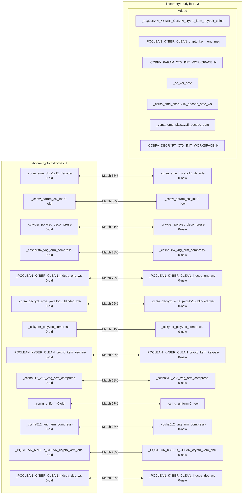
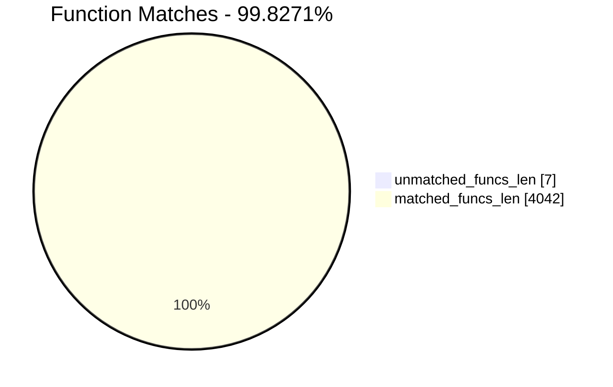
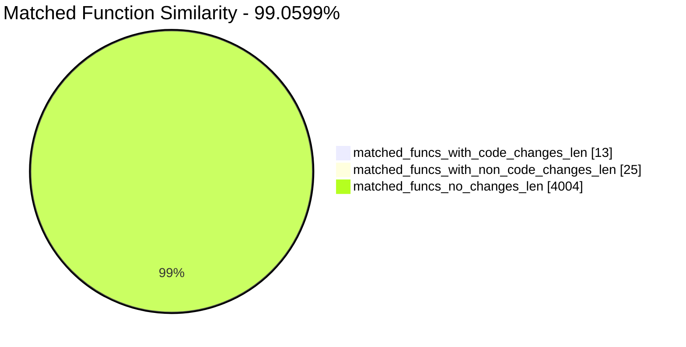
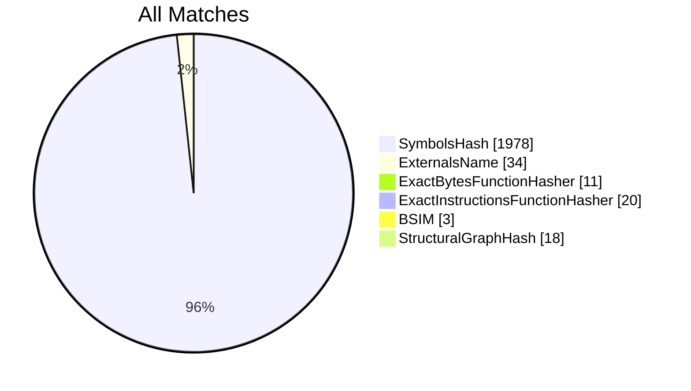
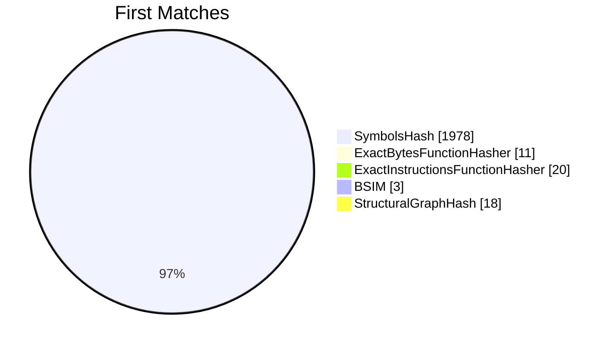
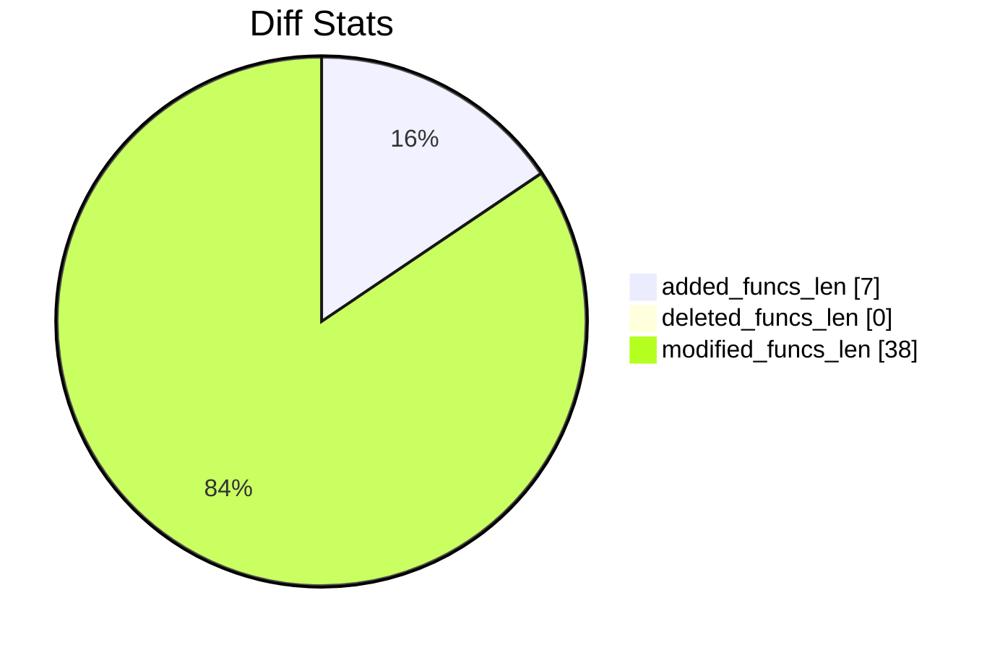
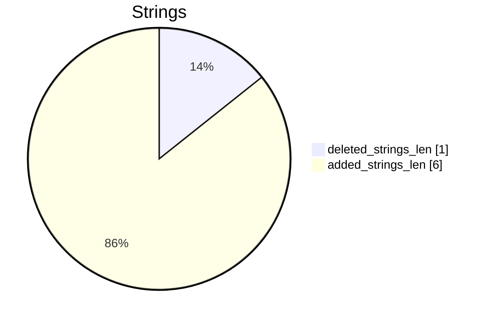

# libcorecrypto.dylib-14.2.1-libcorecrypto.dylib-14.3 Diff

# TOC

* [Visual Chart Diff](#visual-chart-diff)
* [Metadata](#metadata)
	* [Ghidra Diff Engine](#ghidra-diff-engine)
		* [Command Line](#command-line)
	* [Binary Metadata Diff](#binary-metadata-diff)
	* [Program Options](#program-options)
	* [Diff Stats](#diff-stats)
	* [Strings](#strings)
* [Deleted](#deleted)
* [Added](#added)
	* [_PQCLEAN_KYBER_CLEAN_crypto_kem_keypair_coins](#_pqclean_kyber_clean_crypto_kem_keypair_coins)
	* [_PQCLEAN_KYBER_CLEAN_crypto_kem_enc_msg](#_pqclean_kyber_clean_crypto_kem_enc_msg)
	* [_CCBFV_PARAM_CTX_INIT_WORKSPACE_N](#_ccbfv_param_ctx_init_workspace_n)
	* [_cc_xor_safe](#_cc_xor_safe)
	* [_ccrsa_eme_pkcs1v15_decode_safe_ws](#_ccrsa_eme_pkcs1v15_decode_safe_ws)
	* [_ccrsa_eme_pkcs1v15_decode_safe](#_ccrsa_eme_pkcs1v15_decode_safe)
	* [_CCBFV_DECRYPT_CTX_INIT_WORKSPACE_N](#_ccbfv_decrypt_ctx_init_workspace_n)
* [Modified](#modified)
	* [_ccrsa_eme_pkcs1v15_decode](#_ccrsa_eme_pkcs1v15_decode)
	* [_ccbfv_param_ctx_init](#_ccbfv_param_ctx_init)
	* [_cckyber_polyvec_decompress](#_cckyber_polyvec_decompress)
	* [_ccsha384_vng_arm_compress](#_ccsha384_vng_arm_compress)
	* [_PQCLEAN_KYBER_CLEAN_indcpa_enc_ws](#_pqclean_kyber_clean_indcpa_enc_ws)
	* [_ccrsa_decrypt_eme_pkcs1v15_blinded_ws](#_ccrsa_decrypt_eme_pkcs1v15_blinded_ws)
	* [_cckyber_polyvec_compress](#_cckyber_polyvec_compress)
	* [_PQCLEAN_KYBER_CLEAN_crypto_kem_keypair](#_pqclean_kyber_clean_crypto_kem_keypair)
	* [_ccsha512_256_vng_arm_compress](#_ccsha512_256_vng_arm_compress)
	* [_ccrng_uniform](#_ccrng_uniform)
	* [_ccsha512_vng_arm_compress](#_ccsha512_vng_arm_compress)
	* [_PQCLEAN_KYBER_CLEAN_crypto_kem_enc](#_pqclean_kyber_clean_crypto_kem_enc)
	* [_PQCLEAN_KYBER_CLEAN_indcpa_dec_ws](#_pqclean_kyber_clean_indcpa_dec_ws)
* [Modified (No Code Changes)](#modified-no-code-changes)
	* [_CCBFV_CIPHER_PLAIN_CTX_INIT_WORKSPACE_N](#_ccbfv_cipher_plain_ctx_init_workspace_n)
	* [_AccelerateCrypto_SHA512_compress](#_acceleratecrypto_sha512_compress)
	* [_cc_clear](#_cc_clear)
	* [_cckyber_poly_compress](#_cckyber_poly_compress)
	* [_cc_ws_alloc](#_cc_ws_alloc)
	* [_cckyber_poly_compress_d4](#_cckyber_poly_compress_d4)
	* [_cckyber_poly_decompress](#_cckyber_poly_decompress)
	* [_ccdrbg_init](#_ccdrbg_init)
	* [_ccrng_drbg_init_withdrbg](#_ccrng_drbg_init_withdrbg)
	* [_cc_ws_free](#_cc_ws_free)
	* [_ccdrbg_factory_nisthmac](#_ccdrbg_factory_nisthmac)
	* [_ccsha256_di](#_ccsha256_di)
	* [_CCPOLYZP_PO2CYC_BASE_CONVERT_INIT_WORKSPACE_N](#_ccpolyzp_po2cyc_base_convert_init_workspace_n)
	* [_cckyber_poly_decompress_d4](#_cckyber_poly_decompress_d4)
	* [_AccelerateCrypto_SHA512_compress_hwassist](#_acceleratecrypto_sha512_compress_hwassist)
	* [_cc_disable_dit](#_cc_disable_dit)

# Visual Chart Diff










# Metadata

## Ghidra Diff Engine

### Command Line

#### Captured Command Line


```
ghidriff --project-location ghidra_projects --project-name ghidriff --symbols-path symbols --threaded --log-level INFO --file-log-level INFO --log-path ghidriff.log --min-func-len 10 --bsim --max-ram-percent 60.0 --max-section-funcs 200 libcorecrypto.dylib-14.2.1 libcorecrypto.dylib-14.3
```


#### Verbose Args


<details>

```
--old ['bins/14.2.1-14.3/libcorecrypto.dylib-14.2.1'] --new [['bins/14.2.1-14.3/libcorecrypto.dylib-14.3']] --engine VersionTrackingDiff --output-path ghidriffs --summary False --project-location ghidra_projects --project-name ghidriff --symbols-path symbols --threaded True --force-analysis False --force-diff False --no-symbols False --log-level INFO --file-log-level INFO --log-path ghidriff.log --va False --min-func-len 10 --use-calling-counts False --bsim True --bsim-full False --max-ram-percent 60.0 --print-flags False --jvm-args None --side-by-side False --max-section-funcs 200 --md-title None
```


</details>

## Binary Metadata Diff


```diff
--- libcorecrypto.dylib-14.2.1 Meta
+++ libcorecrypto.dylib-14.3 Meta
@@ -1,47 +1,47 @@
-Program Name: libcorecrypto.dylib-14.2.1
+Program Name: libcorecrypto.dylib-14.3
 Language ID: AARCH64:LE:64:AppleSilicon (1.5)
 Compiler ID: default
 Processor: AARCH64
 Endian: Little
 Address Size: 64
-Minimum Address: 1f1d1a000
-Maximum Address: 23b6cc017
-# of Bytes: 794544
+Minimum Address: 1f1e32000
+Maximum Address: 23bb4c017
+# of Bytes: 794600
 # of Memory Blocks: 24
-# of Instructions: 128621
-# of Defined Data: 7806
-# of Functions: 2021
-# of Symbols: 12747
+# of Instructions: 128937
+# of Defined Data: 7825
+# of Functions: 2028
+# of Symbols: 12806
 # of Data Types: 71
 # of Data Type Categories: 10
 Analyzed: true
 Created With Ghidra Version: 11.0
 Date Created: Tue Jan 30 16:20:44 UTC 2024
 Executable Format: Mac OS X Mach-O
-Executable Location: /workspaces/ghidriff/bins/14.2.1-14.3/libcorecrypto.dylib-14.2.1
-Executable MD5: 59cfa7356178870744a9534a7dfc7699
-Executable SHA256: c4efde9fc70e3c1fca7221d6b4e50de249ad24500379957020778bfcb66ef6a9
-FSRL: file:///workspaces/ghidriff/bins/14.2.1-14.3/libcorecrypto.dylib-14.2.1?MD5=59cfa7356178870744a9534a7dfc7699
+Executable Location: /workspaces/ghidriff/bins/14.2.1-14.3/libcorecrypto.dylib-14.3
+Executable MD5: 50392187c100dc4d0daa5d5ea92c52e5
+Executable SHA256: bf6c5331841329110880055fb4e06ab9e406f298c03b8719b2dd6c64c6586834
+FSRL: file:///workspaces/ghidriff/bins/14.2.1-14.3/libcorecrypto.dylib-14.3?MD5=50392187c100dc4d0daa5d5ea92c52e5
 Mach-O File Type: DYLIB
 Mach-O File Type Description: Dynamically Bound Shared Library
 Mach-O Flag 0: NOUNDEFS
 Mach-O Flag 1: DYLDLINK
 Mach-O Flag 2: TWOLEVEL
 Mach-O Flag 3: NO_REEXPORTED_DYLIBS
 Mach-O Flag 4: APP_EXTENSION_SAFE
 Mach-O Sub-framework 0: System
 Preferred Root Namespace Category: 
 Relocatable: true
 Required Library [    0]: /usr/lib/system/libcorecrypto.dylib
 Required Library [    1]: /usr/lib/system/libdyld.dylib
 Required Library [    2]: /usr/lib/system/libcompiler_rt.dylib
 Required Library [    3]: /usr/lib/system/libsystem_kernel.dylib
 Required Library [    4]: /usr/lib/system/libsystem_platform.dylib
 Required Library [    5]: /usr/lib/system/libsystem_malloc.dylib
 Required Library [    6]: /usr/lib/system/libsystem_c.dylib
 Required Library [    7]: /usr/lib/system/libsystem_blocks.dylib
 Required Library [    8]: /usr/lib/system/libsystem_pthread.dylib
 Required Library [    9]: /usr/lib/system/libmacho.dylib
 Required Library [   10]: /usr/lib/system/libsystem_trace.dylib
 Required Library [   11]: /usr/lib/system/libdispatch.dylib
 Should Ask To Analyze: false

```


## Program Options


<details>
<summary>Ghidra libcorecrypto.dylib-14.2.1 Decompiler Options</summary>


|Decompiler Option|Value|
| :---: | :---: |
|Prototype Evaluation|__cdecl|

</details>


<details>
<summary>Ghidra libcorecrypto.dylib-14.2.1 Specification extensions Options</summary>


|Specification extensions Option|Value|
| :---: | :---: |
|FormatVersion|0|
|VersionCounter|0|

</details>


<details>
<summary>Ghidra libcorecrypto.dylib-14.2.1 Analyzers Options</summary>


|Analyzers Option|Value|
| :---: | :---: |
|AARCH64 ELF PLT Thunks|true|
|ASCII Strings|true|
|ASCII Strings.Create Strings Containing Existing Strings|true|
|ASCII Strings.Create Strings Containing References|true|
|ASCII Strings.Force Model Reload|false|
|ASCII Strings.Minimum String Length|LEN_5|
|ASCII Strings.Model File|StringModel.sng|
|ASCII Strings.Require Null Termination for String|true|
|ASCII Strings.Search Only in Accessible Memory Blocks|true|
|ASCII Strings.String Start Alignment|ALIGN_1|
|ASCII Strings.String end alignment|4|
|Aggressive Instruction Finder|false|
|Aggressive Instruction Finder.Create Analysis Bookmarks|true|
|Apply Data Archives|true|
|Apply Data Archives.Archive Chooser|[Auto-Detect]|
|Apply Data Archives.Create Analysis Bookmarks|true|
|Apply Data Archives.GDT User File Archive Path|None|
|Apply Data Archives.User Project Archive Path|None|
|Basic Constant Reference Analyzer|true|
|Basic Constant Reference Analyzer.Create Data from pointer|false|
|Basic Constant Reference Analyzer.Function parameter/return Pointer analysis|true|
|Basic Constant Reference Analyzer.Max Threads|2|
|Basic Constant Reference Analyzer.Min absolute reference|4|
|Basic Constant Reference Analyzer.Require pointer param data type|false|
|Basic Constant Reference Analyzer.Speculative reference max|512|
|Basic Constant Reference Analyzer.Speculative reference min|1024|
|Basic Constant Reference Analyzer.Stored Value Pointer analysis|true|
|Basic Constant Reference Analyzer.Trust values read from writable memory|true|
|Call Convention ID|true|
|Call Convention ID.Analysis Decompiler Timeout (sec)|60|
|Call-Fixup Installer|true|
|Condense Filler Bytes|false|
|Condense Filler Bytes.Filler Value|Auto|
|Condense Filler Bytes.Minimum number of sequential bytes|1|
|Create Address Tables|true|
|Create Address Tables.Allow Offcut References|false|
|Create Address Tables.Auto Label Table|false|
|Create Address Tables.Create Analysis Bookmarks|true|
|Create Address Tables.Maxmimum Pointer Distance|16777215|
|Create Address Tables.Minimum Pointer Address|4132|
|Create Address Tables.Minimum Table Size|2|
|Create Address Tables.Pointer Alignment|1|
|Create Address Tables.Relocation Table Guide|true|
|Create Address Tables.Table Alignment|4|
|DWARF Line Number|false|
|Data Reference|true|
|Data Reference.Address Table Alignment|1|
|Data Reference.Address Table Minimum Size|2|
|Data Reference.Align End of Strings|false|
|Data Reference.Ascii String References|true|
|Data Reference.Create Address Tables|false|
|Data Reference.Minimum String Length|5|
|Data Reference.References to Pointers|true|
|Data Reference.Relocation Table Guide|true|
|Data Reference.Respect Execute Flag|true|
|Data Reference.Subroutine References|true|
|Data Reference.Switch Table References|false|
|Data Reference.Unicode String References|true|
|Decompiler Parameter ID|false|
|Decompiler Parameter ID.Analysis Clear Level|ANALYSIS|
|Decompiler Parameter ID.Analysis Decompiler Timeout (sec)|60|
|Decompiler Parameter ID.Commit Data Types|true|
|Decompiler Parameter ID.Commit Void Return Values|false|
|Decompiler Parameter ID.Prototype Evaluation|__cdecl|
|Decompiler Switch Analysis|true|
|Decompiler Switch Analysis.Analysis Decompiler Timeout (sec)|60|
|Demangler GNU|true|
|Demangler GNU.Apply Function Calling Conventions|true|
|Demangler GNU.Apply Function Signatures|true|
|Demangler GNU.Demangle Only Known Mangled Symbols|false|
|Demangler GNU.Demangler Format|AUTO|
|Demangler GNU.Use Deprecated Demangler|false|
|Disassemble Entry Points|true|
|Disassemble Entry Points.Respect Execute Flag|true|
|Embedded Media|true|
|Embedded Media.Create Analysis Bookmarks|true|
|External Entry References|true|
|External Symbol Resolver|true|
|Function Start Search|true|
|Function Start Search After Code|true|
|Function Start Search After Code.Bookmark Functions|false|
|Function Start Search After Code.Search Data Blocks|false|
|Function Start Search After Data|true|
|Function Start Search After Data.Bookmark Functions|false|
|Function Start Search After Data.Search Data Blocks|false|
|Function Start Search.Bookmark Functions|false|
|Function Start Search.Search Data Blocks|false|
|Mach-O Function Starts|true|
|Mach-O Function Starts.Bookmark failed functions|false|
|Mach-O Function Starts.Bookmark new functions|false|
|Mach-O Function Starts.Bookmark skipped functions|false|
|Mach-O Function Starts.Use PseudoDisassembler|true|
|Non-Returning Functions - Discovered|true|
|Non-Returning Functions - Discovered.Create Analysis Bookmarks|true|
|Non-Returning Functions - Discovered.Function Non-return Threshold|3|
|Non-Returning Functions - Discovered.Repair Flow Damage|true|
|Non-Returning Functions - Known|true|
|Non-Returning Functions - Known.Create Analysis Bookmarks|true|
|Reference|true|
|Reference.Address Table Alignment|1|
|Reference.Address Table Minimum Size|2|
|Reference.Align End of Strings|false|
|Reference.Ascii String References|true|
|Reference.Create Address Tables|false|
|Reference.Minimum String Length|5|
|Reference.References to Pointers|true|
|Reference.Relocation Table Guide|true|
|Reference.Respect Execute Flag|true|
|Reference.Subroutine References|true|
|Reference.Switch Table References|false|
|Reference.Unicode String References|true|
|Scalar Operand References|false|
|Scalar Operand References.Relocation Table Guide|true|
|Shared Return Calls|true|
|Shared Return Calls.Allow Conditional Jumps|false|
|Shared Return Calls.Assume Contiguous Functions Only|true|
|Stack|true|
|Stack.Create Local Variables|true|
|Stack.Create Param Variables|true|
|Stack.useNewFunctionStackAnalysis|true|
|Subroutine References|true|
|Subroutine References.Create Thunks Early|true|
|Variadic Function Signature Override|false|
|Variadic Function Signature Override.Create Analysis Bookmarks|false|

</details>


<details>
<summary>Ghidra libcorecrypto.dylib-14.3 Decompiler Options</summary>


|Decompiler Option|Value|
| :---: | :---: |
|Prototype Evaluation|__cdecl|

</details>


<details>
<summary>Ghidra libcorecrypto.dylib-14.3 Specification extensions Options</summary>


|Specification extensions Option|Value|
| :---: | :---: |
|FormatVersion|0|
|VersionCounter|0|

</details>


<details>
<summary>Ghidra libcorecrypto.dylib-14.3 Analyzers Options</summary>


|Analyzers Option|Value|
| :---: | :---: |
|AARCH64 ELF PLT Thunks|true|
|ASCII Strings|true|
|ASCII Strings.Create Strings Containing Existing Strings|true|
|ASCII Strings.Create Strings Containing References|true|
|ASCII Strings.Force Model Reload|false|
|ASCII Strings.Minimum String Length|LEN_5|
|ASCII Strings.Model File|StringModel.sng|
|ASCII Strings.Require Null Termination for String|true|
|ASCII Strings.Search Only in Accessible Memory Blocks|true|
|ASCII Strings.String Start Alignment|ALIGN_1|
|ASCII Strings.String end alignment|4|
|Aggressive Instruction Finder|false|
|Aggressive Instruction Finder.Create Analysis Bookmarks|true|
|Apply Data Archives|true|
|Apply Data Archives.Archive Chooser|[Auto-Detect]|
|Apply Data Archives.Create Analysis Bookmarks|true|
|Apply Data Archives.GDT User File Archive Path|None|
|Apply Data Archives.User Project Archive Path|None|
|Basic Constant Reference Analyzer|true|
|Basic Constant Reference Analyzer.Create Data from pointer|false|
|Basic Constant Reference Analyzer.Function parameter/return Pointer analysis|true|
|Basic Constant Reference Analyzer.Max Threads|2|
|Basic Constant Reference Analyzer.Min absolute reference|4|
|Basic Constant Reference Analyzer.Require pointer param data type|false|
|Basic Constant Reference Analyzer.Speculative reference max|512|
|Basic Constant Reference Analyzer.Speculative reference min|1024|
|Basic Constant Reference Analyzer.Stored Value Pointer analysis|true|
|Basic Constant Reference Analyzer.Trust values read from writable memory|true|
|Call Convention ID|true|
|Call Convention ID.Analysis Decompiler Timeout (sec)|60|
|Call-Fixup Installer|true|
|Condense Filler Bytes|false|
|Condense Filler Bytes.Filler Value|Auto|
|Condense Filler Bytes.Minimum number of sequential bytes|1|
|Create Address Tables|true|
|Create Address Tables.Allow Offcut References|false|
|Create Address Tables.Auto Label Table|false|
|Create Address Tables.Create Analysis Bookmarks|true|
|Create Address Tables.Maxmimum Pointer Distance|16777215|
|Create Address Tables.Minimum Pointer Address|4132|
|Create Address Tables.Minimum Table Size|2|
|Create Address Tables.Pointer Alignment|1|
|Create Address Tables.Relocation Table Guide|true|
|Create Address Tables.Table Alignment|4|
|DWARF Line Number|false|
|Data Reference|true|
|Data Reference.Address Table Alignment|1|
|Data Reference.Address Table Minimum Size|2|
|Data Reference.Align End of Strings|false|
|Data Reference.Ascii String References|true|
|Data Reference.Create Address Tables|false|
|Data Reference.Minimum String Length|5|
|Data Reference.References to Pointers|true|
|Data Reference.Relocation Table Guide|true|
|Data Reference.Respect Execute Flag|true|
|Data Reference.Subroutine References|true|
|Data Reference.Switch Table References|false|
|Data Reference.Unicode String References|true|
|Decompiler Parameter ID|false|
|Decompiler Parameter ID.Analysis Clear Level|ANALYSIS|
|Decompiler Parameter ID.Analysis Decompiler Timeout (sec)|60|
|Decompiler Parameter ID.Commit Data Types|true|
|Decompiler Parameter ID.Commit Void Return Values|false|
|Decompiler Parameter ID.Prototype Evaluation|__cdecl|
|Decompiler Switch Analysis|true|
|Decompiler Switch Analysis.Analysis Decompiler Timeout (sec)|60|
|Demangler GNU|true|
|Demangler GNU.Apply Function Calling Conventions|true|
|Demangler GNU.Apply Function Signatures|true|
|Demangler GNU.Demangle Only Known Mangled Symbols|false|
|Demangler GNU.Demangler Format|AUTO|
|Demangler GNU.Use Deprecated Demangler|false|
|Disassemble Entry Points|true|
|Disassemble Entry Points.Respect Execute Flag|true|
|Embedded Media|true|
|Embedded Media.Create Analysis Bookmarks|true|
|External Entry References|true|
|External Symbol Resolver|true|
|Function Start Search|true|
|Function Start Search After Code|true|
|Function Start Search After Code.Bookmark Functions|false|
|Function Start Search After Code.Search Data Blocks|false|
|Function Start Search After Data|true|
|Function Start Search After Data.Bookmark Functions|false|
|Function Start Search After Data.Search Data Blocks|false|
|Function Start Search.Bookmark Functions|false|
|Function Start Search.Search Data Blocks|false|
|Mach-O Function Starts|true|
|Mach-O Function Starts.Bookmark failed functions|false|
|Mach-O Function Starts.Bookmark new functions|false|
|Mach-O Function Starts.Bookmark skipped functions|false|
|Mach-O Function Starts.Use PseudoDisassembler|true|
|Non-Returning Functions - Discovered|true|
|Non-Returning Functions - Discovered.Create Analysis Bookmarks|true|
|Non-Returning Functions - Discovered.Function Non-return Threshold|3|
|Non-Returning Functions - Discovered.Repair Flow Damage|true|
|Non-Returning Functions - Known|true|
|Non-Returning Functions - Known.Create Analysis Bookmarks|true|
|Reference|true|
|Reference.Address Table Alignment|1|
|Reference.Address Table Minimum Size|2|
|Reference.Align End of Strings|false|
|Reference.Ascii String References|true|
|Reference.Create Address Tables|false|
|Reference.Minimum String Length|5|
|Reference.References to Pointers|true|
|Reference.Relocation Table Guide|true|
|Reference.Respect Execute Flag|true|
|Reference.Subroutine References|true|
|Reference.Switch Table References|false|
|Reference.Unicode String References|true|
|Scalar Operand References|false|
|Scalar Operand References.Relocation Table Guide|true|
|Shared Return Calls|true|
|Shared Return Calls.Allow Conditional Jumps|false|
|Shared Return Calls.Assume Contiguous Functions Only|true|
|Stack|true|
|Stack.Create Local Variables|true|
|Stack.Create Param Variables|true|
|Stack.useNewFunctionStackAnalysis|true|
|Subroutine References|true|
|Subroutine References.Create Thunks Early|true|
|Variadic Function Signature Override|false|
|Variadic Function Signature Override.Create Analysis Bookmarks|false|

</details>

## Diff Stats


|Stat|Value|
| :---: | :---: |
|added_funcs_len|7|
|deleted_funcs_len|0|
|modified_funcs_len|38|
|added_symbols_len|0|
|deleted_symbols_len|0|
|diff_time|5.155958652496338|
|deleted_strings_len|1|
|added_strings_len|6|
|match_types|Counter({'SymbolsHash': 1978, 'ExternalsName': 34, 'ExactInstructionsFunctionHasher': 20, 'StructuralGraphHash': 18, 'ExactBytesFunctionHasher': 11, 'BSIM': 3})|
|items_to_process|45|
|diff_types|Counter({'address': 38, 'refcount': 25, 'calling': 24, 'length': 15, 'code': 13, 'called': 12})|
|unmatched_funcs_len|7|
|total_funcs_len|4049|
|matched_funcs_len|4042|
|matched_funcs_with_code_changes_len|13|
|matched_funcs_with_non_code_changes_len|25|
|matched_funcs_no_changes_len|4004|
|match_func_similarity_percent|99.0599%|
|func_match_overall_percent|99.8271%|
|first_matches|Counter({'SymbolsHash': 1978, 'ExactInstructionsFunctionHasher': 20, 'StructuralGraphHash': 18, 'ExactBytesFunctionHasher': 11, 'BSIM': 3})|











```mermaid
pie showData
    title Symbols
"added_symbols_len" : 0
"deleted_symbols_len" : 0
```

## Strings




### Strings Diff


```diff
--- deleted strings
+++ added strings
@@ -1 +1,6 @@
-s_Bogus_Kyber_parameter._1f1db4cfa
+s__CCBFV_PARAM_CTX_INIT_WORKSPACE__23bb400d0
+s__ccrsa_eme_pkcs1v15_decode_safe__23bb41ace
+s__cc_xor_safe_23bb40490
+s__CCBFV_DECRYPT_CTX_INIT_WORKSPAC_23bb41c90
+s__ccrsa_eme_pkcs1v15_decode_safe_23bb49cf9
+s_ccrsa_eme_pkcs1v15_decode_genera_1f1ecd401

```


### String References

#### Old


|String|Ref Count|Ref Func|
| :---: | :---: | :---: |
|s_Bogus_Kyber_parameter._1f1db4cfa|4|_cckyber_polyvec_compress,_cckyber_poly_decompress,_cckyber_poly_compress,_cckyber_polyvec_decompress|

#### New


|String|Ref Count|Ref Func|
| :---: | :---: | :---: |
|s__CCBFV_PARAM_CTX_INIT_WORKSPACE__23bb400d0|1||
|s__ccrsa_eme_pkcs1v15_decode_safe__23bb41ace|1||
|s__cc_xor_safe_23bb40490|1||
|s__CCBFV_DECRYPT_CTX_INIT_WORKSPAC_23bb41c90|1||
|s__ccrsa_eme_pkcs1v15_decode_safe_23bb49cf9|1||
|s_ccrsa_eme_pkcs1v15_decode_genera_1f1ecd401|1|_ccrsa_eme_pkcs1v15_decode_safe_ws|

# Deleted

# Added

## _PQCLEAN_KYBER_CLEAN_crypto_kem_keypair_coins

### Function Meta


|Key|libcorecrypto.dylib-14.3|
| :---: | :---: |
|name|_PQCLEAN_KYBER_CLEAN_crypto_kem_keypair_coins|
|fullname|_PQCLEAN_KYBER_CLEAN_crypto_kem_keypair_coins|
|refcount|2|
|length|184|
|called|_PQCLEAN_KYBER_CLEAN_indcpa_keypair<br>_ccdigest<br>_ccsha3_256_di<br>_memcpy|
|calling|_PQCLEAN_KYBER_CLEAN_crypto_kem_keypair|
|paramcount|0|
|address|1f1e4c178|
|sig|undefined _PQCLEAN_KYBER_CLEAN_crypto_kem_keypair_coins(void)|
|sym_type|Function|
|sym_source|IMPORTED|
|external|False|


```diff
--- _PQCLEAN_KYBER_CLEAN_crypto_kem_keypair_coins
+++ _PQCLEAN_KYBER_CLEAN_crypto_kem_keypair_coins
@@ -0,0 +1,30 @@
+
+undefined8
+_PQCLEAN_KYBER_CLEAN_crypto_kem_keypair_coins(int *param_1,void *param_2,long param_3,long param_4)
+
+{
+  uint uVar1;
+  undefined8 uVar2;
+  undefined8 uVar3;
+  undefined8 uVar4;
+  undefined8 uVar5;
+  
+  uVar2 = _PQCLEAN_KYBER_CLEAN_indcpa_keypair();
+  if ((int)uVar2 == 0) {
+    _memcpy((void *)(param_3 + (ulong)(uint)(*param_1 * 0x180)),param_2,
+            (ulong)(*param_1 * 0x180 | 0x20));
+    uVar3 = _ccsha3_256_di();
+    uVar1 = *param_1 * 0x180 | 0x20;
+    _ccdigest(uVar3,uVar1,param_2,param_3 + (ulong)(uVar1 + *param_1 * 0x180 | 0x40) + -0x40);
+    uVar3 = *(undefined8 *)(param_4 + 0x20);
+    uVar5 = *(undefined8 *)(param_4 + 0x38);
+    uVar4 = *(undefined8 *)(param_4 + 0x30);
+    param_3 = param_3 + (ulong)(*param_1 * 0x300 | 0x60);
+    *(undefined8 *)(param_3 + -0x18) = *(undefined8 *)(param_4 + 0x28);
+    *(undefined8 *)(param_3 + -0x20) = uVar3;
+    *(undefined8 *)(param_3 + -8) = uVar5;
+    *(undefined8 *)(param_3 + -0x10) = uVar4;
+  }
+  return uVar2;
+}
+

```


## _PQCLEAN_KYBER_CLEAN_crypto_kem_enc_msg

### Function Meta


|Key|libcorecrypto.dylib-14.3|
| :---: | :---: |
|name|_PQCLEAN_KYBER_CLEAN_crypto_kem_enc_msg|
|fullname|_PQCLEAN_KYBER_CLEAN_crypto_kem_enc_msg|
|refcount|2|
|length|220|
|called|_PQCLEAN_KYBER_CLEAN_indcpa_enc<br>_ccdigest<br>_ccsha3_256_di<br>_ccsha3_512_di|
|calling|_PQCLEAN_KYBER_CLEAN_crypto_kem_enc|
|paramcount|0|
|address|1f1e4c2c0|
|sig|undefined _PQCLEAN_KYBER_CLEAN_crypto_kem_enc_msg(void)|
|sym_type|Function|
|sym_source|IMPORTED|
|external|False|


```diff
--- _PQCLEAN_KYBER_CLEAN_crypto_kem_enc_msg
+++ _PQCLEAN_KYBER_CLEAN_crypto_kem_enc_msg
@@ -0,0 +1,40 @@
+
+/* WARNING: Globals starting with '_' overlap smaller symbols at the same address */
+
+void _PQCLEAN_KYBER_CLEAN_crypto_kem_enc_msg
+               (int *param_1,undefined8 param_2,undefined8 *param_3,undefined8 param_4,
+               undefined8 *param_5)
+
+{
+  int iVar1;
+  undefined8 uVar2;
+  undefined8 local_90;
+  undefined8 uStack_88;
+  undefined8 uStack_80;
+  undefined8 uStack_78;
+  undefined auStack_70 [40];
+  long local_48;
+  
+  local_48 = *_DAT_22df469b0;
+  uStack_88 = param_5[1];
+  local_90 = *param_5;
+  uStack_78 = param_5[3];
+  uStack_80 = param_5[2];
+  uVar2 = _ccsha3_256_di();
+  _ccdigest(uVar2,*param_1 * 0x180 | 0x20,param_4,auStack_70);
+  uVar2 = _ccsha3_512_di();
+  _ccdigest(uVar2,0x40,&local_90,&local_90);
+  iVar1 = _PQCLEAN_KYBER_CLEAN_indcpa_enc(param_1,param_2,param_5,param_4,auStack_70);
+  if (iVar1 == 0) {
+    param_3[1] = uStack_88;
+    *param_3 = local_90;
+    param_3[3] = uStack_78;
+    param_3[2] = uStack_80;
+  }
+  if (*_DAT_22df469b0 == local_48) {
+    return;
+  }
+  func_0x0001f2881250();
+  return;
+}
+

```


## _CCBFV_PARAM_CTX_INIT_WORKSPACE_N

### Function Meta


|Key|libcorecrypto.dylib-14.3|
| :---: | :---: |
|name|_CCBFV_PARAM_CTX_INIT_WORKSPACE_N|
|fullname|_CCBFV_PARAM_CTX_INIT_WORKSPACE_N|
|refcount|3|
|length|88|
|called|_CCBFV_CIPHER_PLAIN_CTX_INIT_WORKSPACE_N<br>_CCBFV_DECRYPT_CTX_INIT_WORKSPACE_N<br>_CCPOLYZP_PO2CYC_CTX_INIT_WORKSPACE_N|
|calling|_ccbfv_param_ctx_init|
|paramcount|0|
|address|1f1e5c4c0|
|sig|undefined _CCBFV_PARAM_CTX_INIT_WORKSPACE_N(void)|
|sym_type|Function|
|sym_source|IMPORTED|
|external|False|


```diff
--- _CCBFV_PARAM_CTX_INIT_WORKSPACE_N
+++ _CCBFV_PARAM_CTX_INIT_WORKSPACE_N
@@ -0,0 +1,20 @@
+
+ulong _CCBFV_PARAM_CTX_INIT_WORKSPACE_N(undefined8 param_1)
+
+{
+  ulong uVar1;
+  ulong uVar2;
+  ulong uVar3;
+  
+  uVar1 = _CCPOLYZP_PO2CYC_CTX_INIT_WORKSPACE_N(1);
+  uVar2 = _CCBFV_DECRYPT_CTX_INIT_WORKSPACE_N(param_1);
+  uVar3 = _CCBFV_CIPHER_PLAIN_CTX_INIT_WORKSPACE_N(param_1);
+  if (uVar2 <= uVar3) {
+    uVar2 = uVar3;
+  }
+  if (uVar1 <= uVar2) {
+    uVar1 = uVar2;
+  }
+  return uVar1;
+}
+

```


## _cc_xor_safe

### Function Meta


|Key|libcorecrypto.dylib-14.3|
| :---: | :---: |
|name|_cc_xor_safe|
|fullname|_cc_xor_safe|
|refcount|3|
|length|156|
|called||
|calling|_ccrsa_eme_pkcs1v15_decode_safe_ws|
|paramcount|0|
|address|1f1e5fca4|
|sig|undefined _cc_xor_safe(void)|
|sym_type|Function|
|sym_source|IMPORTED|
|external|False|


```diff
--- _cc_xor_safe
+++ _cc_xor_safe
@@ -0,0 +1,40 @@
+
+void _cc_xor_safe(ulong *param_1,long param_2,uint param_3,long param_4,long param_5,byte *param_6)
+
+{
+  ulong uVar1;
+  ulong uVar2;
+  uint uVar3;
+  ulong uVar4;
+  byte *pbVar5;
+  long lVar6;
+  
+  uVar4 = *param_1;
+  if (uVar4 != 0) {
+    uVar1 = 0;
+    uVar2 = -param_5;
+    do {
+      if (param_4 != 0) {
+        uVar3 = (uint)*(byte *)(param_2 + uVar1);
+        pbVar5 = param_6;
+        uVar4 = uVar2;
+        lVar6 = param_4;
+        do {
+          uVar3 = (uint)*pbVar5 &
+                  (int)((uVar4 & 0xffffffff | uVar4 >> 0x20) + 0xffffffff >> 0x20) - 1U & -param_3 ^
+                  uVar3;
+          *(char *)(param_2 + uVar1) = (char)uVar3;
+          uVar4 = uVar4 + 1;
+          lVar6 = lVar6 + -1;
+          pbVar5 = pbVar5 + 1;
+        } while (lVar6 != 0);
+        uVar4 = *param_1;
+      }
+      uVar1 = uVar1 + 1;
+      uVar2 = uVar2 - 1;
+    } while (uVar1 < uVar4);
+  }
+  *param_1 = uVar4 & (ulong)param_3 - 1 | param_4 - param_5 & -(ulong)param_3;
+  return;
+}
+

```


## _ccrsa_eme_pkcs1v15_decode_safe_ws

### Function Meta


|Key|libcorecrypto.dylib-14.3|
| :---: | :---: |
|name|_ccrsa_eme_pkcs1v15_decode_safe_ws|
|fullname|_ccrsa_eme_pkcs1v15_decode_safe_ws|
|refcount|4|
|length|992|
|called|<details><summary>Expand for full list:<br>_cc_clear<br>_cc_xor_safe<br>_ccdigest<br>_ccdrbg_done<br>_ccdrbg_factory_nisthmac<br>_ccdrbg_init<br>_ccn_swap<br>_ccrng_drbg_init_withdrbg<br>_ccrng_uniform<br>_ccrsa_block_start<br>_ccrsa_n_from_size</summary>_ccsha256_di</details>|
|calling|_ccrsa_decrypt_eme_pkcs1v15_blinded_ws<br>_ccrsa_eme_pkcs1v15_decode<br>_ccrsa_eme_pkcs1v15_decode_safe|
|paramcount|0|
|address|1f1e7cd58|
|sig|undefined _ccrsa_eme_pkcs1v15_decode_safe_ws(void)|
|sym_type|Function|
|sym_source|IMPORTED|
|external|False|


```diff
--- _ccrsa_eme_pkcs1v15_decode_safe_ws
+++ _ccrsa_eme_pkcs1v15_decode_safe_ws
@@ -0,0 +1,221 @@
+
+/* WARNING: Globals starting with '_' overlap smaller symbols at the same address */
+
+undefined8
+_ccrsa_eme_pkcs1v15_decode_safe_ws
+          (long param_1,long *param_2,ulong *param_3,undefined8 param_4,ulong param_5,
+          undefined8 param_6)
+
+{
+  long lVar1;
+  undefined8 uVar2;
+  byte *pbVar3;
+  undefined8 uVar4;
+  uint uVar5;
+  ulong uVar6;
+  undefined8 uVar7;
+  ulong uVar8;
+  undefined8 uVar9;
+  undefined8 uVar10;
+  ulong local_228;
+  ulong local_220;
+  long local_218;
+  undefined local_209;
+  ulong local_208;
+  uint local_1fc;
+  undefined8 local_1f8;
+  undefined8 local_1f0;
+  code *local_1e8;
+  undefined8 uStack_1e0;
+  undefined8 local_1d8;
+  undefined8 local_1d0;
+  undefined8 local_1c8;
+  undefined8 local_1c0;
+  undefined8 uStack_1b8;
+  undefined8 uStack_1b0;
+  undefined8 uStack_1a8;
+  undefined8 local_1a0;
+  undefined8 uStack_198;
+  undefined8 local_190;
+  undefined8 local_180;
+  undefined8 uStack_178;
+  undefined8 local_170;
+  undefined8 uStack_168;
+  undefined8 uStack_160;
+  undefined8 uStack_158;
+  undefined8 local_150;
+  undefined8 uStack_148;
+  undefined8 uStack_140;
+  undefined8 uStack_138;
+  undefined8 local_130;
+  undefined8 uStack_128;
+  undefined8 uStack_120;
+  undefined8 uStack_118;
+  undefined8 local_110;
+  undefined8 uStack_108;
+  undefined8 uStack_100;
+  undefined8 uStack_f8;
+  undefined8 local_f0;
+  undefined8 uStack_e8;
+  undefined8 uStack_e0;
+  undefined2 uStack_d8;
+  undefined6 local_d6;
+  undefined2 uStack_d0;
+  undefined8 uStack_ce;
+  undefined auStack_c0 [32];
+  undefined8 local_a0;
+  undefined8 uStack_98;
+  undefined8 uStack_90;
+  undefined8 uStack_88;
+  long local_78;
+  
+  local_78 = *_DAT_22df469b0;
+  uVar10 = 0xffffffe9;
+  lVar1 = param_5 - 0xb;
+  if ((param_5 < 0xb) || (*param_3 < param_5)) goto LAB_1f1e7d0dc;
+  uVar7 = *(undefined8 *)(param_1 + 0x10);
+  uVar2 = _ccrsa_n_from_size(param_5);
+  _ccn_swap(uVar2,param_6);
+  pbVar3 = (byte *)_ccrsa_block_start(param_5,param_6,0);
+  uVar4 = (**(code **)(param_1 + 0x18))(param_1,uVar2);
+  local_1f8 = 0;
+  local_190 = 0;
+  uStack_198 = 0;
+  local_1a0 = 0;
+  uStack_1b8 = 0;
+  local_1c0 = 0;
+  uStack_1a8 = 0;
+  uStack_1b0 = 0;
+  local_1c8 = 0;
+  local_1d0 = _ccsha256_di();
+  _ccdrbg_factory_nisthmac(&local_1c0,&local_1d0);
+  uStack_98 = 0;
+  local_a0 = 0;
+  uStack_88 = 0;
+  uStack_90 = 0;
+  uStack_e8._0_1_ = 'e';
+  uStack_e8._1_1_ = '_';
+  uStack_e8._2_1_ = 'p';
+  uStack_e8._3_1_ = 'k';
+  uStack_e8._4_1_ = 'c';
+  uStack_e8._5_1_ = 's';
+  uStack_e8._6_1_ = '1';
+  uStack_e8._7_1_ = 'v';
+  local_f0._0_1_ = 'c';
+  local_f0._1_1_ = 'c';
+  local_f0._2_1_ = 'r';
+  local_f0._3_1_ = 's';
+  local_f0._4_1_ = 'a';
+  local_f0._5_1_ = '_';
+  local_f0._6_1_ = 'e';
+  local_f0._7_1_ = 'm';
+  uStack_d8 = 0x5f65;
+  uStack_e0._0_1_ = '1';
+  uStack_e0._1_1_ = '5';
+  uStack_e0._2_1_ = '_';
+  uStack_e0._3_1_ = 'd';
+  uStack_e0._4_1_ = 'e';
+  uStack_e0._5_1_ = 'c';
+  uStack_e0._6_1_ = 'o';
+  uStack_e0._7_1_ = 'd';
+  uStack_ce._0_1_ = '_';
+  uStack_ce._1_1_ = 'r';
+  uStack_ce._2_1_ = 'a';
+  uStack_ce._3_1_ = 'n';
+  uStack_ce._4_1_ = 'd';
+  uStack_ce._5_1_ = 'o';
+  uStack_ce._6_1_ = 'm';
+  uStack_ce._7_1_ = '\0';
+  local_d6 = 0x6172656e6567;
+  uStack_d0 = 0x6574;
+  if (param_2 != (long *)0x0) {
+    uVar10 = _ccsha256_di();
+    _ccdigest(uVar10,*param_2 << 3,param_2 + *param_2 * 3 + 4,&local_a0);
+  }
+  uVar10 = _ccsha256_di();
+  _ccdigest(uVar10,param_5,pbVar3,auStack_c0);
+  uStack_108 = 0;
+  local_110 = 0;
+  uStack_f8 = 0;
+  uStack_100 = 0;
+  uStack_128 = 0;
+  local_130 = 0;
+  uStack_118 = 0;
+  uStack_120 = 0;
+  uStack_148 = 0;
+  local_150 = 0;
+  uStack_138 = 0;
+  uStack_140 = 0;
+  uStack_168 = 0;
+  local_170 = 0;
+  uStack_158 = 0;
+  uStack_160 = 0;
+  uStack_178 = 0;
+  local_180 = 0;
+  uVar10 = _ccdrbg_init(&local_1c0,&local_180,0x20,&local_a0,0x20,auStack_c0,0x29,&local_f0);
+  if ((int)uVar10 == 0) {
+    local_1e8 = (code *)0x0;
+    uStack_1e0 = 0;
+    local_1d8 = 0;
+    uVar10 = _ccrng_drbg_init_withdrbg(&local_1e8,&local_1c0,&local_180);
+    if (((int)uVar10 == 0) && (uVar10 = (*local_1e8)(&local_1e8,lVar1,uVar4), (int)uVar10 == 0)) {
+      local_1f0 = 0;
+      uVar10 = _ccrng_uniform(&local_1e8,param_5 - 10,&local_1f0);
+      if ((int)uVar10 == 0) {
+        local_1f8 = local_1f0;
+        uVar9 = local_1f0;
+        goto LAB_1f1e7cf28;
+      }
+    }
+    uVar9 = 0;
+  }
+  else {
+    uVar9 = 0;
+  }
+LAB_1f1e7cf28:
+  _cc_clear(0x20,&local_a0);
+  _cc_clear(0x20,auStack_c0);
+  _cc_clear(8,&local_1f0);
+  _ccdrbg_done(&local_1c0,&local_180);
+  if ((int)uVar10 == 0) {
+    uVar8 = 0;
+    uVar5 = 1;
+    uVar6 = 2;
+    do {
+      uVar8 = uVar8 & (long)(int)(uVar5 - 1) | uVar6 & (long)(int)-uVar5;
+      uVar5 = uVar5 & (uint)((ulong)pbVar3[uVar6] + 0xffffffff >> 0x20);
+      local_209 = (undefined)uVar5;
+      uVar6 = uVar6 + 1;
+    } while (param_5 != uVar6);
+    local_218 = ~uVar8 + param_5;
+    local_220 = uVar8 - 2;
+    uVar5 = (uint)((local_220 >> 3 & 0xffffffff | local_220 >> 0x23) + 0xffffffff >> 0x20) ^ 1 |
+            uVar5 | (uint)(((ulong)pbVar3[1] ^ 2 | (ulong)*pbVar3) + 0xffffffff >> 0x20);
+    local_228 = *param_3;
+    local_208 = uVar8;
+    local_1fc = uVar5;
+    _cc_clear(local_228,param_4);
+    _cc_xor_safe(&local_228,param_4,uVar5 ^ 1,param_5,uVar8 + 1,pbVar3);
+    _cc_xor_safe(param_3,param_4,uVar5,lVar1,uVar9,uVar4);
+    *param_3 = local_228 & uVar5 - 1 | *param_3 & (ulong)-uVar5;
+  }
+  else {
+    _cc_clear(lVar1,uVar4);
+    _cc_clear(8,&local_1f8);
+  }
+  _ccn_swap(uVar2,param_6);
+  _cc_clear(8,&local_1f8);
+  _cc_clear(4,&local_1fc);
+  _cc_clear(8,&local_208);
+  _cc_clear(1,&local_209);
+  _cc_clear(8,&local_218);
+  _cc_clear(8,&local_220);
+  *(undefined8 *)(param_1 + 0x10) = uVar7;
+LAB_1f1e7d0dc:
+  if (*_DAT_22df469b0 != local_78) {
+    uVar10 = func_0x0001f2881250();
+    return uVar10;
+  }
+  return uVar10;
+}
+

```


## _ccrsa_eme_pkcs1v15_decode_safe

### Function Meta


|Key|libcorecrypto.dylib-14.3|
| :---: | :---: |
|name|_ccrsa_eme_pkcs1v15_decode_safe|
|fullname|_ccrsa_eme_pkcs1v15_decode_safe|
|refcount|2|
|length|244|
|called|_cc_disable_dit<br>_cc_malloc_clear<br>_cc_ws_alloc<br>_cc_ws_free<br>_ccrsa_eme_pkcs1v15_decode_safe_ws|
|calling||
|paramcount|0|
|address|1f1e7d138|
|sig|undefined _ccrsa_eme_pkcs1v15_decode_safe(void)|
|sym_type|Function|
|sym_source|IMPORTED|
|external|False|


```diff
--- _ccrsa_eme_pkcs1v15_decode_safe
+++ _ccrsa_eme_pkcs1v15_decode_safe
@@ -0,0 +1,44 @@
+
+/* WARNING: Globals starting with '_' overlap smaller symbols at the same address */
+
+undefined8
+_ccrsa_eme_pkcs1v15_decode_safe
+          (long *param_1,undefined8 param_2,undefined8 param_3,undefined8 param_4,undefined8 param_5
+          )
+
+{
+  undefined8 uVar1;
+  long local_70;
+  long lStack_68;
+  undefined8 local_60;
+  code *pcStack_58;
+  code *local_50;
+  undefined local_41;
+  
+  local_41 = 0;
+  if ((_DAT_fffffc010 >> 0x39 & 1) != 0) {
+    uVar1 = UnkSytemRegRead(3,3,4,2,5);
+    if (((uint)uVar1 >> 0x18 & 1) == 0) {
+      dit = 1;
+      local_41 = 1;
+    }
+    else {
+      local_41 = 0;
+    }
+  }
+  local_70 = _cc_malloc_clear(*param_1 << 3);
+  lStack_68 = *param_1;
+  local_60 = 0;
+  pcStack_58 = _cc_ws_alloc;
+  local_50 = _cc_ws_free;
+  if (local_70 == 0) {
+    uVar1 = 0xfffffff3;
+  }
+  else {
+    uVar1 = _ccrsa_eme_pkcs1v15_decode_safe_ws(&local_70,param_1,param_2,param_3,param_4,param_5);
+    (*local_50)(&local_70);
+  }
+  _cc_disable_dit(&local_41);
+  return uVar1;
+}
+

```


## _CCBFV_DECRYPT_CTX_INIT_WORKSPACE_N

### Function Meta


|Key|libcorecrypto.dylib-14.3|
| :---: | :---: |
|name|_CCBFV_DECRYPT_CTX_INIT_WORKSPACE_N|
|fullname|_CCBFV_DECRYPT_CTX_INIT_WORKSPACE_N|
|refcount|2|
|length|60|
|called|_CCPOLYZP_PO2CYC_BASE_CONVERT_INIT_WORKSPACE_N<br>_CCPOLYZP_PO2CYC_CTX_INIT_WORKSPACE_N|
|calling|_CCBFV_PARAM_CTX_INIT_WORKSPACE_N|
|paramcount|0|
|address|1f1e7e9b8|
|sig|undefined _CCBFV_DECRYPT_CTX_INIT_WORKSPACE_N(void)|
|sym_type|Function|
|sym_source|IMPORTED|
|external|False|


```diff
--- _CCBFV_DECRYPT_CTX_INIT_WORKSPACE_N
+++ _CCBFV_DECRYPT_CTX_INIT_WORKSPACE_N
@@ -0,0 +1,15 @@
+
+ulong _CCBFV_DECRYPT_CTX_INIT_WORKSPACE_N(undefined8 param_1)
+
+{
+  ulong uVar1;
+  ulong uVar2;
+  
+  uVar1 = _CCPOLYZP_PO2CYC_CTX_INIT_WORKSPACE_N(1);
+  uVar2 = _CCPOLYZP_PO2CYC_BASE_CONVERT_INIT_WORKSPACE_N(param_1);
+  if (uVar1 <= uVar2) {
+    uVar1 = uVar2;
+  }
+  return uVar1;
+}
+

```


# Modified


*Modified functions contain code changes*
## _ccrsa_eme_pkcs1v15_decode

### Match Info


|Key|libcorecrypto.dylib-14.2.1 - libcorecrypto.dylib-14.3|
| :---: | :---: |
|diff_type|code,refcount,length,address,calling,called|
|ratio|0.38|
|i_ratio|0.16|
|m_ratio|0.56|
|b_ratio|0.65|
|match_types|SymbolsHash|

### Function Meta Diff


|Key|libcorecrypto.dylib-14.2.1|libcorecrypto.dylib-14.3|
| :---: | :---: | :---: |
|name|_ccrsa_eme_pkcs1v15_decode|_ccrsa_eme_pkcs1v15_decode|
|fullname|_ccrsa_eme_pkcs1v15_decode|_ccrsa_eme_pkcs1v15_decode|
|`refcount`|3|2|
|`length`|404|244|
|`called`|_cc_disable_dit<br>_ccn_swap<br>_ccrsa_block_start<br>_ccrsa_n_from_size<br>_memcpy|_cc_disable_dit<br>_cc_malloc_clear<br>_cc_ws_alloc<br>_cc_ws_free<br>_ccrsa_eme_pkcs1v15_decode_safe_ws<br>_ccrsa_n_from_size|
|`calling`|_ccrsa_decrypt_eme_pkcs1v15_blinded_ws||
|paramcount|0|0|
|`address`|1f1d651c8|1f1e7d22c|
|sig|undefined _ccrsa_eme_pkcs1v15_decode(void)|undefined _ccrsa_eme_pkcs1v15_decode(void)|
|sym_type|Function|Function|
|sym_source|IMPORTED|IMPORTED|
|external|False|False|

### _ccrsa_eme_pkcs1v15_decode Called Diff


```diff
--- _ccrsa_eme_pkcs1v15_decode called
+++ _ccrsa_eme_pkcs1v15_decode called
@@ -2,2 +2,4 @@
-_ccn_swap
-_ccrsa_block_start
+_cc_malloc_clear
+_cc_ws_alloc
+_cc_ws_free
+_ccrsa_eme_pkcs1v15_decode_safe_ws
@@ -5 +6,0 @@
-_memcpy
```


### _ccrsa_eme_pkcs1v15_decode Calling Diff


```diff
--- _ccrsa_eme_pkcs1v15_decode calling
+++ _ccrsa_eme_pkcs1v15_decode calling
@@ -1 +0,0 @@
-_ccrsa_decrypt_eme_pkcs1v15_blinded_ws
```


### _ccrsa_eme_pkcs1v15_decode Diff


```diff
--- _ccrsa_eme_pkcs1v15_decode
+++ _ccrsa_eme_pkcs1v15_decode
@@ -1,63 +1,45 @@
 
 /* WARNING: Globals starting with '_' overlap smaller symbols at the same address */
 
-undefined8 _ccrsa_eme_pkcs1v15_decode(ulong *param_1,void *param_2,ulong param_3,undefined8 param_4)
+undefined8
+_ccrsa_eme_pkcs1v15_decode
+          (undefined8 param_1,undefined8 param_2,undefined8 param_3,undefined8 param_4)
 
 {
-  undefined8 uVar1;
-  byte *pbVar2;
-  undefined8 uVar3;
-  ulong uVar4;
-  uint uVar5;
-  ulong uVar6;
+  long lVar1;
+  undefined8 uVar2;
+  long local_70;
+  long lStack_68;
+  undefined8 local_60;
+  code *pcStack_58;
+  code *local_50;
   undefined local_41;
   
   local_41 = 0;
   if ((_DAT_0 >> 0x39 & 1) != 0) {
-    uVar1 = UnkSytemRegRead(3,3,4,2,5);
-    if (((uint)uVar1 >> 0x18 & 1) == 0) {
+    uVar2 = UnkSytemRegRead(3,3,4,2,5);
+    if (((uint)uVar2 >> 0x18 & 1) == 0) {
       dit = 1;
       local_41 = 1;
     }
     else {
       local_41 = 0;
     }
   }
-  uVar1 = _ccrsa_n_from_size(param_3);
-  _ccn_swap(uVar1,param_4);
-  pbVar2 = (byte *)_ccrsa_block_start(param_3,param_4,0);
-  if (param_3 < 3) {
-    uVar4 = 0;
-    uVar5 = 1;
+  lVar1 = _ccrsa_n_from_size(param_3);
+  local_70 = _cc_malloc_clear(lVar1 << 3);
+  local_60 = 0;
+  pcStack_58 = _cc_ws_alloc;
+  local_50 = _cc_ws_free;
+  lStack_68 = lVar1;
+  if (local_70 == 0) {
+    uVar2 = 0xfffffff3;
   }
   else {
-    uVar4 = 0;
-    uVar5 = 1;
-    uVar6 = 2;
-    do {
-      uVar4 = uVar4 & (long)(int)(uVar5 - 1) | uVar6 & (long)(int)-uVar5;
-      uVar5 = uVar5 & (uint)((ulong)pbVar2[uVar6] + 0xffffffff >> 0x20);
-      uVar6 = uVar6 + 1;
-    } while (param_3 != uVar6);
+    uVar2 = _ccrsa_eme_pkcs1v15_decode_safe_ws(&local_70,0,param_1,param_2,param_3,param_4);
+    (*local_50)(&local_70);
   }
-  if ((uVar5 | (uint)(((ulong)pbVar2[1] ^ 2 | (ulong)*pbVar2) + 0xffffffff >> 0x20) |
-      (uint)((uVar4 - 2 >> 3 & 0xffffffff | uVar4 - 2 >> 0x23) + 0xffffffff >> 0x20) ^ 1) == 0) {
-    uVar6 = ~uVar4 + param_3;
-    if (*param_1 < uVar6) {
-      uVar1 = 0xffffffe9;
-    }
-    else {
-      _memcpy(param_2,pbVar2 + uVar4 + 1,uVar6);
-      uVar1 = 0;
-      *param_1 = uVar6;
-    }
-  }
-  else {
-    uVar1 = 0xffffffe5;
-  }
-  uVar3 = _ccrsa_n_from_size(param_3);
-  _ccn_swap(uVar3,param_4);
   _cc_disable_dit(&local_41);
-  return uVar1;
+  return uVar2;
 }
 

```


## _ccbfv_param_ctx_init

### Match Info


|Key|libcorecrypto.dylib-14.2.1 - libcorecrypto.dylib-14.3|
| :---: | :---: |
|diff_type|code,length,address,called|
|ratio|0.58|
|i_ratio|0.58|
|m_ratio|0.85|
|b_ratio|0.85|
|match_types|SymbolsHash|

### Function Meta Diff


|Key|libcorecrypto.dylib-14.2.1|libcorecrypto.dylib-14.3|
| :---: | :---: | :---: |
|name|_ccbfv_param_ctx_init|_ccbfv_param_ctx_init|
|fullname|_ccbfv_param_ctx_init|_ccbfv_param_ctx_init|
|refcount|2|2|
|`length`|320|248|
|`called`|_CCBFV_CIPHER_PLAIN_CTX_INIT_WORKSPACE_N<br>_CCPOLYZP_PO2CYC_BASE_CONVERT_INIT_WORKSPACE_N<br>_CCPOLYZP_PO2CYC_CTX_INIT_WORKSPACE_N<br>_cc_disable_dit<br>_cc_malloc_clear<br>_cc_ws_alloc<br>_cc_ws_free<br>_ccbfv_encrypt_params_get<br>_ccbfv_param_ctx_init_ws|_CCBFV_PARAM_CTX_INIT_WORKSPACE_N<br>_cc_disable_dit<br>_cc_malloc_clear<br>_cc_ws_alloc<br>_cc_ws_free<br>_ccbfv_encrypt_params_get<br>_ccbfv_param_ctx_init_ws|
|calling|||
|paramcount|0|0|
|`address`|1f1d44dd8|1f1e5c9c0|
|sig|undefined _ccbfv_param_ctx_init(void)|undefined _ccbfv_param_ctx_init(void)|
|sym_type|Function|Function|
|sym_source|IMPORTED|IMPORTED|
|external|False|False|

### _ccbfv_param_ctx_init Called Diff


```diff
--- _ccbfv_param_ctx_init called
+++ _ccbfv_param_ctx_init called
@@ -1,3 +1 @@
-_CCBFV_CIPHER_PLAIN_CTX_INIT_WORKSPACE_N
-_CCPOLYZP_PO2CYC_BASE_CONVERT_INIT_WORKSPACE_N
-_CCPOLYZP_PO2CYC_CTX_INIT_WORKSPACE_N
+_CCBFV_PARAM_CTX_INIT_WORKSPACE_N
```


### _ccbfv_param_ctx_init Diff


```diff
--- _ccbfv_param_ctx_init
+++ _ccbfv_param_ctx_init
@@ -1,70 +1,51 @@
 
 /* WARNING: Globals starting with '_' overlap smaller symbols at the same address */
 
 undefined8 _ccbfv_param_ctx_init(undefined8 param_1,undefined8 param_2)
 
 {
   long lVar1;
-  ulong uVar2;
-  ulong uVar3;
-  long lVar4;
-  undefined8 uVar5;
+  long lVar2;
+  undefined8 uVar3;
   long local_60;
-  ulong local_58;
+  undefined8 local_58;
   undefined8 uStack_50;
   code *local_48;
   code *local_40;
   undefined local_31;
   
   local_31 = 0;
   if ((_DAT_0 >> 0x39 & 1) != 0) {
-    uVar5 = UnkSytemRegRead(3,3,4,2,5);
-    if (((uint)uVar5 >> 0x18 & 1) == 0) {
+    uVar3 = UnkSytemRegRead(3,3,4,2,5);
+    if (((uint)uVar3 >> 0x18 & 1) == 0) {
       dit = 1;
       local_31 = 1;
     }
     else {
       local_31 = 0;
     }
   }
   lVar1 = _ccbfv_encrypt_params_get(param_2);
   if (lVar1 == 0) {
-    uVar5 = 0xfffffff9;
+    uVar3 = 0xfffffff9;
   }
   else {
-    uVar2 = _CCPOLYZP_PO2CYC_CTX_INIT_WORKSPACE_N(1);
-    uVar3 = _CCPOLYZP_PO2CYC_BASE_CONVERT_INIT_WORKSPACE_N(1);
-    if (uVar2 <= uVar3) {
-      uVar2 = uVar3;
-    }
-    uVar3 = _CCBFV_CIPHER_PLAIN_CTX_INIT_WORKSPACE_N(1);
-    if (uVar2 <= uVar3) {
-      uVar2 = uVar3;
-    }
-    lVar4 = _cc_malloc_clear(uVar2 << 3);
-    local_60 = lVar4;
-    uVar2 = _CCPOLYZP_PO2CYC_CTX_INIT_WORKSPACE_N(1);
-    uVar3 = _CCPOLYZP_PO2CYC_BASE_CONVERT_INIT_WORKSPACE_N(1);
-    if (uVar2 <= uVar3) {
-      uVar2 = uVar3;
-    }
-    uVar3 = _CCBFV_CIPHER_PLAIN_CTX_INIT_WORKSPACE_N(1);
-    local_58 = uVar2;
-    if (uVar2 <= uVar3) {
-      local_58 = uVar3;
-    }
+    lVar2 = _CCBFV_PARAM_CTX_INIT_WORKSPACE_N(*(undefined4 *)(lVar1 + 0x14));
+    lVar2 = _cc_malloc_clear(lVar2 << 3);
+    local_60 = lVar2;
+    local_58 = _CCBFV_PARAM_CTX_INIT_WORKSPACE_N(*(undefined4 *)(lVar1 + 0x14));
     uStack_50 = 0;
     local_48 = _cc_ws_alloc;
     local_40 = _cc_ws_free;
-    if (lVar4 == 0) {
-      uVar5 = 0xfffffff3;
+    if (lVar2 == 0) {
+      uVar3 = 0xfffffff3;
     }
     else {
-      uVar5 = _ccbfv_param_ctx_init_ws(&local_60,param_1,lVar1);
+      uVar3 = _ccbfv_param_ctx_init_ws(&local_60,param_1,lVar1);
       (*local_40)(&local_60);
     }
   }
   _cc_disable_dit(&local_31);
-  return uVar5;
+  return uVar3;
 }
 

```


## _cckyber_polyvec_decompress

### Match Info


|Key|libcorecrypto.dylib-14.2.1 - libcorecrypto.dylib-14.3|
| :---: | :---: |
|diff_type|code,length,address,called|
|ratio|0.51|
|i_ratio|0.44|
|m_ratio|0.72|
|b_ratio|0.81|
|match_types|SymbolsHash|

### Function Meta Diff


|Key|libcorecrypto.dylib-14.2.1|libcorecrypto.dylib-14.3|
| :---: | :---: | :---: |
|name|_cckyber_polyvec_decompress|_cckyber_polyvec_decompress|
|fullname|_cckyber_polyvec_decompress|_cckyber_polyvec_decompress|
|refcount|2|2|
|`length`|188|136|
|`called`|_cc_abort<br>_cckyber_poly_decompress_d11||
|calling|_PQCLEAN_KYBER_CLEAN_indcpa_dec_ws|_PQCLEAN_KYBER_CLEAN_indcpa_dec_ws|
|paramcount|0|0|
|`address`|1f1d683bc|1f1e8039c|
|sig|undefined _cckyber_polyvec_decompress(void)|undefined _cckyber_polyvec_decompress(void)|
|sym_type|Function|Function|
|sym_source|IMPORTED|IMPORTED|
|external|False|False|

### _cckyber_polyvec_decompress Called Diff


```diff
--- _cckyber_polyvec_decompress called
+++ _cckyber_polyvec_decompress called
@@ -1,2 +0,0 @@
-_cc_abort
-_cckyber_poly_decompress_d11
```


### _cckyber_polyvec_decompress Diff


```diff
--- _cckyber_polyvec_decompress
+++ _cckyber_polyvec_decompress
@@ -1,33 +1,24 @@
 
 void _cckyber_polyvec_decompress(uint *param_1,long param_2,long param_3)
 
 {
   uint uVar1;
-  code *pcVar2;
+  ulong uVar2;
   ulong uVar3;
   ulong uVar4;
-  ulong uVar5;
   
-  uVar1 = param_1[1];
-  pcVar2 = _cckyber_poly_decompress_d10;
-  if (uVar1 != 10) {
-    if (uVar1 != 0xb) {
-                    /* WARNING: Subroutine does not return */
-      _cc_abort("Bogus Kyber parameter.");
-    }
-    pcVar2 = _cckyber_poly_decompress_d11;
-  }
   if (*param_1 != 0) {
+    uVar2 = 0;
     uVar3 = 0;
     uVar4 = 0;
-    uVar5 = 0;
+    uVar1 = param_1[2];
     do {
-      (*pcVar2)(param_2 + (uVar4 & 0xffffff00) * 2,param_3 + uVar3);
-      uVar5 = uVar5 + 1;
-      uVar4 = uVar4 + 0x100;
-      uVar3 = (ulong)((int)uVar3 + (uVar1 & 0xffffff) * 0x20);
-    } while (uVar5 < *param_1);
+      (**(code **)(param_1 + 10))(param_2 + (uVar3 & 0xffffff00) * 2,param_3 + uVar2);
+      uVar4 = uVar4 + 1;
+      uVar3 = uVar3 + 0x100;
+      uVar2 = (ulong)((int)uVar2 + (uVar1 & 0xffffff) * 0x20);
+    } while (uVar4 < *param_1);
   }
   return;
 }
 

```


## _ccsha384_vng_arm_compress

### Match Info


|Key|libcorecrypto.dylib-14.2.1 - libcorecrypto.dylib-14.3|
| :---: | :---: |
|diff_type|code,length,address,called|
|ratio|0.01|
|i_ratio|0.0|
|m_ratio|0.29|
|b_ratio|0.29|
|match_types|SymbolsHash|

### Function Meta Diff


|Key|libcorecrypto.dylib-14.2.1|libcorecrypto.dylib-14.3|
| :---: | :---: | :---: |
|name|_ccsha384_vng_arm_compress|_ccsha384_vng_arm_compress|
|fullname|_ccsha384_vng_arm_compress|_ccsha384_vng_arm_compress|
|refcount|1|1|
|`length`|4|24|
|`called`|_AccelerateCrypto_SHA512_compress|_AccelerateCrypto_SHA512_compress<br>_AccelerateCrypto_SHA512_compress_hwassist|
|calling|||
|paramcount|0|0|
|`address`|1f1d2bbec|1f1e436ac|
|sig|undefined _ccsha384_vng_arm_compress(void)|undefined _ccsha384_vng_arm_compress(void)|
|sym_type|Function|Function|
|sym_source|IMPORTED|IMPORTED|
|external|False|False|

### _ccsha384_vng_arm_compress Called Diff


```diff
--- _ccsha384_vng_arm_compress called
+++ _ccsha384_vng_arm_compress called
@@ -1,0 +2 @@
+_AccelerateCrypto_SHA512_compress_hwassist
```


### _ccsha384_vng_arm_compress Diff


```diff
--- _ccsha384_vng_arm_compress
+++ _ccsha384_vng_arm_compress
@@ -1,1168 +1,14 @@
 
 /* WARNING: Globals starting with '_' overlap smaller symbols at the same address */
 
-void _ccsha384_vng_arm_compress(ulong *param_1,long param_2,undefined (*param_3) [16])
+void _ccsha384_vng_arm_compress(void)
 
 {
-  bool bVar1;
-  long lVar2;
-  int iVar3;
-  byte bVar4;
-  byte bVar5;
-  byte bVar6;
-  byte bVar7;
-  undefined (*pauVar8) [16];
-  undefined (*pauVar9) [16];
-  long *plVar10;
-  long *plVar11;
-  ulong uVar12;
-  ulong uVar13;
-  ulong uVar14;
-  ulong uVar15;
-  ulong uVar16;
-  ulong uVar17;
-  ulong uVar18;
-  ulong uVar19;
-  int iVar20;
-  undefined auVar21 [16];
-  undefined auVar22 [16];
-  undefined auVar23 [16];
-  undefined auVar24 [16];
-  undefined auVar25 [16];
-  undefined auVar26 [16];
-  undefined auVar27 [16];
-  ulong uVar28;
-  undefined auVar29 [16];
-  ulong uVar30;
-  ulong uVar31;
-  ulong uVar32;
-  long lVar33;
-  long lVar34;
-  long lVar35;
-  long lVar36;
-  long lVar37;
-  ulong uVar38;
-  undefined auVar39 [16];
-  undefined auVar40 [16];
-  undefined auVar41 [16];
-  undefined auVar42 [16];
-  undefined auVar43 [16];
-  undefined auVar44 [16];
-  undefined auVar45 [16];
-  ulong uVar46;
-  undefined auVar48 [16];
-  ulong uVar47;
-  ulong uVar58;
-  undefined auVar49 [16];
-  undefined auVar50 [16];
-  undefined auVar51 [16];
-  undefined auVar52 [16];
-  undefined auVar53 [16];
-  undefined auVar54 [16];
-  undefined auVar55 [16];
-  undefined auVar56 [16];
-  undefined auVar57 [16];
-  ulong uVar59;
-  ulong uVar60;
-  long lStack_80;
-  long lStack_78;
-  long lStack_70;
-  long lStack_68;
-  long lStack_60;
-  long lStack_58;
-  long lStack_50;
-  long lStack_48;
-  long lStack_40;
-  long lStack_38;
-  long lStack_30;
-  long lStack_28;
-  long lStack_20;
-  long lStack_18;
-  long lStack_10;
-  long lStack_8;
-  
-  if (param_2 == 0) {
+  if (-1 < (int)_DAT_0) {
+    _AccelerateCrypto_SHA512_compress();
     return;
   }
-  pauVar9 = param_3 + 8;
-  auVar21 = NEON_rev64(*param_3,1);
-  auVar22 = NEON_rev64(param_3[1],1);
-  auVar23 = NEON_rev64(param_3[2],1);
-  auVar24 = NEON_rev64(param_3[3],1);
-  auVar25 = NEON_rev64(param_3[4],1);
-  auVar26 = NEON_rev64(param_3[5],1);
-  auVar27 = NEON_rev64(param_3[6],1);
-  auVar29 = NEON_rev64(param_3[7],1);
-  lStack_80 = auVar21._0_8_ + 0x428a2f98d728ae22;
-  lStack_78 = auVar21._8_8_ + 0x7137449123ef65cd;
-  plVar10 = (long *)&DAT_0;
-  lStack_70 = auVar22._0_8_ + -0x4a3f043013b2c4d1;
-  lStack_68 = auVar22._8_8_ + -0x164a245a7e762444;
-  lStack_60 = SUB168(_DAT_1,0) + auVar23._0_8_;
-  lStack_58 = SUB168(_DAT_1,8) + auVar23._8_8_;
-  lStack_50 = SUB168(_DAT_2,0) + auVar24._0_8_;
-  lStack_48 = SUB168(_DAT_2,8) + auVar24._8_8_;
-  lStack_40 = auVar25._0_8_ + -0x27f855675cfcfdbe;
-  lStack_38 = auVar25._8_8_ + 0x12835b0145706fbe;
-  lStack_30 = auVar26._0_8_ + 0x243185be4ee4b28c;
-  lStack_28 = auVar26._8_8_ + 0x550c7dc3d5ffb4e2;
-  lStack_20 = SUB168(_DAT_3,0) + auVar27._0_8_;
-  lStack_18 = SUB168(_DAT_3,8) + auVar27._8_8_;
-  lStack_10 = SUB168(_DAT_4,0) + auVar29._0_8_;
-  lStack_8 = SUB168(_DAT_4,8) + auVar29._8_8_;
-  while( true ) {
-    uVar12 = *param_1;
-    uVar13 = param_1[1];
-    uVar14 = param_1[2];
-    uVar15 = param_1[3];
-    uVar16 = param_1[4];
-    uVar17 = param_1[5];
-    uVar18 = param_1[6];
-    uVar19 = param_1[7];
-    iVar20 = 4;
-    do {
-      plVar11 = plVar10;
-      auVar39 = NEON_ext(auVar25,auVar26,8,1);
-      auVar48 = NEON_ext(auVar21,auVar22,8,1);
-      uVar28 = auVar29._0_8_;
-      uVar31 = uVar28 >> 0x13;
-      uVar30 = auVar29._8_8_;
-      uVar32 = uVar30 >> 0x13;
-      lVar33 = uVar28 << 3;
-      lVar36 = uVar30 << 3;
-      lVar35 = auVar21._8_8_;
-      uVar38 = uVar28 >> 6;
-      lVar2 = uVar19 + lStack_80 +
-              ((uVar16 >> 0xe | uVar16 << 0x32) ^ (uVar16 >> 0x12 | uVar16 << 0x2e) ^
-              (uVar16 >> 0x29 | uVar16 << 0x17)) + ((uVar17 ^ uVar18) & uVar16 ^ uVar18);
-      uVar46 = auVar48._0_8_;
-      uVar59 = uVar46 >> 1;
-      uVar58 = auVar48._8_8_;
-      uVar60 = uVar58 >> 1;
-      uVar15 = uVar15 + lVar2;
-      uVar47 = uVar46 >> 7;
-      bVar4 = auVar29[7];
-      bVar5 = auVar29[15];
-      bVar7 = auVar48[7];
-      bVar6 = auVar48[15];
-      auVar50[9] = (byte)((uVar30 >> 6) >> 8) ^ (byte)(uVar32 >> 8) ^ (byte)((ulong)lVar36 >> 8);
-      auVar50[10] = (byte)((auVar29._9_7_ >> 6) >> 8) ^ (byte)(uVar32 >> 0x10) ^
-                    (byte)((ulong)lVar36 >> 0x10);
-      auVar50[11] = (byte)((auVar29._10_6_ >> 6) >> 8) ^ (byte)(uVar32 >> 0x18) ^
-                    (byte)((ulong)lVar36 >> 0x18);
-      auVar50[12] = (byte)((auVar29._11_5_ >> 6) >> 8) ^ (byte)(uVar32 >> 0x20) ^
-                    (byte)((ulong)lVar36 >> 0x20);
-      lVar34 = uVar28 << 0x2d;
-      lVar37 = uVar30 << 0x2d;
-      uVar19 = lVar2 + ((uVar12 >> 0x1c | uVar12 << 0x24) ^ (uVar12 >> 0x22 | uVar12 << 0x1e) ^
-                       (uVar12 >> 0x27 | uVar12 << 0x19)) +
-               ((uVar13 ^ uVar14) & uVar12 ^ uVar13 & uVar14);
-      auVar50[8] = (byte)(uVar30 >> 6) ^ (byte)uVar32 ^ (byte)lVar36 ^ bVar5 >> 5;
-      auVar49[8] = (byte)(uVar58 >> 7) ^ (byte)uVar60 ^ auVar48[9];
-      auVar49[9] = (byte)((uVar58 >> 7) >> 8) ^ (byte)(uVar60 >> 8) ^ auVar48[10];
-      auVar49[10] = (byte)((auVar48._9_7_ >> 7) >> 8) ^ (byte)(uVar60 >> 0x10) ^ auVar48[11];
-      auVar49[11] = (byte)((auVar48._10_6_ >> 7) >> 8) ^ (byte)(uVar60 >> 0x18) ^ auVar48[12];
-      auVar49[12] = (byte)((auVar48._11_5_ >> 7) >> 8) ^ (byte)(uVar60 >> 0x20) ^ auVar48[13];
-      auVar49[13] = (byte)((auVar48._12_4_ >> 7) >> 8) ^ (byte)(uVar60 >> 0x28) ^ auVar48[14];
-      auVar49[14] = (byte)((uint3)(auVar48._13_3_ >> 7) >> 8) ^ (byte)(uVar60 >> 0x30) ^ bVar6;
-      auVar50._0_8_ =
-           CONCAT17(bVar4 >> 6 ^ (byte)((ulong)lVar33 >> 0x38) ^ (byte)((ulong)lVar34 >> 0x38),
-                    CONCAT16((byte)(uVar38 >> 0x30) ^ (byte)((ulong)lVar33 >> 0x30) ^
-                             (byte)((ulong)lVar34 >> 0x30),
-                             CONCAT15((byte)(uVar38 >> 0x28) ^ bVar4 >> 3 ^
-                                      (byte)((ulong)lVar33 >> 0x28) ^ (byte)((ulong)lVar34 >> 0x28),
-                                      CONCAT14((byte)(uVar38 >> 0x20) ^ (byte)(uVar31 >> 0x20) ^
-                                               (byte)((ulong)lVar33 >> 0x20),
-                                               CONCAT13((byte)(uVar38 >> 0x18) ^
-                                                        (byte)(uVar31 >> 0x18) ^
-                                                        (byte)((ulong)lVar33 >> 0x18),
-                                                        CONCAT12((byte)(uVar38 >> 0x10) ^
-                                                                 (byte)(uVar31 >> 0x10) ^
-                                                                 (byte)((ulong)lVar33 >> 0x10),
-                                                                 CONCAT11((byte)(uVar38 >> 8) ^
-                                                                          (byte)(uVar31 >> 8) ^
-                                                                          (byte)((ulong)lVar33 >> 8)
-                                                                          ,(byte)uVar38 ^
-                                                                           (byte)uVar31 ^
-                                                                           (byte)lVar33 ^ bVar4 >> 5
-                                                                         )))))));
-      auVar50[13] = (byte)((auVar29._12_4_ >> 6) >> 8) ^ bVar5 >> 3 ^ (byte)((ulong)lVar36 >> 0x28)
-                    ^ (byte)((ulong)lVar37 >> 0x28);
-      auVar50[14] = (byte)((uint3)(auVar29._13_3_ >> 6) >> 8) ^ (byte)((ulong)lVar36 >> 0x30) ^
-                    (byte)((ulong)lVar37 >> 0x30);
-      auVar50[15] = bVar5 >> 6 ^ (byte)((ulong)lVar36 >> 0x38) ^ (byte)((ulong)lVar37 >> 0x38);
-      auVar49._0_8_ =
-           CONCAT17(bVar7 >> 7 ^ bVar7 >> 1 ^ auVar48[0] ^ (byte)((uVar46 << 0x3f) >> 0x38),
-                    CONCAT16((byte)(uVar47 >> 0x30) ^ (byte)(uVar59 >> 0x30) ^ bVar7,
-                             CONCAT15((byte)(uVar47 >> 0x28) ^ (byte)(uVar59 >> 0x28) ^ auVar48[6],
-                                      CONCAT14((byte)(uVar47 >> 0x20) ^ (byte)(uVar59 >> 0x20) ^
-                                               auVar48[5],
-                                               CONCAT13((byte)(uVar47 >> 0x18) ^
-                                                        (byte)(uVar59 >> 0x18) ^ auVar48[4],
-                                                        CONCAT12((byte)(uVar47 >> 0x10) ^
-                                                                 (byte)(uVar59 >> 0x10) ^ auVar48[3]
-                                                                 ,CONCAT11((byte)(uVar47 >> 8) ^
-                                                                           (byte)(uVar59 >> 8) ^
-                                                                           auVar48[2],
-                                                                           (byte)uVar47 ^
-                                                                           (byte)uVar59 ^ auVar48[1]
-                                                                          )))))));
-      auVar49[15] = bVar6 >> 7 ^ bVar6 >> 1 ^ auVar48[8] ^ (byte)((uVar58 << 0x3f) >> 0x38);
-      lVar2 = uVar18 + lStack_78;
-      auVar21._0_8_ = auVar21._0_8_ + auVar39._0_8_ + auVar50._0_8_ + auVar49._0_8_;
-      auVar21._8_8_ = lVar35 + auVar39._8_8_ + auVar50._8_8_ + auVar49._8_8_;
-      lStack_80 = *plVar11 + auVar21._0_8_;
-      lStack_78 = plVar11[1] + auVar21._8_8_;
-      lVar2 = lVar2 + ((uVar15 >> 0xe | uVar15 << 0x32) ^ (uVar15 >> 0x12 | uVar15 << 0x2e) ^
-                      (uVar15 >> 0x29 | uVar15 * 0x800000)) + ((uVar16 ^ uVar17) & uVar15 ^ uVar17);
-      uVar14 = uVar14 + lVar2;
-      uVar18 = lVar2 + ((uVar19 >> 0x1c | uVar19 << 0x24) ^ (uVar19 >> 0x22 | uVar19 * 0x40000000) ^
-                       (uVar19 >> 0x27 | uVar19 * 0x2000000)) +
-               ((uVar12 ^ uVar13) & uVar19 ^ uVar12 & uVar13);
-      auVar39 = NEON_ext(auVar26,auVar27,8,1);
-      auVar50 = NEON_ext(auVar22,auVar23,8,1);
-      uVar31 = auVar21._0_8_ >> 0x13;
-      uVar32 = auVar21._8_8_ >> 0x13;
-      lVar33 = auVar21._0_8_ * 8;
-      lVar36 = auVar21._8_8_ * 8;
-      lVar35 = auVar22._8_8_;
-      uVar38 = auVar21._0_8_ >> 6;
-      lVar2 = uVar17 + lStack_70 +
-              ((uVar14 >> 0xe | uVar14 << 0x32) ^ (uVar14 >> 0x12 | uVar14 << 0x2e) ^
-              (uVar14 >> 0x29 | uVar14 * 0x800000)) + ((uVar15 ^ uVar16) & uVar14 ^ uVar16);
-      uVar46 = auVar50._0_8_;
-      uVar59 = uVar46 >> 1;
-      uVar58 = auVar50._8_8_;
-      uVar60 = uVar58 >> 1;
-      uVar13 = uVar13 + lVar2;
-      uVar47 = uVar46 >> 7;
-      bVar4 = (byte)(auVar21._0_8_ >> 0x38);
-      bVar5 = (byte)(auVar21._8_8_ >> 0x38);
-      bVar7 = auVar50[7];
-      bVar6 = auVar50[15];
-      auVar48[9] = (byte)((auVar21._8_8_ >> 6) >> 8) ^ (byte)(uVar32 >> 8) ^
-                   (byte)((ulong)lVar36 >> 8);
-      auVar48[10] = (byte)((uint7)(auVar21._8_8_ >> 0xe) >> 8) ^ (byte)(uVar32 >> 0x10) ^
-                    (byte)((ulong)lVar36 >> 0x10);
-      auVar48[11] = (byte)((uint6)(auVar21._8_8_ >> 0x16) >> 8) ^ (byte)(uVar32 >> 0x18) ^
-                    (byte)((ulong)lVar36 >> 0x18);
-      auVar48[12] = (byte)((uint5)(auVar21._8_8_ >> 0x1e) >> 8) ^ (byte)(uVar32 >> 0x20) ^
-                    (byte)((ulong)lVar36 >> 0x20);
-      lVar34 = auVar21._0_8_ << 0x2d;
-      lVar37 = auVar21._8_8_ << 0x2d;
-      uVar17 = lVar2 + ((uVar18 >> 0x1c | uVar18 << 0x24) ^ (uVar18 >> 0x22 | uVar18 * 0x40000000) ^
-                       (uVar18 >> 0x27 | uVar18 * 0x2000000)) +
-               ((uVar19 ^ uVar12) & uVar18 ^ uVar19 & uVar12);
-      auVar48[8] = (byte)(auVar21._8_8_ >> 6) ^ (byte)uVar32 ^ (byte)lVar36 ^ bVar5 >> 5;
-      auVar51[8] = (byte)(uVar58 >> 7) ^ (byte)uVar60 ^ auVar50[9];
-      auVar51[9] = (byte)((uVar58 >> 7) >> 8) ^ (byte)(uVar60 >> 8) ^ auVar50[10];
-      auVar51[10] = (byte)((auVar50._9_7_ >> 7) >> 8) ^ (byte)(uVar60 >> 0x10) ^ auVar50[11];
-      auVar51[11] = (byte)((auVar50._10_6_ >> 7) >> 8) ^ (byte)(uVar60 >> 0x18) ^ auVar50[12];
-      auVar51[12] = (byte)((auVar50._11_5_ >> 7) >> 8) ^ (byte)(uVar60 >> 0x20) ^ auVar50[13];
-      auVar51[13] = (byte)((auVar50._12_4_ >> 7) >> 8) ^ (byte)(uVar60 >> 0x28) ^ auVar50[14];
-      auVar51[14] = (byte)((uint3)(auVar50._13_3_ >> 7) >> 8) ^ (byte)(uVar60 >> 0x30) ^ bVar6;
-      auVar48._0_8_ =
-           CONCAT17(bVar4 >> 6 ^ (byte)((ulong)lVar33 >> 0x38) ^ (byte)((ulong)lVar34 >> 0x38),
-                    CONCAT16((byte)(uVar38 >> 0x30) ^ (byte)((ulong)lVar33 >> 0x30) ^
-                             (byte)((ulong)lVar34 >> 0x30),
-                             CONCAT15((byte)(uVar38 >> 0x28) ^ bVar4 >> 3 ^
-                                      (byte)((ulong)lVar33 >> 0x28) ^ (byte)((ulong)lVar34 >> 0x28),
-                                      CONCAT14((byte)(uVar38 >> 0x20) ^ (byte)(uVar31 >> 0x20) ^
-                                               (byte)((ulong)lVar33 >> 0x20),
-                                               CONCAT13((byte)(uVar38 >> 0x18) ^
-                                                        (byte)(uVar31 >> 0x18) ^
-                                                        (byte)((ulong)lVar33 >> 0x18),
-                                                        CONCAT12((byte)(uVar38 >> 0x10) ^
-                                                                 (byte)(uVar31 >> 0x10) ^
-                                                                 (byte)((ulong)lVar33 >> 0x10),
-                                                                 CONCAT11((byte)(uVar38 >> 8) ^
-                                                                          (byte)(uVar31 >> 8) ^
-                                                                          (byte)((ulong)lVar33 >> 8)
-                                                                          ,(byte)uVar38 ^
-                                                                           (byte)uVar31 ^
-                                                                           (byte)lVar33 ^ bVar4 >> 5
-                                                                         )))))));
-      auVar48[13] = (byte)((uint)(auVar21._8_8_ >> 0x26) >> 8) ^ bVar5 >> 3 ^
-                    (byte)((ulong)lVar36 >> 0x28) ^ (byte)((ulong)lVar37 >> 0x28);
-      auVar48[14] = (byte)((uint3)(auVar21._8_8_ >> 0x2e) >> 8) ^ (byte)((ulong)lVar36 >> 0x30) ^
-                    (byte)((ulong)lVar37 >> 0x30);
-      auVar48[15] = bVar5 >> 6 ^ (byte)((ulong)lVar36 >> 0x38) ^ (byte)((ulong)lVar37 >> 0x38);
-      auVar51._0_8_ =
-           CONCAT17(bVar7 >> 7 ^ bVar7 >> 1 ^ auVar50[0] ^ (byte)((uVar46 << 0x3f) >> 0x38),
-                    CONCAT16((byte)(uVar47 >> 0x30) ^ (byte)(uVar59 >> 0x30) ^ bVar7,
-                             CONCAT15((byte)(uVar47 >> 0x28) ^ (byte)(uVar59 >> 0x28) ^ auVar50[6],
-                                      CONCAT14((byte)(uVar47 >> 0x20) ^ (byte)(uVar59 >> 0x20) ^
-                                               auVar50[5],
-                                               CONCAT13((byte)(uVar47 >> 0x18) ^
-                                                        (byte)(uVar59 >> 0x18) ^ auVar50[4],
-                                                        CONCAT12((byte)(uVar47 >> 0x10) ^
-                                                                 (byte)(uVar59 >> 0x10) ^ auVar50[3]
-                                                                 ,CONCAT11((byte)(uVar47 >> 8) ^
-                                                                           (byte)(uVar59 >> 8) ^
-                                                                           auVar50[2],
-                                                                           (byte)uVar47 ^
-                                                                           (byte)uVar59 ^ auVar50[1]
-                                                                          )))))));
-      auVar51[15] = bVar6 >> 7 ^ bVar6 >> 1 ^ auVar50[8] ^ (byte)((uVar58 << 0x3f) >> 0x38);
-      lVar2 = uVar16 + lStack_68;
-      auVar22._0_8_ = auVar22._0_8_ + auVar39._0_8_ + auVar48._0_8_ + auVar51._0_8_;
-      auVar22._8_8_ = lVar35 + auVar39._8_8_ + auVar48._8_8_ + auVar51._8_8_;
-      lStack_70 = plVar11[2] + auVar22._0_8_;
-      lStack_68 = plVar11[3] + auVar22._8_8_;
-      lVar2 = lVar2 + ((uVar13 >> 0xe | uVar13 << 0x32) ^ (uVar13 >> 0x12 | uVar13 << 0x2e) ^
-                      (uVar13 >> 0x29 | uVar13 * 0x800000)) + ((uVar14 ^ uVar15) & uVar13 ^ uVar15);
-      uVar12 = uVar12 + lVar2;
-      uVar16 = lVar2 + ((uVar17 >> 0x1c | uVar17 << 0x24) ^ (uVar17 >> 0x22 | uVar17 * 0x40000000) ^
-                       (uVar17 >> 0x27 | uVar17 * 0x2000000)) +
-               ((uVar18 ^ uVar19) & uVar17 ^ uVar18 & uVar19);
-      auVar39 = NEON_ext(auVar27,auVar29,8,1);
-      auVar50 = NEON_ext(auVar23,auVar24,8,1);
-      uVar31 = auVar22._0_8_ >> 0x13;
-      uVar32 = auVar22._8_8_ >> 0x13;
-      lVar33 = auVar22._0_8_ * 8;
-      lVar36 = auVar22._8_8_ * 8;
-      lVar35 = auVar23._8_8_;
-      uVar38 = auVar22._0_8_ >> 6;
-      lVar2 = uVar15 + lStack_60 +
-              ((uVar12 >> 0xe | uVar12 << 0x32) ^ (uVar12 >> 0x12 | uVar12 << 0x2e) ^
-              (uVar12 >> 0x29 | uVar12 * 0x800000)) + ((uVar13 ^ uVar14) & uVar12 ^ uVar14);
-      uVar46 = auVar50._0_8_;
-      uVar59 = uVar46 >> 1;
-      uVar58 = auVar50._8_8_;
-      uVar60 = uVar58 >> 1;
-      uVar19 = uVar19 + lVar2;
-      uVar47 = uVar46 >> 7;
-      bVar4 = (byte)(auVar22._0_8_ >> 0x38);
-      bVar5 = (byte)(auVar22._8_8_ >> 0x38);
-      bVar7 = auVar50[7];
-      bVar6 = auVar50[15];
-      auVar40[9] = (byte)((auVar22._8_8_ >> 6) >> 8) ^ (byte)(uVar32 >> 8) ^
-                   (byte)((ulong)lVar36 >> 8);
-      auVar40[10] = (byte)((uint7)(auVar22._8_8_ >> 0xe) >> 8) ^ (byte)(uVar32 >> 0x10) ^
-                    (byte)((ulong)lVar36 >> 0x10);
-      auVar40[11] = (byte)((uint6)(auVar22._8_8_ >> 0x16) >> 8) ^ (byte)(uVar32 >> 0x18) ^
-                    (byte)((ulong)lVar36 >> 0x18);
-      auVar40[12] = (byte)((uint5)(auVar22._8_8_ >> 0x1e) >> 8) ^ (byte)(uVar32 >> 0x20) ^
-                    (byte)((ulong)lVar36 >> 0x20);
-      lVar34 = auVar22._0_8_ << 0x2d;
-      lVar37 = auVar22._8_8_ << 0x2d;
-      uVar15 = lVar2 + ((uVar16 >> 0x1c | uVar16 << 0x24) ^ (uVar16 >> 0x22 | uVar16 * 0x40000000) ^
-                       (uVar16 >> 0x27 | uVar16 * 0x2000000)) +
-               ((uVar17 ^ uVar18) & uVar16 ^ uVar17 & uVar18);
-      auVar40[8] = (byte)(auVar22._8_8_ >> 6) ^ (byte)uVar32 ^ (byte)lVar36 ^ bVar5 >> 5;
-      auVar52[8] = (byte)(uVar58 >> 7) ^ (byte)uVar60 ^ auVar50[9];
-      auVar52[9] = (byte)((uVar58 >> 7) >> 8) ^ (byte)(uVar60 >> 8) ^ auVar50[10];
-      auVar52[10] = (byte)((auVar50._9_7_ >> 7) >> 8) ^ (byte)(uVar60 >> 0x10) ^ auVar50[11];
-      auVar52[11] = (byte)((auVar50._10_6_ >> 7) >> 8) ^ (byte)(uVar60 >> 0x18) ^ auVar50[12];
-      auVar52[12] = (byte)((auVar50._11_5_ >> 7) >> 8) ^ (byte)(uVar60 >> 0x20) ^ auVar50[13];
-      auVar52[13] = (byte)((auVar50._12_4_ >> 7) >> 8) ^ (byte)(uVar60 >> 0x28) ^ auVar50[14];
-      auVar52[14] = (byte)((uint3)(auVar50._13_3_ >> 7) >> 8) ^ (byte)(uVar60 >> 0x30) ^ bVar6;
-      auVar40._0_8_ =
-           CONCAT17(bVar4 >> 6 ^ (byte)((ulong)lVar33 >> 0x38) ^ (byte)((ulong)lVar34 >> 0x38),
-                    CONCAT16((byte)(uVar38 >> 0x30) ^ (byte)((ulong)lVar33 >> 0x30) ^
-                             (byte)((ulong)lVar34 >> 0x30),
-                             CONCAT15((byte)(uVar38 >> 0x28) ^ bVar4 >> 3 ^
-                                      (byte)((ulong)lVar33 >> 0x28) ^ (byte)((ulong)lVar34 >> 0x28),
-                                      CONCAT14((byte)(uVar38 >> 0x20) ^ (byte)(uVar31 >> 0x20) ^
-                                               (byte)((ulong)lVar33 >> 0x20),
-                                               CONCAT13((byte)(uVar38 >> 0x18) ^
-                                                        (byte)(uVar31 >> 0x18) ^
-                                                        (byte)((ulong)lVar33 >> 0x18),
-                                                        CONCAT12((byte)(uVar38 >> 0x10) ^
-                                                                 (byte)(uVar31 >> 0x10) ^
-                                                                 (byte)((ulong)lVar33 >> 0x10),
-                                                                 CONCAT11((byte)(uVar38 >> 8) ^
-                                                                          (byte)(uVar31 >> 8) ^
-                                                                          (byte)((ulong)lVar33 >> 8)
-                                                                          ,(byte)uVar38 ^
-                                                                           (byte)uVar31 ^
-                                                                           (byte)lVar33 ^ bVar4 >> 5
-                                                                         )))))));
-      auVar40[13] = (byte)((uint)(auVar22._8_8_ >> 0x26) >> 8) ^ bVar5 >> 3 ^
-                    (byte)((ulong)lVar36 >> 0x28) ^ (byte)((ulong)lVar37 >> 0x28);
-      auVar40[14] = (byte)((uint3)(auVar22._8_8_ >> 0x2e) >> 8) ^ (byte)((ulong)lVar36 >> 0x30) ^
-                    (byte)((ulong)lVar37 >> 0x30);
-      auVar40[15] = bVar5 >> 6 ^ (byte)((ulong)lVar36 >> 0x38) ^ (byte)((ulong)lVar37 >> 0x38);
-      auVar52._0_8_ =
-           CONCAT17(bVar7 >> 7 ^ bVar7 >> 1 ^ auVar50[0] ^ (byte)((uVar46 << 0x3f) >> 0x38),
-                    CONCAT16((byte)(uVar47 >> 0x30) ^ (byte)(uVar59 >> 0x30) ^ bVar7,
-                             CONCAT15((byte)(uVar47 >> 0x28) ^ (byte)(uVar59 >> 0x28) ^ auVar50[6],
-                                      CONCAT14((byte)(uVar47 >> 0x20) ^ (byte)(uVar59 >> 0x20) ^
-                                               auVar50[5],
-                                               CONCAT13((byte)(uVar47 >> 0x18) ^
-                                                        (byte)(uVar59 >> 0x18) ^ auVar50[4],
-                                                        CONCAT12((byte)(uVar47 >> 0x10) ^
-                                                                 (byte)(uVar59 >> 0x10) ^ auVar50[3]
-                                                                 ,CONCAT11((byte)(uVar47 >> 8) ^
-                                                                           (byte)(uVar59 >> 8) ^
-                                                                           auVar50[2],
-                                                                           (byte)uVar47 ^
-                                                                           (byte)uVar59 ^ auVar50[1]
-                                                                          )))))));
-      auVar52[15] = bVar6 >> 7 ^ bVar6 >> 1 ^ auVar50[8] ^ (byte)((uVar58 << 0x3f) >> 0x38);
-      lVar2 = uVar14 + lStack_58;
-      auVar23._0_8_ = auVar23._0_8_ + auVar39._0_8_ + auVar40._0_8_ + auVar52._0_8_;
-      auVar23._8_8_ = lVar35 + auVar39._8_8_ + auVar40._8_8_ + auVar52._8_8_;
-      lStack_60 = plVar11[4] + auVar23._0_8_;
-      lStack_58 = plVar11[5] + auVar23._8_8_;
-      lVar2 = lVar2 + ((uVar19 >> 0xe | uVar19 << 0x32) ^ (uVar19 >> 0x12 | uVar19 << 0x2e) ^
-                      (uVar19 >> 0x29 | uVar19 * 0x800000)) + ((uVar12 ^ uVar13) & uVar19 ^ uVar13);
-      uVar18 = uVar18 + lVar2;
-      uVar14 = lVar2 + ((uVar15 >> 0x1c | uVar15 << 0x24) ^ (uVar15 >> 0x22 | uVar15 * 0x40000000) ^
-                       (uVar15 >> 0x27 | uVar15 * 0x2000000)) +
-               ((uVar16 ^ uVar17) & uVar15 ^ uVar16 & uVar17);
-      auVar39 = NEON_ext(auVar29,auVar21,8,1);
-      auVar50 = NEON_ext(auVar24,auVar25,8,1);
-      uVar31 = auVar23._0_8_ >> 0x13;
-      uVar32 = auVar23._8_8_ >> 0x13;
-      lVar33 = auVar23._0_8_ * 8;
-      lVar36 = auVar23._8_8_ * 8;
-      lVar35 = auVar24._8_8_;
-      uVar38 = auVar23._0_8_ >> 6;
-      lVar2 = uVar13 + lStack_50 +
-              ((uVar18 >> 0xe | uVar18 << 0x32) ^ (uVar18 >> 0x12 | uVar18 << 0x2e) ^
-              (uVar18 >> 0x29 | uVar18 * 0x800000)) + ((uVar19 ^ uVar12) & uVar18 ^ uVar12);
-      uVar46 = auVar50._0_8_;
-      uVar59 = uVar46 >> 1;
-      uVar58 = auVar50._8_8_;
-      uVar60 = uVar58 >> 1;
-      uVar17 = uVar17 + lVar2;
-      uVar47 = uVar46 >> 7;
-      bVar4 = (byte)(auVar23._0_8_ >> 0x38);
-      bVar5 = (byte)(auVar23._8_8_ >> 0x38);
-      bVar7 = auVar50[7];
-      bVar6 = auVar50[15];
-      auVar41[9] = (byte)((auVar23._8_8_ >> 6) >> 8) ^ (byte)(uVar32 >> 8) ^
-                   (byte)((ulong)lVar36 >> 8);
-      auVar41[10] = (byte)((uint7)(auVar23._8_8_ >> 0xe) >> 8) ^ (byte)(uVar32 >> 0x10) ^
-                    (byte)((ulong)lVar36 >> 0x10);
-      auVar41[11] = (byte)((uint6)(auVar23._8_8_ >> 0x16) >> 8) ^ (byte)(uVar32 >> 0x18) ^
-                    (byte)((ulong)lVar36 >> 0x18);
-      auVar41[12] = (byte)((uint5)(auVar23._8_8_ >> 0x1e) >> 8) ^ (byte)(uVar32 >> 0x20) ^
-                    (byte)((ulong)lVar36 >> 0x20);
-      lVar34 = auVar23._0_8_ << 0x2d;
-      lVar37 = auVar23._8_8_ << 0x2d;
-      uVar13 = lVar2 + ((uVar14 >> 0x1c | uVar14 << 0x24) ^ (uVar14 >> 0x22 | uVar14 * 0x40000000) ^
-                       (uVar14 >> 0x27 | uVar14 * 0x2000000)) +
-               ((uVar15 ^ uVar16) & uVar14 ^ uVar15 & uVar16);
-      auVar41[8] = (byte)(auVar23._8_8_ >> 6) ^ (byte)uVar32 ^ (byte)lVar36 ^ bVar5 >> 5;
-      auVar53[8] = (byte)(uVar58 >> 7) ^ (byte)uVar60 ^ auVar50[9];
-      auVar53[9] = (byte)((uVar58 >> 7) >> 8) ^ (byte)(uVar60 >> 8) ^ auVar50[10];
-      auVar53[10] = (byte)((auVar50._9_7_ >> 7) >> 8) ^ (byte)(uVar60 >> 0x10) ^ auVar50[11];
-      auVar53[11] = (byte)((auVar50._10_6_ >> 7) >> 8) ^ (byte)(uVar60 >> 0x18) ^ auVar50[12];
-      auVar53[12] = (byte)((auVar50._11_5_ >> 7) >> 8) ^ (byte)(uVar60 >> 0x20) ^ auVar50[13];
-      auVar53[13] = (byte)((auVar50._12_4_ >> 7) >> 8) ^ (byte)(uVar60 >> 0x28) ^ auVar50[14];
-      auVar53[14] = (byte)((uint3)(auVar50._13_3_ >> 7) >> 8) ^ (byte)(uVar60 >> 0x30) ^ bVar6;
-      auVar41._0_8_ =
-           CONCAT17(bVar4 >> 6 ^ (byte)((ulong)lVar33 >> 0x38) ^ (byte)((ulong)lVar34 >> 0x38),
-                    CONCAT16((byte)(uVar38 >> 0x30) ^ (byte)((ulong)lVar33 >> 0x30) ^
-                             (byte)((ulong)lVar34 >> 0x30),
-                             CONCAT15((byte)(uVar38 >> 0x28) ^ bVar4 >> 3 ^
-                                      (byte)((ulong)lVar33 >> 0x28) ^ (byte)((ulong)lVar34 >> 0x28),
-                                      CONCAT14((byte)(uVar38 >> 0x20) ^ (byte)(uVar31 >> 0x20) ^
-                                               (byte)((ulong)lVar33 >> 0x20),
-                                               CONCAT13((byte)(uVar38 >> 0x18) ^
-                                                        (byte)(uVar31 >> 0x18) ^
-                                                        (byte)((ulong)lVar33 >> 0x18),
-                                                        CONCAT12((byte)(uVar38 >> 0x10) ^
-                                                                 (byte)(uVar31 >> 0x10) ^
-                                                                 (byte)((ulong)lVar33 >> 0x10),
-                                                                 CONCAT11((byte)(uVar38 >> 8) ^
-                                                                          (byte)(uVar31 >> 8) ^
-                                                                          (byte)((ulong)lVar33 >> 8)
-                                                                          ,(byte)uVar38 ^
-                                                                           (byte)uVar31 ^
-                                                                           (byte)lVar33 ^ bVar4 >> 5
-                                                                         )))))));
-      auVar41[13] = (byte)((uint)(auVar23._8_8_ >> 0x26) >> 8) ^ bVar5 >> 3 ^
-                    (byte)((ulong)lVar36 >> 0x28) ^ (byte)((ulong)lVar37 >> 0x28);
-      auVar41[14] = (byte)((uint3)(auVar23._8_8_ >> 0x2e) >> 8) ^ (byte)((ulong)lVar36 >> 0x30) ^
-                    (byte)((ulong)lVar37 >> 0x30);
-      auVar41[15] = bVar5 >> 6 ^ (byte)((ulong)lVar36 >> 0x38) ^ (byte)((ulong)lVar37 >> 0x38);
-      auVar53._0_8_ =
-           CONCAT17(bVar7 >> 7 ^ bVar7 >> 1 ^ auVar50[0] ^ (byte)((uVar46 << 0x3f) >> 0x38),
-                    CONCAT16((byte)(uVar47 >> 0x30) ^ (byte)(uVar59 >> 0x30) ^ bVar7,
-                             CONCAT15((byte)(uVar47 >> 0x28) ^ (byte)(uVar59 >> 0x28) ^ auVar50[6],
-                                      CONCAT14((byte)(uVar47 >> 0x20) ^ (byte)(uVar59 >> 0x20) ^
-                                               auVar50[5],
-                                               CONCAT13((byte)(uVar47 >> 0x18) ^
-                                                        (byte)(uVar59 >> 0x18) ^ auVar50[4],
-                                                        CONCAT12((byte)(uVar47 >> 0x10) ^
-                                                                 (byte)(uVar59 >> 0x10) ^ auVar50[3]
-                                                                 ,CONCAT11((byte)(uVar47 >> 8) ^
-                                                                           (byte)(uVar59 >> 8) ^
-                                                                           auVar50[2],
-                                                                           (byte)uVar47 ^
-                                                                           (byte)uVar59 ^ auVar50[1]
-                                                                          )))))));
-      auVar53[15] = bVar6 >> 7 ^ bVar6 >> 1 ^ auVar50[8] ^ (byte)((uVar58 << 0x3f) >> 0x38);
-      lVar2 = uVar12 + lStack_48;
-      auVar24._0_8_ = auVar24._0_8_ + auVar39._0_8_ + auVar41._0_8_ + auVar53._0_8_;
-      auVar24._8_8_ = lVar35 + auVar39._8_8_ + auVar41._8_8_ + auVar53._8_8_;
-      lStack_50 = plVar11[6] + auVar24._0_8_;
-      lStack_48 = plVar11[7] + auVar24._8_8_;
-      lVar2 = lVar2 + ((uVar17 >> 0xe | uVar17 << 0x32) ^ (uVar17 >> 0x12 | uVar17 << 0x2e) ^
-                      (uVar17 >> 0x29 | uVar17 * 0x800000)) + ((uVar18 ^ uVar19) & uVar17 ^ uVar19);
-      uVar16 = uVar16 + lVar2;
-      uVar12 = lVar2 + ((uVar13 >> 0x1c | uVar13 << 0x24) ^ (uVar13 >> 0x22 | uVar13 * 0x40000000) ^
-                       (uVar13 >> 0x27 | uVar13 * 0x2000000)) +
-               ((uVar14 ^ uVar15) & uVar13 ^ uVar14 & uVar15);
-      auVar39 = NEON_ext(auVar21,auVar22,8,1);
-      auVar50 = NEON_ext(auVar25,auVar26,8,1);
-      uVar31 = auVar24._0_8_ >> 0x13;
-      uVar32 = auVar24._8_8_ >> 0x13;
-      lVar33 = auVar24._0_8_ * 8;
-      lVar36 = auVar24._8_8_ * 8;
-      lVar35 = auVar25._8_8_;
-      uVar38 = auVar24._0_8_ >> 6;
-      lVar2 = uVar19 + lStack_40 +
-              ((uVar16 >> 0xe | uVar16 << 0x32) ^ (uVar16 >> 0x12 | uVar16 << 0x2e) ^
-              (uVar16 >> 0x29 | uVar16 * 0x800000)) + ((uVar17 ^ uVar18) & uVar16 ^ uVar18);
-      uVar46 = auVar50._0_8_;
-      uVar59 = uVar46 >> 1;
-      uVar58 = auVar50._8_8_;
-      uVar60 = uVar58 >> 1;
-      uVar15 = uVar15 + lVar2;
-      uVar47 = uVar46 >> 7;
-      bVar4 = (byte)(auVar24._0_8_ >> 0x38);
-      bVar5 = (byte)(auVar24._8_8_ >> 0x38);
-      bVar7 = auVar50[7];
-      bVar6 = auVar50[15];
-      auVar42[9] = (byte)((auVar24._8_8_ >> 6) >> 8) ^ (byte)(uVar32 >> 8) ^
-                   (byte)((ulong)lVar36 >> 8);
-      auVar42[10] = (byte)((uint7)(auVar24._8_8_ >> 0xe) >> 8) ^ (byte)(uVar32 >> 0x10) ^
-                    (byte)((ulong)lVar36 >> 0x10);
-      auVar42[11] = (byte)((uint6)(auVar24._8_8_ >> 0x16) >> 8) ^ (byte)(uVar32 >> 0x18) ^
-                    (byte)((ulong)lVar36 >> 0x18);
-      auVar42[12] = (byte)((uint5)(auVar24._8_8_ >> 0x1e) >> 8) ^ (byte)(uVar32 >> 0x20) ^
-                    (byte)((ulong)lVar36 >> 0x20);
-      lVar34 = auVar24._0_8_ << 0x2d;
-      lVar37 = auVar24._8_8_ << 0x2d;
-      uVar19 = lVar2 + ((uVar12 >> 0x1c | uVar12 << 0x24) ^ (uVar12 >> 0x22 | uVar12 * 0x40000000) ^
-                       (uVar12 >> 0x27 | uVar12 * 0x2000000)) +
-               ((uVar13 ^ uVar14) & uVar12 ^ uVar13 & uVar14);
-      auVar42[8] = (byte)(auVar24._8_8_ >> 6) ^ (byte)uVar32 ^ (byte)lVar36 ^ bVar5 >> 5;
-      auVar54[8] = (byte)(uVar58 >> 7) ^ (byte)uVar60 ^ auVar50[9];
-      auVar54[9] = (byte)((uVar58 >> 7) >> 8) ^ (byte)(uVar60 >> 8) ^ auVar50[10];
-      auVar54[10] = (byte)((auVar50._9_7_ >> 7) >> 8) ^ (byte)(uVar60 >> 0x10) ^ auVar50[11];
-      auVar54[11] = (byte)((auVar50._10_6_ >> 7) >> 8) ^ (byte)(uVar60 >> 0x18) ^ auVar50[12];
-      auVar54[12] = (byte)((auVar50._11_5_ >> 7) >> 8) ^ (byte)(uVar60 >> 0x20) ^ auVar50[13];
-      auVar54[13] = (byte)((auVar50._12_4_ >> 7) >> 8) ^ (byte)(uVar60 >> 0x28) ^ auVar50[14];
-      auVar54[14] = (byte)((uint3)(auVar50._13_3_ >> 7) >> 8) ^ (byte)(uVar60 >> 0x30) ^ bVar6;
-      auVar42._0_8_ =
-           CONCAT17(bVar4 >> 6 ^ (byte)((ulong)lVar33 >> 0x38) ^ (byte)((ulong)lVar34 >> 0x38),
-                    CONCAT16((byte)(uVar38 >> 0x30) ^ (byte)((ulong)lVar33 >> 0x30) ^
-                             (byte)((ulong)lVar34 >> 0x30),
-                             CONCAT15((byte)(uVar38 >> 0x28) ^ bVar4 >> 3 ^
-                                      (byte)((ulong)lVar33 >> 0x28) ^ (byte)((ulong)lVar34 >> 0x28),
-                                      CONCAT14((byte)(uVar38 >> 0x20) ^ (byte)(uVar31 >> 0x20) ^
-                                               (byte)((ulong)lVar33 >> 0x20),
-                                               CONCAT13((byte)(uVar38 >> 0x18) ^
-                                                        (byte)(uVar31 >> 0x18) ^
-                                                        (byte)((ulong)lVar33 >> 0x18),
-                                                        CONCAT12((byte)(uVar38 >> 0x10) ^
-                                                                 (byte)(uVar31 >> 0x10) ^
-                                                                 (byte)((ulong)lVar33 >> 0x10),
-                                                                 CONCAT11((byte)(uVar38 >> 8) ^
-                                                                          (byte)(uVar31 >> 8) ^
-                                                                          (byte)((ulong)lVar33 >> 8)
-                                                                          ,(byte)uVar38 ^
-                                                                           (byte)uVar31 ^
-                                                                           (byte)lVar33 ^ bVar4 >> 5
-                                                                         )))))));
-      auVar42[13] = (byte)((uint)(auVar24._8_8_ >> 0x26) >> 8) ^ bVar5 >> 3 ^
-                    (byte)((ulong)lVar36 >> 0x28) ^ (byte)((ulong)lVar37 >> 0x28);
-      auVar42[14] = (byte)((uint3)(auVar24._8_8_ >> 0x2e) >> 8) ^ (byte)((ulong)lVar36 >> 0x30) ^
-                    (byte)((ulong)lVar37 >> 0x30);
-      auVar42[15] = bVar5 >> 6 ^ (byte)((ulong)lVar36 >> 0x38) ^ (byte)((ulong)lVar37 >> 0x38);
-      auVar54._0_8_ =
-           CONCAT17(bVar7 >> 7 ^ bVar7 >> 1 ^ auVar50[0] ^ (byte)((uVar46 << 0x3f) >> 0x38),
-                    CONCAT16((byte)(uVar47 >> 0x30) ^ (byte)(uVar59 >> 0x30) ^ bVar7,
-                             CONCAT15((byte)(uVar47 >> 0x28) ^ (byte)(uVar59 >> 0x28) ^ auVar50[6],
-                                      CONCAT14((byte)(uVar47 >> 0x20) ^ (byte)(uVar59 >> 0x20) ^
-                                               auVar50[5],
-                                               CONCAT13((byte)(uVar47 >> 0x18) ^
-                                                        (byte)(uVar59 >> 0x18) ^ auVar50[4],
-                                                        CONCAT12((byte)(uVar47 >> 0x10) ^
-                                                                 (byte)(uVar59 >> 0x10) ^ auVar50[3]
-                                                                 ,CONCAT11((byte)(uVar47 >> 8) ^
-                                                                           (byte)(uVar59 >> 8) ^
-                                                                           auVar50[2],
-                                                                           (byte)uVar47 ^
-                                                                           (byte)uVar59 ^ auVar50[1]
-                                                                          )))))));
-      auVar54[15] = bVar6 >> 7 ^ bVar6 >> 1 ^ auVar50[8] ^ (byte)((uVar58 << 0x3f) >> 0x38);
-      lVar2 = uVar18 + lStack_38;
-      auVar25._0_8_ = auVar25._0_8_ + auVar39._0_8_ + auVar42._0_8_ + auVar54._0_8_;
-      auVar25._8_8_ = lVar35 + auVar39._8_8_ + auVar42._8_8_ + auVar54._8_8_;
-      lStack_40 = plVar11[8] + auVar25._0_8_;
-      lStack_38 = plVar11[9] + auVar25._8_8_;
-      lVar2 = lVar2 + ((uVar15 >> 0xe | uVar15 << 0x32) ^ (uVar15 >> 0x12 | uVar15 << 0x2e) ^
-                      (uVar15 >> 0x29 | uVar15 * 0x800000)) + ((uVar16 ^ uVar17) & uVar15 ^ uVar17);
-      uVar14 = uVar14 + lVar2;
-      uVar18 = lVar2 + ((uVar19 >> 0x1c | uVar19 << 0x24) ^ (uVar19 >> 0x22 | uVar19 * 0x40000000) ^
-                       (uVar19 >> 0x27 | uVar19 * 0x2000000)) +
-               ((uVar12 ^ uVar13) & uVar19 ^ uVar12 & uVar13);
-      auVar39 = NEON_ext(auVar22,auVar23,8,1);
-      auVar50 = NEON_ext(auVar26,auVar27,8,1);
-      uVar31 = auVar25._0_8_ >> 0x13;
-      uVar32 = auVar25._8_8_ >> 0x13;
-      lVar33 = auVar25._0_8_ * 8;
-      lVar36 = auVar25._8_8_ * 8;
-      lVar35 = auVar26._8_8_;
-      uVar38 = auVar25._0_8_ >> 6;
-      lVar2 = uVar17 + lStack_30 +
-              ((uVar14 >> 0xe | uVar14 << 0x32) ^ (uVar14 >> 0x12 | uVar14 << 0x2e) ^
-              (uVar14 >> 0x29 | uVar14 * 0x800000)) + ((uVar15 ^ uVar16) & uVar14 ^ uVar16);
-      uVar46 = auVar50._0_8_;
-      uVar59 = uVar46 >> 1;
-      uVar58 = auVar50._8_8_;
-      uVar60 = uVar58 >> 1;
-      uVar13 = uVar13 + lVar2;
-      uVar47 = uVar46 >> 7;
-      bVar4 = (byte)(auVar25._0_8_ >> 0x38);
-      bVar5 = (byte)(auVar25._8_8_ >> 0x38);
-      bVar7 = auVar50[7];
-      bVar6 = auVar50[15];
-      auVar43[9] = (byte)((auVar25._8_8_ >> 6) >> 8) ^ (byte)(uVar32 >> 8) ^
-                   (byte)((ulong)lVar36 >> 8);
-      auVar43[10] = (byte)((uint7)(auVar25._8_8_ >> 0xe) >> 8) ^ (byte)(uVar32 >> 0x10) ^
-                    (byte)((ulong)lVar36 >> 0x10);
-      auVar43[11] = (byte)((uint6)(auVar25._8_8_ >> 0x16) >> 8) ^ (byte)(uVar32 >> 0x18) ^
-                    (byte)((ulong)lVar36 >> 0x18);
-      auVar43[12] = (byte)((uint5)(auVar25._8_8_ >> 0x1e) >> 8) ^ (byte)(uVar32 >> 0x20) ^
-                    (byte)((ulong)lVar36 >> 0x20);
-      lVar34 = auVar25._0_8_ << 0x2d;
-      lVar37 = auVar25._8_8_ << 0x2d;
-      uVar17 = lVar2 + ((uVar18 >> 0x1c | uVar18 << 0x24) ^ (uVar18 >> 0x22 | uVar18 * 0x40000000) ^
-                       (uVar18 >> 0x27 | uVar18 * 0x2000000)) +
-               ((uVar19 ^ uVar12) & uVar18 ^ uVar19 & uVar12);
-      auVar43[8] = (byte)(auVar25._8_8_ >> 6) ^ (byte)uVar32 ^ (byte)lVar36 ^ bVar5 >> 5;
-      auVar55[8] = (byte)(uVar58 >> 7) ^ (byte)uVar60 ^ auVar50[9];
-      auVar55[9] = (byte)((uVar58 >> 7) >> 8) ^ (byte)(uVar60 >> 8) ^ auVar50[10];
-      auVar55[10] = (byte)((auVar50._9_7_ >> 7) >> 8) ^ (byte)(uVar60 >> 0x10) ^ auVar50[11];
-      auVar55[11] = (byte)((auVar50._10_6_ >> 7) >> 8) ^ (byte)(uVar60 >> 0x18) ^ auVar50[12];
-      auVar55[12] = (byte)((auVar50._11_5_ >> 7) >> 8) ^ (byte)(uVar60 >> 0x20) ^ auVar50[13];
-      auVar55[13] = (byte)((auVar50._12_4_ >> 7) >> 8) ^ (byte)(uVar60 >> 0x28) ^ auVar50[14];
-      auVar55[14] = (byte)((uint3)(auVar50._13_3_ >> 7) >> 8) ^ (byte)(uVar60 >> 0x30) ^ bVar6;
-      auVar43._0_8_ =
-           CONCAT17(bVar4 >> 6 ^ (byte)((ulong)lVar33 >> 0x38) ^ (byte)((ulong)lVar34 >> 0x38),
-                    CONCAT16((byte)(uVar38 >> 0x30) ^ (byte)((ulong)lVar33 >> 0x30) ^
-                             (byte)((ulong)lVar34 >> 0x30),
-                             CONCAT15((byte)(uVar38 >> 0x28) ^ bVar4 >> 3 ^
-                                      (byte)((ulong)lVar33 >> 0x28) ^ (byte)((ulong)lVar34 >> 0x28),
-                                      CONCAT14((byte)(uVar38 >> 0x20) ^ (byte)(uVar31 >> 0x20) ^
-                                               (byte)((ulong)lVar33 >> 0x20),
-                                               CONCAT13((byte)(uVar38 >> 0x18) ^
-                                                        (byte)(uVar31 >> 0x18) ^
-                                                        (byte)((ulong)lVar33 >> 0x18),
-                                                        CONCAT12((byte)(uVar38 >> 0x10) ^
-                                                                 (byte)(uVar31 >> 0x10) ^
-                                                                 (byte)((ulong)lVar33 >> 0x10),
-                                                                 CONCAT11((byte)(uVar38 >> 8) ^
-                                                                          (byte)(uVar31 >> 8) ^
-                                                                          (byte)((ulong)lVar33 >> 8)
-                                                                          ,(byte)uVar38 ^
-                                                                           (byte)uVar31 ^
-                                                                           (byte)lVar33 ^ bVar4 >> 5
-                                                                         )))))));
-      auVar43[13] = (byte)((uint)(auVar25._8_8_ >> 0x26) >> 8) ^ bVar5 >> 3 ^
-                    (byte)((ulong)lVar36 >> 0x28) ^ (byte)((ulong)lVar37 >> 0x28);
-      auVar43[14] = (byte)((uint3)(auVar25._8_8_ >> 0x2e) >> 8) ^ (byte)((ulong)lVar36 >> 0x30) ^
-                    (byte)((ulong)lVar37 >> 0x30);
-      auVar43[15] = bVar5 >> 6 ^ (byte)((ulong)lVar36 >> 0x38) ^ (byte)((ulong)lVar37 >> 0x38);
-      auVar55._0_8_ =
-           CONCAT17(bVar7 >> 7 ^ bVar7 >> 1 ^ auVar50[0] ^ (byte)((uVar46 << 0x3f) >> 0x38),
-                    CONCAT16((byte)(uVar47 >> 0x30) ^ (byte)(uVar59 >> 0x30) ^ bVar7,
-                             CONCAT15((byte)(uVar47 >> 0x28) ^ (byte)(uVar59 >> 0x28) ^ auVar50[6],
-                                      CONCAT14((byte)(uVar47 >> 0x20) ^ (byte)(uVar59 >> 0x20) ^
-                                               auVar50[5],
-                                               CONCAT13((byte)(uVar47 >> 0x18) ^
-                                                        (byte)(uVar59 >> 0x18) ^ auVar50[4],
-                                                        CONCAT12((byte)(uVar47 >> 0x10) ^
-                                                                 (byte)(uVar59 >> 0x10) ^ auVar50[3]
-                                                                 ,CONCAT11((byte)(uVar47 >> 8) ^
-                                                                           (byte)(uVar59 >> 8) ^
-                                                                           auVar50[2],
-                                                                           (byte)uVar47 ^
-                                                                           (byte)uVar59 ^ auVar50[1]
-                                                                          )))))));
-      auVar55[15] = bVar6 >> 7 ^ bVar6 >> 1 ^ auVar50[8] ^ (byte)((uVar58 << 0x3f) >> 0x38);
-      lVar2 = uVar16 + lStack_28;
-      auVar26._0_8_ = auVar26._0_8_ + auVar39._0_8_ + auVar43._0_8_ + auVar55._0_8_;
-      auVar26._8_8_ = lVar35 + auVar39._8_8_ + auVar43._8_8_ + auVar55._8_8_;
-      lStack_30 = plVar11[10] + auVar26._0_8_;
-      lStack_28 = plVar11[0xb] + auVar26._8_8_;
-      lVar2 = lVar2 + ((uVar13 >> 0xe | uVar13 << 0x32) ^ (uVar13 >> 0x12 | uVar13 << 0x2e) ^
-                      (uVar13 >> 0x29 | uVar13 * 0x800000)) + ((uVar14 ^ uVar15) & uVar13 ^ uVar15);
-      uVar12 = uVar12 + lVar2;
-      uVar16 = lVar2 + ((uVar17 >> 0x1c | uVar17 << 0x24) ^ (uVar17 >> 0x22 | uVar17 * 0x40000000) ^
-                       (uVar17 >> 0x27 | uVar17 * 0x2000000)) +
-               ((uVar18 ^ uVar19) & uVar17 ^ uVar18 & uVar19);
-      auVar39 = NEON_ext(auVar23,auVar24,8,1);
-      auVar50 = NEON_ext(auVar27,auVar29,8,1);
-      uVar31 = auVar26._0_8_ >> 0x13;
-      uVar32 = auVar26._8_8_ >> 0x13;
-      lVar33 = auVar26._0_8_ * 8;
-      lVar36 = auVar26._8_8_ * 8;
-      lVar35 = auVar27._8_8_;
-      uVar38 = auVar26._0_8_ >> 6;
-      lVar2 = uVar15 + lStack_20 +
-              ((uVar12 >> 0xe | uVar12 << 0x32) ^ (uVar12 >> 0x12 | uVar12 << 0x2e) ^
-              (uVar12 >> 0x29 | uVar12 * 0x800000)) + ((uVar13 ^ uVar14) & uVar12 ^ uVar14);
-      uVar46 = auVar50._0_8_;
-      uVar59 = uVar46 >> 1;
-      uVar58 = auVar50._8_8_;
-      uVar60 = uVar58 >> 1;
-      uVar19 = uVar19 + lVar2;
-      uVar47 = uVar46 >> 7;
-      bVar4 = (byte)(auVar26._0_8_ >> 0x38);
-      bVar5 = (byte)(auVar26._8_8_ >> 0x38);
-      bVar7 = auVar50[7];
-      bVar6 = auVar50[15];
-      auVar44[9] = (byte)((auVar26._8_8_ >> 6) >> 8) ^ (byte)(uVar32 >> 8) ^
-                   (byte)((ulong)lVar36 >> 8);
-      auVar44[10] = (byte)((uint7)(auVar26._8_8_ >> 0xe) >> 8) ^ (byte)(uVar32 >> 0x10) ^
-                    (byte)((ulong)lVar36 >> 0x10);
-      auVar44[11] = (byte)((uint6)(auVar26._8_8_ >> 0x16) >> 8) ^ (byte)(uVar32 >> 0x18) ^
-                    (byte)((ulong)lVar36 >> 0x18);
-      auVar44[12] = (byte)((uint5)(auVar26._8_8_ >> 0x1e) >> 8) ^ (byte)(uVar32 >> 0x20) ^
-                    (byte)((ulong)lVar36 >> 0x20);
-      lVar34 = auVar26._0_8_ << 0x2d;
-      lVar37 = auVar26._8_8_ << 0x2d;
-      uVar15 = lVar2 + ((uVar16 >> 0x1c | uVar16 << 0x24) ^ (uVar16 >> 0x22 | uVar16 * 0x40000000) ^
-                       (uVar16 >> 0x27 | uVar16 * 0x2000000)) +
-               ((uVar17 ^ uVar18) & uVar16 ^ uVar17 & uVar18);
-      auVar44[8] = (byte)(auVar26._8_8_ >> 6) ^ (byte)uVar32 ^ (byte)lVar36 ^ bVar5 >> 5;
-      auVar56[8] = (byte)(uVar58 >> 7) ^ (byte)uVar60 ^ auVar50[9];
-      auVar56[9] = (byte)((uVar58 >> 7) >> 8) ^ (byte)(uVar60 >> 8) ^ auVar50[10];
-      auVar56[10] = (byte)((auVar50._9_7_ >> 7) >> 8) ^ (byte)(uVar60 >> 0x10) ^ auVar50[11];
-      auVar56[11] = (byte)((auVar50._10_6_ >> 7) >> 8) ^ (byte)(uVar60 >> 0x18) ^ auVar50[12];
-      auVar56[12] = (byte)((auVar50._11_5_ >> 7) >> 8) ^ (byte)(uVar60 >> 0x20) ^ auVar50[13];
-      auVar56[13] = (byte)((auVar50._12_4_ >> 7) >> 8) ^ (byte)(uVar60 >> 0x28) ^ auVar50[14];
-      auVar56[14] = (byte)((uint3)(auVar50._13_3_ >> 7) >> 8) ^ (byte)(uVar60 >> 0x30) ^ bVar6;
-      auVar44._0_8_ =
-           CONCAT17(bVar4 >> 6 ^ (byte)((ulong)lVar33 >> 0x38) ^ (byte)((ulong)lVar34 >> 0x38),
-                    CONCAT16((byte)(uVar38 >> 0x30) ^ (byte)((ulong)lVar33 >> 0x30) ^
-                             (byte)((ulong)lVar34 >> 0x30),
-                             CONCAT15((byte)(uVar38 >> 0x28) ^ bVar4 >> 3 ^
-                                      (byte)((ulong)lVar33 >> 0x28) ^ (byte)((ulong)lVar34 >> 0x28),
-                                      CONCAT14((byte)(uVar38 >> 0x20) ^ (byte)(uVar31 >> 0x20) ^
-                                               (byte)((ulong)lVar33 >> 0x20),
-                                               CONCAT13((byte)(uVar38 >> 0x18) ^
-                                                        (byte)(uVar31 >> 0x18) ^
-                                                        (byte)((ulong)lVar33 >> 0x18),
-                                                        CONCAT12((byte)(uVar38 >> 0x10) ^
-                                                                 (byte)(uVar31 >> 0x10) ^
-                                                                 (byte)((ulong)lVar33 >> 0x10),
-                                                                 CONCAT11((byte)(uVar38 >> 8) ^
-                                                                          (byte)(uVar31 >> 8) ^
-                                                                          (byte)((ulong)lVar33 >> 8)
-                                                                          ,(byte)uVar38 ^
-                                                                           (byte)uVar31 ^
-                                                                           (byte)lVar33 ^ bVar4 >> 5
-                                                                         )))))));
-      auVar44[13] = (byte)((uint)(auVar26._8_8_ >> 0x26) >> 8) ^ bVar5 >> 3 ^
-                    (byte)((ulong)lVar36 >> 0x28) ^ (byte)((ulong)lVar37 >> 0x28);
-      auVar44[14] = (byte)((uint3)(auVar26._8_8_ >> 0x2e) >> 8) ^ (byte)((ulong)lVar36 >> 0x30) ^
-                    (byte)((ulong)lVar37 >> 0x30);
-      auVar44[15] = bVar5 >> 6 ^ (byte)((ulong)lVar36 >> 0x38) ^ (byte)((ulong)lVar37 >> 0x38);
-      auVar56._0_8_ =
-           CONCAT17(bVar7 >> 7 ^ bVar7 >> 1 ^ auVar50[0] ^ (byte)((uVar46 << 0x3f) >> 0x38),
-                    CONCAT16((byte)(uVar47 >> 0x30) ^ (byte)(uVar59 >> 0x30) ^ bVar7,
-                             CONCAT15((byte)(uVar47 >> 0x28) ^ (byte)(uVar59 >> 0x28) ^ auVar50[6],
-                                      CONCAT14((byte)(uVar47 >> 0x20) ^ (byte)(uVar59 >> 0x20) ^
-                                               auVar50[5],
-                                               CONCAT13((byte)(uVar47 >> 0x18) ^
-                                                        (byte)(uVar59 >> 0x18) ^ auVar50[4],
-                                                        CONCAT12((byte)(uVar47 >> 0x10) ^
-                                                                 (byte)(uVar59 >> 0x10) ^ auVar50[3]
-                                                                 ,CONCAT11((byte)(uVar47 >> 8) ^
-                                                                           (byte)(uVar59 >> 8) ^
-                                                                           auVar50[2],
-                                                                           (byte)uVar47 ^
-                                                                           (byte)uVar59 ^ auVar50[1]
-                                                                          )))))));
-      auVar56[15] = bVar6 >> 7 ^ bVar6 >> 1 ^ auVar50[8] ^ (byte)((uVar58 << 0x3f) >> 0x38);
-      lVar2 = uVar14 + lStack_18;
-      auVar27._0_8_ = auVar27._0_8_ + auVar39._0_8_ + auVar44._0_8_ + auVar56._0_8_;
-      auVar27._8_8_ = lVar35 + auVar39._8_8_ + auVar44._8_8_ + auVar56._8_8_;
-      lStack_20 = plVar11[0xc] + auVar27._0_8_;
-      lStack_18 = plVar11[0xd] + auVar27._8_8_;
-      lVar2 = lVar2 + ((uVar19 >> 0xe | uVar19 << 0x32) ^ (uVar19 >> 0x12 | uVar19 << 0x2e) ^
-                      (uVar19 >> 0x29 | uVar19 * 0x800000)) + ((uVar12 ^ uVar13) & uVar19 ^ uVar13);
-      uVar18 = uVar18 + lVar2;
-      uVar14 = lVar2 + ((uVar15 >> 0x1c | uVar15 << 0x24) ^ (uVar15 >> 0x22 | uVar15 * 0x40000000) ^
-                       (uVar15 >> 0x27 | uVar15 * 0x2000000)) +
-               ((uVar16 ^ uVar17) & uVar15 ^ uVar16 & uVar17);
-      auVar39 = NEON_ext(auVar24,auVar25,8,1);
-      auVar29 = NEON_ext(auVar29,auVar21,8,1);
-      uVar31 = auVar27._0_8_ >> 0x13;
-      uVar32 = auVar27._8_8_ >> 0x13;
-      lVar35 = auVar27._0_8_ * 8;
-      lVar34 = auVar27._8_8_ * 8;
-      uVar38 = auVar27._0_8_ >> 6;
-      lVar2 = uVar13 + lStack_10 +
-              ((uVar18 >> 0xe | uVar18 << 0x32) ^ (uVar18 >> 0x12 | uVar18 << 0x2e) ^
-              (uVar18 >> 0x29 | uVar18 * 0x800000)) + ((uVar19 ^ uVar12) & uVar18 ^ uVar12);
-      uVar46 = auVar29._0_8_;
-      uVar59 = uVar46 >> 1;
-      uVar58 = auVar29._8_8_;
-      uVar60 = uVar58 >> 1;
-      uVar17 = uVar17 + lVar2;
-      uVar47 = uVar46 >> 7;
-      bVar4 = (byte)(auVar27._0_8_ >> 0x38);
-      bVar5 = (byte)(auVar27._8_8_ >> 0x38);
-      bVar7 = auVar29[7];
-      bVar6 = auVar29[15];
-      auVar45[9] = (byte)((auVar27._8_8_ >> 6) >> 8) ^ (byte)(uVar32 >> 8) ^
-                   (byte)((ulong)lVar34 >> 8);
-      auVar45[10] = (byte)((uint7)(auVar27._8_8_ >> 0xe) >> 8) ^ (byte)(uVar32 >> 0x10) ^
-                    (byte)((ulong)lVar34 >> 0x10);
-      auVar45[11] = (byte)((uint6)(auVar27._8_8_ >> 0x16) >> 8) ^ (byte)(uVar32 >> 0x18) ^
-                    (byte)((ulong)lVar34 >> 0x18);
-      auVar45[12] = (byte)((uint5)(auVar27._8_8_ >> 0x1e) >> 8) ^ (byte)(uVar32 >> 0x20) ^
-                    (byte)((ulong)lVar34 >> 0x20);
-      lVar33 = auVar27._0_8_ << 0x2d;
-      lVar36 = auVar27._8_8_ << 0x2d;
-      uVar13 = lVar2 + ((uVar14 >> 0x1c | uVar14 << 0x24) ^ (uVar14 >> 0x22 | uVar14 * 0x40000000) ^
-                       (uVar14 >> 0x27 | uVar14 * 0x2000000)) +
-               ((uVar15 ^ uVar16) & uVar14 ^ uVar15 & uVar16);
-      auVar45[8] = (byte)(auVar27._8_8_ >> 6) ^ (byte)uVar32 ^ (byte)lVar34 ^ bVar5 >> 5;
-      auVar57[8] = (byte)(uVar58 >> 7) ^ (byte)uVar60 ^ auVar29[9];
-      auVar57[9] = (byte)((uVar58 >> 7) >> 8) ^ (byte)(uVar60 >> 8) ^ auVar29[10];
-      auVar57[10] = (byte)((auVar29._9_7_ >> 7) >> 8) ^ (byte)(uVar60 >> 0x10) ^ auVar29[11];
-      auVar57[11] = (byte)((auVar29._10_6_ >> 7) >> 8) ^ (byte)(uVar60 >> 0x18) ^ auVar29[12];
-      auVar57[12] = (byte)((auVar29._11_5_ >> 7) >> 8) ^ (byte)(uVar60 >> 0x20) ^ auVar29[13];
-      auVar57[13] = (byte)((auVar29._12_4_ >> 7) >> 8) ^ (byte)(uVar60 >> 0x28) ^ auVar29[14];
-      auVar57[14] = (byte)((uint3)(auVar29._13_3_ >> 7) >> 8) ^ (byte)(uVar60 >> 0x30) ^ bVar6;
-      auVar45._0_8_ =
-           CONCAT17(bVar4 >> 6 ^ (byte)((ulong)lVar35 >> 0x38) ^ (byte)((ulong)lVar33 >> 0x38),
-                    CONCAT16((byte)(uVar38 >> 0x30) ^ (byte)((ulong)lVar35 >> 0x30) ^
-                             (byte)((ulong)lVar33 >> 0x30),
-                             CONCAT15((byte)(uVar38 >> 0x28) ^ bVar4 >> 3 ^
-                                      (byte)((ulong)lVar35 >> 0x28) ^ (byte)((ulong)lVar33 >> 0x28),
-                                      CONCAT14((byte)(uVar38 >> 0x20) ^ (byte)(uVar31 >> 0x20) ^
-                                               (byte)((ulong)lVar35 >> 0x20),
-                                               CONCAT13((byte)(uVar38 >> 0x18) ^
-                                                        (byte)(uVar31 >> 0x18) ^
-                                                        (byte)((ulong)lVar35 >> 0x18),
-                                                        CONCAT12((byte)(uVar38 >> 0x10) ^
-                                                                 (byte)(uVar31 >> 0x10) ^
-                                                                 (byte)((ulong)lVar35 >> 0x10),
-                                                                 CONCAT11((byte)(uVar38 >> 8) ^
-                                                                          (byte)(uVar31 >> 8) ^
-                                                                          (byte)((ulong)lVar35 >> 8)
-                                                                          ,(byte)uVar38 ^
-                                                                           (byte)uVar31 ^
-                                                                           (byte)lVar35 ^ bVar4 >> 5
-                                                                         )))))));
-      auVar45[13] = (byte)((uint)(auVar27._8_8_ >> 0x26) >> 8) ^ bVar5 >> 3 ^
-                    (byte)((ulong)lVar34 >> 0x28) ^ (byte)((ulong)lVar36 >> 0x28);
-      auVar45[14] = (byte)((uint3)(auVar27._8_8_ >> 0x2e) >> 8) ^ (byte)((ulong)lVar34 >> 0x30) ^
-                    (byte)((ulong)lVar36 >> 0x30);
-      auVar45[15] = bVar5 >> 6 ^ (byte)((ulong)lVar34 >> 0x38) ^ (byte)((ulong)lVar36 >> 0x38);
-      auVar57._0_8_ =
-           CONCAT17(bVar7 >> 7 ^ bVar7 >> 1 ^ auVar29[0] ^ (byte)((uVar46 << 0x3f) >> 0x38),
-                    CONCAT16((byte)(uVar47 >> 0x30) ^ (byte)(uVar59 >> 0x30) ^ bVar7,
-                             CONCAT15((byte)(uVar47 >> 0x28) ^ (byte)(uVar59 >> 0x28) ^ auVar29[6],
-                                      CONCAT14((byte)(uVar47 >> 0x20) ^ (byte)(uVar59 >> 0x20) ^
-                                               auVar29[5],
-                                               CONCAT13((byte)(uVar47 >> 0x18) ^
-                                                        (byte)(uVar59 >> 0x18) ^ auVar29[4],
-                                                        CONCAT12((byte)(uVar47 >> 0x10) ^
-                                                                 (byte)(uVar59 >> 0x10) ^ auVar29[3]
-                                                                 ,CONCAT11((byte)(uVar47 >> 8) ^
-                                                                           (byte)(uVar59 >> 8) ^
-                                                                           auVar29[2],
-                                                                           (byte)uVar47 ^
-                                                                           (byte)uVar59 ^ auVar29[1]
-                                                                          )))))));
-      auVar57[15] = bVar6 >> 7 ^ bVar6 >> 1 ^ auVar29[8] ^ (byte)((uVar58 << 0x3f) >> 0x38);
-      lVar2 = uVar12 + lStack_8;
-      auVar29._0_8_ = uVar28 + auVar39._0_8_ + auVar45._0_8_ + auVar57._0_8_;
-      auVar29._8_8_ = uVar30 + auVar39._8_8_ + auVar45._8_8_ + auVar57._8_8_;
-      lStack_10 = plVar11[0xe] + auVar29._0_8_;
-      lStack_8 = plVar11[0xf] + auVar29._8_8_;
-      lVar2 = lVar2 + ((uVar17 >> 0xe | uVar17 << 0x32) ^ (uVar17 >> 0x12 | uVar17 << 0x2e) ^
-                      (uVar17 >> 0x29 | uVar17 * 0x800000)) + ((uVar18 ^ uVar19) & uVar17 ^ uVar19);
-      uVar16 = uVar16 + lVar2;
-      uVar12 = lVar2 + ((uVar13 >> 0x1c | uVar13 << 0x24) ^ (uVar13 >> 0x22 | uVar13 * 0x40000000) ^
-                       (uVar13 >> 0x27 | uVar13 * 0x2000000)) +
-               ((uVar14 ^ uVar15) & uVar13 ^ uVar14 & uVar15);
-      iVar3 = iVar20 + -1;
-      bVar1 = 0 < iVar20;
-      plVar10 = plVar11 + 0x10;
-      iVar20 = iVar3;
-    } while (iVar3 != 0 && bVar1);
-    param_2 = param_2 + -1;
-    if (param_2 == 0) break;
-    lVar2 = uVar19 + lStack_80 +
-            ((uVar16 >> 0xe | uVar16 << 0x32) ^ (uVar16 >> 0x12 | uVar16 << 0x2e) ^
-            (uVar16 >> 0x29 | uVar16 * 0x800000)) + ((uVar17 ^ uVar18) & uVar16 ^ uVar18);
-    uVar15 = uVar15 + lVar2;
-    uVar19 = lVar2 + ((uVar12 >> 0x1c | uVar12 << 0x24) ^ (uVar12 >> 0x22 | uVar12 * 0x40000000) ^
-                     (uVar12 >> 0x27 | uVar12 * 0x2000000)) +
-             ((uVar13 ^ uVar14) & uVar12 ^ uVar13 & uVar14);
-    auVar21 = NEON_rev64(*pauVar9,1);
-    lVar2 = uVar18 + lStack_78 +
-            ((uVar15 >> 0xe | uVar15 << 0x32) ^ (uVar15 >> 0x12 | uVar15 << 0x2e) ^
-            (uVar15 >> 0x29 | uVar15 * 0x800000)) + ((uVar16 ^ uVar17) & uVar15 ^ uVar17);
-    lStack_80 = plVar11[-0x40] + auVar21._0_8_;
-    lStack_78 = plVar11[-0x3f] + auVar21._8_8_;
-    uVar14 = uVar14 + lVar2;
-    uVar18 = lVar2 + ((uVar19 >> 0x1c | uVar19 << 0x24) ^ (uVar19 >> 0x22 | uVar19 * 0x40000000) ^
-                     (uVar19 >> 0x27 | uVar19 * 0x2000000)) +
-             ((uVar12 ^ uVar13) & uVar19 ^ uVar12 & uVar13);
-    lVar2 = uVar17 + lStack_70 +
-            ((uVar14 >> 0xe | uVar14 << 0x32) ^ (uVar14 >> 0x12 | uVar14 << 0x2e) ^
-            (uVar14 >> 0x29 | uVar14 * 0x800000)) + ((uVar15 ^ uVar16) & uVar14 ^ uVar16);
-    uVar13 = uVar13 + lVar2;
-    uVar17 = lVar2 + ((uVar18 >> 0x1c | uVar18 << 0x24) ^ (uVar18 >> 0x22 | uVar18 * 0x40000000) ^
-                     (uVar18 >> 0x27 | uVar18 * 0x2000000)) +
-             ((uVar19 ^ uVar12) & uVar18 ^ uVar19 & uVar12);
-    auVar22 = NEON_rev64(pauVar9[1],1);
-    lVar2 = uVar16 + lStack_68 +
-            ((uVar13 >> 0xe | uVar13 << 0x32) ^ (uVar13 >> 0x12 | uVar13 << 0x2e) ^
-            (uVar13 >> 0x29 | uVar13 * 0x800000)) + ((uVar14 ^ uVar15) & uVar13 ^ uVar15);
-    lStack_70 = plVar11[-0x3e] + auVar22._0_8_;
-    lStack_68 = plVar11[-0x3d] + auVar22._8_8_;
-    uVar12 = uVar12 + lVar2;
-    uVar16 = lVar2 + ((uVar17 >> 0x1c | uVar17 << 0x24) ^ (uVar17 >> 0x22 | uVar17 * 0x40000000) ^
-                     (uVar17 >> 0x27 | uVar17 * 0x2000000)) +
-             ((uVar18 ^ uVar19) & uVar17 ^ uVar18 & uVar19);
-    lVar2 = uVar15 + lStack_60 +
-            ((uVar12 >> 0xe | uVar12 << 0x32) ^ (uVar12 >> 0x12 | uVar12 << 0x2e) ^
-            (uVar12 >> 0x29 | uVar12 * 0x800000)) + ((uVar13 ^ uVar14) & uVar12 ^ uVar14);
-    uVar19 = uVar19 + lVar2;
-    uVar15 = lVar2 + ((uVar16 >> 0x1c | uVar16 << 0x24) ^ (uVar16 >> 0x22 | uVar16 * 0x40000000) ^
-                     (uVar16 >> 0x27 | uVar16 * 0x2000000)) +
-             ((uVar17 ^ uVar18) & uVar16 ^ uVar17 & uVar18);
-    auVar23 = NEON_rev64(pauVar9[2],1);
-    lVar2 = uVar14 + lStack_58 +
-            ((uVar19 >> 0xe | uVar19 << 0x32) ^ (uVar19 >> 0x12 | uVar19 << 0x2e) ^
-            (uVar19 >> 0x29 | uVar19 * 0x800000)) + ((uVar12 ^ uVar13) & uVar19 ^ uVar13);
-    lStack_60 = plVar11[-0x3c] + auVar23._0_8_;
-    lStack_58 = plVar11[-0x3b] + auVar23._8_8_;
-    uVar18 = uVar18 + lVar2;
-    uVar14 = lVar2 + ((uVar15 >> 0x1c | uVar15 << 0x24) ^ (uVar15 >> 0x22 | uVar15 * 0x40000000) ^
-                     (uVar15 >> 0x27 | uVar15 * 0x2000000)) +
-             ((uVar16 ^ uVar17) & uVar15 ^ uVar16 & uVar17);
-    lVar2 = uVar13 + lStack_50 +
-            ((uVar18 >> 0xe | uVar18 << 0x32) ^ (uVar18 >> 0x12 | uVar18 << 0x2e) ^
-            (uVar18 >> 0x29 | uVar18 * 0x800000)) + ((uVar19 ^ uVar12) & uVar18 ^ uVar12);
-    uVar17 = uVar17 + lVar2;
-    uVar13 = lVar2 + ((uVar14 >> 0x1c | uVar14 << 0x24) ^ (uVar14 >> 0x22 | uVar14 * 0x40000000) ^
-                     (uVar14 >> 0x27 | uVar14 * 0x2000000)) +
-             ((uVar15 ^ uVar16) & uVar14 ^ uVar15 & uVar16);
-    auVar24 = NEON_rev64(pauVar9[3],1);
-    lVar2 = uVar12 + lStack_48 +
-            ((uVar17 >> 0xe | uVar17 << 0x32) ^ (uVar17 >> 0x12 | uVar17 << 0x2e) ^
-            (uVar17 >> 0x29 | uVar17 * 0x800000)) + ((uVar18 ^ uVar19) & uVar17 ^ uVar19);
-    lStack_50 = plVar11[-0x3a] + auVar24._0_8_;
-    lStack_48 = plVar11[-0x39] + auVar24._8_8_;
-    uVar16 = uVar16 + lVar2;
-    uVar12 = lVar2 + ((uVar13 >> 0x1c | uVar13 << 0x24) ^ (uVar13 >> 0x22 | uVar13 * 0x40000000) ^
-                     (uVar13 >> 0x27 | uVar13 * 0x2000000)) +
-             ((uVar14 ^ uVar15) & uVar13 ^ uVar14 & uVar15);
-    lVar2 = uVar19 + lStack_40 +
-            ((uVar16 >> 0xe | uVar16 << 0x32) ^ (uVar16 >> 0x12 | uVar16 << 0x2e) ^
-            (uVar16 >> 0x29 | uVar16 * 0x800000)) + ((uVar17 ^ uVar18) & uVar16 ^ uVar18);
-    uVar15 = uVar15 + lVar2;
-    uVar28 = lVar2 + ((uVar12 >> 0x1c | uVar12 << 0x24) ^ (uVar12 >> 0x22 | uVar12 * 0x40000000) ^
-                     (uVar12 >> 0x27 | uVar12 * 0x2000000)) +
-             ((uVar13 ^ uVar14) & uVar12 ^ uVar13 & uVar14);
-    auVar25 = NEON_rev64(pauVar9[4],1);
-    lVar2 = uVar18 + lStack_38 +
-            ((uVar15 >> 0xe | uVar15 << 0x32) ^ (uVar15 >> 0x12 | uVar15 << 0x2e) ^
-            (uVar15 >> 0x29 | uVar15 * 0x800000)) + ((uVar16 ^ uVar17) & uVar15 ^ uVar17);
-    lStack_40 = plVar11[-0x38] + auVar25._0_8_;
-    lStack_38 = plVar11[-0x37] + auVar25._8_8_;
-    uVar14 = uVar14 + lVar2;
-    uVar30 = lVar2 + ((uVar28 >> 0x1c | uVar28 << 0x24) ^ (uVar28 >> 0x22 | uVar28 * 0x40000000) ^
-                     (uVar28 >> 0x27 | uVar28 * 0x2000000)) +
-             ((uVar12 ^ uVar13) & uVar28 ^ uVar12 & uVar13);
-    lVar2 = uVar17 + lStack_30 +
-            ((uVar14 >> 0xe | uVar14 << 0x32) ^ (uVar14 >> 0x12 | uVar14 << 0x2e) ^
-            (uVar14 >> 0x29 | uVar14 * 0x800000)) + ((uVar15 ^ uVar16) & uVar14 ^ uVar16);
-    uVar13 = uVar13 + lVar2;
-    uVar31 = lVar2 + ((uVar30 >> 0x1c | uVar30 << 0x24) ^ (uVar30 >> 0x22 | uVar30 * 0x40000000) ^
-                     (uVar30 >> 0x27 | uVar30 * 0x2000000)) +
-             ((uVar28 ^ uVar12) & uVar30 ^ uVar28 & uVar12);
-    auVar26 = NEON_rev64(pauVar9[5],1);
-    lVar2 = uVar16 + lStack_28 +
-            ((uVar13 >> 0xe | uVar13 << 0x32) ^ (uVar13 >> 0x12 | uVar13 << 0x2e) ^
-            (uVar13 >> 0x29 | uVar13 * 0x800000)) + ((uVar14 ^ uVar15) & uVar13 ^ uVar15);
-    lStack_30 = plVar11[-0x36] + auVar26._0_8_;
-    lStack_28 = plVar11[-0x35] + auVar26._8_8_;
-    uVar12 = uVar12 + lVar2;
-    uVar19 = lVar2 + ((uVar31 >> 0x1c | uVar31 << 0x24) ^ (uVar31 >> 0x22 | uVar31 * 0x40000000) ^
-                     (uVar31 >> 0x27 | uVar31 * 0x2000000)) +
-             ((uVar30 ^ uVar28) & uVar31 ^ uVar30 & uVar28);
-    pauVar8 = pauVar9 + 7;
-    lVar2 = uVar15 + lStack_20 +
-            ((uVar12 >> 0xe | uVar12 << 0x32) ^ (uVar12 >> 0x12 | uVar12 << 0x2e) ^
-            (uVar12 >> 0x29 | uVar12 * 0x800000)) + ((uVar13 ^ uVar14) & uVar12 ^ uVar14);
-    uVar28 = uVar28 + lVar2;
-    uVar18 = lVar2 + ((uVar19 >> 0x1c | uVar19 << 0x24) ^ (uVar19 >> 0x22 | uVar19 * 0x40000000) ^
-                     (uVar19 >> 0x27 | uVar19 * 0x2000000)) +
-             ((uVar31 ^ uVar30) & uVar19 ^ uVar31 & uVar30);
-    auVar27 = NEON_rev64(pauVar9[6],1);
-    lVar2 = uVar14 + lStack_18 +
-            ((uVar28 >> 0xe | uVar28 << 0x32) ^ (uVar28 >> 0x12 | uVar28 << 0x2e) ^
-            (uVar28 >> 0x29 | uVar28 * 0x800000)) + ((uVar12 ^ uVar13) & uVar28 ^ uVar13);
-    lStack_20 = plVar11[-0x34] + auVar27._0_8_;
-    lStack_18 = plVar11[-0x33] + auVar27._8_8_;
-    uVar30 = uVar30 + lVar2;
-    uVar17 = lVar2 + ((uVar18 >> 0x1c | uVar18 << 0x24) ^ (uVar18 >> 0x22 | uVar18 * 0x40000000) ^
-                     (uVar18 >> 0x27 | uVar18 * 0x2000000)) +
-             ((uVar19 ^ uVar31) & uVar18 ^ uVar19 & uVar31);
-    pauVar9 = pauVar9 + 8;
-    lVar2 = uVar13 + lStack_10 +
-            ((uVar30 >> 0xe | uVar30 << 0x32) ^ (uVar30 >> 0x12 | uVar30 << 0x2e) ^
-            (uVar30 >> 0x29 | uVar30 * 0x800000)) + ((uVar28 ^ uVar12) & uVar30 ^ uVar12);
-    plVar10 = plVar11 + -0x30;
-    uVar31 = uVar31 + lVar2;
-    uVar16 = lVar2 + ((uVar17 >> 0x1c | uVar17 << 0x24) ^ (uVar17 >> 0x22 | uVar17 * 0x40000000) ^
-                     (uVar17 >> 0x27 | uVar17 * 0x2000000)) +
-             ((uVar18 ^ uVar19) & uVar17 ^ uVar18 & uVar19);
-    auVar29 = NEON_rev64(*pauVar8,1);
-    lVar2 = uVar12 + lStack_8 +
-            ((uVar31 >> 0xe | uVar31 << 0x32) ^ (uVar31 >> 0x12 | uVar31 << 0x2e) ^
-            (uVar31 >> 0x29 | uVar31 * 0x800000)) + ((uVar30 ^ uVar28) & uVar31 ^ uVar28);
-    lStack_10 = plVar11[-0x32] + auVar29._0_8_;
-    lStack_8 = plVar11[-0x31] + auVar29._8_8_;
-    *param_1 = *param_1 +
-               lVar2 + ((uVar16 >> 0x1c | uVar16 << 0x24) ^ (uVar16 >> 0x22 | uVar16 * 0x40000000) ^
-                       (uVar16 >> 0x27 | uVar16 * 0x2000000)) +
-               ((uVar17 ^ uVar18) & uVar16 ^ uVar17 & uVar18);
-    param_1[1] = param_1[1] + uVar16;
-    param_1[2] = param_1[2] + uVar17;
-    param_1[3] = param_1[3] + uVar18;
-    param_1[4] = param_1[4] + uVar19 + lVar2;
-    param_1[5] = param_1[5] + uVar31;
-    param_1[6] = param_1[6] + uVar30;
-    param_1[7] = param_1[7] + uVar28;
-  }
-  lVar2 = uVar19 + lStack_80 +
-          ((uVar16 >> 0xe | uVar16 << 0x32) ^ (uVar16 >> 0x12 | uVar16 << 0x2e) ^
-          (uVar16 >> 0x29 | uVar16 * 0x800000)) + ((uVar17 ^ uVar18) & uVar16 ^ uVar18);
-  uVar15 = uVar15 + lVar2;
-  uVar19 = lVar2 + ((uVar12 >> 0x1c | uVar12 << 0x24) ^ (uVar12 >> 0x22 | uVar12 * 0x40000000) ^
-                   (uVar12 >> 0x27 | uVar12 * 0x2000000)) +
-           ((uVar13 ^ uVar14) & uVar12 ^ uVar13 & uVar14);
-  lVar2 = uVar18 + lStack_78 +
-          ((uVar15 >> 0xe | uVar15 << 0x32) ^ (uVar15 >> 0x12 | uVar15 << 0x2e) ^
-          (uVar15 >> 0x29 | uVar15 * 0x800000)) + ((uVar16 ^ uVar17) & uVar15 ^ uVar17);
-  uVar14 = uVar14 + lVar2;
-  uVar18 = lVar2 + ((uVar19 >> 0x1c | uVar19 << 0x24) ^ (uVar19 >> 0x22 | uVar19 * 0x40000000) ^
-                   (uVar19 >> 0x27 | uVar19 * 0x2000000)) +
-           ((uVar12 ^ uVar13) & uVar19 ^ uVar12 & uVar13);
-  lVar2 = uVar17 + lStack_70 +
-          ((uVar14 >> 0xe | uVar14 << 0x32) ^ (uVar14 >> 0x12 | uVar14 << 0x2e) ^
-          (uVar14 >> 0x29 | uVar14 * 0x800000)) + ((uVar15 ^ uVar16) & uVar14 ^ uVar16);
-  uVar13 = uVar13 + lVar2;
-  uVar17 = lVar2 + ((uVar18 >> 0x1c | uVar18 << 0x24) ^ (uVar18 >> 0x22 | uVar18 * 0x40000000) ^
-                   (uVar18 >> 0x27 | uVar18 * 0x2000000)) +
-           ((uVar19 ^ uVar12) & uVar18 ^ uVar19 & uVar12);
-  lVar2 = uVar16 + lStack_68 +
-          ((uVar13 >> 0xe | uVar13 << 0x32) ^ (uVar13 >> 0x12 | uVar13 << 0x2e) ^
-          (uVar13 >> 0x29 | uVar13 * 0x800000)) + ((uVar14 ^ uVar15) & uVar13 ^ uVar15);
-  uVar12 = uVar12 + lVar2;
-  uVar16 = lVar2 + ((uVar17 >> 0x1c | uVar17 << 0x24) ^ (uVar17 >> 0x22 | uVar17 * 0x40000000) ^
-                   (uVar17 >> 0x27 | uVar17 * 0x2000000)) +
-           ((uVar18 ^ uVar19) & uVar17 ^ uVar18 & uVar19);
-  lVar2 = uVar15 + lStack_60 +
-          ((uVar12 >> 0xe | uVar12 << 0x32) ^ (uVar12 >> 0x12 | uVar12 << 0x2e) ^
-          (uVar12 >> 0x29 | uVar12 * 0x800000)) + ((uVar13 ^ uVar14) & uVar12 ^ uVar14);
-  uVar19 = uVar19 + lVar2;
-  uVar15 = lVar2 + ((uVar16 >> 0x1c | uVar16 << 0x24) ^ (uVar16 >> 0x22 | uVar16 * 0x40000000) ^
-                   (uVar16 >> 0x27 | uVar16 * 0x2000000)) +
-           ((uVar17 ^ uVar18) & uVar16 ^ uVar17 & uVar18);
-  lVar2 = uVar14 + lStack_58 +
-          ((uVar19 >> 0xe | uVar19 << 0x32) ^ (uVar19 >> 0x12 | uVar19 << 0x2e) ^
-          (uVar19 >> 0x29 | uVar19 * 0x800000)) + ((uVar12 ^ uVar13) & uVar19 ^ uVar13);
-  uVar18 = uVar18 + lVar2;
-  uVar14 = lVar2 + ((uVar15 >> 0x1c | uVar15 << 0x24) ^ (uVar15 >> 0x22 | uVar15 * 0x40000000) ^
-                   (uVar15 >> 0x27 | uVar15 * 0x2000000)) +
-           ((uVar16 ^ uVar17) & uVar15 ^ uVar16 & uVar17);
-  lVar2 = uVar13 + lStack_50 +
-          ((uVar18 >> 0xe | uVar18 << 0x32) ^ (uVar18 >> 0x12 | uVar18 << 0x2e) ^
-          (uVar18 >> 0x29 | uVar18 * 0x800000)) + ((uVar19 ^ uVar12) & uVar18 ^ uVar12);
-  uVar17 = uVar17 + lVar2;
-  uVar13 = lVar2 + ((uVar14 >> 0x1c | uVar14 << 0x24) ^ (uVar14 >> 0x22 | uVar14 * 0x40000000) ^
-                   (uVar14 >> 0x27 | uVar14 * 0x2000000)) +
-           ((uVar15 ^ uVar16) & uVar14 ^ uVar15 & uVar16);
-  lVar2 = uVar12 + lStack_48 +
-          ((uVar17 >> 0xe | uVar17 << 0x32) ^ (uVar17 >> 0x12 | uVar17 << 0x2e) ^
-          (uVar17 >> 0x29 | uVar17 * 0x800000)) + ((uVar18 ^ uVar19) & uVar17 ^ uVar19);
-  uVar16 = uVar16 + lVar2;
-  uVar12 = lVar2 + ((uVar13 >> 0x1c | uVar13 << 0x24) ^ (uVar13 >> 0x22 | uVar13 * 0x40000000) ^
-                   (uVar13 >> 0x27 | uVar13 * 0x2000000)) +
-           ((uVar14 ^ uVar15) & uVar13 ^ uVar14 & uVar15);
-  lVar2 = uVar19 + lStack_40 +
-          ((uVar16 >> 0xe | uVar16 << 0x32) ^ (uVar16 >> 0x12 | uVar16 << 0x2e) ^
-          (uVar16 >> 0x29 | uVar16 * 0x800000)) + ((uVar17 ^ uVar18) & uVar16 ^ uVar18);
-  uVar15 = uVar15 + lVar2;
-  uVar28 = lVar2 + ((uVar12 >> 0x1c | uVar12 << 0x24) ^ (uVar12 >> 0x22 | uVar12 * 0x40000000) ^
-                   (uVar12 >> 0x27 | uVar12 * 0x2000000)) +
-           ((uVar13 ^ uVar14) & uVar12 ^ uVar13 & uVar14);
-  lVar2 = uVar18 + lStack_38 +
-          ((uVar15 >> 0xe | uVar15 << 0x32) ^ (uVar15 >> 0x12 | uVar15 << 0x2e) ^
-          (uVar15 >> 0x29 | uVar15 * 0x800000)) + ((uVar16 ^ uVar17) & uVar15 ^ uVar17);
-  uVar14 = uVar14 + lVar2;
-  uVar30 = lVar2 + ((uVar28 >> 0x1c | uVar28 << 0x24) ^ (uVar28 >> 0x22 | uVar28 * 0x40000000) ^
-                   (uVar28 >> 0x27 | uVar28 * 0x2000000)) +
-           ((uVar12 ^ uVar13) & uVar28 ^ uVar12 & uVar13);
-  lVar2 = uVar17 + lStack_30 +
-          ((uVar14 >> 0xe | uVar14 << 0x32) ^ (uVar14 >> 0x12 | uVar14 << 0x2e) ^
-          (uVar14 >> 0x29 | uVar14 * 0x800000)) + ((uVar15 ^ uVar16) & uVar14 ^ uVar16);
-  uVar13 = uVar13 + lVar2;
-  uVar31 = lVar2 + ((uVar30 >> 0x1c | uVar30 << 0x24) ^ (uVar30 >> 0x22 | uVar30 * 0x40000000) ^
-                   (uVar30 >> 0x27 | uVar30 * 0x2000000)) +
-           ((uVar28 ^ uVar12) & uVar30 ^ uVar28 & uVar12);
-  lVar2 = uVar16 + lStack_28 +
-          ((uVar13 >> 0xe | uVar13 << 0x32) ^ (uVar13 >> 0x12 | uVar13 << 0x2e) ^
-          (uVar13 >> 0x29 | uVar13 * 0x800000)) + ((uVar14 ^ uVar15) & uVar13 ^ uVar15);
-  uVar12 = uVar12 + lVar2;
-  uVar19 = lVar2 + ((uVar31 >> 0x1c | uVar31 << 0x24) ^ (uVar31 >> 0x22 | uVar31 * 0x40000000) ^
-                   (uVar31 >> 0x27 | uVar31 * 0x2000000)) +
-           ((uVar30 ^ uVar28) & uVar31 ^ uVar30 & uVar28);
-  lVar2 = uVar15 + lStack_20 +
-          ((uVar12 >> 0xe | uVar12 << 0x32) ^ (uVar12 >> 0x12 | uVar12 << 0x2e) ^
-          (uVar12 >> 0x29 | uVar12 * 0x800000)) + ((uVar13 ^ uVar14) & uVar12 ^ uVar14);
-  uVar28 = uVar28 + lVar2;
-  uVar18 = lVar2 + ((uVar19 >> 0x1c | uVar19 << 0x24) ^ (uVar19 >> 0x22 | uVar19 * 0x40000000) ^
-                   (uVar19 >> 0x27 | uVar19 * 0x2000000)) +
-           ((uVar31 ^ uVar30) & uVar19 ^ uVar31 & uVar30);
-  lVar2 = uVar14 + lStack_18 +
-          ((uVar28 >> 0xe | uVar28 << 0x32) ^ (uVar28 >> 0x12 | uVar28 << 0x2e) ^
-          (uVar28 >> 0x29 | uVar28 * 0x800000)) + ((uVar12 ^ uVar13) & uVar28 ^ uVar13);
-  uVar30 = uVar30 + lVar2;
-  uVar17 = lVar2 + ((uVar18 >> 0x1c | uVar18 << 0x24) ^ (uVar18 >> 0x22 | uVar18 * 0x40000000) ^
-                   (uVar18 >> 0x27 | uVar18 * 0x2000000)) +
-           ((uVar19 ^ uVar31) & uVar18 ^ uVar19 & uVar31);
-  lVar2 = uVar13 + lStack_10 +
-          ((uVar30 >> 0xe | uVar30 << 0x32) ^ (uVar30 >> 0x12 | uVar30 << 0x2e) ^
-          (uVar30 >> 0x29 | uVar30 * 0x800000)) + ((uVar28 ^ uVar12) & uVar30 ^ uVar12);
-  uVar31 = uVar31 + lVar2;
-  uVar16 = lVar2 + ((uVar17 >> 0x1c | uVar17 << 0x24) ^ (uVar17 >> 0x22 | uVar17 * 0x40000000) ^
-                   (uVar17 >> 0x27 | uVar17 * 0x2000000)) +
-           ((uVar18 ^ uVar19) & uVar17 ^ uVar18 & uVar19);
-  lVar2 = uVar12 + lStack_8 +
-          ((uVar31 >> 0xe | uVar31 << 0x32) ^ (uVar31 >> 0x12 | uVar31 << 0x2e) ^
-          (uVar31 >> 0x29 | uVar31 * 0x800000)) + ((uVar30 ^ uVar28) & uVar31 ^ uVar28);
-  *param_1 = *param_1 +
-             lVar2 + ((uVar16 >> 0x1c | uVar16 << 0x24) ^ (uVar16 >> 0x22 | uVar16 * 0x40000000) ^
-                     (uVar16 >> 0x27 | uVar16 * 0x2000000)) +
-             ((uVar17 ^ uVar18) & uVar16 ^ uVar17 & uVar18);
-  param_1[1] = param_1[1] + uVar16;
-  param_1[2] = param_1[2] + uVar17;
-  param_1[3] = param_1[3] + uVar18;
-  param_1[4] = param_1[4] + uVar19 + lVar2;
-  param_1[5] = param_1[5] + uVar31;
-  param_1[6] = param_1[6] + uVar30;
-  param_1[7] = param_1[7] + uVar28;
+  _AccelerateCrypto_SHA512_compress_hwassist();
   return;
 }
 

```


## _PQCLEAN_KYBER_CLEAN_indcpa_enc_ws

### Match Info


|Key|libcorecrypto.dylib-14.2.1 - libcorecrypto.dylib-14.3|
| :---: | :---: |
|diff_type|code,length,address|
|ratio|0.29|
|i_ratio|0.4|
|m_ratio|0.63|
|b_ratio|0.78|
|match_types|SymbolsHash|

### Function Meta Diff


|Key|libcorecrypto.dylib-14.2.1|libcorecrypto.dylib-14.3|
| :---: | :---: | :---: |
|name|_PQCLEAN_KYBER_CLEAN_indcpa_enc_ws|_PQCLEAN_KYBER_CLEAN_indcpa_enc_ws|
|fullname|_PQCLEAN_KYBER_CLEAN_indcpa_enc_ws|_PQCLEAN_KYBER_CLEAN_indcpa_enc_ws|
|refcount|3|3|
|`length`|892|848|
|called|<details><summary>Expand for full list:<br>_PQCLEAN_KYBER_CLEAN_gen_matrix<br>_cc_cmp_safe<br>_cckyber_ntt_inverse<br>_cckyber_poly_add<br>_cckyber_poly_compress<br>_cckyber_poly_from_msg<br>_cckyber_poly_getnoise<br>_cckyber_poly_reduce<br>_cckyber_polyvec_add<br>_cckyber_polyvec_basemul<br>_cckyber_polyvec_compress</summary>_cckyber_polyvec_decode<br>_cckyber_polyvec_encode<br>_cckyber_polyvec_ntt_forward<br>_cckyber_polyvec_reduce</details>|<details><summary>Expand for full list:<br>_PQCLEAN_KYBER_CLEAN_gen_matrix<br>_cc_cmp_safe<br>_cckyber_ntt_inverse<br>_cckyber_poly_add<br>_cckyber_poly_compress<br>_cckyber_poly_from_msg<br>_cckyber_poly_getnoise<br>_cckyber_poly_reduce<br>_cckyber_polyvec_add<br>_cckyber_polyvec_basemul<br>_cckyber_polyvec_compress</summary>_cckyber_polyvec_decode<br>_cckyber_polyvec_encode<br>_cckyber_polyvec_ntt_forward<br>_cckyber_polyvec_reduce</details>|
|calling|_PQCLEAN_KYBER_CLEAN_crypto_kem_dec<br>_PQCLEAN_KYBER_CLEAN_indcpa_enc|_PQCLEAN_KYBER_CLEAN_crypto_kem_dec<br>_PQCLEAN_KYBER_CLEAN_indcpa_enc|
|paramcount|0|0|
|`address`|1f1d465e0|1f1e5e180|
|sig|undefined _PQCLEAN_KYBER_CLEAN_indcpa_enc_ws(void)|undefined _PQCLEAN_KYBER_CLEAN_indcpa_enc_ws(void)|
|sym_type|Function|Function|
|sym_source|IMPORTED|IMPORTED|
|external|False|False|

### _PQCLEAN_KYBER_CLEAN_indcpa_enc_ws Diff


```diff
--- _PQCLEAN_KYBER_CLEAN_indcpa_enc_ws
+++ _PQCLEAN_KYBER_CLEAN_indcpa_enc_ws
@@ -1,121 +1,112 @@
 
-/* WARNING: Globals starting with '_' overlap smaller symbols at the same address */
-
-void _PQCLEAN_KYBER_CLEAN_indcpa_enc_ws
-               (long param_1,uint *param_2,long param_3,undefined8 param_4,long param_5,
-               undefined8 param_6)
+undefined8
+_PQCLEAN_KYBER_CLEAN_indcpa_enc_ws
+          (long param_1,uint *param_2,long param_3,undefined8 param_4,long param_5,
+          undefined8 param_6)
 
 {
   undefined8 *puVar1;
-  int iVar2;
-  undefined8 uVar3;
+  undefined8 *puVar2;
+  int iVar3;
   undefined8 uVar4;
   undefined8 uVar5;
   long lVar6;
-  long lVar7;
+  undefined8 uVar7;
   long lVar8;
-  undefined8 uVar9;
-  long lVar10;
-  uint uVar11;
-  undefined8 uVar12;
-  ulong uVar13;
-  ulong uVar14;
-  long lVar15;
+  long lVar9;
+  undefined8 uVar10;
+  long lVar11;
+  uint uVar12;
+  undefined8 uVar13;
+  long lVar14;
+  ulong uVar15;
   ulong uVar16;
-  undefined8 local_90;
-  undefined8 uStack_88;
-  undefined8 uStack_80;
-  undefined8 uStack_78;
-  long local_68;
+  ulong uVar17;
+  undefined8 uVar18;
+  undefined8 uVar19;
+  undefined8 uVar20;
   
-  local_68 = *_DAT_0;
-  uVar14 = (ulong)*param_2;
-  uVar12 = *(undefined8 *)(param_1 + 0x10);
-  uVar3 = (**(code **)(param_1 + 0x18))(param_1,0x40);
+  uVar17 = (ulong)*param_2;
+  uVar13 = *(undefined8 *)(param_1 + 0x10);
   uVar4 = (**(code **)(param_1 + 0x18))(param_1,0x40);
   uVar5 = (**(code **)(param_1 + 0x18))(param_1,0x40);
-  lVar15 = uVar14 * 0x40;
-  lVar6 = (**(code **)(param_1 + 0x18))(param_1,lVar15);
-  lVar7 = (**(code **)(param_1 + 0x18))(param_1,lVar15);
-  lVar8 = (**(code **)(param_1 + 0x18))(param_1,lVar15);
-  uVar9 = (**(code **)(param_1 + 0x18))(param_1,lVar15);
-  lVar15 = (**(code **)(param_1 + 0x18))(param_1,lVar15 * uVar14 & 0x1fffffffffffffc0);
-  _cckyber_polyvec_decode(param_2,uVar9,param_5);
+  lVar14 = uVar17 * 0x40;
+  lVar6 = (**(code **)(param_1 + 0x18))(param_1,lVar14);
+  uVar7 = (**(code **)(param_1 + 0x18))(param_1,0x40);
+  lVar8 = (**(code **)(param_1 + 0x18))(param_1,lVar14);
+  lVar9 = (**(code **)(param_1 + 0x18))(param_1,lVar14);
+  uVar10 = (**(code **)(param_1 + 0x18))(param_1,lVar14);
+  lVar14 = (**(code **)(param_1 + 0x18))(param_1,lVar14 * uVar17 & 0x1fffffffffffffc0);
+  _cckyber_polyvec_decode(param_2,uVar10,param_5);
   puVar1 = (undefined8 *)(param_5 + (ulong)(*param_2 * 0x180));
-  uStack_88 = puVar1[1];
-  local_90 = *puVar1;
-  uStack_78 = puVar1[3];
-  uStack_80 = puVar1[2];
-  lVar10 = (**(code **)(param_1 + 0x18))(param_1,uVar14 * 0x30 | 4);
-  _cckyber_polyvec_encode(param_2,lVar10,uVar9);
-  puVar1 = (undefined8 *)(lVar10 + (ulong)(*param_2 * 0x180));
-  puVar1[1] = uStack_88;
-  *puVar1 = local_90;
-  puVar1[3] = uStack_78;
-  puVar1[2] = uStack_80;
-  iVar2 = _cc_cmp_safe(*param_2 * 0x180 | 0x20,lVar10,param_5);
-  if (iVar2 == 0) {
-    _cckyber_poly_from_msg(uVar4,param_4);
-    _PQCLEAN_KYBER_CLEAN_gen_matrix(param_2,lVar15,&local_90,1);
+  lVar11 = (**(code **)(param_1 + 0x18))(param_1,uVar17 * 0x30 | 4);
+  _cckyber_polyvec_encode(param_2,lVar11,uVar10);
+  puVar2 = (undefined8 *)(lVar11 + (ulong)(*param_2 * 0x180));
+  uVar20 = *puVar1;
+  uVar19 = puVar1[3];
+  uVar18 = puVar1[2];
+  puVar2[1] = puVar1[1];
+  *puVar2 = uVar20;
+  puVar2[3] = uVar19;
+  puVar2[2] = uVar18;
+  iVar3 = _cc_cmp_safe(*param_2 * 0x180 | 0x20,lVar11,param_5);
+  if (iVar3 == 0) {
+    _PQCLEAN_KYBER_CLEAN_gen_matrix(param_2,lVar14,puVar1,1);
     if (*param_2 == 0) {
-      uVar14 = 0;
+      uVar17 = 0;
     }
     else {
-      uVar13 = 0;
-      uVar14 = 0;
+      uVar15 = 0;
+      uVar17 = 0;
       do {
-        _cckyber_poly_getnoise(lVar7 + (uVar13 & 0xffffff00) * 2,param_6,(uint)uVar14 & 0xff);
-        uVar14 = uVar14 + 1;
-        uVar13 = uVar13 + 0x100;
-      } while (uVar14 < *param_2);
+        _cckyber_poly_getnoise(lVar8 + (uVar15 & 0xffffff00) * 2,param_6,(uint)uVar17 & 0xff);
+        uVar17 = uVar17 + 1;
+        uVar15 = uVar15 + 0x100;
+      } while (uVar17 < *param_2);
       if (*param_2 != 0) {
         uVar16 = 0;
-        uVar13 = 0;
+        uVar15 = 0;
         do {
-          uVar11 = (uint)uVar14;
-          uVar14 = (ulong)(uVar11 + 1);
-          _cckyber_poly_getnoise(lVar8 + (uVar16 & 0xffffff00) * 2,param_6,uVar11 & 0xff);
-          uVar13 = uVar13 + 1;
+          uVar12 = (uint)uVar17;
+          uVar17 = (ulong)(uVar12 + 1);
+          _cckyber_poly_getnoise(lVar6 + (uVar16 & 0xffffff00) * 2,param_6,uVar12 & 0xff);
+          uVar15 = uVar15 + 1;
           uVar16 = uVar16 + 0x100;
-        } while (uVar13 < *param_2);
+        } while (uVar15 < *param_2);
       }
     }
-    _cckyber_poly_getnoise(uVar5,param_6,(uint)uVar14 & 0xff);
-    _cckyber_polyvec_ntt_forward(param_2,lVar7);
-    uVar14 = (ulong)*param_2;
+    _cckyber_poly_getnoise(uVar7,param_6,(uint)uVar17 & 0xff);
+    _cckyber_poly_from_msg(uVar5,param_4);
+    _cckyber_polyvec_ntt_forward(param_2,lVar8);
+    uVar17 = (ulong)*param_2;
     if (*param_2 != 0) {
       uVar16 = 0;
-      uVar13 = 0;
+      uVar15 = 0;
       do {
-        lVar10 = lVar6 + uVar16 * 2;
+        lVar11 = lVar9 + uVar16 * 2;
         _cckyber_polyvec_basemul
-                  (param_2,lVar10,lVar15 + (ulong)(uint)((int)uVar16 * (int)uVar14) * 2,lVar7);
-        _cckyber_ntt_inverse(lVar10);
-        uVar13 = uVar13 + 1;
-        uVar14 = (ulong)*param_2;
+                  (param_2,lVar11,lVar14 + (ulong)(uint)((int)uVar16 * (int)uVar17) * 2,lVar8);
+        _cckyber_ntt_inverse(lVar11);
+        uVar15 = uVar15 + 1;
+        uVar17 = (ulong)*param_2;
         uVar16 = (ulong)((int)uVar16 + 0x100);
-      } while (uVar13 < uVar14);
+      } while (uVar15 < uVar17);
     }
-    _cckyber_polyvec_basemul(param_2,uVar3,uVar9,lVar7);
-    _cckyber_ntt_inverse(uVar3);
-    _cckyber_polyvec_add(param_2,lVar6,lVar6,lVar8);
-    _cckyber_polyvec_reduce(param_2,lVar6);
-    _cckyber_poly_add(uVar3,uVar3,uVar5);
-    _cckyber_poly_add(uVar3,uVar3,uVar4);
-    _cckyber_poly_reduce(uVar3);
-    _cckyber_polyvec_compress(param_2,param_3,lVar6);
-    _cckyber_poly_compress(param_2,param_3 + (ulong)((*param_2 * param_2[1] & 0xffffff) << 5),uVar3)
-    ;
-    uVar3 = 0;
-    *(undefined8 *)(param_1 + 0x10) = uVar12;
+    _cckyber_polyvec_add(param_2,lVar9,lVar9,lVar6);
+    _cckyber_polyvec_reduce(param_2,lVar9);
+    _cckyber_polyvec_basemul(param_2,uVar4,uVar10,lVar8);
+    _cckyber_ntt_inverse(uVar4);
+    _cckyber_poly_add(uVar4,uVar4,uVar7);
+    _cckyber_poly_add(uVar4,uVar4,uVar5);
+    _cckyber_poly_reduce(uVar4);
+    _cckyber_polyvec_compress(param_2,param_3,lVar9);
+    _cckyber_poly_compress(param_2,param_3 + (ulong)(param_2[2] * *param_2 * 0x20),uVar4);
+    uVar4 = 0;
+    *(undefined8 *)(param_1 + 0x10) = uVar13;
   }
   else {
-    uVar3 = 0xfffffff9;
+    uVar4 = 0xfffffff9;
   }
-  if (*_DAT_0 != local_68) {
-    func_0x0001f2769220(uVar3);
-    return;
-  }
-  return;
+  return uVar4;
 }
 

```


## _ccrsa_decrypt_eme_pkcs1v15_blinded_ws

### Match Info


|Key|libcorecrypto.dylib-14.2.1 - libcorecrypto.dylib-14.3|
| :---: | :---: |
|diff_type|code,length,address,called|
|ratio|0.97|
|i_ratio|0.64|
|m_ratio|0.94|
|b_ratio|0.95|
|match_types|SymbolsHash|

### Function Meta Diff


|Key|libcorecrypto.dylib-14.2.1|libcorecrypto.dylib-14.3|
| :---: | :---: | :---: |
|name|_ccrsa_decrypt_eme_pkcs1v15_blinded_ws|_ccrsa_decrypt_eme_pkcs1v15_blinded_ws|
|fullname|_ccrsa_decrypt_eme_pkcs1v15_blinded_ws|_ccrsa_decrypt_eme_pkcs1v15_blinded_ws|
|refcount|2|2|
|`length`|248|264|
|`called`|_ccn_read_uint<br>_ccrsa_block_size<br>_ccrsa_ctx_public<br>_ccrsa_eme_pkcs1v15_decode<br>_ccrsa_priv_crypt_blinded_ws|_ccn_read_uint<br>_ccrsa_block_size<br>_ccrsa_ctx_public<br>_ccrsa_eme_pkcs1v15_decode_safe_ws<br>_ccrsa_priv_crypt_blinded_ws|
|calling|_ccrsa_decrypt_eme_pkcs1v15|_ccrsa_decrypt_eme_pkcs1v15|
|paramcount|0|0|
|`address`|1f1d50aa0|1f1e686e0|
|sig|undefined _ccrsa_decrypt_eme_pkcs1v15_blinded_ws(void)|undefined _ccrsa_decrypt_eme_pkcs1v15_blinded_ws(void)|
|sym_type|Function|Function|
|sym_source|IMPORTED|IMPORTED|
|external|False|False|

### _ccrsa_decrypt_eme_pkcs1v15_blinded_ws Called Diff


```diff
--- _ccrsa_decrypt_eme_pkcs1v15_blinded_ws called
+++ _ccrsa_decrypt_eme_pkcs1v15_blinded_ws called
@@ -4 +4 @@
-_ccrsa_eme_pkcs1v15_decode
+_ccrsa_eme_pkcs1v15_decode_safe_ws
```


### _ccrsa_decrypt_eme_pkcs1v15_blinded_ws Diff


```diff
--- _ccrsa_decrypt_eme_pkcs1v15_blinded_ws
+++ _ccrsa_decrypt_eme_pkcs1v15_blinded_ws
@@ -1,38 +1,38 @@
 
 undefined8
 _ccrsa_decrypt_eme_pkcs1v15_blinded_ws
           (long param_1,undefined8 param_2,undefined8 *param_3,ulong *param_4,undefined8 param_5,
           undefined8 param_6,undefined8 param_7)
 
 {
   int iVar1;
   ulong uVar2;
   undefined8 uVar3;
   undefined8 uVar4;
   undefined8 uVar5;
   
   _ccrsa_ctx_public(param_3);
   uVar2 = _ccrsa_block_size();
   if (*param_4 < uVar2) {
     uVar3 = 0xffffffe9;
   }
   else {
     uVar3 = *param_3;
     *param_4 = uVar2;
     uVar5 = *(undefined8 *)(param_1 + 0x10);
     uVar4 = (**(code **)(param_1 + 0x18))(param_1,uVar3);
     iVar1 = _ccn_read_uint(uVar3,uVar4,param_6,param_7);
     if (iVar1 == 0) {
       uVar3 = _ccrsa_priv_crypt_blinded_ws(param_1,param_2,param_3,uVar4,uVar4);
       if ((int)uVar3 == 0) {
-        uVar3 = _ccrsa_eme_pkcs1v15_decode(param_4,param_5,uVar2,uVar4);
+        uVar3 = _ccrsa_eme_pkcs1v15_decode_safe_ws(param_1,param_3,param_4,param_5,uVar2,uVar4);
       }
     }
     else {
       uVar3 = 0xffffffe9;
     }
     *(undefined8 *)(param_1 + 0x10) = uVar5;
   }
   return uVar3;
 }
 

```


## _cckyber_polyvec_compress

### Match Info


|Key|libcorecrypto.dylib-14.2.1 - libcorecrypto.dylib-14.3|
| :---: | :---: |
|diff_type|code,length,address,called|
|ratio|0.51|
|i_ratio|0.44|
|m_ratio|0.72|
|b_ratio|0.81|
|match_types|SymbolsHash|

### Function Meta Diff


|Key|libcorecrypto.dylib-14.2.1|libcorecrypto.dylib-14.3|
| :---: | :---: | :---: |
|name|_cckyber_polyvec_compress|_cckyber_polyvec_compress|
|fullname|_cckyber_polyvec_compress|_cckyber_polyvec_compress|
|refcount|2|2|
|`length`|188|136|
|`called`|_cc_abort<br>_cckyber_poly_compress_d11||
|calling|_PQCLEAN_KYBER_CLEAN_indcpa_enc_ws|_PQCLEAN_KYBER_CLEAN_indcpa_enc_ws|
|paramcount|0|0|
|`address`|1f1d68300|1f1e80314|
|sig|undefined _cckyber_polyvec_compress(void)|undefined _cckyber_polyvec_compress(void)|
|sym_type|Function|Function|
|sym_source|IMPORTED|IMPORTED|
|external|False|False|

### _cckyber_polyvec_compress Called Diff


```diff
--- _cckyber_polyvec_compress called
+++ _cckyber_polyvec_compress called
@@ -1,2 +0,0 @@
-_cc_abort
-_cckyber_poly_compress_d11
```


### _cckyber_polyvec_compress Diff


```diff
--- _cckyber_polyvec_compress
+++ _cckyber_polyvec_compress
@@ -1,33 +1,24 @@
 
 void _cckyber_polyvec_compress(uint *param_1,long param_2,long param_3)
 
 {
   uint uVar1;
-  code *pcVar2;
+  ulong uVar2;
   ulong uVar3;
   ulong uVar4;
-  ulong uVar5;
   
-  uVar1 = param_1[1];
-  pcVar2 = _cckyber_poly_compress_d10;
-  if (uVar1 != 10) {
-    if (uVar1 != 0xb) {
-                    /* WARNING: Subroutine does not return */
-      _cc_abort("Bogus Kyber parameter.");
-    }
-    pcVar2 = _cckyber_poly_compress_d11;
-  }
   if (*param_1 != 0) {
+    uVar2 = 0;
     uVar3 = 0;
     uVar4 = 0;
-    uVar5 = 0;
+    uVar1 = param_1[2];
     do {
-      (*pcVar2)(param_2 + uVar3,param_3 + (uVar4 & 0xffffff00) * 2);
-      uVar5 = uVar5 + 1;
-      uVar4 = uVar4 + 0x100;
-      uVar3 = (ulong)((int)uVar3 + (uVar1 & 0xffffff) * 0x20);
-    } while (uVar5 < *param_1);
+      (**(code **)(param_1 + 8))(param_2 + uVar2,param_3 + (uVar3 & 0xffffff00) * 2);
+      uVar4 = uVar4 + 1;
+      uVar3 = uVar3 + 0x100;
+      uVar2 = (ulong)((int)uVar2 + (uVar1 & 0xffffff) * 0x20);
+    } while (uVar4 < *param_1);
   }
   return;
 }
 

```


## _PQCLEAN_KYBER_CLEAN_crypto_kem_keypair

### Match Info


|Key|libcorecrypto.dylib-14.2.1 - libcorecrypto.dylib-14.3|
| :---: | :---: |
|diff_type|code,length,address,called|
|ratio|0.24|
|i_ratio|0.29|
|m_ratio|0.69|
|b_ratio|0.69|
|match_types|SymbolsHash|

### Function Meta Diff


|Key|libcorecrypto.dylib-14.2.1|libcorecrypto.dylib-14.3|
| :---: | :---: | :---: |
|name|_PQCLEAN_KYBER_CLEAN_crypto_kem_keypair|_PQCLEAN_KYBER_CLEAN_crypto_kem_keypair|
|fullname|_PQCLEAN_KYBER_CLEAN_crypto_kem_keypair|_PQCLEAN_KYBER_CLEAN_crypto_kem_keypair|
|refcount|3|3|
|`length`|272|144|
|`called`|_PQCLEAN_KYBER_CLEAN_indcpa_keypair<br>_ccdigest<br>_ccsha3_256_di<br>_memcpy|_PQCLEAN_KYBER_CLEAN_crypto_kem_keypair_coins|
|calling|_cckem_kyber1024_generate_key<br>_cckem_kyber768_generate_key|_cckem_kyber1024_generate_key<br>_cckem_kyber768_generate_key|
|paramcount|0|0|
|`address`|1f1d346a4|1f1e4c230|
|sig|undefined _PQCLEAN_KYBER_CLEAN_crypto_kem_keypair(void)|undefined _PQCLEAN_KYBER_CLEAN_crypto_kem_keypair(void)|
|sym_type|Function|Function|
|sym_source|IMPORTED|IMPORTED|
|external|False|False|

### _PQCLEAN_KYBER_CLEAN_crypto_kem_keypair Called Diff


```diff
--- _PQCLEAN_KYBER_CLEAN_crypto_kem_keypair called
+++ _PQCLEAN_KYBER_CLEAN_crypto_kem_keypair called
@@ -1,4 +1 @@
-_PQCLEAN_KYBER_CLEAN_indcpa_keypair
-_ccdigest
-_ccsha3_256_di
-_memcpy
+_PQCLEAN_KYBER_CLEAN_crypto_kem_keypair_coins
```


### _PQCLEAN_KYBER_CLEAN_crypto_kem_keypair Diff


```diff
--- _PQCLEAN_KYBER_CLEAN_crypto_kem_keypair
+++ _PQCLEAN_KYBER_CLEAN_crypto_kem_keypair
@@ -1,39 +1,23 @@
 
 /* WARNING: Globals starting with '_' overlap smaller symbols at the same address */
 
-undefined8
-_PQCLEAN_KYBER_CLEAN_crypto_kem_keypair(int *param_1,void *param_2,long param_3,code **param_4)
+void _PQCLEAN_KYBER_CLEAN_crypto_kem_keypair
+               (undefined8 param_1,undefined8 param_2,undefined8 param_3,code **param_4)
 
 {
-  uint uVar1;
-  undefined8 uVar2;
-  undefined8 uVar3;
-  undefined auStack_88 [32];
-  undefined8 local_68;
-  undefined8 uStack_60;
-  undefined8 local_58;
-  undefined8 uStack_50;
-  long local_48;
+  int iVar1;
+  undefined auStack_78 [64];
+  long local_38;
   
-  local_48 = *_DAT_0;
-  uVar2 = (**param_4)(param_4,0x40,auStack_88);
-  if ((int)uVar2 == 0) {
-    _PQCLEAN_KYBER_CLEAN_indcpa_keypair(param_1,param_2,param_3,auStack_88);
-    _memcpy((void *)(param_3 + (ulong)(uint)(*param_1 * 0x180)),param_2,
-            (ulong)(*param_1 * 0x180 | 0x20));
-    uVar3 = _ccsha3_256_di();
-    uVar1 = *param_1 * 0x180 | 0x20;
-    _ccdigest(uVar3,uVar1,param_2,param_3 + (ulong)(uVar1 + *param_1 * 0x180 | 0x40) + -0x40);
-    param_3 = param_3 + (ulong)(*param_1 * 0x300 | 0x60);
-    *(undefined8 *)(param_3 + -0x18) = uStack_60;
-    *(undefined8 *)(param_3 + -0x20) = local_68;
-    *(undefined8 *)(param_3 + -8) = uStack_50;
-    *(undefined8 *)(param_3 + -0x10) = local_58;
+  local_38 = *_DAT_0;
+  iVar1 = (**param_4)(param_4,0x40,auStack_78);
+  if (iVar1 == 0) {
+    _PQCLEAN_KYBER_CLEAN_crypto_kem_keypair_coins(param_1,param_2,param_3,auStack_78);
   }
-  if (*_DAT_0 == local_48) {
-    return uVar2;
+  if (*_DAT_0 == local_38) {
+    return;
   }
-  uVar2 = func_0x0001f2769220();
-  return uVar2;
+  func_0x0001f2881250();
+  return;
 }
 

```


## _ccsha512_256_vng_arm_compress

### Match Info


|Key|libcorecrypto.dylib-14.2.1 - libcorecrypto.dylib-14.3|
| :---: | :---: |
|diff_type|code,length,address,called|
|ratio|0.01|
|i_ratio|0.0|
|m_ratio|0.29|
|b_ratio|0.29|
|match_types|SymbolsHash|

### Function Meta Diff


|Key|libcorecrypto.dylib-14.2.1|libcorecrypto.dylib-14.3|
| :---: | :---: | :---: |
|name|_ccsha512_256_vng_arm_compress|_ccsha512_256_vng_arm_compress|
|fullname|_ccsha512_256_vng_arm_compress|_ccsha512_256_vng_arm_compress|
|refcount|1|1|
|`length`|4|24|
|`called`|_AccelerateCrypto_SHA512_compress|_AccelerateCrypto_SHA512_compress<br>_AccelerateCrypto_SHA512_compress_hwassist|
|calling|||
|paramcount|0|0|
|`address`|1f1d65fd0|1f1e7df94|
|sig|undefined _ccsha512_256_vng_arm_compress(void)|undefined _ccsha512_256_vng_arm_compress(void)|
|sym_type|Function|Function|
|sym_source|IMPORTED|IMPORTED|
|external|False|False|

### _ccsha512_256_vng_arm_compress Called Diff


```diff
--- _ccsha512_256_vng_arm_compress called
+++ _ccsha512_256_vng_arm_compress called
@@ -1,0 +2 @@
+_AccelerateCrypto_SHA512_compress_hwassist
```


### _ccsha512_256_vng_arm_compress Diff


```diff
--- _ccsha512_256_vng_arm_compress
+++ _ccsha512_256_vng_arm_compress
@@ -1,1168 +1,14 @@
 
 /* WARNING: Globals starting with '_' overlap smaller symbols at the same address */
 
-void _ccsha512_256_vng_arm_compress(ulong *param_1,long param_2,undefined (*param_3) [16])
+void _ccsha512_256_vng_arm_compress(void)
 
 {
-  bool bVar1;
-  long lVar2;
-  int iVar3;
-  byte bVar4;
-  byte bVar5;
-  byte bVar6;
-  byte bVar7;
-  undefined (*pauVar8) [16];
-  undefined (*pauVar9) [16];
-  long *plVar10;
-  long *plVar11;
-  ulong uVar12;
-  ulong uVar13;
-  ulong uVar14;
-  ulong uVar15;
-  ulong uVar16;
-  ulong uVar17;
-  ulong uVar18;
-  ulong uVar19;
-  int iVar20;
-  undefined auVar21 [16];
-  undefined auVar22 [16];
-  undefined auVar23 [16];
-  undefined auVar24 [16];
-  undefined auVar25 [16];
-  undefined auVar26 [16];
-  undefined auVar27 [16];
-  ulong uVar28;
-  undefined auVar29 [16];
-  ulong uVar30;
-  ulong uVar31;
-  ulong uVar32;
-  long lVar33;
-  long lVar34;
-  long lVar35;
-  long lVar36;
-  long lVar37;
-  ulong uVar38;
-  undefined auVar39 [16];
-  undefined auVar40 [16];
-  undefined auVar41 [16];
-  undefined auVar42 [16];
-  undefined auVar43 [16];
-  undefined auVar44 [16];
-  undefined auVar45 [16];
-  ulong uVar46;
-  undefined auVar48 [16];
-  ulong uVar47;
-  ulong uVar58;
-  undefined auVar49 [16];
-  undefined auVar50 [16];
-  undefined auVar51 [16];
-  undefined auVar52 [16];
-  undefined auVar53 [16];
-  undefined auVar54 [16];
-  undefined auVar55 [16];
-  undefined auVar56 [16];
-  undefined auVar57 [16];
-  ulong uVar59;
-  ulong uVar60;
-  long lStack_80;
-  long lStack_78;
-  long lStack_70;
-  long lStack_68;
-  long lStack_60;
-  long lStack_58;
-  long lStack_50;
-  long lStack_48;
-  long lStack_40;
-  long lStack_38;
-  long lStack_30;
-  long lStack_28;
-  long lStack_20;
-  long lStack_18;
-  long lStack_10;
-  long lStack_8;
-  
-  if (param_2 == 0) {
+  if (-1 < (int)_DAT_0) {
+    _AccelerateCrypto_SHA512_compress();
     return;
   }
-  pauVar9 = param_3 + 8;
-  auVar21 = NEON_rev64(*param_3,1);
-  auVar22 = NEON_rev64(param_3[1],1);
-  auVar23 = NEON_rev64(param_3[2],1);
-  auVar24 = NEON_rev64(param_3[3],1);
-  auVar25 = NEON_rev64(param_3[4],1);
-  auVar26 = NEON_rev64(param_3[5],1);
-  auVar27 = NEON_rev64(param_3[6],1);
-  auVar29 = NEON_rev64(param_3[7],1);
-  lStack_80 = auVar21._0_8_ + 0x428a2f98d728ae22;
-  lStack_78 = auVar21._8_8_ + 0x7137449123ef65cd;
-  plVar10 = (long *)&DAT_0;
-  lStack_70 = auVar22._0_8_ + -0x4a3f043013b2c4d1;
-  lStack_68 = auVar22._8_8_ + -0x164a245a7e762444;
-  lStack_60 = SUB168(_DAT_1,0) + auVar23._0_8_;
-  lStack_58 = SUB168(_DAT_1,8) + auVar23._8_8_;
-  lStack_50 = SUB168(_DAT_2,0) + auVar24._0_8_;
-  lStack_48 = SUB168(_DAT_2,8) + auVar24._8_8_;
-  lStack_40 = auVar25._0_8_ + -0x27f855675cfcfdbe;
-  lStack_38 = auVar25._8_8_ + 0x12835b0145706fbe;
-  lStack_30 = auVar26._0_8_ + 0x243185be4ee4b28c;
-  lStack_28 = auVar26._8_8_ + 0x550c7dc3d5ffb4e2;
-  lStack_20 = SUB168(_DAT_3,0) + auVar27._0_8_;
-  lStack_18 = SUB168(_DAT_3,8) + auVar27._8_8_;
-  lStack_10 = SUB168(_DAT_4,0) + auVar29._0_8_;
-  lStack_8 = SUB168(_DAT_4,8) + auVar29._8_8_;
-  while( true ) {
-    uVar12 = *param_1;
-    uVar13 = param_1[1];
-    uVar14 = param_1[2];
-    uVar15 = param_1[3];
-    uVar16 = param_1[4];
-    uVar17 = param_1[5];
-    uVar18 = param_1[6];
-    uVar19 = param_1[7];
-    iVar20 = 4;
-    do {
-      plVar11 = plVar10;
-      auVar39 = NEON_ext(auVar25,auVar26,8,1);
-      auVar48 = NEON_ext(auVar21,auVar22,8,1);
-      uVar28 = auVar29._0_8_;
-      uVar31 = uVar28 >> 0x13;
-      uVar30 = auVar29._8_8_;
-      uVar32 = uVar30 >> 0x13;
-      lVar33 = uVar28 << 3;
-      lVar36 = uVar30 << 3;
-      lVar35 = auVar21._8_8_;
-      uVar38 = uVar28 >> 6;
-      lVar2 = uVar19 + lStack_80 +
-              ((uVar16 >> 0xe | uVar16 << 0x32) ^ (uVar16 >> 0x12 | uVar16 << 0x2e) ^
-              (uVar16 >> 0x29 | uVar16 << 0x17)) + ((uVar17 ^ uVar18) & uVar16 ^ uVar18);
-      uVar46 = auVar48._0_8_;
-      uVar59 = uVar46 >> 1;
-      uVar58 = auVar48._8_8_;
-      uVar60 = uVar58 >> 1;
-      uVar15 = uVar15 + lVar2;
-      uVar47 = uVar46 >> 7;
-      bVar4 = auVar29[7];
-      bVar5 = auVar29[15];
-      bVar7 = auVar48[7];
-      bVar6 = auVar48[15];
-      auVar50[9] = (byte)((uVar30 >> 6) >> 8) ^ (byte)(uVar32 >> 8) ^ (byte)((ulong)lVar36 >> 8);
-      auVar50[10] = (byte)((auVar29._9_7_ >> 6) >> 8) ^ (byte)(uVar32 >> 0x10) ^
-                    (byte)((ulong)lVar36 >> 0x10);
-      auVar50[11] = (byte)((auVar29._10_6_ >> 6) >> 8) ^ (byte)(uVar32 >> 0x18) ^
-                    (byte)((ulong)lVar36 >> 0x18);
-      auVar50[12] = (byte)((auVar29._11_5_ >> 6) >> 8) ^ (byte)(uVar32 >> 0x20) ^
-                    (byte)((ulong)lVar36 >> 0x20);
-      lVar34 = uVar28 << 0x2d;
-      lVar37 = uVar30 << 0x2d;
-      uVar19 = lVar2 + ((uVar12 >> 0x1c | uVar12 << 0x24) ^ (uVar12 >> 0x22 | uVar12 << 0x1e) ^
-                       (uVar12 >> 0x27 | uVar12 << 0x19)) +
-               ((uVar13 ^ uVar14) & uVar12 ^ uVar13 & uVar14);
-      auVar50[8] = (byte)(uVar30 >> 6) ^ (byte)uVar32 ^ (byte)lVar36 ^ bVar5 >> 5;
-      auVar49[8] = (byte)(uVar58 >> 7) ^ (byte)uVar60 ^ auVar48[9];
-      auVar49[9] = (byte)((uVar58 >> 7) >> 8) ^ (byte)(uVar60 >> 8) ^ auVar48[10];
-      auVar49[10] = (byte)((auVar48._9_7_ >> 7) >> 8) ^ (byte)(uVar60 >> 0x10) ^ auVar48[11];
-      auVar49[11] = (byte)((auVar48._10_6_ >> 7) >> 8) ^ (byte)(uVar60 >> 0x18) ^ auVar48[12];
-      auVar49[12] = (byte)((auVar48._11_5_ >> 7) >> 8) ^ (byte)(uVar60 >> 0x20) ^ auVar48[13];
-      auVar49[13] = (byte)((auVar48._12_4_ >> 7) >> 8) ^ (byte)(uVar60 >> 0x28) ^ auVar48[14];
-      auVar49[14] = (byte)((uint3)(auVar48._13_3_ >> 7) >> 8) ^ (byte)(uVar60 >> 0x30) ^ bVar6;
-      auVar50._0_8_ =
-           CONCAT17(bVar4 >> 6 ^ (byte)((ulong)lVar33 >> 0x38) ^ (byte)((ulong)lVar34 >> 0x38),
-                    CONCAT16((byte)(uVar38 >> 0x30) ^ (byte)((ulong)lVar33 >> 0x30) ^
-                             (byte)((ulong)lVar34 >> 0x30),
-                             CONCAT15((byte)(uVar38 >> 0x28) ^ bVar4 >> 3 ^
-                                      (byte)((ulong)lVar33 >> 0x28) ^ (byte)((ulong)lVar34 >> 0x28),
-                                      CONCAT14((byte)(uVar38 >> 0x20) ^ (byte)(uVar31 >> 0x20) ^
-                                               (byte)((ulong)lVar33 >> 0x20),
-                                               CONCAT13((byte)(uVar38 >> 0x18) ^
-                                                        (byte)(uVar31 >> 0x18) ^
-                                                        (byte)((ulong)lVar33 >> 0x18),
-                                                        CONCAT12((byte)(uVar38 >> 0x10) ^
-                                                                 (byte)(uVar31 >> 0x10) ^
-                                                                 (byte)((ulong)lVar33 >> 0x10),
-                                                                 CONCAT11((byte)(uVar38 >> 8) ^
-                                                                          (byte)(uVar31 >> 8) ^
-                                                                          (byte)((ulong)lVar33 >> 8)
-                                                                          ,(byte)uVar38 ^
-                                                                           (byte)uVar31 ^
-                                                                           (byte)lVar33 ^ bVar4 >> 5
-                                                                         )))))));
-      auVar50[13] = (byte)((auVar29._12_4_ >> 6) >> 8) ^ bVar5 >> 3 ^ (byte)((ulong)lVar36 >> 0x28)
-                    ^ (byte)((ulong)lVar37 >> 0x28);
-      auVar50[14] = (byte)((uint3)(auVar29._13_3_ >> 6) >> 8) ^ (byte)((ulong)lVar36 >> 0x30) ^
-                    (byte)((ulong)lVar37 >> 0x30);
-      auVar50[15] = bVar5 >> 6 ^ (byte)((ulong)lVar36 >> 0x38) ^ (byte)((ulong)lVar37 >> 0x38);
-      auVar49._0_8_ =
-           CONCAT17(bVar7 >> 7 ^ bVar7 >> 1 ^ auVar48[0] ^ (byte)((uVar46 << 0x3f) >> 0x38),
-                    CONCAT16((byte)(uVar47 >> 0x30) ^ (byte)(uVar59 >> 0x30) ^ bVar7,
-                             CONCAT15((byte)(uVar47 >> 0x28) ^ (byte)(uVar59 >> 0x28) ^ auVar48[6],
-                                      CONCAT14((byte)(uVar47 >> 0x20) ^ (byte)(uVar59 >> 0x20) ^
-                                               auVar48[5],
-                                               CONCAT13((byte)(uVar47 >> 0x18) ^
-                                                        (byte)(uVar59 >> 0x18) ^ auVar48[4],
-                                                        CONCAT12((byte)(uVar47 >> 0x10) ^
-                                                                 (byte)(uVar59 >> 0x10) ^ auVar48[3]
-                                                                 ,CONCAT11((byte)(uVar47 >> 8) ^
-                                                                           (byte)(uVar59 >> 8) ^
-                                                                           auVar48[2],
-                                                                           (byte)uVar47 ^
-                                                                           (byte)uVar59 ^ auVar48[1]
-                                                                          )))))));
-      auVar49[15] = bVar6 >> 7 ^ bVar6 >> 1 ^ auVar48[8] ^ (byte)((uVar58 << 0x3f) >> 0x38);
-      lVar2 = uVar18 + lStack_78;
-      auVar21._0_8_ = auVar21._0_8_ + auVar39._0_8_ + auVar50._0_8_ + auVar49._0_8_;
-      auVar21._8_8_ = lVar35 + auVar39._8_8_ + auVar50._8_8_ + auVar49._8_8_;
-      lStack_80 = *plVar11 + auVar21._0_8_;
-      lStack_78 = plVar11[1] + auVar21._8_8_;
-      lVar2 = lVar2 + ((uVar15 >> 0xe | uVar15 << 0x32) ^ (uVar15 >> 0x12 | uVar15 << 0x2e) ^
-                      (uVar15 >> 0x29 | uVar15 * 0x800000)) + ((uVar16 ^ uVar17) & uVar15 ^ uVar17);
-      uVar14 = uVar14 + lVar2;
-      uVar18 = lVar2 + ((uVar19 >> 0x1c | uVar19 << 0x24) ^ (uVar19 >> 0x22 | uVar19 * 0x40000000) ^
-                       (uVar19 >> 0x27 | uVar19 * 0x2000000)) +
-               ((uVar12 ^ uVar13) & uVar19 ^ uVar12 & uVar13);
-      auVar39 = NEON_ext(auVar26,auVar27,8,1);
-      auVar50 = NEON_ext(auVar22,auVar23,8,1);
-      uVar31 = auVar21._0_8_ >> 0x13;
-      uVar32 = auVar21._8_8_ >> 0x13;
-      lVar33 = auVar21._0_8_ * 8;
-      lVar36 = auVar21._8_8_ * 8;
-      lVar35 = auVar22._8_8_;
-      uVar38 = auVar21._0_8_ >> 6;
-      lVar2 = uVar17 + lStack_70 +
-              ((uVar14 >> 0xe | uVar14 << 0x32) ^ (uVar14 >> 0x12 | uVar14 << 0x2e) ^
-              (uVar14 >> 0x29 | uVar14 * 0x800000)) + ((uVar15 ^ uVar16) & uVar14 ^ uVar16);
-      uVar46 = auVar50._0_8_;
-      uVar59 = uVar46 >> 1;
-      uVar58 = auVar50._8_8_;
-      uVar60 = uVar58 >> 1;
-      uVar13 = uVar13 + lVar2;
-      uVar47 = uVar46 >> 7;
-      bVar4 = (byte)(auVar21._0_8_ >> 0x38);
-      bVar5 = (byte)(auVar21._8_8_ >> 0x38);
-      bVar7 = auVar50[7];
-      bVar6 = auVar50[15];
-      auVar48[9] = (byte)((auVar21._8_8_ >> 6) >> 8) ^ (byte)(uVar32 >> 8) ^
-                   (byte)((ulong)lVar36 >> 8);
-      auVar48[10] = (byte)((uint7)(auVar21._8_8_ >> 0xe) >> 8) ^ (byte)(uVar32 >> 0x10) ^
-                    (byte)((ulong)lVar36 >> 0x10);
-      auVar48[11] = (byte)((uint6)(auVar21._8_8_ >> 0x16) >> 8) ^ (byte)(uVar32 >> 0x18) ^
-                    (byte)((ulong)lVar36 >> 0x18);
-      auVar48[12] = (byte)((uint5)(auVar21._8_8_ >> 0x1e) >> 8) ^ (byte)(uVar32 >> 0x20) ^
-                    (byte)((ulong)lVar36 >> 0x20);
-      lVar34 = auVar21._0_8_ << 0x2d;
-      lVar37 = auVar21._8_8_ << 0x2d;
-      uVar17 = lVar2 + ((uVar18 >> 0x1c | uVar18 << 0x24) ^ (uVar18 >> 0x22 | uVar18 * 0x40000000) ^
-                       (uVar18 >> 0x27 | uVar18 * 0x2000000)) +
-               ((uVar19 ^ uVar12) & uVar18 ^ uVar19 & uVar12);
-      auVar48[8] = (byte)(auVar21._8_8_ >> 6) ^ (byte)uVar32 ^ (byte)lVar36 ^ bVar5 >> 5;
-      auVar51[8] = (byte)(uVar58 >> 7) ^ (byte)uVar60 ^ auVar50[9];
-      auVar51[9] = (byte)((uVar58 >> 7) >> 8) ^ (byte)(uVar60 >> 8) ^ auVar50[10];
-      auVar51[10] = (byte)((auVar50._9_7_ >> 7) >> 8) ^ (byte)(uVar60 >> 0x10) ^ auVar50[11];
-      auVar51[11] = (byte)((auVar50._10_6_ >> 7) >> 8) ^ (byte)(uVar60 >> 0x18) ^ auVar50[12];
-      auVar51[12] = (byte)((auVar50._11_5_ >> 7) >> 8) ^ (byte)(uVar60 >> 0x20) ^ auVar50[13];
-      auVar51[13] = (byte)((auVar50._12_4_ >> 7) >> 8) ^ (byte)(uVar60 >> 0x28) ^ auVar50[14];
-      auVar51[14] = (byte)((uint3)(auVar50._13_3_ >> 7) >> 8) ^ (byte)(uVar60 >> 0x30) ^ bVar6;
-      auVar48._0_8_ =
-           CONCAT17(bVar4 >> 6 ^ (byte)((ulong)lVar33 >> 0x38) ^ (byte)((ulong)lVar34 >> 0x38),
-                    CONCAT16((byte)(uVar38 >> 0x30) ^ (byte)((ulong)lVar33 >> 0x30) ^
-                             (byte)((ulong)lVar34 >> 0x30),
-                             CONCAT15((byte)(uVar38 >> 0x28) ^ bVar4 >> 3 ^
-                                      (byte)((ulong)lVar33 >> 0x28) ^ (byte)((ulong)lVar34 >> 0x28),
-                                      CONCAT14((byte)(uVar38 >> 0x20) ^ (byte)(uVar31 >> 0x20) ^
-                                               (byte)((ulong)lVar33 >> 0x20),
-                                               CONCAT13((byte)(uVar38 >> 0x18) ^
-                                                        (byte)(uVar31 >> 0x18) ^
-                                                        (byte)((ulong)lVar33 >> 0x18),
-                                                        CONCAT12((byte)(uVar38 >> 0x10) ^
-                                                                 (byte)(uVar31 >> 0x10) ^
-                                                                 (byte)((ulong)lVar33 >> 0x10),
-                                                                 CONCAT11((byte)(uVar38 >> 8) ^
-                                                                          (byte)(uVar31 >> 8) ^
-                                                                          (byte)((ulong)lVar33 >> 8)
-                                                                          ,(byte)uVar38 ^
-                                                                           (byte)uVar31 ^
-                                                                           (byte)lVar33 ^ bVar4 >> 5
-                                                                         )))))));
-      auVar48[13] = (byte)((uint)(auVar21._8_8_ >> 0x26) >> 8) ^ bVar5 >> 3 ^
-                    (byte)((ulong)lVar36 >> 0x28) ^ (byte)((ulong)lVar37 >> 0x28);
-      auVar48[14] = (byte)((uint3)(auVar21._8_8_ >> 0x2e) >> 8) ^ (byte)((ulong)lVar36 >> 0x30) ^
-                    (byte)((ulong)lVar37 >> 0x30);
-      auVar48[15] = bVar5 >> 6 ^ (byte)((ulong)lVar36 >> 0x38) ^ (byte)((ulong)lVar37 >> 0x38);
-      auVar51._0_8_ =
-           CONCAT17(bVar7 >> 7 ^ bVar7 >> 1 ^ auVar50[0] ^ (byte)((uVar46 << 0x3f) >> 0x38),
-                    CONCAT16((byte)(uVar47 >> 0x30) ^ (byte)(uVar59 >> 0x30) ^ bVar7,
-                             CONCAT15((byte)(uVar47 >> 0x28) ^ (byte)(uVar59 >> 0x28) ^ auVar50[6],
-                                      CONCAT14((byte)(uVar47 >> 0x20) ^ (byte)(uVar59 >> 0x20) ^
-                                               auVar50[5],
-                                               CONCAT13((byte)(uVar47 >> 0x18) ^
-                                                        (byte)(uVar59 >> 0x18) ^ auVar50[4],
-                                                        CONCAT12((byte)(uVar47 >> 0x10) ^
-                                                                 (byte)(uVar59 >> 0x10) ^ auVar50[3]
-                                                                 ,CONCAT11((byte)(uVar47 >> 8) ^
-                                                                           (byte)(uVar59 >> 8) ^
-                                                                           auVar50[2],
-                                                                           (byte)uVar47 ^
-                                                                           (byte)uVar59 ^ auVar50[1]
-                                                                          )))))));
-      auVar51[15] = bVar6 >> 7 ^ bVar6 >> 1 ^ auVar50[8] ^ (byte)((uVar58 << 0x3f) >> 0x38);
-      lVar2 = uVar16 + lStack_68;
-      auVar22._0_8_ = auVar22._0_8_ + auVar39._0_8_ + auVar48._0_8_ + auVar51._0_8_;
-      auVar22._8_8_ = lVar35 + auVar39._8_8_ + auVar48._8_8_ + auVar51._8_8_;
-      lStack_70 = plVar11[2] + auVar22._0_8_;
-      lStack_68 = plVar11[3] + auVar22._8_8_;
-      lVar2 = lVar2 + ((uVar13 >> 0xe | uVar13 << 0x32) ^ (uVar13 >> 0x12 | uVar13 << 0x2e) ^
-                      (uVar13 >> 0x29 | uVar13 * 0x800000)) + ((uVar14 ^ uVar15) & uVar13 ^ uVar15);
-      uVar12 = uVar12 + lVar2;
-      uVar16 = lVar2 + ((uVar17 >> 0x1c | uVar17 << 0x24) ^ (uVar17 >> 0x22 | uVar17 * 0x40000000) ^
-                       (uVar17 >> 0x27 | uVar17 * 0x2000000)) +
-               ((uVar18 ^ uVar19) & uVar17 ^ uVar18 & uVar19);
-      auVar39 = NEON_ext(auVar27,auVar29,8,1);
-      auVar50 = NEON_ext(auVar23,auVar24,8,1);
-      uVar31 = auVar22._0_8_ >> 0x13;
-      uVar32 = auVar22._8_8_ >> 0x13;
-      lVar33 = auVar22._0_8_ * 8;
-      lVar36 = auVar22._8_8_ * 8;
-      lVar35 = auVar23._8_8_;
-      uVar38 = auVar22._0_8_ >> 6;
-      lVar2 = uVar15 + lStack_60 +
-              ((uVar12 >> 0xe | uVar12 << 0x32) ^ (uVar12 >> 0x12 | uVar12 << 0x2e) ^
-              (uVar12 >> 0x29 | uVar12 * 0x800000)) + ((uVar13 ^ uVar14) & uVar12 ^ uVar14);
-      uVar46 = auVar50._0_8_;
-      uVar59 = uVar46 >> 1;
-      uVar58 = auVar50._8_8_;
-      uVar60 = uVar58 >> 1;
-      uVar19 = uVar19 + lVar2;
-      uVar47 = uVar46 >> 7;
-      bVar4 = (byte)(auVar22._0_8_ >> 0x38);
-      bVar5 = (byte)(auVar22._8_8_ >> 0x38);
-      bVar7 = auVar50[7];
-      bVar6 = auVar50[15];
-      auVar40[9] = (byte)((auVar22._8_8_ >> 6) >> 8) ^ (byte)(uVar32 >> 8) ^
-                   (byte)((ulong)lVar36 >> 8);
-      auVar40[10] = (byte)((uint7)(auVar22._8_8_ >> 0xe) >> 8) ^ (byte)(uVar32 >> 0x10) ^
-                    (byte)((ulong)lVar36 >> 0x10);
-      auVar40[11] = (byte)((uint6)(auVar22._8_8_ >> 0x16) >> 8) ^ (byte)(uVar32 >> 0x18) ^
-                    (byte)((ulong)lVar36 >> 0x18);
-      auVar40[12] = (byte)((uint5)(auVar22._8_8_ >> 0x1e) >> 8) ^ (byte)(uVar32 >> 0x20) ^
-                    (byte)((ulong)lVar36 >> 0x20);
-      lVar34 = auVar22._0_8_ << 0x2d;
-      lVar37 = auVar22._8_8_ << 0x2d;
-      uVar15 = lVar2 + ((uVar16 >> 0x1c | uVar16 << 0x24) ^ (uVar16 >> 0x22 | uVar16 * 0x40000000) ^
-                       (uVar16 >> 0x27 | uVar16 * 0x2000000)) +
-               ((uVar17 ^ uVar18) & uVar16 ^ uVar17 & uVar18);
-      auVar40[8] = (byte)(auVar22._8_8_ >> 6) ^ (byte)uVar32 ^ (byte)lVar36 ^ bVar5 >> 5;
-      auVar52[8] = (byte)(uVar58 >> 7) ^ (byte)uVar60 ^ auVar50[9];
-      auVar52[9] = (byte)((uVar58 >> 7) >> 8) ^ (byte)(uVar60 >> 8) ^ auVar50[10];
-      auVar52[10] = (byte)((auVar50._9_7_ >> 7) >> 8) ^ (byte)(uVar60 >> 0x10) ^ auVar50[11];
-      auVar52[11] = (byte)((auVar50._10_6_ >> 7) >> 8) ^ (byte)(uVar60 >> 0x18) ^ auVar50[12];
-      auVar52[12] = (byte)((auVar50._11_5_ >> 7) >> 8) ^ (byte)(uVar60 >> 0x20) ^ auVar50[13];
-      auVar52[13] = (byte)((auVar50._12_4_ >> 7) >> 8) ^ (byte)(uVar60 >> 0x28) ^ auVar50[14];
-      auVar52[14] = (byte)((uint3)(auVar50._13_3_ >> 7) >> 8) ^ (byte)(uVar60 >> 0x30) ^ bVar6;
-      auVar40._0_8_ =
-           CONCAT17(bVar4 >> 6 ^ (byte)((ulong)lVar33 >> 0x38) ^ (byte)((ulong)lVar34 >> 0x38),
-                    CONCAT16((byte)(uVar38 >> 0x30) ^ (byte)((ulong)lVar33 >> 0x30) ^
-                             (byte)((ulong)lVar34 >> 0x30),
-                             CONCAT15((byte)(uVar38 >> 0x28) ^ bVar4 >> 3 ^
-                                      (byte)((ulong)lVar33 >> 0x28) ^ (byte)((ulong)lVar34 >> 0x28),
-                                      CONCAT14((byte)(uVar38 >> 0x20) ^ (byte)(uVar31 >> 0x20) ^
-                                               (byte)((ulong)lVar33 >> 0x20),
-                                               CONCAT13((byte)(uVar38 >> 0x18) ^
-                                                        (byte)(uVar31 >> 0x18) ^
-                                                        (byte)((ulong)lVar33 >> 0x18),
-                                                        CONCAT12((byte)(uVar38 >> 0x10) ^
-                                                                 (byte)(uVar31 >> 0x10) ^
-                                                                 (byte)((ulong)lVar33 >> 0x10),
-                                                                 CONCAT11((byte)(uVar38 >> 8) ^
-                                                                          (byte)(uVar31 >> 8) ^
-                                                                          (byte)((ulong)lVar33 >> 8)
-                                                                          ,(byte)uVar38 ^
-                                                                           (byte)uVar31 ^
-                                                                           (byte)lVar33 ^ bVar4 >> 5
-                                                                         )))))));
-      auVar40[13] = (byte)((uint)(auVar22._8_8_ >> 0x26) >> 8) ^ bVar5 >> 3 ^
-                    (byte)((ulong)lVar36 >> 0x28) ^ (byte)((ulong)lVar37 >> 0x28);
-      auVar40[14] = (byte)((uint3)(auVar22._8_8_ >> 0x2e) >> 8) ^ (byte)((ulong)lVar36 >> 0x30) ^
-                    (byte)((ulong)lVar37 >> 0x30);
-      auVar40[15] = bVar5 >> 6 ^ (byte)((ulong)lVar36 >> 0x38) ^ (byte)((ulong)lVar37 >> 0x38);
-      auVar52._0_8_ =
-           CONCAT17(bVar7 >> 7 ^ bVar7 >> 1 ^ auVar50[0] ^ (byte)((uVar46 << 0x3f) >> 0x38),
-                    CONCAT16((byte)(uVar47 >> 0x30) ^ (byte)(uVar59 >> 0x30) ^ bVar7,
-                             CONCAT15((byte)(uVar47 >> 0x28) ^ (byte)(uVar59 >> 0x28) ^ auVar50[6],
-                                      CONCAT14((byte)(uVar47 >> 0x20) ^ (byte)(uVar59 >> 0x20) ^
-                                               auVar50[5],
-                                               CONCAT13((byte)(uVar47 >> 0x18) ^
-                                                        (byte)(uVar59 >> 0x18) ^ auVar50[4],
-                                                        CONCAT12((byte)(uVar47 >> 0x10) ^
-                                                                 (byte)(uVar59 >> 0x10) ^ auVar50[3]
-                                                                 ,CONCAT11((byte)(uVar47 >> 8) ^
-                                                                           (byte)(uVar59 >> 8) ^
-                                                                           auVar50[2],
-                                                                           (byte)uVar47 ^
-                                                                           (byte)uVar59 ^ auVar50[1]
-                                                                          )))))));
-      auVar52[15] = bVar6 >> 7 ^ bVar6 >> 1 ^ auVar50[8] ^ (byte)((uVar58 << 0x3f) >> 0x38);
-      lVar2 = uVar14 + lStack_58;
-      auVar23._0_8_ = auVar23._0_8_ + auVar39._0_8_ + auVar40._0_8_ + auVar52._0_8_;
-      auVar23._8_8_ = lVar35 + auVar39._8_8_ + auVar40._8_8_ + auVar52._8_8_;
-      lStack_60 = plVar11[4] + auVar23._0_8_;
-      lStack_58 = plVar11[5] + auVar23._8_8_;
-      lVar2 = lVar2 + ((uVar19 >> 0xe | uVar19 << 0x32) ^ (uVar19 >> 0x12 | uVar19 << 0x2e) ^
-                      (uVar19 >> 0x29 | uVar19 * 0x800000)) + ((uVar12 ^ uVar13) & uVar19 ^ uVar13);
-      uVar18 = uVar18 + lVar2;
-      uVar14 = lVar2 + ((uVar15 >> 0x1c | uVar15 << 0x24) ^ (uVar15 >> 0x22 | uVar15 * 0x40000000) ^
-                       (uVar15 >> 0x27 | uVar15 * 0x2000000)) +
-               ((uVar16 ^ uVar17) & uVar15 ^ uVar16 & uVar17);
-      auVar39 = NEON_ext(auVar29,auVar21,8,1);
-      auVar50 = NEON_ext(auVar24,auVar25,8,1);
-      uVar31 = auVar23._0_8_ >> 0x13;
-      uVar32 = auVar23._8_8_ >> 0x13;
-      lVar33 = auVar23._0_8_ * 8;
-      lVar36 = auVar23._8_8_ * 8;
-      lVar35 = auVar24._8_8_;
-      uVar38 = auVar23._0_8_ >> 6;
-      lVar2 = uVar13 + lStack_50 +
-              ((uVar18 >> 0xe | uVar18 << 0x32) ^ (uVar18 >> 0x12 | uVar18 << 0x2e) ^
-              (uVar18 >> 0x29 | uVar18 * 0x800000)) + ((uVar19 ^ uVar12) & uVar18 ^ uVar12);
-      uVar46 = auVar50._0_8_;
-      uVar59 = uVar46 >> 1;
-      uVar58 = auVar50._8_8_;
-      uVar60 = uVar58 >> 1;
-      uVar17 = uVar17 + lVar2;
-      uVar47 = uVar46 >> 7;
-      bVar4 = (byte)(auVar23._0_8_ >> 0x38);
-      bVar5 = (byte)(auVar23._8_8_ >> 0x38);
-      bVar7 = auVar50[7];
-      bVar6 = auVar50[15];
-      auVar41[9] = (byte)((auVar23._8_8_ >> 6) >> 8) ^ (byte)(uVar32 >> 8) ^
-                   (byte)((ulong)lVar36 >> 8);
-      auVar41[10] = (byte)((uint7)(auVar23._8_8_ >> 0xe) >> 8) ^ (byte)(uVar32 >> 0x10) ^
-                    (byte)((ulong)lVar36 >> 0x10);
-      auVar41[11] = (byte)((uint6)(auVar23._8_8_ >> 0x16) >> 8) ^ (byte)(uVar32 >> 0x18) ^
-                    (byte)((ulong)lVar36 >> 0x18);
-      auVar41[12] = (byte)((uint5)(auVar23._8_8_ >> 0x1e) >> 8) ^ (byte)(uVar32 >> 0x20) ^
-                    (byte)((ulong)lVar36 >> 0x20);
-      lVar34 = auVar23._0_8_ << 0x2d;
-      lVar37 = auVar23._8_8_ << 0x2d;
-      uVar13 = lVar2 + ((uVar14 >> 0x1c | uVar14 << 0x24) ^ (uVar14 >> 0x22 | uVar14 * 0x40000000) ^
-                       (uVar14 >> 0x27 | uVar14 * 0x2000000)) +
-               ((uVar15 ^ uVar16) & uVar14 ^ uVar15 & uVar16);
-      auVar41[8] = (byte)(auVar23._8_8_ >> 6) ^ (byte)uVar32 ^ (byte)lVar36 ^ bVar5 >> 5;
-      auVar53[8] = (byte)(uVar58 >> 7) ^ (byte)uVar60 ^ auVar50[9];
-      auVar53[9] = (byte)((uVar58 >> 7) >> 8) ^ (byte)(uVar60 >> 8) ^ auVar50[10];
-      auVar53[10] = (byte)((auVar50._9_7_ >> 7) >> 8) ^ (byte)(uVar60 >> 0x10) ^ auVar50[11];
-      auVar53[11] = (byte)((auVar50._10_6_ >> 7) >> 8) ^ (byte)(uVar60 >> 0x18) ^ auVar50[12];
-      auVar53[12] = (byte)((auVar50._11_5_ >> 7) >> 8) ^ (byte)(uVar60 >> 0x20) ^ auVar50[13];
-      auVar53[13] = (byte)((auVar50._12_4_ >> 7) >> 8) ^ (byte)(uVar60 >> 0x28) ^ auVar50[14];
-      auVar53[14] = (byte)((uint3)(auVar50._13_3_ >> 7) >> 8) ^ (byte)(uVar60 >> 0x30) ^ bVar6;
-      auVar41._0_8_ =
-           CONCAT17(bVar4 >> 6 ^ (byte)((ulong)lVar33 >> 0x38) ^ (byte)((ulong)lVar34 >> 0x38),
-                    CONCAT16((byte)(uVar38 >> 0x30) ^ (byte)((ulong)lVar33 >> 0x30) ^
-                             (byte)((ulong)lVar34 >> 0x30),
-                             CONCAT15((byte)(uVar38 >> 0x28) ^ bVar4 >> 3 ^
-                                      (byte)((ulong)lVar33 >> 0x28) ^ (byte)((ulong)lVar34 >> 0x28),
-                                      CONCAT14((byte)(uVar38 >> 0x20) ^ (byte)(uVar31 >> 0x20) ^
-                                               (byte)((ulong)lVar33 >> 0x20),
-                                               CONCAT13((byte)(uVar38 >> 0x18) ^
-                                                        (byte)(uVar31 >> 0x18) ^
-                                                        (byte)((ulong)lVar33 >> 0x18),
-                                                        CONCAT12((byte)(uVar38 >> 0x10) ^
-                                                                 (byte)(uVar31 >> 0x10) ^
-                                                                 (byte)((ulong)lVar33 >> 0x10),
-                                                                 CONCAT11((byte)(uVar38 >> 8) ^
-                                                                          (byte)(uVar31 >> 8) ^
-                                                                          (byte)((ulong)lVar33 >> 8)
-                                                                          ,(byte)uVar38 ^
-                                                                           (byte)uVar31 ^
-                                                                           (byte)lVar33 ^ bVar4 >> 5
-                                                                         )))))));
-      auVar41[13] = (byte)((uint)(auVar23._8_8_ >> 0x26) >> 8) ^ bVar5 >> 3 ^
-                    (byte)((ulong)lVar36 >> 0x28) ^ (byte)((ulong)lVar37 >> 0x28);
-      auVar41[14] = (byte)((uint3)(auVar23._8_8_ >> 0x2e) >> 8) ^ (byte)((ulong)lVar36 >> 0x30) ^
-                    (byte)((ulong)lVar37 >> 0x30);
-      auVar41[15] = bVar5 >> 6 ^ (byte)((ulong)lVar36 >> 0x38) ^ (byte)((ulong)lVar37 >> 0x38);
-      auVar53._0_8_ =
-           CONCAT17(bVar7 >> 7 ^ bVar7 >> 1 ^ auVar50[0] ^ (byte)((uVar46 << 0x3f) >> 0x38),
-                    CONCAT16((byte)(uVar47 >> 0x30) ^ (byte)(uVar59 >> 0x30) ^ bVar7,
-                             CONCAT15((byte)(uVar47 >> 0x28) ^ (byte)(uVar59 >> 0x28) ^ auVar50[6],
-                                      CONCAT14((byte)(uVar47 >> 0x20) ^ (byte)(uVar59 >> 0x20) ^
-                                               auVar50[5],
-                                               CONCAT13((byte)(uVar47 >> 0x18) ^
-                                                        (byte)(uVar59 >> 0x18) ^ auVar50[4],
-                                                        CONCAT12((byte)(uVar47 >> 0x10) ^
-                                                                 (byte)(uVar59 >> 0x10) ^ auVar50[3]
-                                                                 ,CONCAT11((byte)(uVar47 >> 8) ^
-                                                                           (byte)(uVar59 >> 8) ^
-                                                                           auVar50[2],
-                                                                           (byte)uVar47 ^
-                                                                           (byte)uVar59 ^ auVar50[1]
-                                                                          )))))));
-      auVar53[15] = bVar6 >> 7 ^ bVar6 >> 1 ^ auVar50[8] ^ (byte)((uVar58 << 0x3f) >> 0x38);
-      lVar2 = uVar12 + lStack_48;
-      auVar24._0_8_ = auVar24._0_8_ + auVar39._0_8_ + auVar41._0_8_ + auVar53._0_8_;
-      auVar24._8_8_ = lVar35 + auVar39._8_8_ + auVar41._8_8_ + auVar53._8_8_;
-      lStack_50 = plVar11[6] + auVar24._0_8_;
-      lStack_48 = plVar11[7] + auVar24._8_8_;
-      lVar2 = lVar2 + ((uVar17 >> 0xe | uVar17 << 0x32) ^ (uVar17 >> 0x12 | uVar17 << 0x2e) ^
-                      (uVar17 >> 0x29 | uVar17 * 0x800000)) + ((uVar18 ^ uVar19) & uVar17 ^ uVar19);
-      uVar16 = uVar16 + lVar2;
-      uVar12 = lVar2 + ((uVar13 >> 0x1c | uVar13 << 0x24) ^ (uVar13 >> 0x22 | uVar13 * 0x40000000) ^
-                       (uVar13 >> 0x27 | uVar13 * 0x2000000)) +
-               ((uVar14 ^ uVar15) & uVar13 ^ uVar14 & uVar15);
-      auVar39 = NEON_ext(auVar21,auVar22,8,1);
-      auVar50 = NEON_ext(auVar25,auVar26,8,1);
-      uVar31 = auVar24._0_8_ >> 0x13;
-      uVar32 = auVar24._8_8_ >> 0x13;
-      lVar33 = auVar24._0_8_ * 8;
-      lVar36 = auVar24._8_8_ * 8;
-      lVar35 = auVar25._8_8_;
-      uVar38 = auVar24._0_8_ >> 6;
-      lVar2 = uVar19 + lStack_40 +
-              ((uVar16 >> 0xe | uVar16 << 0x32) ^ (uVar16 >> 0x12 | uVar16 << 0x2e) ^
-              (uVar16 >> 0x29 | uVar16 * 0x800000)) + ((uVar17 ^ uVar18) & uVar16 ^ uVar18);
-      uVar46 = auVar50._0_8_;
-      uVar59 = uVar46 >> 1;
-      uVar58 = auVar50._8_8_;
-      uVar60 = uVar58 >> 1;
-      uVar15 = uVar15 + lVar2;
-      uVar47 = uVar46 >> 7;
-      bVar4 = (byte)(auVar24._0_8_ >> 0x38);
-      bVar5 = (byte)(auVar24._8_8_ >> 0x38);
-      bVar7 = auVar50[7];
-      bVar6 = auVar50[15];
-      auVar42[9] = (byte)((auVar24._8_8_ >> 6) >> 8) ^ (byte)(uVar32 >> 8) ^
-                   (byte)((ulong)lVar36 >> 8);
-      auVar42[10] = (byte)((uint7)(auVar24._8_8_ >> 0xe) >> 8) ^ (byte)(uVar32 >> 0x10) ^
-                    (byte)((ulong)lVar36 >> 0x10);
-      auVar42[11] = (byte)((uint6)(auVar24._8_8_ >> 0x16) >> 8) ^ (byte)(uVar32 >> 0x18) ^
-                    (byte)((ulong)lVar36 >> 0x18);
-      auVar42[12] = (byte)((uint5)(auVar24._8_8_ >> 0x1e) >> 8) ^ (byte)(uVar32 >> 0x20) ^
-                    (byte)((ulong)lVar36 >> 0x20);
-      lVar34 = auVar24._0_8_ << 0x2d;
-      lVar37 = auVar24._8_8_ << 0x2d;
-      uVar19 = lVar2 + ((uVar12 >> 0x1c | uVar12 << 0x24) ^ (uVar12 >> 0x22 | uVar12 * 0x40000000) ^
-                       (uVar12 >> 0x27 | uVar12 * 0x2000000)) +
-               ((uVar13 ^ uVar14) & uVar12 ^ uVar13 & uVar14);
-      auVar42[8] = (byte)(auVar24._8_8_ >> 6) ^ (byte)uVar32 ^ (byte)lVar36 ^ bVar5 >> 5;
-      auVar54[8] = (byte)(uVar58 >> 7) ^ (byte)uVar60 ^ auVar50[9];
-      auVar54[9] = (byte)((uVar58 >> 7) >> 8) ^ (byte)(uVar60 >> 8) ^ auVar50[10];
-      auVar54[10] = (byte)((auVar50._9_7_ >> 7) >> 8) ^ (byte)(uVar60 >> 0x10) ^ auVar50[11];
-      auVar54[11] = (byte)((auVar50._10_6_ >> 7) >> 8) ^ (byte)(uVar60 >> 0x18) ^ auVar50[12];
-      auVar54[12] = (byte)((auVar50._11_5_ >> 7) >> 8) ^ (byte)(uVar60 >> 0x20) ^ auVar50[13];
-      auVar54[13] = (byte)((auVar50._12_4_ >> 7) >> 8) ^ (byte)(uVar60 >> 0x28) ^ auVar50[14];
-      auVar54[14] = (byte)((uint3)(auVar50._13_3_ >> 7) >> 8) ^ (byte)(uVar60 >> 0x30) ^ bVar6;
-      auVar42._0_8_ =
-           CONCAT17(bVar4 >> 6 ^ (byte)((ulong)lVar33 >> 0x38) ^ (byte)((ulong)lVar34 >> 0x38),
-                    CONCAT16((byte)(uVar38 >> 0x30) ^ (byte)((ulong)lVar33 >> 0x30) ^
-                             (byte)((ulong)lVar34 >> 0x30),
-                             CONCAT15((byte)(uVar38 >> 0x28) ^ bVar4 >> 3 ^
-                                      (byte)((ulong)lVar33 >> 0x28) ^ (byte)((ulong)lVar34 >> 0x28),
-                                      CONCAT14((byte)(uVar38 >> 0x20) ^ (byte)(uVar31 >> 0x20) ^
-                                               (byte)((ulong)lVar33 >> 0x20),
-                                               CONCAT13((byte)(uVar38 >> 0x18) ^
-                                                        (byte)(uVar31 >> 0x18) ^
-                                                        (byte)((ulong)lVar33 >> 0x18),
-                                                        CONCAT12((byte)(uVar38 >> 0x10) ^
-                                                                 (byte)(uVar31 >> 0x10) ^
-                                                                 (byte)((ulong)lVar33 >> 0x10),
-                                                                 CONCAT11((byte)(uVar38 >> 8) ^
-                                                                          (byte)(uVar31 >> 8) ^
-                                                                          (byte)((ulong)lVar33 >> 8)
-                                                                          ,(byte)uVar38 ^
-                                                                           (byte)uVar31 ^
-                                                                           (byte)lVar33 ^ bVar4 >> 5
-                                                                         )))))));
-      auVar42[13] = (byte)((uint)(auVar24._8_8_ >> 0x26) >> 8) ^ bVar5 >> 3 ^
-                    (byte)((ulong)lVar36 >> 0x28) ^ (byte)((ulong)lVar37 >> 0x28);
-      auVar42[14] = (byte)((uint3)(auVar24._8_8_ >> 0x2e) >> 8) ^ (byte)((ulong)lVar36 >> 0x30) ^
-                    (byte)((ulong)lVar37 >> 0x30);
-      auVar42[15] = bVar5 >> 6 ^ (byte)((ulong)lVar36 >> 0x38) ^ (byte)((ulong)lVar37 >> 0x38);
-      auVar54._0_8_ =
-           CONCAT17(bVar7 >> 7 ^ bVar7 >> 1 ^ auVar50[0] ^ (byte)((uVar46 << 0x3f) >> 0x38),
-                    CONCAT16((byte)(uVar47 >> 0x30) ^ (byte)(uVar59 >> 0x30) ^ bVar7,
-                             CONCAT15((byte)(uVar47 >> 0x28) ^ (byte)(uVar59 >> 0x28) ^ auVar50[6],
-                                      CONCAT14((byte)(uVar47 >> 0x20) ^ (byte)(uVar59 >> 0x20) ^
-                                               auVar50[5],
-                                               CONCAT13((byte)(uVar47 >> 0x18) ^
-                                                        (byte)(uVar59 >> 0x18) ^ auVar50[4],
-                                                        CONCAT12((byte)(uVar47 >> 0x10) ^
-                                                                 (byte)(uVar59 >> 0x10) ^ auVar50[3]
-                                                                 ,CONCAT11((byte)(uVar47 >> 8) ^
-                                                                           (byte)(uVar59 >> 8) ^
-                                                                           auVar50[2],
-                                                                           (byte)uVar47 ^
-                                                                           (byte)uVar59 ^ auVar50[1]
-                                                                          )))))));
-      auVar54[15] = bVar6 >> 7 ^ bVar6 >> 1 ^ auVar50[8] ^ (byte)((uVar58 << 0x3f) >> 0x38);
-      lVar2 = uVar18 + lStack_38;
-      auVar25._0_8_ = auVar25._0_8_ + auVar39._0_8_ + auVar42._0_8_ + auVar54._0_8_;
-      auVar25._8_8_ = lVar35 + auVar39._8_8_ + auVar42._8_8_ + auVar54._8_8_;
-      lStack_40 = plVar11[8] + auVar25._0_8_;
-      lStack_38 = plVar11[9] + auVar25._8_8_;
-      lVar2 = lVar2 + ((uVar15 >> 0xe | uVar15 << 0x32) ^ (uVar15 >> 0x12 | uVar15 << 0x2e) ^
-                      (uVar15 >> 0x29 | uVar15 * 0x800000)) + ((uVar16 ^ uVar17) & uVar15 ^ uVar17);
-      uVar14 = uVar14 + lVar2;
-      uVar18 = lVar2 + ((uVar19 >> 0x1c | uVar19 << 0x24) ^ (uVar19 >> 0x22 | uVar19 * 0x40000000) ^
-                       (uVar19 >> 0x27 | uVar19 * 0x2000000)) +
-               ((uVar12 ^ uVar13) & uVar19 ^ uVar12 & uVar13);
-      auVar39 = NEON_ext(auVar22,auVar23,8,1);
-      auVar50 = NEON_ext(auVar26,auVar27,8,1);
-      uVar31 = auVar25._0_8_ >> 0x13;
-      uVar32 = auVar25._8_8_ >> 0x13;
-      lVar33 = auVar25._0_8_ * 8;
-      lVar36 = auVar25._8_8_ * 8;
-      lVar35 = auVar26._8_8_;
-      uVar38 = auVar25._0_8_ >> 6;
-      lVar2 = uVar17 + lStack_30 +
-              ((uVar14 >> 0xe | uVar14 << 0x32) ^ (uVar14 >> 0x12 | uVar14 << 0x2e) ^
-              (uVar14 >> 0x29 | uVar14 * 0x800000)) + ((uVar15 ^ uVar16) & uVar14 ^ uVar16);
-      uVar46 = auVar50._0_8_;
-      uVar59 = uVar46 >> 1;
-      uVar58 = auVar50._8_8_;
-      uVar60 = uVar58 >> 1;
-      uVar13 = uVar13 + lVar2;
-      uVar47 = uVar46 >> 7;
-      bVar4 = (byte)(auVar25._0_8_ >> 0x38);
-      bVar5 = (byte)(auVar25._8_8_ >> 0x38);
-      bVar7 = auVar50[7];
-      bVar6 = auVar50[15];
-      auVar43[9] = (byte)((auVar25._8_8_ >> 6) >> 8) ^ (byte)(uVar32 >> 8) ^
-                   (byte)((ulong)lVar36 >> 8);
-      auVar43[10] = (byte)((uint7)(auVar25._8_8_ >> 0xe) >> 8) ^ (byte)(uVar32 >> 0x10) ^
-                    (byte)((ulong)lVar36 >> 0x10);
-      auVar43[11] = (byte)((uint6)(auVar25._8_8_ >> 0x16) >> 8) ^ (byte)(uVar32 >> 0x18) ^
-                    (byte)((ulong)lVar36 >> 0x18);
-      auVar43[12] = (byte)((uint5)(auVar25._8_8_ >> 0x1e) >> 8) ^ (byte)(uVar32 >> 0x20) ^
-                    (byte)((ulong)lVar36 >> 0x20);
-      lVar34 = auVar25._0_8_ << 0x2d;
-      lVar37 = auVar25._8_8_ << 0x2d;
-      uVar17 = lVar2 + ((uVar18 >> 0x1c | uVar18 << 0x24) ^ (uVar18 >> 0x22 | uVar18 * 0x40000000) ^
-                       (uVar18 >> 0x27 | uVar18 * 0x2000000)) +
-               ((uVar19 ^ uVar12) & uVar18 ^ uVar19 & uVar12);
-      auVar43[8] = (byte)(auVar25._8_8_ >> 6) ^ (byte)uVar32 ^ (byte)lVar36 ^ bVar5 >> 5;
-      auVar55[8] = (byte)(uVar58 >> 7) ^ (byte)uVar60 ^ auVar50[9];
-      auVar55[9] = (byte)((uVar58 >> 7) >> 8) ^ (byte)(uVar60 >> 8) ^ auVar50[10];
-      auVar55[10] = (byte)((auVar50._9_7_ >> 7) >> 8) ^ (byte)(uVar60 >> 0x10) ^ auVar50[11];
-      auVar55[11] = (byte)((auVar50._10_6_ >> 7) >> 8) ^ (byte)(uVar60 >> 0x18) ^ auVar50[12];
-      auVar55[12] = (byte)((auVar50._11_5_ >> 7) >> 8) ^ (byte)(uVar60 >> 0x20) ^ auVar50[13];
-      auVar55[13] = (byte)((auVar50._12_4_ >> 7) >> 8) ^ (byte)(uVar60 >> 0x28) ^ auVar50[14];
-      auVar55[14] = (byte)((uint3)(auVar50._13_3_ >> 7) >> 8) ^ (byte)(uVar60 >> 0x30) ^ bVar6;
-      auVar43._0_8_ =
-           CONCAT17(bVar4 >> 6 ^ (byte)((ulong)lVar33 >> 0x38) ^ (byte)((ulong)lVar34 >> 0x38),
-                    CONCAT16((byte)(uVar38 >> 0x30) ^ (byte)((ulong)lVar33 >> 0x30) ^
-                             (byte)((ulong)lVar34 >> 0x30),
-                             CONCAT15((byte)(uVar38 >> 0x28) ^ bVar4 >> 3 ^
-                                      (byte)((ulong)lVar33 >> 0x28) ^ (byte)((ulong)lVar34 >> 0x28),
-                                      CONCAT14((byte)(uVar38 >> 0x20) ^ (byte)(uVar31 >> 0x20) ^
-                                               (byte)((ulong)lVar33 >> 0x20),
-                                               CONCAT13((byte)(uVar38 >> 0x18) ^
-                                                        (byte)(uVar31 >> 0x18) ^
-                                                        (byte)((ulong)lVar33 >> 0x18),
-                                                        CONCAT12((byte)(uVar38 >> 0x10) ^
-                                                                 (byte)(uVar31 >> 0x10) ^
-                                                                 (byte)((ulong)lVar33 >> 0x10),
-                                                                 CONCAT11((byte)(uVar38 >> 8) ^
-                                                                          (byte)(uVar31 >> 8) ^
-                                                                          (byte)((ulong)lVar33 >> 8)
-                                                                          ,(byte)uVar38 ^
-                                                                           (byte)uVar31 ^
-                                                                           (byte)lVar33 ^ bVar4 >> 5
-                                                                         )))))));
-      auVar43[13] = (byte)((uint)(auVar25._8_8_ >> 0x26) >> 8) ^ bVar5 >> 3 ^
-                    (byte)((ulong)lVar36 >> 0x28) ^ (byte)((ulong)lVar37 >> 0x28);
-      auVar43[14] = (byte)((uint3)(auVar25._8_8_ >> 0x2e) >> 8) ^ (byte)((ulong)lVar36 >> 0x30) ^
-                    (byte)((ulong)lVar37 >> 0x30);
-      auVar43[15] = bVar5 >> 6 ^ (byte)((ulong)lVar36 >> 0x38) ^ (byte)((ulong)lVar37 >> 0x38);
-      auVar55._0_8_ =
-           CONCAT17(bVar7 >> 7 ^ bVar7 >> 1 ^ auVar50[0] ^ (byte)((uVar46 << 0x3f) >> 0x38),
-                    CONCAT16((byte)(uVar47 >> 0x30) ^ (byte)(uVar59 >> 0x30) ^ bVar7,
-                             CONCAT15((byte)(uVar47 >> 0x28) ^ (byte)(uVar59 >> 0x28) ^ auVar50[6],
-                                      CONCAT14((byte)(uVar47 >> 0x20) ^ (byte)(uVar59 >> 0x20) ^
-                                               auVar50[5],
-                                               CONCAT13((byte)(uVar47 >> 0x18) ^
-                                                        (byte)(uVar59 >> 0x18) ^ auVar50[4],
-                                                        CONCAT12((byte)(uVar47 >> 0x10) ^
-                                                                 (byte)(uVar59 >> 0x10) ^ auVar50[3]
-                                                                 ,CONCAT11((byte)(uVar47 >> 8) ^
-                                                                           (byte)(uVar59 >> 8) ^
-                                                                           auVar50[2],
-                                                                           (byte)uVar47 ^
-                                                                           (byte)uVar59 ^ auVar50[1]
-                                                                          )))))));
-      auVar55[15] = bVar6 >> 7 ^ bVar6 >> 1 ^ auVar50[8] ^ (byte)((uVar58 << 0x3f) >> 0x38);
-      lVar2 = uVar16 + lStack_28;
-      auVar26._0_8_ = auVar26._0_8_ + auVar39._0_8_ + auVar43._0_8_ + auVar55._0_8_;
-      auVar26._8_8_ = lVar35 + auVar39._8_8_ + auVar43._8_8_ + auVar55._8_8_;
-      lStack_30 = plVar11[10] + auVar26._0_8_;
-      lStack_28 = plVar11[0xb] + auVar26._8_8_;
-      lVar2 = lVar2 + ((uVar13 >> 0xe | uVar13 << 0x32) ^ (uVar13 >> 0x12 | uVar13 << 0x2e) ^
-                      (uVar13 >> 0x29 | uVar13 * 0x800000)) + ((uVar14 ^ uVar15) & uVar13 ^ uVar15);
-      uVar12 = uVar12 + lVar2;
-      uVar16 = lVar2 + ((uVar17 >> 0x1c | uVar17 << 0x24) ^ (uVar17 >> 0x22 | uVar17 * 0x40000000) ^
-                       (uVar17 >> 0x27 | uVar17 * 0x2000000)) +
-               ((uVar18 ^ uVar19) & uVar17 ^ uVar18 & uVar19);
-      auVar39 = NEON_ext(auVar23,auVar24,8,1);
-      auVar50 = NEON_ext(auVar27,auVar29,8,1);
-      uVar31 = auVar26._0_8_ >> 0x13;
-      uVar32 = auVar26._8_8_ >> 0x13;
-      lVar33 = auVar26._0_8_ * 8;
-      lVar36 = auVar26._8_8_ * 8;
-      lVar35 = auVar27._8_8_;
-      uVar38 = auVar26._0_8_ >> 6;
-      lVar2 = uVar15 + lStack_20 +
-              ((uVar12 >> 0xe | uVar12 << 0x32) ^ (uVar12 >> 0x12 | uVar12 << 0x2e) ^
-              (uVar12 >> 0x29 | uVar12 * 0x800000)) + ((uVar13 ^ uVar14) & uVar12 ^ uVar14);
-      uVar46 = auVar50._0_8_;
-      uVar59 = uVar46 >> 1;
-      uVar58 = auVar50._8_8_;
-      uVar60 = uVar58 >> 1;
-      uVar19 = uVar19 + lVar2;
-      uVar47 = uVar46 >> 7;
-      bVar4 = (byte)(auVar26._0_8_ >> 0x38);
-      bVar5 = (byte)(auVar26._8_8_ >> 0x38);
-      bVar7 = auVar50[7];
-      bVar6 = auVar50[15];
-      auVar44[9] = (byte)((auVar26._8_8_ >> 6) >> 8) ^ (byte)(uVar32 >> 8) ^
-                   (byte)((ulong)lVar36 >> 8);
-      auVar44[10] = (byte)((uint7)(auVar26._8_8_ >> 0xe) >> 8) ^ (byte)(uVar32 >> 0x10) ^
-                    (byte)((ulong)lVar36 >> 0x10);
-      auVar44[11] = (byte)((uint6)(auVar26._8_8_ >> 0x16) >> 8) ^ (byte)(uVar32 >> 0x18) ^
-                    (byte)((ulong)lVar36 >> 0x18);
-      auVar44[12] = (byte)((uint5)(auVar26._8_8_ >> 0x1e) >> 8) ^ (byte)(uVar32 >> 0x20) ^
-                    (byte)((ulong)lVar36 >> 0x20);
-      lVar34 = auVar26._0_8_ << 0x2d;
-      lVar37 = auVar26._8_8_ << 0x2d;
-      uVar15 = lVar2 + ((uVar16 >> 0x1c | uVar16 << 0x24) ^ (uVar16 >> 0x22 | uVar16 * 0x40000000) ^
-                       (uVar16 >> 0x27 | uVar16 * 0x2000000)) +
-               ((uVar17 ^ uVar18) & uVar16 ^ uVar17 & uVar18);
-      auVar44[8] = (byte)(auVar26._8_8_ >> 6) ^ (byte)uVar32 ^ (byte)lVar36 ^ bVar5 >> 5;
-      auVar56[8] = (byte)(uVar58 >> 7) ^ (byte)uVar60 ^ auVar50[9];
-      auVar56[9] = (byte)((uVar58 >> 7) >> 8) ^ (byte)(uVar60 >> 8) ^ auVar50[10];
-      auVar56[10] = (byte)((auVar50._9_7_ >> 7) >> 8) ^ (byte)(uVar60 >> 0x10) ^ auVar50[11];
-      auVar56[11] = (byte)((auVar50._10_6_ >> 7) >> 8) ^ (byte)(uVar60 >> 0x18) ^ auVar50[12];
-      auVar56[12] = (byte)((auVar50._11_5_ >> 7) >> 8) ^ (byte)(uVar60 >> 0x20) ^ auVar50[13];
-      auVar56[13] = (byte)((auVar50._12_4_ >> 7) >> 8) ^ (byte)(uVar60 >> 0x28) ^ auVar50[14];
-      auVar56[14] = (byte)((uint3)(auVar50._13_3_ >> 7) >> 8) ^ (byte)(uVar60 >> 0x30) ^ bVar6;
-      auVar44._0_8_ =
-           CONCAT17(bVar4 >> 6 ^ (byte)((ulong)lVar33 >> 0x38) ^ (byte)((ulong)lVar34 >> 0x38),
-                    CONCAT16((byte)(uVar38 >> 0x30) ^ (byte)((ulong)lVar33 >> 0x30) ^
-                             (byte)((ulong)lVar34 >> 0x30),
-                             CONCAT15((byte)(uVar38 >> 0x28) ^ bVar4 >> 3 ^
-                                      (byte)((ulong)lVar33 >> 0x28) ^ (byte)((ulong)lVar34 >> 0x28),
-                                      CONCAT14((byte)(uVar38 >> 0x20) ^ (byte)(uVar31 >> 0x20) ^
-                                               (byte)((ulong)lVar33 >> 0x20),
-                                               CONCAT13((byte)(uVar38 >> 0x18) ^
-                                                        (byte)(uVar31 >> 0x18) ^
-                                                        (byte)((ulong)lVar33 >> 0x18),
-                                                        CONCAT12((byte)(uVar38 >> 0x10) ^
-                                                                 (byte)(uVar31 >> 0x10) ^
-                                                                 (byte)((ulong)lVar33 >> 0x10),
-                                                                 CONCAT11((byte)(uVar38 >> 8) ^
-                                                                          (byte)(uVar31 >> 8) ^
-                                                                          (byte)((ulong)lVar33 >> 8)
-                                                                          ,(byte)uVar38 ^
-                                                                           (byte)uVar31 ^
-                                                                           (byte)lVar33 ^ bVar4 >> 5
-                                                                         )))))));
-      auVar44[13] = (byte)((uint)(auVar26._8_8_ >> 0x26) >> 8) ^ bVar5 >> 3 ^
-                    (byte)((ulong)lVar36 >> 0x28) ^ (byte)((ulong)lVar37 >> 0x28);
-      auVar44[14] = (byte)((uint3)(auVar26._8_8_ >> 0x2e) >> 8) ^ (byte)((ulong)lVar36 >> 0x30) ^
-                    (byte)((ulong)lVar37 >> 0x30);
-      auVar44[15] = bVar5 >> 6 ^ (byte)((ulong)lVar36 >> 0x38) ^ (byte)((ulong)lVar37 >> 0x38);
-      auVar56._0_8_ =
-           CONCAT17(bVar7 >> 7 ^ bVar7 >> 1 ^ auVar50[0] ^ (byte)((uVar46 << 0x3f) >> 0x38),
-                    CONCAT16((byte)(uVar47 >> 0x30) ^ (byte)(uVar59 >> 0x30) ^ bVar7,
-                             CONCAT15((byte)(uVar47 >> 0x28) ^ (byte)(uVar59 >> 0x28) ^ auVar50[6],
-                                      CONCAT14((byte)(uVar47 >> 0x20) ^ (byte)(uVar59 >> 0x20) ^
-                                               auVar50[5],
-                                               CONCAT13((byte)(uVar47 >> 0x18) ^
-                                                        (byte)(uVar59 >> 0x18) ^ auVar50[4],
-                                                        CONCAT12((byte)(uVar47 >> 0x10) ^
-                                                                 (byte)(uVar59 >> 0x10) ^ auVar50[3]
-                                                                 ,CONCAT11((byte)(uVar47 >> 8) ^
-                                                                           (byte)(uVar59 >> 8) ^
-                                                                           auVar50[2],
-                                                                           (byte)uVar47 ^
-                                                                           (byte)uVar59 ^ auVar50[1]
-                                                                          )))))));
-      auVar56[15] = bVar6 >> 7 ^ bVar6 >> 1 ^ auVar50[8] ^ (byte)((uVar58 << 0x3f) >> 0x38);
-      lVar2 = uVar14 + lStack_18;
-      auVar27._0_8_ = auVar27._0_8_ + auVar39._0_8_ + auVar44._0_8_ + auVar56._0_8_;
-      auVar27._8_8_ = lVar35 + auVar39._8_8_ + auVar44._8_8_ + auVar56._8_8_;
-      lStack_20 = plVar11[0xc] + auVar27._0_8_;
-      lStack_18 = plVar11[0xd] + auVar27._8_8_;
-      lVar2 = lVar2 + ((uVar19 >> 0xe | uVar19 << 0x32) ^ (uVar19 >> 0x12 | uVar19 << 0x2e) ^
-                      (uVar19 >> 0x29 | uVar19 * 0x800000)) + ((uVar12 ^ uVar13) & uVar19 ^ uVar13);
-      uVar18 = uVar18 + lVar2;
-      uVar14 = lVar2 + ((uVar15 >> 0x1c | uVar15 << 0x24) ^ (uVar15 >> 0x22 | uVar15 * 0x40000000) ^
-                       (uVar15 >> 0x27 | uVar15 * 0x2000000)) +
-               ((uVar16 ^ uVar17) & uVar15 ^ uVar16 & uVar17);
-      auVar39 = NEON_ext(auVar24,auVar25,8,1);
-      auVar29 = NEON_ext(auVar29,auVar21,8,1);
-      uVar31 = auVar27._0_8_ >> 0x13;
-      uVar32 = auVar27._8_8_ >> 0x13;
-      lVar35 = auVar27._0_8_ * 8;
-      lVar34 = auVar27._8_8_ * 8;
-      uVar38 = auVar27._0_8_ >> 6;
-      lVar2 = uVar13 + lStack_10 +
-              ((uVar18 >> 0xe | uVar18 << 0x32) ^ (uVar18 >> 0x12 | uVar18 << 0x2e) ^
-              (uVar18 >> 0x29 | uVar18 * 0x800000)) + ((uVar19 ^ uVar12) & uVar18 ^ uVar12);
-      uVar46 = auVar29._0_8_;
-      uVar59 = uVar46 >> 1;
-      uVar58 = auVar29._8_8_;
-      uVar60 = uVar58 >> 1;
-      uVar17 = uVar17 + lVar2;
-      uVar47 = uVar46 >> 7;
-      bVar4 = (byte)(auVar27._0_8_ >> 0x38);
-      bVar5 = (byte)(auVar27._8_8_ >> 0x38);
-      bVar7 = auVar29[7];
-      bVar6 = auVar29[15];
-      auVar45[9] = (byte)((auVar27._8_8_ >> 6) >> 8) ^ (byte)(uVar32 >> 8) ^
-                   (byte)((ulong)lVar34 >> 8);
-      auVar45[10] = (byte)((uint7)(auVar27._8_8_ >> 0xe) >> 8) ^ (byte)(uVar32 >> 0x10) ^
-                    (byte)((ulong)lVar34 >> 0x10);
-      auVar45[11] = (byte)((uint6)(auVar27._8_8_ >> 0x16) >> 8) ^ (byte)(uVar32 >> 0x18) ^
-                    (byte)((ulong)lVar34 >> 0x18);
-      auVar45[12] = (byte)((uint5)(auVar27._8_8_ >> 0x1e) >> 8) ^ (byte)(uVar32 >> 0x20) ^
-                    (byte)((ulong)lVar34 >> 0x20);
-      lVar33 = auVar27._0_8_ << 0x2d;
-      lVar36 = auVar27._8_8_ << 0x2d;
-      uVar13 = lVar2 + ((uVar14 >> 0x1c | uVar14 << 0x24) ^ (uVar14 >> 0x22 | uVar14 * 0x40000000) ^
-                       (uVar14 >> 0x27 | uVar14 * 0x2000000)) +
-               ((uVar15 ^ uVar16) & uVar14 ^ uVar15 & uVar16);
-      auVar45[8] = (byte)(auVar27._8_8_ >> 6) ^ (byte)uVar32 ^ (byte)lVar34 ^ bVar5 >> 5;
-      auVar57[8] = (byte)(uVar58 >> 7) ^ (byte)uVar60 ^ auVar29[9];
-      auVar57[9] = (byte)((uVar58 >> 7) >> 8) ^ (byte)(uVar60 >> 8) ^ auVar29[10];
-      auVar57[10] = (byte)((auVar29._9_7_ >> 7) >> 8) ^ (byte)(uVar60 >> 0x10) ^ auVar29[11];
-      auVar57[11] = (byte)((auVar29._10_6_ >> 7) >> 8) ^ (byte)(uVar60 >> 0x18) ^ auVar29[12];
-      auVar57[12] = (byte)((auVar29._11_5_ >> 7) >> 8) ^ (byte)(uVar60 >> 0x20) ^ auVar29[13];
-      auVar57[13] = (byte)((auVar29._12_4_ >> 7) >> 8) ^ (byte)(uVar60 >> 0x28) ^ auVar29[14];
-      auVar57[14] = (byte)((uint3)(auVar29._13_3_ >> 7) >> 8) ^ (byte)(uVar60 >> 0x30) ^ bVar6;
-      auVar45._0_8_ =
-           CONCAT17(bVar4 >> 6 ^ (byte)((ulong)lVar35 >> 0x38) ^ (byte)((ulong)lVar33 >> 0x38),
-                    CONCAT16((byte)(uVar38 >> 0x30) ^ (byte)((ulong)lVar35 >> 0x30) ^
-                             (byte)((ulong)lVar33 >> 0x30),
-                             CONCAT15((byte)(uVar38 >> 0x28) ^ bVar4 >> 3 ^
-                                      (byte)((ulong)lVar35 >> 0x28) ^ (byte)((ulong)lVar33 >> 0x28),
-                                      CONCAT14((byte)(uVar38 >> 0x20) ^ (byte)(uVar31 >> 0x20) ^
-                                               (byte)((ulong)lVar35 >> 0x20),
-                                               CONCAT13((byte)(uVar38 >> 0x18) ^
-                                                        (byte)(uVar31 >> 0x18) ^
-                                                        (byte)((ulong)lVar35 >> 0x18),
-                                                        CONCAT12((byte)(uVar38 >> 0x10) ^
-                                                                 (byte)(uVar31 >> 0x10) ^
-                                                                 (byte)((ulong)lVar35 >> 0x10),
-                                                                 CONCAT11((byte)(uVar38 >> 8) ^
-                                                                          (byte)(uVar31 >> 8) ^
-                                                                          (byte)((ulong)lVar35 >> 8)
-                                                                          ,(byte)uVar38 ^
-                                                                           (byte)uVar31 ^
-                                                                           (byte)lVar35 ^ bVar4 >> 5
-                                                                         )))))));
-      auVar45[13] = (byte)((uint)(auVar27._8_8_ >> 0x26) >> 8) ^ bVar5 >> 3 ^
-                    (byte)((ulong)lVar34 >> 0x28) ^ (byte)((ulong)lVar36 >> 0x28);
-      auVar45[14] = (byte)((uint3)(auVar27._8_8_ >> 0x2e) >> 8) ^ (byte)((ulong)lVar34 >> 0x30) ^
-                    (byte)((ulong)lVar36 >> 0x30);
-      auVar45[15] = bVar5 >> 6 ^ (byte)((ulong)lVar34 >> 0x38) ^ (byte)((ulong)lVar36 >> 0x38);
-      auVar57._0_8_ =
-           CONCAT17(bVar7 >> 7 ^ bVar7 >> 1 ^ auVar29[0] ^ (byte)((uVar46 << 0x3f) >> 0x38),
-                    CONCAT16((byte)(uVar47 >> 0x30) ^ (byte)(uVar59 >> 0x30) ^ bVar7,
-                             CONCAT15((byte)(uVar47 >> 0x28) ^ (byte)(uVar59 >> 0x28) ^ auVar29[6],
-                                      CONCAT14((byte)(uVar47 >> 0x20) ^ (byte)(uVar59 >> 0x20) ^
-                                               auVar29[5],
-                                               CONCAT13((byte)(uVar47 >> 0x18) ^
-                                                        (byte)(uVar59 >> 0x18) ^ auVar29[4],
-                                                        CONCAT12((byte)(uVar47 >> 0x10) ^
-                                                                 (byte)(uVar59 >> 0x10) ^ auVar29[3]
-                                                                 ,CONCAT11((byte)(uVar47 >> 8) ^
-                                                                           (byte)(uVar59 >> 8) ^
-                                                                           auVar29[2],
-                                                                           (byte)uVar47 ^
-                                                                           (byte)uVar59 ^ auVar29[1]
-                                                                          )))))));
-      auVar57[15] = bVar6 >> 7 ^ bVar6 >> 1 ^ auVar29[8] ^ (byte)((uVar58 << 0x3f) >> 0x38);
-      lVar2 = uVar12 + lStack_8;
-      auVar29._0_8_ = uVar28 + auVar39._0_8_ + auVar45._0_8_ + auVar57._0_8_;
-      auVar29._8_8_ = uVar30 + auVar39._8_8_ + auVar45._8_8_ + auVar57._8_8_;
-      lStack_10 = plVar11[0xe] + auVar29._0_8_;
-      lStack_8 = plVar11[0xf] + auVar29._8_8_;
-      lVar2 = lVar2 + ((uVar17 >> 0xe | uVar17 << 0x32) ^ (uVar17 >> 0x12 | uVar17 << 0x2e) ^
-                      (uVar17 >> 0x29 | uVar17 * 0x800000)) + ((uVar18 ^ uVar19) & uVar17 ^ uVar19);
-      uVar16 = uVar16 + lVar2;
-      uVar12 = lVar2 + ((uVar13 >> 0x1c | uVar13 << 0x24) ^ (uVar13 >> 0x22 | uVar13 * 0x40000000) ^
-                       (uVar13 >> 0x27 | uVar13 * 0x2000000)) +
-               ((uVar14 ^ uVar15) & uVar13 ^ uVar14 & uVar15);
-      iVar3 = iVar20 + -1;
-      bVar1 = 0 < iVar20;
-      plVar10 = plVar11 + 0x10;
-      iVar20 = iVar3;
-    } while (iVar3 != 0 && bVar1);
-    param_2 = param_2 + -1;
-    if (param_2 == 0) break;
-    lVar2 = uVar19 + lStack_80 +
-            ((uVar16 >> 0xe | uVar16 << 0x32) ^ (uVar16 >> 0x12 | uVar16 << 0x2e) ^
-            (uVar16 >> 0x29 | uVar16 * 0x800000)) + ((uVar17 ^ uVar18) & uVar16 ^ uVar18);
-    uVar15 = uVar15 + lVar2;
-    uVar19 = lVar2 + ((uVar12 >> 0x1c | uVar12 << 0x24) ^ (uVar12 >> 0x22 | uVar12 * 0x40000000) ^
-                     (uVar12 >> 0x27 | uVar12 * 0x2000000)) +
-             ((uVar13 ^ uVar14) & uVar12 ^ uVar13 & uVar14);
-    auVar21 = NEON_rev64(*pauVar9,1);
-    lVar2 = uVar18 + lStack_78 +
-            ((uVar15 >> 0xe | uVar15 << 0x32) ^ (uVar15 >> 0x12 | uVar15 << 0x2e) ^
-            (uVar15 >> 0x29 | uVar15 * 0x800000)) + ((uVar16 ^ uVar17) & uVar15 ^ uVar17);
-    lStack_80 = plVar11[-0x40] + auVar21._0_8_;
-    lStack_78 = plVar11[-0x3f] + auVar21._8_8_;
-    uVar14 = uVar14 + lVar2;
-    uVar18 = lVar2 + ((uVar19 >> 0x1c | uVar19 << 0x24) ^ (uVar19 >> 0x22 | uVar19 * 0x40000000) ^
-                     (uVar19 >> 0x27 | uVar19 * 0x2000000)) +
-             ((uVar12 ^ uVar13) & uVar19 ^ uVar12 & uVar13);
-    lVar2 = uVar17 + lStack_70 +
-            ((uVar14 >> 0xe | uVar14 << 0x32) ^ (uVar14 >> 0x12 | uVar14 << 0x2e) ^
-            (uVar14 >> 0x29 | uVar14 * 0x800000)) + ((uVar15 ^ uVar16) & uVar14 ^ uVar16);
-    uVar13 = uVar13 + lVar2;
-    uVar17 = lVar2 + ((uVar18 >> 0x1c | uVar18 << 0x24) ^ (uVar18 >> 0x22 | uVar18 * 0x40000000) ^
-                     (uVar18 >> 0x27 | uVar18 * 0x2000000)) +
-             ((uVar19 ^ uVar12) & uVar18 ^ uVar19 & uVar12);
-    auVar22 = NEON_rev64(pauVar9[1],1);
-    lVar2 = uVar16 + lStack_68 +
-            ((uVar13 >> 0xe | uVar13 << 0x32) ^ (uVar13 >> 0x12 | uVar13 << 0x2e) ^
-            (uVar13 >> 0x29 | uVar13 * 0x800000)) + ((uVar14 ^ uVar15) & uVar13 ^ uVar15);
-    lStack_70 = plVar11[-0x3e] + auVar22._0_8_;
-    lStack_68 = plVar11[-0x3d] + auVar22._8_8_;
-    uVar12 = uVar12 + lVar2;
-    uVar16 = lVar2 + ((uVar17 >> 0x1c | uVar17 << 0x24) ^ (uVar17 >> 0x22 | uVar17 * 0x40000000) ^
-                     (uVar17 >> 0x27 | uVar17 * 0x2000000)) +
-             ((uVar18 ^ uVar19) & uVar17 ^ uVar18 & uVar19);
-    lVar2 = uVar15 + lStack_60 +
-            ((uVar12 >> 0xe | uVar12 << 0x32) ^ (uVar12 >> 0x12 | uVar12 << 0x2e) ^
-            (uVar12 >> 0x29 | uVar12 * 0x800000)) + ((uVar13 ^ uVar14) & uVar12 ^ uVar14);
-    uVar19 = uVar19 + lVar2;
-    uVar15 = lVar2 + ((uVar16 >> 0x1c | uVar16 << 0x24) ^ (uVar16 >> 0x22 | uVar16 * 0x40000000) ^
-                     (uVar16 >> 0x27 | uVar16 * 0x2000000)) +
-             ((uVar17 ^ uVar18) & uVar16 ^ uVar17 & uVar18);
-    auVar23 = NEON_rev64(pauVar9[2],1);
-    lVar2 = uVar14 + lStack_58 +
-            ((uVar19 >> 0xe | uVar19 << 0x32) ^ (uVar19 >> 0x12 | uVar19 << 0x2e) ^
-            (uVar19 >> 0x29 | uVar19 * 0x800000)) + ((uVar12 ^ uVar13) & uVar19 ^ uVar13);
-    lStack_60 = plVar11[-0x3c] + auVar23._0_8_;
-    lStack_58 = plVar11[-0x3b] + auVar23._8_8_;
-    uVar18 = uVar18 + lVar2;
-    uVar14 = lVar2 + ((uVar15 >> 0x1c | uVar15 << 0x24) ^ (uVar15 >> 0x22 | uVar15 * 0x40000000) ^
-                     (uVar15 >> 0x27 | uVar15 * 0x2000000)) +
-             ((uVar16 ^ uVar17) & uVar15 ^ uVar16 & uVar17);
-    lVar2 = uVar13 + lStack_50 +
-            ((uVar18 >> 0xe | uVar18 << 0x32) ^ (uVar18 >> 0x12 | uVar18 << 0x2e) ^
-            (uVar18 >> 0x29 | uVar18 * 0x800000)) + ((uVar19 ^ uVar12) & uVar18 ^ uVar12);
-    uVar17 = uVar17 + lVar2;
-    uVar13 = lVar2 + ((uVar14 >> 0x1c | uVar14 << 0x24) ^ (uVar14 >> 0x22 | uVar14 * 0x40000000) ^
-                     (uVar14 >> 0x27 | uVar14 * 0x2000000)) +
-             ((uVar15 ^ uVar16) & uVar14 ^ uVar15 & uVar16);
-    auVar24 = NEON_rev64(pauVar9[3],1);
-    lVar2 = uVar12 + lStack_48 +
-            ((uVar17 >> 0xe | uVar17 << 0x32) ^ (uVar17 >> 0x12 | uVar17 << 0x2e) ^
-            (uVar17 >> 0x29 | uVar17 * 0x800000)) + ((uVar18 ^ uVar19) & uVar17 ^ uVar19);
-    lStack_50 = plVar11[-0x3a] + auVar24._0_8_;
-    lStack_48 = plVar11[-0x39] + auVar24._8_8_;
-    uVar16 = uVar16 + lVar2;
-    uVar12 = lVar2 + ((uVar13 >> 0x1c | uVar13 << 0x24) ^ (uVar13 >> 0x22 | uVar13 * 0x40000000) ^
-                     (uVar13 >> 0x27 | uVar13 * 0x2000000)) +
-             ((uVar14 ^ uVar15) & uVar13 ^ uVar14 & uVar15);
-    lVar2 = uVar19 + lStack_40 +
-            ((uVar16 >> 0xe | uVar16 << 0x32) ^ (uVar16 >> 0x12 | uVar16 << 0x2e) ^
-            (uVar16 >> 0x29 | uVar16 * 0x800000)) + ((uVar17 ^ uVar18) & uVar16 ^ uVar18);
-    uVar15 = uVar15 + lVar2;
-    uVar28 = lVar2 + ((uVar12 >> 0x1c | uVar12 << 0x24) ^ (uVar12 >> 0x22 | uVar12 * 0x40000000) ^
-                     (uVar12 >> 0x27 | uVar12 * 0x2000000)) +
-             ((uVar13 ^ uVar14) & uVar12 ^ uVar13 & uVar14);
-    auVar25 = NEON_rev64(pauVar9[4],1);
-    lVar2 = uVar18 + lStack_38 +
-            ((uVar15 >> 0xe | uVar15 << 0x32) ^ (uVar15 >> 0x12 | uVar15 << 0x2e) ^
-            (uVar15 >> 0x29 | uVar15 * 0x800000)) + ((uVar16 ^ uVar17) & uVar15 ^ uVar17);
-    lStack_40 = plVar11[-0x38] + auVar25._0_8_;
-    lStack_38 = plVar11[-0x37] + auVar25._8_8_;
-    uVar14 = uVar14 + lVar2;
-    uVar30 = lVar2 + ((uVar28 >> 0x1c | uVar28 << 0x24) ^ (uVar28 >> 0x22 | uVar28 * 0x40000000) ^
-                     (uVar28 >> 0x27 | uVar28 * 0x2000000)) +
-             ((uVar12 ^ uVar13) & uVar28 ^ uVar12 & uVar13);
-    lVar2 = uVar17 + lStack_30 +
-            ((uVar14 >> 0xe | uVar14 << 0x32) ^ (uVar14 >> 0x12 | uVar14 << 0x2e) ^
-            (uVar14 >> 0x29 | uVar14 * 0x800000)) + ((uVar15 ^ uVar16) & uVar14 ^ uVar16);
-    uVar13 = uVar13 + lVar2;
-    uVar31 = lVar2 + ((uVar30 >> 0x1c | uVar30 << 0x24) ^ (uVar30 >> 0x22 | uVar30 * 0x40000000) ^
-                     (uVar30 >> 0x27 | uVar30 * 0x2000000)) +
-             ((uVar28 ^ uVar12) & uVar30 ^ uVar28 & uVar12);
-    auVar26 = NEON_rev64(pauVar9[5],1);
-    lVar2 = uVar16 + lStack_28 +
-            ((uVar13 >> 0xe | uVar13 << 0x32) ^ (uVar13 >> 0x12 | uVar13 << 0x2e) ^
-            (uVar13 >> 0x29 | uVar13 * 0x800000)) + ((uVar14 ^ uVar15) & uVar13 ^ uVar15);
-    lStack_30 = plVar11[-0x36] + auVar26._0_8_;
-    lStack_28 = plVar11[-0x35] + auVar26._8_8_;
-    uVar12 = uVar12 + lVar2;
-    uVar19 = lVar2 + ((uVar31 >> 0x1c | uVar31 << 0x24) ^ (uVar31 >> 0x22 | uVar31 * 0x40000000) ^
-                     (uVar31 >> 0x27 | uVar31 * 0x2000000)) +
-             ((uVar30 ^ uVar28) & uVar31 ^ uVar30 & uVar28);
-    pauVar8 = pauVar9 + 7;
-    lVar2 = uVar15 + lStack_20 +
-            ((uVar12 >> 0xe | uVar12 << 0x32) ^ (uVar12 >> 0x12 | uVar12 << 0x2e) ^
-            (uVar12 >> 0x29 | uVar12 * 0x800000)) + ((uVar13 ^ uVar14) & uVar12 ^ uVar14);
-    uVar28 = uVar28 + lVar2;
-    uVar18 = lVar2 + ((uVar19 >> 0x1c | uVar19 << 0x24) ^ (uVar19 >> 0x22 | uVar19 * 0x40000000) ^
-                     (uVar19 >> 0x27 | uVar19 * 0x2000000)) +
-             ((uVar31 ^ uVar30) & uVar19 ^ uVar31 & uVar30);
-    auVar27 = NEON_rev64(pauVar9[6],1);
-    lVar2 = uVar14 + lStack_18 +
-            ((uVar28 >> 0xe | uVar28 << 0x32) ^ (uVar28 >> 0x12 | uVar28 << 0x2e) ^
-            (uVar28 >> 0x29 | uVar28 * 0x800000)) + ((uVar12 ^ uVar13) & uVar28 ^ uVar13);
-    lStack_20 = plVar11[-0x34] + auVar27._0_8_;
-    lStack_18 = plVar11[-0x33] + auVar27._8_8_;
-    uVar30 = uVar30 + lVar2;
-    uVar17 = lVar2 + ((uVar18 >> 0x1c | uVar18 << 0x24) ^ (uVar18 >> 0x22 | uVar18 * 0x40000000) ^
-                     (uVar18 >> 0x27 | uVar18 * 0x2000000)) +
-             ((uVar19 ^ uVar31) & uVar18 ^ uVar19 & uVar31);
-    pauVar9 = pauVar9 + 8;
-    lVar2 = uVar13 + lStack_10 +
-            ((uVar30 >> 0xe | uVar30 << 0x32) ^ (uVar30 >> 0x12 | uVar30 << 0x2e) ^
-            (uVar30 >> 0x29 | uVar30 * 0x800000)) + ((uVar28 ^ uVar12) & uVar30 ^ uVar12);
-    plVar10 = plVar11 + -0x30;
-    uVar31 = uVar31 + lVar2;
-    uVar16 = lVar2 + ((uVar17 >> 0x1c | uVar17 << 0x24) ^ (uVar17 >> 0x22 | uVar17 * 0x40000000) ^
-                     (uVar17 >> 0x27 | uVar17 * 0x2000000)) +
-             ((uVar18 ^ uVar19) & uVar17 ^ uVar18 & uVar19);
-    auVar29 = NEON_rev64(*pauVar8,1);
-    lVar2 = uVar12 + lStack_8 +
-            ((uVar31 >> 0xe | uVar31 << 0x32) ^ (uVar31 >> 0x12 | uVar31 << 0x2e) ^
-            (uVar31 >> 0x29 | uVar31 * 0x800000)) + ((uVar30 ^ uVar28) & uVar31 ^ uVar28);
-    lStack_10 = plVar11[-0x32] + auVar29._0_8_;
-    lStack_8 = plVar11[-0x31] + auVar29._8_8_;
-    *param_1 = *param_1 +
-               lVar2 + ((uVar16 >> 0x1c | uVar16 << 0x24) ^ (uVar16 >> 0x22 | uVar16 * 0x40000000) ^
-                       (uVar16 >> 0x27 | uVar16 * 0x2000000)) +
-               ((uVar17 ^ uVar18) & uVar16 ^ uVar17 & uVar18);
-    param_1[1] = param_1[1] + uVar16;
-    param_1[2] = param_1[2] + uVar17;
-    param_1[3] = param_1[3] + uVar18;
-    param_1[4] = param_1[4] + uVar19 + lVar2;
-    param_1[5] = param_1[5] + uVar31;
-    param_1[6] = param_1[6] + uVar30;
-    param_1[7] = param_1[7] + uVar28;
-  }
-  lVar2 = uVar19 + lStack_80 +
-          ((uVar16 >> 0xe | uVar16 << 0x32) ^ (uVar16 >> 0x12 | uVar16 << 0x2e) ^
-          (uVar16 >> 0x29 | uVar16 * 0x800000)) + ((uVar17 ^ uVar18) & uVar16 ^ uVar18);
-  uVar15 = uVar15 + lVar2;
-  uVar19 = lVar2 + ((uVar12 >> 0x1c | uVar12 << 0x24) ^ (uVar12 >> 0x22 | uVar12 * 0x40000000) ^
-                   (uVar12 >> 0x27 | uVar12 * 0x2000000)) +
-           ((uVar13 ^ uVar14) & uVar12 ^ uVar13 & uVar14);
-  lVar2 = uVar18 + lStack_78 +
-          ((uVar15 >> 0xe | uVar15 << 0x32) ^ (uVar15 >> 0x12 | uVar15 << 0x2e) ^
-          (uVar15 >> 0x29 | uVar15 * 0x800000)) + ((uVar16 ^ uVar17) & uVar15 ^ uVar17);
-  uVar14 = uVar14 + lVar2;
-  uVar18 = lVar2 + ((uVar19 >> 0x1c | uVar19 << 0x24) ^ (uVar19 >> 0x22 | uVar19 * 0x40000000) ^
-                   (uVar19 >> 0x27 | uVar19 * 0x2000000)) +
-           ((uVar12 ^ uVar13) & uVar19 ^ uVar12 & uVar13);
-  lVar2 = uVar17 + lStack_70 +
-          ((uVar14 >> 0xe | uVar14 << 0x32) ^ (uVar14 >> 0x12 | uVar14 << 0x2e) ^
-          (uVar14 >> 0x29 | uVar14 * 0x800000)) + ((uVar15 ^ uVar16) & uVar14 ^ uVar16);
-  uVar13 = uVar13 + lVar2;
-  uVar17 = lVar2 + ((uVar18 >> 0x1c | uVar18 << 0x24) ^ (uVar18 >> 0x22 | uVar18 * 0x40000000) ^
-                   (uVar18 >> 0x27 | uVar18 * 0x2000000)) +
-           ((uVar19 ^ uVar12) & uVar18 ^ uVar19 & uVar12);
-  lVar2 = uVar16 + lStack_68 +
-          ((uVar13 >> 0xe | uVar13 << 0x32) ^ (uVar13 >> 0x12 | uVar13 << 0x2e) ^
-          (uVar13 >> 0x29 | uVar13 * 0x800000)) + ((uVar14 ^ uVar15) & uVar13 ^ uVar15);
-  uVar12 = uVar12 + lVar2;
-  uVar16 = lVar2 + ((uVar17 >> 0x1c | uVar17 << 0x24) ^ (uVar17 >> 0x22 | uVar17 * 0x40000000) ^
-                   (uVar17 >> 0x27 | uVar17 * 0x2000000)) +
-           ((uVar18 ^ uVar19) & uVar17 ^ uVar18 & uVar19);
-  lVar2 = uVar15 + lStack_60 +
-          ((uVar12 >> 0xe | uVar12 << 0x32) ^ (uVar12 >> 0x12 | uVar12 << 0x2e) ^
-          (uVar12 >> 0x29 | uVar12 * 0x800000)) + ((uVar13 ^ uVar14) & uVar12 ^ uVar14);
-  uVar19 = uVar19 + lVar2;
-  uVar15 = lVar2 + ((uVar16 >> 0x1c | uVar16 << 0x24) ^ (uVar16 >> 0x22 | uVar16 * 0x40000000) ^
-                   (uVar16 >> 0x27 | uVar16 * 0x2000000)) +
-           ((uVar17 ^ uVar18) & uVar16 ^ uVar17 & uVar18);
-  lVar2 = uVar14 + lStack_58 +
-          ((uVar19 >> 0xe | uVar19 << 0x32) ^ (uVar19 >> 0x12 | uVar19 << 0x2e) ^
-          (uVar19 >> 0x29 | uVar19 * 0x800000)) + ((uVar12 ^ uVar13) & uVar19 ^ uVar13);
-  uVar18 = uVar18 + lVar2;
-  uVar14 = lVar2 + ((uVar15 >> 0x1c | uVar15 << 0x24) ^ (uVar15 >> 0x22 | uVar15 * 0x40000000) ^
-                   (uVar15 >> 0x27 | uVar15 * 0x2000000)) +
-           ((uVar16 ^ uVar17) & uVar15 ^ uVar16 & uVar17);
-  lVar2 = uVar13 + lStack_50 +
-          ((uVar18 >> 0xe | uVar18 << 0x32) ^ (uVar18 >> 0x12 | uVar18 << 0x2e) ^
-          (uVar18 >> 0x29 | uVar18 * 0x800000)) + ((uVar19 ^ uVar12) & uVar18 ^ uVar12);
-  uVar17 = uVar17 + lVar2;
-  uVar13 = lVar2 + ((uVar14 >> 0x1c | uVar14 << 0x24) ^ (uVar14 >> 0x22 | uVar14 * 0x40000000) ^
-                   (uVar14 >> 0x27 | uVar14 * 0x2000000)) +
-           ((uVar15 ^ uVar16) & uVar14 ^ uVar15 & uVar16);
-  lVar2 = uVar12 + lStack_48 +
-          ((uVar17 >> 0xe | uVar17 << 0x32) ^ (uVar17 >> 0x12 | uVar17 << 0x2e) ^
-          (uVar17 >> 0x29 | uVar17 * 0x800000)) + ((uVar18 ^ uVar19) & uVar17 ^ uVar19);
-  uVar16 = uVar16 + lVar2;
-  uVar12 = lVar2 + ((uVar13 >> 0x1c | uVar13 << 0x24) ^ (uVar13 >> 0x22 | uVar13 * 0x40000000) ^
-                   (uVar13 >> 0x27 | uVar13 * 0x2000000)) +
-           ((uVar14 ^ uVar15) & uVar13 ^ uVar14 & uVar15);
-  lVar2 = uVar19 + lStack_40 +
-          ((uVar16 >> 0xe | uVar16 << 0x32) ^ (uVar16 >> 0x12 | uVar16 << 0x2e) ^
-          (uVar16 >> 0x29 | uVar16 * 0x800000)) + ((uVar17 ^ uVar18) & uVar16 ^ uVar18);
-  uVar15 = uVar15 + lVar2;
-  uVar28 = lVar2 + ((uVar12 >> 0x1c | uVar12 << 0x24) ^ (uVar12 >> 0x22 | uVar12 * 0x40000000) ^
-                   (uVar12 >> 0x27 | uVar12 * 0x2000000)) +
-           ((uVar13 ^ uVar14) & uVar12 ^ uVar13 & uVar14);
-  lVar2 = uVar18 + lStack_38 +
-          ((uVar15 >> 0xe | uVar15 << 0x32) ^ (uVar15 >> 0x12 | uVar15 << 0x2e) ^
-          (uVar15 >> 0x29 | uVar15 * 0x800000)) + ((uVar16 ^ uVar17) & uVar15 ^ uVar17);
-  uVar14 = uVar14 + lVar2;
-  uVar30 = lVar2 + ((uVar28 >> 0x1c | uVar28 << 0x24) ^ (uVar28 >> 0x22 | uVar28 * 0x40000000) ^
-                   (uVar28 >> 0x27 | uVar28 * 0x2000000)) +
-           ((uVar12 ^ uVar13) & uVar28 ^ uVar12 & uVar13);
-  lVar2 = uVar17 + lStack_30 +
-          ((uVar14 >> 0xe | uVar14 << 0x32) ^ (uVar14 >> 0x12 | uVar14 << 0x2e) ^
-          (uVar14 >> 0x29 | uVar14 * 0x800000)) + ((uVar15 ^ uVar16) & uVar14 ^ uVar16);
-  uVar13 = uVar13 + lVar2;
-  uVar31 = lVar2 + ((uVar30 >> 0x1c | uVar30 << 0x24) ^ (uVar30 >> 0x22 | uVar30 * 0x40000000) ^
-                   (uVar30 >> 0x27 | uVar30 * 0x2000000)) +
-           ((uVar28 ^ uVar12) & uVar30 ^ uVar28 & uVar12);
-  lVar2 = uVar16 + lStack_28 +
-          ((uVar13 >> 0xe | uVar13 << 0x32) ^ (uVar13 >> 0x12 | uVar13 << 0x2e) ^
-          (uVar13 >> 0x29 | uVar13 * 0x800000)) + ((uVar14 ^ uVar15) & uVar13 ^ uVar15);
-  uVar12 = uVar12 + lVar2;
-  uVar19 = lVar2 + ((uVar31 >> 0x1c | uVar31 << 0x24) ^ (uVar31 >> 0x22 | uVar31 * 0x40000000) ^
-                   (uVar31 >> 0x27 | uVar31 * 0x2000000)) +
-           ((uVar30 ^ uVar28) & uVar31 ^ uVar30 & uVar28);
-  lVar2 = uVar15 + lStack_20 +
-          ((uVar12 >> 0xe | uVar12 << 0x32) ^ (uVar12 >> 0x12 | uVar12 << 0x2e) ^
-          (uVar12 >> 0x29 | uVar12 * 0x800000)) + ((uVar13 ^ uVar14) & uVar12 ^ uVar14);
-  uVar28 = uVar28 + lVar2;
-  uVar18 = lVar2 + ((uVar19 >> 0x1c | uVar19 << 0x24) ^ (uVar19 >> 0x22 | uVar19 * 0x40000000) ^
-                   (uVar19 >> 0x27 | uVar19 * 0x2000000)) +
-           ((uVar31 ^ uVar30) & uVar19 ^ uVar31 & uVar30);
-  lVar2 = uVar14 + lStack_18 +
-          ((uVar28 >> 0xe | uVar28 << 0x32) ^ (uVar28 >> 0x12 | uVar28 << 0x2e) ^
-          (uVar28 >> 0x29 | uVar28 * 0x800000)) + ((uVar12 ^ uVar13) & uVar28 ^ uVar13);
-  uVar30 = uVar30 + lVar2;
-  uVar17 = lVar2 + ((uVar18 >> 0x1c | uVar18 << 0x24) ^ (uVar18 >> 0x22 | uVar18 * 0x40000000) ^
-                   (uVar18 >> 0x27 | uVar18 * 0x2000000)) +
-           ((uVar19 ^ uVar31) & uVar18 ^ uVar19 & uVar31);
-  lVar2 = uVar13 + lStack_10 +
-          ((uVar30 >> 0xe | uVar30 << 0x32) ^ (uVar30 >> 0x12 | uVar30 << 0x2e) ^
-          (uVar30 >> 0x29 | uVar30 * 0x800000)) + ((uVar28 ^ uVar12) & uVar30 ^ uVar12);
-  uVar31 = uVar31 + lVar2;
-  uVar16 = lVar2 + ((uVar17 >> 0x1c | uVar17 << 0x24) ^ (uVar17 >> 0x22 | uVar17 * 0x40000000) ^
-                   (uVar17 >> 0x27 | uVar17 * 0x2000000)) +
-           ((uVar18 ^ uVar19) & uVar17 ^ uVar18 & uVar19);
-  lVar2 = uVar12 + lStack_8 +
-          ((uVar31 >> 0xe | uVar31 << 0x32) ^ (uVar31 >> 0x12 | uVar31 << 0x2e) ^
-          (uVar31 >> 0x29 | uVar31 * 0x800000)) + ((uVar30 ^ uVar28) & uVar31 ^ uVar28);
-  *param_1 = *param_1 +
-             lVar2 + ((uVar16 >> 0x1c | uVar16 << 0x24) ^ (uVar16 >> 0x22 | uVar16 * 0x40000000) ^
-                     (uVar16 >> 0x27 | uVar16 * 0x2000000)) +
-             ((uVar17 ^ uVar18) & uVar16 ^ uVar17 & uVar18);
-  param_1[1] = param_1[1] + uVar16;
-  param_1[2] = param_1[2] + uVar17;
-  param_1[3] = param_1[3] + uVar18;
-  param_1[4] = param_1[4] + uVar19 + lVar2;
-  param_1[5] = param_1[5] + uVar31;
-  param_1[6] = param_1[6] + uVar30;
-  param_1[7] = param_1[7] + uVar28;
+  _AccelerateCrypto_SHA512_compress_hwassist();
   return;
 }
 

```


## _ccrng_uniform

### Match Info


|Key|libcorecrypto.dylib-14.2.1 - libcorecrypto.dylib-14.3|
| :---: | :---: |
|diff_type|code,refcount,length,address,calling|
|ratio|0.97|
|i_ratio|0.81|
|m_ratio|0.97|
|b_ratio|0.97|
|match_types|SymbolsHash|

### Function Meta Diff


|Key|libcorecrypto.dylib-14.2.1|libcorecrypto.dylib-14.3|
| :---: | :---: | :---: |
|name|_ccrng_uniform|_ccrng_uniform|
|fullname|_ccrng_uniform|_ccrng_uniform|
|`refcount`|2|3|
|`length`|224|220|
|called|_cc_clear<br>_cc_disable_dit|_cc_clear<br>_cc_disable_dit|
|`calling`||_ccrsa_eme_pkcs1v15_decode_safe_ws|
|paramcount|0|0|
|`address`|1f1d22cac|1f1e3a76c|
|sig|undefined _ccrng_uniform(void)|undefined _ccrng_uniform(void)|
|sym_type|Function|Function|
|sym_source|IMPORTED|IMPORTED|
|external|False|False|

### _ccrng_uniform Calling Diff


```diff
--- _ccrng_uniform calling
+++ _ccrng_uniform calling
@@ -0,0 +1 @@
+_ccrsa_eme_pkcs1v15_decode_safe_ws
```


### _ccrng_uniform Diff


```diff
--- _ccrng_uniform
+++ _ccrng_uniform
@@ -1,39 +1,39 @@
 
 /* WARNING: Globals starting with '_' overlap smaller symbols at the same address */
 
 undefined8 _ccrng_uniform(code **param_1,ulong param_2,ulong *param_3)
 
 {
   undefined8 uVar1;
   ulong uVar2;
   undefined local_41;
   
   local_41 = 0;
   if ((_DAT_0 >> 0x39 & 1) != 0) {
     uVar1 = UnkSytemRegRead(3,3,4,2,5);
     if (((uint)uVar1 >> 0x18 & 1) == 0) {
       dit = 1;
       local_41 = 1;
     }
     else {
       local_41 = 0;
     }
   }
-  if (param_2 < 2) {
+  if (param_2 == 0) {
     uVar1 = 0xfffffff9;
 LAB_1:
     _cc_clear(8,param_3);
   }
   else {
     do {
       uVar1 = (**param_1)(param_1,8,param_3);
       if ((int)uVar1 != 0) goto LAB_1;
       uVar2 = *param_3 & 0xffffffffffffffffU >> (LZCOUNT(param_2) & 0x3fU);
       *param_3 = uVar2;
     } while (param_2 <= uVar2);
     uVar1 = 0;
   }
   _cc_disable_dit(&local_41);
   return uVar1;
 }
 

```


## _ccsha512_vng_arm_compress

### Match Info


|Key|libcorecrypto.dylib-14.2.1 - libcorecrypto.dylib-14.3|
| :---: | :---: |
|diff_type|code,length,address,called|
|ratio|0.01|
|i_ratio|0.0|
|m_ratio|0.29|
|b_ratio|0.29|
|match_types|SymbolsHash|

### Function Meta Diff


|Key|libcorecrypto.dylib-14.2.1|libcorecrypto.dylib-14.3|
| :---: | :---: | :---: |
|name|_ccsha512_vng_arm_compress|_ccsha512_vng_arm_compress|
|fullname|_ccsha512_vng_arm_compress|_ccsha512_vng_arm_compress|
|refcount|1|1|
|`length`|4|24|
|`called`|_AccelerateCrypto_SHA512_compress|_AccelerateCrypto_SHA512_compress<br>_AccelerateCrypto_SHA512_compress_hwassist|
|calling|||
|paramcount|0|0|
|`address`|1f1d74120|1f1e8c0d0|
|sig|undefined _ccsha512_vng_arm_compress(void)|undefined _ccsha512_vng_arm_compress(void)|
|sym_type|Function|Function|
|sym_source|IMPORTED|IMPORTED|
|external|False|False|

### _ccsha512_vng_arm_compress Called Diff


```diff
--- _ccsha512_vng_arm_compress called
+++ _ccsha512_vng_arm_compress called
@@ -1,0 +2 @@
+_AccelerateCrypto_SHA512_compress_hwassist
```


### _ccsha512_vng_arm_compress Diff


```diff
--- _ccsha512_vng_arm_compress
+++ _ccsha512_vng_arm_compress
@@ -1,1168 +1,14 @@
 
 /* WARNING: Globals starting with '_' overlap smaller symbols at the same address */
 
-void _ccsha512_vng_arm_compress(ulong *param_1,long param_2,undefined (*param_3) [16])
+void _ccsha512_vng_arm_compress(void)
 
 {
-  bool bVar1;
-  long lVar2;
-  int iVar3;
-  byte bVar4;
-  byte bVar5;
-  byte bVar6;
-  byte bVar7;
-  undefined (*pauVar8) [16];
-  undefined (*pauVar9) [16];
-  long *plVar10;
-  long *plVar11;
-  ulong uVar12;
-  ulong uVar13;
-  ulong uVar14;
-  ulong uVar15;
-  ulong uVar16;
-  ulong uVar17;
-  ulong uVar18;
-  ulong uVar19;
-  int iVar20;
-  undefined auVar21 [16];
-  undefined auVar22 [16];
-  undefined auVar23 [16];
-  undefined auVar24 [16];
-  undefined auVar25 [16];
-  undefined auVar26 [16];
-  undefined auVar27 [16];
-  ulong uVar28;
-  undefined auVar29 [16];
-  ulong uVar30;
-  ulong uVar31;
-  ulong uVar32;
-  long lVar33;
-  long lVar34;
-  long lVar35;
-  long lVar36;
-  long lVar37;
-  ulong uVar38;
-  undefined auVar39 [16];
-  undefined auVar40 [16];
-  undefined auVar41 [16];
-  undefined auVar42 [16];
-  undefined auVar43 [16];
-  undefined auVar44 [16];
-  undefined auVar45 [16];
-  ulong uVar46;
-  undefined auVar48 [16];
-  ulong uVar47;
-  ulong uVar58;
-  undefined auVar49 [16];
-  undefined auVar50 [16];
-  undefined auVar51 [16];
-  undefined auVar52 [16];
-  undefined auVar53 [16];
-  undefined auVar54 [16];
-  undefined auVar55 [16];
-  undefined auVar56 [16];
-  undefined auVar57 [16];
-  ulong uVar59;
-  ulong uVar60;
-  long lStack_80;
-  long lStack_78;
-  long lStack_70;
-  long lStack_68;
-  long lStack_60;
-  long lStack_58;
-  long lStack_50;
-  long lStack_48;
-  long lStack_40;
-  long lStack_38;
-  long lStack_30;
-  long lStack_28;
-  long lStack_20;
-  long lStack_18;
-  long lStack_10;
-  long lStack_8;
-  
-  if (param_2 == 0) {
+  if (-1 < (int)_DAT_0) {
+    _AccelerateCrypto_SHA512_compress();
     return;
   }
-  pauVar9 = param_3 + 8;
-  auVar21 = NEON_rev64(*param_3,1);
-  auVar22 = NEON_rev64(param_3[1],1);
-  auVar23 = NEON_rev64(param_3[2],1);
-  auVar24 = NEON_rev64(param_3[3],1);
-  auVar25 = NEON_rev64(param_3[4],1);
-  auVar26 = NEON_rev64(param_3[5],1);
-  auVar27 = NEON_rev64(param_3[6],1);
-  auVar29 = NEON_rev64(param_3[7],1);
-  lStack_80 = auVar21._0_8_ + 0x428a2f98d728ae22;
-  lStack_78 = auVar21._8_8_ + 0x7137449123ef65cd;
-  plVar10 = (long *)&DAT_0;
-  lStack_70 = auVar22._0_8_ + -0x4a3f043013b2c4d1;
-  lStack_68 = auVar22._8_8_ + -0x164a245a7e762444;
-  lStack_60 = SUB168(_DAT_1,0) + auVar23._0_8_;
-  lStack_58 = SUB168(_DAT_1,8) + auVar23._8_8_;
-  lStack_50 = SUB168(_DAT_2,0) + auVar24._0_8_;
-  lStack_48 = SUB168(_DAT_2,8) + auVar24._8_8_;
-  lStack_40 = auVar25._0_8_ + -0x27f855675cfcfdbe;
-  lStack_38 = auVar25._8_8_ + 0x12835b0145706fbe;
-  lStack_30 = auVar26._0_8_ + 0x243185be4ee4b28c;
-  lStack_28 = auVar26._8_8_ + 0x550c7dc3d5ffb4e2;
-  lStack_20 = SUB168(_DAT_3,0) + auVar27._0_8_;
-  lStack_18 = SUB168(_DAT_3,8) + auVar27._8_8_;
-  lStack_10 = SUB168(_DAT_4,0) + auVar29._0_8_;
-  lStack_8 = SUB168(_DAT_4,8) + auVar29._8_8_;
-  while( true ) {
-    uVar12 = *param_1;
-    uVar13 = param_1[1];
-    uVar14 = param_1[2];
-    uVar15 = param_1[3];
-    uVar16 = param_1[4];
-    uVar17 = param_1[5];
-    uVar18 = param_1[6];
-    uVar19 = param_1[7];
-    iVar20 = 4;
-    do {
-      plVar11 = plVar10;
-      auVar39 = NEON_ext(auVar25,auVar26,8,1);
-      auVar48 = NEON_ext(auVar21,auVar22,8,1);
-      uVar28 = auVar29._0_8_;
-      uVar31 = uVar28 >> 0x13;
-      uVar30 = auVar29._8_8_;
-      uVar32 = uVar30 >> 0x13;
-      lVar33 = uVar28 << 3;
-      lVar36 = uVar30 << 3;
-      lVar35 = auVar21._8_8_;
-      uVar38 = uVar28 >> 6;
-      lVar2 = uVar19 + lStack_80 +
-              ((uVar16 >> 0xe | uVar16 << 0x32) ^ (uVar16 >> 0x12 | uVar16 << 0x2e) ^
-              (uVar16 >> 0x29 | uVar16 << 0x17)) + ((uVar17 ^ uVar18) & uVar16 ^ uVar18);
-      uVar46 = auVar48._0_8_;
-      uVar59 = uVar46 >> 1;
-      uVar58 = auVar48._8_8_;
-      uVar60 = uVar58 >> 1;
-      uVar15 = uVar15 + lVar2;
-      uVar47 = uVar46 >> 7;
-      bVar4 = auVar29[7];
-      bVar5 = auVar29[15];
-      bVar7 = auVar48[7];
-      bVar6 = auVar48[15];
-      auVar50[9] = (byte)((uVar30 >> 6) >> 8) ^ (byte)(uVar32 >> 8) ^ (byte)((ulong)lVar36 >> 8);
-      auVar50[10] = (byte)((auVar29._9_7_ >> 6) >> 8) ^ (byte)(uVar32 >> 0x10) ^
-                    (byte)((ulong)lVar36 >> 0x10);
-      auVar50[11] = (byte)((auVar29._10_6_ >> 6) >> 8) ^ (byte)(uVar32 >> 0x18) ^
-                    (byte)((ulong)lVar36 >> 0x18);
-      auVar50[12] = (byte)((auVar29._11_5_ >> 6) >> 8) ^ (byte)(uVar32 >> 0x20) ^
-                    (byte)((ulong)lVar36 >> 0x20);
-      lVar34 = uVar28 << 0x2d;
-      lVar37 = uVar30 << 0x2d;
-      uVar19 = lVar2 + ((uVar12 >> 0x1c | uVar12 << 0x24) ^ (uVar12 >> 0x22 | uVar12 << 0x1e) ^
-                       (uVar12 >> 0x27 | uVar12 << 0x19)) +
-               ((uVar13 ^ uVar14) & uVar12 ^ uVar13 & uVar14);
-      auVar50[8] = (byte)(uVar30 >> 6) ^ (byte)uVar32 ^ (byte)lVar36 ^ bVar5 >> 5;
-      auVar49[8] = (byte)(uVar58 >> 7) ^ (byte)uVar60 ^ auVar48[9];
-      auVar49[9] = (byte)((uVar58 >> 7) >> 8) ^ (byte)(uVar60 >> 8) ^ auVar48[10];
-      auVar49[10] = (byte)((auVar48._9_7_ >> 7) >> 8) ^ (byte)(uVar60 >> 0x10) ^ auVar48[11];
-      auVar49[11] = (byte)((auVar48._10_6_ >> 7) >> 8) ^ (byte)(uVar60 >> 0x18) ^ auVar48[12];
-      auVar49[12] = (byte)((auVar48._11_5_ >> 7) >> 8) ^ (byte)(uVar60 >> 0x20) ^ auVar48[13];
-      auVar49[13] = (byte)((auVar48._12_4_ >> 7) >> 8) ^ (byte)(uVar60 >> 0x28) ^ auVar48[14];
-      auVar49[14] = (byte)((uint3)(auVar48._13_3_ >> 7) >> 8) ^ (byte)(uVar60 >> 0x30) ^ bVar6;
-      auVar50._0_8_ =
-           CONCAT17(bVar4 >> 6 ^ (byte)((ulong)lVar33 >> 0x38) ^ (byte)((ulong)lVar34 >> 0x38),
-                    CONCAT16((byte)(uVar38 >> 0x30) ^ (byte)((ulong)lVar33 >> 0x30) ^
-                             (byte)((ulong)lVar34 >> 0x30),
-                             CONCAT15((byte)(uVar38 >> 0x28) ^ bVar4 >> 3 ^
-                                      (byte)((ulong)lVar33 >> 0x28) ^ (byte)((ulong)lVar34 >> 0x28),
-                                      CONCAT14((byte)(uVar38 >> 0x20) ^ (byte)(uVar31 >> 0x20) ^
-                                               (byte)((ulong)lVar33 >> 0x20),
-                                               CONCAT13((byte)(uVar38 >> 0x18) ^
-                                                        (byte)(uVar31 >> 0x18) ^
-                                                        (byte)((ulong)lVar33 >> 0x18),
-                                                        CONCAT12((byte)(uVar38 >> 0x10) ^
-                                                                 (byte)(uVar31 >> 0x10) ^
-                                                                 (byte)((ulong)lVar33 >> 0x10),
-                                                                 CONCAT11((byte)(uVar38 >> 8) ^
-                                                                          (byte)(uVar31 >> 8) ^
-                                                                          (byte)((ulong)lVar33 >> 8)
-                                                                          ,(byte)uVar38 ^
-                                                                           (byte)uVar31 ^
-                                                                           (byte)lVar33 ^ bVar4 >> 5
-                                                                         )))))));
-      auVar50[13] = (byte)((auVar29._12_4_ >> 6) >> 8) ^ bVar5 >> 3 ^ (byte)((ulong)lVar36 >> 0x28)
-                    ^ (byte)((ulong)lVar37 >> 0x28);
-      auVar50[14] = (byte)((uint3)(auVar29._13_3_ >> 6) >> 8) ^ (byte)((ulong)lVar36 >> 0x30) ^
-                    (byte)((ulong)lVar37 >> 0x30);
-      auVar50[15] = bVar5 >> 6 ^ (byte)((ulong)lVar36 >> 0x38) ^ (byte)((ulong)lVar37 >> 0x38);
-      auVar49._0_8_ =
-           CONCAT17(bVar7 >> 7 ^ bVar7 >> 1 ^ auVar48[0] ^ (byte)((uVar46 << 0x3f) >> 0x38),
-                    CONCAT16((byte)(uVar47 >> 0x30) ^ (byte)(uVar59 >> 0x30) ^ bVar7,
-                             CONCAT15((byte)(uVar47 >> 0x28) ^ (byte)(uVar59 >> 0x28) ^ auVar48[6],
-                                      CONCAT14((byte)(uVar47 >> 0x20) ^ (byte)(uVar59 >> 0x20) ^
-                                               auVar48[5],
-                                               CONCAT13((byte)(uVar47 >> 0x18) ^
-                                                        (byte)(uVar59 >> 0x18) ^ auVar48[4],
-                                                        CONCAT12((byte)(uVar47 >> 0x10) ^
-                                                                 (byte)(uVar59 >> 0x10) ^ auVar48[3]
-                                                                 ,CONCAT11((byte)(uVar47 >> 8) ^
-                                                                           (byte)(uVar59 >> 8) ^
-                                                                           auVar48[2],
-                                                                           (byte)uVar47 ^
-                                                                           (byte)uVar59 ^ auVar48[1]
-                                                                          )))))));
-      auVar49[15] = bVar6 >> 7 ^ bVar6 >> 1 ^ auVar48[8] ^ (byte)((uVar58 << 0x3f) >> 0x38);
-      lVar2 = uVar18 + lStack_78;
-      auVar21._0_8_ = auVar21._0_8_ + auVar39._0_8_ + auVar50._0_8_ + auVar49._0_8_;
-      auVar21._8_8_ = lVar35 + auVar39._8_8_ + auVar50._8_8_ + auVar49._8_8_;
-      lStack_80 = *plVar11 + auVar21._0_8_;
-      lStack_78 = plVar11[1] + auVar21._8_8_;
-      lVar2 = lVar2 + ((uVar15 >> 0xe | uVar15 << 0x32) ^ (uVar15 >> 0x12 | uVar15 << 0x2e) ^
-                      (uVar15 >> 0x29 | uVar15 * 0x800000)) + ((uVar16 ^ uVar17) & uVar15 ^ uVar17);
-      uVar14 = uVar14 + lVar2;
-      uVar18 = lVar2 + ((uVar19 >> 0x1c | uVar19 << 0x24) ^ (uVar19 >> 0x22 | uVar19 * 0x40000000) ^
-                       (uVar19 >> 0x27 | uVar19 * 0x2000000)) +
-               ((uVar12 ^ uVar13) & uVar19 ^ uVar12 & uVar13);
-      auVar39 = NEON_ext(auVar26,auVar27,8,1);
-      auVar50 = NEON_ext(auVar22,auVar23,8,1);
-      uVar31 = auVar21._0_8_ >> 0x13;
-      uVar32 = auVar21._8_8_ >> 0x13;
-      lVar33 = auVar21._0_8_ * 8;
-      lVar36 = auVar21._8_8_ * 8;
-      lVar35 = auVar22._8_8_;
-      uVar38 = auVar21._0_8_ >> 6;
-      lVar2 = uVar17 + lStack_70 +
-              ((uVar14 >> 0xe | uVar14 << 0x32) ^ (uVar14 >> 0x12 | uVar14 << 0x2e) ^
-              (uVar14 >> 0x29 | uVar14 * 0x800000)) + ((uVar15 ^ uVar16) & uVar14 ^ uVar16);
-      uVar46 = auVar50._0_8_;
-      uVar59 = uVar46 >> 1;
-      uVar58 = auVar50._8_8_;
-      uVar60 = uVar58 >> 1;
-      uVar13 = uVar13 + lVar2;
-      uVar47 = uVar46 >> 7;
-      bVar4 = (byte)(auVar21._0_8_ >> 0x38);
-      bVar5 = (byte)(auVar21._8_8_ >> 0x38);
-      bVar7 = auVar50[7];
-      bVar6 = auVar50[15];
-      auVar48[9] = (byte)((auVar21._8_8_ >> 6) >> 8) ^ (byte)(uVar32 >> 8) ^
-                   (byte)((ulong)lVar36 >> 8);
-      auVar48[10] = (byte)((uint7)(auVar21._8_8_ >> 0xe) >> 8) ^ (byte)(uVar32 >> 0x10) ^
-                    (byte)((ulong)lVar36 >> 0x10);
-      auVar48[11] = (byte)((uint6)(auVar21._8_8_ >> 0x16) >> 8) ^ (byte)(uVar32 >> 0x18) ^
-                    (byte)((ulong)lVar36 >> 0x18);
-      auVar48[12] = (byte)((uint5)(auVar21._8_8_ >> 0x1e) >> 8) ^ (byte)(uVar32 >> 0x20) ^
-                    (byte)((ulong)lVar36 >> 0x20);
-      lVar34 = auVar21._0_8_ << 0x2d;
-      lVar37 = auVar21._8_8_ << 0x2d;
-      uVar17 = lVar2 + ((uVar18 >> 0x1c | uVar18 << 0x24) ^ (uVar18 >> 0x22 | uVar18 * 0x40000000) ^
-                       (uVar18 >> 0x27 | uVar18 * 0x2000000)) +
-               ((uVar19 ^ uVar12) & uVar18 ^ uVar19 & uVar12);
-      auVar48[8] = (byte)(auVar21._8_8_ >> 6) ^ (byte)uVar32 ^ (byte)lVar36 ^ bVar5 >> 5;
-      auVar51[8] = (byte)(uVar58 >> 7) ^ (byte)uVar60 ^ auVar50[9];
-      auVar51[9] = (byte)((uVar58 >> 7) >> 8) ^ (byte)(uVar60 >> 8) ^ auVar50[10];
-      auVar51[10] = (byte)((auVar50._9_7_ >> 7) >> 8) ^ (byte)(uVar60 >> 0x10) ^ auVar50[11];
-      auVar51[11] = (byte)((auVar50._10_6_ >> 7) >> 8) ^ (byte)(uVar60 >> 0x18) ^ auVar50[12];
-      auVar51[12] = (byte)((auVar50._11_5_ >> 7) >> 8) ^ (byte)(uVar60 >> 0x20) ^ auVar50[13];
-      auVar51[13] = (byte)((auVar50._12_4_ >> 7) >> 8) ^ (byte)(uVar60 >> 0x28) ^ auVar50[14];
-      auVar51[14] = (byte)((uint3)(auVar50._13_3_ >> 7) >> 8) ^ (byte)(uVar60 >> 0x30) ^ bVar6;
-      auVar48._0_8_ =
-           CONCAT17(bVar4 >> 6 ^ (byte)((ulong)lVar33 >> 0x38) ^ (byte)((ulong)lVar34 >> 0x38),
-                    CONCAT16((byte)(uVar38 >> 0x30) ^ (byte)((ulong)lVar33 >> 0x30) ^
-                             (byte)((ulong)lVar34 >> 0x30),
-                             CONCAT15((byte)(uVar38 >> 0x28) ^ bVar4 >> 3 ^
-                                      (byte)((ulong)lVar33 >> 0x28) ^ (byte)((ulong)lVar34 >> 0x28),
-                                      CONCAT14((byte)(uVar38 >> 0x20) ^ (byte)(uVar31 >> 0x20) ^
-                                               (byte)((ulong)lVar33 >> 0x20),
-                                               CONCAT13((byte)(uVar38 >> 0x18) ^
-                                                        (byte)(uVar31 >> 0x18) ^
-                                                        (byte)((ulong)lVar33 >> 0x18),
-                                                        CONCAT12((byte)(uVar38 >> 0x10) ^
-                                                                 (byte)(uVar31 >> 0x10) ^
-                                                                 (byte)((ulong)lVar33 >> 0x10),
-                                                                 CONCAT11((byte)(uVar38 >> 8) ^
-                                                                          (byte)(uVar31 >> 8) ^
-                                                                          (byte)((ulong)lVar33 >> 8)
-                                                                          ,(byte)uVar38 ^
-                                                                           (byte)uVar31 ^
-                                                                           (byte)lVar33 ^ bVar4 >> 5
-                                                                         )))))));
-      auVar48[13] = (byte)((uint)(auVar21._8_8_ >> 0x26) >> 8) ^ bVar5 >> 3 ^
-                    (byte)((ulong)lVar36 >> 0x28) ^ (byte)((ulong)lVar37 >> 0x28);
-      auVar48[14] = (byte)((uint3)(auVar21._8_8_ >> 0x2e) >> 8) ^ (byte)((ulong)lVar36 >> 0x30) ^
-                    (byte)((ulong)lVar37 >> 0x30);
-      auVar48[15] = bVar5 >> 6 ^ (byte)((ulong)lVar36 >> 0x38) ^ (byte)((ulong)lVar37 >> 0x38);
-      auVar51._0_8_ =
-           CONCAT17(bVar7 >> 7 ^ bVar7 >> 1 ^ auVar50[0] ^ (byte)((uVar46 << 0x3f) >> 0x38),
-                    CONCAT16((byte)(uVar47 >> 0x30) ^ (byte)(uVar59 >> 0x30) ^ bVar7,
-                             CONCAT15((byte)(uVar47 >> 0x28) ^ (byte)(uVar59 >> 0x28) ^ auVar50[6],
-                                      CONCAT14((byte)(uVar47 >> 0x20) ^ (byte)(uVar59 >> 0x20) ^
-                                               auVar50[5],
-                                               CONCAT13((byte)(uVar47 >> 0x18) ^
-                                                        (byte)(uVar59 >> 0x18) ^ auVar50[4],
-                                                        CONCAT12((byte)(uVar47 >> 0x10) ^
-                                                                 (byte)(uVar59 >> 0x10) ^ auVar50[3]
-                                                                 ,CONCAT11((byte)(uVar47 >> 8) ^
-                                                                           (byte)(uVar59 >> 8) ^
-                                                                           auVar50[2],
-                                                                           (byte)uVar47 ^
-                                                                           (byte)uVar59 ^ auVar50[1]
-                                                                          )))))));
-      auVar51[15] = bVar6 >> 7 ^ bVar6 >> 1 ^ auVar50[8] ^ (byte)((uVar58 << 0x3f) >> 0x38);
-      lVar2 = uVar16 + lStack_68;
-      auVar22._0_8_ = auVar22._0_8_ + auVar39._0_8_ + auVar48._0_8_ + auVar51._0_8_;
-      auVar22._8_8_ = lVar35 + auVar39._8_8_ + auVar48._8_8_ + auVar51._8_8_;
-      lStack_70 = plVar11[2] + auVar22._0_8_;
-      lStack_68 = plVar11[3] + auVar22._8_8_;
-      lVar2 = lVar2 + ((uVar13 >> 0xe | uVar13 << 0x32) ^ (uVar13 >> 0x12 | uVar13 << 0x2e) ^
-                      (uVar13 >> 0x29 | uVar13 * 0x800000)) + ((uVar14 ^ uVar15) & uVar13 ^ uVar15);
-      uVar12 = uVar12 + lVar2;
-      uVar16 = lVar2 + ((uVar17 >> 0x1c | uVar17 << 0x24) ^ (uVar17 >> 0x22 | uVar17 * 0x40000000) ^
-                       (uVar17 >> 0x27 | uVar17 * 0x2000000)) +
-               ((uVar18 ^ uVar19) & uVar17 ^ uVar18 & uVar19);
-      auVar39 = NEON_ext(auVar27,auVar29,8,1);
-      auVar50 = NEON_ext(auVar23,auVar24,8,1);
-      uVar31 = auVar22._0_8_ >> 0x13;
-      uVar32 = auVar22._8_8_ >> 0x13;
-      lVar33 = auVar22._0_8_ * 8;
-      lVar36 = auVar22._8_8_ * 8;
-      lVar35 = auVar23._8_8_;
-      uVar38 = auVar22._0_8_ >> 6;
-      lVar2 = uVar15 + lStack_60 +
-              ((uVar12 >> 0xe | uVar12 << 0x32) ^ (uVar12 >> 0x12 | uVar12 << 0x2e) ^
-              (uVar12 >> 0x29 | uVar12 * 0x800000)) + ((uVar13 ^ uVar14) & uVar12 ^ uVar14);
-      uVar46 = auVar50._0_8_;
-      uVar59 = uVar46 >> 1;
-      uVar58 = auVar50._8_8_;
-      uVar60 = uVar58 >> 1;
-      uVar19 = uVar19 + lVar2;
-      uVar47 = uVar46 >> 7;
-      bVar4 = (byte)(auVar22._0_8_ >> 0x38);
-      bVar5 = (byte)(auVar22._8_8_ >> 0x38);
-      bVar7 = auVar50[7];
-      bVar6 = auVar50[15];
-      auVar40[9] = (byte)((auVar22._8_8_ >> 6) >> 8) ^ (byte)(uVar32 >> 8) ^
-                   (byte)((ulong)lVar36 >> 8);
-      auVar40[10] = (byte)((uint7)(auVar22._8_8_ >> 0xe) >> 8) ^ (byte)(uVar32 >> 0x10) ^
-                    (byte)((ulong)lVar36 >> 0x10);
-      auVar40[11] = (byte)((uint6)(auVar22._8_8_ >> 0x16) >> 8) ^ (byte)(uVar32 >> 0x18) ^
-                    (byte)((ulong)lVar36 >> 0x18);
-      auVar40[12] = (byte)((uint5)(auVar22._8_8_ >> 0x1e) >> 8) ^ (byte)(uVar32 >> 0x20) ^
-                    (byte)((ulong)lVar36 >> 0x20);
-      lVar34 = auVar22._0_8_ << 0x2d;
-      lVar37 = auVar22._8_8_ << 0x2d;
-      uVar15 = lVar2 + ((uVar16 >> 0x1c | uVar16 << 0x24) ^ (uVar16 >> 0x22 | uVar16 * 0x40000000) ^
-                       (uVar16 >> 0x27 | uVar16 * 0x2000000)) +
-               ((uVar17 ^ uVar18) & uVar16 ^ uVar17 & uVar18);
-      auVar40[8] = (byte)(auVar22._8_8_ >> 6) ^ (byte)uVar32 ^ (byte)lVar36 ^ bVar5 >> 5;
-      auVar52[8] = (byte)(uVar58 >> 7) ^ (byte)uVar60 ^ auVar50[9];
-      auVar52[9] = (byte)((uVar58 >> 7) >> 8) ^ (byte)(uVar60 >> 8) ^ auVar50[10];
-      auVar52[10] = (byte)((auVar50._9_7_ >> 7) >> 8) ^ (byte)(uVar60 >> 0x10) ^ auVar50[11];
-      auVar52[11] = (byte)((auVar50._10_6_ >> 7) >> 8) ^ (byte)(uVar60 >> 0x18) ^ auVar50[12];
-      auVar52[12] = (byte)((auVar50._11_5_ >> 7) >> 8) ^ (byte)(uVar60 >> 0x20) ^ auVar50[13];
-      auVar52[13] = (byte)((auVar50._12_4_ >> 7) >> 8) ^ (byte)(uVar60 >> 0x28) ^ auVar50[14];
-      auVar52[14] = (byte)((uint3)(auVar50._13_3_ >> 7) >> 8) ^ (byte)(uVar60 >> 0x30) ^ bVar6;
-      auVar40._0_8_ =
-           CONCAT17(bVar4 >> 6 ^ (byte)((ulong)lVar33 >> 0x38) ^ (byte)((ulong)lVar34 >> 0x38),
-                    CONCAT16((byte)(uVar38 >> 0x30) ^ (byte)((ulong)lVar33 >> 0x30) ^
-                             (byte)((ulong)lVar34 >> 0x30),
-                             CONCAT15((byte)(uVar38 >> 0x28) ^ bVar4 >> 3 ^
-                                      (byte)((ulong)lVar33 >> 0x28) ^ (byte)((ulong)lVar34 >> 0x28),
-                                      CONCAT14((byte)(uVar38 >> 0x20) ^ (byte)(uVar31 >> 0x20) ^
-                                               (byte)((ulong)lVar33 >> 0x20),
-                                               CONCAT13((byte)(uVar38 >> 0x18) ^
-                                                        (byte)(uVar31 >> 0x18) ^
-                                                        (byte)((ulong)lVar33 >> 0x18),
-                                                        CONCAT12((byte)(uVar38 >> 0x10) ^
-                                                                 (byte)(uVar31 >> 0x10) ^
-                                                                 (byte)((ulong)lVar33 >> 0x10),
-                                                                 CONCAT11((byte)(uVar38 >> 8) ^
-                                                                          (byte)(uVar31 >> 8) ^
-                                                                          (byte)((ulong)lVar33 >> 8)
-                                                                          ,(byte)uVar38 ^
-                                                                           (byte)uVar31 ^
-                                                                           (byte)lVar33 ^ bVar4 >> 5
-                                                                         )))))));
-      auVar40[13] = (byte)((uint)(auVar22._8_8_ >> 0x26) >> 8) ^ bVar5 >> 3 ^
-                    (byte)((ulong)lVar36 >> 0x28) ^ (byte)((ulong)lVar37 >> 0x28);
-      auVar40[14] = (byte)((uint3)(auVar22._8_8_ >> 0x2e) >> 8) ^ (byte)((ulong)lVar36 >> 0x30) ^
-                    (byte)((ulong)lVar37 >> 0x30);
-      auVar40[15] = bVar5 >> 6 ^ (byte)((ulong)lVar36 >> 0x38) ^ (byte)((ulong)lVar37 >> 0x38);
-      auVar52._0_8_ =
-           CONCAT17(bVar7 >> 7 ^ bVar7 >> 1 ^ auVar50[0] ^ (byte)((uVar46 << 0x3f) >> 0x38),
-                    CONCAT16((byte)(uVar47 >> 0x30) ^ (byte)(uVar59 >> 0x30) ^ bVar7,
-                             CONCAT15((byte)(uVar47 >> 0x28) ^ (byte)(uVar59 >> 0x28) ^ auVar50[6],
-                                      CONCAT14((byte)(uVar47 >> 0x20) ^ (byte)(uVar59 >> 0x20) ^
-                                               auVar50[5],
-                                               CONCAT13((byte)(uVar47 >> 0x18) ^
-                                                        (byte)(uVar59 >> 0x18) ^ auVar50[4],
-                                                        CONCAT12((byte)(uVar47 >> 0x10) ^
-                                                                 (byte)(uVar59 >> 0x10) ^ auVar50[3]
-                                                                 ,CONCAT11((byte)(uVar47 >> 8) ^
-                                                                           (byte)(uVar59 >> 8) ^
-                                                                           auVar50[2],
-                                                                           (byte)uVar47 ^
-                                                                           (byte)uVar59 ^ auVar50[1]
-                                                                          )))))));
-      auVar52[15] = bVar6 >> 7 ^ bVar6 >> 1 ^ auVar50[8] ^ (byte)((uVar58 << 0x3f) >> 0x38);
-      lVar2 = uVar14 + lStack_58;
-      auVar23._0_8_ = auVar23._0_8_ + auVar39._0_8_ + auVar40._0_8_ + auVar52._0_8_;
-      auVar23._8_8_ = lVar35 + auVar39._8_8_ + auVar40._8_8_ + auVar52._8_8_;
-      lStack_60 = plVar11[4] + auVar23._0_8_;
-      lStack_58 = plVar11[5] + auVar23._8_8_;
-      lVar2 = lVar2 + ((uVar19 >> 0xe | uVar19 << 0x32) ^ (uVar19 >> 0x12 | uVar19 << 0x2e) ^
-                      (uVar19 >> 0x29 | uVar19 * 0x800000)) + ((uVar12 ^ uVar13) & uVar19 ^ uVar13);
-      uVar18 = uVar18 + lVar2;
-      uVar14 = lVar2 + ((uVar15 >> 0x1c | uVar15 << 0x24) ^ (uVar15 >> 0x22 | uVar15 * 0x40000000) ^
-                       (uVar15 >> 0x27 | uVar15 * 0x2000000)) +
-               ((uVar16 ^ uVar17) & uVar15 ^ uVar16 & uVar17);
-      auVar39 = NEON_ext(auVar29,auVar21,8,1);
-      auVar50 = NEON_ext(auVar24,auVar25,8,1);
-      uVar31 = auVar23._0_8_ >> 0x13;
-      uVar32 = auVar23._8_8_ >> 0x13;
-      lVar33 = auVar23._0_8_ * 8;
-      lVar36 = auVar23._8_8_ * 8;
-      lVar35 = auVar24._8_8_;
-      uVar38 = auVar23._0_8_ >> 6;
-      lVar2 = uVar13 + lStack_50 +
-              ((uVar18 >> 0xe | uVar18 << 0x32) ^ (uVar18 >> 0x12 | uVar18 << 0x2e) ^
-              (uVar18 >> 0x29 | uVar18 * 0x800000)) + ((uVar19 ^ uVar12) & uVar18 ^ uVar12);
-      uVar46 = auVar50._0_8_;
-      uVar59 = uVar46 >> 1;
-      uVar58 = auVar50._8_8_;
-      uVar60 = uVar58 >> 1;
-      uVar17 = uVar17 + lVar2;
-      uVar47 = uVar46 >> 7;
-      bVar4 = (byte)(auVar23._0_8_ >> 0x38);
-      bVar5 = (byte)(auVar23._8_8_ >> 0x38);
-      bVar7 = auVar50[7];
-      bVar6 = auVar50[15];
-      auVar41[9] = (byte)((auVar23._8_8_ >> 6) >> 8) ^ (byte)(uVar32 >> 8) ^
-                   (byte)((ulong)lVar36 >> 8);
-      auVar41[10] = (byte)((uint7)(auVar23._8_8_ >> 0xe) >> 8) ^ (byte)(uVar32 >> 0x10) ^
-                    (byte)((ulong)lVar36 >> 0x10);
-      auVar41[11] = (byte)((uint6)(auVar23._8_8_ >> 0x16) >> 8) ^ (byte)(uVar32 >> 0x18) ^
-                    (byte)((ulong)lVar36 >> 0x18);
-      auVar41[12] = (byte)((uint5)(auVar23._8_8_ >> 0x1e) >> 8) ^ (byte)(uVar32 >> 0x20) ^
-                    (byte)((ulong)lVar36 >> 0x20);
-      lVar34 = auVar23._0_8_ << 0x2d;
-      lVar37 = auVar23._8_8_ << 0x2d;
-      uVar13 = lVar2 + ((uVar14 >> 0x1c | uVar14 << 0x24) ^ (uVar14 >> 0x22 | uVar14 * 0x40000000) ^
-                       (uVar14 >> 0x27 | uVar14 * 0x2000000)) +
-               ((uVar15 ^ uVar16) & uVar14 ^ uVar15 & uVar16);
-      auVar41[8] = (byte)(auVar23._8_8_ >> 6) ^ (byte)uVar32 ^ (byte)lVar36 ^ bVar5 >> 5;
-      auVar53[8] = (byte)(uVar58 >> 7) ^ (byte)uVar60 ^ auVar50[9];
-      auVar53[9] = (byte)((uVar58 >> 7) >> 8) ^ (byte)(uVar60 >> 8) ^ auVar50[10];
-      auVar53[10] = (byte)((auVar50._9_7_ >> 7) >> 8) ^ (byte)(uVar60 >> 0x10) ^ auVar50[11];
-      auVar53[11] = (byte)((auVar50._10_6_ >> 7) >> 8) ^ (byte)(uVar60 >> 0x18) ^ auVar50[12];
-      auVar53[12] = (byte)((auVar50._11_5_ >> 7) >> 8) ^ (byte)(uVar60 >> 0x20) ^ auVar50[13];
-      auVar53[13] = (byte)((auVar50._12_4_ >> 7) >> 8) ^ (byte)(uVar60 >> 0x28) ^ auVar50[14];
-      auVar53[14] = (byte)((uint3)(auVar50._13_3_ >> 7) >> 8) ^ (byte)(uVar60 >> 0x30) ^ bVar6;
-      auVar41._0_8_ =
-           CONCAT17(bVar4 >> 6 ^ (byte)((ulong)lVar33 >> 0x38) ^ (byte)((ulong)lVar34 >> 0x38),
-                    CONCAT16((byte)(uVar38 >> 0x30) ^ (byte)((ulong)lVar33 >> 0x30) ^
-                             (byte)((ulong)lVar34 >> 0x30),
-                             CONCAT15((byte)(uVar38 >> 0x28) ^ bVar4 >> 3 ^
-                                      (byte)((ulong)lVar33 >> 0x28) ^ (byte)((ulong)lVar34 >> 0x28),
-                                      CONCAT14((byte)(uVar38 >> 0x20) ^ (byte)(uVar31 >> 0x20) ^
-                                               (byte)((ulong)lVar33 >> 0x20),
-                                               CONCAT13((byte)(uVar38 >> 0x18) ^
-                                                        (byte)(uVar31 >> 0x18) ^
-                                                        (byte)((ulong)lVar33 >> 0x18),
-                                                        CONCAT12((byte)(uVar38 >> 0x10) ^
-                                                                 (byte)(uVar31 >> 0x10) ^
-                                                                 (byte)((ulong)lVar33 >> 0x10),
-                                                                 CONCAT11((byte)(uVar38 >> 8) ^
-                                                                          (byte)(uVar31 >> 8) ^
-                                                                          (byte)((ulong)lVar33 >> 8)
-                                                                          ,(byte)uVar38 ^
-                                                                           (byte)uVar31 ^
-                                                                           (byte)lVar33 ^ bVar4 >> 5
-                                                                         )))))));
-      auVar41[13] = (byte)((uint)(auVar23._8_8_ >> 0x26) >> 8) ^ bVar5 >> 3 ^
-                    (byte)((ulong)lVar36 >> 0x28) ^ (byte)((ulong)lVar37 >> 0x28);
-      auVar41[14] = (byte)((uint3)(auVar23._8_8_ >> 0x2e) >> 8) ^ (byte)((ulong)lVar36 >> 0x30) ^
-                    (byte)((ulong)lVar37 >> 0x30);
-      auVar41[15] = bVar5 >> 6 ^ (byte)((ulong)lVar36 >> 0x38) ^ (byte)((ulong)lVar37 >> 0x38);
-      auVar53._0_8_ =
-           CONCAT17(bVar7 >> 7 ^ bVar7 >> 1 ^ auVar50[0] ^ (byte)((uVar46 << 0x3f) >> 0x38),
-                    CONCAT16((byte)(uVar47 >> 0x30) ^ (byte)(uVar59 >> 0x30) ^ bVar7,
-                             CONCAT15((byte)(uVar47 >> 0x28) ^ (byte)(uVar59 >> 0x28) ^ auVar50[6],
-                                      CONCAT14((byte)(uVar47 >> 0x20) ^ (byte)(uVar59 >> 0x20) ^
-                                               auVar50[5],
-                                               CONCAT13((byte)(uVar47 >> 0x18) ^
-                                                        (byte)(uVar59 >> 0x18) ^ auVar50[4],
-                                                        CONCAT12((byte)(uVar47 >> 0x10) ^
-                                                                 (byte)(uVar59 >> 0x10) ^ auVar50[3]
-                                                                 ,CONCAT11((byte)(uVar47 >> 8) ^
-                                                                           (byte)(uVar59 >> 8) ^
-                                                                           auVar50[2],
-                                                                           (byte)uVar47 ^
-                                                                           (byte)uVar59 ^ auVar50[1]
-                                                                          )))))));
-      auVar53[15] = bVar6 >> 7 ^ bVar6 >> 1 ^ auVar50[8] ^ (byte)((uVar58 << 0x3f) >> 0x38);
-      lVar2 = uVar12 + lStack_48;
-      auVar24._0_8_ = auVar24._0_8_ + auVar39._0_8_ + auVar41._0_8_ + auVar53._0_8_;
-      auVar24._8_8_ = lVar35 + auVar39._8_8_ + auVar41._8_8_ + auVar53._8_8_;
-      lStack_50 = plVar11[6] + auVar24._0_8_;
-      lStack_48 = plVar11[7] + auVar24._8_8_;
-      lVar2 = lVar2 + ((uVar17 >> 0xe | uVar17 << 0x32) ^ (uVar17 >> 0x12 | uVar17 << 0x2e) ^
-                      (uVar17 >> 0x29 | uVar17 * 0x800000)) + ((uVar18 ^ uVar19) & uVar17 ^ uVar19);
-      uVar16 = uVar16 + lVar2;
-      uVar12 = lVar2 + ((uVar13 >> 0x1c | uVar13 << 0x24) ^ (uVar13 >> 0x22 | uVar13 * 0x40000000) ^
-                       (uVar13 >> 0x27 | uVar13 * 0x2000000)) +
-               ((uVar14 ^ uVar15) & uVar13 ^ uVar14 & uVar15);
-      auVar39 = NEON_ext(auVar21,auVar22,8,1);
-      auVar50 = NEON_ext(auVar25,auVar26,8,1);
-      uVar31 = auVar24._0_8_ >> 0x13;
-      uVar32 = auVar24._8_8_ >> 0x13;
-      lVar33 = auVar24._0_8_ * 8;
-      lVar36 = auVar24._8_8_ * 8;
-      lVar35 = auVar25._8_8_;
-      uVar38 = auVar24._0_8_ >> 6;
-      lVar2 = uVar19 + lStack_40 +
-              ((uVar16 >> 0xe | uVar16 << 0x32) ^ (uVar16 >> 0x12 | uVar16 << 0x2e) ^
-              (uVar16 >> 0x29 | uVar16 * 0x800000)) + ((uVar17 ^ uVar18) & uVar16 ^ uVar18);
-      uVar46 = auVar50._0_8_;
-      uVar59 = uVar46 >> 1;
-      uVar58 = auVar50._8_8_;
-      uVar60 = uVar58 >> 1;
-      uVar15 = uVar15 + lVar2;
-      uVar47 = uVar46 >> 7;
-      bVar4 = (byte)(auVar24._0_8_ >> 0x38);
-      bVar5 = (byte)(auVar24._8_8_ >> 0x38);
-      bVar7 = auVar50[7];
-      bVar6 = auVar50[15];
-      auVar42[9] = (byte)((auVar24._8_8_ >> 6) >> 8) ^ (byte)(uVar32 >> 8) ^
-                   (byte)((ulong)lVar36 >> 8);
-      auVar42[10] = (byte)((uint7)(auVar24._8_8_ >> 0xe) >> 8) ^ (byte)(uVar32 >> 0x10) ^
-                    (byte)((ulong)lVar36 >> 0x10);
-      auVar42[11] = (byte)((uint6)(auVar24._8_8_ >> 0x16) >> 8) ^ (byte)(uVar32 >> 0x18) ^
-                    (byte)((ulong)lVar36 >> 0x18);
-      auVar42[12] = (byte)((uint5)(auVar24._8_8_ >> 0x1e) >> 8) ^ (byte)(uVar32 >> 0x20) ^
-                    (byte)((ulong)lVar36 >> 0x20);
-      lVar34 = auVar24._0_8_ << 0x2d;
-      lVar37 = auVar24._8_8_ << 0x2d;
-      uVar19 = lVar2 + ((uVar12 >> 0x1c | uVar12 << 0x24) ^ (uVar12 >> 0x22 | uVar12 * 0x40000000) ^
-                       (uVar12 >> 0x27 | uVar12 * 0x2000000)) +
-               ((uVar13 ^ uVar14) & uVar12 ^ uVar13 & uVar14);
-      auVar42[8] = (byte)(auVar24._8_8_ >> 6) ^ (byte)uVar32 ^ (byte)lVar36 ^ bVar5 >> 5;
-      auVar54[8] = (byte)(uVar58 >> 7) ^ (byte)uVar60 ^ auVar50[9];
-      auVar54[9] = (byte)((uVar58 >> 7) >> 8) ^ (byte)(uVar60 >> 8) ^ auVar50[10];
-      auVar54[10] = (byte)((auVar50._9_7_ >> 7) >> 8) ^ (byte)(uVar60 >> 0x10) ^ auVar50[11];
-      auVar54[11] = (byte)((auVar50._10_6_ >> 7) >> 8) ^ (byte)(uVar60 >> 0x18) ^ auVar50[12];
-      auVar54[12] = (byte)((auVar50._11_5_ >> 7) >> 8) ^ (byte)(uVar60 >> 0x20) ^ auVar50[13];
-      auVar54[13] = (byte)((auVar50._12_4_ >> 7) >> 8) ^ (byte)(uVar60 >> 0x28) ^ auVar50[14];
-      auVar54[14] = (byte)((uint3)(auVar50._13_3_ >> 7) >> 8) ^ (byte)(uVar60 >> 0x30) ^ bVar6;
-      auVar42._0_8_ =
-           CONCAT17(bVar4 >> 6 ^ (byte)((ulong)lVar33 >> 0x38) ^ (byte)((ulong)lVar34 >> 0x38),
-                    CONCAT16((byte)(uVar38 >> 0x30) ^ (byte)((ulong)lVar33 >> 0x30) ^
-                             (byte)((ulong)lVar34 >> 0x30),
-                             CONCAT15((byte)(uVar38 >> 0x28) ^ bVar4 >> 3 ^
-                                      (byte)((ulong)lVar33 >> 0x28) ^ (byte)((ulong)lVar34 >> 0x28),
-                                      CONCAT14((byte)(uVar38 >> 0x20) ^ (byte)(uVar31 >> 0x20) ^
-                                               (byte)((ulong)lVar33 >> 0x20),
-                                               CONCAT13((byte)(uVar38 >> 0x18) ^
-                                                        (byte)(uVar31 >> 0x18) ^
-                                                        (byte)((ulong)lVar33 >> 0x18),
-                                                        CONCAT12((byte)(uVar38 >> 0x10) ^
-                                                                 (byte)(uVar31 >> 0x10) ^
-                                                                 (byte)((ulong)lVar33 >> 0x10),
-                                                                 CONCAT11((byte)(uVar38 >> 8) ^
-                                                                          (byte)(uVar31 >> 8) ^
-                                                                          (byte)((ulong)lVar33 >> 8)
-                                                                          ,(byte)uVar38 ^
-                                                                           (byte)uVar31 ^
-                                                                           (byte)lVar33 ^ bVar4 >> 5
-                                                                         )))))));
-      auVar42[13] = (byte)((uint)(auVar24._8_8_ >> 0x26) >> 8) ^ bVar5 >> 3 ^
-                    (byte)((ulong)lVar36 >> 0x28) ^ (byte)((ulong)lVar37 >> 0x28);
-      auVar42[14] = (byte)((uint3)(auVar24._8_8_ >> 0x2e) >> 8) ^ (byte)((ulong)lVar36 >> 0x30) ^
-                    (byte)((ulong)lVar37 >> 0x30);
-      auVar42[15] = bVar5 >> 6 ^ (byte)((ulong)lVar36 >> 0x38) ^ (byte)((ulong)lVar37 >> 0x38);
-      auVar54._0_8_ =
-           CONCAT17(bVar7 >> 7 ^ bVar7 >> 1 ^ auVar50[0] ^ (byte)((uVar46 << 0x3f) >> 0x38),
-                    CONCAT16((byte)(uVar47 >> 0x30) ^ (byte)(uVar59 >> 0x30) ^ bVar7,
-                             CONCAT15((byte)(uVar47 >> 0x28) ^ (byte)(uVar59 >> 0x28) ^ auVar50[6],
-                                      CONCAT14((byte)(uVar47 >> 0x20) ^ (byte)(uVar59 >> 0x20) ^
-                                               auVar50[5],
-                                               CONCAT13((byte)(uVar47 >> 0x18) ^
-                                                        (byte)(uVar59 >> 0x18) ^ auVar50[4],
-                                                        CONCAT12((byte)(uVar47 >> 0x10) ^
-                                                                 (byte)(uVar59 >> 0x10) ^ auVar50[3]
-                                                                 ,CONCAT11((byte)(uVar47 >> 8) ^
-                                                                           (byte)(uVar59 >> 8) ^
-                                                                           auVar50[2],
-                                                                           (byte)uVar47 ^
-                                                                           (byte)uVar59 ^ auVar50[1]
-                                                                          )))))));
-      auVar54[15] = bVar6 >> 7 ^ bVar6 >> 1 ^ auVar50[8] ^ (byte)((uVar58 << 0x3f) >> 0x38);
-      lVar2 = uVar18 + lStack_38;
-      auVar25._0_8_ = auVar25._0_8_ + auVar39._0_8_ + auVar42._0_8_ + auVar54._0_8_;
-      auVar25._8_8_ = lVar35 + auVar39._8_8_ + auVar42._8_8_ + auVar54._8_8_;
-      lStack_40 = plVar11[8] + auVar25._0_8_;
-      lStack_38 = plVar11[9] + auVar25._8_8_;
-      lVar2 = lVar2 + ((uVar15 >> 0xe | uVar15 << 0x32) ^ (uVar15 >> 0x12 | uVar15 << 0x2e) ^
-                      (uVar15 >> 0x29 | uVar15 * 0x800000)) + ((uVar16 ^ uVar17) & uVar15 ^ uVar17);
-      uVar14 = uVar14 + lVar2;
-      uVar18 = lVar2 + ((uVar19 >> 0x1c | uVar19 << 0x24) ^ (uVar19 >> 0x22 | uVar19 * 0x40000000) ^
-                       (uVar19 >> 0x27 | uVar19 * 0x2000000)) +
-               ((uVar12 ^ uVar13) & uVar19 ^ uVar12 & uVar13);
-      auVar39 = NEON_ext(auVar22,auVar23,8,1);
-      auVar50 = NEON_ext(auVar26,auVar27,8,1);
-      uVar31 = auVar25._0_8_ >> 0x13;
-      uVar32 = auVar25._8_8_ >> 0x13;
-      lVar33 = auVar25._0_8_ * 8;
-      lVar36 = auVar25._8_8_ * 8;
-      lVar35 = auVar26._8_8_;
-      uVar38 = auVar25._0_8_ >> 6;
-      lVar2 = uVar17 + lStack_30 +
-              ((uVar14 >> 0xe | uVar14 << 0x32) ^ (uVar14 >> 0x12 | uVar14 << 0x2e) ^
-              (uVar14 >> 0x29 | uVar14 * 0x800000)) + ((uVar15 ^ uVar16) & uVar14 ^ uVar16);
-      uVar46 = auVar50._0_8_;
-      uVar59 = uVar46 >> 1;
-      uVar58 = auVar50._8_8_;
-      uVar60 = uVar58 >> 1;
-      uVar13 = uVar13 + lVar2;
-      uVar47 = uVar46 >> 7;
-      bVar4 = (byte)(auVar25._0_8_ >> 0x38);
-      bVar5 = (byte)(auVar25._8_8_ >> 0x38);
-      bVar7 = auVar50[7];
-      bVar6 = auVar50[15];
-      auVar43[9] = (byte)((auVar25._8_8_ >> 6) >> 8) ^ (byte)(uVar32 >> 8) ^
-                   (byte)((ulong)lVar36 >> 8);
-      auVar43[10] = (byte)((uint7)(auVar25._8_8_ >> 0xe) >> 8) ^ (byte)(uVar32 >> 0x10) ^
-                    (byte)((ulong)lVar36 >> 0x10);
-      auVar43[11] = (byte)((uint6)(auVar25._8_8_ >> 0x16) >> 8) ^ (byte)(uVar32 >> 0x18) ^
-                    (byte)((ulong)lVar36 >> 0x18);
-      auVar43[12] = (byte)((uint5)(auVar25._8_8_ >> 0x1e) >> 8) ^ (byte)(uVar32 >> 0x20) ^
-                    (byte)((ulong)lVar36 >> 0x20);
-      lVar34 = auVar25._0_8_ << 0x2d;
-      lVar37 = auVar25._8_8_ << 0x2d;
-      uVar17 = lVar2 + ((uVar18 >> 0x1c | uVar18 << 0x24) ^ (uVar18 >> 0x22 | uVar18 * 0x40000000) ^
-                       (uVar18 >> 0x27 | uVar18 * 0x2000000)) +
-               ((uVar19 ^ uVar12) & uVar18 ^ uVar19 & uVar12);
-      auVar43[8] = (byte)(auVar25._8_8_ >> 6) ^ (byte)uVar32 ^ (byte)lVar36 ^ bVar5 >> 5;
-      auVar55[8] = (byte)(uVar58 >> 7) ^ (byte)uVar60 ^ auVar50[9];
-      auVar55[9] = (byte)((uVar58 >> 7) >> 8) ^ (byte)(uVar60 >> 8) ^ auVar50[10];
-      auVar55[10] = (byte)((auVar50._9_7_ >> 7) >> 8) ^ (byte)(uVar60 >> 0x10) ^ auVar50[11];
-      auVar55[11] = (byte)((auVar50._10_6_ >> 7) >> 8) ^ (byte)(uVar60 >> 0x18) ^ auVar50[12];
-      auVar55[12] = (byte)((auVar50._11_5_ >> 7) >> 8) ^ (byte)(uVar60 >> 0x20) ^ auVar50[13];
-      auVar55[13] = (byte)((auVar50._12_4_ >> 7) >> 8) ^ (byte)(uVar60 >> 0x28) ^ auVar50[14];
-      auVar55[14] = (byte)((uint3)(auVar50._13_3_ >> 7) >> 8) ^ (byte)(uVar60 >> 0x30) ^ bVar6;
-      auVar43._0_8_ =
-           CONCAT17(bVar4 >> 6 ^ (byte)((ulong)lVar33 >> 0x38) ^ (byte)((ulong)lVar34 >> 0x38),
-                    CONCAT16((byte)(uVar38 >> 0x30) ^ (byte)((ulong)lVar33 >> 0x30) ^
-                             (byte)((ulong)lVar34 >> 0x30),
-                             CONCAT15((byte)(uVar38 >> 0x28) ^ bVar4 >> 3 ^
-                                      (byte)((ulong)lVar33 >> 0x28) ^ (byte)((ulong)lVar34 >> 0x28),
-                                      CONCAT14((byte)(uVar38 >> 0x20) ^ (byte)(uVar31 >> 0x20) ^
-                                               (byte)((ulong)lVar33 >> 0x20),
-                                               CONCAT13((byte)(uVar38 >> 0x18) ^
-                                                        (byte)(uVar31 >> 0x18) ^
-                                                        (byte)((ulong)lVar33 >> 0x18),
-                                                        CONCAT12((byte)(uVar38 >> 0x10) ^
-                                                                 (byte)(uVar31 >> 0x10) ^
-                                                                 (byte)((ulong)lVar33 >> 0x10),
-                                                                 CONCAT11((byte)(uVar38 >> 8) ^
-                                                                          (byte)(uVar31 >> 8) ^
-                                                                          (byte)((ulong)lVar33 >> 8)
-                                                                          ,(byte)uVar38 ^
-                                                                           (byte)uVar31 ^
-                                                                           (byte)lVar33 ^ bVar4 >> 5
-                                                                         )))))));
-      auVar43[13] = (byte)((uint)(auVar25._8_8_ >> 0x26) >> 8) ^ bVar5 >> 3 ^
-                    (byte)((ulong)lVar36 >> 0x28) ^ (byte)((ulong)lVar37 >> 0x28);
-      auVar43[14] = (byte)((uint3)(auVar25._8_8_ >> 0x2e) >> 8) ^ (byte)((ulong)lVar36 >> 0x30) ^
-                    (byte)((ulong)lVar37 >> 0x30);
-      auVar43[15] = bVar5 >> 6 ^ (byte)((ulong)lVar36 >> 0x38) ^ (byte)((ulong)lVar37 >> 0x38);
-      auVar55._0_8_ =
-           CONCAT17(bVar7 >> 7 ^ bVar7 >> 1 ^ auVar50[0] ^ (byte)((uVar46 << 0x3f) >> 0x38),
-                    CONCAT16((byte)(uVar47 >> 0x30) ^ (byte)(uVar59 >> 0x30) ^ bVar7,
-                             CONCAT15((byte)(uVar47 >> 0x28) ^ (byte)(uVar59 >> 0x28) ^ auVar50[6],
-                                      CONCAT14((byte)(uVar47 >> 0x20) ^ (byte)(uVar59 >> 0x20) ^
-                                               auVar50[5],
-                                               CONCAT13((byte)(uVar47 >> 0x18) ^
-                                                        (byte)(uVar59 >> 0x18) ^ auVar50[4],
-                                                        CONCAT12((byte)(uVar47 >> 0x10) ^
-                                                                 (byte)(uVar59 >> 0x10) ^ auVar50[3]
-                                                                 ,CONCAT11((byte)(uVar47 >> 8) ^
-                                                                           (byte)(uVar59 >> 8) ^
-                                                                           auVar50[2],
-                                                                           (byte)uVar47 ^
-                                                                           (byte)uVar59 ^ auVar50[1]
-                                                                          )))))));
-      auVar55[15] = bVar6 >> 7 ^ bVar6 >> 1 ^ auVar50[8] ^ (byte)((uVar58 << 0x3f) >> 0x38);
-      lVar2 = uVar16 + lStack_28;
-      auVar26._0_8_ = auVar26._0_8_ + auVar39._0_8_ + auVar43._0_8_ + auVar55._0_8_;
-      auVar26._8_8_ = lVar35 + auVar39._8_8_ + auVar43._8_8_ + auVar55._8_8_;
-      lStack_30 = plVar11[10] + auVar26._0_8_;
-      lStack_28 = plVar11[0xb] + auVar26._8_8_;
-      lVar2 = lVar2 + ((uVar13 >> 0xe | uVar13 << 0x32) ^ (uVar13 >> 0x12 | uVar13 << 0x2e) ^
-                      (uVar13 >> 0x29 | uVar13 * 0x800000)) + ((uVar14 ^ uVar15) & uVar13 ^ uVar15);
-      uVar12 = uVar12 + lVar2;
-      uVar16 = lVar2 + ((uVar17 >> 0x1c | uVar17 << 0x24) ^ (uVar17 >> 0x22 | uVar17 * 0x40000000) ^
-                       (uVar17 >> 0x27 | uVar17 * 0x2000000)) +
-               ((uVar18 ^ uVar19) & uVar17 ^ uVar18 & uVar19);
-      auVar39 = NEON_ext(auVar23,auVar24,8,1);
-      auVar50 = NEON_ext(auVar27,auVar29,8,1);
-      uVar31 = auVar26._0_8_ >> 0x13;
-      uVar32 = auVar26._8_8_ >> 0x13;
-      lVar33 = auVar26._0_8_ * 8;
-      lVar36 = auVar26._8_8_ * 8;
-      lVar35 = auVar27._8_8_;
-      uVar38 = auVar26._0_8_ >> 6;
-      lVar2 = uVar15 + lStack_20 +
-              ((uVar12 >> 0xe | uVar12 << 0x32) ^ (uVar12 >> 0x12 | uVar12 << 0x2e) ^
-              (uVar12 >> 0x29 | uVar12 * 0x800000)) + ((uVar13 ^ uVar14) & uVar12 ^ uVar14);
-      uVar46 = auVar50._0_8_;
-      uVar59 = uVar46 >> 1;
-      uVar58 = auVar50._8_8_;
-      uVar60 = uVar58 >> 1;
-      uVar19 = uVar19 + lVar2;
-      uVar47 = uVar46 >> 7;
-      bVar4 = (byte)(auVar26._0_8_ >> 0x38);
-      bVar5 = (byte)(auVar26._8_8_ >> 0x38);
-      bVar7 = auVar50[7];
-      bVar6 = auVar50[15];
-      auVar44[9] = (byte)((auVar26._8_8_ >> 6) >> 8) ^ (byte)(uVar32 >> 8) ^
-                   (byte)((ulong)lVar36 >> 8);
-      auVar44[10] = (byte)((uint7)(auVar26._8_8_ >> 0xe) >> 8) ^ (byte)(uVar32 >> 0x10) ^
-                    (byte)((ulong)lVar36 >> 0x10);
-      auVar44[11] = (byte)((uint6)(auVar26._8_8_ >> 0x16) >> 8) ^ (byte)(uVar32 >> 0x18) ^
-                    (byte)((ulong)lVar36 >> 0x18);
-      auVar44[12] = (byte)((uint5)(auVar26._8_8_ >> 0x1e) >> 8) ^ (byte)(uVar32 >> 0x20) ^
-                    (byte)((ulong)lVar36 >> 0x20);
-      lVar34 = auVar26._0_8_ << 0x2d;
-      lVar37 = auVar26._8_8_ << 0x2d;
-      uVar15 = lVar2 + ((uVar16 >> 0x1c | uVar16 << 0x24) ^ (uVar16 >> 0x22 | uVar16 * 0x40000000) ^
-                       (uVar16 >> 0x27 | uVar16 * 0x2000000)) +
-               ((uVar17 ^ uVar18) & uVar16 ^ uVar17 & uVar18);
-      auVar44[8] = (byte)(auVar26._8_8_ >> 6) ^ (byte)uVar32 ^ (byte)lVar36 ^ bVar5 >> 5;
-      auVar56[8] = (byte)(uVar58 >> 7) ^ (byte)uVar60 ^ auVar50[9];
-      auVar56[9] = (byte)((uVar58 >> 7) >> 8) ^ (byte)(uVar60 >> 8) ^ auVar50[10];
-      auVar56[10] = (byte)((auVar50._9_7_ >> 7) >> 8) ^ (byte)(uVar60 >> 0x10) ^ auVar50[11];
-      auVar56[11] = (byte)((auVar50._10_6_ >> 7) >> 8) ^ (byte)(uVar60 >> 0x18) ^ auVar50[12];
-      auVar56[12] = (byte)((auVar50._11_5_ >> 7) >> 8) ^ (byte)(uVar60 >> 0x20) ^ auVar50[13];
-      auVar56[13] = (byte)((auVar50._12_4_ >> 7) >> 8) ^ (byte)(uVar60 >> 0x28) ^ auVar50[14];
-      auVar56[14] = (byte)((uint3)(auVar50._13_3_ >> 7) >> 8) ^ (byte)(uVar60 >> 0x30) ^ bVar6;
-      auVar44._0_8_ =
-           CONCAT17(bVar4 >> 6 ^ (byte)((ulong)lVar33 >> 0x38) ^ (byte)((ulong)lVar34 >> 0x38),
-                    CONCAT16((byte)(uVar38 >> 0x30) ^ (byte)((ulong)lVar33 >> 0x30) ^
-                             (byte)((ulong)lVar34 >> 0x30),
-                             CONCAT15((byte)(uVar38 >> 0x28) ^ bVar4 >> 3 ^
-                                      (byte)((ulong)lVar33 >> 0x28) ^ (byte)((ulong)lVar34 >> 0x28),
-                                      CONCAT14((byte)(uVar38 >> 0x20) ^ (byte)(uVar31 >> 0x20) ^
-                                               (byte)((ulong)lVar33 >> 0x20),
-                                               CONCAT13((byte)(uVar38 >> 0x18) ^
-                                                        (byte)(uVar31 >> 0x18) ^
-                                                        (byte)((ulong)lVar33 >> 0x18),
-                                                        CONCAT12((byte)(uVar38 >> 0x10) ^
-                                                                 (byte)(uVar31 >> 0x10) ^
-                                                                 (byte)((ulong)lVar33 >> 0x10),
-                                                                 CONCAT11((byte)(uVar38 >> 8) ^
-                                                                          (byte)(uVar31 >> 8) ^
-                                                                          (byte)((ulong)lVar33 >> 8)
-                                                                          ,(byte)uVar38 ^
-                                                                           (byte)uVar31 ^
-                                                                           (byte)lVar33 ^ bVar4 >> 5
-                                                                         )))))));
-      auVar44[13] = (byte)((uint)(auVar26._8_8_ >> 0x26) >> 8) ^ bVar5 >> 3 ^
-                    (byte)((ulong)lVar36 >> 0x28) ^ (byte)((ulong)lVar37 >> 0x28);
-      auVar44[14] = (byte)((uint3)(auVar26._8_8_ >> 0x2e) >> 8) ^ (byte)((ulong)lVar36 >> 0x30) ^
-                    (byte)((ulong)lVar37 >> 0x30);
-      auVar44[15] = bVar5 >> 6 ^ (byte)((ulong)lVar36 >> 0x38) ^ (byte)((ulong)lVar37 >> 0x38);
-      auVar56._0_8_ =
-           CONCAT17(bVar7 >> 7 ^ bVar7 >> 1 ^ auVar50[0] ^ (byte)((uVar46 << 0x3f) >> 0x38),
-                    CONCAT16((byte)(uVar47 >> 0x30) ^ (byte)(uVar59 >> 0x30) ^ bVar7,
-                             CONCAT15((byte)(uVar47 >> 0x28) ^ (byte)(uVar59 >> 0x28) ^ auVar50[6],
-                                      CONCAT14((byte)(uVar47 >> 0x20) ^ (byte)(uVar59 >> 0x20) ^
-                                               auVar50[5],
-                                               CONCAT13((byte)(uVar47 >> 0x18) ^
-                                                        (byte)(uVar59 >> 0x18) ^ auVar50[4],
-                                                        CONCAT12((byte)(uVar47 >> 0x10) ^
-                                                                 (byte)(uVar59 >> 0x10) ^ auVar50[3]
-                                                                 ,CONCAT11((byte)(uVar47 >> 8) ^
-                                                                           (byte)(uVar59 >> 8) ^
-                                                                           auVar50[2],
-                                                                           (byte)uVar47 ^
-                                                                           (byte)uVar59 ^ auVar50[1]
-                                                                          )))))));
-      auVar56[15] = bVar6 >> 7 ^ bVar6 >> 1 ^ auVar50[8] ^ (byte)((uVar58 << 0x3f) >> 0x38);
-      lVar2 = uVar14 + lStack_18;
-      auVar27._0_8_ = auVar27._0_8_ + auVar39._0_8_ + auVar44._0_8_ + auVar56._0_8_;
-      auVar27._8_8_ = lVar35 + auVar39._8_8_ + auVar44._8_8_ + auVar56._8_8_;
-      lStack_20 = plVar11[0xc] + auVar27._0_8_;
-      lStack_18 = plVar11[0xd] + auVar27._8_8_;
-      lVar2 = lVar2 + ((uVar19 >> 0xe | uVar19 << 0x32) ^ (uVar19 >> 0x12 | uVar19 << 0x2e) ^
-                      (uVar19 >> 0x29 | uVar19 * 0x800000)) + ((uVar12 ^ uVar13) & uVar19 ^ uVar13);
-      uVar18 = uVar18 + lVar2;
-      uVar14 = lVar2 + ((uVar15 >> 0x1c | uVar15 << 0x24) ^ (uVar15 >> 0x22 | uVar15 * 0x40000000) ^
-                       (uVar15 >> 0x27 | uVar15 * 0x2000000)) +
-               ((uVar16 ^ uVar17) & uVar15 ^ uVar16 & uVar17);
-      auVar39 = NEON_ext(auVar24,auVar25,8,1);
-      auVar29 = NEON_ext(auVar29,auVar21,8,1);
-      uVar31 = auVar27._0_8_ >> 0x13;
-      uVar32 = auVar27._8_8_ >> 0x13;
-      lVar35 = auVar27._0_8_ * 8;
-      lVar34 = auVar27._8_8_ * 8;
-      uVar38 = auVar27._0_8_ >> 6;
-      lVar2 = uVar13 + lStack_10 +
-              ((uVar18 >> 0xe | uVar18 << 0x32) ^ (uVar18 >> 0x12 | uVar18 << 0x2e) ^
-              (uVar18 >> 0x29 | uVar18 * 0x800000)) + ((uVar19 ^ uVar12) & uVar18 ^ uVar12);
-      uVar46 = auVar29._0_8_;
-      uVar59 = uVar46 >> 1;
-      uVar58 = auVar29._8_8_;
-      uVar60 = uVar58 >> 1;
-      uVar17 = uVar17 + lVar2;
-      uVar47 = uVar46 >> 7;
-      bVar4 = (byte)(auVar27._0_8_ >> 0x38);
-      bVar5 = (byte)(auVar27._8_8_ >> 0x38);
-      bVar7 = auVar29[7];
-      bVar6 = auVar29[15];
-      auVar45[9] = (byte)((auVar27._8_8_ >> 6) >> 8) ^ (byte)(uVar32 >> 8) ^
-                   (byte)((ulong)lVar34 >> 8);
-      auVar45[10] = (byte)((uint7)(auVar27._8_8_ >> 0xe) >> 8) ^ (byte)(uVar32 >> 0x10) ^
-                    (byte)((ulong)lVar34 >> 0x10);
-      auVar45[11] = (byte)((uint6)(auVar27._8_8_ >> 0x16) >> 8) ^ (byte)(uVar32 >> 0x18) ^
-                    (byte)((ulong)lVar34 >> 0x18);
-      auVar45[12] = (byte)((uint5)(auVar27._8_8_ >> 0x1e) >> 8) ^ (byte)(uVar32 >> 0x20) ^
-                    (byte)((ulong)lVar34 >> 0x20);
-      lVar33 = auVar27._0_8_ << 0x2d;
-      lVar36 = auVar27._8_8_ << 0x2d;
-      uVar13 = lVar2 + ((uVar14 >> 0x1c | uVar14 << 0x24) ^ (uVar14 >> 0x22 | uVar14 * 0x40000000) ^
-                       (uVar14 >> 0x27 | uVar14 * 0x2000000)) +
-               ((uVar15 ^ uVar16) & uVar14 ^ uVar15 & uVar16);
-      auVar45[8] = (byte)(auVar27._8_8_ >> 6) ^ (byte)uVar32 ^ (byte)lVar34 ^ bVar5 >> 5;
-      auVar57[8] = (byte)(uVar58 >> 7) ^ (byte)uVar60 ^ auVar29[9];
-      auVar57[9] = (byte)((uVar58 >> 7) >> 8) ^ (byte)(uVar60 >> 8) ^ auVar29[10];
-      auVar57[10] = (byte)((auVar29._9_7_ >> 7) >> 8) ^ (byte)(uVar60 >> 0x10) ^ auVar29[11];
-      auVar57[11] = (byte)((auVar29._10_6_ >> 7) >> 8) ^ (byte)(uVar60 >> 0x18) ^ auVar29[12];
-      auVar57[12] = (byte)((auVar29._11_5_ >> 7) >> 8) ^ (byte)(uVar60 >> 0x20) ^ auVar29[13];
-      auVar57[13] = (byte)((auVar29._12_4_ >> 7) >> 8) ^ (byte)(uVar60 >> 0x28) ^ auVar29[14];
-      auVar57[14] = (byte)((uint3)(auVar29._13_3_ >> 7) >> 8) ^ (byte)(uVar60 >> 0x30) ^ bVar6;
-      auVar45._0_8_ =
-           CONCAT17(bVar4 >> 6 ^ (byte)((ulong)lVar35 >> 0x38) ^ (byte)((ulong)lVar33 >> 0x38),
-                    CONCAT16((byte)(uVar38 >> 0x30) ^ (byte)((ulong)lVar35 >> 0x30) ^
-                             (byte)((ulong)lVar33 >> 0x30),
-                             CONCAT15((byte)(uVar38 >> 0x28) ^ bVar4 >> 3 ^
-                                      (byte)((ulong)lVar35 >> 0x28) ^ (byte)((ulong)lVar33 >> 0x28),
-                                      CONCAT14((byte)(uVar38 >> 0x20) ^ (byte)(uVar31 >> 0x20) ^
-                                               (byte)((ulong)lVar35 >> 0x20),
-                                               CONCAT13((byte)(uVar38 >> 0x18) ^
-                                                        (byte)(uVar31 >> 0x18) ^
-                                                        (byte)((ulong)lVar35 >> 0x18),
-                                                        CONCAT12((byte)(uVar38 >> 0x10) ^
-                                                                 (byte)(uVar31 >> 0x10) ^
-                                                                 (byte)((ulong)lVar35 >> 0x10),
-                                                                 CONCAT11((byte)(uVar38 >> 8) ^
-                                                                          (byte)(uVar31 >> 8) ^
-                                                                          (byte)((ulong)lVar35 >> 8)
-                                                                          ,(byte)uVar38 ^
-                                                                           (byte)uVar31 ^
-                                                                           (byte)lVar35 ^ bVar4 >> 5
-                                                                         )))))));
-      auVar45[13] = (byte)((uint)(auVar27._8_8_ >> 0x26) >> 8) ^ bVar5 >> 3 ^
-                    (byte)((ulong)lVar34 >> 0x28) ^ (byte)((ulong)lVar36 >> 0x28);
-      auVar45[14] = (byte)((uint3)(auVar27._8_8_ >> 0x2e) >> 8) ^ (byte)((ulong)lVar34 >> 0x30) ^
-                    (byte)((ulong)lVar36 >> 0x30);
-      auVar45[15] = bVar5 >> 6 ^ (byte)((ulong)lVar34 >> 0x38) ^ (byte)((ulong)lVar36 >> 0x38);
-      auVar57._0_8_ =
-           CONCAT17(bVar7 >> 7 ^ bVar7 >> 1 ^ auVar29[0] ^ (byte)((uVar46 << 0x3f) >> 0x38),
-                    CONCAT16((byte)(uVar47 >> 0x30) ^ (byte)(uVar59 >> 0x30) ^ bVar7,
-                             CONCAT15((byte)(uVar47 >> 0x28) ^ (byte)(uVar59 >> 0x28) ^ auVar29[6],
-                                      CONCAT14((byte)(uVar47 >> 0x20) ^ (byte)(uVar59 >> 0x20) ^
-                                               auVar29[5],
-                                               CONCAT13((byte)(uVar47 >> 0x18) ^
-                                                        (byte)(uVar59 >> 0x18) ^ auVar29[4],
-                                                        CONCAT12((byte)(uVar47 >> 0x10) ^
-                                                                 (byte)(uVar59 >> 0x10) ^ auVar29[3]
-                                                                 ,CONCAT11((byte)(uVar47 >> 8) ^
-                                                                           (byte)(uVar59 >> 8) ^
-                                                                           auVar29[2],
-                                                                           (byte)uVar47 ^
-                                                                           (byte)uVar59 ^ auVar29[1]
-                                                                          )))))));
-      auVar57[15] = bVar6 >> 7 ^ bVar6 >> 1 ^ auVar29[8] ^ (byte)((uVar58 << 0x3f) >> 0x38);
-      lVar2 = uVar12 + lStack_8;
-      auVar29._0_8_ = uVar28 + auVar39._0_8_ + auVar45._0_8_ + auVar57._0_8_;
-      auVar29._8_8_ = uVar30 + auVar39._8_8_ + auVar45._8_8_ + auVar57._8_8_;
-      lStack_10 = plVar11[0xe] + auVar29._0_8_;
-      lStack_8 = plVar11[0xf] + auVar29._8_8_;
-      lVar2 = lVar2 + ((uVar17 >> 0xe | uVar17 << 0x32) ^ (uVar17 >> 0x12 | uVar17 << 0x2e) ^
-                      (uVar17 >> 0x29 | uVar17 * 0x800000)) + ((uVar18 ^ uVar19) & uVar17 ^ uVar19);
-      uVar16 = uVar16 + lVar2;
-      uVar12 = lVar2 + ((uVar13 >> 0x1c | uVar13 << 0x24) ^ (uVar13 >> 0x22 | uVar13 * 0x40000000) ^
-                       (uVar13 >> 0x27 | uVar13 * 0x2000000)) +
-               ((uVar14 ^ uVar15) & uVar13 ^ uVar14 & uVar15);
-      iVar3 = iVar20 + -1;
-      bVar1 = 0 < iVar20;
-      plVar10 = plVar11 + 0x10;
-      iVar20 = iVar3;
-    } while (iVar3 != 0 && bVar1);
-    param_2 = param_2 + -1;
-    if (param_2 == 0) break;
-    lVar2 = uVar19 + lStack_80 +
-            ((uVar16 >> 0xe | uVar16 << 0x32) ^ (uVar16 >> 0x12 | uVar16 << 0x2e) ^
-            (uVar16 >> 0x29 | uVar16 * 0x800000)) + ((uVar17 ^ uVar18) & uVar16 ^ uVar18);
-    uVar15 = uVar15 + lVar2;
-    uVar19 = lVar2 + ((uVar12 >> 0x1c | uVar12 << 0x24) ^ (uVar12 >> 0x22 | uVar12 * 0x40000000) ^
-                     (uVar12 >> 0x27 | uVar12 * 0x2000000)) +
-             ((uVar13 ^ uVar14) & uVar12 ^ uVar13 & uVar14);
-    auVar21 = NEON_rev64(*pauVar9,1);
-    lVar2 = uVar18 + lStack_78 +
-            ((uVar15 >> 0xe | uVar15 << 0x32) ^ (uVar15 >> 0x12 | uVar15 << 0x2e) ^
-            (uVar15 >> 0x29 | uVar15 * 0x800000)) + ((uVar16 ^ uVar17) & uVar15 ^ uVar17);
-    lStack_80 = plVar11[-0x40] + auVar21._0_8_;
-    lStack_78 = plVar11[-0x3f] + auVar21._8_8_;
-    uVar14 = uVar14 + lVar2;
-    uVar18 = lVar2 + ((uVar19 >> 0x1c | uVar19 << 0x24) ^ (uVar19 >> 0x22 | uVar19 * 0x40000000) ^
-                     (uVar19 >> 0x27 | uVar19 * 0x2000000)) +
-             ((uVar12 ^ uVar13) & uVar19 ^ uVar12 & uVar13);
-    lVar2 = uVar17 + lStack_70 +
-            ((uVar14 >> 0xe | uVar14 << 0x32) ^ (uVar14 >> 0x12 | uVar14 << 0x2e) ^
-            (uVar14 >> 0x29 | uVar14 * 0x800000)) + ((uVar15 ^ uVar16) & uVar14 ^ uVar16);
-    uVar13 = uVar13 + lVar2;
-    uVar17 = lVar2 + ((uVar18 >> 0x1c | uVar18 << 0x24) ^ (uVar18 >> 0x22 | uVar18 * 0x40000000) ^
-                     (uVar18 >> 0x27 | uVar18 * 0x2000000)) +
-             ((uVar19 ^ uVar12) & uVar18 ^ uVar19 & uVar12);
-    auVar22 = NEON_rev64(pauVar9[1],1);
-    lVar2 = uVar16 + lStack_68 +
-            ((uVar13 >> 0xe | uVar13 << 0x32) ^ (uVar13 >> 0x12 | uVar13 << 0x2e) ^
-            (uVar13 >> 0x29 | uVar13 * 0x800000)) + ((uVar14 ^ uVar15) & uVar13 ^ uVar15);
-    lStack_70 = plVar11[-0x3e] + auVar22._0_8_;
-    lStack_68 = plVar11[-0x3d] + auVar22._8_8_;
-    uVar12 = uVar12 + lVar2;
-    uVar16 = lVar2 + ((uVar17 >> 0x1c | uVar17 << 0x24) ^ (uVar17 >> 0x22 | uVar17 * 0x40000000) ^
-                     (uVar17 >> 0x27 | uVar17 * 0x2000000)) +
-             ((uVar18 ^ uVar19) & uVar17 ^ uVar18 & uVar19);
-    lVar2 = uVar15 + lStack_60 +
-            ((uVar12 >> 0xe | uVar12 << 0x32) ^ (uVar12 >> 0x12 | uVar12 << 0x2e) ^
-            (uVar12 >> 0x29 | uVar12 * 0x800000)) + ((uVar13 ^ uVar14) & uVar12 ^ uVar14);
-    uVar19 = uVar19 + lVar2;
-    uVar15 = lVar2 + ((uVar16 >> 0x1c | uVar16 << 0x24) ^ (uVar16 >> 0x22 | uVar16 * 0x40000000) ^
-                     (uVar16 >> 0x27 | uVar16 * 0x2000000)) +
-             ((uVar17 ^ uVar18) & uVar16 ^ uVar17 & uVar18);
-    auVar23 = NEON_rev64(pauVar9[2],1);
-    lVar2 = uVar14 + lStack_58 +
-            ((uVar19 >> 0xe | uVar19 << 0x32) ^ (uVar19 >> 0x12 | uVar19 << 0x2e) ^
-            (uVar19 >> 0x29 | uVar19 * 0x800000)) + ((uVar12 ^ uVar13) & uVar19 ^ uVar13);
-    lStack_60 = plVar11[-0x3c] + auVar23._0_8_;
-    lStack_58 = plVar11[-0x3b] + auVar23._8_8_;
-    uVar18 = uVar18 + lVar2;
-    uVar14 = lVar2 + ((uVar15 >> 0x1c | uVar15 << 0x24) ^ (uVar15 >> 0x22 | uVar15 * 0x40000000) ^
-                     (uVar15 >> 0x27 | uVar15 * 0x2000000)) +
-             ((uVar16 ^ uVar17) & uVar15 ^ uVar16 & uVar17);
-    lVar2 = uVar13 + lStack_50 +
-            ((uVar18 >> 0xe | uVar18 << 0x32) ^ (uVar18 >> 0x12 | uVar18 << 0x2e) ^
-            (uVar18 >> 0x29 | uVar18 * 0x800000)) + ((uVar19 ^ uVar12) & uVar18 ^ uVar12);
-    uVar17 = uVar17 + lVar2;
-    uVar13 = lVar2 + ((uVar14 >> 0x1c | uVar14 << 0x24) ^ (uVar14 >> 0x22 | uVar14 * 0x40000000) ^
-                     (uVar14 >> 0x27 | uVar14 * 0x2000000)) +
-             ((uVar15 ^ uVar16) & uVar14 ^ uVar15 & uVar16);
-    auVar24 = NEON_rev64(pauVar9[3],1);
-    lVar2 = uVar12 + lStack_48 +
-            ((uVar17 >> 0xe | uVar17 << 0x32) ^ (uVar17 >> 0x12 | uVar17 << 0x2e) ^
-            (uVar17 >> 0x29 | uVar17 * 0x800000)) + ((uVar18 ^ uVar19) & uVar17 ^ uVar19);
-    lStack_50 = plVar11[-0x3a] + auVar24._0_8_;
-    lStack_48 = plVar11[-0x39] + auVar24._8_8_;
-    uVar16 = uVar16 + lVar2;
-    uVar12 = lVar2 + ((uVar13 >> 0x1c | uVar13 << 0x24) ^ (uVar13 >> 0x22 | uVar13 * 0x40000000) ^
-                     (uVar13 >> 0x27 | uVar13 * 0x2000000)) +
-             ((uVar14 ^ uVar15) & uVar13 ^ uVar14 & uVar15);
-    lVar2 = uVar19 + lStack_40 +
-            ((uVar16 >> 0xe | uVar16 << 0x32) ^ (uVar16 >> 0x12 | uVar16 << 0x2e) ^
-            (uVar16 >> 0x29 | uVar16 * 0x800000)) + ((uVar17 ^ uVar18) & uVar16 ^ uVar18);
-    uVar15 = uVar15 + lVar2;
-    uVar28 = lVar2 + ((uVar12 >> 0x1c | uVar12 << 0x24) ^ (uVar12 >> 0x22 | uVar12 * 0x40000000) ^
-                     (uVar12 >> 0x27 | uVar12 * 0x2000000)) +
-             ((uVar13 ^ uVar14) & uVar12 ^ uVar13 & uVar14);
-    auVar25 = NEON_rev64(pauVar9[4],1);
-    lVar2 = uVar18 + lStack_38 +
-            ((uVar15 >> 0xe | uVar15 << 0x32) ^ (uVar15 >> 0x12 | uVar15 << 0x2e) ^
-            (uVar15 >> 0x29 | uVar15 * 0x800000)) + ((uVar16 ^ uVar17) & uVar15 ^ uVar17);
-    lStack_40 = plVar11[-0x38] + auVar25._0_8_;
-    lStack_38 = plVar11[-0x37] + auVar25._8_8_;
-    uVar14 = uVar14 + lVar2;
-    uVar30 = lVar2 + ((uVar28 >> 0x1c | uVar28 << 0x24) ^ (uVar28 >> 0x22 | uVar28 * 0x40000000) ^
-                     (uVar28 >> 0x27 | uVar28 * 0x2000000)) +
-             ((uVar12 ^ uVar13) & uVar28 ^ uVar12 & uVar13);
-    lVar2 = uVar17 + lStack_30 +
-            ((uVar14 >> 0xe | uVar14 << 0x32) ^ (uVar14 >> 0x12 | uVar14 << 0x2e) ^
-            (uVar14 >> 0x29 | uVar14 * 0x800000)) + ((uVar15 ^ uVar16) & uVar14 ^ uVar16);
-    uVar13 = uVar13 + lVar2;
-    uVar31 = lVar2 + ((uVar30 >> 0x1c | uVar30 << 0x24) ^ (uVar30 >> 0x22 | uVar30 * 0x40000000) ^
-                     (uVar30 >> 0x27 | uVar30 * 0x2000000)) +
-             ((uVar28 ^ uVar12) & uVar30 ^ uVar28 & uVar12);
-    auVar26 = NEON_rev64(pauVar9[5],1);
-    lVar2 = uVar16 + lStack_28 +
-            ((uVar13 >> 0xe | uVar13 << 0x32) ^ (uVar13 >> 0x12 | uVar13 << 0x2e) ^
-            (uVar13 >> 0x29 | uVar13 * 0x800000)) + ((uVar14 ^ uVar15) & uVar13 ^ uVar15);
-    lStack_30 = plVar11[-0x36] + auVar26._0_8_;
-    lStack_28 = plVar11[-0x35] + auVar26._8_8_;
-    uVar12 = uVar12 + lVar2;
-    uVar19 = lVar2 + ((uVar31 >> 0x1c | uVar31 << 0x24) ^ (uVar31 >> 0x22 | uVar31 * 0x40000000) ^
-                     (uVar31 >> 0x27 | uVar31 * 0x2000000)) +
-             ((uVar30 ^ uVar28) & uVar31 ^ uVar30 & uVar28);
-    pauVar8 = pauVar9 + 7;
-    lVar2 = uVar15 + lStack_20 +
-            ((uVar12 >> 0xe | uVar12 << 0x32) ^ (uVar12 >> 0x12 | uVar12 << 0x2e) ^
-            (uVar12 >> 0x29 | uVar12 * 0x800000)) + ((uVar13 ^ uVar14) & uVar12 ^ uVar14);
-    uVar28 = uVar28 + lVar2;
-    uVar18 = lVar2 + ((uVar19 >> 0x1c | uVar19 << 0x24) ^ (uVar19 >> 0x22 | uVar19 * 0x40000000) ^
-                     (uVar19 >> 0x27 | uVar19 * 0x2000000)) +
-             ((uVar31 ^ uVar30) & uVar19 ^ uVar31 & uVar30);
-    auVar27 = NEON_rev64(pauVar9[6],1);
-    lVar2 = uVar14 + lStack_18 +
-            ((uVar28 >> 0xe | uVar28 << 0x32) ^ (uVar28 >> 0x12 | uVar28 << 0x2e) ^
-            (uVar28 >> 0x29 | uVar28 * 0x800000)) + ((uVar12 ^ uVar13) & uVar28 ^ uVar13);
-    lStack_20 = plVar11[-0x34] + auVar27._0_8_;
-    lStack_18 = plVar11[-0x33] + auVar27._8_8_;
-    uVar30 = uVar30 + lVar2;
-    uVar17 = lVar2 + ((uVar18 >> 0x1c | uVar18 << 0x24) ^ (uVar18 >> 0x22 | uVar18 * 0x40000000) ^
-                     (uVar18 >> 0x27 | uVar18 * 0x2000000)) +
-             ((uVar19 ^ uVar31) & uVar18 ^ uVar19 & uVar31);
-    pauVar9 = pauVar9 + 8;
-    lVar2 = uVar13 + lStack_10 +
-            ((uVar30 >> 0xe | uVar30 << 0x32) ^ (uVar30 >> 0x12 | uVar30 << 0x2e) ^
-            (uVar30 >> 0x29 | uVar30 * 0x800000)) + ((uVar28 ^ uVar12) & uVar30 ^ uVar12);
-    plVar10 = plVar11 + -0x30;
-    uVar31 = uVar31 + lVar2;
-    uVar16 = lVar2 + ((uVar17 >> 0x1c | uVar17 << 0x24) ^ (uVar17 >> 0x22 | uVar17 * 0x40000000) ^
-                     (uVar17 >> 0x27 | uVar17 * 0x2000000)) +
-             ((uVar18 ^ uVar19) & uVar17 ^ uVar18 & uVar19);
-    auVar29 = NEON_rev64(*pauVar8,1);
-    lVar2 = uVar12 + lStack_8 +
-            ((uVar31 >> 0xe | uVar31 << 0x32) ^ (uVar31 >> 0x12 | uVar31 << 0x2e) ^
-            (uVar31 >> 0x29 | uVar31 * 0x800000)) + ((uVar30 ^ uVar28) & uVar31 ^ uVar28);
-    lStack_10 = plVar11[-0x32] + auVar29._0_8_;
-    lStack_8 = plVar11[-0x31] + auVar29._8_8_;
-    *param_1 = *param_1 +
-               lVar2 + ((uVar16 >> 0x1c | uVar16 << 0x24) ^ (uVar16 >> 0x22 | uVar16 * 0x40000000) ^
-                       (uVar16 >> 0x27 | uVar16 * 0x2000000)) +
-               ((uVar17 ^ uVar18) & uVar16 ^ uVar17 & uVar18);
-    param_1[1] = param_1[1] + uVar16;
-    param_1[2] = param_1[2] + uVar17;
-    param_1[3] = param_1[3] + uVar18;
-    param_1[4] = param_1[4] + uVar19 + lVar2;
-    param_1[5] = param_1[5] + uVar31;
-    param_1[6] = param_1[6] + uVar30;
-    param_1[7] = param_1[7] + uVar28;
-  }
-  lVar2 = uVar19 + lStack_80 +
-          ((uVar16 >> 0xe | uVar16 << 0x32) ^ (uVar16 >> 0x12 | uVar16 << 0x2e) ^
-          (uVar16 >> 0x29 | uVar16 * 0x800000)) + ((uVar17 ^ uVar18) & uVar16 ^ uVar18);
-  uVar15 = uVar15 + lVar2;
-  uVar19 = lVar2 + ((uVar12 >> 0x1c | uVar12 << 0x24) ^ (uVar12 >> 0x22 | uVar12 * 0x40000000) ^
-                   (uVar12 >> 0x27 | uVar12 * 0x2000000)) +
-           ((uVar13 ^ uVar14) & uVar12 ^ uVar13 & uVar14);
-  lVar2 = uVar18 + lStack_78 +
-          ((uVar15 >> 0xe | uVar15 << 0x32) ^ (uVar15 >> 0x12 | uVar15 << 0x2e) ^
-          (uVar15 >> 0x29 | uVar15 * 0x800000)) + ((uVar16 ^ uVar17) & uVar15 ^ uVar17);
-  uVar14 = uVar14 + lVar2;
-  uVar18 = lVar2 + ((uVar19 >> 0x1c | uVar19 << 0x24) ^ (uVar19 >> 0x22 | uVar19 * 0x40000000) ^
-                   (uVar19 >> 0x27 | uVar19 * 0x2000000)) +
-           ((uVar12 ^ uVar13) & uVar19 ^ uVar12 & uVar13);
-  lVar2 = uVar17 + lStack_70 +
-          ((uVar14 >> 0xe | uVar14 << 0x32) ^ (uVar14 >> 0x12 | uVar14 << 0x2e) ^
-          (uVar14 >> 0x29 | uVar14 * 0x800000)) + ((uVar15 ^ uVar16) & uVar14 ^ uVar16);
-  uVar13 = uVar13 + lVar2;
-  uVar17 = lVar2 + ((uVar18 >> 0x1c | uVar18 << 0x24) ^ (uVar18 >> 0x22 | uVar18 * 0x40000000) ^
-                   (uVar18 >> 0x27 | uVar18 * 0x2000000)) +
-           ((uVar19 ^ uVar12) & uVar18 ^ uVar19 & uVar12);
-  lVar2 = uVar16 + lStack_68 +
-          ((uVar13 >> 0xe | uVar13 << 0x32) ^ (uVar13 >> 0x12 | uVar13 << 0x2e) ^
-          (uVar13 >> 0x29 | uVar13 * 0x800000)) + ((uVar14 ^ uVar15) & uVar13 ^ uVar15);
-  uVar12 = uVar12 + lVar2;
-  uVar16 = lVar2 + ((uVar17 >> 0x1c | uVar17 << 0x24) ^ (uVar17 >> 0x22 | uVar17 * 0x40000000) ^
-                   (uVar17 >> 0x27 | uVar17 * 0x2000000)) +
-           ((uVar18 ^ uVar19) & uVar17 ^ uVar18 & uVar19);
-  lVar2 = uVar15 + lStack_60 +
-          ((uVar12 >> 0xe | uVar12 << 0x32) ^ (uVar12 >> 0x12 | uVar12 << 0x2e) ^
-          (uVar12 >> 0x29 | uVar12 * 0x800000)) + ((uVar13 ^ uVar14) & uVar12 ^ uVar14);
-  uVar19 = uVar19 + lVar2;
-  uVar15 = lVar2 + ((uVar16 >> 0x1c | uVar16 << 0x24) ^ (uVar16 >> 0x22 | uVar16 * 0x40000000) ^
-                   (uVar16 >> 0x27 | uVar16 * 0x2000000)) +
-           ((uVar17 ^ uVar18) & uVar16 ^ uVar17 & uVar18);
-  lVar2 = uVar14 + lStack_58 +
-          ((uVar19 >> 0xe | uVar19 << 0x32) ^ (uVar19 >> 0x12 | uVar19 << 0x2e) ^
-          (uVar19 >> 0x29 | uVar19 * 0x800000)) + ((uVar12 ^ uVar13) & uVar19 ^ uVar13);
-  uVar18 = uVar18 + lVar2;
-  uVar14 = lVar2 + ((uVar15 >> 0x1c | uVar15 << 0x24) ^ (uVar15 >> 0x22 | uVar15 * 0x40000000) ^
-                   (uVar15 >> 0x27 | uVar15 * 0x2000000)) +
-           ((uVar16 ^ uVar17) & uVar15 ^ uVar16 & uVar17);
-  lVar2 = uVar13 + lStack_50 +
-          ((uVar18 >> 0xe | uVar18 << 0x32) ^ (uVar18 >> 0x12 | uVar18 << 0x2e) ^
-          (uVar18 >> 0x29 | uVar18 * 0x800000)) + ((uVar19 ^ uVar12) & uVar18 ^ uVar12);
-  uVar17 = uVar17 + lVar2;
-  uVar13 = lVar2 + ((uVar14 >> 0x1c | uVar14 << 0x24) ^ (uVar14 >> 0x22 | uVar14 * 0x40000000) ^
-                   (uVar14 >> 0x27 | uVar14 * 0x2000000)) +
-           ((uVar15 ^ uVar16) & uVar14 ^ uVar15 & uVar16);
-  lVar2 = uVar12 + lStack_48 +
-          ((uVar17 >> 0xe | uVar17 << 0x32) ^ (uVar17 >> 0x12 | uVar17 << 0x2e) ^
-          (uVar17 >> 0x29 | uVar17 * 0x800000)) + ((uVar18 ^ uVar19) & uVar17 ^ uVar19);
-  uVar16 = uVar16 + lVar2;
-  uVar12 = lVar2 + ((uVar13 >> 0x1c | uVar13 << 0x24) ^ (uVar13 >> 0x22 | uVar13 * 0x40000000) ^
-                   (uVar13 >> 0x27 | uVar13 * 0x2000000)) +
-           ((uVar14 ^ uVar15) & uVar13 ^ uVar14 & uVar15);
-  lVar2 = uVar19 + lStack_40 +
-          ((uVar16 >> 0xe | uVar16 << 0x32) ^ (uVar16 >> 0x12 | uVar16 << 0x2e) ^
-          (uVar16 >> 0x29 | uVar16 * 0x800000)) + ((uVar17 ^ uVar18) & uVar16 ^ uVar18);
-  uVar15 = uVar15 + lVar2;
-  uVar28 = lVar2 + ((uVar12 >> 0x1c | uVar12 << 0x24) ^ (uVar12 >> 0x22 | uVar12 * 0x40000000) ^
-                   (uVar12 >> 0x27 | uVar12 * 0x2000000)) +
-           ((uVar13 ^ uVar14) & uVar12 ^ uVar13 & uVar14);
-  lVar2 = uVar18 + lStack_38 +
-          ((uVar15 >> 0xe | uVar15 << 0x32) ^ (uVar15 >> 0x12 | uVar15 << 0x2e) ^
-          (uVar15 >> 0x29 | uVar15 * 0x800000)) + ((uVar16 ^ uVar17) & uVar15 ^ uVar17);
-  uVar14 = uVar14 + lVar2;
-  uVar30 = lVar2 + ((uVar28 >> 0x1c | uVar28 << 0x24) ^ (uVar28 >> 0x22 | uVar28 * 0x40000000) ^
-                   (uVar28 >> 0x27 | uVar28 * 0x2000000)) +
-           ((uVar12 ^ uVar13) & uVar28 ^ uVar12 & uVar13);
-  lVar2 = uVar17 + lStack_30 +
-          ((uVar14 >> 0xe | uVar14 << 0x32) ^ (uVar14 >> 0x12 | uVar14 << 0x2e) ^
-          (uVar14 >> 0x29 | uVar14 * 0x800000)) + ((uVar15 ^ uVar16) & uVar14 ^ uVar16);
-  uVar13 = uVar13 + lVar2;
-  uVar31 = lVar2 + ((uVar30 >> 0x1c | uVar30 << 0x24) ^ (uVar30 >> 0x22 | uVar30 * 0x40000000) ^
-                   (uVar30 >> 0x27 | uVar30 * 0x2000000)) +
-           ((uVar28 ^ uVar12) & uVar30 ^ uVar28 & uVar12);
-  lVar2 = uVar16 + lStack_28 +
-          ((uVar13 >> 0xe | uVar13 << 0x32) ^ (uVar13 >> 0x12 | uVar13 << 0x2e) ^
-          (uVar13 >> 0x29 | uVar13 * 0x800000)) + ((uVar14 ^ uVar15) & uVar13 ^ uVar15);
-  uVar12 = uVar12 + lVar2;
-  uVar19 = lVar2 + ((uVar31 >> 0x1c | uVar31 << 0x24) ^ (uVar31 >> 0x22 | uVar31 * 0x40000000) ^
-                   (uVar31 >> 0x27 | uVar31 * 0x2000000)) +
-           ((uVar30 ^ uVar28) & uVar31 ^ uVar30 & uVar28);
-  lVar2 = uVar15 + lStack_20 +
-          ((uVar12 >> 0xe | uVar12 << 0x32) ^ (uVar12 >> 0x12 | uVar12 << 0x2e) ^
-          (uVar12 >> 0x29 | uVar12 * 0x800000)) + ((uVar13 ^ uVar14) & uVar12 ^ uVar14);
-  uVar28 = uVar28 + lVar2;
-  uVar18 = lVar2 + ((uVar19 >> 0x1c | uVar19 << 0x24) ^ (uVar19 >> 0x22 | uVar19 * 0x40000000) ^
-                   (uVar19 >> 0x27 | uVar19 * 0x2000000)) +
-           ((uVar31 ^ uVar30) & uVar19 ^ uVar31 & uVar30);
-  lVar2 = uVar14 + lStack_18 +
-          ((uVar28 >> 0xe | uVar28 << 0x32) ^ (uVar28 >> 0x12 | uVar28 << 0x2e) ^
-          (uVar28 >> 0x29 | uVar28 * 0x800000)) + ((uVar12 ^ uVar13) & uVar28 ^ uVar13);
-  uVar30 = uVar30 + lVar2;
-  uVar17 = lVar2 + ((uVar18 >> 0x1c | uVar18 << 0x24) ^ (uVar18 >> 0x22 | uVar18 * 0x40000000) ^
-                   (uVar18 >> 0x27 | uVar18 * 0x2000000)) +
-           ((uVar19 ^ uVar31) & uVar18 ^ uVar19 & uVar31);
-  lVar2 = uVar13 + lStack_10 +
-          ((uVar30 >> 0xe | uVar30 << 0x32) ^ (uVar30 >> 0x12 | uVar30 << 0x2e) ^
-          (uVar30 >> 0x29 | uVar30 * 0x800000)) + ((uVar28 ^ uVar12) & uVar30 ^ uVar12);
-  uVar31 = uVar31 + lVar2;
-  uVar16 = lVar2 + ((uVar17 >> 0x1c | uVar17 << 0x24) ^ (uVar17 >> 0x22 | uVar17 * 0x40000000) ^
-                   (uVar17 >> 0x27 | uVar17 * 0x2000000)) +
-           ((uVar18 ^ uVar19) & uVar17 ^ uVar18 & uVar19);
-  lVar2 = uVar12 + lStack_8 +
-          ((uVar31 >> 0xe | uVar31 << 0x32) ^ (uVar31 >> 0x12 | uVar31 << 0x2e) ^
-          (uVar31 >> 0x29 | uVar31 * 0x800000)) + ((uVar30 ^ uVar28) & uVar31 ^ uVar28);
-  *param_1 = *param_1 +
-             lVar2 + ((uVar16 >> 0x1c | uVar16 << 0x24) ^ (uVar16 >> 0x22 | uVar16 * 0x40000000) ^
-                     (uVar16 >> 0x27 | uVar16 * 0x2000000)) +
-             ((uVar17 ^ uVar18) & uVar16 ^ uVar17 & uVar18);
-  param_1[1] = param_1[1] + uVar16;
-  param_1[2] = param_1[2] + uVar17;
-  param_1[3] = param_1[3] + uVar18;
-  param_1[4] = param_1[4] + uVar19 + lVar2;
-  param_1[5] = param_1[5] + uVar31;
-  param_1[6] = param_1[6] + uVar30;
-  param_1[7] = param_1[7] + uVar28;
+  _AccelerateCrypto_SHA512_compress_hwassist();
   return;
 }
 

```


## _PQCLEAN_KYBER_CLEAN_crypto_kem_enc

### Match Info


|Key|libcorecrypto.dylib-14.2.1 - libcorecrypto.dylib-14.3|
| :---: | :---: |
|diff_type|code,length,address,called|
|ratio|0.39|
|i_ratio|0.27|
|m_ratio|0.71|
|b_ratio|0.76|
|match_types|SymbolsHash|

### Function Meta Diff


|Key|libcorecrypto.dylib-14.2.1|libcorecrypto.dylib-14.3|
| :---: | :---: | :---: |
|name|_PQCLEAN_KYBER_CLEAN_crypto_kem_enc|_PQCLEAN_KYBER_CLEAN_crypto_kem_enc|
|fullname|_PQCLEAN_KYBER_CLEAN_crypto_kem_enc|_PQCLEAN_KYBER_CLEAN_crypto_kem_enc|
|refcount|3|3|
|`length`|240|152|
|`called`|_PQCLEAN_KYBER_CLEAN_indcpa_enc<br>_ccdigest<br>_ccsha3_256_di<br>_ccsha3_512_di|_PQCLEAN_KYBER_CLEAN_crypto_kem_enc_msg|
|calling|_cckem_kyber1024_encapsulate<br>_cckem_kyber768_encapsulate|_cckem_kyber1024_encapsulate<br>_cckem_kyber768_encapsulate|
|paramcount|0|0|
|`address`|1f1d347b4|1f1e4c39c|
|sig|undefined _PQCLEAN_KYBER_CLEAN_crypto_kem_enc(void)|undefined _PQCLEAN_KYBER_CLEAN_crypto_kem_enc(void)|
|sym_type|Function|Function|
|sym_source|IMPORTED|IMPORTED|
|external|False|False|

### _PQCLEAN_KYBER_CLEAN_crypto_kem_enc Called Diff


```diff
--- _PQCLEAN_KYBER_CLEAN_crypto_kem_enc called
+++ _PQCLEAN_KYBER_CLEAN_crypto_kem_enc called
@@ -1,4 +1 @@
-_PQCLEAN_KYBER_CLEAN_indcpa_enc
-_ccdigest
-_ccsha3_256_di
-_ccsha3_512_di
+_PQCLEAN_KYBER_CLEAN_crypto_kem_enc_msg
```


### _PQCLEAN_KYBER_CLEAN_crypto_kem_enc Diff


```diff
--- _PQCLEAN_KYBER_CLEAN_crypto_kem_enc
+++ _PQCLEAN_KYBER_CLEAN_crypto_kem_enc
@@ -1,41 +1,24 @@
 
 /* WARNING: Globals starting with '_' overlap smaller symbols at the same address */
 
 void _PQCLEAN_KYBER_CLEAN_crypto_kem_enc
-               (int *param_1,undefined8 param_2,undefined8 *param_3,undefined8 param_4,
+               (undefined8 param_1,undefined8 param_2,undefined8 param_3,undefined8 param_4,
                code **param_5)
 
 {
   int iVar1;
-  undefined8 uVar2;
-  undefined8 local_c8;
-  undefined8 uStack_c0;
-  undefined8 local_b8;
-  undefined8 uStack_b0;
-  undefined auStack_a8 [32];
-  undefined auStack_88 [32];
-  undefined auStack_68 [32];
-  long local_48;
+  undefined auStack_58 [32];
+  long local_38;
   
-  local_48 = *_DAT_0;
-  iVar1 = (**param_5)(param_5,0x20,auStack_88);
+  local_38 = *_DAT_0;
+  iVar1 = (**param_5)(param_5,0x20,auStack_58);
   if (iVar1 == 0) {
-    uVar2 = _ccsha3_256_di();
-    _ccdigest(uVar2,*param_1 * 0x180 | 0x20,param_4,auStack_68);
-    uVar2 = _ccsha3_512_di();
-    _ccdigest(uVar2,0x40,auStack_88,&local_c8);
-    iVar1 = _PQCLEAN_KYBER_CLEAN_indcpa_enc(param_1,param_2,auStack_88,param_4,auStack_a8);
-    if (iVar1 == 0) {
-      param_3[1] = uStack_c0;
-      *param_3 = local_c8;
-      param_3[3] = uStack_b0;
-      param_3[2] = local_b8;
-    }
+    _PQCLEAN_KYBER_CLEAN_crypto_kem_enc_msg(param_1,param_2,param_3,param_4,auStack_58);
   }
-  if (*_DAT_0 == local_48) {
+  if (*_DAT_0 == local_38) {
     return;
   }
-  func_0x0001f2769220();
+  func_0x0001f2881250();
   return;
 }
 

```


## _PQCLEAN_KYBER_CLEAN_indcpa_dec_ws

### Match Info


|Key|libcorecrypto.dylib-14.2.1 - libcorecrypto.dylib-14.3|
| :---: | :---: |
|diff_type|code,length,address|
|ratio|0.45|
|i_ratio|0.6|
|m_ratio|0.89|
|b_ratio|0.92|
|match_types|SymbolsHash|

### Function Meta Diff


|Key|libcorecrypto.dylib-14.2.1|libcorecrypto.dylib-14.3|
| :---: | :---: | :---: |
|name|_PQCLEAN_KYBER_CLEAN_indcpa_dec_ws|_PQCLEAN_KYBER_CLEAN_indcpa_dec_ws|
|fullname|_PQCLEAN_KYBER_CLEAN_indcpa_dec_ws|_PQCLEAN_KYBER_CLEAN_indcpa_dec_ws|
|refcount|2|2|
|`length`|304|332|
|called|_cckyber_ntt_inverse<br>_cckyber_poly_decompress<br>_cckyber_poly_reduce<br>_cckyber_poly_sub<br>_cckyber_poly_to_msg<br>_cckyber_polyvec_basemul<br>_cckyber_polyvec_decode<br>_cckyber_polyvec_decompress<br>_cckyber_polyvec_ntt_forward|_cckyber_ntt_inverse<br>_cckyber_poly_decompress<br>_cckyber_poly_reduce<br>_cckyber_poly_sub<br>_cckyber_poly_to_msg<br>_cckyber_polyvec_basemul<br>_cckyber_polyvec_decode<br>_cckyber_polyvec_decompress<br>_cckyber_polyvec_ntt_forward|
|calling|_PQCLEAN_KYBER_CLEAN_crypto_kem_dec|_PQCLEAN_KYBER_CLEAN_crypto_kem_dec|
|paramcount|0|0|
|`address`|1f1d46bfc|1f1e5e770|
|sig|undefined _PQCLEAN_KYBER_CLEAN_indcpa_dec_ws(void)|undefined _PQCLEAN_KYBER_CLEAN_indcpa_dec_ws(void)|
|sym_type|Function|Function|
|sym_source|IMPORTED|IMPORTED|
|external|False|False|

### _PQCLEAN_KYBER_CLEAN_indcpa_dec_ws Diff


```diff
--- _PQCLEAN_KYBER_CLEAN_indcpa_dec_ws
+++ _PQCLEAN_KYBER_CLEAN_indcpa_dec_ws
@@ -1,32 +1,34 @@
 
 void _PQCLEAN_KYBER_CLEAN_indcpa_dec_ws
                (long param_1,uint *param_2,undefined8 param_3,long param_4,undefined8 param_5)
 
 {
   uint uVar1;
-  undefined8 uVar2;
+  uint uVar2;
   undefined8 uVar3;
   undefined8 uVar4;
   undefined8 uVar5;
   undefined8 uVar6;
+  undefined8 uVar7;
   
   uVar1 = *param_2;
-  uVar6 = *(undefined8 *)(param_1 + 0x10);
-  uVar2 = (**(code **)(param_1 + 0x18))(param_1,0x40);
+  uVar7 = *(undefined8 *)(param_1 + 0x10);
   uVar3 = (**(code **)(param_1 + 0x18))(param_1,0x40);
-  uVar4 = (**(code **)(param_1 + 0x18))(param_1,(ulong)uVar1 << 6);
+  uVar4 = (**(code **)(param_1 + 0x18))(param_1,0x40);
   uVar5 = (**(code **)(param_1 + 0x18))(param_1,(ulong)uVar1 << 6);
-  _cckyber_polyvec_decompress(param_2,uVar4,param_4);
-  _cckyber_poly_decompress(param_2,uVar2,param_4 + (ulong)((*param_2 * param_2[1] & 0xffffff) << 5))
-  ;
-  _cckyber_polyvec_decode(param_2,uVar5,param_5);
-  _cckyber_polyvec_ntt_forward(param_2,uVar4);
-  _cckyber_polyvec_basemul(param_2,uVar3,uVar5,uVar4);
-  _cckyber_ntt_inverse(uVar3);
-  _cckyber_poly_sub(uVar3,uVar2,uVar3);
-  _cckyber_poly_reduce(uVar3);
-  _cckyber_poly_to_msg(param_3,uVar3);
-  *(undefined8 *)(param_1 + 0x10) = uVar6;
+  uVar6 = (**(code **)(param_1 + 0x18))(param_1,(ulong)uVar1 << 6);
+  uVar1 = param_2[2];
+  uVar2 = *param_2;
+  _cckyber_polyvec_decompress(param_2,uVar5,param_4);
+  _cckyber_poly_decompress(param_2,uVar3,param_4 + (ulong)(uVar1 * uVar2 * 0x20));
+  _cckyber_polyvec_decode(param_2,uVar6,param_5);
+  _cckyber_polyvec_ntt_forward(param_2,uVar5);
+  _cckyber_polyvec_basemul(param_2,uVar4,uVar6,uVar5);
+  _cckyber_ntt_inverse(uVar4);
+  _cckyber_poly_sub(uVar4,uVar3,uVar4);
+  _cckyber_poly_reduce(uVar4);
+  _cckyber_poly_to_msg(param_3,uVar4);
+  *(undefined8 *)(param_1 + 0x10) = uVar7;
   return;
 }
 

```


# Modified (No Code Changes)


*Slightly modified functions have no code changes, rather differnces in:*
- refcount
- length
- called
- calling
- name
- fullname

## _CCBFV_CIPHER_PLAIN_CTX_INIT_WORKSPACE_N

### Match Info


|Key|libcorecrypto.dylib-14.2.1 - libcorecrypto.dylib-14.3|
| :---: | :---: |
|diff_type|refcount,address,calling|
|ratio|1.0|
|i_ratio|0.95|
|m_ratio|1.0|
|b_ratio|1.0|
|match_types|SymbolsHash|

### Function Meta Diff


|Key|libcorecrypto.dylib-14.2.1|libcorecrypto.dylib-14.3|
| :---: | :---: | :---: |
|name|_CCBFV_CIPHER_PLAIN_CTX_INIT_WORKSPACE_N|_CCBFV_CIPHER_PLAIN_CTX_INIT_WORKSPACE_N|
|fullname|_CCBFV_CIPHER_PLAIN_CTX_INIT_WORKSPACE_N|_CCBFV_CIPHER_PLAIN_CTX_INIT_WORKSPACE_N|
|`refcount`|3|2|
|length|76|76|
|called|_CCPOLYZP_PO2CYC_CTX_Q_PROD_WORKSPACE_N|_CCPOLYZP_PO2CYC_CTX_Q_PROD_WORKSPACE_N|
|`calling`|_ccbfv_param_ctx_init|_CCBFV_PARAM_CTX_INIT_WORKSPACE_N|
|paramcount|0|0|
|`address`|1f1d63194|1f1e7ad24|
|sig|undefined _CCBFV_CIPHER_PLAIN_CTX_INIT_WORKSPACE_N(void)|undefined _CCBFV_CIPHER_PLAIN_CTX_INIT_WORKSPACE_N(void)|
|sym_type|Function|Function|
|sym_source|IMPORTED|IMPORTED|
|external|False|False|

### _CCBFV_CIPHER_PLAIN_CTX_INIT_WORKSPACE_N Calling Diff


```diff
--- _CCBFV_CIPHER_PLAIN_CTX_INIT_WORKSPACE_N calling
+++ _CCBFV_CIPHER_PLAIN_CTX_INIT_WORKSPACE_N calling
@@ -1 +1 @@
-_ccbfv_param_ctx_init
+_CCBFV_PARAM_CTX_INIT_WORKSPACE_N
```


## _AccelerateCrypto_SHA512_compress

### Match Info


|Key|libcorecrypto.dylib-14.2.1 - libcorecrypto.dylib-14.3|
| :---: | :---: |
|diff_type|refcount,address|
|ratio|1.0|
|i_ratio|1.0|
|m_ratio|1.0|
|b_ratio|1.0|
|match_types|SymbolsHash|

### Function Meta Diff


|Key|libcorecrypto.dylib-14.2.1|libcorecrypto.dylib-14.3|
| :---: | :---: | :---: |
|name|_AccelerateCrypto_SHA512_compress|_AccelerateCrypto_SHA512_compress|
|fullname|_AccelerateCrypto_SHA512_compress|_AccelerateCrypto_SHA512_compress|
|`refcount`|7|4|
|length|5228|5228|
|called|||
|calling|_ccsha384_vng_arm_compress<br>_ccsha512_256_vng_arm_compress<br>_ccsha512_vng_arm_compress|_ccsha384_vng_arm_compress<br>_ccsha512_256_vng_arm_compress<br>_ccsha512_vng_arm_compress|
|paramcount|0|0|
|`address`|1f1d2a780|1f1e42240|
|sig|undefined _AccelerateCrypto_SHA512_compress(void)|undefined _AccelerateCrypto_SHA512_compress(void)|
|sym_type|Function|Function|
|sym_source|IMPORTED|IMPORTED|
|external|False|False|

## _cc_clear

### Match Info


|Key|libcorecrypto.dylib-14.2.1 - libcorecrypto.dylib-14.3|
| :---: | :---: |
|diff_type|refcount,address,calling|
|ratio|1.0|
|i_ratio|0.8|
|m_ratio|1.0|
|b_ratio|1.0|
|match_types|SymbolsHash|

### Function Meta Diff


|Key|libcorecrypto.dylib-14.2.1|libcorecrypto.dylib-14.3|
| :---: | :---: | :---: |
|name|_cc_clear|_cc_clear|
|fullname|_cc_clear|_cc_clear|
|`refcount`|295|307|
|length|20|20|
|called|||
|`calling`|<details><summary>Expand for full list:<br>_PQCLEAN_KYBER_CLEAN_gen_matrix<br>_PQCLEAN_KYBER_CLEAN_kyber_shake256_prf<br>_PQCLEAN_KYBER_CLEAN_kyber_shake256_rkprf<br>_cc_ws_free<br>_ccaes_unwind_with_ecb<br>_ccansikdf_x963_iovec<br>_ccbfv_ciphertext_galois_key_switch_ws<br>_ccbfv_encrypt_zero_symmetric_helper_ws<br>_cccbc_clear_iv<br>_cccbc_one_shot_explicit<br>_ccccm_finalize_and_verify_tag</summary>_ccccm_one_shot<br>_ccccm_one_shot_decrypt<br>_ccccm_one_shot_encrypt<br>_cccfb8_one_shot<br>_cccfb_one_shot<br>_ccchacha20_final<br>_ccckg_contributor_commit<br>_ccckg_contributor_finish<br>_ccckg_init<br>_ccckg_owner_finish<br>_cccmac_final_generate<br>_cccmac_generate_subkeys<br>_cccmac_one_shot_generate<br>_cccmac_one_shot_verify<br>_ccctr_one_shot<br>_cccurve25519_internal<br>_cccurve448_internal<br>_ccdes_cbc_cksum<br>_ccdh_pairwise_consistency_check_ws<br>_ccdigest<br>_ccdigest_final_64be<br>_ccdigest_final_64le<br>_ccdrbg_df_bc_derive_keys<br>_ccdrbg_df_derive_keys<br>_ccec_generate_blinding_keys<br>_ccec_rfc6637_kdf<br>_ccec_rfc6637_unwrap_key_ws<br>_ccec_rfc6637_wrap_core_ws<br>_ccec_sign_internal_ws<br>_ccecb_one_shot_explicit<br>_ccecdh_compute_shared_secret_ws<br>_ccecdh_pairwise_consistency_check_ws<br>_ccecies_decrypt_gcm<br>_ccecies_decrypt_gcm_composite<br>_ccecies_decrypt_gcm_decrypt<br>_ccecies_decrypt_gcm_from_shared_secret<br>_ccecies_decrypt_gcm_from_shared_secret_composite<br>_ccecies_encrypt_gcm<br>_ccecies_encrypt_gcm_encrypt<br>_ccecies_encrypt_gcm_from_shared_secret<br>_ccecies_encrypt_gcm_from_shared_secret_composite<br>_cced25519_double_scalar_mult_ws<br>_cced25519_hash_to_scalar_ws<br>_cced25519_make_pub_internal<br>_cced25519_sign_internal<br>_cced25519_sign_with_rng<br>_cced448_double_scalar_mult_ws<br>_cced448_make_pub<br>_cced448_scalar_mult_ws<br>_cced448_shake_to_scalar_ws<br>_cced448_sign_ws<br>_ccentropy_digest_get_seed<br>_ccentropy_list_get_seed<br>_ccgcm_one_shot<br>_ccgcm_one_shot_legacy<br>_ccgcm_set_iv_legacy<br>_cchkdf<br>_cchkdf_expand<br>_cchmac<br>_cchpke_extract_and_expand<br>_cchpke_initiator_seal<br>_cchpke_initiator_setup_deterministic<br>_cchpke_labeled_expand<br>_cchpke_labeled_extract<br>_cchpke_responder_open<br>_cchpke_responder_setup<br>_cclr_permute<br>_ccmgf<br>_ccmode_ccm_reset<br>_ccmode_ccm_set_iv<br>_ccmode_cfb8_init<br>_ccmode_cfb_init<br>_ccmode_gcm_reset<br>_ccmode_gcm_set_iv<br>_ccmode_siv_auth_finalize<br>_ccmode_siv_decrypt<br>_ccmode_siv_encrypt<br>_ccmode_siv_hmac_auth_finalize<br>_ccmode_siv_hmac_decrypt<br>_ccmode_siv_hmac_encrypt<br>_ccmode_siv_hmac_temp_key_gen<br>_ccn_div_exact_ws<br>_ccn_divmod_ws<br>_ccn_invmod_ws<br>_ccn_mul_lo<br>_ccn_random_bits_fips<br>_ccn_seti<br>_ccn_write_uint_padded_ct<br>_ccn_zero<br>_ccnistkdf_ctr_cmac_fixed<br>_ccnistkdf_ctr_hmac_fixed<br>_ccofb_one_shot<br>_ccomac_one_shot<br>_ccpad_cts1_encrypt<br>_ccpad_cts2_encrypt<br>_ccpad_cts3_encrypt<br>_ccpbkdf2_hmac<br>_ccpolyzp_po2cyc_divide_and_round_q_last_ws<br>_ccpolyzp_po2cyc_init_zero<br>_ccpolyzp_po2cyc_random_ternary_ws<br>_ccprime_rabin_miller_ws<br>_ccrc2_ltc_setup<br>_ccrng_crypto_generate<br>_ccrng_rsafips_test_generate<br>_ccrng_uniform<br>_ccrsa_block_start<br>_ccrsa_crt_makekey_ws<br>_ccrsa_eme_pkcs1v15_encode<br>_ccrsa_emsa_pss_decode_canary_out_ws<br>_ccrsa_emsa_pss_encode<br>_ccrsa_encrypt_eme_pkcs1v15_ws<br>_ccrsa_encrypt_oaep_ws<br>_ccrsa_generate_fips186_key_trace<br>_ccrsa_generate_probable_prime_ws<br>_ccrsa_oaep_decode_parameter_ws<br>_ccrsa_oaep_encode_parameter_ws<br>_ccrsa_recover_priv<br>_ccrsa_sign_pss_blinded<br>_ccrsa_verify_pkcs1v15_internal_ws<br>_ccrsa_verify_pss_digest_ws<br>_ccsae_ctr_hmac_fixed<br>_ccsae_generate_confirmation_ws<br>_ccsae_generate_keyseed_ws<br>_ccsae_init<br>_ccsae_verify_commitment<br>_ccsae_verify_confirmation_ws<br>_ccscrypt<br>_ccsha3_final<br>_ccsha512_final<br>_ccshake128<br>_ccshake256<br>_ccshake_init<br>_ccsigma_clear_key<br>_ccsigma_export_key_share<br>_ccsiv_hmac_one_shot<br>_ccsiv_one_shot<br>_ccspake_mac_compute_internal<br>_ccspake_mac_verify_and_get_session_key<br>_ccspake_prover_init<br>_ccspake_prover_initialize<br>_ccspake_transcript_finish<br>_ccspake_verifier_init_ws<br>_ccspake_verifier_initialize<br>_ccsrp_ctx_init<br>_ccsrp_ctx_init_option<br>_ccsrp_ctx_init_with_size_option<br>_ccsrp_digest_ccn_ccn_ws<br>_ccsrp_generate_H_AMK_ws<br>_ccsrp_generate_M_ws<br>_ccsrp_generate_verifier<br>_ccsrp_generate_x<br>_ccss_encode_string_into_value_smaller_than_prime<br>_ccvrf_irtf_ed25519_derive_public_key_internal<br>_ccvrf_irtf_ed25519_derive_scalar_internal<br>_ccvrf_irtf_ed25519_hash_points<br>_ccvrf_irtf_ed25519_prove<br>_ccvrf_irtf_nonce_generation<br>_ccwrap_auth_decrypt_withiv<br>_ccxts_one_shot<br>_ccz_read_radix<br>_cczp_inv_default_ws<br>_cczp_mm_power_fast_ws<br>_done<br>_done<br>_ecb_from_cbc<br>_ecb_from_cbc<br>_ecb_from_cbc<br>_fipspost_post_integrity<br>_fipspost_post_rsa_sig<br>_generate<br>_generate<br>_init<br>_md2_final<br>_mfi_clear<br>_reseed<br>_update<br>_update</details>|<details><summary>Expand for full list:<br>_PQCLEAN_KYBER_CLEAN_gen_matrix<br>_PQCLEAN_KYBER_CLEAN_kyber_shake256_prf<br>_PQCLEAN_KYBER_CLEAN_kyber_shake256_rkprf<br>_cc_ws_free<br>_ccaes_unwind_with_ecb<br>_ccansikdf_x963_iovec<br>_ccbfv_ciphertext_galois_key_switch_ws<br>_ccbfv_encrypt_zero_symmetric_helper_ws<br>_cccbc_clear_iv<br>_cccbc_one_shot_explicit<br>_ccccm_finalize_and_verify_tag</summary>_ccccm_one_shot<br>_ccccm_one_shot_decrypt<br>_ccccm_one_shot_encrypt<br>_cccfb8_one_shot<br>_cccfb_one_shot<br>_ccchacha20_final<br>_ccckg_contributor_commit<br>_ccckg_contributor_finish<br>_ccckg_init<br>_ccckg_owner_finish<br>_cccmac_final_generate<br>_cccmac_generate_subkeys<br>_cccmac_one_shot_generate<br>_cccmac_one_shot_verify<br>_ccctr_one_shot<br>_cccurve25519_internal<br>_cccurve448_internal<br>_ccdes_cbc_cksum<br>_ccdh_pairwise_consistency_check_ws<br>_ccdigest<br>_ccdigest_final_64be<br>_ccdigest_final_64le<br>_ccdrbg_df_bc_derive_keys<br>_ccdrbg_df_derive_keys<br>_ccec_generate_blinding_keys<br>_ccec_rfc6637_kdf<br>_ccec_rfc6637_unwrap_key_ws<br>_ccec_rfc6637_wrap_core_ws<br>_ccec_sign_internal_ws<br>_ccecb_one_shot_explicit<br>_ccecdh_compute_shared_secret_ws<br>_ccecdh_pairwise_consistency_check_ws<br>_ccecies_decrypt_gcm<br>_ccecies_decrypt_gcm_composite<br>_ccecies_decrypt_gcm_decrypt<br>_ccecies_decrypt_gcm_from_shared_secret<br>_ccecies_decrypt_gcm_from_shared_secret_composite<br>_ccecies_encrypt_gcm<br>_ccecies_encrypt_gcm_encrypt<br>_ccecies_encrypt_gcm_from_shared_secret<br>_ccecies_encrypt_gcm_from_shared_secret_composite<br>_cced25519_double_scalar_mult_ws<br>_cced25519_hash_to_scalar_ws<br>_cced25519_make_pub_internal<br>_cced25519_sign_internal<br>_cced25519_sign_with_rng<br>_cced448_double_scalar_mult_ws<br>_cced448_make_pub<br>_cced448_scalar_mult_ws<br>_cced448_shake_to_scalar_ws<br>_cced448_sign_ws<br>_ccentropy_digest_get_seed<br>_ccentropy_list_get_seed<br>_ccgcm_one_shot<br>_ccgcm_one_shot_legacy<br>_ccgcm_set_iv_legacy<br>_cchkdf<br>_cchkdf_expand<br>_cchmac<br>_cchpke_extract_and_expand<br>_cchpke_initiator_seal<br>_cchpke_initiator_setup_deterministic<br>_cchpke_labeled_expand<br>_cchpke_labeled_extract<br>_cchpke_responder_open<br>_cchpke_responder_setup<br>_cclr_permute<br>_ccmgf<br>_ccmode_ccm_reset<br>_ccmode_ccm_set_iv<br>_ccmode_cfb8_init<br>_ccmode_cfb_init<br>_ccmode_gcm_reset<br>_ccmode_gcm_set_iv<br>_ccmode_siv_auth_finalize<br>_ccmode_siv_decrypt<br>_ccmode_siv_encrypt<br>_ccmode_siv_hmac_auth_finalize<br>_ccmode_siv_hmac_decrypt<br>_ccmode_siv_hmac_encrypt<br>_ccmode_siv_hmac_temp_key_gen<br>_ccn_div_exact_ws<br>_ccn_divmod_ws<br>_ccn_invmod_ws<br>_ccn_mul_lo<br>_ccn_random_bits_fips<br>_ccn_seti<br>_ccn_write_uint_padded_ct<br>_ccn_zero<br>_ccnistkdf_ctr_cmac_fixed<br>_ccnistkdf_ctr_hmac_fixed<br>_ccofb_one_shot<br>_ccomac_one_shot<br>_ccpad_cts1_encrypt<br>_ccpad_cts2_encrypt<br>_ccpad_cts3_encrypt<br>_ccpbkdf2_hmac<br>_ccpolyzp_po2cyc_divide_and_round_q_last_ws<br>_ccpolyzp_po2cyc_init_zero<br>_ccpolyzp_po2cyc_random_ternary_ws<br>_ccprime_rabin_miller_ws<br>_ccrc2_ltc_setup<br>_ccrng_crypto_generate<br>_ccrng_rsafips_test_generate<br>_ccrng_uniform<br>_ccrsa_block_start<br>_ccrsa_crt_makekey_ws<br>_ccrsa_eme_pkcs1v15_decode_safe_ws<br>_ccrsa_eme_pkcs1v15_encode<br>_ccrsa_emsa_pss_decode_canary_out_ws<br>_ccrsa_emsa_pss_encode<br>_ccrsa_encrypt_eme_pkcs1v15_ws<br>_ccrsa_encrypt_oaep_ws<br>_ccrsa_generate_fips186_key_trace<br>_ccrsa_generate_probable_prime_ws<br>_ccrsa_oaep_decode_parameter_ws<br>_ccrsa_oaep_encode_parameter_ws<br>_ccrsa_recover_priv<br>_ccrsa_sign_pss_blinded<br>_ccrsa_verify_pkcs1v15_internal_ws<br>_ccrsa_verify_pss_digest_ws<br>_ccsae_ctr_hmac_fixed<br>_ccsae_generate_confirmation_ws<br>_ccsae_generate_keyseed_ws<br>_ccsae_init<br>_ccsae_verify_commitment<br>_ccsae_verify_confirmation_ws<br>_ccscrypt<br>_ccsha3_final<br>_ccsha512_final<br>_ccshake128<br>_ccshake256<br>_ccshake_init<br>_ccsigma_clear_key<br>_ccsigma_export_key_share<br>_ccsiv_hmac_one_shot<br>_ccsiv_one_shot<br>_ccspake_mac_compute_internal<br>_ccspake_mac_verify_and_get_session_key<br>_ccspake_prover_init<br>_ccspake_prover_initialize<br>_ccspake_transcript_finish<br>_ccspake_verifier_init_ws<br>_ccspake_verifier_initialize<br>_ccsrp_ctx_init<br>_ccsrp_ctx_init_option<br>_ccsrp_ctx_init_with_size_option<br>_ccsrp_digest_ccn_ccn_ws<br>_ccsrp_generate_H_AMK_ws<br>_ccsrp_generate_M_ws<br>_ccsrp_generate_verifier<br>_ccsrp_generate_x<br>_ccss_encode_string_into_value_smaller_than_prime<br>_ccvrf_irtf_ed25519_derive_public_key_internal<br>_ccvrf_irtf_ed25519_derive_scalar_internal<br>_ccvrf_irtf_ed25519_hash_points<br>_ccvrf_irtf_ed25519_prove<br>_ccvrf_irtf_nonce_generation<br>_ccwrap_auth_decrypt_withiv<br>_ccxts_one_shot<br>_ccz_read_radix<br>_cczp_inv_default_ws<br>_cczp_mm_power_fast_ws<br>_done<br>_done<br>_ecb_from_cbc<br>_ecb_from_cbc<br>_ecb_from_cbc<br>_fipspost_post_integrity<br>_fipspost_post_rsa_sig<br>_generate<br>_generate<br>_init<br>_md2_final<br>_mfi_clear<br>_reseed<br>_update<br>_update</details>|
|paramcount|0|0|
|`address`|1f1d1fbc4|1f1e37684|
|sig|undefined _cc_clear(void)|undefined _cc_clear(void)|
|sym_type|Function|Function|
|sym_source|IMPORTED|IMPORTED|
|external|False|False|

### _cc_clear Calling Diff


```diff
--- _cc_clear calling
+++ _cc_clear calling
@@ -118,0 +119 @@
+_ccrsa_eme_pkcs1v15_decode_safe_ws
```


## _cckyber_poly_compress

### Match Info


|Key|libcorecrypto.dylib-14.2.1 - libcorecrypto.dylib-14.3|
| :---: | :---: |
|diff_type|length,address,called|
|ratio|0.23|
|i_ratio|0.13|
|m_ratio|0.19|
|b_ratio|0.19|
|match_types|SymbolsHash|

### Function Meta Diff


|Key|libcorecrypto.dylib-14.2.1|libcorecrypto.dylib-14.3|
| :---: | :---: | :---: |
|name|_cckyber_poly_compress|_cckyber_poly_compress|
|fullname|_cckyber_poly_compress|_cckyber_poly_compress|
|refcount|2|2|
|`length`|108|16|
|`called`|_cc_abort<br>_cckyber_poly_compress_d4<br>_cckyber_poly_compress_d5||
|calling|_PQCLEAN_KYBER_CLEAN_indcpa_enc_ws|_PQCLEAN_KYBER_CLEAN_indcpa_enc_ws|
|paramcount|0|0|
|`address`|1f1d55260|1f1e6ceb0|
|sig|undefined _cckyber_poly_compress(void)|undefined _cckyber_poly_compress(void)|
|sym_type|Function|Function|
|sym_source|IMPORTED|IMPORTED|
|external|False|False|

### _cckyber_poly_compress Called Diff


```diff
--- _cckyber_poly_compress called
+++ _cckyber_poly_compress called
@@ -1,3 +0,0 @@
-_cc_abort
-_cckyber_poly_compress_d4
-_cckyber_poly_compress_d5
```


## _cc_ws_alloc

### Match Info


|Key|libcorecrypto.dylib-14.2.1 - libcorecrypto.dylib-14.3|
| :---: | :---: |
|diff_type|refcount,address,calling|
|ratio|1.0|
|i_ratio|0.83|
|m_ratio|1.0|
|b_ratio|1.0|
|match_types|SymbolsHash|

### Function Meta Diff


|Key|libcorecrypto.dylib-14.2.1|libcorecrypto.dylib-14.3|
| :---: | :---: | :---: |
|name|_cc_ws_alloc|_cc_ws_alloc|
|fullname|_cc_ws_alloc|_cc_ws_alloc|
|`refcount`|317|319|
|length|72|72|
|called|_cc_try_abort_if|_cc_try_abort_if|
|`calling`|<details><summary>Expand for full list:<br>_PQCLEAN_KYBER_CLEAN_crypto_kem_dec<br>_PQCLEAN_KYBER_CLEAN_indcpa_enc<br>_PQCLEAN_KYBER_CLEAN_indcpa_keypair<br>_ccbfv_ciphertext_apply_galois<br>_ccbfv_ciphertext_coeff_plaintext_mul<br>_ccbfv_ciphertext_eval_plaintext_mul<br>_ccbfv_ciphertext_plaintext_add<br>_ccbfv_dcrt_plaintext_encode<br>_ccbfv_decode_simd_int64<br>_ccbfv_decode_simd_uint64<br>_ccbfv_decrypt</summary>_ccbfv_deserialize_ciphertext_coeff<br>_ccbfv_deserialize_ciphertext_eval<br>_ccbfv_deserialize_seeded_ciphertext_coeff<br>_ccbfv_deserialize_seeded_ciphertext_eval<br>_ccbfv_encrypt_symmetric<br>_ccbfv_galois_key_generate<br>_ccbfv_galois_key_load<br>_ccbfv_galois_key_save<br>_ccbfv_param_ctx_init<br>_ccbfv_relin_key_generate<br>_ccbfv_relin_key_load<br>_ccbfv_relin_key_save<br>_ccbfv_secret_key_generate<br>_ccbfv_secret_key_generate_from_seed<br>_ccbfv_serialize_ciphertext_coeff<br>_ccbfv_serialize_ciphertext_eval<br>_ccbfv_serialize_seeded_ciphertext_coeff<br>_ccbfv_serialize_seeded_ciphertext_eval<br>_ccckg_contributor_finish<br>_ccckg_owner_generate_share<br>_cccurve25519_internal<br>_cccurve448_internal<br>_ccder_decode_rsa_priv<br>_ccdh_compute_shared_secret<br>_ccdh_generate_key<br>_ccdh_import_priv<br>_ccdh_init_gp_from_bytes<br>_ccec_affinify<br>_ccec_blind<br>_ccec_compact_generate_key<br>_ccec_compact_generate_key_init<br>_ccec_compact_generate_key_step<br>_ccec_compact_import_pub<br>_ccec_compact_transform_key<br>_ccec_der_export_diversified_pub<br>_ccec_der_export_priv<br>_ccec_diversify_priv_twin<br>_ccec_diversify_pub<br>_ccec_diversify_pub_twin<br>_ccec_extract_rs<br>_ccec_full_add<br>_ccec_generate_blinding_keys<br>_ccec_generate_key_deterministic<br>_ccec_generate_key_fips<br>_ccec_generate_key_legacy<br>_ccec_generate_scalar_fips_extrabits<br>_ccec_generate_scalar_fips_retry<br>_ccec_import_affine_point<br>_ccec_is_compactable_pub<br>_ccec_make_pub_from_priv<br>_ccec_mult_blinded<br>_ccec_pairwise_consistency_check<br>_ccec_projectify<br>_ccec_rfc6637_unwrap_key<br>_ccec_rfc6637_wrap_key<br>_ccec_rfc6637_wrap_key_diversified<br>_ccec_sign<br>_ccec_sign_composite<br>_ccec_sign_composite_msg<br>_ccec_sign_msg<br>_ccec_twin_mult<br>_ccec_unblind<br>_ccec_validate_pub<br>_ccec_verify_composite_digest<br>_ccec_verify_digest<br>_ccec_verify_msg<br>_ccec_x963_import_priv<br>_ccec_x963_import_pub<br>_ccecdh_compute_shared_secret<br>_ccecdh_generate_key<br>_ccecies_decrypt_gcm_composite<br>_ccecies_encrypt_gcm_composite<br>_ccecies_import_eph_pub<br>_cced25519_verify_internal<br>_cced448_make_pub<br>_cced448_sign_internal<br>_cced448_verify_internal<br>_cch2c<br>_ccnistkdf_ctr_cmac<br>_ccnistkdf_ctr_hmac<br>_ccprime_rabin_miller<br>_ccrsa_decrypt_eme_pkcs1v15<br>_ccrsa_decrypt_oaep<br>_ccrsa_emsa_pss_decode<br>_ccrsa_encrypt_eme_pkcs1v15<br>_ccrsa_encrypt_oaep<br>_ccrsa_generate_fips186_key_trace<br>_ccrsa_generate_key_deterministic<br>_ccrsa_generate_key_internal<br>_ccrsa_init_pub<br>_ccrsa_make_priv<br>_ccrsa_oaep_decode_parameter<br>_ccrsa_oaep_encode_parameter<br>_ccrsa_priv_crypt<br>_ccrsa_pub_crypt<br>_ccrsa_recover_priv<br>_ccrsa_sign_pkcs1v15_blinded<br>_ccrsa_sign_pss_blinded<br>_ccrsa_verify_pkcs1v15_digest<br>_ccrsa_verify_pkcs1v15_internal<br>_ccrsa_verify_pss_digest<br>_ccrsa_verify_pss_msg<br>_ccrsabssa_blind_message<br>_ccrsabssa_sign_blinded_message<br>_ccrsabssa_unblind_signature<br>_ccsae_generate_commitment_finalize<br>_ccsae_generate_commitment_partial<br>_ccsae_generate_confirmation<br>_ccsae_generate_h2c_commit<br>_ccsae_generate_h2c_commit_finalize<br>_ccsae_generate_h2c_commit_init<br>_ccsae_generate_h2c_pt<br>_ccsae_get_keys<br>_ccsae_verify_commitment<br>_ccsae_verify_confirmation<br>_ccspake_generate_L<br>_ccspake_kex_generate<br>_ccspake_kex_process<br>_ccspake_reduce_w<br>_ccspake_verifier_init<br>_ccspake_verifier_initialize<br>_ccsrp_client_process_challenge<br>_ccsrp_client_start_authentication<br>_ccsrp_generate_verifier<br>_ccsrp_server_compute_session<br>_ccsrp_server_generate_public_key<br>_ccss_shamir_evaluate_poly_to_buffer<br>_ccss_shamir_share_bag_recover_secret<br>_ccss_shamir_share_generator_deserialize<br>_ccss_shamir_share_generator_init<br>_ccss_shamir_share_generator_init_with_secrets_less_than_prime<br>_ccz_expmod<br>_cczp_add<br>_cczp_init<br>_cczp_inv<br>_cczp_mod<br>_cczp_modn<br>_cczp_mul<br>_cczp_sub<br>_fipspost_post_drbg_ctr<br>_fipspost_post_drbg_hmac<br>_fipspost_post_ecdh<br>_fipspost_post_ecdsa<br>_fipspost_post_ffdh<br>_fipspost_post_rsa_enc_dec<br>_map_to_curve_sswu</details>|<details><summary>Expand for full list:<br>_PQCLEAN_KYBER_CLEAN_crypto_kem_dec<br>_PQCLEAN_KYBER_CLEAN_indcpa_enc<br>_PQCLEAN_KYBER_CLEAN_indcpa_keypair<br>_ccbfv_ciphertext_apply_galois<br>_ccbfv_ciphertext_coeff_plaintext_mul<br>_ccbfv_ciphertext_eval_plaintext_mul<br>_ccbfv_ciphertext_plaintext_add<br>_ccbfv_dcrt_plaintext_encode<br>_ccbfv_decode_simd_int64<br>_ccbfv_decode_simd_uint64<br>_ccbfv_decrypt</summary>_ccbfv_deserialize_ciphertext_coeff<br>_ccbfv_deserialize_ciphertext_eval<br>_ccbfv_deserialize_seeded_ciphertext_coeff<br>_ccbfv_deserialize_seeded_ciphertext_eval<br>_ccbfv_encrypt_symmetric<br>_ccbfv_galois_key_generate<br>_ccbfv_galois_key_load<br>_ccbfv_galois_key_save<br>_ccbfv_param_ctx_init<br>_ccbfv_relin_key_generate<br>_ccbfv_relin_key_load<br>_ccbfv_relin_key_save<br>_ccbfv_secret_key_generate<br>_ccbfv_secret_key_generate_from_seed<br>_ccbfv_serialize_ciphertext_coeff<br>_ccbfv_serialize_ciphertext_eval<br>_ccbfv_serialize_seeded_ciphertext_coeff<br>_ccbfv_serialize_seeded_ciphertext_eval<br>_ccckg_contributor_finish<br>_ccckg_owner_generate_share<br>_cccurve25519_internal<br>_cccurve448_internal<br>_ccder_decode_rsa_priv<br>_ccdh_compute_shared_secret<br>_ccdh_generate_key<br>_ccdh_import_priv<br>_ccdh_init_gp_from_bytes<br>_ccec_affinify<br>_ccec_blind<br>_ccec_compact_generate_key<br>_ccec_compact_generate_key_init<br>_ccec_compact_generate_key_step<br>_ccec_compact_import_pub<br>_ccec_compact_transform_key<br>_ccec_der_export_diversified_pub<br>_ccec_der_export_priv<br>_ccec_diversify_priv_twin<br>_ccec_diversify_pub<br>_ccec_diversify_pub_twin<br>_ccec_extract_rs<br>_ccec_full_add<br>_ccec_generate_blinding_keys<br>_ccec_generate_key_deterministic<br>_ccec_generate_key_fips<br>_ccec_generate_key_legacy<br>_ccec_generate_scalar_fips_extrabits<br>_ccec_generate_scalar_fips_retry<br>_ccec_import_affine_point<br>_ccec_is_compactable_pub<br>_ccec_make_pub_from_priv<br>_ccec_mult_blinded<br>_ccec_pairwise_consistency_check<br>_ccec_projectify<br>_ccec_rfc6637_unwrap_key<br>_ccec_rfc6637_wrap_key<br>_ccec_rfc6637_wrap_key_diversified<br>_ccec_sign<br>_ccec_sign_composite<br>_ccec_sign_composite_msg<br>_ccec_sign_msg<br>_ccec_twin_mult<br>_ccec_unblind<br>_ccec_validate_pub<br>_ccec_verify_composite_digest<br>_ccec_verify_digest<br>_ccec_verify_msg<br>_ccec_x963_import_priv<br>_ccec_x963_import_pub<br>_ccecdh_compute_shared_secret<br>_ccecdh_generate_key<br>_ccecies_decrypt_gcm_composite<br>_ccecies_encrypt_gcm_composite<br>_ccecies_import_eph_pub<br>_cced25519_verify_internal<br>_cced448_make_pub<br>_cced448_sign_internal<br>_cced448_verify_internal<br>_cch2c<br>_ccnistkdf_ctr_cmac<br>_ccnistkdf_ctr_hmac<br>_ccprime_rabin_miller<br>_ccrsa_decrypt_eme_pkcs1v15<br>_ccrsa_decrypt_oaep<br>_ccrsa_eme_pkcs1v15_decode<br>_ccrsa_eme_pkcs1v15_decode_safe<br>_ccrsa_emsa_pss_decode<br>_ccrsa_encrypt_eme_pkcs1v15<br>_ccrsa_encrypt_oaep<br>_ccrsa_generate_fips186_key_trace<br>_ccrsa_generate_key_deterministic<br>_ccrsa_generate_key_internal<br>_ccrsa_init_pub<br>_ccrsa_make_priv<br>_ccrsa_oaep_decode_parameter<br>_ccrsa_oaep_encode_parameter<br>_ccrsa_priv_crypt<br>_ccrsa_pub_crypt<br>_ccrsa_recover_priv<br>_ccrsa_sign_pkcs1v15_blinded<br>_ccrsa_sign_pss_blinded<br>_ccrsa_verify_pkcs1v15_digest<br>_ccrsa_verify_pkcs1v15_internal<br>_ccrsa_verify_pss_digest<br>_ccrsa_verify_pss_msg<br>_ccrsabssa_blind_message<br>_ccrsabssa_sign_blinded_message<br>_ccrsabssa_unblind_signature<br>_ccsae_generate_commitment_finalize<br>_ccsae_generate_commitment_partial<br>_ccsae_generate_confirmation<br>_ccsae_generate_h2c_commit<br>_ccsae_generate_h2c_commit_finalize<br>_ccsae_generate_h2c_commit_init<br>_ccsae_generate_h2c_pt<br>_ccsae_get_keys<br>_ccsae_verify_commitment<br>_ccsae_verify_confirmation<br>_ccspake_generate_L<br>_ccspake_kex_generate<br>_ccspake_kex_process<br>_ccspake_reduce_w<br>_ccspake_verifier_init<br>_ccspake_verifier_initialize<br>_ccsrp_client_process_challenge<br>_ccsrp_client_start_authentication<br>_ccsrp_generate_verifier<br>_ccsrp_server_compute_session<br>_ccsrp_server_generate_public_key<br>_ccss_shamir_evaluate_poly_to_buffer<br>_ccss_shamir_share_bag_recover_secret<br>_ccss_shamir_share_generator_deserialize<br>_ccss_shamir_share_generator_init<br>_ccss_shamir_share_generator_init_with_secrets_less_than_prime<br>_ccz_expmod<br>_cczp_add<br>_cczp_init<br>_cczp_inv<br>_cczp_mod<br>_cczp_modn<br>_cczp_mul<br>_cczp_sub<br>_fipspost_post_drbg_ctr<br>_fipspost_post_drbg_hmac<br>_fipspost_post_ecdh<br>_fipspost_post_ecdsa<br>_fipspost_post_ffdh<br>_fipspost_post_rsa_enc_dec<br>_map_to_curve_sswu</details>|
|paramcount|0|0|
|`address`|1f1d1cb18|1f1e345d8|
|sig|undefined _cc_ws_alloc(void)|undefined _cc_ws_alloc(void)|
|sym_type|Function|Function|
|sym_source|IMPORTED|IMPORTED|
|external|False|False|

### _cc_ws_alloc Calling Diff


```diff
--- _cc_ws_alloc calling
+++ _cc_ws_alloc calling
@@ -94,0 +95,2 @@
+_ccrsa_eme_pkcs1v15_decode
+_ccrsa_eme_pkcs1v15_decode_safe
```


## _cckyber_poly_compress_d4

### Match Info


|Key|libcorecrypto.dylib-14.2.1 - libcorecrypto.dylib-14.3|
| :---: | :---: |
|diff_type|refcount,address,calling|
|ratio|1.0|
|i_ratio|0.94|
|m_ratio|1.0|
|b_ratio|1.0|
|match_types|SymbolsHash|

### Function Meta Diff


|Key|libcorecrypto.dylib-14.2.1|libcorecrypto.dylib-14.3|
| :---: | :---: | :---: |
|name|_cckyber_poly_compress_d4|_cckyber_poly_compress_d4|
|fullname|_cckyber_poly_compress_d4|_cckyber_poly_compress_d4|
|`refcount`|2|1|
|length|124|124|
|called|||
|`calling`|_cckyber_poly_compress||
|paramcount|0|0|
|`address`|1f1d5d12c|1f1e74cc4|
|sig|undefined _cckyber_poly_compress_d4(void)|undefined _cckyber_poly_compress_d4(void)|
|sym_type|Function|Function|
|sym_source|IMPORTED|IMPORTED|
|external|False|False|

### _cckyber_poly_compress_d4 Calling Diff


```diff
--- _cckyber_poly_compress_d4 calling
+++ _cckyber_poly_compress_d4 calling
@@ -1 +0,0 @@
-_cckyber_poly_compress
```


## _cckyber_poly_decompress

### Match Info


|Key|libcorecrypto.dylib-14.2.1 - libcorecrypto.dylib-14.3|
| :---: | :---: |
|diff_type|length,address,called|
|ratio|0.23|
|i_ratio|0.13|
|m_ratio|0.19|
|b_ratio|0.19|
|match_types|SymbolsHash|

### Function Meta Diff


|Key|libcorecrypto.dylib-14.2.1|libcorecrypto.dylib-14.3|
| :---: | :---: | :---: |
|name|_cckyber_poly_decompress|_cckyber_poly_decompress|
|fullname|_cckyber_poly_decompress|_cckyber_poly_decompress|
|refcount|2|2|
|`length`|108|16|
|`called`|_cc_abort<br>_cckyber_poly_decompress_d4<br>_cckyber_poly_decompress_d5||
|calling|_PQCLEAN_KYBER_CLEAN_indcpa_dec_ws|_PQCLEAN_KYBER_CLEAN_indcpa_dec_ws|
|paramcount|0|0|
|`address`|1f1d552cc|1f1e6cec0|
|sig|undefined _cckyber_poly_decompress(void)|undefined _cckyber_poly_decompress(void)|
|sym_type|Function|Function|
|sym_source|IMPORTED|IMPORTED|
|external|False|False|

### _cckyber_poly_decompress Called Diff


```diff
--- _cckyber_poly_decompress called
+++ _cckyber_poly_decompress called
@@ -1,3 +0,0 @@
-_cc_abort
-_cckyber_poly_decompress_d4
-_cckyber_poly_decompress_d5
```


## _ccdrbg_init

### Match Info


|Key|libcorecrypto.dylib-14.2.1 - libcorecrypto.dylib-14.3|
| :---: | :---: |
|diff_type|refcount,address,calling|
|ratio|1.0|
|i_ratio|0.86|
|m_ratio|1.0|
|b_ratio|1.0|
|match_types|SymbolsHash|

### Function Meta Diff


|Key|libcorecrypto.dylib-14.2.1|libcorecrypto.dylib-14.3|
| :---: | :---: | :---: |
|name|_ccdrbg_init|_ccdrbg_init|
|fullname|_ccdrbg_init|_ccdrbg_init|
|`refcount`|9|10|
|length|112|112|
|called|_cc_disable_dit|_cc_disable_dit|
|`calling`|_ccec_generate_key_legacy<br>_ccrng_drbg_init<br>_ccrng_process_init<br>_ccrng_test_init<br>_ccrsa_generate_key_deterministic<br>_fipspost_post_drbg_ctr<br>_fipspost_post_drbg_hmac|_ccec_generate_key_legacy<br>_ccrng_drbg_init<br>_ccrng_process_init<br>_ccrng_test_init<br>_ccrsa_eme_pkcs1v15_decode_safe_ws<br>_ccrsa_generate_key_deterministic<br>_fipspost_post_drbg_ctr<br>_fipspost_post_drbg_hmac|
|paramcount|0|0|
|`address`|1f1d2cd00|1f1e447d4|
|sig|undefined _ccdrbg_init(void)|undefined _ccdrbg_init(void)|
|sym_type|Function|Function|
|sym_source|IMPORTED|IMPORTED|
|external|False|False|

### _ccdrbg_init Calling Diff


```diff
--- _ccdrbg_init calling
+++ _ccdrbg_init calling
@@ -4,0 +5 @@
+_ccrsa_eme_pkcs1v15_decode_safe_ws
```


## _ccrng_drbg_init_withdrbg

### Match Info


|Key|libcorecrypto.dylib-14.2.1 - libcorecrypto.dylib-14.3|
| :---: | :---: |
|diff_type|refcount,address,calling|
|ratio|1.0|
|i_ratio|0.79|
|m_ratio|1.0|
|b_ratio|1.0|
|match_types|SymbolsHash|

### Function Meta Diff


|Key|libcorecrypto.dylib-14.2.1|libcorecrypto.dylib-14.3|
| :---: | :---: | :---: |
|name|_ccrng_drbg_init_withdrbg|_ccrng_drbg_init_withdrbg|
|fullname|_ccrng_drbg_init_withdrbg|_ccrng_drbg_init_withdrbg|
|`refcount`|5|6|
|length|112|112|
|called|_cc_disable_dit<br>_generate|_cc_disable_dit<br>_generate|
|`calling`|_ccec_generate_key_legacy<br>_ccrng_drbg_init<br>_ccrsa_generate_key_deterministic|_ccec_generate_key_legacy<br>_ccrng_drbg_init<br>_ccrsa_eme_pkcs1v15_decode_safe_ws<br>_ccrsa_generate_key_deterministic|
|paramcount|0|0|
|`address`|1f1d7d934|1f1e958f4|
|sig|undefined _ccrng_drbg_init_withdrbg(void)|undefined _ccrng_drbg_init_withdrbg(void)|
|sym_type|Function|Function|
|sym_source|IMPORTED|IMPORTED|
|external|False|False|

### _ccrng_drbg_init_withdrbg Calling Diff


```diff
--- _ccrng_drbg_init_withdrbg calling
+++ _ccrng_drbg_init_withdrbg calling
@@ -2,0 +3 @@
+_ccrsa_eme_pkcs1v15_decode_safe_ws
```


## _cc_ws_free

### Match Info


|Key|libcorecrypto.dylib-14.2.1 - libcorecrypto.dylib-14.3|
| :---: | :---: |
|diff_type|refcount,address,calling|
|ratio|1.0|
|i_ratio|0.76|
|m_ratio|1.0|
|b_ratio|1.0|
|match_types|SymbolsHash|

### Function Meta Diff


|Key|libcorecrypto.dylib-14.2.1|libcorecrypto.dylib-14.3|
| :---: | :---: | :---: |
|name|_cc_ws_free|_cc_ws_free|
|fullname|_cc_ws_free|_cc_ws_free|
|`refcount`|315|319|
|length|84|84|
|called|_cc_clear<br>_cc_try_abort_if<br>_free|_cc_clear<br>_cc_try_abort_if<br>_free|
|`calling`|<details><summary>Expand for full list:<br>_PQCLEAN_KYBER_CLEAN_crypto_kem_dec<br>_PQCLEAN_KYBER_CLEAN_indcpa_enc<br>_PQCLEAN_KYBER_CLEAN_indcpa_keypair<br>_ccbfv_ciphertext_apply_galois<br>_ccbfv_ciphertext_coeff_plaintext_mul<br>_ccbfv_ciphertext_eval_plaintext_mul<br>_ccbfv_ciphertext_plaintext_add<br>_ccbfv_dcrt_plaintext_encode<br>_ccbfv_decode_simd_int64<br>_ccbfv_decode_simd_uint64<br>_ccbfv_decrypt</summary>_ccbfv_deserialize_ciphertext_coeff<br>_ccbfv_deserialize_ciphertext_eval<br>_ccbfv_deserialize_seeded_ciphertext_coeff<br>_ccbfv_deserialize_seeded_ciphertext_eval<br>_ccbfv_encrypt_symmetric<br>_ccbfv_galois_key_generate<br>_ccbfv_galois_key_load<br>_ccbfv_galois_key_save<br>_ccbfv_param_ctx_init<br>_ccbfv_relin_key_generate<br>_ccbfv_relin_key_load<br>_ccbfv_relin_key_save<br>_ccbfv_secret_key_generate<br>_ccbfv_secret_key_generate_from_seed<br>_ccbfv_serialize_ciphertext_coeff<br>_ccbfv_serialize_ciphertext_eval<br>_ccbfv_serialize_seeded_ciphertext_coeff<br>_ccbfv_serialize_seeded_ciphertext_eval<br>_ccckg_contributor_finish<br>_ccckg_owner_generate_share<br>_cccurve25519_internal<br>_cccurve448_internal<br>_ccder_decode_rsa_priv<br>_ccdh_compute_shared_secret<br>_ccdh_generate_key<br>_ccdh_import_priv<br>_ccdh_init_gp_from_bytes<br>_ccec_affinify<br>_ccec_blind<br>_ccec_compact_generate_key<br>_ccec_compact_generate_key_init<br>_ccec_compact_generate_key_step<br>_ccec_compact_import_pub<br>_ccec_compact_transform_key<br>_ccec_der_export_diversified_pub<br>_ccec_der_export_priv<br>_ccec_diversify_priv_twin<br>_ccec_diversify_pub<br>_ccec_diversify_pub_twin<br>_ccec_extract_rs<br>_ccec_full_add<br>_ccec_generate_blinding_keys<br>_ccec_generate_key_deterministic<br>_ccec_generate_key_fips<br>_ccec_generate_key_legacy<br>_ccec_generate_scalar_fips_extrabits<br>_ccec_generate_scalar_fips_retry<br>_ccec_import_affine_point<br>_ccec_is_compactable_pub<br>_ccec_make_pub_from_priv<br>_ccec_mult_blinded<br>_ccec_pairwise_consistency_check<br>_ccec_projectify<br>_ccec_rfc6637_unwrap_key<br>_ccec_rfc6637_wrap_key<br>_ccec_rfc6637_wrap_key_diversified<br>_ccec_sign<br>_ccec_sign_composite<br>_ccec_sign_composite_msg<br>_ccec_sign_msg<br>_ccec_twin_mult<br>_ccec_unblind<br>_ccec_validate_pub<br>_ccec_verify_composite_digest<br>_ccec_verify_digest<br>_ccec_verify_msg<br>_ccec_x963_import_priv<br>_ccec_x963_import_pub<br>_ccecdh_compute_shared_secret<br>_ccecdh_generate_key<br>_ccecies_decrypt_gcm_composite<br>_ccecies_encrypt_gcm_composite<br>_ccecies_import_eph_pub<br>_cced25519_verify_internal<br>_cced448_make_pub<br>_cced448_sign_internal<br>_cced448_verify_internal<br>_cch2c<br>_ccnistkdf_ctr_cmac<br>_ccnistkdf_ctr_hmac<br>_ccprime_rabin_miller<br>_ccrsa_decrypt_eme_pkcs1v15<br>_ccrsa_decrypt_oaep<br>_ccrsa_emsa_pss_decode<br>_ccrsa_encrypt_eme_pkcs1v15<br>_ccrsa_encrypt_oaep<br>_ccrsa_generate_fips186_key_trace<br>_ccrsa_generate_key_deterministic<br>_ccrsa_generate_key_internal<br>_ccrsa_init_pub<br>_ccrsa_make_priv<br>_ccrsa_oaep_decode_parameter<br>_ccrsa_oaep_encode_parameter<br>_ccrsa_priv_crypt<br>_ccrsa_pub_crypt<br>_ccrsa_recover_priv<br>_ccrsa_sign_pkcs1v15_blinded<br>_ccrsa_sign_pss_blinded<br>_ccrsa_verify_pkcs1v15_digest<br>_ccrsa_verify_pkcs1v15_internal<br>_ccrsa_verify_pss_digest<br>_ccrsa_verify_pss_msg<br>_ccrsabssa_blind_message<br>_ccrsabssa_sign_blinded_message<br>_ccrsabssa_unblind_signature<br>_ccsae_generate_commitment_finalize<br>_ccsae_generate_commitment_partial<br>_ccsae_generate_confirmation<br>_ccsae_generate_h2c_commit<br>_ccsae_generate_h2c_commit_finalize<br>_ccsae_generate_h2c_commit_init<br>_ccsae_generate_h2c_pt<br>_ccsae_get_keys<br>_ccsae_verify_commitment<br>_ccsae_verify_confirmation<br>_ccspake_generate_L<br>_ccspake_kex_generate<br>_ccspake_kex_process<br>_ccspake_reduce_w<br>_ccspake_verifier_init<br>_ccspake_verifier_initialize<br>_ccsrp_client_process_challenge<br>_ccsrp_client_start_authentication<br>_ccsrp_generate_verifier<br>_ccsrp_server_compute_session<br>_ccsrp_server_generate_public_key<br>_ccss_shamir_evaluate_poly_to_buffer<br>_ccss_shamir_share_bag_recover_secret<br>_ccss_shamir_share_generator_deserialize<br>_ccss_shamir_share_generator_init<br>_ccss_shamir_share_generator_init_with_secrets_less_than_prime<br>_ccz_expmod<br>_cczp_add<br>_cczp_init<br>_cczp_inv<br>_cczp_mod<br>_cczp_modn<br>_cczp_mul<br>_cczp_sub<br>_fipspost_post_drbg_ctr<br>_fipspost_post_drbg_hmac<br>_fipspost_post_ecdh<br>_fipspost_post_ecdsa<br>_fipspost_post_ffdh<br>_fipspost_post_rsa_enc_dec<br>_map_to_curve_sswu</details>|<details><summary>Expand for full list:<br>_PQCLEAN_KYBER_CLEAN_crypto_kem_dec<br>_PQCLEAN_KYBER_CLEAN_indcpa_enc<br>_PQCLEAN_KYBER_CLEAN_indcpa_keypair<br>_ccbfv_ciphertext_apply_galois<br>_ccbfv_ciphertext_coeff_plaintext_mul<br>_ccbfv_ciphertext_eval_plaintext_mul<br>_ccbfv_ciphertext_plaintext_add<br>_ccbfv_dcrt_plaintext_encode<br>_ccbfv_decode_simd_int64<br>_ccbfv_decode_simd_uint64<br>_ccbfv_decrypt</summary>_ccbfv_deserialize_ciphertext_coeff<br>_ccbfv_deserialize_ciphertext_eval<br>_ccbfv_deserialize_seeded_ciphertext_coeff<br>_ccbfv_deserialize_seeded_ciphertext_eval<br>_ccbfv_encrypt_symmetric<br>_ccbfv_galois_key_generate<br>_ccbfv_galois_key_load<br>_ccbfv_galois_key_save<br>_ccbfv_param_ctx_init<br>_ccbfv_relin_key_generate<br>_ccbfv_relin_key_load<br>_ccbfv_relin_key_save<br>_ccbfv_secret_key_generate<br>_ccbfv_secret_key_generate_from_seed<br>_ccbfv_serialize_ciphertext_coeff<br>_ccbfv_serialize_ciphertext_eval<br>_ccbfv_serialize_seeded_ciphertext_coeff<br>_ccbfv_serialize_seeded_ciphertext_eval<br>_ccckg_contributor_finish<br>_ccckg_owner_generate_share<br>_cccurve25519_internal<br>_cccurve448_internal<br>_ccder_decode_rsa_priv<br>_ccdh_compute_shared_secret<br>_ccdh_generate_key<br>_ccdh_import_priv<br>_ccdh_init_gp_from_bytes<br>_ccec_affinify<br>_ccec_blind<br>_ccec_compact_generate_key<br>_ccec_compact_generate_key_init<br>_ccec_compact_generate_key_step<br>_ccec_compact_import_pub<br>_ccec_compact_transform_key<br>_ccec_der_export_diversified_pub<br>_ccec_der_export_priv<br>_ccec_diversify_priv_twin<br>_ccec_diversify_pub<br>_ccec_diversify_pub_twin<br>_ccec_extract_rs<br>_ccec_full_add<br>_ccec_generate_blinding_keys<br>_ccec_generate_key_deterministic<br>_ccec_generate_key_fips<br>_ccec_generate_key_legacy<br>_ccec_generate_scalar_fips_extrabits<br>_ccec_generate_scalar_fips_retry<br>_ccec_import_affine_point<br>_ccec_is_compactable_pub<br>_ccec_make_pub_from_priv<br>_ccec_mult_blinded<br>_ccec_pairwise_consistency_check<br>_ccec_projectify<br>_ccec_rfc6637_unwrap_key<br>_ccec_rfc6637_wrap_key<br>_ccec_rfc6637_wrap_key_diversified<br>_ccec_sign<br>_ccec_sign_composite<br>_ccec_sign_composite_msg<br>_ccec_sign_msg<br>_ccec_twin_mult<br>_ccec_unblind<br>_ccec_validate_pub<br>_ccec_verify_composite_digest<br>_ccec_verify_digest<br>_ccec_verify_msg<br>_ccec_x963_import_priv<br>_ccec_x963_import_pub<br>_ccecdh_compute_shared_secret<br>_ccecdh_generate_key<br>_ccecies_decrypt_gcm_composite<br>_ccecies_encrypt_gcm_composite<br>_ccecies_import_eph_pub<br>_cced25519_verify_internal<br>_cced448_make_pub<br>_cced448_sign_internal<br>_cced448_verify_internal<br>_cch2c<br>_ccnistkdf_ctr_cmac<br>_ccnistkdf_ctr_hmac<br>_ccprime_rabin_miller<br>_ccrsa_decrypt_eme_pkcs1v15<br>_ccrsa_decrypt_oaep<br>_ccrsa_eme_pkcs1v15_decode<br>_ccrsa_eme_pkcs1v15_decode_safe<br>_ccrsa_emsa_pss_decode<br>_ccrsa_encrypt_eme_pkcs1v15<br>_ccrsa_encrypt_oaep<br>_ccrsa_generate_fips186_key_trace<br>_ccrsa_generate_key_deterministic<br>_ccrsa_generate_key_internal<br>_ccrsa_init_pub<br>_ccrsa_make_priv<br>_ccrsa_oaep_decode_parameter<br>_ccrsa_oaep_encode_parameter<br>_ccrsa_priv_crypt<br>_ccrsa_pub_crypt<br>_ccrsa_recover_priv<br>_ccrsa_sign_pkcs1v15_blinded<br>_ccrsa_sign_pss_blinded<br>_ccrsa_verify_pkcs1v15_digest<br>_ccrsa_verify_pkcs1v15_internal<br>_ccrsa_verify_pss_digest<br>_ccrsa_verify_pss_msg<br>_ccrsabssa_blind_message<br>_ccrsabssa_sign_blinded_message<br>_ccrsabssa_unblind_signature<br>_ccsae_generate_commitment_finalize<br>_ccsae_generate_commitment_partial<br>_ccsae_generate_confirmation<br>_ccsae_generate_h2c_commit<br>_ccsae_generate_h2c_commit_finalize<br>_ccsae_generate_h2c_commit_init<br>_ccsae_generate_h2c_pt<br>_ccsae_get_keys<br>_ccsae_verify_commitment<br>_ccsae_verify_confirmation<br>_ccspake_generate_L<br>_ccspake_kex_generate<br>_ccspake_kex_process<br>_ccspake_reduce_w<br>_ccspake_verifier_init<br>_ccspake_verifier_initialize<br>_ccsrp_client_process_challenge<br>_ccsrp_client_start_authentication<br>_ccsrp_generate_verifier<br>_ccsrp_server_compute_session<br>_ccsrp_server_generate_public_key<br>_ccss_shamir_evaluate_poly_to_buffer<br>_ccss_shamir_share_bag_recover_secret<br>_ccss_shamir_share_generator_deserialize<br>_ccss_shamir_share_generator_init<br>_ccss_shamir_share_generator_init_with_secrets_less_than_prime<br>_ccz_expmod<br>_cczp_add<br>_cczp_init<br>_cczp_inv<br>_cczp_mod<br>_cczp_modn<br>_cczp_mul<br>_cczp_sub<br>_fipspost_post_drbg_ctr<br>_fipspost_post_drbg_hmac<br>_fipspost_post_ecdh<br>_fipspost_post_ecdsa<br>_fipspost_post_ffdh<br>_fipspost_post_rsa_enc_dec<br>_map_to_curve_sswu</details>|
|paramcount|0|0|
|`address`|1f1d2923c|1f1e40cfc|
|sig|undefined _cc_ws_free(void)|undefined _cc_ws_free(void)|
|sym_type|Function|Function|
|sym_source|IMPORTED|IMPORTED|
|external|False|False|

### _cc_ws_free Calling Diff


```diff
--- _cc_ws_free calling
+++ _cc_ws_free calling
@@ -94,0 +95,2 @@
+_ccrsa_eme_pkcs1v15_decode
+_ccrsa_eme_pkcs1v15_decode_safe
```


## _ccdrbg_factory_nisthmac

### Match Info


|Key|libcorecrypto.dylib-14.2.1 - libcorecrypto.dylib-14.3|
| :---: | :---: |
|diff_type|refcount,address,calling|
|ratio|1.0|
|i_ratio|0.67|
|m_ratio|1.0|
|b_ratio|1.0|
|match_types|SymbolsHash|

### Function Meta Diff


|Key|libcorecrypto.dylib-14.2.1|libcorecrypto.dylib-14.3|
| :---: | :---: | :---: |
|name|_ccdrbg_factory_nisthmac|_ccdrbg_factory_nisthmac|
|fullname|_ccdrbg_factory_nisthmac|_ccdrbg_factory_nisthmac|
|`refcount`|4|5|
|length|172|172|
|called|_cc_disable_dit<br>_done<br>_generate<br>_init<br>_must_reseed<br>_reseed|_cc_disable_dit<br>_done<br>_generate<br>_init<br>_must_reseed<br>_reseed|
|`calling`|_ccec_generate_key_legacy<br>_fipspost_post_drbg_hmac|_ccec_generate_key_legacy<br>_ccrsa_eme_pkcs1v15_decode_safe_ws<br>_fipspost_post_drbg_hmac|
|paramcount|0|0|
|`address`|1f1d92480|1f1eaa440|
|sig|undefined _ccdrbg_factory_nisthmac(void)|undefined _ccdrbg_factory_nisthmac(void)|
|sym_type|Function|Function|
|sym_source|IMPORTED|IMPORTED|
|external|False|False|

### _ccdrbg_factory_nisthmac Calling Diff


```diff
--- _ccdrbg_factory_nisthmac calling
+++ _ccdrbg_factory_nisthmac calling
@@ -1,0 +2 @@
+_ccrsa_eme_pkcs1v15_decode_safe_ws
```


## _ccsha256_di

### Match Info


|Key|libcorecrypto.dylib-14.2.1 - libcorecrypto.dylib-14.3|
| :---: | :---: |
|diff_type|refcount,address,calling|
|ratio|1.0|
|i_ratio|0.33|
|m_ratio|1.0|
|b_ratio|1.0|
|match_types|SymbolsHash|

### Function Meta Diff


|Key|libcorecrypto.dylib-14.2.1|libcorecrypto.dylib-14.3|
| :---: | :---: | :---: |
|name|_ccsha256_di|_ccsha256_di|
|fullname|_ccsha256_di|_ccsha256_di|
|`refcount`|21|24|
|length|12|12|
|called|||
|`calling`|<details><summary>Expand for full list:<br>_ccaes_siv_hmac_sha256_decrypt_mode<br>_ccaes_siv_hmac_sha256_encrypt_mode<br>_ccec_generate_key_legacy<br>_cchpke_kdf_hkdf_sha256_hash<br>_ccrng_pbkdf2_prng_init<br>_ccsae_init_p256_sha256<br>_ccscrypt<br>_fipspost_get_hmac<br>_fipspost_post_drbg_hmac<br>_fipspost_post_hkdf<br>_fipspost_post_hmac</summary>_fipspost_post_kdf_ctr<br>_fipspost_post_pbkdf<br>_fipspost_post_rsa_enc_dec<br>_fipspost_post_rsa_oaep_decrypt_ws<br>_fipspost_post_rsa_sig<br>_mfi_info_init</details>|<details><summary>Expand for full list:<br>_ccaes_siv_hmac_sha256_decrypt_mode<br>_ccaes_siv_hmac_sha256_encrypt_mode<br>_ccec_generate_key_legacy<br>_cchpke_kdf_hkdf_sha256_hash<br>_ccrng_pbkdf2_prng_init<br>_ccrsa_eme_pkcs1v15_decode_safe_ws<br>_ccsae_init_p256_sha256<br>_ccscrypt<br>_fipspost_get_hmac<br>_fipspost_post_drbg_hmac<br>_fipspost_post_hkdf</summary>_fipspost_post_hmac<br>_fipspost_post_kdf_ctr<br>_fipspost_post_pbkdf<br>_fipspost_post_rsa_enc_dec<br>_fipspost_post_rsa_oaep_decrypt_ws<br>_fipspost_post_rsa_sig<br>_mfi_info_init</details>|
|paramcount|0|0|
|`address`|1f1d6f59c|1f1e8754c|
|sig|undefined _ccsha256_di(void)|undefined _ccsha256_di(void)|
|sym_type|Function|Function|
|sym_source|IMPORTED|IMPORTED|
|external|False|False|

### _ccsha256_di Calling Diff


```diff
--- _ccsha256_di calling
+++ _ccsha256_di calling
@@ -5,0 +6 @@
+_ccrsa_eme_pkcs1v15_decode_safe_ws
```


## _CCPOLYZP_PO2CYC_BASE_CONVERT_INIT_WORKSPACE_N

### Match Info


|Key|libcorecrypto.dylib-14.2.1 - libcorecrypto.dylib-14.3|
| :---: | :---: |
|diff_type|refcount,address,calling|
|ratio|1.0|
|i_ratio|1.0|
|m_ratio|1.0|
|b_ratio|1.0|
|match_types|SymbolsHash|

### Function Meta Diff


|Key|libcorecrypto.dylib-14.2.1|libcorecrypto.dylib-14.3|
| :---: | :---: | :---: |
|name|_CCPOLYZP_PO2CYC_BASE_CONVERT_INIT_WORKSPACE_N|_CCPOLYZP_PO2CYC_BASE_CONVERT_INIT_WORKSPACE_N|
|fullname|_CCPOLYZP_PO2CYC_BASE_CONVERT_INIT_WORKSPACE_N|_CCPOLYZP_PO2CYC_BASE_CONVERT_INIT_WORKSPACE_N|
|`refcount`|3|2|
|length|24|24|
|called|||
|`calling`|_ccbfv_param_ctx_init|_CCBFV_DECRYPT_CTX_INIT_WORKSPACE_N|
|paramcount|0|0|
|`address`|1f1d5b894|1f1e7342c|
|sig|undefined _CCPOLYZP_PO2CYC_BASE_CONVERT_INIT_WORKSPACE_N(void)|undefined _CCPOLYZP_PO2CYC_BASE_CONVERT_INIT_WORKSPACE_N(void)|
|sym_type|Function|Function|
|sym_source|IMPORTED|IMPORTED|
|external|False|False|

### _CCPOLYZP_PO2CYC_BASE_CONVERT_INIT_WORKSPACE_N Calling Diff


```diff
--- _CCPOLYZP_PO2CYC_BASE_CONVERT_INIT_WORKSPACE_N calling
+++ _CCPOLYZP_PO2CYC_BASE_CONVERT_INIT_WORKSPACE_N calling
@@ -1 +1 @@
-_ccbfv_param_ctx_init
+_CCBFV_DECRYPT_CTX_INIT_WORKSPACE_N
```


## _cckyber_poly_decompress_d4

### Match Info


|Key|libcorecrypto.dylib-14.2.1 - libcorecrypto.dylib-14.3|
| :---: | :---: |
|diff_type|refcount,address,calling|
|ratio|1.0|
|i_ratio|0.94|
|m_ratio|1.0|
|b_ratio|1.0|
|match_types|SymbolsHash|

### Function Meta Diff


|Key|libcorecrypto.dylib-14.2.1|libcorecrypto.dylib-14.3|
| :---: | :---: | :---: |
|name|_cckyber_poly_decompress_d4|_cckyber_poly_decompress_d4|
|fullname|_cckyber_poly_decompress_d4|_cckyber_poly_decompress_d4|
|`refcount`|2|1|
|length|72|72|
|called|||
|`calling`|_cckyber_poly_decompress||
|paramcount|0|0|
|`address`|1f1d5d61c|1f1e751b4|
|sig|undefined _cckyber_poly_decompress_d4(void)|undefined _cckyber_poly_decompress_d4(void)|
|sym_type|Function|Function|
|sym_source|IMPORTED|IMPORTED|
|external|False|False|

### _cckyber_poly_decompress_d4 Calling Diff


```diff
--- _cckyber_poly_decompress_d4 calling
+++ _cckyber_poly_decompress_d4 calling
@@ -1 +0,0 @@
-_cckyber_poly_decompress
```


## _AccelerateCrypto_SHA512_compress_hwassist

### Match Info


|Key|libcorecrypto.dylib-14.2.1 - libcorecrypto.dylib-14.3|
| :---: | :---: |
|diff_type|refcount,address,calling|
|ratio|1.0|
|i_ratio|0.99|
|m_ratio|1.0|
|b_ratio|1.0|
|match_types|SymbolsHash|

### Function Meta Diff


|Key|libcorecrypto.dylib-14.2.1|libcorecrypto.dylib-14.3|
| :---: | :---: | :---: |
|name|_AccelerateCrypto_SHA512_compress_hwassist|_AccelerateCrypto_SHA512_compress_hwassist|
|fullname|_AccelerateCrypto_SHA512_compress_hwassist|_AccelerateCrypto_SHA512_compress_hwassist|
|`refcount`|1|4|
|length|2164|2164|
|called|||
|`calling`||_ccsha384_vng_arm_compress<br>_ccsha512_256_vng_arm_compress<br>_ccsha512_vng_arm_compress|
|paramcount|0|0|
|`address`|1f1d7e680|1f1e96640|
|sig|undefined _AccelerateCrypto_SHA512_compress_hwassist(void)|undefined _AccelerateCrypto_SHA512_compress_hwassist(void)|
|sym_type|Function|Function|
|sym_source|IMPORTED|IMPORTED|
|external|False|False|

### _AccelerateCrypto_SHA512_compress_hwassist Calling Diff


```diff
--- _AccelerateCrypto_SHA512_compress_hwassist calling
+++ _AccelerateCrypto_SHA512_compress_hwassist calling
@@ -0,0 +1,3 @@
+_ccsha384_vng_arm_compress
+_ccsha512_256_vng_arm_compress
+_ccsha512_vng_arm_compress
```


## _cc_disable_dit

### Match Info


|Key|libcorecrypto.dylib-14.2.1 - libcorecrypto.dylib-14.3|
| :---: | :---: |
|diff_type|refcount,address,calling|
|ratio|1.0|
|i_ratio|0.75|
|m_ratio|1.0|
|b_ratio|1.0|
|match_types|SymbolsHash|

### Function Meta Diff


|Key|libcorecrypto.dylib-14.2.1|libcorecrypto.dylib-14.3|
| :---: | :---: | :---: |
|name|_cc_disable_dit|_cc_disable_dit|
|fullname|_cc_disable_dit|_cc_disable_dit|
|`refcount`|613|614|
|length|32|32|
|called|||
|`calling`|<details><summary>Expand for full list:<br>_cc_atfork_child<br>_cc_atfork_parent<br>_cc_atfork_prepare<br>_cc_cmp_safe<br>_ccaes_unwind<br>_ccansikdf_x963<br>_ccapsic_client_check_intersect_response<br>_ccapsic_client_generate_match_response<br>_ccapsic_client_init<br>_ccapsic_server_determine_intersection<br>_ccapsic_server_encode_element</summary>_ccapsic_server_init<br>_ccbfv_bytes_to_coeffs<br>_ccbfv_ciphertext_apply_galois<br>_ccbfv_ciphertext_coeff_compose<br>_ccbfv_ciphertext_coeff_dcrt_plaintext_mul<br>_ccbfv_ciphertext_coeff_decompose<br>_ccbfv_ciphertext_coeff_decompose_nptexts<br>_ccbfv_ciphertext_coeff_plaintext_mul<br>_ccbfv_ciphertext_eval_dcrt_plaintext_mul<br>_ccbfv_ciphertext_eval_plaintext_mul<br>_ccbfv_ciphertext_fresh_npolys<br>_ccbfv_ciphertext_fwd_ntt<br>_ccbfv_ciphertext_galois_elt_rotate_rows_left<br>_ccbfv_ciphertext_galois_elt_rotate_rows_right<br>_ccbfv_ciphertext_galois_elt_swap_columns<br>_ccbfv_ciphertext_inv_ntt<br>_ccbfv_ciphertext_plaintext_add<br>_ccbfv_coeffs_to_bytes<br>_ccbfv_dcrt_plaintext_encode<br>_ccbfv_decode_poly_uint64<br>_ccbfv_decode_simd_int64<br>_ccbfv_decode_simd_uint64<br>_ccbfv_decrypt<br>_ccbfv_deserialize_ciphertext_coeff<br>_ccbfv_deserialize_ciphertext_eval<br>_ccbfv_deserialize_seeded_ciphertext_coeff<br>_ccbfv_deserialize_seeded_ciphertext_eval<br>_ccbfv_encode_poly_uint64<br>_ccbfv_encode_simd_int64<br>_ccbfv_encode_simd_uint64<br>_ccbfv_encrypt_symmetric<br>_ccbfv_encryption_params_coefficient_moduli<br>_ccbfv_encryption_params_coefficient_nmoduli<br>_ccbfv_encryption_params_plaintext_modulus<br>_ccbfv_encryption_params_polynomial_degree<br>_ccbfv_galois_key_generate<br>_ccbfv_galois_key_load<br>_ccbfv_galois_key_save<br>_ccbfv_param_ctx_coefficient_moduli<br>_ccbfv_param_ctx_init<br>_ccbfv_param_ctx_key_ctx_poly_nbytes<br>_ccbfv_param_ctx_plaintext_modulus_inverse<br>_ccbfv_param_ctx_supports_simd_encoding<br>_ccbfv_relin_key_generate<br>_ccbfv_relin_key_load<br>_ccbfv_relin_key_save<br>_ccbfv_secret_key_generate<br>_ccbfv_secret_key_generate_from_seed<br>_ccbfv_serialize_ciphertext_coeff<br>_ccbfv_serialize_ciphertext_coeff_max_nskip_lsbs<br>_ccbfv_serialize_ciphertext_coeff_nbytes<br>_ccbfv_serialize_ciphertext_eval<br>_ccbfv_serialize_ciphertext_eval_nbytes<br>_ccbfv_serialize_seeded_ciphertext_coeff<br>_ccbfv_serialize_seeded_ciphertext_coeff_nbytes<br>_ccbfv_serialize_seeded_ciphertext_eval<br>_ccbfv_serialize_seeded_ciphertext_eval_nbytes<br>_cccbc_block_size<br>_cccbc_clear_iv<br>_cccbc_context_size<br>_cccbc_copy_iv<br>_cccbc_init<br>_cccbc_one_shot<br>_cccbc_one_shot_explicit<br>_cccbc_set_iv<br>_cccbc_update<br>_ccccm_aad<br>_ccccm_block_size<br>_ccccm_cbcmac<br>_ccccm_context_size<br>_ccccm_decrypt<br>_ccccm_encrypt<br>_ccccm_finalize<br>_ccccm_finalize_and_generate_tag<br>_ccccm_finalize_and_verify_tag<br>_ccccm_init<br>_ccccm_one_shot<br>_ccccm_one_shot_decrypt<br>_ccccm_one_shot_encrypt<br>_ccccm_reset<br>_ccccm_set_iv<br>_ccccm_update<br>_cccfb8_block_size<br>_cccfb8_context_size<br>_cccfb8_init<br>_cccfb8_one_shot<br>_cccfb8_update<br>_cccfb_block_size<br>_cccfb_context_size<br>_cccfb_init<br>_cccfb_one_shot<br>_cccfb_update<br>_ccchacha20<br>_ccchacha20_final<br>_ccchacha20_init<br>_ccchacha20_reset<br>_ccchacha20_setcounter<br>_ccchacha20_setnonce<br>_ccchacha20_update<br>_ccchacha20poly1305_aad<br>_ccchacha20poly1305_decrypt<br>_ccchacha20poly1305_decrypt_oneshot<br>_ccchacha20poly1305_encrypt<br>_ccchacha20poly1305_encrypt_oneshot<br>_ccchacha20poly1305_finalize<br>_ccchacha20poly1305_incnonce<br>_ccchacha20poly1305_init<br>_ccchacha20poly1305_reset<br>_ccchacha20poly1305_setnonce<br>_ccchacha20poly1305_verify<br>_ccckg_contributor_commit<br>_ccckg_contributor_finish<br>_ccckg_init<br>_ccckg_owner_finish<br>_ccckg_owner_generate_share<br>_cccmac_final_generate<br>_cccmac_final_verify<br>_cccmac_init<br>_cccmac_one_shot_generate<br>_cccmac_one_shot_verify<br>_cccmac_update<br>_ccctr_block_size<br>_ccctr_context_size<br>_ccctr_init<br>_ccctr_one_shot<br>_ccctr_update<br>_cccurve25519<br>_cccurve25519_make_key_pair<br>_cccurve25519_make_priv<br>_cccurve25519_make_pub<br>_cccurve25519_make_pub_with_rng<br>_cccurve25519_with_rng<br>_cccurve448<br>_cccurve448_make_key_pair<br>_cccurve448_make_priv<br>_cccurve448_make_pub<br>_ccder_blob_decode_eckey<br>_ccder_blob_encode_eckey<br>_ccder_decode_eckey<br>_ccder_decode_rsa_priv<br>_ccder_encode_eckey<br>_ccder_encode_rsa_priv<br>_ccdes_cbc_cksum<br>_ccdes_key_is_weak<br>_ccdes_key_set_odd_parity<br>_ccdh_compute_shared_secret<br>_ccdh_export_pub<br>_ccdh_generate_key<br>_ccdh_gp_size<br>_ccdh_import_full<br>_ccdh_import_priv<br>_ccdh_import_pub<br>_ccdh_init_gp_from_bytes<br>_ccdigest<br>_ccdigest_init<br>_ccdigest_oid_lookup<br>_ccdigest_update<br>_ccdrbg_df_bc_init<br>_ccdrbg_factory_nistctr<br>_ccdrbg_factory_nisthmac<br>_ccdrbg_generate<br>_ccdrbg_init<br>_ccdrbg_must_reseed<br>_ccdrbg_reseed<br>_ccec_affinify<br>_ccec_blind<br>_ccec_compact_export<br>_ccec_compact_export_pub<br>_ccec_compact_generate_key<br>_ccec_compact_generate_key_init<br>_ccec_compact_generate_key_step<br>_ccec_compact_import_priv<br>_ccec_compact_import_priv_size<br>_ccec_compact_import_pub<br>_ccec_compact_import_pub_size<br>_ccec_compact_transform_key<br>_ccec_compressed_x962_export_pub<br>_ccec_compressed_x962_export_pub_size<br>_ccec_compressed_x962_import_pub<br>_ccec_compute_key<br>_ccec_curve_for_length_lookup<br>_ccec_der_export_diversified_pub<br>_ccec_der_export_diversified_pub_size<br>_ccec_der_export_priv<br>_ccec_der_export_priv_size<br>_ccec_der_import_diversified_pub<br>_ccec_der_import_priv<br>_ccec_der_import_priv_keytype<br>_ccec_diversify_min_entropy_len<br>_ccec_diversify_priv_twin<br>_ccec_diversify_pub<br>_ccec_diversify_pub_twin<br>_ccec_export_affine_point<br>_ccec_export_affine_point_size<br>_ccec_export_pub<br>_ccec_extract_rs<br>_ccec_full_add<br>_ccec_generate_blinding_keys<br>_ccec_generate_key<br>_ccec_generate_key_deterministic<br>_ccec_generate_key_fips<br>_ccec_generate_key_legacy<br>_ccec_generate_scalar_fips_retry<br>_ccec_get_cp<br>_ccec_get_fullkey_components<br>_ccec_get_pubkey_components<br>_ccec_import_affine_point<br>_ccec_import_pub<br>_ccec_is_compactable_pub<br>_ccec_keysize_is_supported<br>_ccec_make_priv<br>_ccec_make_pub<br>_ccec_mult_blinded<br>_ccec_pairwise_consistency_check<br>_ccec_print_full_key<br>_ccec_print_public_key<br>_ccec_projectify<br>_ccec_raw_import_priv_only<br>_ccec_raw_import_pub<br>_ccec_rfc6637_unwrap_key<br>_ccec_rfc6637_wrap_key<br>_ccec_rfc6637_wrap_key_diversified<br>_ccec_rfc6637_wrap_key_size<br>_ccec_sign<br>_ccec_sign_composite<br>_ccec_sign_composite_msg<br>_ccec_sign_msg<br>_ccec_signature_r_s_size<br>_ccec_unblind<br>_ccec_validate_pub<br>_ccec_verify<br>_ccec_verify_composite<br>_ccec_verify_composite_digest<br>_ccec_verify_composite_msg<br>_ccec_verify_digest<br>_ccec_verify_msg<br>_ccec_x963_export<br>_ccec_x963_import_priv<br>_ccec_x963_import_priv_size<br>_ccec_x963_import_pub<br>_ccec_x963_import_pub_size<br>_ccecb_block_size<br>_ccecb_context_size<br>_ccecb_init<br>_ccecb_one_shot<br>_ccecb_one_shot_explicit<br>_ccecb_update<br>_ccecdh_compute_shared_secret<br>_ccecdh_generate_key<br>_ccecies_decrypt_gcm<br>_ccecies_decrypt_gcm_composite<br>_ccecies_decrypt_gcm_from_shared_secret<br>_ccecies_decrypt_gcm_plaintext_size<br>_ccecies_decrypt_gcm_plaintext_size_cp<br>_ccecies_decrypt_gcm_setup<br>_ccecies_encrypt_gcm<br>_ccecies_encrypt_gcm_ciphertext_size<br>_ccecies_encrypt_gcm_composite<br>_ccecies_encrypt_gcm_from_shared_secret<br>_ccecies_encrypt_gcm_setup<br>_ccecies_import_eph_pub<br>_ccecies_pub_key_size<br>_ccecies_pub_key_size_cp<br>_cced25519_make_key_pair<br>_cced25519_make_pub<br>_cced25519_make_pub_with_rng<br>_cced25519_sign<br>_cced25519_sign_with_rng<br>_cced25519_verify<br>_cced448_make_key_pair<br>_cced448_make_pub<br>_cced448_sign<br>_cced448_verify<br>_ccentropy_add_entropy<br>_ccentropy_digest_init<br>_ccentropy_get_seed<br>_ccentropy_list_init<br>_ccentropy_lock_init<br>_ccentropy_reset<br>_ccentropy_rng_init<br>_ccgcm_aad<br>_ccgcm_block_size<br>_ccgcm_context_size<br>_ccgcm_finalize<br>_ccgcm_gmac<br>_ccgcm_inc_iv<br>_ccgcm_init<br>_ccgcm_init_with_iv<br>_ccgcm_one_shot<br>_ccgcm_one_shot_legacy<br>_ccgcm_reset<br>_ccgcm_set_iv<br>_ccgcm_set_iv_legacy<br>_ccgcm_update<br>_cch2c<br>_cch2c_name<br>_cchkdf<br>_cchkdf_expand<br>_cchkdf_extract<br>_cchmac<br>_cchmac_final<br>_cchmac_init<br>_cchmac_update<br>_cchpke_initiator_encrypt<br>_cchpke_initiator_export<br>_cchpke_initiator_seal<br>_cchpke_initiator_setup<br>_cchpke_kem_generate_key_pair<br>_cchpke_responder_decrypt<br>_cchpke_responder_export<br>_cchpke_responder_open<br>_cchpke_responder_setup<br>_cckem_decapsulate<br>_cckem_encapsulate<br>_cckem_export_privkey<br>_cckem_full_ctx_init<br>_cckem_generate_key<br>_cckem_import_privkey<br>_cckem_pub_ctx_init<br>_cclr_aes_init<br>_cclr_block_nbytes<br>_cclr_decrypt_block<br>_cclr_encrypt_block<br>_ccmgf<br>_ccmode_factory_cbc_decrypt<br>_ccmode_factory_cbc_encrypt<br>_ccmode_factory_ccm_decrypt<br>_ccmode_factory_ccm_encrypt<br>_ccmode_factory_cfb8_decrypt<br>_ccmode_factory_cfb8_encrypt<br>_ccmode_factory_cfb_decrypt<br>_ccmode_factory_cfb_encrypt<br>_ccmode_factory_ctr_crypt<br>_ccmode_factory_gcm_decrypt<br>_ccmode_factory_gcm_encrypt<br>_ccmode_factory_ofb_crypt<br>_ccmode_factory_omac_decrypt<br>_ccmode_factory_omac_encrypt<br>_ccmode_factory_siv_decrypt<br>_ccmode_factory_siv_encrypt<br>_ccmode_factory_xts_decrypt<br>_ccmode_factory_xts_encrypt<br>_ccn_add<br>_ccn_add1<br>_ccn_bitlen<br>_ccn_cmp<br>_ccn_cmpn<br>_ccn_read_uint<br>_ccn_sub<br>_ccn_write_int<br>_ccn_write_int_size<br>_ccn_write_uint<br>_ccn_write_uint_padded_ct<br>_ccn_write_uint_size<br>_ccnistkdf_ctr_cmac<br>_ccnistkdf_ctr_cmac_fixed<br>_ccnistkdf_ctr_hmac<br>_ccnistkdf_ctr_hmac_fixed<br>_ccofb_block_size<br>_ccofb_context_size<br>_ccofb_init<br>_ccofb_one_shot<br>_ccofb_update<br>_ccoid_equal<br>_ccomac_block_size<br>_ccomac_context_size<br>_ccomac_init<br>_ccomac_one_shot<br>_ccomac_update<br>_ccpad_cts1_decrypt<br>_ccpad_cts1_encrypt<br>_ccpad_cts2_decrypt<br>_ccpad_cts2_encrypt<br>_ccpad_cts3_decrypt<br>_ccpad_cts3_encrypt<br>_ccpad_pkcs7_decode<br>_ccpad_pkcs7_decrypt<br>_ccpad_pkcs7_ecb_decrypt<br>_ccpad_pkcs7_ecb_encrypt<br>_ccpad_pkcs7_encrypt<br>_ccpad_xts_decrypt<br>_ccpad_xts_encrypt<br>_ccpbkdf2_hmac<br>_ccpoly1305<br>_ccpoly1305_final<br>_ccpoly1305_init<br>_ccpoly1305_update<br>_ccrng_drbg_done<br>_ccrng_drbg_init<br>_ccrng_drbg_init_withdrbg<br>_ccrng_drbg_reseed<br>_ccrng_ecfips_test_init<br>_ccrng_pbkdf2_prng_init<br>_ccrng_prng<br>_ccrng_rsafips_test_init<br>_ccrng_rsafips_test_set_next<br>_ccrng_sequence_init<br>_ccrng_system_done<br>_ccrng_system_init<br>_ccrng_trng<br>_ccrng_uniform<br>_ccrsa_decrypt_eme_pkcs1v15<br>_ccrsa_decrypt_oaep<br>_ccrsa_dump_full_key<br>_ccrsa_dump_public_key<br>_ccrsa_eme_pkcs1v15_decode<br>_ccrsa_eme_pkcs1v15_encode<br>_ccrsa_emsa_pkcs1v15_encode<br>_ccrsa_emsa_pkcs1v15_verify<br>_ccrsa_emsa_pss_decode<br>_ccrsa_emsa_pss_encode<br>_ccrsa_encrypt_eme_pkcs1v15<br>_ccrsa_encrypt_oaep<br>_ccrsa_export_priv<br>_ccrsa_export_priv_size<br>_ccrsa_export_pub<br>_ccrsa_generate_fips186_key<br>_ccrsa_generate_key<br>_ccrsa_generate_key_deterministic<br>_ccrsa_get_fullkey_components<br>_ccrsa_get_pubkey_components<br>_ccrsa_import_priv<br>_ccrsa_import_priv_n<br>_ccrsa_import_pub<br>_ccrsa_init_pub<br>_ccrsa_make_priv<br>_ccrsa_make_pub<br>_ccrsa_oaep_decode<br>_ccrsa_oaep_decode_parameter<br>_ccrsa_oaep_encode<br>_ccrsa_oaep_encode_parameter<br>_ccrsa_priv_crypt<br>_ccrsa_pub_crypt<br>_ccrsa_pubkeylength<br>_ccrsa_recover_priv<br>_ccrsa_sign_pkcs1v15<br>_ccrsa_sign_pkcs1v15_msg<br>_ccrsa_sign_pss<br>_ccrsa_sign_pss_msg<br>_ccrsa_verify_pkcs1v15<br>_ccrsa_verify_pkcs1v15_allowshortsigs<br>_ccrsa_verify_pkcs1v15_digest<br>_ccrsa_verify_pkcs1v15_msg<br>_ccrsa_verify_pss_digest<br>_ccrsa_verify_pss_msg<br>_ccrsabssa_blind_message<br>_ccrsabssa_sign_blinded_message<br>_ccrsabssa_unblind_signature<br>_ccsae_generate_commitment<br>_ccsae_generate_commitment_finalize<br>_ccsae_generate_commitment_init<br>_ccsae_generate_commitment_partial<br>_ccsae_generate_confirmation<br>_ccsae_generate_h2c_commit<br>_ccsae_generate_h2c_commit_finalize<br>_ccsae_generate_h2c_commit_init<br>_ccsae_generate_h2c_pt<br>_ccsae_get_keys<br>_ccsae_init<br>_ccsae_init_p256_sha256<br>_ccsae_init_p384_sha384<br>_ccsae_lexographic_order_key<br>_ccsae_verify_commitment<br>_ccsae_verify_confirmation<br>_ccscrypt<br>_ccscrypt_storage_size<br>_ccsigma_clear<br>_ccsigma_clear_key<br>_ccsigma_compute_mac<br>_ccsigma_derive_session_keys<br>_ccsigma_export_key_share<br>_ccsigma_import_peer_key_share<br>_ccsigma_import_peer_verification_key<br>_ccsigma_import_signing_key<br>_ccsigma_init<br>_ccsigma_kex_init_ctx<br>_ccsigma_kex_resp_ctx<br>_ccsigma_mfi_info<br>_ccsigma_mfi_nvm_info<br>_ccsigma_open<br>_ccsigma_peer_role<br>_ccsigma_seal<br>_ccsigma_set_signing_function<br>_ccsigma_sign<br>_ccsigma_verify<br>_ccsiv_aad<br>_ccsiv_block_size<br>_ccsiv_ciphertext_size<br>_ccsiv_context_size<br>_ccsiv_crypt<br>_ccsiv_hmac_aad<br>_ccsiv_hmac_block_size<br>_ccsiv_hmac_ciphertext_size<br>_ccsiv_hmac_context_size<br>_ccsiv_hmac_crypt<br>_ccsiv_hmac_init<br>_ccsiv_hmac_one_shot<br>_ccsiv_hmac_plaintext_size<br>_ccsiv_hmac_reset<br>_ccsiv_hmac_set_nonce<br>_ccsiv_init<br>_ccsiv_one_shot<br>_ccsiv_plaintext_size<br>_ccsiv_reset<br>_ccsiv_set_nonce<br>_ccspake_generate_L<br>_ccspake_kex_generate<br>_ccspake_kex_process<br>_ccspake_mac_compute<br>_ccspake_mac_verify_and_get_session_key<br>_ccspake_prover_init<br>_ccspake_prover_initialize<br>_ccspake_reduce_w<br>_ccspake_verifier_init<br>_ccspake_verifier_initialize<br>_ccsrp_client_process_challenge<br>_ccsrp_client_start_authentication<br>_ccsrp_client_verify_session<br>_ccsrp_generate_salt_and_verification<br>_ccsrp_generate_verifier<br>_ccsrp_server_compute_session<br>_ccsrp_server_generate_public_key<br>_ccsrp_server_start_authentication<br>_ccsrp_server_verify_session<br>_ccss_shamir_parameters_init<br>_ccss_shamir_parameters_maximum_secret_length<br>_ccss_shamir_share_bag_add_share<br>_ccss_shamir_share_bag_init<br>_ccss_shamir_share_bag_recover_secret<br>_ccss_shamir_share_export<br>_ccss_shamir_share_generator_deserialize<br>_ccss_shamir_share_generator_generate_share<br>_ccss_shamir_share_generator_init<br>_ccss_shamir_share_generator_init_with_secrets_less_than_prime<br>_ccss_shamir_share_generator_serialize<br>_ccss_shamir_share_import<br>_ccss_shamir_share_init<br>_ccss_shamir_share_sizeof_y<br>_ccvrf_derive_public_key<br>_ccvrf_factory_irtfdraft03<br>_ccvrf_factory_irtfdraft03_default<br>_ccvrf_proof_to_hash<br>_ccvrf_prove<br>_ccvrf_verify<br>_ccwrap_auth_decrypt<br>_ccwrap_auth_decrypt_withiv<br>_ccwrap_auth_encrypt<br>_ccwrap_auth_encrypt_withiv<br>_ccwrap_unwrapped_size<br>_ccwrap_wrapped_size<br>_ccxts_block_size<br>_ccxts_context_size<br>_ccxts_init<br>_ccxts_one_shot<br>_ccxts_set_tweak<br>_ccxts_update<br>_ccz_add<br>_ccz_addi<br>_ccz_bit<br>_ccz_bitlen<br>_ccz_cmp<br>_ccz_cmpi<br>_ccz_divmod<br>_ccz_expmod<br>_ccz_free<br>_ccz_init<br>_ccz_is_negative<br>_ccz_is_one<br>_ccz_is_prime<br>_ccz_is_zero<br>_ccz_lsl<br>_ccz_lsr<br>_ccz_mod<br>_ccz_mul<br>_ccz_muli<br>_ccz_mulmod<br>_ccz_neg<br>_ccz_random_bits<br>_ccz_read_radix<br>_ccz_read_uint<br>_ccz_set<br>_ccz_set_bit<br>_ccz_seti<br>_ccz_size<br>_ccz_sub<br>_ccz_subi<br>_ccz_trailing_zeros<br>_ccz_write_int<br>_ccz_write_int_size<br>_ccz_write_radix<br>_ccz_write_radix_size<br>_ccz_write_uint<br>_ccz_write_uint_size<br>_ccz_zero<br>_cczp_add<br>_cczp_inv<br>_cczp_mod<br>_cczp_mul<br>_cczp_sub<br>_csss_shamir_share_bag_can_recover_secret<br>_map_to_curve_sswu</details>|<details><summary>Expand for full list:<br>_cc_atfork_child<br>_cc_atfork_parent<br>_cc_atfork_prepare<br>_cc_cmp_safe<br>_ccaes_unwind<br>_ccansikdf_x963<br>_ccapsic_client_check_intersect_response<br>_ccapsic_client_generate_match_response<br>_ccapsic_client_init<br>_ccapsic_server_determine_intersection<br>_ccapsic_server_encode_element</summary>_ccapsic_server_init<br>_ccbfv_bytes_to_coeffs<br>_ccbfv_ciphertext_apply_galois<br>_ccbfv_ciphertext_coeff_compose<br>_ccbfv_ciphertext_coeff_dcrt_plaintext_mul<br>_ccbfv_ciphertext_coeff_decompose<br>_ccbfv_ciphertext_coeff_decompose_nptexts<br>_ccbfv_ciphertext_coeff_plaintext_mul<br>_ccbfv_ciphertext_eval_dcrt_plaintext_mul<br>_ccbfv_ciphertext_eval_plaintext_mul<br>_ccbfv_ciphertext_fresh_npolys<br>_ccbfv_ciphertext_fwd_ntt<br>_ccbfv_ciphertext_galois_elt_rotate_rows_left<br>_ccbfv_ciphertext_galois_elt_rotate_rows_right<br>_ccbfv_ciphertext_galois_elt_swap_columns<br>_ccbfv_ciphertext_inv_ntt<br>_ccbfv_ciphertext_plaintext_add<br>_ccbfv_coeffs_to_bytes<br>_ccbfv_dcrt_plaintext_encode<br>_ccbfv_decode_poly_uint64<br>_ccbfv_decode_simd_int64<br>_ccbfv_decode_simd_uint64<br>_ccbfv_decrypt<br>_ccbfv_deserialize_ciphertext_coeff<br>_ccbfv_deserialize_ciphertext_eval<br>_ccbfv_deserialize_seeded_ciphertext_coeff<br>_ccbfv_deserialize_seeded_ciphertext_eval<br>_ccbfv_encode_poly_uint64<br>_ccbfv_encode_simd_int64<br>_ccbfv_encode_simd_uint64<br>_ccbfv_encrypt_symmetric<br>_ccbfv_encryption_params_coefficient_moduli<br>_ccbfv_encryption_params_coefficient_nmoduli<br>_ccbfv_encryption_params_plaintext_modulus<br>_ccbfv_encryption_params_polynomial_degree<br>_ccbfv_galois_key_generate<br>_ccbfv_galois_key_load<br>_ccbfv_galois_key_save<br>_ccbfv_param_ctx_coefficient_moduli<br>_ccbfv_param_ctx_init<br>_ccbfv_param_ctx_key_ctx_poly_nbytes<br>_ccbfv_param_ctx_plaintext_modulus_inverse<br>_ccbfv_param_ctx_supports_simd_encoding<br>_ccbfv_relin_key_generate<br>_ccbfv_relin_key_load<br>_ccbfv_relin_key_save<br>_ccbfv_secret_key_generate<br>_ccbfv_secret_key_generate_from_seed<br>_ccbfv_serialize_ciphertext_coeff<br>_ccbfv_serialize_ciphertext_coeff_max_nskip_lsbs<br>_ccbfv_serialize_ciphertext_coeff_nbytes<br>_ccbfv_serialize_ciphertext_eval<br>_ccbfv_serialize_ciphertext_eval_nbytes<br>_ccbfv_serialize_seeded_ciphertext_coeff<br>_ccbfv_serialize_seeded_ciphertext_coeff_nbytes<br>_ccbfv_serialize_seeded_ciphertext_eval<br>_ccbfv_serialize_seeded_ciphertext_eval_nbytes<br>_cccbc_block_size<br>_cccbc_clear_iv<br>_cccbc_context_size<br>_cccbc_copy_iv<br>_cccbc_init<br>_cccbc_one_shot<br>_cccbc_one_shot_explicit<br>_cccbc_set_iv<br>_cccbc_update<br>_ccccm_aad<br>_ccccm_block_size<br>_ccccm_cbcmac<br>_ccccm_context_size<br>_ccccm_decrypt<br>_ccccm_encrypt<br>_ccccm_finalize<br>_ccccm_finalize_and_generate_tag<br>_ccccm_finalize_and_verify_tag<br>_ccccm_init<br>_ccccm_one_shot<br>_ccccm_one_shot_decrypt<br>_ccccm_one_shot_encrypt<br>_ccccm_reset<br>_ccccm_set_iv<br>_ccccm_update<br>_cccfb8_block_size<br>_cccfb8_context_size<br>_cccfb8_init<br>_cccfb8_one_shot<br>_cccfb8_update<br>_cccfb_block_size<br>_cccfb_context_size<br>_cccfb_init<br>_cccfb_one_shot<br>_cccfb_update<br>_ccchacha20<br>_ccchacha20_final<br>_ccchacha20_init<br>_ccchacha20_reset<br>_ccchacha20_setcounter<br>_ccchacha20_setnonce<br>_ccchacha20_update<br>_ccchacha20poly1305_aad<br>_ccchacha20poly1305_decrypt<br>_ccchacha20poly1305_decrypt_oneshot<br>_ccchacha20poly1305_encrypt<br>_ccchacha20poly1305_encrypt_oneshot<br>_ccchacha20poly1305_finalize<br>_ccchacha20poly1305_incnonce<br>_ccchacha20poly1305_init<br>_ccchacha20poly1305_reset<br>_ccchacha20poly1305_setnonce<br>_ccchacha20poly1305_verify<br>_ccckg_contributor_commit<br>_ccckg_contributor_finish<br>_ccckg_init<br>_ccckg_owner_finish<br>_ccckg_owner_generate_share<br>_cccmac_final_generate<br>_cccmac_final_verify<br>_cccmac_init<br>_cccmac_one_shot_generate<br>_cccmac_one_shot_verify<br>_cccmac_update<br>_ccctr_block_size<br>_ccctr_context_size<br>_ccctr_init<br>_ccctr_one_shot<br>_ccctr_update<br>_cccurve25519<br>_cccurve25519_make_key_pair<br>_cccurve25519_make_priv<br>_cccurve25519_make_pub<br>_cccurve25519_make_pub_with_rng<br>_cccurve25519_with_rng<br>_cccurve448<br>_cccurve448_make_key_pair<br>_cccurve448_make_priv<br>_cccurve448_make_pub<br>_ccder_blob_decode_eckey<br>_ccder_blob_encode_eckey<br>_ccder_decode_eckey<br>_ccder_decode_rsa_priv<br>_ccder_encode_eckey<br>_ccder_encode_rsa_priv<br>_ccdes_cbc_cksum<br>_ccdes_key_is_weak<br>_ccdes_key_set_odd_parity<br>_ccdh_compute_shared_secret<br>_ccdh_export_pub<br>_ccdh_generate_key<br>_ccdh_gp_size<br>_ccdh_import_full<br>_ccdh_import_priv<br>_ccdh_import_pub<br>_ccdh_init_gp_from_bytes<br>_ccdigest<br>_ccdigest_init<br>_ccdigest_oid_lookup<br>_ccdigest_update<br>_ccdrbg_df_bc_init<br>_ccdrbg_factory_nistctr<br>_ccdrbg_factory_nisthmac<br>_ccdrbg_generate<br>_ccdrbg_init<br>_ccdrbg_must_reseed<br>_ccdrbg_reseed<br>_ccec_affinify<br>_ccec_blind<br>_ccec_compact_export<br>_ccec_compact_export_pub<br>_ccec_compact_generate_key<br>_ccec_compact_generate_key_init<br>_ccec_compact_generate_key_step<br>_ccec_compact_import_priv<br>_ccec_compact_import_priv_size<br>_ccec_compact_import_pub<br>_ccec_compact_import_pub_size<br>_ccec_compact_transform_key<br>_ccec_compressed_x962_export_pub<br>_ccec_compressed_x962_export_pub_size<br>_ccec_compressed_x962_import_pub<br>_ccec_compute_key<br>_ccec_curve_for_length_lookup<br>_ccec_der_export_diversified_pub<br>_ccec_der_export_diversified_pub_size<br>_ccec_der_export_priv<br>_ccec_der_export_priv_size<br>_ccec_der_import_diversified_pub<br>_ccec_der_import_priv<br>_ccec_der_import_priv_keytype<br>_ccec_diversify_min_entropy_len<br>_ccec_diversify_priv_twin<br>_ccec_diversify_pub<br>_ccec_diversify_pub_twin<br>_ccec_export_affine_point<br>_ccec_export_affine_point_size<br>_ccec_export_pub<br>_ccec_extract_rs<br>_ccec_full_add<br>_ccec_generate_blinding_keys<br>_ccec_generate_key<br>_ccec_generate_key_deterministic<br>_ccec_generate_key_fips<br>_ccec_generate_key_legacy<br>_ccec_generate_scalar_fips_retry<br>_ccec_get_cp<br>_ccec_get_fullkey_components<br>_ccec_get_pubkey_components<br>_ccec_import_affine_point<br>_ccec_import_pub<br>_ccec_is_compactable_pub<br>_ccec_keysize_is_supported<br>_ccec_make_priv<br>_ccec_make_pub<br>_ccec_mult_blinded<br>_ccec_pairwise_consistency_check<br>_ccec_print_full_key<br>_ccec_print_public_key<br>_ccec_projectify<br>_ccec_raw_import_priv_only<br>_ccec_raw_import_pub<br>_ccec_rfc6637_unwrap_key<br>_ccec_rfc6637_wrap_key<br>_ccec_rfc6637_wrap_key_diversified<br>_ccec_rfc6637_wrap_key_size<br>_ccec_sign<br>_ccec_sign_composite<br>_ccec_sign_composite_msg<br>_ccec_sign_msg<br>_ccec_signature_r_s_size<br>_ccec_unblind<br>_ccec_validate_pub<br>_ccec_verify<br>_ccec_verify_composite<br>_ccec_verify_composite_digest<br>_ccec_verify_composite_msg<br>_ccec_verify_digest<br>_ccec_verify_msg<br>_ccec_x963_export<br>_ccec_x963_import_priv<br>_ccec_x963_import_priv_size<br>_ccec_x963_import_pub<br>_ccec_x963_import_pub_size<br>_ccecb_block_size<br>_ccecb_context_size<br>_ccecb_init<br>_ccecb_one_shot<br>_ccecb_one_shot_explicit<br>_ccecb_update<br>_ccecdh_compute_shared_secret<br>_ccecdh_generate_key<br>_ccecies_decrypt_gcm<br>_ccecies_decrypt_gcm_composite<br>_ccecies_decrypt_gcm_from_shared_secret<br>_ccecies_decrypt_gcm_plaintext_size<br>_ccecies_decrypt_gcm_plaintext_size_cp<br>_ccecies_decrypt_gcm_setup<br>_ccecies_encrypt_gcm<br>_ccecies_encrypt_gcm_ciphertext_size<br>_ccecies_encrypt_gcm_composite<br>_ccecies_encrypt_gcm_from_shared_secret<br>_ccecies_encrypt_gcm_setup<br>_ccecies_import_eph_pub<br>_ccecies_pub_key_size<br>_ccecies_pub_key_size_cp<br>_cced25519_make_key_pair<br>_cced25519_make_pub<br>_cced25519_make_pub_with_rng<br>_cced25519_sign<br>_cced25519_sign_with_rng<br>_cced25519_verify<br>_cced448_make_key_pair<br>_cced448_make_pub<br>_cced448_sign<br>_cced448_verify<br>_ccentropy_add_entropy<br>_ccentropy_digest_init<br>_ccentropy_get_seed<br>_ccentropy_list_init<br>_ccentropy_lock_init<br>_ccentropy_reset<br>_ccentropy_rng_init<br>_ccgcm_aad<br>_ccgcm_block_size<br>_ccgcm_context_size<br>_ccgcm_finalize<br>_ccgcm_gmac<br>_ccgcm_inc_iv<br>_ccgcm_init<br>_ccgcm_init_with_iv<br>_ccgcm_one_shot<br>_ccgcm_one_shot_legacy<br>_ccgcm_reset<br>_ccgcm_set_iv<br>_ccgcm_set_iv_legacy<br>_ccgcm_update<br>_cch2c<br>_cch2c_name<br>_cchkdf<br>_cchkdf_expand<br>_cchkdf_extract<br>_cchmac<br>_cchmac_final<br>_cchmac_init<br>_cchmac_update<br>_cchpke_initiator_encrypt<br>_cchpke_initiator_export<br>_cchpke_initiator_seal<br>_cchpke_initiator_setup<br>_cchpke_kem_generate_key_pair<br>_cchpke_responder_decrypt<br>_cchpke_responder_export<br>_cchpke_responder_open<br>_cchpke_responder_setup<br>_cckem_decapsulate<br>_cckem_encapsulate<br>_cckem_export_privkey<br>_cckem_full_ctx_init<br>_cckem_generate_key<br>_cckem_import_privkey<br>_cckem_pub_ctx_init<br>_cclr_aes_init<br>_cclr_block_nbytes<br>_cclr_decrypt_block<br>_cclr_encrypt_block<br>_ccmgf<br>_ccmode_factory_cbc_decrypt<br>_ccmode_factory_cbc_encrypt<br>_ccmode_factory_ccm_decrypt<br>_ccmode_factory_ccm_encrypt<br>_ccmode_factory_cfb8_decrypt<br>_ccmode_factory_cfb8_encrypt<br>_ccmode_factory_cfb_decrypt<br>_ccmode_factory_cfb_encrypt<br>_ccmode_factory_ctr_crypt<br>_ccmode_factory_gcm_decrypt<br>_ccmode_factory_gcm_encrypt<br>_ccmode_factory_ofb_crypt<br>_ccmode_factory_omac_decrypt<br>_ccmode_factory_omac_encrypt<br>_ccmode_factory_siv_decrypt<br>_ccmode_factory_siv_encrypt<br>_ccmode_factory_xts_decrypt<br>_ccmode_factory_xts_encrypt<br>_ccn_add<br>_ccn_add1<br>_ccn_bitlen<br>_ccn_cmp<br>_ccn_cmpn<br>_ccn_read_uint<br>_ccn_sub<br>_ccn_write_int<br>_ccn_write_int_size<br>_ccn_write_uint<br>_ccn_write_uint_padded_ct<br>_ccn_write_uint_size<br>_ccnistkdf_ctr_cmac<br>_ccnistkdf_ctr_cmac_fixed<br>_ccnistkdf_ctr_hmac<br>_ccnistkdf_ctr_hmac_fixed<br>_ccofb_block_size<br>_ccofb_context_size<br>_ccofb_init<br>_ccofb_one_shot<br>_ccofb_update<br>_ccoid_equal<br>_ccomac_block_size<br>_ccomac_context_size<br>_ccomac_init<br>_ccomac_one_shot<br>_ccomac_update<br>_ccpad_cts1_decrypt<br>_ccpad_cts1_encrypt<br>_ccpad_cts2_decrypt<br>_ccpad_cts2_encrypt<br>_ccpad_cts3_decrypt<br>_ccpad_cts3_encrypt<br>_ccpad_pkcs7_decode<br>_ccpad_pkcs7_decrypt<br>_ccpad_pkcs7_ecb_decrypt<br>_ccpad_pkcs7_ecb_encrypt<br>_ccpad_pkcs7_encrypt<br>_ccpad_xts_decrypt<br>_ccpad_xts_encrypt<br>_ccpbkdf2_hmac<br>_ccpoly1305<br>_ccpoly1305_final<br>_ccpoly1305_init<br>_ccpoly1305_update<br>_ccrng_drbg_done<br>_ccrng_drbg_init<br>_ccrng_drbg_init_withdrbg<br>_ccrng_drbg_reseed<br>_ccrng_ecfips_test_init<br>_ccrng_pbkdf2_prng_init<br>_ccrng_prng<br>_ccrng_rsafips_test_init<br>_ccrng_rsafips_test_set_next<br>_ccrng_sequence_init<br>_ccrng_system_done<br>_ccrng_system_init<br>_ccrng_trng<br>_ccrng_uniform<br>_ccrsa_decrypt_eme_pkcs1v15<br>_ccrsa_decrypt_oaep<br>_ccrsa_dump_full_key<br>_ccrsa_dump_public_key<br>_ccrsa_eme_pkcs1v15_decode<br>_ccrsa_eme_pkcs1v15_decode_safe<br>_ccrsa_eme_pkcs1v15_encode<br>_ccrsa_emsa_pkcs1v15_encode<br>_ccrsa_emsa_pkcs1v15_verify<br>_ccrsa_emsa_pss_decode<br>_ccrsa_emsa_pss_encode<br>_ccrsa_encrypt_eme_pkcs1v15<br>_ccrsa_encrypt_oaep<br>_ccrsa_export_priv<br>_ccrsa_export_priv_size<br>_ccrsa_export_pub<br>_ccrsa_generate_fips186_key<br>_ccrsa_generate_key<br>_ccrsa_generate_key_deterministic<br>_ccrsa_get_fullkey_components<br>_ccrsa_get_pubkey_components<br>_ccrsa_import_priv<br>_ccrsa_import_priv_n<br>_ccrsa_import_pub<br>_ccrsa_init_pub<br>_ccrsa_make_priv<br>_ccrsa_make_pub<br>_ccrsa_oaep_decode<br>_ccrsa_oaep_decode_parameter<br>_ccrsa_oaep_encode<br>_ccrsa_oaep_encode_parameter<br>_ccrsa_priv_crypt<br>_ccrsa_pub_crypt<br>_ccrsa_pubkeylength<br>_ccrsa_recover_priv<br>_ccrsa_sign_pkcs1v15<br>_ccrsa_sign_pkcs1v15_msg<br>_ccrsa_sign_pss<br>_ccrsa_sign_pss_msg<br>_ccrsa_verify_pkcs1v15<br>_ccrsa_verify_pkcs1v15_allowshortsigs<br>_ccrsa_verify_pkcs1v15_digest<br>_ccrsa_verify_pkcs1v15_msg<br>_ccrsa_verify_pss_digest<br>_ccrsa_verify_pss_msg<br>_ccrsabssa_blind_message<br>_ccrsabssa_sign_blinded_message<br>_ccrsabssa_unblind_signature<br>_ccsae_generate_commitment<br>_ccsae_generate_commitment_finalize<br>_ccsae_generate_commitment_init<br>_ccsae_generate_commitment_partial<br>_ccsae_generate_confirmation<br>_ccsae_generate_h2c_commit<br>_ccsae_generate_h2c_commit_finalize<br>_ccsae_generate_h2c_commit_init<br>_ccsae_generate_h2c_pt<br>_ccsae_get_keys<br>_ccsae_init<br>_ccsae_init_p256_sha256<br>_ccsae_init_p384_sha384<br>_ccsae_lexographic_order_key<br>_ccsae_verify_commitment<br>_ccsae_verify_confirmation<br>_ccscrypt<br>_ccscrypt_storage_size<br>_ccsigma_clear<br>_ccsigma_clear_key<br>_ccsigma_compute_mac<br>_ccsigma_derive_session_keys<br>_ccsigma_export_key_share<br>_ccsigma_import_peer_key_share<br>_ccsigma_import_peer_verification_key<br>_ccsigma_import_signing_key<br>_ccsigma_init<br>_ccsigma_kex_init_ctx<br>_ccsigma_kex_resp_ctx<br>_ccsigma_mfi_info<br>_ccsigma_mfi_nvm_info<br>_ccsigma_open<br>_ccsigma_peer_role<br>_ccsigma_seal<br>_ccsigma_set_signing_function<br>_ccsigma_sign<br>_ccsigma_verify<br>_ccsiv_aad<br>_ccsiv_block_size<br>_ccsiv_ciphertext_size<br>_ccsiv_context_size<br>_ccsiv_crypt<br>_ccsiv_hmac_aad<br>_ccsiv_hmac_block_size<br>_ccsiv_hmac_ciphertext_size<br>_ccsiv_hmac_context_size<br>_ccsiv_hmac_crypt<br>_ccsiv_hmac_init<br>_ccsiv_hmac_one_shot<br>_ccsiv_hmac_plaintext_size<br>_ccsiv_hmac_reset<br>_ccsiv_hmac_set_nonce<br>_ccsiv_init<br>_ccsiv_one_shot<br>_ccsiv_plaintext_size<br>_ccsiv_reset<br>_ccsiv_set_nonce<br>_ccspake_generate_L<br>_ccspake_kex_generate<br>_ccspake_kex_process<br>_ccspake_mac_compute<br>_ccspake_mac_verify_and_get_session_key<br>_ccspake_prover_init<br>_ccspake_prover_initialize<br>_ccspake_reduce_w<br>_ccspake_verifier_init<br>_ccspake_verifier_initialize<br>_ccsrp_client_process_challenge<br>_ccsrp_client_start_authentication<br>_ccsrp_client_verify_session<br>_ccsrp_generate_salt_and_verification<br>_ccsrp_generate_verifier<br>_ccsrp_server_compute_session<br>_ccsrp_server_generate_public_key<br>_ccsrp_server_start_authentication<br>_ccsrp_server_verify_session<br>_ccss_shamir_parameters_init<br>_ccss_shamir_parameters_maximum_secret_length<br>_ccss_shamir_share_bag_add_share<br>_ccss_shamir_share_bag_init<br>_ccss_shamir_share_bag_recover_secret<br>_ccss_shamir_share_export<br>_ccss_shamir_share_generator_deserialize<br>_ccss_shamir_share_generator_generate_share<br>_ccss_shamir_share_generator_init<br>_ccss_shamir_share_generator_init_with_secrets_less_than_prime<br>_ccss_shamir_share_generator_serialize<br>_ccss_shamir_share_import<br>_ccss_shamir_share_init<br>_ccss_shamir_share_sizeof_y<br>_ccvrf_derive_public_key<br>_ccvrf_factory_irtfdraft03<br>_ccvrf_factory_irtfdraft03_default<br>_ccvrf_proof_to_hash<br>_ccvrf_prove<br>_ccvrf_verify<br>_ccwrap_auth_decrypt<br>_ccwrap_auth_decrypt_withiv<br>_ccwrap_auth_encrypt<br>_ccwrap_auth_encrypt_withiv<br>_ccwrap_unwrapped_size<br>_ccwrap_wrapped_size<br>_ccxts_block_size<br>_ccxts_context_size<br>_ccxts_init<br>_ccxts_one_shot<br>_ccxts_set_tweak<br>_ccxts_update<br>_ccz_add<br>_ccz_addi<br>_ccz_bit<br>_ccz_bitlen<br>_ccz_cmp<br>_ccz_cmpi<br>_ccz_divmod<br>_ccz_expmod<br>_ccz_free<br>_ccz_init<br>_ccz_is_negative<br>_ccz_is_one<br>_ccz_is_prime<br>_ccz_is_zero<br>_ccz_lsl<br>_ccz_lsr<br>_ccz_mod<br>_ccz_mul<br>_ccz_muli<br>_ccz_mulmod<br>_ccz_neg<br>_ccz_random_bits<br>_ccz_read_radix<br>_ccz_read_uint<br>_ccz_set<br>_ccz_set_bit<br>_ccz_seti<br>_ccz_size<br>_ccz_sub<br>_ccz_subi<br>_ccz_trailing_zeros<br>_ccz_write_int<br>_ccz_write_int_size<br>_ccz_write_radix<br>_ccz_write_radix_size<br>_ccz_write_uint<br>_ccz_write_uint_size<br>_ccz_zero<br>_cczp_add<br>_cczp_inv<br>_cczp_mod<br>_cczp_mul<br>_cczp_sub<br>_csss_shamir_share_bag_can_recover_secret<br>_map_to_curve_sswu</details>|
|paramcount|0|0|
|`address`|1f1d1fba4|1f1e37664|
|sig|undefined _cc_disable_dit(void)|undefined _cc_disable_dit(void)|
|sym_type|Function|Function|
|sym_source|IMPORTED|IMPORTED|
|external|False|False|

### _cc_disable_dit Calling Diff


```diff
--- _cc_disable_dit calling
+++ _cc_disable_dit calling
@@ -417,0 +418 @@
+_ccrsa_eme_pkcs1v15_decode_safe
```


<sub>Generated with `ghidriff` version: 0.6.0 on 2024-01-30T16:21:08</sub>