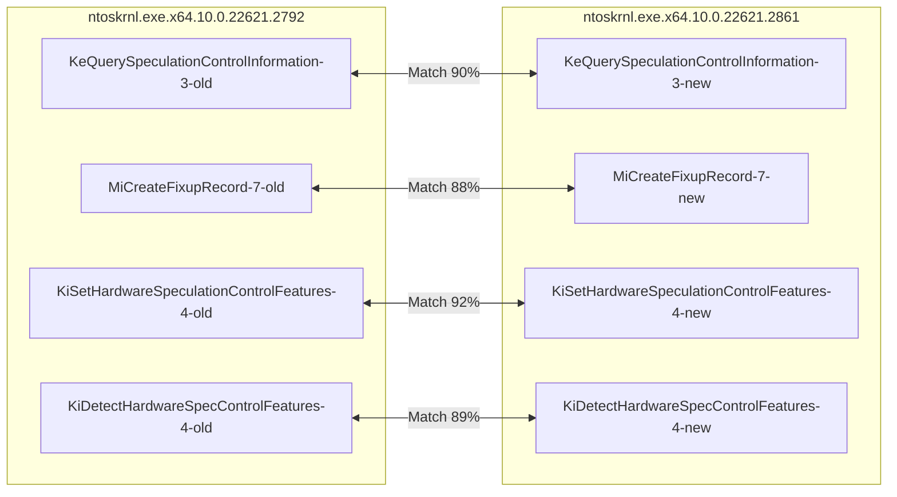
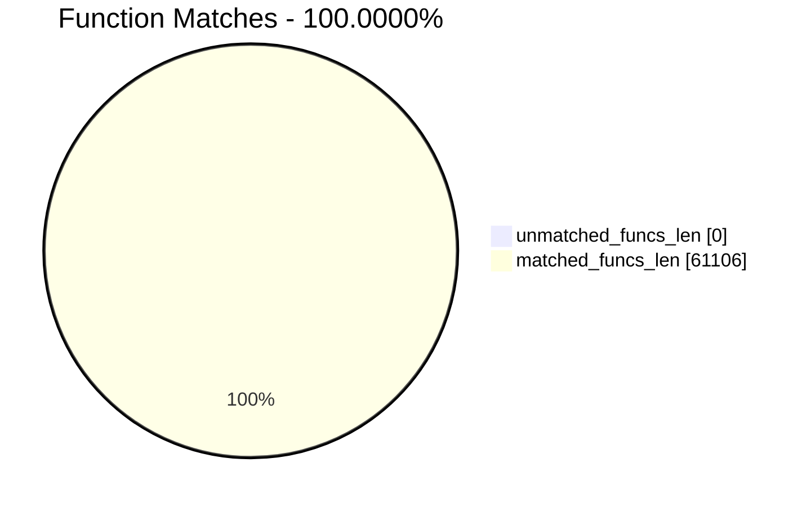
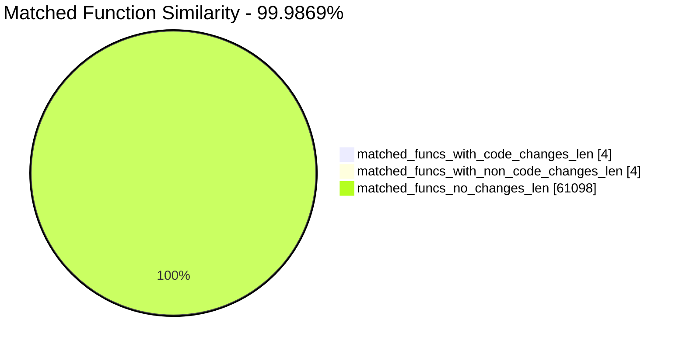
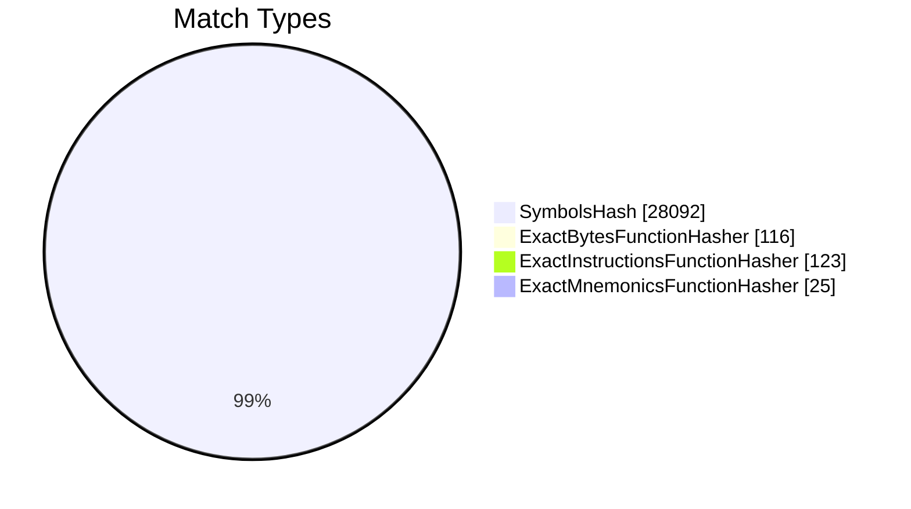
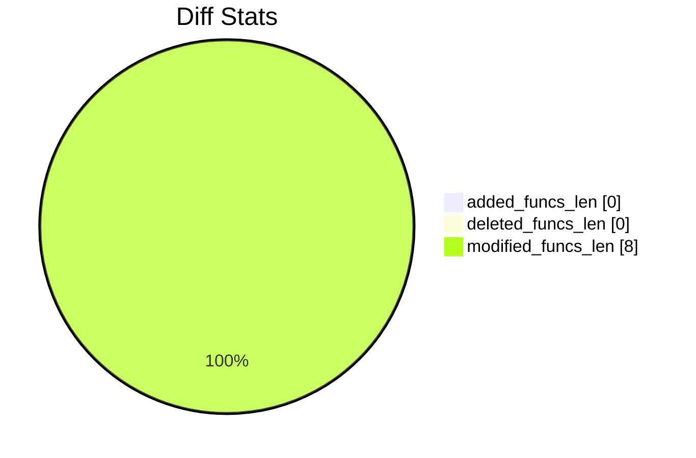
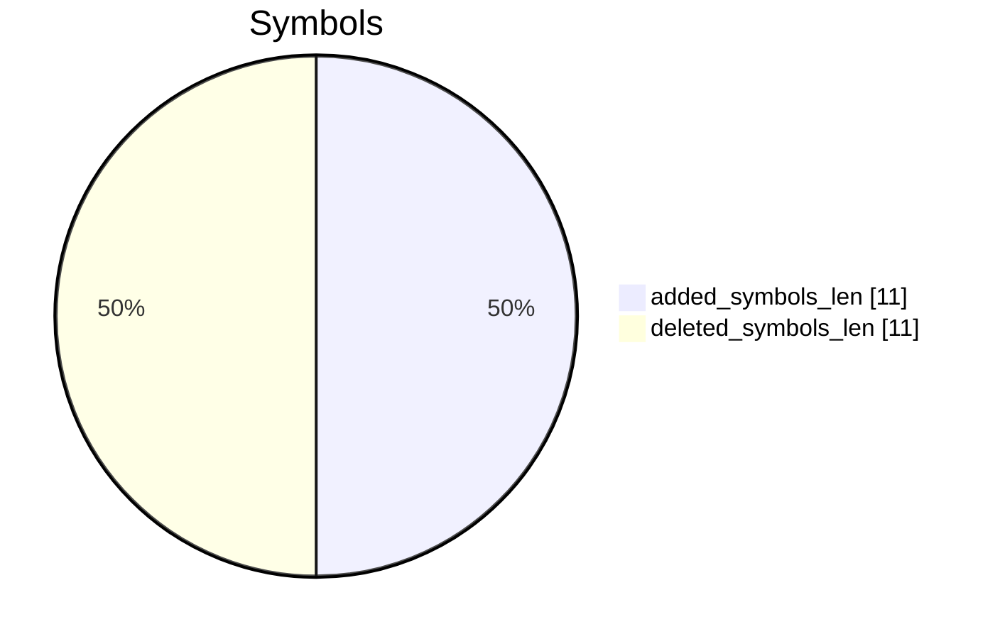

# ntoskrnl.exe.x64.10.0.22621.2792-ntoskrnl.exe.x64.10.0.22621.2861 Diff

# TOC

- [ntoskrnl.exe.x64.10.0.22621.2792-ntoskrnl.exe.x64.10.0.22621.2861 Diff](#ntoskrnlexex64100226212792-ntoskrnlexex64100226212861-diff)
- [TOC](#toc)
- [Visual Chart Diff](#visual-chart-diff)
- [Metadata](#metadata)
  - [Ghidra Diff Engine](#ghidra-diff-engine)
    - [Command Line](#command-line)
      - [Captured Command Line](#captured-command-line)
      - [Verbose Args](#verbose-args)
      - [Download Original PEs](#download-original-pes)
  - [Binary Metadata Diff](#binary-metadata-diff)
  - [Program Options](#program-options)
  - [Diff Stats](#diff-stats)
  - [Strings](#strings)
- [Deleted](#deleted)
- [Added](#added)
- [Modified](#modified)
  - [KeQuerySpeculationControlInformation](#kequeryspeculationcontrolinformation)
    - [Match Info](#match-info)
    - [Function Meta Diff](#function-meta-diff)
    - [KeQuerySpeculationControlInformation Diff](#kequeryspeculationcontrolinformation-diff)
  - [MiCreateFixupRecord](#micreatefixuprecord)
    - [Match Info](#match-info-1)
    - [Function Meta Diff](#function-meta-diff-1)
    - [MiCreateFixupRecord Diff](#micreatefixuprecord-diff)
  - [KiSetHardwareSpeculationControlFeatures](#kisethardwarespeculationcontrolfeatures)
    - [Match Info](#match-info-2)
    - [Function Meta Diff](#function-meta-diff-2)
    - [KiSetHardwareSpeculationControlFeatures Diff](#kisethardwarespeculationcontrolfeatures-diff)
  - [KiDetectHardwareSpecControlFeatures](#kidetecthardwarespeccontrolfeatures)
    - [Match Info](#match-info-3)
    - [Function Meta Diff](#function-meta-diff-3)
    - [KiDetectHardwareSpecControlFeatures Diff](#kidetecthardwarespeccontrolfeatures-diff)
- [Modified (No Code Changes)](#modified-no-code-changes)
  - [MiKvaRangeSort](#mikvarangesort)
    - [Match Info](#match-info-4)
    - [Function Meta Diff](#function-meta-diff-4)
    - [MiKvaRangeSort Calling Diff](#mikvarangesort-calling-diff)

# Visual Chart Diff










# Metadata

## Ghidra Diff Engine

### Command Line

#### Captured Command Line


```
ghidriff --project-location ghidra_projects --project-name ghidriff --symbols-path symbols --threaded --log-level DEBUG --file-log-level INFO --log-path ghidriff.log --min-func-len 166 --max-ram-percent 60.0 --max-section-funcs 200 ntoskrnl.exe.x64.10.0.22621.2792 ntoskrnl.exe.x64.10.0.22621.2861
```


#### Verbose Args


<details>

```
--old ['bins/ntoskrnl.exe.x64.10.0.22621.2792'] --new [['bins/ntoskrnl.exe.x64.10.0.22621.2861']] --engine VersionTrackingDiff --output-path ghidriffs --summary False --project-location ghidra_projects --project-name ghidriff --symbols-path symbols --threaded True --force-analysis False --force-diff False --no-symbols False --log-level DEBUG --file-log-level INFO --log-path ghidriff.log --va False --min-func-len 166 --max-ram-percent 60.0 --print-flags False --jvm-args None --side-by-side False --max-section-funcs 200 --md-title None
```


</details>

#### Download Original PEs


```
wget https://msdl.microsoft.com/download/symbols/ntkrnlmp.exe/45E0905D1047000/ntkrnlmp.exe -O ntkrnlmp.exe.x64.10.0.22621.2792
wget https://msdl.microsoft.com/download/symbols/ntkrnlmp.exe/9EEE36DE1047000/ntkrnlmp.exe -O ntkrnlmp.exe.x64.10.0.22621.2861
```


## Binary Metadata Diff


```diff
--- ntoskrnl.exe.x64.10.0.22621.2792 Meta
+++ ntoskrnl.exe.x64.10.0.22621.2861 Meta
@@ -1,44 +1,44 @@
-Program Name: ntoskrnl.exe.x64.10.0.22621.2792
+Program Name: ntoskrnl.exe.x64.10.0.22621.2861
 Language ID: x86:LE:64:default (2.14)
 Compiler ID: windows
 Processor: x86
 Endian: Little
 Address Size: 64
 Minimum Address: 140000000
 Maximum Address: ff0000184f
-# of Bytes: 17058172
+# of Bytes: 17058156
 # of Memory Blocks: 42
-# of Instructions: 2428603
-# of Defined Data: 76345
+# of Instructions: 2428804
+# of Defined Data: 76341
 # of Functions: 30553
 # of Symbols: 312846
 # of Data Types: 6213
 # of Data Type Categories: 581
 Analyzed: true
 Compiler: visualstudio:unknown
 Created With Ghidra Version: 10.4
-Date Created: Wed Dec 13 13:10:12 UTC 2023
+Date Created: Wed Dec 13 13:10:16 UTC 2023
 Executable Format: Portable Executable (PE)
-Executable Location: /workspaces/ghidriff/ntoskrnl.exe.x64.10.0.22621.2792
-Executable MD5: 10ea2e1b94d0c838953cb0f9739e8372
-Executable SHA256: 98831dafa306900ac2b11f23fe69a789f1232127c653f3e01554c339bcb08365
-FSRL: file:///workspaces/ghidriff/ntoskrnl.exe.x64.10.0.22621.2792?MD5=10ea2e1b94d0c838953cb0f9739e8372
+Executable Location: /workspaces/ghidriff/ntoskrnl.exe.x64.10.0.22621.2861
+Executable MD5: c89e5bac1b50f750ac11431fe7865946
+Executable SHA256: 0ce15480462e9cd3f7cbf2d44d2e393cf5674ee1d69a3459adfa0e913a7a2aeb
+FSRL: file:///workspaces/ghidriff/ntoskrnl.exe.x64.10.0.22621.2861?MD5=c89e5bac1b50f750ac11431fe7865946
 PDB Age: 1
 PDB File: ntkrnlmp.pdb
-PDB GUID: 83330ebc-3601-6c3b-d2b8-1c614ec8187c
+PDB GUID: 7fcf1ace-660b-3812-3d43-4bb789d5a6e8
 PDB Loaded: true
 PDB Version: RSDS
 PE Property[CompanyName]: Microsoft Corporation
 PE Property[FileDescription]: NT Kernel & System
-PE Property[FileVersion]: 10.0.22621.2792 (WinBuild.160101.0800)
+PE Property[FileVersion]: 10.0.22621.2861 (WinBuild.160101.0800)
 PE Property[InternalName]: ntkrnlmp.exe
 PE Property[LegalCopyright]: © Microsoft Corporation. All rights reserved.
 PE Property[OriginalFilename]: ntkrnlmp.exe
 PE Property[ProductName]: Microsoft® Windows® Operating System
-PE Property[ProductVersion]: 10.0.22621.2792
+PE Property[ProductVersion]: 10.0.22621.2861
 PE Property[Translation]: 4b00409
 Preferred Root Namespace Category: 
 RTTI Found: false
 Relocatable: true
 SectionAlignment: 4096
 Should Ask To Analyze: false

```


## Program Options


<details>
<summary>Ghidra ntoskrnl.exe.x64.10.0.22621.2792 Decompiler Options</summary>


|  Decompiler Option   |   Value    |
| :------------------: | :--------: |
| Prototype Evaluation | __fastcall |

</details>


<details>
<summary>Ghidra ntoskrnl.exe.x64.10.0.22621.2792 Specification extensions Options</summary>


| Specification extensions Option | Value |
| :-----------------------------: | :---: |
|          FormatVersion          |   0   |
|         VersionCounter          |   0   |

</details>


<details>
<summary>Ghidra ntoskrnl.exe.x64.10.0.22621.2792 Analyzers Options</summary>


|                                Analyzers Option                                 |      Value      |
| :-----------------------------------------------------------------------------: | :-------------: |
|                                  ASCII Strings                                  |      true       |
|            ASCII Strings.Create Strings Containing Existing Strings             |      true       |
|               ASCII Strings.Create Strings Containing References                |      true       |
|                        ASCII Strings.Force Model Reload                         |      false      |
|                       ASCII Strings.Minimum String Length                       |      LEN_5      |
|                            ASCII Strings.Model File                             | StringModel.sng |
|                ASCII Strings.Require Null Termination for String                |      true       |
|              ASCII Strings.Search Only in Accessible Memory Blocks              |      true       |
|                      ASCII Strings.String Start Alignment                       |     ALIGN_1     |
|                       ASCII Strings.String end alignment                        |        4        |
|                          Aggressive Instruction Finder                          |      false      |
|             Aggressive Instruction Finder.Create Analysis Bookmarks             |      true       |
|                               Apply Data Archives                               |      true       |
|                       Apply Data Archives.Archive Chooser                       |  [Auto-Detect]  |
|                  Apply Data Archives.Create Analysis Bookmarks                  |      true       |
|                 Apply Data Archives.GDT User File Archive Path                  |      None       |
|                  Apply Data Archives.User Project Archive Path                  |      None       |
|                               Call Convention ID                                |      true       |
|              Call Convention ID.Analysis Decompiler Timeout (sec)               |       60        |
|                              Call-Fixup Installer                               |      true       |
|                              Condense Filler Bytes                              |      false      |
|                       Condense Filler Bytes.Filler Value                        |      Auto       |
|            Condense Filler Bytes.Minimum number of sequential bytes             |        1        |
|                              Create Address Tables                              |      true       |
|                  Create Address Tables.Allow Offcut References                  |      false      |
|                     Create Address Tables.Auto Label Table                      |      false      |
|                 Create Address Tables.Create Analysis Bookmarks                 |      true       |
|                 Create Address Tables.Maxmimum Pointer Distance                 |    16777215     |
|                  Create Address Tables.Minimum Pointer Address                  |      4132       |
|                    Create Address Tables.Minimum Table Size                     |        2        |
|                     Create Address Tables.Pointer Alignment                     |        1        |
|                  Create Address Tables.Relocation Table Guide                   |      true       |
|                      Create Address Tables.Table Alignment                      |        4        |
|                                 Data Reference                                  |      true       |
|                     Data Reference.Address Table Alignment                      |        1        |
|                    Data Reference.Address Table Minimum Size                    |        2        |
|                       Data Reference.Align End of Strings                       |      false      |
|                     Data Reference.Ascii String References                      |      true       |
|                      Data Reference.Create Address Tables                       |      true       |
|                      Data Reference.Minimum String Length                       |        5        |
|                      Data Reference.References to Pointers                      |      true       |
|                      Data Reference.Relocation Table Guide                      |      true       |
|                       Data Reference.Respect Execute Flag                       |      true       |
|                      Data Reference.Subroutine References                       |      true       |
|                     Data Reference.Switch Table References                      |      false      |
|                    Data Reference.Unicode String References                     |      true       |
|                             Decompiler Parameter ID                             |      true       |
|                  Decompiler Parameter ID.Analysis Clear Level                   |    ANALYSIS     |
|            Decompiler Parameter ID.Analysis Decompiler Timeout (sec)            |       60        |
|                    Decompiler Parameter ID.Commit Data Types                    |      true       |
|                Decompiler Parameter ID.Commit Void Return Values                |      false      |
|                  Decompiler Parameter ID.Prototype Evaluation                   |   __fastcall    |
|                           Decompiler Switch Analysis                            |      true       |
|          Decompiler Switch Analysis.Analysis Decompiler Timeout (sec)           |       60        |
|                               Demangler Microsoft                               |      true       |
|             Demangler Microsoft.Apply Function Calling Conventions              |      true       |
|                  Demangler Microsoft.Apply Function Signatures                  |      true       |
|                            Disassemble Entry Points                             |      true       |
|                  Disassemble Entry Points.Respect Execute Flag                  |      true       |
|                                 Embedded Media                                  |      true       |
|                    Embedded Media.Create Analysis Bookmarks                     |      true       |
|                            External Entry References                            |      true       |
|                                   Function ID                                   |      true       |
|                       Function ID.Always Apply FID Labels                       |      false      |
|                      Function ID.Create Analysis Bookmarks                      |      true       |
|                     Function ID.Instruction Count Threshold                     |      14.6       |
|                      Function ID.Multiple Match Threshold                       |      30.0       |
|                              Function Start Search                              |      true       |
|                    Function Start Search.Bookmark Functions                     |      false      |
|                    Function Start Search.Search Data Blocks                     |      false      |
|                      Non-Returning Functions - Discovered                       |      true       |
|         Non-Returning Functions - Discovered.Create Analysis Bookmarks          |      true       |
|       Non-Returning Functions - Discovered.Function Non-return Threshold        |        3        |
|             Non-Returning Functions - Discovered.Repair Flow Damage             |      true       |
|                         Non-Returning Functions - Known                         |      true       |
|            Non-Returning Functions - Known.Create Analysis Bookmarks            |      true       |
|                                    PDB MSDIA                                    |      false      |
|                     PDB MSDIA.Search remote symbol servers                      |      false      |
|                                  PDB Universal                                  |      true       |
|                   PDB Universal.Search remote symbol servers                    |      false      |
|                                    Reference                                    |      true       |
|                        Reference.Address Table Alignment                        |        1        |
|                      Reference.Address Table Minimum Size                       |        2        |
|                         Reference.Align End of Strings                          |      false      |
|                        Reference.Ascii String References                        |      true       |
|                         Reference.Create Address Tables                         |      true       |
|                         Reference.Minimum String Length                         |        5        |
|                        Reference.References to Pointers                         |      true       |
|                        Reference.Relocation Table Guide                         |      true       |
|                         Reference.Respect Execute Flag                          |      true       |
|                         Reference.Subroutine References                         |      true       |
|                        Reference.Switch Table References                        |      false      |
|                       Reference.Unicode String References                       |      true       |
|                            Scalar Operand References                            |      true       |
|                Scalar Operand References.Relocation Table Guide                 |      true       |
|                               Shared Return Calls                               |      true       |
|                   Shared Return Calls.Allow Conditional Jumps                   |      false      |
|              Shared Return Calls.Assume Contiguous Functions Only               |      false      |
|                                      Stack                                      |      true       |
|                          Stack.Create Local Variables                           |      true       |
|                          Stack.Create Param Variables                           |      true       |
|                        Stack.useNewFunctionStackAnalysis                        |      true       |
|                              Subroutine References                              |      true       |
|                    Subroutine References.Create Thunks Early                    |      true       |
|                      Variadic Function Signature Override                       |      false      |
|         Variadic Function Signature Override.Create Analysis Bookmarks          |      false      |
|                        Windows x86 PE Exception Handling                        |      true       |
|                          Windows x86 PE RTTI Analyzer                           |      true       |
|               Windows x86 Thread Environment Block (TEB) Analyzer               |      true       |
| Windows x86 Thread Environment Block (TEB) Analyzer.Starting Address of the TEB |                 |
|     Windows x86 Thread Environment Block (TEB) Analyzer.Windows OS Version      |    Windows 7    |
|                   WindowsPE x86 Propagate External Parameters                   |      false      |
|                            WindowsResourceReference                             |      true       |
|               WindowsResourceReference.Create Analysis Bookmarks                |      true       |
|                         x86 Constant Reference Analyzer                         |      true       |
|            x86 Constant Reference Analyzer.Create Data from pointer             |      false      |
|   x86 Constant Reference Analyzer.Function parameter/return Pointer analysis    |      true       |
|                   x86 Constant Reference Analyzer.Max Threads                   |        2        |
|             x86 Constant Reference Analyzer.Min absolute reference              |        4        |
|         x86 Constant Reference Analyzer.Require pointer param data type         |      false      |
|            x86 Constant Reference Analyzer.Speculative reference max            |       512       |
|            x86 Constant Reference Analyzer.Speculative reference min            |      1024       |
|          x86 Constant Reference Analyzer.Stored Value Pointer analysis          |      true       |
|     x86 Constant Reference Analyzer.Trust values read from writable memory      |      true       |

</details>


<details>
<summary>Ghidra ntoskrnl.exe.x64.10.0.22621.2861 Decompiler Options</summary>


|  Decompiler Option   |   Value    |
| :------------------: | :--------: |
| Prototype Evaluation | __fastcall |

</details>


<details>
<summary>Ghidra ntoskrnl.exe.x64.10.0.22621.2861 Specification extensions Options</summary>


| Specification extensions Option | Value |
| :-----------------------------: | :---: |
|          FormatVersion          |   0   |
|         VersionCounter          |   0   |

</details>


<details>
<summary>Ghidra ntoskrnl.exe.x64.10.0.22621.2861 Analyzers Options</summary>


|                                Analyzers Option                                 |      Value      |
| :-----------------------------------------------------------------------------: | :-------------: |
|                                  ASCII Strings                                  |      true       |
|            ASCII Strings.Create Strings Containing Existing Strings             |      true       |
|               ASCII Strings.Create Strings Containing References                |      true       |
|                        ASCII Strings.Force Model Reload                         |      false      |
|                       ASCII Strings.Minimum String Length                       |      LEN_5      |
|                            ASCII Strings.Model File                             | StringModel.sng |
|                ASCII Strings.Require Null Termination for String                |      true       |
|              ASCII Strings.Search Only in Accessible Memory Blocks              |      true       |
|                      ASCII Strings.String Start Alignment                       |     ALIGN_1     |
|                       ASCII Strings.String end alignment                        |        4        |
|                          Aggressive Instruction Finder                          |      false      |
|             Aggressive Instruction Finder.Create Analysis Bookmarks             |      true       |
|                               Apply Data Archives                               |      true       |
|                       Apply Data Archives.Archive Chooser                       |  [Auto-Detect]  |
|                  Apply Data Archives.Create Analysis Bookmarks                  |      true       |
|                 Apply Data Archives.GDT User File Archive Path                  |      None       |
|                  Apply Data Archives.User Project Archive Path                  |      None       |
|                               Call Convention ID                                |      true       |
|              Call Convention ID.Analysis Decompiler Timeout (sec)               |       60        |
|                              Call-Fixup Installer                               |      true       |
|                              Condense Filler Bytes                              |      false      |
|                       Condense Filler Bytes.Filler Value                        |      Auto       |
|            Condense Filler Bytes.Minimum number of sequential bytes             |        1        |
|                              Create Address Tables                              |      true       |
|                  Create Address Tables.Allow Offcut References                  |      false      |
|                     Create Address Tables.Auto Label Table                      |      false      |
|                 Create Address Tables.Create Analysis Bookmarks                 |      true       |
|                 Create Address Tables.Maxmimum Pointer Distance                 |    16777215     |
|                  Create Address Tables.Minimum Pointer Address                  |      4132       |
|                    Create Address Tables.Minimum Table Size                     |        2        |
|                     Create Address Tables.Pointer Alignment                     |        1        |
|                  Create Address Tables.Relocation Table Guide                   |      true       |
|                      Create Address Tables.Table Alignment                      |        4        |
|                                 Data Reference                                  |      true       |
|                     Data Reference.Address Table Alignment                      |        1        |
|                    Data Reference.Address Table Minimum Size                    |        2        |
|                       Data Reference.Align End of Strings                       |      false      |
|                     Data Reference.Ascii String References                      |      true       |
|                      Data Reference.Create Address Tables                       |      true       |
|                      Data Reference.Minimum String Length                       |        5        |
|                      Data Reference.References to Pointers                      |      true       |
|                      Data Reference.Relocation Table Guide                      |      true       |
|                       Data Reference.Respect Execute Flag                       |      true       |
|                      Data Reference.Subroutine References                       |      true       |
|                     Data Reference.Switch Table References                      |      false      |
|                    Data Reference.Unicode String References                     |      true       |
|                             Decompiler Parameter ID                             |      true       |
|                  Decompiler Parameter ID.Analysis Clear Level                   |    ANALYSIS     |
|            Decompiler Parameter ID.Analysis Decompiler Timeout (sec)            |       60        |
|                    Decompiler Parameter ID.Commit Data Types                    |      true       |
|                Decompiler Parameter ID.Commit Void Return Values                |      false      |
|                  Decompiler Parameter ID.Prototype Evaluation                   |   __fastcall    |
|                           Decompiler Switch Analysis                            |      true       |
|          Decompiler Switch Analysis.Analysis Decompiler Timeout (sec)           |       60        |
|                               Demangler Microsoft                               |      true       |
|             Demangler Microsoft.Apply Function Calling Conventions              |      true       |
|                  Demangler Microsoft.Apply Function Signatures                  |      true       |
|                            Disassemble Entry Points                             |      true       |
|                  Disassemble Entry Points.Respect Execute Flag                  |      true       |
|                                 Embedded Media                                  |      true       |
|                    Embedded Media.Create Analysis Bookmarks                     |      true       |
|                            External Entry References                            |      true       |
|                                   Function ID                                   |      true       |
|                       Function ID.Always Apply FID Labels                       |      false      |
|                      Function ID.Create Analysis Bookmarks                      |      true       |
|                     Function ID.Instruction Count Threshold                     |      14.6       |
|                      Function ID.Multiple Match Threshold                       |      30.0       |
|                              Function Start Search                              |      true       |
|                    Function Start Search.Bookmark Functions                     |      false      |
|                    Function Start Search.Search Data Blocks                     |      false      |
|                      Non-Returning Functions - Discovered                       |      true       |
|         Non-Returning Functions - Discovered.Create Analysis Bookmarks          |      true       |
|       Non-Returning Functions - Discovered.Function Non-return Threshold        |        3        |
|             Non-Returning Functions - Discovered.Repair Flow Damage             |      true       |
|                         Non-Returning Functions - Known                         |      true       |
|            Non-Returning Functions - Known.Create Analysis Bookmarks            |      true       |
|                                    PDB MSDIA                                    |      false      |
|                     PDB MSDIA.Search remote symbol servers                      |      false      |
|                                  PDB Universal                                  |      true       |
|                   PDB Universal.Search remote symbol servers                    |      false      |
|                                    Reference                                    |      true       |
|                        Reference.Address Table Alignment                        |        1        |
|                      Reference.Address Table Minimum Size                       |        2        |
|                         Reference.Align End of Strings                          |      false      |
|                        Reference.Ascii String References                        |      true       |
|                         Reference.Create Address Tables                         |      true       |
|                         Reference.Minimum String Length                         |        5        |
|                        Reference.References to Pointers                         |      true       |
|                        Reference.Relocation Table Guide                         |      true       |
|                         Reference.Respect Execute Flag                          |      true       |
|                         Reference.Subroutine References                         |      true       |
|                        Reference.Switch Table References                        |      false      |
|                       Reference.Unicode String References                       |      true       |
|                            Scalar Operand References                            |      true       |
|                Scalar Operand References.Relocation Table Guide                 |      true       |
|                               Shared Return Calls                               |      true       |
|                   Shared Return Calls.Allow Conditional Jumps                   |      false      |
|              Shared Return Calls.Assume Contiguous Functions Only               |      false      |
|                                      Stack                                      |      true       |
|                          Stack.Create Local Variables                           |      true       |
|                          Stack.Create Param Variables                           |      true       |
|                        Stack.useNewFunctionStackAnalysis                        |      true       |
|                              Subroutine References                              |      true       |
|                    Subroutine References.Create Thunks Early                    |      true       |
|                      Variadic Function Signature Override                       |      false      |
|         Variadic Function Signature Override.Create Analysis Bookmarks          |      false      |
|                        Windows x86 PE Exception Handling                        |      true       |
|                          Windows x86 PE RTTI Analyzer                           |      true       |
|               Windows x86 Thread Environment Block (TEB) Analyzer               |      true       |
| Windows x86 Thread Environment Block (TEB) Analyzer.Starting Address of the TEB |                 |
|     Windows x86 Thread Environment Block (TEB) Analyzer.Windows OS Version      |    Windows 7    |
|                   WindowsPE x86 Propagate External Parameters                   |      false      |
|                            WindowsResourceReference                             |      true       |
|               WindowsResourceReference.Create Analysis Bookmarks                |      true       |
|                         x86 Constant Reference Analyzer                         |      true       |
|            x86 Constant Reference Analyzer.Create Data from pointer             |      false      |
|   x86 Constant Reference Analyzer.Function parameter/return Pointer analysis    |      true       |
|                   x86 Constant Reference Analyzer.Max Threads                   |        2        |
|             x86 Constant Reference Analyzer.Min absolute reference              |        4        |
|         x86 Constant Reference Analyzer.Require pointer param data type         |      false      |
|            x86 Constant Reference Analyzer.Speculative reference max            |       512       |
|            x86 Constant Reference Analyzer.Speculative reference min            |      1024       |
|          x86 Constant Reference Analyzer.Stored Value Pointer analysis          |      true       |
|     x86 Constant Reference Analyzer.Trust values read from writable memory      |      true       |

</details>

## Diff Stats


|                  Stat                   |                                                                    Value                                                                     |
| :-------------------------------------: | :------------------------------------------------------------------------------------------------------------------------------------------: |
|             added_funcs_len             |                                                                      0                                                                       |
|            deleted_funcs_len            |                                                                      0                                                                       |
|           modified_funcs_len            |                                                                      8                                                                       |
|            added_symbols_len            |                                                                      11                                                                      |
|           deleted_symbols_len           |                                                                      11                                                                      |
|                diff_time                |                                                              48.789085149765015                                                              |
|           deleted_strings_len           |                                                                      0                                                                       |
|            added_strings_len            |                                                                      0                                                                       |
|               match_types               | Counter({'SymbolsHash': 28092, 'ExactInstructionsFunctionHasher': 123, 'ExactBytesFunctionHasher': 116, 'ExactMnemonicsFunctionHasher': 25}) |
|            items_to_process             |                                                                      30                                                                      |
|               diff_types                |        Counter({'address': 6, 'refcount': 6, 'code': 4, 'length': 4, 'name': 4, 'fullname': 4, 'sig': 4, 'calling': 4, 'called': 2})         |
|           unmatched_funcs_len           |                                                                      0                                                                       |
|             total_funcs_len             |                                                                    61106                                                                     |
|            matched_funcs_len            |                                                                    61106                                                                     |
|   matched_funcs_with_code_changes_len   |                                                                      4                                                                       |
| matched_funcs_with_non_code_changes_len |                                                                      4                                                                       |
|      matched_funcs_no_changes_len       |                                                                    61098                                                                     |
|      match_func_similarity_percent      |                                                                   99.9869%                                                                   |
|       func_match_overall_percent        |                                                                  100.0000%                                                                   |










## Strings


*No string differences found*

# Deleted

# Added

# Modified


*Modified functions contain code changes*
## KeQuerySpeculationControlInformation

### Match Info


|     Key     | ntoskrnl.exe.x64.10.0.22621.2792 - ntoskrnl.exe.x64.10.0.22621.2861 |
| :---------: | :-----------------------------------------------------------------: |
|  diff_type  |                         code,length,address                         |
|    ratio    |                                0.83                                 |
|   i_ratio   |                                0.71                                 |
|   m_ratio   |                                0.89                                 |
|   b_ratio   |                                 0.9                                 |
| match_types |                             SymbolsHash                             |

### Function Meta Diff


|    Key     |                                       ntoskrnl.exe.x64.10.0.22621.2792                                       |                                       ntoskrnl.exe.x64.10.0.22621.2861                                       |
| :--------: | :----------------------------------------------------------------------------------------------------------: | :----------------------------------------------------------------------------------------------------------: |
|    name    |                                     KeQuerySpeculationControlInformation                                     |                                     KeQuerySpeculationControlInformation                                     |
|  fullname  |                                     KeQuerySpeculationControlInformation                                     |                                     KeQuerySpeculationControlInformation                                     |
|  refcount  |                                                      2                                                       |                                                      2                                                       |
|  `length`  |                                                     1136                                                     |                                                     1173                                                     |
|   called   | HvlQueryL1tfMitigationInformation<br>KeKvaShadowingActive<br>KiIsFbClearSupported<br>RtlCopyMemory<br>memset | HvlQueryL1tfMitigationInformation<br>KeKvaShadowingActive<br>KiIsFbClearSupported<br>RtlCopyMemory<br>memset |
|  calling   |                                          ExpQuerySystemInformation                                           |                                          ExpQuerySystemInformation                                           |
| paramcount |                                                      3                                                       |                                                      3                                                       |
| `address`  |                                                  1409727dc                                                   |                                                  1409727bc                                                   |
|    sig     |   undefined8 __fastcall KeQuerySpeculationControlInformation(void * param_1, uint param_2, uint * param_3)   |   undefined8 __fastcall KeQuerySpeculationControlInformation(void * param_1, uint param_2, uint * param_3)   |
|  sym_type  |                                                   Function                                                   |                                                   Function                                                   |
| sym_source |                                                   IMPORTED                                                   |                                                   IMPORTED                                                   |
|  external  |                                                    False                                                     |                                                    False                                                     |

### KeQuerySpeculationControlInformation Diff


```diff
--- KeQuerySpeculationControlInformation
+++ KeQuerySpeculationControlInformation
@@ -1,130 +1,130 @@
 
 undefined8 KeQuerySpeculationControlInformation(void *param_1,uint param_2,uint *param_3)
 
 {
   ulonglong uVar1;
   char cVar2;
   bool bVar3;
   int iVar4;
   undefined7 extraout_var;
   uint uVar5;
   uint uVar6;
   ulonglong uVar7;
   ulonglong _Size;
   undefined8 local_res20;
   
   _Size = (ulonglong)param_2;
   if (param_2 < 4) {
     *param_3 = 8;
     return 0xc0000004;
   }
   if (7 < param_2) {
     param_2 = 8;
   }
   *param_3 = param_2;
   cVar2 = KiKvaShadow;
   uVar1 = KeFeatureBits2;
   uVar6 = (uint)(KiSpeculationFeatures >> 0x20);
   local_res20._4_4_ = 0;
   local_res20._0_4_ = uVar6 >> 4 & 1 ^ uVar6 >> 1 & 2 ^ uVar6 >> 1 & 4;
   if (((KiSpeculationFeatures & 0x10) != 0) || ((KiSpeculationFeatures & 0x40) != 0)) {
     local_res20._0_4_ = (uint)local_res20 | 8;
   }
   if ((KiSpeculationFeatures & 4) != 0) {
     local_res20._0_4_ = (uint)local_res20 | 0x10;
   }
   if (((KiSpeculationFeatures >> 0x24 & 1) != 0) && ((KiSpeculationFeatures & 0x2000000000) != 0)) {
     local_res20._0_4_ = (uint)local_res20 | 0x2000;
   }
   uVar6 = (uint)KiSpeculationFeatures;
   local_res20._0_4_ =
        (uVar6 * 4 & 0x80 | (uint)local_res20 ^ uVar6 * 2 & 0x20 ^ uVar6 & 0x40 | 0x100) ^
        (uint)(KiSpeculationFeatures << 2) & 0x200 ^ (uint)(KiSpeculationFeatures >> 0x1c) & 0x400 ^
        (uint)(KiSpeculationFeatures >> 0x1c) & 0x800 ^ ~(uint)(KiSpeculationFeatures << 4) & 0x1000
        ^ (uint)(KiSpeculationFeatures >> 0x1b) & 0x4000 ^
        (uint)(KiSpeculationFeatures >> 0x1b) & 0x8000;
   uVar6 = (uVar6 & 1 | 0x80) << 0x10 | (uint)(KeFeatureBits2 << 0x13) & 0x1000000 |
           (uint)local_res20;
   if ((KiKvaShadow == '\0') || (uVar5 = 0x26000000, (KeFeatureBits2 & 8) == 0)) {
     uVar5 = 0x24000000;
   }
   uVar7 = KeFeatureBits2 & 0x8000;
   if (((uVar7 == 0) || (KiDisableTsx == 0)) && (KiTsxSupported != 0)) {
     if (((KeFeatureBits2 >> 0x10 & 1) == 0) &&
        ((((byte)KeFeatureBits2 & 0x28) != 8 || (iVar4 = KeKvaShadowingActive(), iVar4 == 0)))) {
       if (uVar7 == 0) {
         local_res20._0_4_ = uVar6 | uVar5;
       }
       else {
         local_res20._0_4_ = uVar6 | uVar5 | 0x8000000;
       }
     }
     else {
       local_res20._0_4_ = uVar6 | uVar5 | 0x10000000;
     }
   }
   else {
     local_res20._0_4_ = uVar6 | uVar5 | 0x18000000;
   }
   if (((uVar1 >> 0x10 & 1) == 0) && (KiTsxSupportedAtBoot != 0)) {
     uVar6 = 0;
   }
   else {
     uVar6 = 0x40000000;
   }
   local_res20._0_4_ = (uint)local_res20 | uVar6;
   HvlQueryL1tfMitigationInformation((uint *)&local_res20);
   uVar6 = ((uint)(uVar1 >> 0x13) ^ local_res20._4_4_) & 7 ^ local_res20._4_4_;
-  if (cVar2 == '\0') {
-LAB_0:
-    uVar5 = 0x410;
-  }
-  else {
+  if (cVar2 != '\0') {
     bVar3 = KiIsFbClearSupported();
     uVar5 = 0x418;
-    if ((int)CONCAT71(extraout_var,bVar3) == 0) goto LAB_0;
+    if ((int)CONCAT71(extraout_var,bVar3) != 0) goto LAB_0;
   }
+  uVar5 = 0x410;
+LAB_0:
   if ((KiSpeculationFeatures >> 0xf & 1) == 0) {
     uVar5 = uVar6 & 0xfffffef7 | uVar5 | 0x200;
   }
   else if ((((KiSpeculationFeatures & 0x400000000) == 0) &&
            ((KiSpeculationFeatures & 0x2000000000) == 0)) &&
           ((KiSpeculationFeatures >> 0x2c & 1) == 0)) {
     if (((KiSpeculationFeatures & 0x800000000) == 0) && ((KiSpeculationFeatures >> 0x2d & 1) == 0))
     {
       uVar5 = uVar6 & 0xfffffff7 | uVar5 | 0x300;
     }
     else {
       uVar5 = uVar6 & 0xfffffcf7 | uVar5;
     }
   }
   else {
     uVar5 = uVar6 & 0xfffffdf7 | uVar5 | 0x100;
   }
   uVar6 = ((uint)(KeFeatureBits2 >> 4) & 1) << 0xc;
-  local_res20 = CONCAT44(uVar6 | uVar5 & 0xffffefff,(uint)local_res20);
-  if ((KiSpeculationFeatures >> 0x15 & 1) == 0) {
+  if ((KiSpeculationFeatures & 0x200000) == 0) {
     uVar6 = uVar6 | uVar5 & 0xfffbefff | 0xa0800;
   }
+  else if ((((KiSpeculationFeatures & 0x400000000) == 0) &&
+           ((KiSpeculationFeatures & 0x2000000000) == 0)) &&
+          ((KiSpeculationFeatures >> 0x2f & 1) == 0)) {
+    if (((KiSpeculationFeatures & 0x800000000) == 0) && ((KiSpeculationFeatures >> 0x30 & 1) == 0))
+    {
+      uVar6 = uVar6 | uVar5 & 0xffffefff | 0xe0800;
+    }
+    else {
+      uVar6 = uVar6 | uVar5 & 0xfff3efff | 0x20800;
+    }
+  }
   else {
-    if ((((KiSpeculationFeatures & 0x400000000) == 0) &&
-        ((KiSpeculationFeatures & 0x2000000000) == 0)) && ((KiSpeculationFeatures >> 0x2f & 1) == 0)
-       ) {
-      if (((KiSpeculationFeatures & 0x800000000) == 0) && ((KiSpeculationFeatures >> 0x30 & 1) == 0)
-         ) {
-        local_res20 = local_res20 | 0xe080000000000;
-      }
-      else {
-        local_res20 = local_res20 & 0xfff3ffffffffffff | 0x2080000000000;
-      }
-      goto LAB_1;
-    }
     uVar6 = uVar6 | uVar5 & 0xfff7efff | 0x60800;
   }
-  local_res20 = CONCAT44(uVar6,(uint)local_res20);
-LAB_1:
+  if ((KiSpeculationFeatures >> 0x16 & 1) == 0) {
+    local_res20 = CONCAT44(uVar6,(uint)local_res20) & 0xffdfffffffffffff | 0x10000000000000;
+  }
+  else {
+    local_res20 = CONCAT44(uVar6,(uint)local_res20) | 0x30000000000000;
+  }
   memset(param_1,0,_Size);
   RtlCopyMemory(param_1,&local_res20,(ulonglong)param_2);
   return 0;
 }
 

```


## MiCreateFixupRecord

### Match Info


|     Key     | ntoskrnl.exe.x64.10.0.22621.2792 - ntoskrnl.exe.x64.10.0.22621.2861 |
| :---------: | :-----------------------------------------------------------------: |
|  diff_type  |                        code,refcount,length                         |
|    ratio    |                                0.24                                 |
|   i_ratio   |                                0.48                                 |
|   m_ratio   |                                0.69                                 |
|   b_ratio   |                                0.88                                 |
| match_types |                             SymbolsHash                             |

### Function Meta Diff


|    Key     |                                                               ntoskrnl.exe.x64.10.0.22621.2792                                                                |                                                               ntoskrnl.exe.x64.10.0.22621.2861                                                                |
| :--------: | :-----------------------------------------------------------------------------------------------------------------------------------------------------------: | :-----------------------------------------------------------------------------------------------------------------------------------------------------------: |
|    name    |                                                                      MiCreateFixupRecord                                                                      |                                                                      MiCreateFixupRecord                                                                      |
|  fullname  |                                                                      MiCreateFixupRecord                                                                      |                                                                      MiCreateFixupRecord                                                                      |
| `refcount` |                                                                               3                                                                               |                                                                               2                                                                               |
|  `length`  |                                                                              335                                                                              |                                                                              306                                                                              |
|   called   |                                                                        MiAllocatePool                                                                         |                                                                        MiAllocatePool                                                                         |
|  calling   |                                                                     MiScanRelocationPage                                                                      |                                                                     MiScanRelocationPage                                                                      |
| paramcount |                                                                               7                                                                               |                                                                               7                                                                               |
|  address   |                                                                           14083f464                                                                           |                                                                           14083f464                                                                           |
|    sig     | undefined8 __fastcall MiCreateFixupRecord(longlong * param_1, longlong param_2, uint param_3, int param_4, int param_5, ushort * param_6, longlong * param_7) | undefined8 __fastcall MiCreateFixupRecord(longlong * param_1, longlong param_2, uint param_3, int param_4, int param_5, ushort * param_6, longlong * param_7) |
|  sym_type  |                                                                           Function                                                                            |                                                                           Function                                                                            |
| sym_source |                                                                           IMPORTED                                                                            |                                                                           IMPORTED                                                                            |
|  external  |                                                                             False                                                                             |                                                                             False                                                                             |

### MiCreateFixupRecord Diff


```diff
--- MiCreateFixupRecord
+++ MiCreateFixupRecord
@@ -1,53 +1,55 @@
 
 undefined8
 MiCreateFixupRecord(longlong *param_1,longlong param_2,uint param_3,int param_4,int param_5,
                    ushort *param_6,longlong *param_7)
 
 {
   ulonglong *puVar1;
   ushort uVar2;
-  longlong *plVar3;
-  undefined8 uVar4;
-  ulonglong local_28;
+  undefined8 uVar3;
+  longlong *plVar4;
+  ulonglong local_res8;
   
-  local_28 = 0;
-  uVar2 = *param_6;
-  if ((param_3 & 0xfff) < 0x1000U - param_4) {
-    if (*(uint *)(*param_1 + 8) <= param_3 + 0x1000 >> 0xc) {
-      return 0xc0000005;
-    }
-    if (param_5 == 4) {
-      local_28 = (ulonglong)*(uint *)((ulonglong)param_3 + param_2);
+  if (param_3 + 0x1000 >> 0xc < *(uint *)(*param_1 + 8)) {
+    local_res8 = 0;
+    uVar2 = *param_6;
+    if ((param_3 & 0xfff) < 0x1000U - param_4) {
+      if (param_5 == 4) {
+        local_res8 = (ulonglong)*(uint *)((ulonglong)param_3 + param_2);
+      }
+      else {
+        local_res8 = *(ulonglong *)((ulonglong)param_3 + param_2);
+      }
     }
     else {
-      local_28 = *(ulonglong *)((ulonglong)param_3 + param_2);
+      *param_6 = uVar2 & 0xfff;
+    }
+    plVar4 = (longlong *)MiAllocatePool(0x100,0x20,0x72466d4d);
+    if (plVar4 == (longlong *)0x0) {
+      uVar3 = 0xc000009a;
+    }
+    else {
+      *(ushort *)(plVar4 + 2) = uVar2 >> 0xc;
+      *(uint *)((longlong)plVar4 + 0xc) = param_3 + param_5;
+      if ((param_3 & 0xfff) < 0x1000U - param_4) {
+        *(uint *)(plVar4 + 1) = param_3;
+        plVar4[3] = local_res8;
+        puVar1 = (ulonglong *)(*param_7 + (ulonglong)(param_3 >> 0xc) * 8);
+        *puVar1 = *puVar1 | 1;
+      }
+      else {
+        *(uint *)(plVar4 + 1) = (param_3 & 0xfffff000) + 0x1000;
+      }
+      puVar1 = (ulonglong *)(*param_7 + (ulonglong)(*(uint *)((longlong)plVar4 + 0xc) >> 0xc) * 8);
+      *puVar1 = *puVar1 | 1;
+      *plVar4 = param_7[2];
+      param_7[2] = (longlong)plVar4;
+      uVar3 = 0;
     }
   }
   else {
-    *param_6 = uVar2 & 0xfff;
+    uVar3 = 0xc0000005;
   }
-  plVar3 = (longlong *)MiAllocatePool(0x100,0x20,0x72466d4d);
-  if (plVar3 == (longlong *)0x0) {
-    uVar4 = 0xc000009a;
-  }
-  else {
-    *(ushort *)(plVar3 + 2) = uVar2 >> 0xc;
-    *(uint *)((longlong)plVar3 + 0xc) = param_3 + param_5;
-    if ((param_3 & 0xfff) < 0x1000U - param_4) {
-      *(uint *)(plVar3 + 1) = param_3;
-      plVar3[3] = local_28;
-      puVar1 = (ulonglong *)(*param_7 + (ulonglong)(param_3 >> 0xc) * 8);
-      *puVar1 = *puVar1 | 1;
-    }
-    else {
-      *(uint *)(plVar3 + 1) = (param_3 & 0xfffff000) + 0x1000;
-    }
-    puVar1 = (ulonglong *)(*param_7 + (ulonglong)(*(uint *)((longlong)plVar3 + 0xc) >> 0xc) * 8);
-    *puVar1 = *puVar1 | 1;
-    *plVar3 = param_7[2];
-    param_7[2] = (longlong)plVar3;
-    uVar4 = 0;
-  }
-  return uVar4;
+  return uVar3;
 }
 

```


## KiSetHardwareSpeculationControlFeatures

### Match Info


|     Key     | ntoskrnl.exe.x64.10.0.22621.2792 - ntoskrnl.exe.x64.10.0.22621.2861 |
| :---------: | :-----------------------------------------------------------------: |
|  diff_type  |                        code,refcount,length                         |
|    ratio    |                                0.89                                 |
|   i_ratio   |                                0.57                                 |
|   m_ratio   |                                0.75                                 |
|   b_ratio   |                                0.92                                 |
| match_types |                             SymbolsHash                             |

### Function Meta Diff


|    Key     |                                                    ntoskrnl.exe.x64.10.0.22621.2792                                                     |                                                    ntoskrnl.exe.x64.10.0.22621.2861                                                     |
| :--------: | :-------------------------------------------------------------------------------------------------------------------------------------: | :-------------------------------------------------------------------------------------------------------------------------------------: |
|    name    |                                                 KiSetHardwareSpeculationControlFeatures                                                 |                                                 KiSetHardwareSpeculationControlFeatures                                                 |
|  fullname  |                                                 KiSetHardwareSpeculationControlFeatures                                                 |                                                 KiSetHardwareSpeculationControlFeatures                                                 |
| `refcount` |                                                                    3                                                                    |                                                                    2                                                                    |
|  `length`  |                                                                   232                                                                   |                                                                   233                                                                   |
|   called   |                                           KeBugCheckEx<br>KiDetectHardwareSpecControlFeatures                                           |                                           KeBugCheckEx<br>KiDetectHardwareSpecControlFeatures                                           |
|  calling   |                                                           KiInitializeKernel                                                            |                                                           KiInitializeKernel                                                            |
| paramcount |                                                                    4                                                                    |                                                                    4                                                                    |
|  address   |                                                                1403816cc                                                                |                                                                1403816cc                                                                |
|    sig     | undefined __fastcall KiSetHardwareSpeculationControlFeatures(longlong param_1, undefined8 param_2, ulonglong param_3, longlong param_4) | undefined __fastcall KiSetHardwareSpeculationControlFeatures(longlong param_1, undefined8 param_2, ulonglong param_3, longlong param_4) |
|  sym_type  |                                                                Function                                                                 |                                                                Function                                                                 |
| sym_source |                                                                IMPORTED                                                                 |                                                                IMPORTED                                                                 |
|  external  |                                                                  False                                                                  |                                                                  False                                                                  |

### KiSetHardwareSpeculationControlFeatures Diff


```diff
--- KiSetHardwareSpeculationControlFeatures
+++ KiSetHardwareSpeculationControlFeatures
@@ -1,45 +1,48 @@
 
 /* WARNING: Globals starting with '_' overlap smaller symbols at the same address */
 
 void KiSetHardwareSpeculationControlFeatures
                (longlong param_1,undefined8 param_2,ulonglong param_3,longlong param_4)
 
 {
   byte *pbVar1;
   undefined8 uVar2;
   ulonglong in_RDX;
   char local_res8 [32];
   undefined local_28 [16];
   undefined8 local_18;
   
   local_res8[0] = '\0';
   local_18 = 0;
   local_28 = ZEXT816(0);
   uVar2 = KiDetectHardwareSpecControlFeatures
                     (param_1,in_RDX,(undefined4 *)local_28,(longlong)local_res8);
   pbVar1 = (byte *)(param_1 + 0xf9);
   if ((local_28 & (undefined  [16])0x20) != (undefined  [16])0x0) {
     *pbVar1 = *pbVar1 | 4;
   }
   if (KiKernelCetEnabled != '\0') {
     *pbVar1 = *pbVar1 | 8;
   }
   if (*(int *)(param_1 + 0x24) == 0) {
     KiSpeculationFeatures = KiSpeculationFeatures & 0xffffffff00000000 | local_28._0_8_ & 0xffffffff
     ;
+    _DAT_0 = local_28._8_4_;
+    KiSsbdMsr = local_28._8_4_;
+    DAT_1 = local_18;
     _KiSsbdBit = local_18;
-    KiSsbdMsr = local_28._8_4_;
-    _DAT_0 = KiSsbdMsr;
-    DAT_1 = _KiSsbdBit;
     KiCpu0HardwareFlags = local_28._0_4_;
   }
   else if ((ulonglong)KiCpu0HardwareFlags != (local_28._0_8_ & 0xffffffff)) {
                     /* WARNING: Subroutine does not return */
     KeBugCheckEx(uVar2,param_2,param_3,param_4,(ushort *)0x0);
   }
   if (local_res8[0] != '\0') {
     KiMicrocodeTrackerEnabled = 1;
   }
+  if (((ulonglong)local_28._0_8_ >> 0x16 & 1) != 0) {
+    *(byte *)(param_1 + 0xf8) = *(byte *)(param_1 + 0xf8) | 0x80;
+  }
   return;
 }
 

```


## KiDetectHardwareSpecControlFeatures

### Match Info


|     Key     | ntoskrnl.exe.x64.10.0.22621.2792 - ntoskrnl.exe.x64.10.0.22621.2861 |
| :---------: | :-----------------------------------------------------------------: |
|  diff_type  |                         code,length,address                         |
|    ratio    |                                0.94                                 |
|   i_ratio   |                                0.71                                 |
|   m_ratio   |                                0.99                                 |
|   b_ratio   |                                0.89                                 |
| match_types |                             SymbolsHash                             |

### Function Meta Diff


|    Key     |                                                                                     ntoskrnl.exe.x64.10.0.22621.2792                                                                                      |                                                                                     ntoskrnl.exe.x64.10.0.22621.2861                                                                                      |
| :--------: | :-------------------------------------------------------------------------------------------------------------------------------------------------------------------------------------------------------: | :-------------------------------------------------------------------------------------------------------------------------------------------------------------------------------------------------------: |
|    name    |                                                                                    KiDetectHardwareSpecControlFeatures                                                                                    |                                                                                    KiDetectHardwareSpecControlFeatures                                                                                    |
|  fullname  |                                                                                    KiDetectHardwareSpecControlFeatures                                                                                    |                                                                                    KiDetectHardwareSpecControlFeatures                                                                                    |
|  refcount  |                                                                                                     4                                                                                                     |                                                                                                     4                                                                                                     |
|  `length`  |                                                                                                    947                                                                                                    |                                                                                                    961                                                                                                    |
|   called   | HviGetEnlightenmentInformation<br>HviGetHypervisorFeatures<br>HviIsAnyHypervisorPresent<br>HviIsHypervisorMicrosoftCompatible<br>KiIsBranchConfusionPresent<br>KiIsSrsoPresent<br>__security_check_cookie | HviGetEnlightenmentInformation<br>HviGetHypervisorFeatures<br>HviIsAnyHypervisorPresent<br>HviIsHypervisorMicrosoftCompatible<br>KiIsBranchConfusionPresent<br>KiIsSrsoPresent<br>__security_check_cookie |
|  calling   |                                            KiDetermineRetpolineEnablement<br>KiIsKvaShadowNeededForBranchConfusion<br>KiSetHardwareSpeculationControlFeatures                                             |                                            KiDetermineRetpolineEnablement<br>KiIsKvaShadowNeededForBranchConfusion<br>KiSetHardwareSpeculationControlFeatures                                             |
| paramcount |                                                                                                     4                                                                                                     |                                                                                                     4                                                                                                     |
| `address`  |                                                                                                 1403822ec                                                                                                 |                                                                                                 14038235c                                                                                                 |
|    sig     |                                   undefined __fastcall KiDetectHardwareSpecControlFeatures(longlong param_1, ulonglong param_2, undefined4 * param_3, longlong param_4)                                   |                                   undefined __fastcall KiDetectHardwareSpecControlFeatures(longlong param_1, ulonglong param_2, undefined4 * param_3, longlong param_4)                                   |
|  sym_type  |                                                                                                 Function                                                                                                  |                                                                                                 Function                                                                                                  |
| sym_source |                                                                                                 IMPORTED                                                                                                  |                                                                                                 IMPORTED                                                                                                  |
|  external  |                                                                                                   False                                                                                                   |                                                                                                   False                                                                                                   |

### KiDetectHardwareSpecControlFeatures Diff


```diff
--- KiDetectHardwareSpecControlFeatures
+++ KiDetectHardwareSpecControlFeatures
@@ -1,240 +1,244 @@
 
-/* WARNING: Removing unreachable block (ram,0x0001403823fa) */
-/* WARNING: Removing unreachable block (ram,0x0001403823e1) */
-/* WARNING: Removing unreachable block (ram,0x000140382372) */
-/* WARNING: Removing unreachable block (ram,0x00014038233a) */
+/* WARNING: Removing unreachable block (ram,0x00014038246a) */
+/* WARNING: Removing unreachable block (ram,0x000140382451) */
+/* WARNING: Removing unreachable block (ram,0x0001403823e2) */
+/* WARNING: Removing unreachable block (ram,0x0001403823aa) */
 
 void KiDetectHardwareSpecControlFeatures
                (longlong param_1,ulonglong param_2,undefined4 *param_3,longlong param_4)
 
 {
   char cVar1;
   byte bVar2;
   uint *puVar3;
   undefined8 *puVar4;
   undefined4 *puVar5;
   bool bVar6;
   undefined auVar7 [16];
   char cVar8;
   uint uVar9;
   undefined7 extraout_var;
   ulonglong uVar10;
   ulonglong uVar11;
   bool bVar12;
   bool bVar13;
   bool bVar14;
   undefined auStack_a8 [32];
   undefined8 local_88;
   undefined4 uStack_80;
   undefined4 uStack_7c;
   undefined8 local_78;
   undefined4 *local_70;
   undefined local_68 [4];
   undefined auStack_64 [8];
   undefined4 uStack_5c;
   undefined local_58 [16];
   ulonglong local_48;
   
   local_48 = __security_cookie ^ (ulonglong)auStack_a8;
   cVar1 = *(char *)(param_1 + 0x8d);
   uVar10 = 0;
   uStack_7c = 0;
   bVar2 = *(byte *)(param_1 + 0x43);
   local_88 = 0;
   puVar3 = (uint *)cpuid_basic_info(0);
   uStack_80 = 0x48;
   bVar13 = false;
   local_78 = 4;
   bVar12 = false;
   auVar7._4_4_ = puVar3[3];
   auVar7._0_4_ = puVar3[1];
   auVar7._8_4_ = puVar3[2];
   auVar7._12_4_ = 0;
   _local_68 = auVar7 << 0x20;
   local_58 = ZEXT816(0);
   if (*puVar3 < 7) {
     uVar9 = 0;
   }
   else {
     puVar4 = (undefined8 *)cpuid_Extended_Feature_Enumeration_info(7);
     uVar9 = *(uint *)(puVar4 + 1);
     auStack_64._4_4_ = *(undefined4 *)((longlong)puVar4 + 0xc);
     _local_68 = *puVar4;
     uStack_5c = puVar3[2];
     if ((uVar9 >> 0x1d & 1) != 0) {
       uVar11 = rdmsr(0x10a);
       bVar12 = (uVar11 & 2) != 0;
       if (bVar12) {
         uVar10 = 0x201;
         local_88 = 0x201;
       }
       bVar13 = (uVar11 & 0x10) != 0;
       if (bVar13) {
         uVar10 = uVar10 | 0x100;
         local_88 = uVar10;
       }
       bVar13 = bVar13 || bVar12;
       if ((uVar11 & 4) != 0) {
         uVar10 = uVar10 | 0x200;
         bVar13 = true;
         local_88 = uVar10;
       }
     }
   }
   if (cVar1 == '\x01') {
     puVar3 = (uint *)cpuid(0x80000000);
     auStack_64._0_4_ = puVar3[1];
     auStack_64._4_4_ = puVar3[3];
     uStack_5c = puVar3[2];
     if (*puVar3 < 0x80000008) {
       uVar9 = 0;
     }
     else {
       puVar5 = (undefined4 *)cpuid(0x80000008);
       uVar9 = puVar5[1];
       local_68 = (undefined  [4])*puVar5;
       auStack_64._4_4_ = puVar5[3];
       uStack_5c = puVar5[2];
     }
     if ((uVar9 >> 0xc & 1) != 0) {
       uVar10 = uVar10 | 4;
       bVar13 = true;
       local_88 = uVar10;
     }
     if ((uVar9 >> 0xe & 1) != 0) {
       uVar10 = uVar10 | 0x10;
       bVar13 = true;
       local_88 = uVar10;
     }
     if ((uVar9 >> 0xf & 1) != 0) {
       uVar10 = uVar10 | 0x40;
       bVar13 = true;
       local_88 = uVar10;
     }
     if ((uVar9 >> 0x18 & 1) != 0) {
       uVar10 = uVar10 | 0x80;
       local_88 = uVar10;
     }
     if ((uVar9 >> 0x1a & 1) != 0) {
       uVar10 = uVar10 | 0x180;
       local_88 = uVar10;
     }
     if ((local_88 & 0x80) != 0) {
 LAB_0:
       bVar13 = true;
     }
   }
   else {
     if ((uVar9 >> 0x1a & 1) != 0) {
       uVar10 = uVar10 | 0x14;
       bVar13 = true;
       local_88 = uVar10;
     }
     if ((uVar9 >> 0x1b & 1) != 0) {
       uVar10 = uVar10 | 0x44;
       bVar13 = true;
       local_88 = uVar10;
     }
     if ((int)uVar9 < 0) {
       uVar10 = uVar10 | 0x80;
       local_88 = uVar10;
       goto LAB_0;
     }
   }
   if (((param_2 & 1) != 0) || (KiKvaShadowMode == 1)) {
     uVar10 = uVar10 | 0x20;
     local_88 = uVar10;
   }
   if ((cVar1 == '\x02') && (*(char *)(param_1 + 0x40) == '\x06')) {
     if ((((byte)(bVar2 - 0x4e) < 0x1a) && ((0x3010081U >> (bVar2 - 0x4e & 0x1f) & 1) != 0)) ||
        ((bVar2 == 0x8e || (bVar2 == 0x9e)))) {
       uVar10 = uVar10 | 0x200;
       local_88 = uVar10;
     }
     if (((byte)(bVar2 - 0x37) < 0x3f) &&
        ((0x4080404800680001U >> ((ulonglong)(byte)(bVar2 - 0x37) & 0x3f) & 1) != 0)) {
       uVar10 = uVar10 | 0x200;
       local_88 = uVar10;
     }
   }
   uVar11 = uVar10;
   local_70 = param_3;
   if (((local_88 & 0x10) == 0) || ((local_88 & 4) == 0)) goto LAB_1;
   bVar6 = true;
   cVar8 = HviIsHypervisorMicrosoftCompatible();
   if (cVar8 == '\0') {
     cVar8 = HviIsAnyHypervisorPresent();
     bVar14 = cVar8 == '\0';
 LAB_2:
     if (!bVar14) goto LAB_3;
     bVar6 = false;
 LAB_4:
     uVar9 = *(uint *)(param_1 + 0x6cc);
     if ((uVar9 & 2) != 0) {
       uVar11 = uVar10 | 0x400;
       local_88 = uVar11;
     }
     uVar10 = uVar11;
     if (((uVar9 & 4) != 0) &&
        (uVar10 = uVar11 | 0x800, local_88 = uVar10, (KiFeatureSettings & 0x4000) != 0)) {
       uVar10 = uVar11 | 0x801;
       local_88 = uVar10;
     }
     if (cVar1 == '\x02') {
       if (((!bVar6) && (!bVar12)) || (uVar11 = uVar10, (uVar9 & 3) != 0)) {
         uVar11 = uVar10 | 0x1000;
         local_88 = uVar11;
       }
       goto LAB_1;
     }
   }
   else {
     HviGetEnlightenmentInformation((undefined8 *)local_58);
     _local_68 = ZEXT816(0);
     HviGetHypervisorFeatures((undefined8 *)local_68);
     if ((_local_68 & (undefined  [16])0x100000000000) != (undefined  [16])0x0) {
       bVar14 = (local_58 & (undefined  [16])0x1000) == (undefined  [16])0x0;
       goto LAB_2;
     }
 LAB_3:
     if ((KiFeatureSettings & 0x8000) != 0) goto LAB_4;
   }
   uVar11 = uVar10;
   if ((cVar1 == '\x01') && (uVar11 = uVar10 | 0x1000, local_88 = uVar11, (uVar10 & 0x40) != 0)) {
     uVar11 = uVar10 | 0x5000;
     local_88 = uVar11;
   }
 LAB_1:
   if (((KeFeatureBits2 & 0x20000) != 0) && ((KiFeatureSettings & 0x400000) == 0)) {
     uVar11 = uVar11 | 0x2000;
     local_88 = uVar11;
   }
   bVar12 = KiIsBranchConfusionPresent(param_1);
   if ((int)CONCAT71(extraout_var,bVar12) != 0) {
     uVar11 = uVar11 | 0x8000;
     local_88 = uVar11;
   }
   if ((cVar1 != '\x01') || ((KeFeatureBits2 & 0x2000000) != 0)) {
     uVar11 = uVar11 | 8;
     local_88 = uVar11;
   }
   if ((KiFeatureSettings & 0x10000) != 0) {
     uVar11 = uVar11 & 0xfffffffffffff7fe;
     local_88 = uVar11;
   }
   uVar9 = KiIsSrsoPresent(param_1);
   if (uVar9 != 0) {
-    local_88 = uVar11 | 0x200000;
+    uVar11 = uVar11 | 0x200000;
+    local_88 = uVar11;
+  }
+  if (cVar1 == '\x01') {
+    local_88 = uVar11 | 0x400000;
   }
   *local_70 = (undefined4)local_88;
   local_70[1] = local_88._4_4_;
   local_70[2] = uStack_80;
   local_70[3] = uStack_7c;
   *(undefined8 *)(local_70 + 4) = local_78;
   if (param_4 != 0) {
     *(bool *)param_4 = bVar13;
   }
   __security_check_cookie(local_48 ^ (ulonglong)auStack_a8);
   return;
 }
 

```


# Modified (No Code Changes)


*Slightly modified functions have no code changes, rather differnces in:*
- refcount
- length
- called
- calling
- name
- fullname

## MiKvaRangeSort

### Match Info


|     Key     | ntoskrnl.exe.x64.10.0.22621.2792 - ntoskrnl.exe.x64.10.0.22621.2861 |
| :---------: | :-----------------------------------------------------------------: |
|  diff_type  |             name,fullname,refcount,sig,address,calling              |
|    ratio    |                                 1.0                                 |
|   i_ratio   |                                 0.9                                 |
|   m_ratio   |                                 1.0                                 |
|   b_ratio   |                                 1.0                                 |
| match_types |                    ExactMnemonicsFunctionHasher                     |

### Function Meta Diff


|    Key     |                       ntoskrnl.exe.x64.10.0.22621.2792                        |                       ntoskrnl.exe.x64.10.0.22621.2861                       |
| :--------: | :---------------------------------------------------------------------------: | :--------------------------------------------------------------------------: |
|   `name`   |                                MiKvaRangeSort                                 |                                FUN_1403e12e0                                 |
| `fullname` |                                MiKvaRangeSort                                 |                                FUN_1403e12e0                                 |
| `refcount` |                                       4                                       |                                      3                                       |
|   length   |                                      24                                       |                                      24                                      |
|   called   |                                                                               |                                                                              |
| `calling`  |   HalpChannelInitializeStaticConfiguration<br>VslInitializeSecureKernelCfg    |                                FUN_1403e12b0                                 |
| paramcount |                                       2                                       |                                      2                                       |
| `address`  |                                   140b90ba0                                   |                                  1403e12e0                                   |
|   `sig`    | ulonglong __fastcall MiKvaRangeSort(ulonglong * param_1, ulonglong * param_2) | ulonglong __fastcall FUN_1403e12e0(ulonglong * param_1, ulonglong * param_2) |
|  sym_type  |                                   Function                                    |                                   Function                                   |
| sym_source |                                   IMPORTED                                    |                                   DEFAULT                                    |
|  external  |                                     False                                     |                                    False                                     |

### MiKvaRangeSort Calling Diff


```diff
--- MiKvaRangeSort calling
+++ FUN_1403e12e0 calling
@@ -1,2 +1 @@
-HalpChannelInitializeStaticConfiguration
-VslInitializeSecureKernelCfg
+FUN_1403e12b0
```


<sub>Generated with `ghidriff` version: 0.5.1 on 2023-12-13T16:46:33</sub>