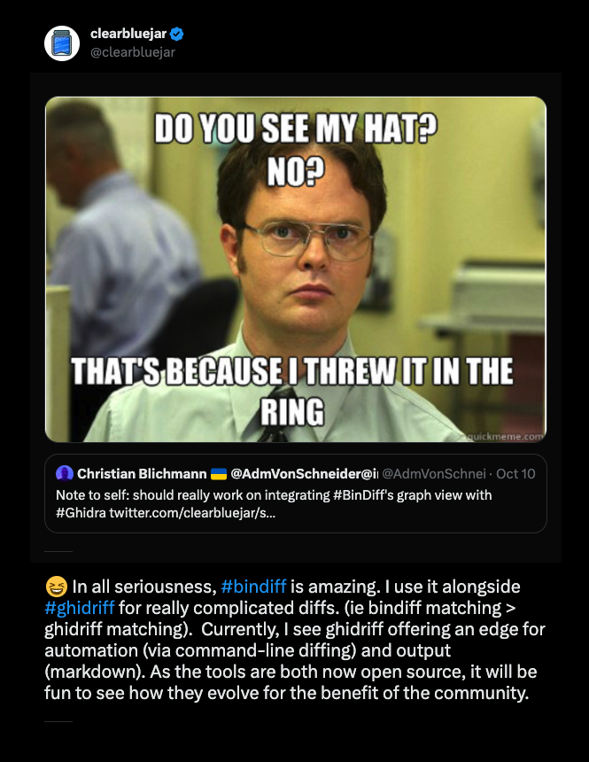

> 😆 In all seriousness, #bindiff is amazing. I use it alongside #ghidriff for really complicated diffs. (ie bindiff matching > ghidriff matching).  Currently, I see ghidriff offering an edge for automation (via command-line diffing) and output (markdown). As the tools are both now open source, it will be fun to see how they evolve for the benefit of the community.  - [Tweet](https://twitter.com/clearbluejar/status/1712095731924779370)