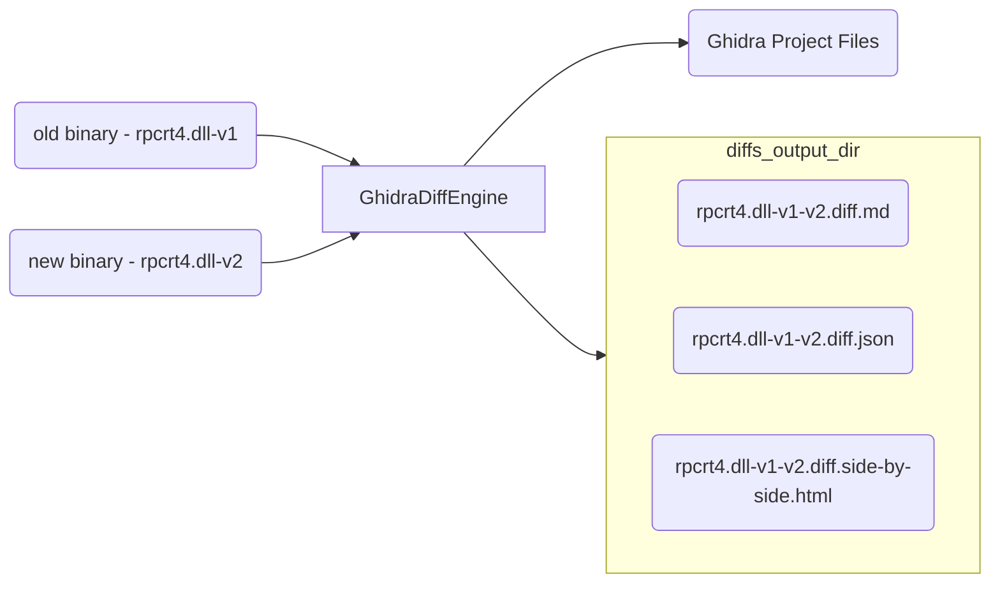

### Sample Diffs

    
    
    

### Features

- Command Line (patch diffing workflow reduced to a single step)
- Highlights important changes in the TOC
- Fast - Can diff the full Windows kernel in less than a minute (after Ghidra analysis is complete)
- Enables Social Diffing
  - Beautiful Markdown Output
  - Easily hosted in a GitHub or GitLab gist, blog, or anywhere markdown is supported
  - Visual Diff Graph Results
- Supports both unified and side by side diff results (unified is default)
- Provides unique Meta Diffs:
  - Binary Strings
  - Called
  - Calling
  - Binary Metadata
- Batteries Included
  - Docker support
  - Automated Testing
  - Ghidra (No license required)

See below for [CVE diffs and sample usage](#sample-usage)

### Design Goals

- Find all added, deleted, and modified functions
- Provide foundation for automation
- Simple, Fast, Accurate
- Resilient
- Extendable
- Easy sharing of results
- Social Diffing

### Powered by Ghidra

The heavy lifting of the binary analysis is done by Ghidra and the diffing is possible via Ghidra's Program API.  `ghidriff` provides a diffing [workflow](#engine), function matching, and resulting markdown and HTML diff output.

