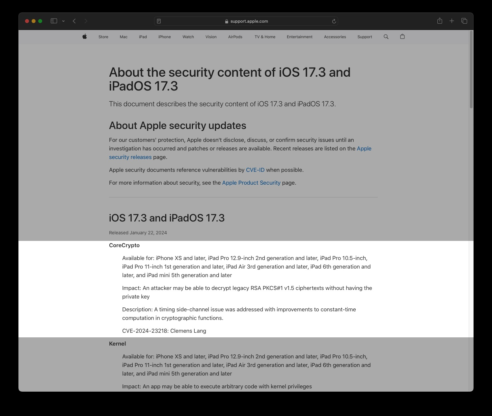

## Setup

Start with taking a look at the apple security update from Jan 2024:




Extract the `libcorecrypo.dylib` from the dyld_shared_cache...

## Run `ghidirff`:

```bash
$ ghidriff libcorecrypto.dylib-14.2.1 libcorecrypto.dylib-14.3
```

### Analyze the Diff

Results in this beatiful markdown: 

- gist - [libcorecrypto.dylib-14.2.1-libcorecrypto.dylib-14.3.ios.ghidriff.md](https://gist.github.com/clearbluejar/395b6c4efb49b91217abb15b816223b8)
- docs - [libcorecrypto.dylib-14.2.1-libcorecrypto.dylib-14.3.ios.ghidriff.md](/diffs/Samples/Mac/libcorecrypto.dylib-14.2.1-libcorecrypto.dylib-14.3)


---


